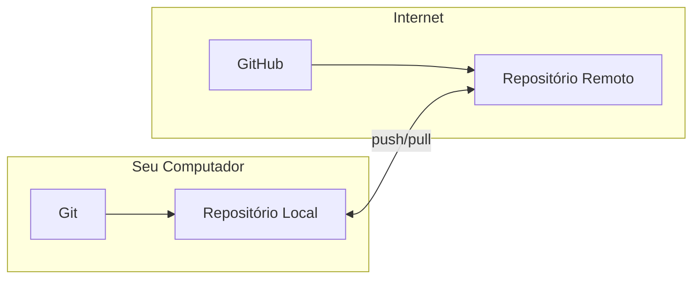
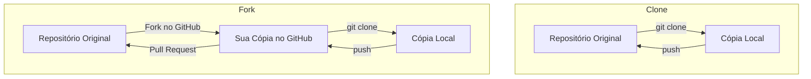
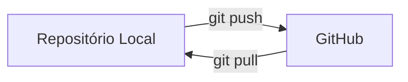
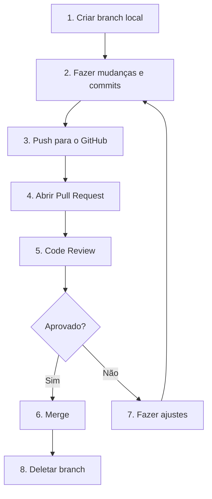
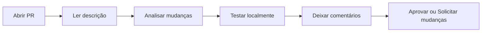
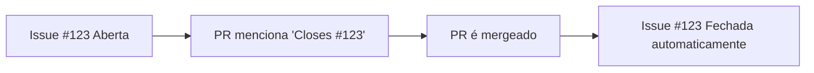
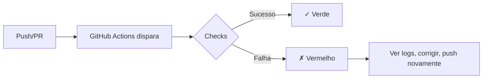
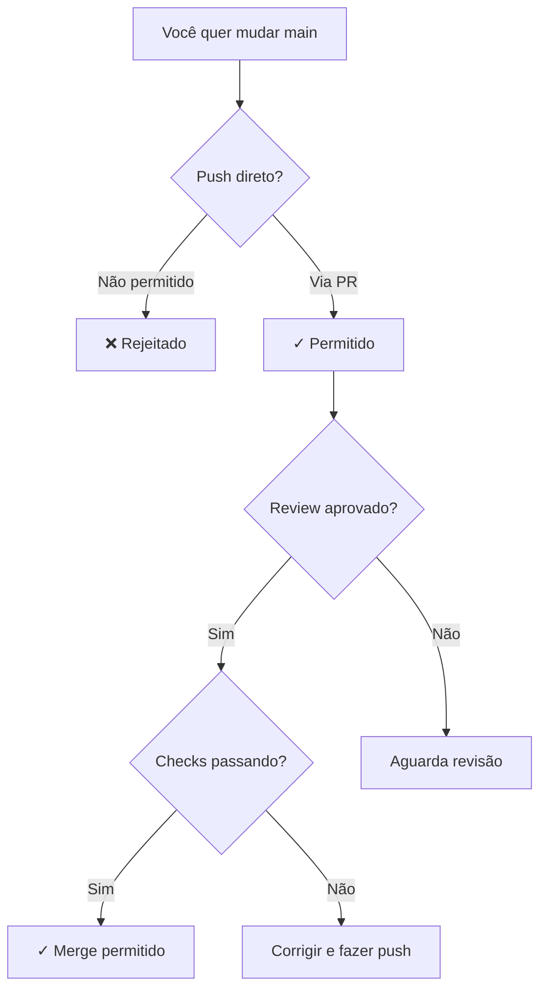
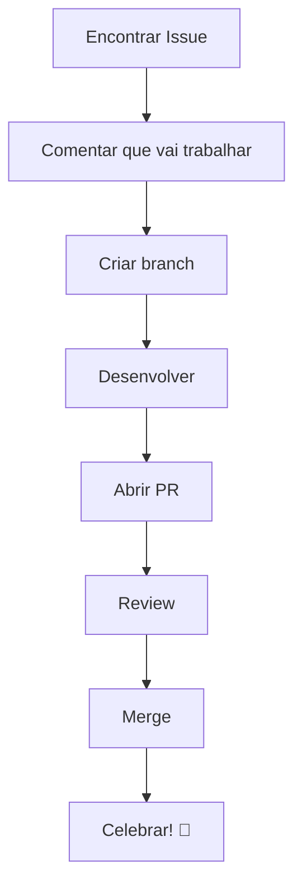

# GitHub Colaboração

> Guia para usar o GitHub e colaborar com o time. Aprenda desde o básico (criar conta, clonar repositórios) até o fluxo completo de Pull Requests.

---

## Parte 1: Nível Básico

### Git vs GitHub: Qual a Diferença?

Uma confusão comum é misturar Git com GitHub. São coisas diferentes:

| Git | GitHub |
|-----|--------|
| Software instalado no seu computador | Site/serviço na nuvem |
| Controle de versão local | Hospedagem de repositórios |
| Funciona offline | Precisa de internet |
| Ferramenta de linha de comando | Interface web + funcionalidades extras |



**Resumindo**: Git é o motor, GitHub é a garagem compartilhada onde você estaciona seu código para outros acessarem.

### Criando sua Conta no GitHub

1. Acesse [github.com](https://github.com)
2. Clique em "Sign up"
3. Siga o processo de criação
4. **Importante**: Use um email que você acessa frequentemente

> **Dica para o DestaquesGovBr**: Use o mesmo email configurado no seu Git local para que os commits apareçam vinculados ao seu perfil.

### Configurando SSH (Recomendado)

SSH permite autenticação segura sem digitar senha toda hora.

#### Passo 1: Gerar chave SSH

```bash
# Gera um par de chaves (pública e privada)
ssh-keygen -t ed25519 -C "seu.email@exemplo.com"

# Quando perguntar onde salvar, pressione Enter (usa o padrão)
# Quando perguntar a senha (passphrase), pode deixar vazio ou criar uma
```

#### Passo 2: Adicionar ao ssh-agent

```bash
# Inicia o ssh-agent
eval "$(ssh-agent -s)"

# Adiciona sua chave
ssh-add ~/.ssh/id_ed25519
```

#### Passo 3: Adicionar chave ao GitHub

```bash
# Copia a chave pública para a área de transferência

# macOS
cat ~/.ssh/id_ed25519.pub | pbcopy

# Linux
cat ~/.ssh/id_ed25519.pub | xclip -selection clipboard

# Windows (Git Bash)
cat ~/.ssh/id_ed25519.pub | clip
```

1. No GitHub, vá em **Settings** → **SSH and GPG keys**
2. Clique em **New SSH key**
3. Cole a chave e dê um nome (ex: "Meu notebook")
4. Clique em **Add SSH key**

#### Passo 4: Testar conexão

```bash
ssh -T git@github.com
```

Deve aparecer:

```
Hi seu-usuario! You've successfully authenticated...
```

### Clone vs Fork

Duas formas de obter uma cópia de um repositório:



| Ação | Quando usar |
|------|-------------|
| **Clone** | Você tem permissão de escrita no repositório |
| **Fork** | Você NÃO tem permissão, quer contribuir via Pull Request |

### Seu Primeiro Clone

Para repositórios do DestaquesGovBr que você tem acesso:

```bash
# Via SSH (recomendado)
git clone git@github.com:destaquesgovbr/destaquesgovbr-scraper.git

# Via HTTPS (pede senha/token)
git clone https://github.com/destaquesgovbr/destaquesgovbr-scraper.git

# Entre na pasta do projeto
cd destaquesgovbr-scraper
```

### Push e Pull: Sincronizando com o Remoto

#### Enviando suas mudanças (push)

```bash
# Depois de fazer commits locais
git push origin main

# Se for uma branch nova
git push -u origin minha-branch
```

A flag `-u` (ou `--set-upstream`) configura o rastreamento, então nas próximas vezes basta `git push`.

#### Baixando atualizações (pull)

```bash
# Baixa e integra mudanças do remoto
git pull origin main

# Ou se já configurou upstream
git pull
```



> **Boa prática**: Sempre faça `git pull` antes de começar a trabalhar para ter a versão mais recente.

### README e Arquivos Especiais

Todo repositório bem organizado tem alguns arquivos importantes:

| Arquivo | Propósito |
|---------|-----------|
| `README.md` | Apresentação do projeto, como instalar e usar |
| `LICENSE` | Licença de uso do código |
| `CONTRIBUTING.md` | Como contribuir com o projeto |
| `.gitignore` | Arquivos que o Git deve ignorar |
| `.env.example` | Modelo de variáveis de ambiente |

---

## Parte 2: Nível Intermediário

### Pull Requests (PRs)

Pull Request é a forma de propor mudanças em um repositório. É o coração da colaboração no GitHub.

#### Fluxo Completo de um PR



#### Passo a Passo

**1. Criar branch a partir de main atualizada:**

```bash
git checkout main
git pull origin main
git checkout -b feature/minha-mudanca
```

**2. Fazer suas mudanças e commits:**

```bash
# Edite os arquivos...
git add .
git commit -m "feat: adiciona nova funcionalidade X"
```

**3. Enviar para o GitHub:**

```bash
git push -u origin feature/minha-mudanca
```

**4. Abrir o PR:**

- Acesse o repositório no GitHub
- Você verá um botão "Compare & pull request"
- Ou vá em "Pull requests" → "New pull request"

**5. Preencher o PR:**

- **Título**: Descreva a mudança de forma clara
- **Descrição**: Explique o que foi feito, por quê, e como testar

**Exemplo de descrição:**

```markdown
## O que foi feito
- Adiciona endpoint para exportar dados em CSV
- Implementa filtro por data

## Por que
Usuários precisam exportar relatórios para análise externa.

## Como testar
1. Execute `python manage.py runserver`
2. Acesse `/api/export?format=csv`
3. Verifique se o arquivo é baixado corretamente

## Checklist
- [x] Código segue padrões do projeto
- [x] Testes passando
- [ ] Documentação atualizada
```

### Code Review

#### Como receber review

- Seja receptivo a feedback
- Responda comentários explicando suas decisões
- Faça os ajustes solicitados em novos commits
- Marque conversas como resolvidas após ajustar

#### Como fazer review



**Tipos de comentários:**

| Ícone | Significado |
|-------|-------------|
| Comentário simples | Observação, não bloqueia o merge |
| Request changes | Precisa ser resolvido antes do merge |
| Approve | Aprovado, pode fazer merge |

**Dicas para bons reviews:**

- Seja específico: "Na linha 42, considere usar `map()` em vez de `for`"
- Seja construtivo: Explique o porquê da sugestão
- Reconheça o bom: "Boa solução para esse caso!"

### Issues

Issues são usadas para:

- Reportar bugs
- Sugerir funcionalidades
- Documentar tarefas
- Discutir ideias

#### Anatomia de uma boa Issue

```markdown
## Descrição
Explique claramente o problema ou sugestão.

## Passos para reproduzir (se for bug)
1. Faça isso
2. Depois aquilo
3. Observe o erro

## Comportamento esperado
O que deveria acontecer.

## Comportamento atual
O que está acontecendo.

## Ambiente
- OS: Ubuntu 22.04
- Python: 3.11
- Browser: Chrome 120
```

#### Linkando Issues com PRs

Quando seu PR resolve uma issue, use palavras-chave na descrição:

```markdown
Closes #123
Fixes #456
Resolves #789
```

O GitHub fecha automaticamente a issue quando o PR é mergeado.



### GitHub Actions (Visão Geral)

GitHub Actions executa automações quando eventos acontecem no repositório.

#### O que são Workflows?

Arquivos YAML em `.github/workflows/` que definem:

- **Quando** executar (push, PR, schedule)
- **O que** executar (testes, deploy, lint)
- **Onde** executar (Ubuntu, Windows, macOS)

#### Verificando Status dos Workflows

No seu PR, você verá os checks:

```
✓ Tests passing
✓ Lint passing
✗ Build failed
```

- **Verde**: Passou
- **Vermelho**: Falhou (clique para ver os logs)
- **Amarelo**: Em execução



#### Workflows do DestaquesGovBr

| Workflow | O que faz |
|----------|-----------|
| `tests.yml` | Roda testes automatizados |
| `lint.yml` | Verifica formatação do código |
| `deploy.yml` | Deploy automático após merge |

> **Dica**: Se um check falhar, clique nele para ver os logs e entender o que deu errado.

### Proteção de Branches

A branch `main` geralmente é protegida, significando que:

- Não pode receber push direto
- Mudanças devem vir via Pull Request
- PRs precisam de aprovação antes do merge
- Checks devem passar



**Por que isso existe?**

- Garante revisão de código
- Evita quebrar a branch principal
- Mantém histórico limpo
- Assegura qualidade (testes passando)

### Colaboração no DestaquesGovBr

#### Repositórios Principais

| Repositório | Descrição |
|-------------|-----------|
| [destaquesgovbr-scraper](https://github.com/destaquesgovbr/destaquesgovbr-scraper) | Pipeline de coleta de dados |
| [portal](https://github.com/destaquesgovbr/portal) | Frontend Next.js |
| [docs](https://github.com/destaquesgovbr/docs) | Esta documentação |

#### Fluxo de Contribuição



1. **Encontre uma issue** com label `good first issue` ou `help wanted`
2. **Comente** na issue que você vai trabalhar nela
3. **Crie uma branch** seguindo a convenção: `feature/`, `fix/`, `docs/`
4. **Desenvolva** seguindo os padrões do projeto
5. **Abra um PR** referenciando a issue
6. **Aguarde review** e faça ajustes se necessário
7. **Merge!** Sua contribuição está no projeto

---

## Resumo de Comandos

| Comando | O que faz |
|---------|-----------|
| `git clone <url>` | Clona um repositório |
| `git remote -v` | Lista repositórios remotos |
| `git push origin <branch>` | Envia commits para o remoto |
| `git pull origin <branch>` | Baixa e integra mudanças |
| `git fetch` | Baixa mudanças sem integrar |
| `ssh -T git@github.com` | Testa conexão SSH |

---

## Próximos Passos

Continue sua jornada:

- [Primeiro PR](primeiro-pr.md): Tutorial prático para sua primeira contribuição
- [Troubleshooting](troubleshooting.md): Soluções para problemas comuns

---

> **Dúvidas?** Pergunte no canal do time ou abra uma issue na documentação.
