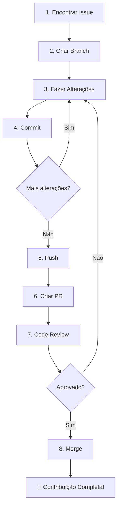

# Guia do Primeiro PR

> Como fazer sua primeira contribuição ao projeto DestaquesGovbr.

## Antes de Começar

Certifique-se de que você:

- [ ] Completou o setup do ambiente ([Backend](./setup-backend.md) ou [Frontend](./setup-frontend.md))
- [ ] Consegue rodar a aplicação localmente
- [ ] Tem acesso de escrita ao repositório (ou pode fazer fork)

---

## 1. Encontrar uma Issue

### Onde procurar

- [Issues do Scraper](https://github.com/destaquesgovbr/govbrnews-scraper/issues)
- [Issues do Portal](https://github.com/destaquesgovbr/destaquesgovbr-portal/issues)

### Labels para iniciantes

Procure issues com as labels:

| Label              | Significado                      |
| ------------------ | -------------------------------- |
| `good first issue` | Ideal para primeira contribuição |
| `help wanted`      | Contribuições bem-vindas         |
| `documentation`    | Melhorias de documentação        |
| `bug`              | Correção de bugs                 |

### Se não encontrar uma issue

1. Pergunte ao tech lead sobre tarefas disponíveis
2. Identifique melhorias na documentação
3. Reporte um bug que você encontrou

---

## 2. Criar Branch

### Convenção de nomes

```bash
# Features
git checkout -b feature/descricao-curta

# Bug fixes
git checkout -b fix/descricao-do-bug

# Documentação
git checkout -b docs/descricao

# Refatoração
git checkout -b refactor/descricao
```

### Exemplos

```bash
git checkout -b feature/adicionar-filtro-data
git checkout -b fix/corrigir-parsing-ebc
git checkout -b docs/atualizar-readme
```

---

## 3. Fazer Alterações

### Boas práticas

- **Commits pequenos**: Faça commits frequentes e focados
- **Uma coisa por vez**: Cada PR deve resolver uma issue específica
- **Testes**: Adicione/atualize testes quando aplicável
- **Documentação**: Atualize docs se necessário

### Padrões de código

#### Backend (Python)

```bash
# Formatação
poetry run black src/

# Linting
poetry run ruff check src/

# Verificar antes de commitar
poetry run pytest
```

#### Frontend (TypeScript)

```bash
# Formatação e lint
pnpm lint:fix

# Verificar tipos
pnpm type-check

# Verificar antes de commitar
pnpm build
```

---

## 4. Commits

### Convenção de mensagens

Usamos [Conventional Commits](https://www.conventionalcommits.org/):

```
<tipo>(<escopo>): <descrição>

[corpo opcional]

[rodapé opcional]
```

### Tipos comuns

| Tipo       | Uso                            |
| ---------- | ------------------------------ |
| `feat`     | Nova funcionalidade            |
| `fix`      | Correção de bug                |
| `docs`     | Documentação                   |
| `style`    | Formatação (não altera código) |
| `refactor` | Refatoração                    |
| `test`     | Testes                         |
| `chore`    | Manutenção                     |

### Exemplos

```bash
# Feature
git commit -m "feat(scraper): adicionar suporte a paginação infinita"

# Bug fix
git commit -m "fix(portal): corrigir filtro de data no mobile"

# Documentação
git commit -m "docs: atualizar guia de contribuição"

# Refatoração
git commit -m "refactor(api): extrair lógica de busca para hook"
```

---

## 5. Push e Pull Request

### Fazer push

```bash
# Primeiro push da branch
git push -u origin feature/sua-feature

# Pushes subsequentes
git push
```

### Criar PR no GitHub

1. Acesse o repositório no GitHub
2. Clique em "Compare & pull request"
3. Preencha o template

### Template de PR

```markdown
## Descrição

Breve descrição do que foi feito.

## Tipo de mudança

- [ ] Bug fix
- [ ] Nova feature
- [ ] Breaking change
- [ ] Documentação

## Issue relacionada

Fixes #123

## Como testar

1. Passo 1
2. Passo 2
3. Resultado esperado

## Checklist

- [ ] Código segue os padrões do projeto
- [ ] Testes adicionados/atualizados
- [ ] Documentação atualizada
- [ ] Build local passou
```

---

## 6. Code Review

### O que esperar

- Feedback em 1-2 dias úteis
- Sugestões de melhorias
- Perguntas sobre decisões técnicas
- Aprovação ou pedido de mudanças

### Responder ao feedback

```bash
# Fazer alterações solicitadas
git add .
git commit -m "fix: aplicar sugestões do code review"
git push
```

### Dicas para um bom review

- Seja receptivo ao feedback
- Pergunte se algo não estiver claro
- Explique suas decisões técnicas
- Agradeça o tempo do revisor

---

## 7. Merge

Após aprovação:

1. **Squash and merge** (padrão): Combina todos os commits em um
2. O PR será mergeado pelo revisor ou por você
3. A branch pode ser deletada após o merge

---

## Fluxo Visual



---

## Checklist do Primeiro PR

- [ ] Branch criada com nome apropriado
- [ ] Código segue padrões do projeto
- [ ] Testes passando localmente
- [ ] Lint/formatação executados
- [ ] Commits com mensagens claras
- [ ] PR criado com descrição completa
- [ ] Issue linkada no PR

---

## Exemplos de Primeiro PR

### Backend: Adicionar novo órgão

1. Editar `src/scraper/site_urls.yaml`
2. Editar `src/scraper/agencies.yaml`
3. Testar scraping do novo órgão
4. Criar PR

### Frontend: Corrigir estilo de componente

1. Identificar componente com problema
2. Ajustar CSS/Tailwind
3. Testar em diferentes resoluções
4. Criar PR

### Documentação: Melhorar README

1. Identificar seção desatualizada
2. Atualizar conteúdo
3. Revisar ortografia
4. Criar PR

---

## Dúvidas Frequentes

### Posso trabalhar em mais de uma issue por vez?

Sim, mas mantenha branches separadas para cada issue.

### Quanto tempo leva para um PR ser revisado?

Normalmente 1-2 dias úteis. Se demorar mais, pergunte no canal do projeto.

### O que fazer se meu PR tiver conflitos?

```bash
# Atualizar main local
git checkout main
git pull

# Voltar para sua branch e fazer rebase
git checkout sua-branch
git rebase main

# Resolver conflitos se necessário
# Depois fazer force push
git push --force-with-lease
```

### Posso commitar direto na main?

Não. Todo código deve passar por PR e code review.

---

## Próximos Passos

Após seu primeiro PR:

1. Celebre! 🎉
2. Procure issues mais desafiadoras
3. Ajude a revisar PRs de outros
4. Contribua com a documentação

→ Veja [Troubleshooting](./troubleshooting.md) para problemas comuns
