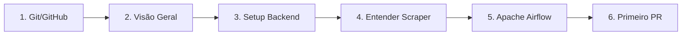

# Roteiro de Onboarding

> Guia para novos desenvolvedores se integrarem ao projeto DestaquesGovbr.

## Bem-vindo!

O DestaquesGovbr é uma plataforma que centraliza e enriquece notícias governamentais brasileiras. Este roteiro vai guiá-lo através do processo de onboarding.

**Acesse o portal**: [portal-klvx64dufq-rj.a.run.app](https://portal-klvx64dufq-rj.a.run.app/) *(URL provisória)*

## Pré-requisitos Comuns

Antes de começar, certifique-se de ter:

| Ferramenta | Versão | Verificação |
|------------|--------|-------------|
| Git | 2.40+ | `git --version` |
| Docker | 24+ | `docker --version` |
| Docker Compose | 2.20+ | `docker compose version` |
| VS Code ou IDE preferida | - | - |

### Fundamentos Git e GitHub

Se você é novo em Git ou GitHub, comece por aqui:

| Guia | Descrição | Tempo |
|------|-----------|-------|
| [Git Fundamentos](./git-fundamentos.md) | Do zero ao intermediário: commits, branches, merge | 1-2h |
| [GitHub Colaboração](./github-colaboracao.md) | Clone, PRs, issues, code review | 1h |

> **Dica**: Mesmo que você já conheça Git, vale revisar a seção de [Boas Práticas de Commits](./git-fundamentos.md#boas-praticas-de-commits) que segue o padrão do projeto.

### Acesso Necessário

- [ ] Conta GitHub com acesso à [organização destaquesgovbr](https://github.com/destaquesgovbr)
- [ ] Chave SSH configurada ([tutorial](./github-colaboracao.md#configurando-ssh-recomendado))
- [ ] Acesso ao GCP (solicitar ao tech lead se necessário)
- [ ] Token HuggingFace (para desenvolvimento do scraper)

---

## Trilhas por Perfil

### Desenvolvedor Backend (Python)

**Foco**: Scraper, pipeline de dados, integrações, orquestração com Airflow

**Ordem de leitura:**

1. [Git Fundamentos](./git-fundamentos.md) + [GitHub Colaboração](./github-colaboracao.md) (2-3 horas)
2. [Visão Geral da Arquitetura](../arquitetura/visao-geral.md) (30 min)
3. [Fluxo de Dados](../arquitetura/fluxo-de-dados.md) (20 min)
4. [Setup Backend](./setup-backend.md) (1-2 horas)
5. [Módulo Scraper](../modulos/scraper.md) (quando disponível)
6. [**Apache Airflow**](./airflow-tutorial.md) (3-5 horas)
7. [Primeiro PR](./primeiro-pr.md) (30 min)

**Exercícios práticos:**

1. Rodar o scraper localmente para um órgão específico
2. Verificar os dados no HuggingFace após uma execução
3. Adicionar uma nova fonte de dados (site gov.br)
4. Executar o pipeline de enriquecimento manualmente
5. Configurar ambiente Airflow local com Astro CLI
6. Criar primeira DAG de exemplo seguindo o tutorial

---

### Desenvolvedor Frontend (TypeScript)

**Foco**: Portal Next.js, UI/UX, busca Typesense

**Ordem de leitura:**

1. [Git Fundamentos](./git-fundamentos.md) + [GitHub Colaboração](./github-colaboracao.md) (2-3 horas)
2. [Visão Geral da Arquitetura](../arquitetura/visao-geral.md) (30 min)
3. [Componentes Estruturantes](../arquitetura/componentes-estruturantes.md) (20 min)
4. [Setup Frontend](./setup-frontend.md) (1-2 horas)
5. [Módulo Portal](../modulos/portal.md) (quando disponível)
6. [Primeiro PR](./primeiro-pr.md) (30 min)

**Exercícios práticos:**

1. Rodar o portal localmente com Typesense
2. Fazer uma busca e entender os filtros
3. Modificar um componente de UI
4. Adicionar um novo filtro ou campo de busca

---

## Semana 1: Imersão

### Dia 1-2: Contexto e Setup

| Tarefa | Tempo | Recurso |
|--------|-------|---------|
| Aprender Git (se iniciante) | 1-2h | [git-fundamentos.md](./git-fundamentos.md) |
| Configurar GitHub e SSH | 30 min | [github-colaboracao.md](./github-colaboracao.md) |
| Ler visão geral da arquitetura | 30 min | [visao-geral.md](../arquitetura/visao-geral.md) |
| Ler fluxo de dados | 20 min | [fluxo-de-dados.md](../arquitetura/fluxo-de-dados.md) |
| Setup do ambiente | 1-2h | [setup-backend.md](./setup-backend.md) ou [setup-frontend.md](./setup-frontend.md) |
| Explorar o dataset no HuggingFace | 30 min | [govbrnews dataset](https://huggingface.co/datasets/nitaibezerra/govbrnews) |

### Dia 3-4: Hands-on

| Tarefa | Tempo | Recurso |
|--------|-------|---------|
| Rodar aplicação localmente | 1h | Guia de setup |
| Explorar código do módulo principal | 2h | Repositório |
| Fazer pequena modificação local | 1h | - |
| Entender GitHub Actions | 1h | `.github/workflows/` |

### Dia 5: Contribuição

| Tarefa | Tempo | Recurso |
|--------|-------|---------|
| Ler guia de primeiro PR | 30 min | [primeiro-pr.md](./primeiro-pr.md) |
| Escolher uma issue para trabalhar | 30 min | GitHub Issues |
| Submeter primeiro PR | 2h | - |

---

## Mapa de Competências

### Backend (Python)

| Competência | Nível Esperado | Como Desenvolver |
|-------------|----------------|------------------|
| Python 3.12+ | Intermediário | Prática no scraper |
| Poetry | Básico | Setup do projeto |
| BeautifulSoup | Básico | Webscraper.py |
| Pandas/Datasets | Básico | DatasetManager |
| APIs REST | Intermediário | Integração Cogfy |
| GitHub Actions | Básico | Workflows |
| **Apache Airflow** | Básico → Intermediário | [Tutorial Airflow](./airflow-tutorial.md) |
| **Cloud Pub/Sub** | Básico → Intermediário | [Tutorial Pub/Sub](./cloud-pubsub-tutorial.md) |
| Astro CLI | Básico | Setup ambiente local |

### Frontend (TypeScript)

| Competência | Nível Esperado | Como Desenvolver |
|-------------|----------------|------------------|
| TypeScript | Intermediário | Todo o portal |
| Next.js 15 | Intermediário | App Router |
| React | Intermediário | Componentes |
| Typesense | Básico | Cliente de busca |
| Tailwind CSS | Básico | Estilização |
| shadcn/ui | Básico | Componentes UI |

---

## Repositórios Principais

| Repositório | Descrição | Quem Usa |
|-------------|-----------|----------|
| [scraper](https://github.com/destaquesgovbr/scraper) | Pipeline de dados | Backend |
| [portal](https://github.com/destaquesgovbr/portal) | Portal web | Frontend |
| [typesense](https://github.com/destaquesgovbr/typesense) | Typesense local | Ambos |
| [infra](https://github.com/destaquesgovbr/infra) | Infraestrutura | DevOps |
| [agencies](https://github.com/destaquesgovbr/agencies) | Dados de órgãos | Ambos |

---

## Canais de Comunicação

- **Dúvidas técnicas**: Slack/Teams (canal do projeto)
- **Issues e PRs**: GitHub
- **Documentação**: Este repositório

---

## Checklist de Onboarding

### Todos os Desenvolvedores

- [ ] Completei o guia [Git Fundamentos](./git-fundamentos.md) (ou já domino Git)
- [ ] Configurei minha chave SSH no GitHub
- [ ] Li a visão geral da arquitetura
- [ ] Entendi o fluxo de dados do pipeline
- [ ] Tenho acesso aos repositórios necessários
- [ ] Configurei meu ambiente de desenvolvimento
- [ ] Rodei a aplicação localmente
- [ ] Explorei o dataset no HuggingFace
- [ ] Submeti meu primeiro PR

### Backend Específico

- [ ] Rodei o scraper para um órgão específico
- [ ] Entendi a integração com Cogfy
- [ ] Entendi como funciona o DatasetManager
- [ ] Executei o workflow de testes
- [ ] Configurei ambiente Airflow local (Astro CLI)
- [ ] Criei minha primeira DAG
- [ ] Completei pelo menos 3 exercícios do tutorial Airflow
- [ ] Completei o [Tutorial Cloud Pub/Sub](./cloud-pubsub-tutorial.md)
- [ ] Publiquei e consumi mensagens no Pub/Sub

### Frontend Específico

- [ ] Rodei o Typesense local
- [ ] Entendi a estrutura de páginas do Next.js
- [ ] Entendi como funcionam os filtros de busca
- [ ] Modifiquei um componente shadcn/ui

---

## Dúvidas Frequentes

### Onde encontro as credenciais?

- **HuggingFace**: Criar token em [huggingface.co/settings/tokens](https://huggingface.co/settings/tokens)
- **Cogfy**: Solicitar ao tech lead
- **GCP**: Solicitar acesso ao projeto

### O que fazer se algo não funcionar?

1. Consulte o [troubleshooting.md](./troubleshooting.md)
2. Verifique as issues abertas no GitHub
3. Pergunte no canal do projeto

### Como acompanhar as atualizações?

- Watch nos repositórios principais
- Participar das reuniões de sprint
- Ler as release notes

---

## Próximos Passos

Após completar o onboarding básico:

1. **Aprofundar** no módulo de interesse
2. **Contribuir** com issues de complexidade crescente
3. **Documentar** aprendizados e melhorias
4. **Mentorar** próximos devs que entrarem

---

→ Continue com [Setup Backend](./setup-backend.md) ou [Setup Frontend](./setup-frontend.md)
