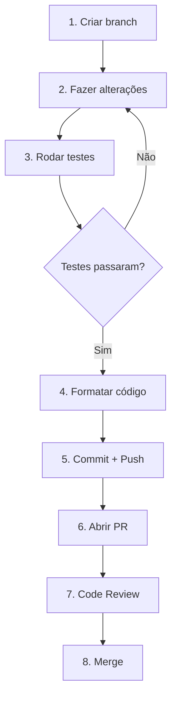

# Setup Backend (Python)

> Guia de configuração do ambiente para desenvolvedores Python trabalhando no data-platform e pipeline de dados.

## Pré-requisitos

| Ferramenta | Versão | Instalação |
|------------|--------|------------|
| Python | 3.12+ | [python.org](https://www.python.org/downloads/) ou pyenv |
| Poetry | 1.7+ | [poetry docs](https://python-poetry.org/docs/#installation) |
| Docker | 24+ | [docker.com](https://www.docker.com/products/docker-desktop/) |
| Git | 2.40+ | [git-scm.com](https://git-scm.com/) |

### Verificação

```bash
python --version    # Python 3.12.x
poetry --version    # Poetry 1.7.x ou superior
docker --version    # Docker 24.x ou superior
git --version       # Git 2.40.x ou superior
```

---

## 1. Clonar Repositório

```bash
# Clone o repositório data-platform
git clone https://github.com/destaquesgovbr/data-platform.git
cd data-platform
```

---

## 2. Instalar Dependências

```bash
# Instalar dependências com Poetry
poetry install

# Ativar ambiente virtual
poetry shell
```

### Verificar instalação

```bash
# Deve mostrar a ajuda do CLI
data-platform --help
```

---

## 3. Configurar Variáveis de Ambiente

Crie um arquivo `.env` na raiz do projeto:

```bash
cp .env.example .env  # Se existir template
```

Ou crie manualmente:

```bash
# .env

# PostgreSQL (fonte de verdade)
POSTGRES_HOST=localhost  # ou IP do Cloud SQL via proxy
POSTGRES_PORT=5432
POSTGRES_DB=destaquesgovbr
POSTGRES_USER=admin
POSTGRES_PASSWORD=xxxxx

# Cogfy (enriquecimento)
COGFY_API_KEY=sk-xxxxxxxxxxxxxxxxxxxxx
COGFY_COLLECTION_ID=xxxxxxxx-xxxx-xxxx-xxxx-xxxxxxxxxxxx

# Embeddings API
EMBEDDINGS_API_URL=https://embeddings-xxx.run.app

# Typesense
TYPESENSE_HOST=localhost
TYPESENSE_PORT=8108
TYPESENSE_API_KEY=xyz

# HuggingFace (opcional - para sync)
HF_TOKEN=hf_xxxxxxxxxxxxxxxxxxxxx
```

### Obter credenciais

| Credencial | Onde obter |
|------------|------------|
| PostgreSQL | Solicitar ao tech lead (acesso via Cloud SQL Proxy) |
| `COGFY_API_KEY` | Solicitar ao tech lead |
| `COGFY_COLLECTION_ID` | Solicitar ao tech lead |
| `EMBEDDINGS_API_URL` | Solicitar ao tech lead |
| `HF_TOKEN` | [huggingface.co/settings/tokens](https://huggingface.co/settings/tokens) |

---

## 4. Estrutura do Projeto

```
data-platform/
├── src/data_platform/
│   ├── cli.py                    # CLI principal (Typer)
│   ├── managers/
│   │   ├── postgres_manager.py   # Acesso ao PostgreSQL
│   │   └── storage_adapter.py    # Abstração de storage
│   ├── scrapers/
│   │   ├── webscraper.py         # Scraper genérico gov.br
│   │   ├── ebc_webscraper.py     # Scraper EBC
│   │   ├── scrape_manager.py     # Orquestração
│   │   ├── agencies.yaml         # Mapeamento de órgãos
│   │   └── site_urls.yaml        # URLs de raspagem
│   ├── cogfy/
│   │   ├── cogfy_manager.py      # Cliente Cogfy API
│   │   ├── upload_manager.py     # Upload para inferência
│   │   └── enrichment_manager.py # Busca resultados Cogfy
│   ├── enrichment/
│   │   └── themes_tree.yaml      # Árvore temática (25 temas)
│   ├── typesense/
│   │   ├── client.py             # Cliente Typesense
│   │   └── indexer.py            # Indexação de documentos
│   ├── jobs/
│   │   ├── embeddings/           # Geração de embeddings
│   │   └── typesense/            # Sync com Typesense
│   └── dags/                     # DAGs do Airflow
├── tests/                        # Testes unitários
├── .github/workflows/            # GitHub Actions
├── pyproject.toml                # Dependências Poetry
└── Dockerfile                    # Build Docker
```

---

## 5. Conectar ao PostgreSQL

### Opção A: Cloud SQL Proxy (Desenvolvimento)

```bash
# Instalar Cloud SQL Proxy
# macOS
brew install cloud-sql-proxy

# Autenticar
gcloud auth application-default login

# Iniciar proxy
cloud_sql_proxy -instances=PROJECT_ID:southamerica-east1:destaquesgovbr-postgres=tcp:5432
```

### Opção B: Túnel SSH (Via Dev VM)

```bash
# SSH com túnel
gcloud compute ssh devvm --zone=southamerica-east1-a -- -L 5432:10.x.x.x:5432
```

### Verificar conexão

```bash
# Via psql
psql -h localhost -U admin -d destaquesgovbr

# Via Python
python -c "from src.data_platform.managers.postgres_manager import PostgresManager; pm = PostgresManager(); print(pm.get_news_count())"
```

---

## 6. Scraper (Repo Separado)

!!! note "Scraper Standalone"
    O scraping agora é feito pelo repositório separado [destaquesgovbr/scraper](https://github.com/destaquesgovbr/scraper), via API FastAPI + DAGs Airflow.
    Veja [Módulo Scraper](../modulos/scraper.md) para setup local.

---

## 7. Testar Integração Cogfy

### Upload para Cogfy

```bash
data-platform upload-cogfy --start-date 2024-12-01 --end-date 2024-12-03
```

### Buscar enriquecimento

```bash
# Aguardar ~20 minutos após upload
data-platform enrich --start-date 2024-12-01 --end-date 2024-12-03
```

---

## 8. Setup Typesense Local

Para testar a busca localmente:

```bash
# Criar docker-compose.yml para Typesense
cat > docker-compose.yml << 'EOF'
version: '3.8'
services:
  typesense:
    image: typesense/typesense:0.25.2
    container_name: typesense
    ports:
      - "8108:8108"
    environment:
      - TYPESENSE_API_KEY=xyz
      - TYPESENSE_DATA_DIR=/data
    volumes:
      - typesense-data:/data
volumes:
  typesense-data:
EOF

# Subir Typesense
docker compose up -d

# Verificar se está rodando
curl http://localhost:8108/health
```

### Carregar dados no Typesense

```bash
# Sync do PostgreSQL para Typesense
data-platform sync-typesense --start-date $(date -v-7d +%Y-%m-%d)
```

---

## 9. Executar Testes

```bash
# Executar todos os testes
poetry run pytest

# Executar com coverage
poetry run pytest --cov=src

# Executar teste específico
poetry run pytest tests/test_webscraper.py -v
```

---

## 10. Linting e Formatação

```bash
# Formatação com Black
poetry run black src/

# Linting com Ruff
poetry run ruff check src/

# Type checking com mypy (se configurado)
poetry run mypy src/
```

---

## 11. Build Docker

```bash
# Build da imagem
docker build -t data-platform .

# Executar container
docker run --env-file .env data-platform data-platform --help
```

---

## Comandos Úteis

### CLI do data-platform

```bash
# Ver ajuda
data-platform --help

# Upload para Cogfy
data-platform upload-cogfy --start-date YYYY-MM-DD --end-date YYYY-MM-DD

# Enriquecimento
data-platform enrich --start-date YYYY-MM-DD --end-date YYYY-MM-DD

# Gerar embeddings
data-platform generate-embeddings --start-date YYYY-MM-DD

# Sync Typesense
data-platform sync-typesense --start-date YYYY-MM-DD
```

### Interação com PostgreSQL

```python
# Python interativo
from src.data_platform.managers.postgres_manager import PostgresManager

pm = PostgresManager()

# Contar notícias
print(f"Total de notícias: {pm.get_news_count()}")

# Buscar por agência
gestao_news = pm.get_news_by_agency("gestao", limit=10)
for news in gestao_news:
    print(f"{news['published_at']}: {news['title']}")
```

---

## Arquivos Importantes

| Arquivo | Descrição | Quando Modificar |
|---------|-----------|------------------|
| `src/data_platform/scrapers/site_urls.yaml` | URLs de raspagem | Adicionar novo órgão |
| `src/data_platform/scrapers/agencies.yaml` | Mapeamento ID → Nome | Novo órgão |
| `src/data_platform/enrichment/themes_tree.yaml` | Árvore temática | Novo tema/subtema |
| `pyproject.toml` | Dependências | Nova biblioteca |
| `.github/workflows/main-workflow.yaml` | Pipeline diário | Alterar pipeline |

---

## Fluxo de Desenvolvimento



---

## Troubleshooting

### Erro de conexão com PostgreSQL

```bash
# Verificar se proxy está rodando
ps aux | grep cloud_sql_proxy

# Reiniciar proxy
pkill cloud_sql_proxy
cloud_sql_proxy -instances=PROJECT_ID:southamerica-east1:destaquesgovbr-postgres=tcp:5432
```

### Erro de conexão com Cogfy

- Verificar se `COGFY_API_KEY` está correta
- Verificar se a API está acessível

### Dependências não encontradas

```bash
# Reinstalar dependências
poetry install --sync
```

### Erro de parsing HTML

- Verificar se a estrutura do site mudou
- Consultar logs detalhados
- Atualizar seletores no webscraper.py

---

## Próximos Passos

1. Leia o código do `webscraper.py` para entender o scraping
2. Explore o `postgres_manager.py` para entender o acesso aos dados
3. Execute o pipeline completo localmente
4. Escolha uma issue para trabalhar

→ Continue com [Primeiro PR](./primeiro-pr.md)
