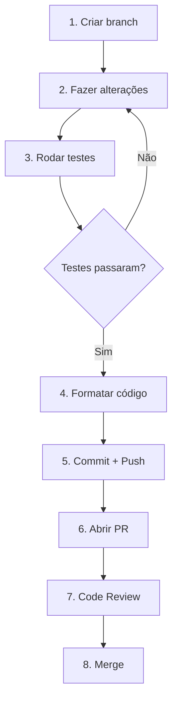

# Setup Backend (Python)

> Guia de configuração do ambiente para desenvolvedores Python trabalhando no scraper e pipeline de dados.

## Pré-requisitos

| Ferramenta | Versão | Instalação |
|------------|--------|------------|
| Python | 3.12+ | [python.org](https://www.python.org/downloads/) ou pyenv |
| Poetry | 1.7+ | [poetry docs](https://python-poetry.org/docs/#installation) |
| Docker | 24+ | [docker.com](https://www.docker.com/products/docker-desktop/) |
| Git | 2.40+ | [git-scm.com](https://git-scm.com/) |

### Verificação

```bash
python --version    # Python 3.12.x
poetry --version    # Poetry 1.7.x ou superior
docker --version    # Docker 24.x ou superior
git --version       # Git 2.40.x ou superior
```

---

## 1. Clonar Repositório

```bash
# Clone o repositório do scraper
git clone https://github.com/destaquesgovbr/govbrnews-scraper.git
cd govbrnews-scraper
```

---

## 2. Instalar Dependências

```bash
# Instalar dependências com Poetry
poetry install

# Ativar ambiente virtual
poetry shell
```

### Verificar instalação

```bash
# Deve mostrar a ajuda do CLI
python src/main.py --help
```

---

## 3. Configurar Variáveis de Ambiente

Crie um arquivo `.env` na raiz do projeto:

```bash
cp .env.example .env  # Se existir template
```

Ou crie manualmente:

```bash
# .env
HF_TOKEN=hf_xxxxxxxxxxxxxxxxxxxxx
COGFY_API_KEY=sk-xxxxxxxxxxxxxxxxxxxxx
COGFY_COLLECTION_ID=xxxxxxxx-xxxx-xxxx-xxxx-xxxxxxxxxxxx
```

### Obter tokens

| Token | Onde obter |
|-------|------------|
| `HF_TOKEN` | [huggingface.co/settings/tokens](https://huggingface.co/settings/tokens) - Criar token com permissão de escrita |
| `COGFY_API_KEY` | Solicitar ao tech lead |
| `COGFY_COLLECTION_ID` | Solicitar ao tech lead |

> **Nota**: Para desenvolvimento local, você pode usar o dataset de staging ou criar um fork no HuggingFace.

---

## 4. Estrutura do Projeto

```
govbrnews-scraper/
├── src/
│   ├── main.py                    # CLI principal
│   ├── dataset_manager.py         # Gerenciador HuggingFace
│   ├── cogfy_manager.py           # Cliente Cogfy API
│   ├── upload_to_cogfy_manager.py # Upload para inferência
│   ├── enrichment_manager.py      # Busca resultados Cogfy
│   ├── enrichment/
│   │   └── themes_tree.yaml       # Árvore temática (25 temas)
│   └── scraper/
│       ├── webscraper.py          # Scraper genérico gov.br
│       ├── ebc_webscraper.py      # Scraper EBC
│       ├── scrape_manager.py      # Orquestração
│       ├── agencies.yaml          # Mapeamento de órgãos
│       └── site_urls.yaml         # URLs de raspagem
├── tests/                         # Testes unitários
├── .github/workflows/             # GitHub Actions
├── pyproject.toml                 # Dependências Poetry
└── Dockerfile                     # Build Docker
```

---

## 5. Executar o Scraper Localmente

### Scraping de um período específico

```bash
# Raspar notícias dos últimos 7 dias
python src/main.py scrape --start-date $(date -v-7d +%Y-%m-%d) --end-date $(date +%Y-%m-%d)

# Raspar período específico
python src/main.py scrape --start-date 2024-12-01 --end-date 2024-12-03
```

### Scraping de um órgão específico

```bash
# Editar site_urls.yaml para ter apenas o órgão desejado
# Ou usar filtros no código (ver webscraper.py)
```

### Scraping EBC

```bash
python src/main.py scrape-ebc --start-date 2024-12-01 --end-date 2024-12-03
```

---

## 6. Testar Integração Cogfy

### Upload para Cogfy

```bash
python src/upload_to_cogfy_manager.py --start-date 2024-12-01 --end-date 2024-12-03
```

### Buscar enriquecimento

```bash
# Aguardar ~20 minutos após upload
python src/enrichment_manager.py --start-date 2024-12-01 --end-date 2024-12-03
```

---

## 7. Setup Typesense Local (Opcional)

Para testar a indexação localmente:

```bash
# Clone o repositório do Typesense local
git clone https://github.com/destaquesgovbr/destaquesgovbr-typesense.git
cd destaquesgovbr-typesense

# Subir Typesense com Docker
docker compose up -d

# Verificar se está rodando
curl http://localhost:8108/health
```

### Carregar dados no Typesense

```bash
# No repositório destaquesgovbr-typesense
python python/scripts/load_data.py --mode incremental --days 7
```

---

## 8. Executar Testes

```bash
# Executar todos os testes
poetry run pytest

# Executar com coverage
poetry run pytest --cov=src

# Executar teste específico
poetry run pytest tests/test_webscraper.py -v
```

---

## 9. Linting e Formatação

```bash
# Formatação com Black
poetry run black src/

# Linting com Ruff
poetry run ruff check src/

# Type checking com mypy (se configurado)
poetry run mypy src/
```

---

## 10. Build Docker

```bash
# Build da imagem
docker build -t govbrnews-scraper .

# Executar container
docker run --env-file .env govbrnews-scraper python src/main.py --help
```

---

## Comandos Úteis

### CLI do Scraper

```bash
# Ver ajuda
python src/main.py --help

# Scraping gov.br
python src/main.py scrape --start-date YYYY-MM-DD --end-date YYYY-MM-DD

# Scraping EBC
python src/main.py scrape-ebc --start-date YYYY-MM-DD --end-date YYYY-MM-DD --allow-update

# Upload para Cogfy
python src/upload_to_cogfy_manager.py --start-date YYYY-MM-DD --end-date YYYY-MM-DD

# Enriquecimento
python src/enrichment_manager.py --start-date YYYY-MM-DD --end-date YYYY-MM-DD
```

### Interação com Dataset

```python
# Python interativo
from src.dataset_manager import DatasetManager

dm = DatasetManager()
df = dm.load_dataset()
print(f"Total de documentos: {len(df)}")

# Filtrar por agência
gestao_df = df[df['agency'] == 'gestao']
print(f"Notícias do MGI: {len(gestao_df)}")
```

---

## Arquivos Importantes

| Arquivo | Descrição | Quando Modificar |
|---------|-----------|------------------|
| `src/scraper/site_urls.yaml` | URLs de raspagem | Adicionar novo órgão |
| `src/scraper/agencies.yaml` | Mapeamento ID → Nome | Novo órgão |
| `src/enrichment/themes_tree.yaml` | Árvore temática | Novo tema/subtema |
| `pyproject.toml` | Dependências | Nova biblioteca |
| `.github/workflows/main-workflow.yaml` | Pipeline diário | Alterar pipeline |

---

## Fluxo de Desenvolvimento



---

## Troubleshooting

### Erro de autenticação HuggingFace

```bash
# Fazer login manualmente
huggingface-cli login
```

### Erro de conexão com Cogfy

- Verificar se `COGFY_API_KEY` está correta
- Verificar se a API está acessível

### Dependências não encontradas

```bash
# Reinstalar dependências
poetry install --sync
```

### Erro de parsing HTML

- Verificar se a estrutura do site mudou
- Consultar logs detalhados
- Atualizar seletores no webscraper.py

---

## Próximos Passos

1. Leia o código do `webscraper.py` para entender o scraping
2. Explore o `dataset_manager.py` para entender a integração com HuggingFace
3. Execute o pipeline completo localmente
4. Escolha uma issue para trabalhar

→ Continue com [Primeiro PR](./primeiro-pr.md)
