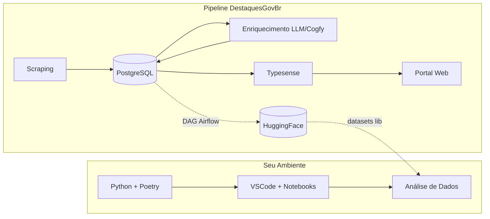
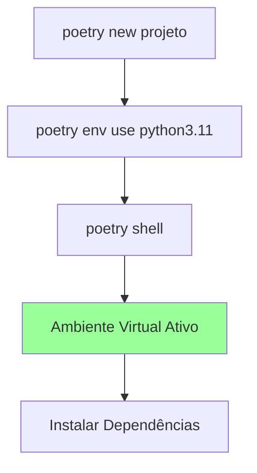
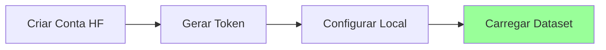

# Setup Data Science

> Guia completo para configurar seu ambiente de Data Science para trabalhar com o dataset govbrnews do HuggingFace. Do ambiente Python ao primeiro carregamento de dados.

---

## Visão Geral

Este módulo prepara seu ambiente para análise de dados do projeto DestaquesGovBr. Você terá acesso ao dataset `nitaibezerra/govbrnews` com aproximadamente 300 mil documentos de notícias governamentais.



!!! info "Fonte de Dados"
    O **PostgreSQL** é a fonte de verdade central do sistema. O **HuggingFace** é sincronizado diariamente e serve como camada de distribuição de dados abertos.

    Para análises exploratórias e Data Science, o dataset no HuggingFace é a forma mais prática de acessar os dados.

---

## Pré-requisitos

Antes de começar, verifique se você tem os seguintes itens instalados:

| Requisito | Comando de Verificação | Versão Mínima |
|-----------|------------------------|---------------|
| Python | `python --version` | 3.10+ |
| Poetry | `poetry --version` | 1.5+ |
| Git | `git --version` | 2.30+ |
| pip | `pip --version` | 21.0+ |

### Verificação Rápida

Execute os comandos abaixo para verificar seu ambiente:

```bash
# Verificar Python
python --version

# Verificar Poetry
poetry --version

# Verificar Git
git --version

# Verificar pip
pip --version
```

**Resultado esperado:**

```
Python 3.11.5
Poetry (version 1.7.1)
git version 2.42.0
pip 23.3.1
```

> **Nota**: Se Poetry não estiver instalado, consulte o [guia de instalação do Poetry](https://python-poetry.org/docs/#installation).

---

## Configuração do Ambiente Python

### Passo 1: Criar Projeto com Poetry

```bash
# Navegue para seu diretório de trabalho
cd ~/projetos

# Crie um novo projeto
poetry new analise-govbrnews
cd analise-govbrnews

# Ou, se já tiver uma pasta existente:
cd minha-pasta
poetry init
```

### Passo 2: Configurar Versão do Python

```bash
# Definir versão do Python para o projeto
poetry env use python3.11

# Verificar ambiente criado
poetry env info
```

### Passo 3: Ativar Ambiente Virtual

```bash
# Ativar o ambiente virtual do Poetry
poetry shell

# Verificar que está no ambiente correto
which python
```



---

## Instalação das Bibliotecas

### Bibliotecas Essenciais

Instale as bibliotecas de Data Science em grupos lógicos:

#### Grupo 1: Manipulação de Dados

```bash
poetry add pandas numpy
```

| Biblioteca | Uso Principal |
|------------|---------------|
| `pandas` | Manipulação de DataFrames |
| `numpy` | Operações numéricas |

#### Grupo 2: Visualização Tradicional

```bash
poetry add matplotlib seaborn
```

| Biblioteca | Uso Principal |
|------------|---------------|
| `matplotlib` | Gráficos estáticos |
| `seaborn` | Visualizações estatísticas |

#### Grupo 3: Visualização Interativa

```bash
poetry add altair plotly
```

| Biblioteca | Uso Principal |
|------------|---------------|
| `altair` | Gráficos declarativos |
| `plotly` | Gráficos interativos |

#### Grupo 4: Machine Learning

```bash
poetry add scikit-learn
```

| Biblioteca | Uso Principal |
|------------|---------------|
| `scikit-learn` | Algoritmos de ML clássicos |

#### Grupo 5: HuggingFace

```bash
poetry add datasets huggingface-hub
```

| Biblioteca | Uso Principal |
|------------|---------------|
| `datasets` | Carregar datasets do HuggingFace |
| `huggingface-hub` | Autenticação e API do HF |

### Instalação Completa (Um Comando)

Se preferir instalar tudo de uma vez:

```bash
poetry add pandas numpy matplotlib seaborn altair plotly scikit-learn datasets huggingface-hub
```

### Verificar Instalação

```bash
# Listar dependências instaladas
poetry show

# Verificar versões específicas
poetry show pandas
poetry show datasets
```

---

## Acesso ao HuggingFace Dataset

### Passo 1: Criar Conta no HuggingFace

1. Acesse [huggingface.co](https://huggingface.co)
2. Clique em "Sign Up"
3. Complete o cadastro

### Passo 2: Gerar Token de Acesso

1. Acesse [huggingface.co/settings/tokens](https://huggingface.co/settings/tokens)
2. Clique em "New token"
3. Escolha um nome descritivo (ex: "analise-govbrnews")
4. Selecione permissão "Read"
5. Copie o token gerado



### Passo 3: Configurar Token Localmente

**Opção A: Via CLI (Recomendado)**

```bash
# Login interativo
huggingface-cli login

# Cole seu token quando solicitado
```

**Opção B: Via Variável de Ambiente**

```bash
# Adicione ao seu ~/.bashrc ou ~/.zshrc
export HF_TOKEN="hf_seu_token_aqui"

# Recarregue o shell
source ~/.bashrc
```

**Opção C: Via Arquivo .env (Para Projetos)**

```bash
# Crie arquivo .env na raiz do projeto
echo "HF_TOKEN=hf_seu_token_aqui" > .env
```

> **Importante**: Nunca commite tokens no Git! Adicione `.env` ao `.gitignore`.

### Passo 4: Verificar Autenticação

```python
from huggingface_hub import HfApi

api = HfApi()
user = api.whoami()
print(f"Logado como: {user['name']}")
```

---

## Exercícios Práticos

### Exercício 1: Carregar o Dataset

Crie um novo notebook e execute:

```python
from datasets import load_dataset

# Carregar o dataset completo
dataset = load_dataset("nitaibezerra/govbrnews")

# Visualizar estrutura
print(dataset)
print(f"\nTotal de documentos: {len(dataset['train']):,}")
```

**Resultado esperado:**

```
DatasetDict({
    train: Dataset({
        features: ['...campos do dataset...'],
        num_rows: ~300000
    })
})

Total de documentos: 300,000
```

### Exercício 2: Explorar Estrutura e Tipos

```python
import pandas as pd

# Converter para DataFrame (amostra)
df = dataset['train'].to_pandas()

# Verificar estrutura
print("=== Colunas ===")
print(df.columns.tolist())

print("\n=== Tipos de Dados ===")
print(df.dtypes)

print("\n=== Primeiras Linhas ===")
df.head()
```

```python
# Estatísticas descritivas
print("=== Informações do DataFrame ===")
df.info()

print("\n=== Estatísticas Numéricas ===")
df.describe()

print("\n=== Valores Nulos ===")
print(df.isnull().sum())
```

### Exercício 3: Exportar Amostra para CSV

```python
# Selecionar amostra aleatória
amostra = df.sample(n=1000, random_state=42)

# Exportar para CSV
amostra.to_csv("data/amostras/govbrnews_amostra_1k.csv", index=False)

print(f"Amostra exportada: {len(amostra)} registros")
print(f"Arquivo: data/amostras/govbrnews_amostra_1k.csv")
```

### Verificação Final

Execute este código para confirmar que tudo está funcionando:

```python
# Script de verificação completa
import sys

def verificar_ambiente():
    print("=== Verificação do Ambiente Data Science ===\n")

    # Python
    print(f"Python: {sys.version}")

    # Bibliotecas essenciais
    libs = [
        'pandas', 'numpy', 'matplotlib', 'seaborn',
        'altair', 'plotly', 'sklearn', 'datasets'
    ]

    for lib in libs:
        try:
            module = __import__(lib)
            version = getattr(module, '__version__', 'OK')
            print(f"  {lib}: {version}")
        except ImportError:
            print(f"  {lib}: NAO INSTALADO")

    # HuggingFace
    print("\n=== HuggingFace ===")
    try:
        from huggingface_hub import HfApi
        api = HfApi()
        user = api.whoami()
        print(f"  Autenticado como: {user['name']}")
    except Exception as e:
        print(f"  Erro de autenticação: {e}")

    # Dataset
    print("\n=== Dataset govbrnews ===")
    try:
        from datasets import load_dataset
        ds = load_dataset("nitaibezerra/govbrnews", split="train[:10]")
        print(f"  Acesso OK - {len(ds)} registros de teste")
    except Exception as e:
        print(f"  Erro ao acessar: {e}")

    print("\n=== Verificação Concluída ===")

verificar_ambiente()
```

---

## Troubleshooting

### Erro: "Poetry command not found"

**Causa**: Poetry não está no PATH.

**Solução**:

```bash
# Reinstalar Poetry
curl -sSL https://install.python-poetry.org | python3 -

# Adicionar ao PATH (bash)
echo 'export PATH="$HOME/.local/bin:$PATH"' >> ~/.bashrc
source ~/.bashrc

# Adicionar ao PATH (zsh)
echo 'export PATH="$HOME/.local/bin:$PATH"' >> ~/.zshrc
source ~/.zshrc
```

### Erro: "No module named 'datasets'"

**Causa**: Biblioteca não instalada ou ambiente virtual não ativado.

**Solução**:

```bash
# Verificar ambiente ativo
poetry env info

# Ativar ambiente
poetry shell

# Reinstalar biblioteca
poetry add datasets
```

### Erro: "401 Unauthorized" ao acessar HuggingFace

**Causa**: Token inválido ou expirado.

**Solução**:

```bash
# Fazer logout
huggingface-cli logout

# Fazer login novamente
huggingface-cli login

# Gerar novo token em huggingface.co/settings/tokens
```

### Erro: "MemoryError" ao carregar dataset

**Causa**: Dataset muito grande para memória RAM.

**Solução**:

```python
# Carregar apenas uma parte do dataset
from datasets import load_dataset

# Carregar primeiros 10.000 registros
dataset = load_dataset("nitaibezerra/govbrnews", split="train[:10000]")

# Ou usar streaming (não carrega tudo na memória)
dataset = load_dataset("nitaibezerra/govbrnews", streaming=True)
for item in dataset['train'].take(100):
    print(item)
```

---

## Resumo de Comandos

| Comando | Descrição |
|---------|-----------|
| `poetry new projeto` | Criar novo projeto |
| `poetry add pacote` | Instalar dependência |
| `poetry shell` | Ativar ambiente virtual |
| `poetry run comando` | Executar no ambiente |
| `huggingface-cli login` | Autenticar no HuggingFace |

---

## Próximos Passos

Agora que seu ambiente está configurado, continue com a trilha Data Science:

- [Explorando o Dataset GovBrNews](./ds/explorando-dataset/index.md): Análise exploratória do dataset
- [NLP Aplicado ao Pipeline](./ds/nlp-pipeline/index.md): Processamento de linguagem natural
- [ML para Classificação](./ds/ml-classificacao/index.md): Machine Learning para classificação de texto
- [Qualidade de Dados](./ds/qualidade-dados/index.md): Validação e métricas de qualidade

Ou explore outros recursos:

- [Roteiro de Onboarding](./roteiro-onboarding.md): Visão geral das trilhas
- [Troubleshooting](./troubleshooting.md): Solução de problemas comuns

---

> Voltar para [Roteiro de Onboarding](./roteiro-onboarding.md)

> Próximo: [Explorando o Dataset GovBrNews](./ds/explorando-dataset/index.md)
