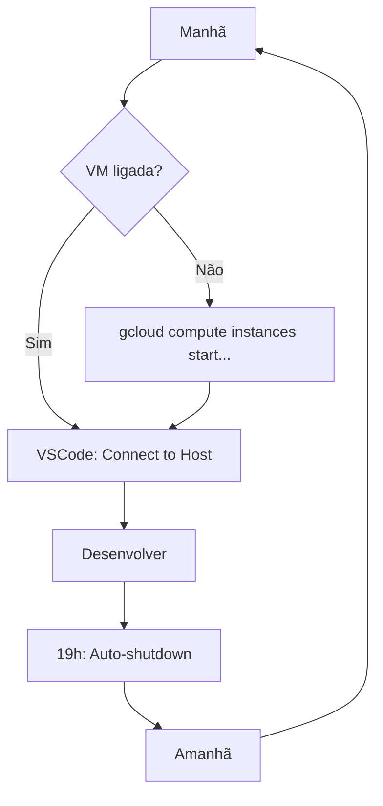

# Setup Dev VM (VSCode Remote)

> Configurar VSCode para desenvolvimento remoto na sua Dev VM.

## Pré-requisitos

| Ferramenta | Instalação |
|------------|------------|
| VSCode | [code.visualstudio.com](https://code.visualstudio.com/) |
| Remote - SSH (extensão) | Buscar "Remote - SSH" no VSCode |
| Google Cloud SDK | [cloud.google.com/sdk](https://cloud.google.com/sdk/docs/install) |

### Verificação

```bash
# gcloud instalado e logado
gcloud --version
gcloud auth list  # Sua conta deve aparecer

# Projeto configurado
gcloud config get-value project  # inspire-7-finep
```

---

## 1. Testar Conexão SSH

Antes de configurar o VSCode, teste a conexão:

```bash
gcloud compute ssh seu-nome-devvm \
  --zone=southamerica-east1-a \
  --tunnel-through-iap
```

!!! tip "VM desligada?"
    Se der erro, a VM pode estar desligada. Ligue com:
    ```bash
    gcloud compute instances start seu-nome-devvm \
      --zone=southamerica-east1-a
    ```

---

## 2. Configurar SSH

=== "Linux/macOS"

    Edite `~/.ssh/config`:

    ```bash
    nano ~/.ssh/config
    ```

    Adicione:

    ```ssh-config
    Host devvm
        HostName seu-nome-devvm
        User seu-usuario
        ProxyCommand gcloud compute start-iap-tunnel %h %p --listen-on-stdin --project=inspire-7-finep --zone=southamerica-east1-a
        StrictHostKeyChecking no
        UserKnownHostsFile /dev/null
    ```

    !!! note "Substitua"
        - `seu-nome-devvm` → nome da sua VM
        - `seu-usuario` → seu username Linux (geralmente parte do email antes do @)

=== "Windows"

    Edite `C:\Users\SeuUsuario\.ssh\config`:

    ```ssh-config
    Host devvm
        HostName seu-nome-devvm
        User seu-usuario
        ProxyCommand gcloud.cmd compute start-iap-tunnel %h %p --listen-on-stdin --project=inspire-7-finep --zone=southamerica-east1-a
        StrictHostKeyChecking no
        UserKnownHostsFile NUL
    ```

    !!! warning "Windows"
        Use `gcloud.cmd` (não apenas `gcloud`) e `NUL` (não `/dev/null`).

### Testar configuração

```bash
ssh devvm
```

Deve conectar à VM.

---

## 3. Conectar no VSCode

1. Abra o VSCode

2. Pressione `Ctrl+Shift+P` (ou `Cmd+Shift+P` no Mac)

3. Digite: **Remote-SSH: Connect to Host**

4. Selecione **devvm**

5. Aguarde a instalação do servidor VSCode (~1 min na primeira vez)

### Indicador de conexão

Após conectar, você verá no canto inferior esquerdo:

```
>< SSH: devvm
```

---

## 4. Abrir Projetos

No VSCode conectado:

1. Clique em **File → Open Folder**

2. Navegue para `/mnt/data/projects`

3. Selecione o projeto desejado

### Clonar repositórios

No terminal integrado (`Ctrl+`):

```bash
cd /mnt/data/projects

# Clone o scraper
git clone https://github.com/destaquesgovbr/govbrnews-scraper.git

# Clone o portal
git clone https://github.com/destaquesgovbr/destaquesgovbr-portal.git
```

---

## 5. Extensões Recomendadas

Após conectar, instale estas extensões **no servidor**:

| Extensão | Para |
|----------|------|
| Python | Desenvolvimento Python |
| Pylance | IntelliSense Python |
| GitLens | Git avançado |
| YAML | Edição YAML |
| HashiCorp Terraform | Syntax .tf |

!!! info "Extensões remotas"
    Extensões de linguagem devem ser instaladas após conectar ao remote.
    Vá em Extensions (`Ctrl+Shift+X`) e procure cada uma.

---

## 6. Workflow Diário



### Comandos rápidos

```bash
# Ligar VM
gcloud compute instances start seu-nome-devvm \
  --zone=southamerica-east1-a

# Verificar status
gcloud compute instances describe seu-nome-devvm \
  --zone=southamerica-east1-a --format="value(status)"

# Desligar manualmente
gcloud compute instances stop seu-nome-devvm \
  --zone=southamerica-east1-a
```

---

## Troubleshooting

### "Connection refused"

A VM provavelmente está desligada:

```bash
# Verificar
gcloud compute instances describe seu-nome-devvm \
  --zone=southamerica-east1-a --format="value(status)"

# Ligar
gcloud compute instances start seu-nome-devvm \
  --zone=southamerica-east1-a

# Aguardar ~30s e reconectar
```

### "Permission denied (publickey)"

```bash
# Reautenticar
gcloud auth login

# Tentar novamente
ssh devvm
```

### VSCode trava ao conectar

```bash
# Conectar via terminal
gcloud compute ssh seu-nome-devvm \
  --zone=southamerica-east1-a --tunnel-through-iap

# Remover servidor VSCode corrompido
rm -rf ~/.vscode-server

# Reconectar no VSCode
```

### ProxyCommand não funciona (Windows)

Use o caminho completo do gcloud:

```ssh-config
ProxyCommand "C:\Users\User\AppData\Local\Google\Cloud SDK\google-cloud-sdk\bin\gcloud.cmd" compute start-iap-tunnel %h %p --listen-on-stdin --project=inspire-7-finep --zone=southamerica-east1-a
```

### Conexão lenta

Adicione keep-alive ao `~/.ssh/config`:

```ssh-config
Host devvm
    # ... outras configs ...
    ServerAliveInterval 60
    ServerAliveCountMax 3
```

---

## Alternativa: IAP Desktop (Windows)

Se o ProxyCommand não funcionar no Windows:

1. Baixe [IAP Desktop](https://github.com/GoogleCloudPlatform/iap-desktop/releases)

2. Instale e faça login com sua conta Google

3. Conecte à VM pelo IAP Desktop

4. Crie um túnel: botão direito → "Tunnel to..." → porta 22

5. Configure VSCode para `localhost:PORTA`:

```ssh-config
Host devvm-tunnel
    HostName localhost
    Port 12345
    User seu-usuario
```

!!! warning "Mantenha IAP Desktop aberto"
    O túnel só funciona enquanto o IAP Desktop estiver rodando.

---

## Próximos Passos

Agora que seu VSCode está configurado:

1. Clone os repositórios em `/mnt/data/projects`
2. Configure o ambiente Python: [Setup Backend](./setup-backend.md)
3. Faça seu primeiro PR: [Primeiro PR](./primeiro-pr.md)

---

## Links Relacionados

- [VMs de Desenvolvimento](../infraestrutura/devvm.md) - Criar e gerenciar Dev VMs
- [Setup Backend](./setup-backend.md) - Configurar Python
- [Setup Frontend](./setup-frontend.md) - Configurar Next.js
