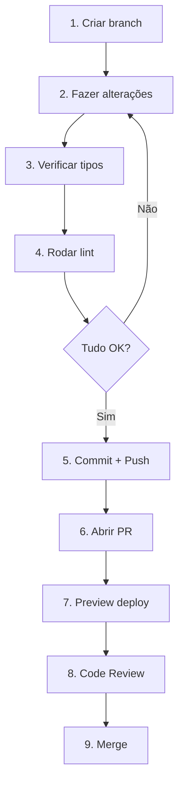

# Setup Frontend (TypeScript)

> Guia de configuração do ambiente para desenvolvedores TypeScript trabalhando no portal Next.js.

## Pré-requisitos

| Ferramenta | Versão | Instalação                                                    |
| ---------- | ------ | ------------------------------------------------------------- |
| Node.js    | 20+    | [nodejs.org](https://nodejs.org/) ou nvm                      |
| pnpm       | 9+     | `corepack enable` ou [pnpm.io](https://pnpm.io/installation)  |
| Docker     | 24+    | [docker.com](https://www.docker.com/products/docker-desktop/) |
| Git        | 2.40+  | [git-scm.com](https://git-scm.com/)                           |

### Verificação

```bash
node --version    # v20.x.x ou superior
pnpm --version    # 9.x.x ou superior
docker --version  # Docker 24.x ou superior
git --version     # Git 2.40.x ou superior
```

---

## 1. Clonar Repositório

```bash
# Clone o repositório do portal
git clone https://github.com/destaquesgovbr/portal.git
cd portal
```

---

## 2. Instalar Dependências

```bash
# Instalar dependências
pnpm install
```

---

## 3. Setup Typesense Local

O portal precisa do Typesense para funcionar. Vamos configurar uma instância local:

```bash
# Clone o repositório do Typesense local
git clone https://github.com/destaquesgovbr/typesense.git
cd typesense

# Subir Typesense com Docker
docker compose up -d
```

### Verificar se está rodando

```bash
curl http://localhost:8108/health
# Deve retornar: {"ok":true}
```

### Carregar dados de teste

```bash
# Ainda no diretório typesense
cd python

# Instalar dependências Python (necessário para o script de carga)
pip install -r requirements.txt

# Carregar últimos 7 dias de dados
python scripts/load_data.py --mode incremental --days 7
```

---

## 4. Configurar Variáveis de Ambiente

Volte ao diretório do portal e configure as variáveis de ambiente:

```bash
cd ../portal
```

Copie o arquivo de exemplo:

```bash
cp .env.example .env.local
```

O container Typesense busca a API key do GCP Secret Manager na inicialização. Para obter a API key correta, verifique os logs do container:

```bash
docker logs govbrnews-typesense | grep "API Key:"
```

Atualize o arquivo `.env.local` com a API key obtida dos logs:

```bash
# .env.local
NEXT_PUBLIC_TYPESENSE_HOST=localhost
NEXT_PUBLIC_TYPESENSE_SEARCH_ONLY_API_KEY=<sua-api-key-dos-logs>

# Site Configuration (opcional - será auto-detectado do Cloud Run se não configurado)
# NEXT_PUBLIC_SITE_URL=https://your-domain.com
```

> **Nota**: A API key é obtida dinamicamente do GCP Secret Manager quando o container Typesense inicia. Certifique-se de copiar a chave correta dos logs do container.

---

## 5. Executar o Portal

```bash
# Modo desenvolvimento
pnpm dev
```

Acesse [http://localhost:3000](http://localhost:3000) no navegador.

---

## 6. Estrutura do Projeto

```
portal/
├── src/
│   ├── app/                       # App Router (Next.js 15)
│   │   ├── page.tsx               # Homepage
│   │   ├── layout.tsx             # Layout principal
│   │   ├── temas/
│   │   │   └── [themeLabel]/      # Páginas por tema
│   │   ├── orgaos/
│   │   │   └── [agencyKey]/       # Páginas por órgão
│   │   └── noticias/
│   │       └── [id]/              # Página de notícia
│   ├── components/                # Componentes React
│   │   ├── ui/                    # Componentes shadcn/ui
│   │   ├── search/                # Componentes de busca
│   │   └── news/                  # Componentes de notícias
│   ├── lib/
│   │   ├── typesense-client.ts    # Cliente Typesense
│   │   ├── themes.yaml            # Árvore temática
│   │   ├── agencies.yaml          # Catálogo de órgãos
│   │   └── prioritization.yaml    # Config de priorização
│   └── styles/
│       └── globals.css            # Estilos globais (Tailwind)
├── public/                        # Assets estáticos
├── .github/workflows/             # GitHub Actions
├── package.json                   # Dependências
├── tailwind.config.ts             # Config Tailwind
├── next.config.ts                 # Config Next.js
└── tsconfig.json                  # Config TypeScript
```

---

## 7. Stack Tecnológico

| Tecnologia   | Uso             | Documentação                                          |
| ------------ | --------------- | ----------------------------------------------------- |
| Next.js 15   | Framework React | [nextjs.org/docs](https://nextjs.org/docs)            |
| TypeScript 5 | Tipagem         | [typescriptlang.org](https://www.typescriptlang.org/) |
| Typesense    | Busca full-text | [typesense.org/docs](https://typesense.org/docs/)     |
| shadcn/ui    | Componentes UI  | [ui.shadcn.com](https://ui.shadcn.com/)               |
| Tailwind CSS | Estilização     | [tailwindcss.com](https://tailwindcss.com/)           |
| React Query  | Data fetching   | [tanstack.com/query](https://tanstack.com/query)      |

---

## 8. Comandos Úteis

### Desenvolvimento

```bash
# Rodar em desenvolvimento
pnpm dev

# Build de produção
pnpm build

# Rodar build de produção localmente
pnpm start

# Verificar tipos TypeScript
pnpm type-check
# ou
pnpm exec tsc --noEmit
```

### Linting e Formatação

```bash
# Lint com Biome
pnpm lint

# Formatar com Biome
pnpm format

# Fix automático
pnpm lint:fix
```

### Testes

```bash
# Executar testes (se configurados)
pnpm test
```

---

## 9. Componentes shadcn/ui

O projeto usa [shadcn/ui](https://ui.shadcn.com/) para componentes de interface.

### Adicionar novo componente

```bash
# Exemplo: adicionar componente Dialog
npx shadcn@latest add dialog

# Listar componentes disponíveis
npx shadcn@latest add
```

### Usar componente existente

```tsx
import { Button } from "@/components/ui/button";
import { Card, CardHeader, CardTitle, CardContent } from "@/components/ui/card";

export function MyComponent() {
  return (
    <Card>
      <CardHeader>
        <CardTitle>Título</CardTitle>
      </CardHeader>
      <CardContent>
        <Button>Clique aqui</Button>
      </CardContent>
    </Card>
  );
}
```

---

## 10. Cliente Typesense

O cliente Typesense está em `src/lib/typesense-client.ts`:

```typescript
// Exemplo de busca
import { searchNews } from "@/lib/typesense-client";

const results = await searchNews({
  query: "economia",
  filters: {
    agency: ["gestao", "fazenda"],
    theme_1_level_1_code: ["01"],
  },
  page: 1,
  perPage: 20,
});
```

### Estrutura do documento no Typesense

```typescript
interface NewsDocument {
  id: string;
  unique_id: string;
  agency: string;
  title: string;
  url: string;
  image?: string;
  content: string;
  published_at: number;
  theme_1_level_1_code?: string;
  theme_1_level_1_label?: string;
  theme_1_level_2_code?: string;
  theme_1_level_2_label?: string;
  theme_1_level_3_code?: string;
  theme_1_level_3_label?: string;
  summary?: string;
}
```

---

## 11. Arquivos de Configuração

### Temas (`src/lib/themes.yaml`)

```yaml
themes:
  - label: Economia e Finanças
    code: "01"
    children:
      - label: Política Econômica
        code: "01.01"
        children:
          - label: Política Fiscal
            code: "01.01.01"
```

### Órgãos (`src/lib/agencies.yaml`)

```yaml
sources:
  gestao:
    name: Ministério da Gestão e da Inovação em Serviços Públicos
    parent: presidencia
    type: Ministério
```

### Priorização (`src/lib/prioritization.yaml`)

```yaml
priority_agencies:
  - gestao
  - fazenda
  - saude
```

---

## 12. Fluxo de Desenvolvimento



---

## 13. Web UI do Typesense

O Typesense local inclui uma interface web para debug:

- **URL**: [http://localhost:8108](http://localhost:8108) (com API key)
- **Alternativa**: Use o [Typesense Dashboard](https://cloud.typesense.org/dashboard) apontando para localhost

---

## Troubleshooting

### Erro de conexão com Typesense

```
Error: connect ECONNREFUSED 127.0.0.1:8108
```

**Solução**: Verificar se o Typesense está rodando:

```bash
docker ps | grep typesense
# Se não estiver, subir novamente
cd typesense && docker compose up -d
```

### Erro de tipos TypeScript

```bash
# Verificar erros de tipo
pnpm exec tsc --noEmit

# Se necessário, atualizar tipos
pnpm type-check
```

### Página em branco / sem dados

- Verificar se o Typesense tem dados carregados
- Verificar variáveis de ambiente no `.env.local`
- Verificar console do navegador para erros

### Componente shadcn não encontrado

```bash
# Reinstalar componente
npx shadcn@latest add <nome-do-componente>
```

---

## Próximos Passos

1. Explore a estrutura de páginas em `src/app/`
2. Entenda como funcionam os filtros de busca
3. Modifique um componente de UI
4. Escolha uma issue para trabalhar

→ Continue com [Primeiro PR](./primeiro-pr.md)
