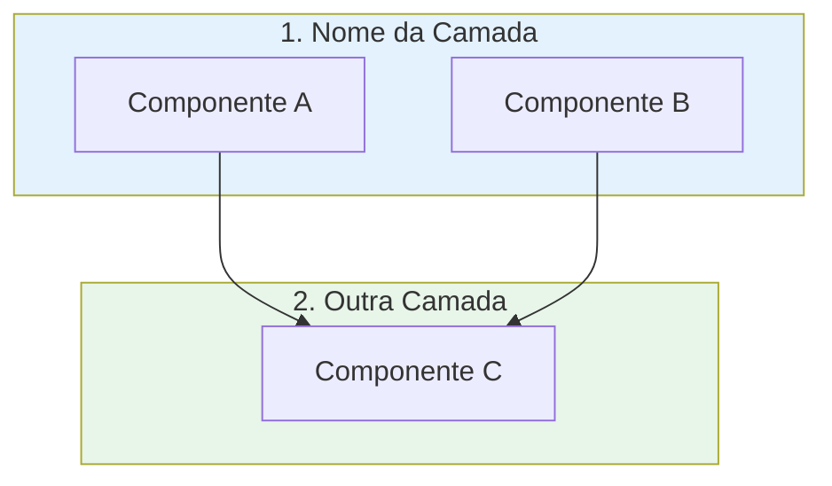
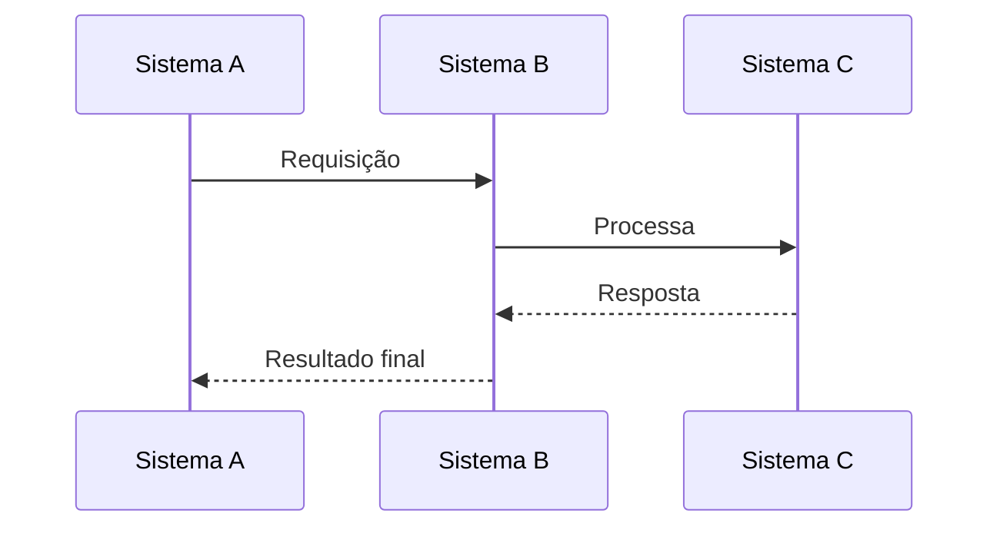
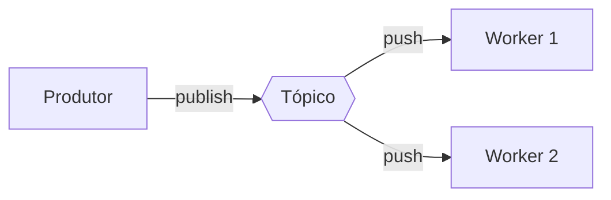
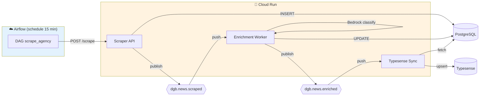

# Guia: Como Gerar Relatórios Técnicos com IA

> **Prompt Engineering para Documentação Técnica Completa**

Este documento fornece instruções **reproduzíveis** para gerar relatórios técnicos detalhados usando LLMs (Large Language Models), baseado na experiência do projeto DestaquesGovbr.

---

## Contexto de Uso

Este guia foi desenvolvido após a criação de 2 versões do **Relatório Técnico DestaquesGovbr** (Dezembro 2025 e Março 2026), totalizando ~15.000 linhas de documentação técnica gerada por IA.

**Casos de uso**:
- Documentar sistemas existentes com código disperso
- Criar relatórios de requisitos e arquitetura
- Documentar evolução arquitetural de sistemas
- Produzir documentação para auditorias técnicas
- Gerar especificações para novos projetos

---

## Estrutura do Prompt

### Fase 1: Definição do Escopo

**Prompt Inicial**:
```
Analisar a documentação deste diretório e gerar um documento técnico .md,
com um relatório de requisitos e plano de ingestão de dados,
com base no template [CAMINHO_DO_TEMPLATE].

[SE EXISTIR VERSÃO ANTERIOR]
Compare com a versão anterior [CAMINHO_VERSÃO_ANTERIOR] e destaque
uma seção com a evolução do ecossistema.

[OPCIONAL]
Crie também um arquivo .md com as instruções para o prompt para gerar
estes relatórios técnicos (este documento).
```

### Fase 2: Análise de Contexto

O LLM deve executar as seguintes ações:

#### 2.1 Leitura de Arquivos Chave

**Prioridade 1 - Template e Baseline**:
```
1. Template fornecido (estrutura a seguir)
2. Versão anterior do relatório (se existir) - baseline para comparação
```

**Prioridade 2 - Documentação Arquitetural**:
```
- docs/README.md ou index.md (visão geral)
- docs/arquitetura/visao-geral.md
- docs/arquitetura/fluxo-de-dados.md
- docs/arquitetura/componentes*.md
```

**Prioridade 3 - Documentação de Módulos**:
```
- docs/modulos/*.md (cada serviço/componente)
- docs/workflows/*.md (pipelines e CI/CD)
- docs/infraestrutura/*.md (cloud, terraform, secrets)
```

**Prioridade 4 - Código-fonte (quando necessário)**:
```
- README.md de repositórios
- Arquivos de configuração (docker-compose.yml, terraform, etc)
- Schema de banco de dados (migrations, DDL)
```

**Prioridade 5 - Histórico (para evolução)**:
```
- Blog posts ou changelogs
- Architecture Decision Records (ADRs)
- Pull Requests significativos
```

#### 2.2 Identificação de Padrões

Buscar e documentar:
- **Requisitos funcionais**: O que o sistema faz
- **Requisitos não-funcionais**: Performance, escalabilidade, custo
- **Arquitetura**: Camadas, componentes, tecnologias
- **Pipeline de dados**: ETL, frequência, volumes
- **Integrações**: APIs externas, dependências
- **Métricas**: Volumes, tempos, custos

### Fase 3: Estruturação do Conteúdo

#### 3.1 Template INSPIRE (Usado no DestaquesGovbr)

```markdown
**Sumário**
[Links para todas as seções]

# 1 Objetivo deste documento
- O que este documento apresenta
- Escopo coberto
- [Se aplicável] Versão e data de atualização

## 1.1 Nível de sigilo dos documentos
[Classificação de confidencialidade]

# 2 Público-alvo
- Gestores
- Desenvolvedores
- Pesquisadores
- [Outros stakeholders]

# 3 Desenvolvimento

## 3.1 Requisitos do Sistema

### 3.1.1 Requisitos Funcionais
[RF01, RF02, RF03... com descrição detalhada]

### 3.1.2 Requisitos Não-Funcionais
[RNF01, RNF02... performance, escalabilidade, custo]

### 3.1.3 Componentes Estruturantes
[Taxonomias, catálogos, schemas]

## 3.2 Arquitetura da Solução

### 3.2.1 Visão Geral
[Diagrama Mermaid com camadas]

### 3.2.2 Camadas Detalhadas
[Descrição de cada camada com componentes]

### 3.2.3 Infraestrutura
[Cloud, custos, regiões]

### 3.2.4 Stack Tecnológico
[Tabela completa de tecnologias]

## 3.3 Plano de Ingestão de Dados

### 3.3.1 Pipeline - Visão Geral
[Diagrama Mermaid do fluxo]

### 3.3.2 Etapa 1: [Nome]
[Detalhamento com código, duração, métricas]

### 3.3.3 Etapa 2: [Nome]
[...]

### 3.3.N Tratamento de Erros
[Retry logic, fallbacks, monitoramento]

### 3.3.N+1 Monitoramento e Métricas
[KPIs, SLAs, alertas]

### 3.3.N+2 Fluxo de Dados Detalhado
[Diagrama sequencial Mermaid]

## 3.4 [NOVO] Evolução do Ecossistema
[SEÇÃO ADICIONAL SE EXISTIR VERSÃO ANTERIOR]

### 3.4.1 Linha do Tempo
[Principais marcos e datas]

### 3.4.2 Comparativo Arquitetural
[Tabela: Aspecto | Versão Anterior | Versão Atual]

### 3.4.3 Motivações das Mudanças
[Por que cada mudança foi feita]

### 3.4.4 Arquitetura Event-Driven / Nova Abordagem
[Diagrama da nova arquitetura]

### 3.4.5 Impacto Operacional
[Custos, performance, escalabilidade]

### 3.4.6 Roadmap Próximo
[Próximos passos planejados]

# 4 Resultados

## 4.1 Dados Coletados
[Estatísticas, volumes, qualidade]

## 4.2 Disponibilização
[Como os dados são acessados]

# 5 Conclusões e considerações finais

## 5.1 Status Atual
[Estado do sistema hoje]

## 5.2 Limitações [Superadas / Conhecidas]
[O que foi resolvido / o que ainda é limitação]

## 5.3 Melhorias Futuras
[Curto, médio e longo prazo]

## 5.4 Lições Aprendidas
[O que funcionou / o que não funcionou]

## 5.5 Recomendações
[Para gestores / para equipe técnica / para pesquisadores]

# 6 Referências Bibliográficas
[Repos, docs, papers, datasets, aplicações]
```

---

## Instruções Específicas para o LLM

### Formato e Estilo

#### Markdown Avançado
```markdown
- **Tabelas** para dados estruturados (requisitos, componentes, métricas)
- **Listas** para enumerações
- **Diagramas Mermaid** para fluxos e arquitetura
- **Código** com syntax highlighting quando relevante
- **Callouts** (> nota) para informações importantes
- **Links** internos entre seções
```

#### Diagramas Mermaid

**Arquitetura em Camadas**:


**Fluxo Sequencial**:


**Event-Driven**:


#### Métricas e Dados Concretos

**Sempre incluir**:
- **Volumes**: Quantidade de documentos, registros, requisições
- **Tempos**: Duração de pipelines, latência, timeouts
- **Custos**: Valores mensais por componente
- **Taxas**: % de sucesso, cobertura, disponibilidade

**Formato de tabelas**:
```markdown
| Métrica | Valor Anterior | Valor Atual | Melhoria |
|---------|----------------|-------------|----------|
| Latência | 24 horas | 15 segundos | **99,99%** ↓ |
| Custo/mês | $70 | $90 | 28% ↑ |
| Taxa de sucesso | 90% | 97% | 7 p.p. ↑ |
```

### Seção de Evolução (Quando Aplicável)

#### Gatilhos para Criar Seção de Evolução

Criar esta seção quando:
- ✅ Existe versão anterior do relatório
- ✅ Houve mudança arquitetural significativa
- ✅ Sistema migrou de tecnologias (ex: Cogfy → Bedrock)
- ✅ Pipeline mudou de paradigma (batch → event-driven)
- ✅ Houve desmembramento de monolito

#### Estrutura da Seção de Evolução

**3.4.1 Linha do Tempo**:
```markdown
- **[Data/Período]**: Marco inicial (versão 1.0)
- **[Data/Período]**: Mudança significativa (ex: "Desmembramento do monolito")
- **[Data/Período]**: Estado atual (versão 2.0)
```

**3.4.2 Comparativo Arquitetural**:
```markdown
| Aspecto | Versão Anterior | Versão Atual | Impacto |
|---------|----------------|--------------|---------|
| Fonte de verdade | HuggingFace | PostgreSQL | Separação OLTP/OLAP |
| Pipeline | Batch cron | Event-driven | Latência 24h → 15s |
| Orquestração | GitHub Actions | Airflow | Dinamismo |
| [...]
```

**3.4.3 Motivações das Mudanças**:
```markdown
Para cada mudança significativa, explicar:
- **Problema**: O que motivou a mudança
- **Solução**: Como foi resolvido
- **Trade-off**: O que foi ganho / o que foi perdido
```

**3.4.4 Arquitetura Nova**:
```markdown
[Diagrama Mermaid da arquitetura atual]
[Destaque das mudanças em relação à anterior]
```

**3.4.5 Impacto Operacional**:
```markdown
- **Custo**: Variação absoluta e percentual
- **Performance**: Melhoria em latência, throughput
- **Escalabilidade**: Novos limites
- **Manutenibilidade**: Facilidade de manutenção
```

**3.4.6 Roadmap**:
```markdown
- [ ] Próxima melhoria planejada
- [ ] Migração pendente
- [ ] Expansão futura
```

---

## Checklist de Qualidade

Antes de finalizar o documento, verificar:

### Completude
- [ ] Todos os requisitos funcionais documentados
- [ ] Todos os requisitos não-funcionais documentados
- [ ] Arquitetura descrita em múltiplos níveis (alto nível + detalhes)
- [ ] Pipeline com todas as etapas documentadas
- [ ] Métricas concretas (não apenas qualitativos)
- [ ] Seção de evolução (se aplicável) com comparativo

### Clareza
- [ ] Diagramas Mermaid para visualização
- [ ] Exemplos de código quando relevante
- [ ] Tabelas para dados estruturados
- [ ] Links internos entre seções relacionadas
- [ ] Glossário ou definições de termos técnicos (se necessário)

### Precisão
- [ ] Números verificados (volumes, tempos, custos)
- [ ] Tecnologias com versões especificadas
- [ ] URLs de repos, docs e aplicações validadas
- [ ] Comandos testáveis e executáveis
- [ ] Referências bibliográficas completas

### Utilidade
- [ ] Documento serve como referência técnica
- [ ] Pode ser usado para onboarding
- [ ] Decisões arquiteturais justificadas
- [ ] Próximos passos documentados
- [ ] Lições aprendidas explícitas

---

## Prompt Completo Exemplo

```
CONTEXTO:
Você é um arquiteto de software especializado em documentação técnica.

TAREFA:
Analisar a documentação do diretório `docs/` e gerar um documento
técnico markdown completo, seguindo o template INSPIRE.md.

REQUISITOS:
1. Relatório de Requisitos (funcionais e não-funcionais)
2. Arquitetura da Solução (7 camadas)
3. Plano de Ingestão de Dados (pipeline event-driven)
4. Seção de Evolução comparando com a versão anterior
   (Relatório-Técnico-DestaquesGovbr-Requisitos-Ingestão-25-12-31.md)

INSTRUÇÕES:
- Ler arquivos da documentação (prioridade: arquitetura > módulos > workflows)
- Identificar mudanças arquiteturais significativas
- Criar diagramas Mermaid para arquitetura e fluxos
- Incluir métricas concretas (volumes, tempos, custos)
- Comparar versão anterior vs atual em tabela
- Destacar motivações e impacto das mudanças

FORMATO DE SAÍDA:
- Nome do arquivo: Relatório-Técnico-DestaquesGovbr-Requisitos-Ingestão-26-03-23.md
- Estrutura: Seguir template INSPIRE.md
- Tamanho estimado: 8.000-10.000 linhas
- Incluir sumário navegável
- Diagramas em Mermaid
- Referências com links completos

DELIVERABLES:
1. Relatório técnico completo (arquivo principal)
2. Arquivo de instruções de prompt (este guia)
```

---

## Exemplos de Seções Geradas

### Exemplo 1: Requisito Funcional

```markdown
#### **RF03 - Enriquecimento via IA**

O sistema deve classificar automaticamente cada notícia usando LLM:

- **Classificação temática hierárquica** em até 3 níveis
  - Nível 1: 25 temas principais (ex: "01 - Economia e Finanças")
  - Nível 2: Subtemas (ex: "01.01 - Política Econômica")
  - Nível 3: Tópicos específicos (ex: "01.01.01 - Política Fiscal")
- **Geração de resumo automático** (2-3 frases)
- **Análise de sentimento** (positivo/negativo/neutro)
- **Extração de entidades** (pessoas, organizações, locais)
- **Cálculo de tema mais específico** (prioridade: L3 > L2 > L1)

**Tecnologia**: AWS Bedrock (Claude Haiku)
**Latência**: ~5-10s por notícia
**Custo**: ~$0.001 por notícia
```

### Exemplo 2: Tabela Comparativa (Evolução)

```markdown
| Aspecto | Dezembro 2025 | Março 2026 | Impacto |
|---------|--------------|------------|---------|
| **Fonte de verdade** | HuggingFace Dataset | PostgreSQL (Cloud SQL) | Separação OLTP/OLAP |
| **Pipeline** | Batch (GitHub Actions) | Event-driven (Pub/Sub) | Latência 24h → 15s (**99.99% ↓**) |
| **Latência** | 24 horas | ~15 segundos | Near real-time |
| **Orquestração** | Cron workflows | Airflow DAGs | Dinamismo, retry |
| **LLM** | Cogfy API (SaaS) | AWS Bedrock | Controle, custo ↓ 40% |
| **Repositórios** | 2 (scraper, portal) | 6+ (modular) | Deploy independente |
| **Analytics** | Streamlit básico | BigQuery + dashboards | OLAP dedicado |
| **Feature flags** | ❌ Não existia | ✅ GrowthBook | A/B testing |
| **Federação** | ❌ Não existia | ✅ ActivityPub/Mastodon | Distribuição social |
| **Custo/mês** | ~$70 | ~$90 | **+28%** (novos componentes) |
```

### Exemplo 3: Diagrama Event-Driven

```markdown
### 3.4.4 Arquitetura Event-Driven



**Latência total**: ~15 segundos (scraping → indexação)
**Componentes escaláveis**: Workers 0-3 instâncias
**Idempotência**: Garantida via flags no PostgreSQL
```

---

## Adaptações para Outros Projetos

Este guia foi criado para o DestaquesGovbr, mas pode ser adaptado:

### Para Projetos de Data Engineering
- Foco em pipeline ETL e qualidade de dados
- Adicionar seção de Data Governance
- Incluir data lineage e profiling

### Para Projetos de Machine Learning
- Foco em features, modelos e métricas de ML
- Adicionar seção de Model Training e Deployment
- Incluir experiment tracking e model registry

### Para Projetos de Microserviços
- Foco em APIs, contratos e service mesh
- Adicionar seção de Service Discovery e Load Balancing
- Incluir distributed tracing

### Para Projetos Legados
- Foco em documentação reverse-engineered
- Adicionar seção de Technical Debt
- Incluir migration roadmap

---

## Ferramentas Recomendadas

### LLMs Testados
- ✅ **Claude Opus 4.6** (usado neste projeto) - Excelente para documentação longa
- ✅ **Claude Sonnet 4.5** - Bom balanço custo/qualidade
- ⚠️ **GPT-4** - Bom mas tende a ser mais verboso
- ⚠️ **GPT-4o** - Mais rápido mas menos detalhado

### Editores Markdown
- **VSCode** + Markdown Preview Enhanced
- **Obsidian** (para documentação interligada)
- **Typora** (WYSIWYG)

### Validadores
- **markdownlint** - Linting de markdown
- **Mermaid Live Editor** - Teste de diagramas
- **Vale** - Style guide enforcement

---

## Manutenção do Relatório

### Quando Atualizar

- ✅ Mudança arquitetural significativa
- ✅ Novo componente adicionado ao sistema
- ✅ Mudança de tecnologia core
- ✅ Métricas operacionais mudaram significativamente
- ✅ Requisitos novos implementados

### Versionamento

Padrão de nome: `Relatório-Técnico-[Projeto]-[Tipo]-[YY-MM-DD].md`

Exemplo:
- `Relatório-Técnico-DestaquesGovbr-Requisitos-Ingestão-25-12-31.md` (Versão 1)
- `Relatório-Técnico-DestaquesGovbr-Requisitos-Ingestão-26-03-23.md` (Versão 2)

---

## Contato e Contribuições

Este guia foi criado como parte do projeto **DestaquesGovbr** (Ministério da Gestão e da Inovação em Serviços Públicos).

Para melhorias e sugestões, abra uma issue no repositório:
[github.com/destaquesgovbr/docs](https://github.com/destaquesgovbr/docs)

---

**Versão**: 1.0
**Data**: 23 de março de 2026
**Autores**: Equipe DestaquesGovbr + Claude Code (Anthropic)
**Licença**: CC-BY-4.0
