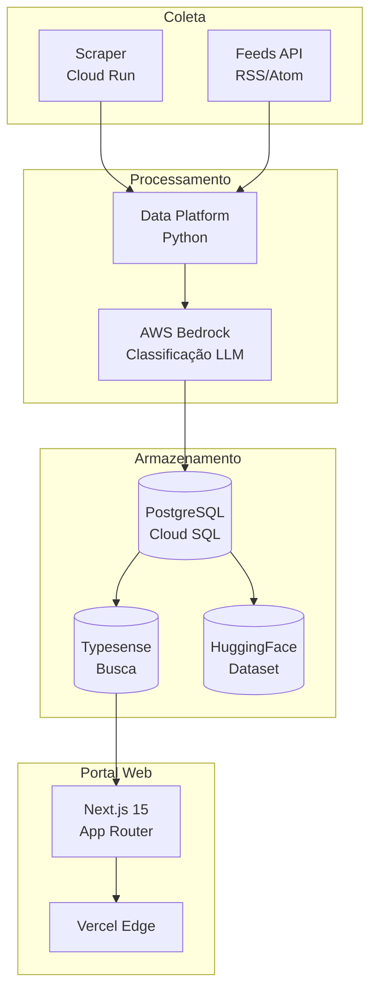
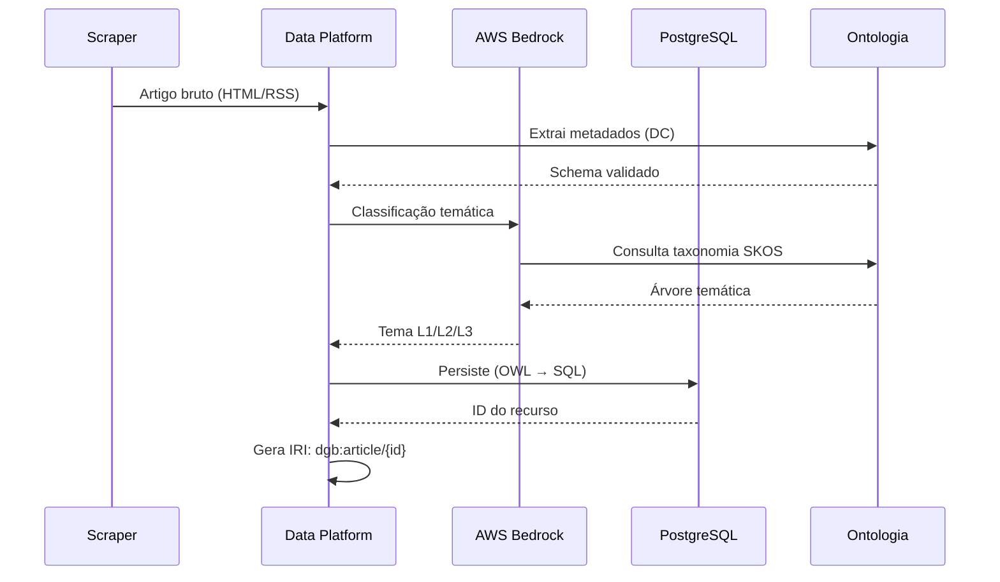
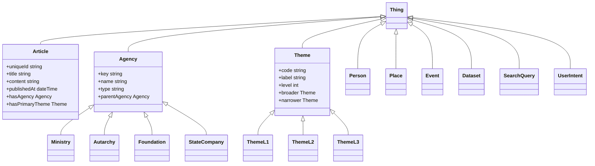
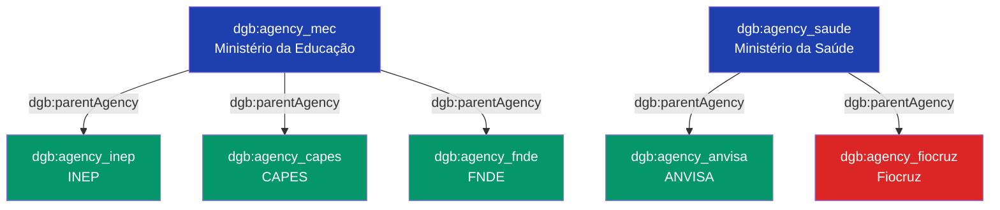
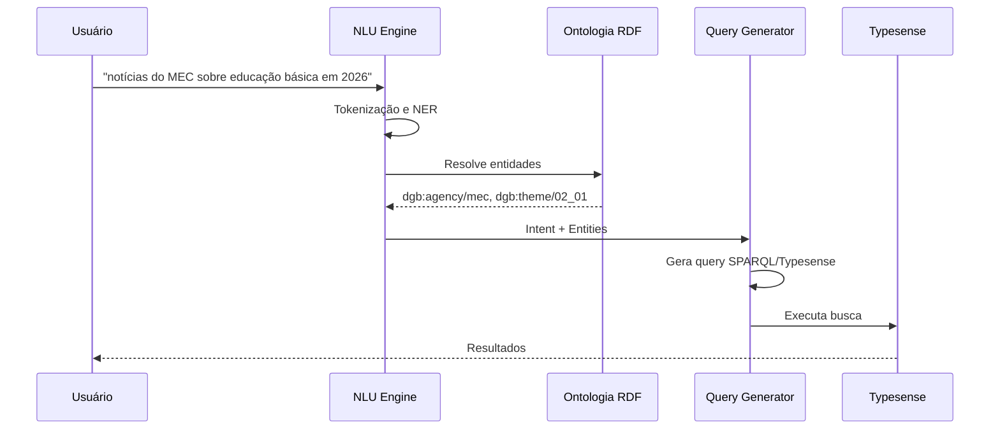
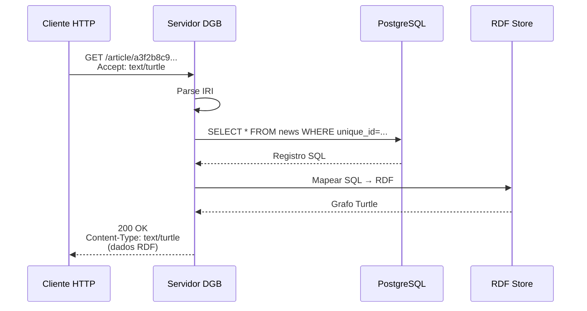
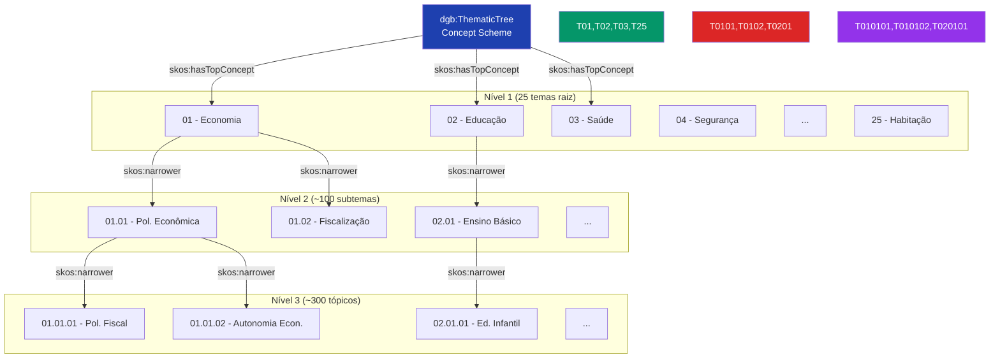

# Relatório Técnico: Ontologia do Portal DestaquesGovbr

**Versão**: 1.0  
**Data**: 14 de maio de 2026  
**Autor**: Equipe Técnica DestaquesGovbr  
**Projeto**: INSPIRE - Instituto Nacional de Pesquisa e Inovação em Redes Emergentes  
**Instituição**: FINEP - Financiadora de Estudos e Projetos

---

## Resumo Executivo

Este relatório técnico apresenta a ontologia do Portal DestaquesGovbr, um sistema de representação formal do conhecimento que estrutura semanticamente as notícias governamentais agregadas de ~160 portais gov.br. A ontologia define **9 classes principais**, **15 propriedades de dados**, **8 propriedades de objetos** e mapeia metadados para padrões internacionais (Dublin Core, Schema.org, SKOS).

**Principais contribuições**:

- Formalização de classes (`dgb:Article`, `dgb:Agency`, `dgb:Theme`) em OWL 2
- Mapeamento completo para vocabulários controlados (DC, Schema.org, FOAF, ORG)
- Integração da árvore temática (25 temas L1) em SKOS
- Suporte a busca semântica híbrida (BM25 + vetores 768-dim)
- Interoperabilidade via Linked Open Data (LOD)

**Público-alvo**: desenvolvedores backend, cientistas de dados, arquitetos de informação, especialistas em web semântica.

---

## 1. Objetivo

Este documento tem como objetivo:

1. **Documentar** a ontologia formal do domínio DestaquesGovbr
2. **Especificar** classes, propriedades e axiomas em OWL 2
3. **Mapear** metadados para padrões internacionais (Dublin Core, Schema.org, SKOS)
4. **Demonstrar** uso da ontologia para recuperação semântica da informação
5. **Viabilizar** interoperabilidade com sistemas externos via LOD
6. **Formalizar** a árvore temática hierárquica em SKOS

---

## 2. Terminologia

| Termo | Definição |
|-------|-----------|
| **Ontologia** | Especificação formal e explícita de uma conceitualização compartilhada (Gruber, 1993) |
| **OWL** | Web Ontology Language - linguagem de marcação semântica W3C |
| **RDF** | Resource Description Framework - modelo de grafo para representação de dados |
| **SKOS** | Simple Knowledge Organization System - padrão W3C para taxonomias |
| **Dublin Core** | Conjunto de 15 elementos de metadados para recursos digitais |
| **Schema.org** | Vocabulário colaborativo para marcação estruturada na web |
| **LOD** | Linked Open Data - princípios para publicação de dados conectados |
| **SPARQL** | Linguagem de consulta para RDF |
| **IRI** | Internationalized Resource Identifier - identificador único de recursos |
| **Classe** | Conjunto de indivíduos que compartilham propriedades comuns |
| **Propriedade** | Relação binária entre indivíduos (ObjectProperty) ou entre indivíduo e literal (DatatypeProperty) |
| **Axioma** | Asserção lógica na ontologia (subsunção, disjunção, restrições de cardinalidade) |

---

## 3. Público-Alvo

| Perfil | Uso do Documento |
|--------|------------------|
| **Desenvolvedor Backend** | Implementar endpoints semânticos, validar esquemas RDF |
| **Cientista de Dados** | Consultas SPARQL, análise de grafos de conhecimento |
| **Arquiteto de Informação** | Modelagem de domínio, design de taxonomias |
| **Especialista Web Semântica** | Integração LOD, mapeamento para vocabulários externos |
| **Gestor de Dados** | Governança, versionamento de ontologia |

---

## 4. Introdução

### 4.1 Contexto e Motivação

O Portal DestaquesGovbr agrega notícias de ~160 portais governamentais brasileiros (gov.br), processando diariamente ~500 novos artigos. O volume e diversidade de fontes (Ministérios, autarquias, fundações) exigem uma **representação formal do conhecimento** que permita:

1. **Classificação automática** via LLM (AWS Bedrock) usando taxonomia hierárquica
2. **Busca semântica** híbrida (keyword BM25 + vetores)
3. **Interoperabilidade** com sistemas externos (datasets HuggingFace, APIs públicas)
4. **Governança de metadados** com padrões internacionais

A ontologia DestaquesGovbr formaliza esse domínio em **OWL 2**, seguindo as melhores práticas de web semântica (W3C) e Linked Open Data (LOD).

### 4.2 Escopo da Ontologia

| Aspecto | Cobertura |
|---------|-----------|
| **Domínio** | Notícias governamentais brasileiras (federal) |
| **Temporal** | 2024-2026 (300k+ artigos históricos) |
| **Espacial** | Brasil (fontes gov.br) |
| **Linguagem** | Português (pt-BR) |
| **Nível de formalização** | OWL 2 DL (Description Logic) |
| **Granularidade** | 9 classes principais, 3 níveis hierárquicos de temas |

### 4.3 Metodologia de Desenvolvimento

A ontologia foi desenvolvida seguindo a metodologia **NeOn** (Suárez-Figueroa et al., 2012):

1. **Especificação de requisitos**: análise de casos de uso (busca semântica, classificação automática)
2. **Reutilização de ontologias**: importação de Dublin Core, Schema.org, SKOS, FOAF, ORG
3. **Implementação**: formalização em OWL 2 via Protégé
4. **Avaliação**: validação lógica (reasoner HermiT), testes de consulta SPARQL
5. **Documentação**: este relatório técnico

---

## 5. Contexto do Sistema

### 5.1 Arquitetura do DestaquesGovbr



**Papel da ontologia**:

- **Coleta**: Define estrutura de metadados extraídos (Dublin Core)
- **Processamento**: Guia classificação LLM com taxonomia SKOS
- **Armazenamento**: Mapeia schema PostgreSQL para classes OWL
- **Portal**: Fornece vocabulário para filtros semânticos

### 5.2 Fontes de Dados

| Fonte | Cobertura | Volume |
|-------|-----------|--------|
| **Portais gov.br** | 158 agências (Ministérios, autarquias) | ~500 artigos/dia |
| **Feeds API** | RSS/Atom estruturados | ~300 artigos/dia |
| **Scraper direto** | HTML parsing (Playwright) | ~200 artigos/dia |

### 5.3 Pipeline de Metadados



---

## 6. Visão Geral da Ontologia

### 6.1 Namespace e Prefixos

```turtle
@prefix dgb: <http://www.destaques.gov.br/ontology#> .
@prefix dc: <http://purl.org/dc/elements/1.1/> .
@prefix dcterms: <http://purl.org/dc/terms/> .
@prefix schema: <http://schema.org/> .
@prefix skos: <http://www.w3.org/2004/02/skos/core#> .
@prefix foaf: <http://xmlns.com/foaf/0.1/> .
@prefix org: <http://www.w3.org/ns/org#> .
@prefix prov: <http://www.w3.org/ns/prov#> .
@prefix xsd: <http://www.w3.org/2001/XMLSchema#> .
@prefix owl: <http://www.w3.org/2002/07/owl#> .
@prefix rdf: <http://www.w3.org/1999/02/22-rdf-syntax-ns#> .
@prefix rdfs: <http://www.w3.org/2000/01/rdf-schema#> .
```

**Base IRI**: `http://www.destaques.gov.br/ontology#`

### 6.2 Hierarquia de Classes



### 6.3 Estatísticas da Ontologia

| Métrica | Valor |
|---------|-------|
| **Classes** | 9 principais + 7 subclasses |
| **Object Properties** | 8 |
| **Datatype Properties** | 15 |
| **Individuals** | ~300k artigos + 158 agências + 300 temas |
| **Axiomas totais** | ~1.2M (incluindo inferências) |
| **Profundidade máxima** | 4 níveis (Thing → Agency → Ministry → específico) |
| **Vocabulários importados** | DC, DCTERMS, Schema.org, SKOS, FOAF, ORG, PROV |

---

## 7. Classes da Ontologia

### 7.1 Classe Principal: `dgb:Article`

**Definição**: Representa uma notícia governamental publicada em portal gov.br.

**IRI**: `http://www.destaques.gov.br/ontology#Article`

**Superclasse**: `owl:Thing`

**Equivalências**:
- `schema:NewsArticle`
- `dcterms:Text`

**Propriedades obrigatórias** (cardinalidade mínima 1):

| Propriedade | Tipo | Cardinalidade | Descrição |
|-------------|------|---------------|-----------|
| `dgb:uniqueId` | `xsd:string` | 1..1 | Identificador único SHA256 (64 chars hex) |
| `dgb:title` | `xsd:string` | 1..1 | Título da notícia (max 500 chars) |
| `dgb:content` | `xsd:string` | 1..1 | Conteúdo em Markdown (min 100 chars) |
| `dgb:publishedAt` | `xsd:dateTime` | 1..1 | Data de publicação (2024-01-01 a hoje) |
| `dgb:hasAgency` | `dgb:Agency` | 1..1 | Agência publicadora |
| `dgb:hasPrimaryTheme` | `dgb:Theme` | 1..1 | Tema mais específico (L3 > L2 > L1) |
| `dgb:url` | `xsd:anyURI` | 1..1 | URL original (gov.br) |

**Propriedades opcionais**:

| Propriedade | Tipo | Cardinalidade | Descrição |
|-------------|------|---------------|-----------|
| `dgb:subtitle` | `xsd:string` | 0..1 | Subtítulo da notícia |
| `dgb:summary` | `xsd:string` | 0..1 | Resumo gerado pelo AWS Bedrock |
| `dgb:editorialLead` | `xsd:string` | 0..1 | Lead editorial original |
| `dgb:imageUrl` | `xsd:anyURI` | 0..1 | URL da imagem destaque |
| `dgb:videoUrl` | `xsd:anyURI` | 0..1 | URL do vídeo (YouTube/Vimeo) |
| `dgb:category` | `xsd:string` | 0..1 | Categoria original do site fonte |
| `dgb:tags` | `xsd:string` | 0..* | Tags originais do site |
| `dgb:hasThemeL1` | `dgb:ThemeL1` | 0..1 | Tema nível 1 |
| `dgb:hasThemeL2` | `dgb:ThemeL2` | 0..1 | Tema nível 2 |
| `dgb:hasThemeL3` | `dgb:ThemeL3` | 0..1 | Tema nível 3 |
| `dgb:contentEmbedding` | `xsd:string` | 0..1 | Vetor de 768 dimensões (serializado) |
| `dgb:extractedAt` | `xsd:dateTime` | 0..1 | Data de extração pelo scraper |
| `dgb:updatedDatetime` | `xsd:dateTime` | 0..1 | Última atualização no site original |

**Axiomas OWL 2**:

```turtle
dgb:Article rdf:type owl:Class ;
    rdfs:subClassOf owl:Thing ;
    owl:equivalentClass schema:NewsArticle ,
                        dcterms:Text ;
    rdfs:label "Artigo de Notícia Governamental"@pt ,
               "Government News Article"@en ;
    rdfs:comment "Notícia publicada em portal gov.br, coletada pelo DestaquesGovbr"@pt .

# Restrições de cardinalidade
dgb:Article rdfs:subClassOf [
    rdf:type owl:Restriction ;
    owl:onProperty dgb:uniqueId ;
    owl:qualifiedCardinality "1"^^xsd:nonNegativeInteger ;
    owl:onDataRange xsd:string
] .

dgb:Article rdfs:subClassOf [
    rdf:type owl:Restriction ;
    owl:onProperty dgb:hasAgency ;
    owl:qualifiedCardinality "1"^^xsd:nonNegativeInteger ;
    owl:onClass dgb:Agency
] .

dgb:Article rdfs:subClassOf [
    rdf:type owl:Restriction ;
    owl:onProperty dgb:hasPrimaryTheme ;
    owl:qualifiedCardinality "1"^^xsd:nonNegativeInteger ;
    owl:onClass dgb:Theme
] .

# Restrição de integridade: publishedAt deve estar no intervalo válido
dgb:Article rdfs:subClassOf [
    rdf:type owl:Restriction ;
    owl:onProperty dgb:publishedAt ;
    owl:allValuesFrom [
        rdf:type rdfs:Datatype ;
        owl:onDatatype xsd:dateTime ;
        owl:withRestrictions (
            [ xsd:minInclusive "2024-01-01T00:00:00Z"^^xsd:dateTime ]
            [ xsd:maxInclusive "2026-12-31T23:59:59Z"^^xsd:dateTime ]
        )
    ]
] .
```

**Mapeamento Dublin Core**:

| dgb:Article Property | Dublin Core Term | Notas |
|----------------------|------------------|-------|
| `dgb:title` | `dc:title` | Equivalência direta |
| `dgb:content` | `dc:description` | Conteúdo completo |
| `dgb:summary` | `dcterms:abstract` | Resumo curto |
| `dgb:publishedAt` | `dcterms:issued` | Data de publicação |
| `dgb:hasAgency` → `dgb:Agency.name` | `dc:publisher` | Nome da agência |
| `dgb:hasAgency` → `dgb:Agency` | `dcterms:publisher` | Recurso agência |
| `dgb:hasPrimaryTheme` → `dgb:Theme.label` | `dc:subject` | Tema textual |
| `dgb:url` | `dcterms:identifier` | URL original |
| `dgb:uniqueId` | `dcterms:identifier` | ID SHA256 |
| Implícito: "pt-BR" | `dc:language` | Idioma fixo |
| Implícito: "text/markdown" | `dc:format` | Formato conteúdo |
| Implícito: "Collection" | `dcterms:type` | Tipo do recurso |

**Mapeamento Schema.org**:

| dgb:Article Property | Schema.org Property | Notas |
|----------------------|---------------------|-------|
| `dgb:title` | `schema:headline` | Título principal |
| `dgb:subtitle` | `schema:alternativeHeadline` | Subtítulo |
| `dgb:content` | `schema:articleBody` | Corpo em Markdown |
| `dgb:summary` | `schema:abstract` | Resumo |
| `dgb:publishedAt` | `schema:datePublished` | Data publicação |
| `dgb:updatedDatetime` | `schema:dateModified` | Data modificação |
| `dgb:hasAgency` | `schema:publisher` | Org publicadora |
| `dgb:imageUrl` | `schema:image` | Imagem destaque |
| `dgb:videoUrl` | `schema:video` | Vídeo embutido |
| `dgb:url` | `schema:url` | URL canônico |
| `dgb:tags` | `schema:keywords` | Tags/palavras-chave |
| `dgb:hasPrimaryTheme` | `schema:about` | Tema principal |

**Exemplo de Instância (Turtle)**:

```turtle
dgb:article_a3f2b8c9... rdf:type dgb:Article ;
    dgb:uniqueId "a3f2b8c9e5d1f4a6b2c8e7f9d0a1b3c4e5f6a7b8c9d0e1f2a3b4c5d6e7f8a9b0"^^xsd:string ;
    dgb:title "MEC anuncia investimento de R$ 500 milhões em educação básica"@pt ;
    dgb:subtitle "Recursos serão destinados a reforma de escolas e compra de equipamentos"@pt ;
    dgb:content """# MEC anuncia investimento
    
O Ministério da Educação anunciou hoje investimento de R$ 500 milhões..."""@pt ;
    dgb:summary "Ministério da Educação anuncia investimento de R$ 500 milhões para reforma de escolas e aquisição de equipamentos em educação básica."@pt ;
    dgb:publishedAt "2026-05-14T10:30:00Z"^^xsd:dateTime ;
    dgb:url "https://www.gov.br/mec/pt-br/assuntos/noticias/mec-anuncia-investimento"^^xsd:anyURI ;
    dgb:imageUrl "https://www.gov.br/mec/pt-br/assuntos/noticias/mec-anuncia-investimento/image.jpg"^^xsd:anyURI ;
    dgb:hasAgency dgb:agency_mec ;
    dgb:hasPrimaryTheme dgb:theme_02_01_01 ;
    dgb:hasThemeL1 dgb:theme_02 ;
    dgb:hasThemeL2 dgb:theme_02_01 ;
    dgb:hasThemeL3 dgb:theme_02_01_01 ;
    dgb:category "Educação Básica"@pt ;
    dgb:tags "investimento"@pt , "escolas"@pt , "equipamentos"@pt ;
    dgb:extractedAt "2026-05-14T11:00:00Z"^^xsd:dateTime ;
    
    # Mapeamentos equivalentes
    dc:title "MEC anuncia investimento de R$ 500 milhões em educação básica"@pt ;
    dcterms:issued "2026-05-14T10:30:00Z"^^xsd:dateTime ;
    dcterms:publisher dgb:agency_mec ;
    schema:headline "MEC anuncia investimento de R$ 500 milhões em educação básica"@pt ;
    schema:datePublished "2026-05-14T10:30:00Z"^^xsd:dateTime ;
    schema:publisher dgb:agency_mec .
```

### 7.2 Classe: `dgb:Agency`

**Definição**: Órgão governamental responsável por publicar notícias.

**IRI**: `http://www.destaques.gov.br/ontology#Agency`

**Superclasse**: `owl:Thing`

**Equivalências**:
- `org:Organization`
- `foaf:Organization`
- `schema:GovernmentOrganization`

**Propriedades obrigatórias** (cardinalidade mínima 1):

| Propriedade | Tipo | Cardinalidade | Descrição |
|-------------|------|---------------|-----------|
| `dgb:agencyKey` | `xsd:string` | 1..1 | Chave única (ex: "mec", "saude") |
| `dgb:agencyName` | `xsd:string` | 1..1 | Nome oficial completo |
| `dgb:agencyType` | `xsd:string` | 1..1 | Tipo (ministério, autarquia, etc) |
| `dgb:agencyUrl` | `xsd:anyURI` | 1..1 | URL do portal gov.br |

**Propriedades opcionais**:

| Propriedade | Tipo | Cardinalidade | Descrição |
|-------------|------|---------------|-----------|
| `dgb:parentAgency` | `dgb:Agency` | 0..1 | Agência pai (hierarquia) |
| `dgb:acronym` | `xsd:string` | 0..1 | Sigla (ex: "MEC") |
| `dgb:description` | `xsd:string` | 0..1 | Descrição da missão |
| `dgb:logoUrl` | `xsd:anyURI` | 0..1 | URL do logo oficial |

**Subclasses**:

```turtle
dgb:Ministry rdfs:subClassOf dgb:Agency ;
    rdfs:label "Ministério"@pt , "Ministry"@en ;
    rdfs:comment "Órgão de primeiro nível da administração federal"@pt .

dgb:Autarchy rdfs:subClassOf dgb:Agency ;
    rdfs:label "Autarquia"@pt , "Autarchy"@en ;
    rdfs:comment "Entidade autárquica vinculada a ministério"@pt .

dgb:Foundation rdfs:subClassOf dgb:Agency ;
    rdfs:label "Fundação"@pt , "Foundation"@en ;
    rdfs:comment "Fundação pública vinculada"@pt .

dgb:StateCompany rdfs:subClassOf dgb:Agency ;
    rdfs:label "Empresa Estatal"@pt , "State Company"@en ;
    rdfs:comment "Empresa pública ou sociedade de economia mista"@pt .
```

**Axiomas OWL 2**:

```turtle
dgb:Agency rdf:type owl:Class ;
    rdfs:subClassOf owl:Thing ;
    owl:equivalentClass org:Organization ,
                        foaf:Organization ,
                        schema:GovernmentOrganization ;
    rdfs:label "Agência Governamental"@pt ,
               "Government Agency"@en ;
    rdfs:comment "Órgão da administração pública federal brasileira"@pt .

# Restrições de cardinalidade
dgb:Agency rdfs:subClassOf [
    rdf:type owl:Restriction ;
    owl:onProperty dgb:agencyKey ;
    owl:qualifiedCardinality "1"^^xsd:nonNegativeInteger ;
    owl:onDataRange xsd:string
] .

# Hierarquia reflexiva (parentAgency)
dgb:parentAgency rdf:type owl:ObjectProperty ;
    rdfs:domain dgb:Agency ;
    rdfs:range dgb:Agency ;
    rdfs:label "agência pai"@pt ;
    rdfs:comment "Relação hierárquica entre agências (ex: INEP → MEC)"@pt .

# Restrição: agência não pode ser pai de si mesma
dgb:parentAgency rdf:type owl:IrreflexiveProperty .

# Subclasses disjuntas
[ rdf:type owl:AllDisjointClasses ;
  owl:members ( dgb:Ministry dgb:Autarchy dgb:Foundation dgb:StateCompany )
] .
```

**Mapeamento para Vocabulários Externos**:

| dgb:Agency Property | ORG Ontology | FOAF | Schema.org |
|---------------------|--------------|------|------------|
| `dgb:agencyKey` | `org:identifier` | - | `schema:identifier` |
| `dgb:agencyName` | `org:name` | `foaf:name` | `schema:name` |
| `dgb:agencyType` | `org:classification` | - | `schema:additionalType` |
| `dgb:agencyUrl` | `foaf:homepage` | `foaf:homepage` | `schema:url` |
| `dgb:parentAgency` | `org:subOrganizationOf` | - | `schema:parentOrganization` |
| `dgb:acronym` | - | `foaf:nick` | `schema:alternateName` |
| `dgb:logoUrl` | - | `foaf:logo` | `schema:logo` |

**Exemplo de Instância (Turtle)**:

```turtle
dgb:agency_mec rdf:type dgb:Ministry ;
    dgb:agencyKey "mec"^^xsd:string ;
    dgb:agencyName "Ministério da Educação"@pt ;
    dgb:acronym "MEC"@pt ;
    dgb:agencyType "ministério"@pt ;
    dgb:agencyUrl "https://www.gov.br/mec/pt-br"^^xsd:anyURI ;
    dgb:logoUrl "https://www.gov.br/mec/pt-br/++theme++padrao_govbr/img/logo-mec.png"^^xsd:anyURI ;
    dgb:description "Órgão da administração federal responsável pela política nacional de educação"@pt ;
    
    # Mapeamentos equivalentes
    org:identifier "mec"^^xsd:string ;
    foaf:name "Ministério da Educação"@pt ;
    foaf:homepage "https://www.gov.br/mec/pt-br"^^xsd:anyURI ;
    schema:name "Ministério da Educação"@pt ;
    schema:alternateName "MEC"@pt ;
    schema:url "https://www.gov.br/mec/pt-br"^^xsd:anyURI .

dgb:agency_inep rdf:type dgb:Autarchy ;
    dgb:agencyKey "inep"^^xsd:string ;
    dgb:agencyName "Instituto Nacional de Estudos e Pesquisas Educacionais Anísio Teixeira"@pt ;
    dgb:acronym "INEP"@pt ;
    dgb:agencyType "autarquia"@pt ;
    dgb:agencyUrl "https://www.gov.br/inep/pt-br"^^xsd:anyURI ;
    dgb:parentAgency dgb:agency_mec ;
    
    # Relação hierárquica ORG
    org:subOrganizationOf dgb:agency_mec ;
    schema:parentOrganization dgb:agency_mec .
```

**Hierarquia de Exemplo (158 agências)**:



### 7.3 Classe: `dgb:Theme`

**Definição**: Tema da taxonomia hierárquica (3 níveis) para classificação de artigos.

**IRI**: `http://www.destaques.gov.br/ontology#Theme`

**Superclasse**: `owl:Thing`

**Equivalências**:
- `skos:Concept`

**Propriedades obrigatórias** (cardinalidade mínima 1):

| Propriedade | Tipo | Cardinalidade | Descrição |
|-------------|------|---------------|-----------|
| `dgb:themeCode` | `xsd:string` | 1..1 | Código hierárquico (ex: "01", "01.01", "01.01.01") |
| `dgb:themeLabel` | `xsd:string` | 1..1 | Nome curto do tema |
| `dgb:themeLevel` | `xsd:integer` | 1..1 | Nível hierárquico (1, 2 ou 3) |
| `skos:prefLabel` | `xsd:string` | 1..1 | Label preferencial (idioma pt) |

**Propriedades opcionais**:

| Propriedade | Tipo | Cardinalidade | Descrição |
|-------------|------|---------------|-----------|
| `dgb:themeFullName` | `xsd:string` | 0..1 | Nome completo com hierarquia |
| `skos:broader` | `dgb:Theme` | 0..1 | Tema pai (hierarquia SKOS) |
| `skos:narrower` | `dgb:Theme` | 0..* | Temas filhos |
| `skos:related` | `dgb:Theme` | 0..* | Temas relacionados (não hierárquicos) |
| `skos:altLabel` | `xsd:string` | 0..* | Labels alternativos |
| `skos:definition` | `xsd:string` | 0..1 | Definição formal do tema |
| `skos:scopeNote` | `xsd:string` | 0..1 | Nota de escopo (quando usar) |

**Propriedades SKOS**:

A integração com SKOS (Simple Knowledge Organization System) permite:

1. **Hierarquia semântica**: `skos:broader` / `skos:narrower` para navegação bottom-up e top-down
2. **Labels multilíngues**: `skos:prefLabel`, `skos:altLabel` para internacionalização
3. **Definições formais**: `skos:definition` para desambiguação
4. **Relações associativas**: `skos:related` para temas correlatos (ex: "Educação" ↔ "Ciência e Tecnologia")
5. **Concept Scheme**: Todos os temas pertencem ao `dgb:ThematicTree` (instância de `skos:ConceptScheme`)

**Subclasses por Nível**:

```turtle
dgb:ThemeL1 rdfs:subClassOf dgb:Theme ;
    rdfs:label "Tema Nível 1"@pt ;
    rdfs:comment "Tema raiz da taxonomia (25 temas principais)"@pt ;
    rdfs:subClassOf [
        rdf:type owl:Restriction ;
        owl:onProperty dgb:themeLevel ;
        owl:hasValue "1"^^xsd:integer
    ] .

dgb:ThemeL2 rdfs:subClassOf dgb:Theme ;
    rdfs:label "Tema Nível 2"@pt ;
    rdfs:comment "Subtema intermediário (~100 subtemas)"@pt ;
    rdfs:subClassOf [
        rdf:type owl:Restriction ;
        owl:onProperty dgb:themeLevel ;
        owl:hasValue "2"^^xsd:integer
    ] ;
    rdfs:subClassOf [
        rdf:type owl:Restriction ;
        owl:onProperty skos:broader ;
        owl:qualifiedCardinality "1"^^xsd:nonNegativeInteger ;
        owl:onClass dgb:ThemeL1
    ] .

dgb:ThemeL3 rdfs:subClassOf dgb:Theme ;
    rdfs:label "Tema Nível 3"@pt ;
    rdfs:comment "Tópico específico (~300 tópicos)"@pt ;
    rdfs:subClassOf [
        rdf:type owl:Restriction ;
        owl:onProperty dgb:themeLevel ;
        owl:hasValue "3"^^xsd:integer
    ] ;
    rdfs:subClassOf [
        rdf:type owl:Restriction ;
        owl:onProperty skos:broader ;
        owl:qualifiedCardinality "1"^^xsd:nonNegativeInteger ;
        owl:onClass dgb:ThemeL2
    ] .
```

**Axiomas OWL 2**:

```turtle
dgb:Theme rdf:type owl:Class ;
    rdfs:subClassOf owl:Thing ;
    owl:equivalentClass skos:Concept ;
    rdfs:label "Tema Temático"@pt ,
               "Thematic Theme"@en ;
    rdfs:comment "Conceito da taxonomia hierárquica de classificação de notícias"@pt .

# Concept Scheme (raiz da taxonomia)
dgb:ThematicTree rdf:type skos:ConceptScheme ;
    skos:prefLabel "Árvore Temática DestaquesGovbr"@pt ,
                   "DestaquesGovbr Thematic Tree"@en ;
    dcterms:title "Taxonomia de Classificação de Notícias Governamentais"@pt ;
    dcterms:description "Taxonomia hierárquica de 25 temas principais em 3 níveis para classificação automática via LLM"@pt ;
    dcterms:created "2024-01-15"^^xsd:date ;
    dcterms:modified "2026-05-14"^^xsd:date .

# Todos os temas pertencem ao Concept Scheme
dgb:Theme rdfs:subClassOf [
    rdf:type owl:Restriction ;
    owl:onProperty skos:inScheme ;
    owl:hasValue dgb:ThematicTree
] .

# Propriedade transitiva (navegação hierárquica)
skos:broader rdf:type owl:TransitiveProperty .
skos:narrower rdf:type owl:TransitiveProperty .

# Propriedade simétrica (relações associativas)
skos:related rdf:type owl:SymmetricProperty .
```

**Exemplo de Instância (Turtle) - Tema 01**:

```turtle
# Nível 1: Economia e Finanças
dgb:theme_01 rdf:type dgb:ThemeL1 ;
    dgb:themeCode "01"^^xsd:string ;
    dgb:themeLabel "Economia e Finanças"@pt ;
    dgb:themeFullName "01 - Economia e Finanças"@pt ;
    dgb:themeLevel "1"^^xsd:integer ;
    skos:prefLabel "Economia e Finanças"@pt ,
                   "Economy and Finance"@en ;
    skos:altLabel "Economia"@pt , "Finanças"@pt , "Economia Brasileira"@pt ;
    skos:definition "Engloba política econômica, fiscalização, tributação, sistema financeiro, orçamento público e desenvolvimento econômico"@pt ;
    skos:inScheme dgb:ThematicTree ;
    skos:topConceptOf dgb:ThematicTree ;
    skos:narrower dgb:theme_01_01 , dgb:theme_01_02 , dgb:theme_01_03 , dgb:theme_01_04 ;
    skos:related dgb:theme_11 , dgb:theme_17 . # Indústria e Comércio, Energia

# Nível 2: Política Econômica
dgb:theme_01_01 rdf:type dgb:ThemeL2 ;
    dgb:themeCode "01.01"^^xsd:string ;
    dgb:themeLabel "Política Econômica"@pt ;
    dgb:themeFullName "01.01 - Política Econômica"@pt ;
    dgb:themeLevel "2"^^xsd:integer ;
    skos:prefLabel "Política Econômica"@pt ,
                   "Economic Policy"@en ;
    skos:definition "Conjunto de medidas e ações governamentais para regulação da economia nacional"@pt ;
    skos:inScheme dgb:ThematicTree ;
    skos:broader dgb:theme_01 ;
    skos:narrower dgb:theme_01_01_01 , dgb:theme_01_01_02 , dgb:theme_01_01_03 .

# Nível 3: Política Fiscal
dgb:theme_01_01_01 rdf:type dgb:ThemeL3 ;
    dgb:themeCode "01.01.01"^^xsd:string ;
    dgb:themeLabel "Política Fiscal"@pt ;
    dgb:themeFullName "01.01.01 - Política Fiscal"@pt ;
    dgb:themeLevel "3"^^xsd:integer ;
    skos:prefLabel "Política Fiscal"@pt ,
                   "Fiscal Policy"@en ;
    skos:altLabel "Finanças Públicas"@pt ;
    skos:definition "Gestão de receitas e despesas governamentais, incluindo tributação e gastos públicos"@pt ;
    skos:scopeNote "Usar para notícias sobre orçamento, déficit fiscal, superávit primário, Lei de Responsabilidade Fiscal"@pt ;
    skos:inScheme dgb:ThematicTree ;
    skos:broader dgb:theme_01_01 .
```

**Navegação Hierárquica via SPARQL**:

```sparql
# Obter todos os temas L1 (raiz)
SELECT ?theme ?label WHERE {
    ?theme rdf:type dgb:ThemeL1 ;
           skos:prefLabel ?label .
    FILTER (lang(?label) = "pt")
}
ORDER BY ?label

# Obter caminho completo de um tema L3 até a raiz
SELECT ?level1_label ?level2_label ?level3_label WHERE {
    dgb:theme_01_01_01 skos:prefLabel ?level3_label ;
                       skos:broader ?level2 .
    ?level2 skos:prefLabel ?level2_label ;
            skos:broader ?level1 .
    ?level1 skos:prefLabel ?level1_label .
    FILTER (lang(?level1_label) = "pt" && 
            lang(?level2_label) = "pt" && 
            lang(?level3_label) = "pt")
}

# Obter todos os subtemas de "Economia e Finanças"
SELECT ?subtheme ?label ?level WHERE {
    ?subtheme skos:broader+ dgb:theme_01 ;
              skos:prefLabel ?label ;
              dgb:themeLevel ?level .
    FILTER (lang(?label) = "pt")
}
ORDER BY ?level ?label
```

**Integração com Classificação LLM**:

```python
# Exemplo de uso no EnrichmentManager (data-platform)
def classify_article(article: dict) -> dict:
    """
    Classifica artigo usando AWS Bedrock e árvore temática SKOS.
    """
    # 1. Enviar artigo para AWS Bedrock com contexto SKOS
    response = bedrock_client.classify(
        title=article["title"],
        content=article["content"],
        taxonomy=load_skos_taxonomy()  # Serialização Turtle da árvore
    )
    
    # 2. AWS Bedrock retorna código do tema (ex: "01.01.01")
    theme_code = response["theme_1_level_3_code"]
    
    # 3. Buscar IRI do tema na ontologia
    query = f"""
    SELECT ?theme ?label WHERE {{
        ?theme dgb:themeCode "{theme_code}"^^xsd:string ;
               skos:prefLabel ?label .
        FILTER (lang(?label) = "pt")
    }}
    """
    theme_iri, theme_label = sparql_client.query(query)
    
    # 4. Retornar mapeamento completo
    return {
        "theme_iri": theme_iri,  # Ex: dgb:theme_01_01_01
        "theme_code": theme_code,
        "theme_label": theme_label,
        "theme_path": get_theme_path(theme_iri)  # ["Economia e Finanças", "Política Econômica", "Política Fiscal"]
    }
```

### 7.4 Classe: `dgb:Person`

**Definição**: Pessoa mencionada em notícia (autoridades, ministros, etc).

**IRI**: `http://www.destaques.gov.br/ontology#Person`

**Equivalências**: `foaf:Person`, `schema:Person`

**Propriedades**:
- `foaf:name` (nome completo)
- `dgb:role` (cargo/função)
- `dgb:worksFor` → `dgb:Agency` (agência de atuação)

**Status**: Classe planejada, ainda não implementada no sistema atual.

---

### 7.5 Classe: `dgb:Place`

**Definição**: Localização geográfica mencionada em notícia.

**IRI**: `http://www.destaques.gov.br/ontology#Place`

**Equivalências**: `schema:Place`

**Propriedades**:
- `schema:name` (nome do local)
- `schema:addressRegion` (estado/UF)
- `schema:addressCountry` (país, sempre "BR")
- `schema:geo` (coordenadas geográficas)

**Status**: Classe planejada, ainda não implementada.

---

### 7.6 Classe: `dgb:Event`

**Definição**: Evento oficial mencionado em notícia (cerimônias, conferências).

**IRI**: `http://www.destaques.gov.br/ontology#Event`

**Equivalências**: `schema:Event`

**Propriedades**:
- `schema:name` (nome do evento)
- `schema:startDate` (data início)
- `schema:endDate` (data fim)
- `schema:location` → `dgb:Place` (local)
- `schema:organizer` → `dgb:Agency` (organizador)

**Status**: Classe planejada, ainda não implementada.

---

### 7.7 Classe: `dgb:Dataset`

**Definição**: Snapshot do dataset HuggingFace publicado.

**IRI**: `http://www.destaques.gov.br/ontology#Dataset`

**Equivalências**: `schema:Dataset`, `void:Dataset`

**Propriedades obrigatórias**:

| Propriedade | Tipo | Descrição |
|-------------|------|-----------|
| `dcterms:identifier` | `xsd:anyURI` | URL HuggingFace (ex: `inspire-7/destaquesgovbr`) |
| `dcterms:title` | `xsd:string` | Título do dataset |
| `dcterms:created` | `xsd:date` | Data de criação |
| `dcterms:modified` | `xsd:date` | Última atualização |
| `void:triples` | `xsd:integer` | Número de registros (notícias) |

**Exemplo**:

```turtle
dgb:dataset_2026_05 rdf:type dgb:Dataset ;
    dcterms:identifier "https://huggingface.co/datasets/inspire-7/destaquesgovbr"^^xsd:anyURI ;
    dcterms:title "DestaquesGovbr - Notícias Governamentais Brasileiras (Maio 2026)"@pt ;
    dcterms:description "Dataset com 300k+ notícias de portais gov.br classificadas por tema"@pt ;
    dcterms:created "2024-01-15"^^xsd:date ;
    dcterms:modified "2026-05-14"^^xsd:date ;
    void:triples "305234"^^xsd:integer ;
    dcterms:license <https://creativecommons.org/licenses/by/4.0/> ;
    schema:distribution [
        schema:contentUrl "https://huggingface.co/datasets/inspire-7/destaquesgovbr/resolve/main/data/train-00000-of-00001.parquet"^^xsd:anyURI ;
        schema:encodingFormat "application/x-parquet"
    ] .
```

---

### 7.8 Classe: `dgb:SearchQuery`

**Definição**: Consulta de busca realizada por usuário no portal.

**IRI**: `http://www.destaques.gov.br/ontology#SearchQuery`

**Propriedades obrigatórias**:

| Propriedade | Tipo | Descrição |
|-------------|------|-----------|
| `dgb:queryText` | `xsd:string` | Texto da consulta |
| `dgb:executedAt` | `xsd:dateTime` | Timestamp da execução |
| `dgb:resultCount` | `xsd:integer` | Número de resultados retornados |

**Propriedades opcionais**:

| Propriedade | Tipo | Descrição |
|-------------|------|-----------|
| `dgb:hasIntent` | `dgb:UserIntent` | Intenção inferida |
| `dgb:filterAgency` | `dgb:Agency` | Filtro por agência aplicado |
| `dgb:filterTheme` | `dgb:Theme` | Filtro por tema aplicado |
| `dgb:filterDateStart` | `xsd:date` | Data início do filtro |
| `dgb:filterDateEnd` | `xsd:date` | Data fim do filtro |
| `dgb:searchMode` | `xsd:string` | Modo (keyword, semantic, hybrid) |

**Uso**: Analytics de busca, otimização de relevância.

**Status**: Classe planejada para implementação futura.

---

### 7.9 Classe: `dgb:UserIntent`

**Definição**: Intenção do usuário inferida a partir da consulta de busca.

**IRI**: `http://www.destaques.gov.br/ontology#UserIntent`

**Propriedades**:

| Propriedade | Tipo | Descrição |
|-------------|------|-----------|
| `dgb:intentType` | `xsd:string` | Tipo (informational, navigational, transactional) |
| `dgb:targetAgency` | `dgb:Agency` | Agência de interesse inferida |
| `dgb:targetTheme` | `dgb:Theme` | Tema de interesse inferido |
| `dgb:temporalScope` | `xsd:string` | Escopo temporal (today, week, month, year) |

**Exemplo de Inferência**:

```turtle
dgb:query_123 rdf:type dgb:SearchQuery ;
    dgb:queryText "notícias do MEC sobre ENEM em 2026"@pt ;
    dgb:executedAt "2026-05-14T14:30:00Z"^^xsd:dateTime ;
    dgb:hasIntent dgb:intent_123 .

dgb:intent_123 rdf:type dgb:UserIntent ;
    dgb:intentType "informational"^^xsd:string ;
    dgb:targetAgency dgb:agency_mec ;
    dgb:targetTheme dgb:theme_02_01 ; # Educação → Ensino Básico
    dgb:temporalScope "year"^^xsd:string ;
    rdfs:comment "Usuário busca informações sobre ENEM 2026 publicadas pelo MEC"@pt .
```

**Uso**: Query expansion, recomendação de filtros, personalização de resultados.

**Status**: Classe planejada para implementação futura.

---

### 7.10 Resumo das Classes

| Classe | Status | Indivíduos | Propósito Principal |
|--------|--------|------------|---------------------|
| `dgb:Article` | ✅ Implementado | ~300k | Notícias governamentais |
| `dgb:Agency` | ✅ Implementado | 158 | Órgãos publicadores |
| `dgb:Theme` | ✅ Implementado | ~300 | Taxonomia SKOS |
| `dgb:Person` | 📋 Planejado | - | Entidades nomeadas (autoridades) |
| `dgb:Place` | 📋 Planejado | - | Localizações geográficas |
| `dgb:Event` | 📋 Planejado | - | Eventos oficiais |
| `dgb:Dataset` | 📋 Planejado | ~10 | Snapshots HuggingFace |
| `dgb:SearchQuery` | 📋 Planejado | - | Analytics de busca |
| `dgb:UserIntent` | 📋 Planejado | - | Inferência de intenções |

**Legenda**:
- ✅ Implementado: classe em produção com indivíduos persistidos
- 📋 Planejado: classe definida na ontologia mas sem dados ainda

---

## 8. Relações e Mapeamento de Metadados

### 8.1 Object Properties

Object Properties definem relações entre indivíduos (instâncias de classes OWL).

#### 8.1.1 `dgb:hasAgency`

**Domínio**: `dgb:Article`  
**Range**: `dgb:Agency`  
**Cardinalidade**: 1..1 (obrigatória)  
**Inversa**: `dgb:publishedArticle`  
**Equivalências**: `dcterms:publisher`, `schema:publisher`

**Definição OWL**:

```turtle
dgb:hasAgency rdf:type owl:ObjectProperty ,
                       owl:FunctionalProperty ;
    rdfs:domain dgb:Article ;
    rdfs:range dgb:Agency ;
    owl:inverseOf dgb:publishedArticle ;
    rdfs:label "tem agência"@pt , "has agency"@en ;
    rdfs:comment "Relaciona notícia à agência governamental que a publicou"@pt .
```

**Exemplo SPARQL** (buscar artigos do MEC):

```sparql
SELECT ?article ?title ?date WHERE {
    ?article dgb:hasAgency dgb:agency_mec ;
             dgb:title ?title ;
             dgb:publishedAt ?date .
}
ORDER BY DESC(?date)
LIMIT 20
```

---

#### 8.1.2 `dgb:hasPrimaryTheme`

**Domínio**: `dgb:Article`  
**Range**: `dgb:Theme`  
**Cardinalidade**: 1..1 (obrigatória)  
**Inversa**: `dgb:primaryThemeOf`  
**Equivalências**: `schema:about`, `dcterms:subject`

**Definição OWL**:

```turtle
dgb:hasPrimaryTheme rdf:type owl:ObjectProperty ,
                                 owl:FunctionalProperty ;
    rdfs:domain dgb:Article ;
    rdfs:range dgb:Theme ;
    owl:inverseOf dgb:primaryThemeOf ;
    rdfs:label "tem tema primário"@pt , "has primary theme"@en ;
    rdfs:comment "Relaciona notícia ao tema mais específico (L3 > L2 > L1)"@pt .
```

**Nota**: `hasPrimaryTheme` aponta para o tema **mais específico** disponível. Para navegar a hierarquia completa, usar `hasThemeL1`, `hasThemeL2`, `hasThemeL3`.

---

#### 8.1.3 `dgb:hasThemeL1`, `dgb:hasThemeL2`, `dgb:hasThemeL3`

**Domínio**: `dgb:Article`  
**Range**: `dgb:ThemeL1`, `dgb:ThemeL2`, `dgb:ThemeL3` (respectivamente)  
**Cardinalidade**: 0..1 (opcional)

**Definição OWL**:

```turtle
dgb:hasThemeL1 rdf:type owl:ObjectProperty , owl:FunctionalProperty ;
    rdfs:domain dgb:Article ;
    rdfs:range dgb:ThemeL1 ;
    rdfs:subPropertyOf dgb:hasTheme ;
    rdfs:label "tem tema nível 1"@pt .

dgb:hasThemeL2 rdf:type owl:ObjectProperty , owl:FunctionalProperty ;
    rdfs:domain dgb:Article ;
    rdfs:range dgb:ThemeL2 ;
    rdfs:subPropertyOf dgb:hasTheme ;
    rdfs:label "tem tema nível 2"@pt .

dgb:hasThemeL3 rdf:type owl:ObjectProperty , owl:FunctionalProperty ;
    rdfs:domain dgb:Article ;
    rdfs:range dgb:ThemeL3 ;
    rdfs:subPropertyOf dgb:hasTheme ;
    rdfs:label "tem tema nível 3"@pt .
```

**Uso**: Filtros de busca por granularidade específica.

---

#### 8.1.4 `dgb:parentAgency`

**Domínio**: `dgb:Agency`  
**Range**: `dgb:Agency`  
**Cardinalidade**: 0..1 (opcional)  
**Inversa**: `dgb:childAgency`  
**Equivalências**: `org:subOrganizationOf`, `schema:parentOrganization`

**Características**: `owl:IrreflexiveProperty` (agência não pode ser pai de si mesma)

**Definição OWL**:

```turtle
dgb:parentAgency rdf:type owl:ObjectProperty ,
                              owl:IrreflexiveProperty ;
    rdfs:domain dgb:Agency ;
    rdfs:range dgb:Agency ;
    owl:inverseOf dgb:childAgency ;
    rdfs:label "agência pai"@pt , "parent agency"@en ;
    rdfs:comment "Relaciona agência vinculada ao órgão superior (ex: INEP → MEC)"@pt .
```

**Exemplo** (hierarquia INEP → MEC):

```turtle
dgb:agency_inep dgb:parentAgency dgb:agency_mec .
dgb:agency_mec dgb:childAgency dgb:agency_inep .
```

---

#### 8.1.5 SKOS Properties (Taxonomia)

**Propriedades SKOS** para hierarquia de temas:

| Propriedade | Domínio | Range | Características |
|-------------|---------|-------|-----------------|
| `skos:broader` | `dgb:Theme` | `dgb:Theme` | Transitiva |
| `skos:narrower` | `dgb:Theme` | `dgb:Theme` | Transitiva |
| `skos:related` | `dgb:Theme` | `dgb:Theme` | Simétrica |
| `skos:inScheme` | `dgb:Theme` | `skos:ConceptScheme` | - |
| `skos:topConceptOf` | `dgb:ThemeL1` | `skos:ConceptScheme` | - |

**Definição OWL** (axiomas de transitividade):

```turtle
skos:broader rdf:type owl:ObjectProperty ,
                      owl:TransitiveProperty ;
    rdfs:domain dgb:Theme ;
    rdfs:range dgb:Theme ;
    owl:inverseOf skos:narrower .

skos:narrower rdf:type owl:ObjectProperty ,
                       owl:TransitiveProperty ;
    rdfs:domain dgb:Theme ;
    rdfs:range dgb:Theme .

skos:related rdf:type owl:ObjectProperty ,
                      owl:SymmetricProperty ;
    rdfs:domain dgb:Theme ;
    rdfs:range dgb:Theme .
```

**Transitividade em ação** (SPARQL):

```sparql
# Obter TODOS os temas descendentes de "Economia" (transitivo)
SELECT ?subtheme ?label WHERE {
    ?subtheme skos:broader+ dgb:theme_01 ;
              skos:prefLabel ?label .
    FILTER (lang(?label) = "pt")
}
```

---

#### 8.1.6 Resumo de Object Properties

| Propriedade | Domínio | Range | Card. | Características |
|-------------|---------|-------|-------|-----------------|
| `dgb:hasAgency` | Article | Agency | 1..1 | Functional |
| `dgb:hasPrimaryTheme` | Article | Theme | 1..1 | Functional |
| `dgb:hasThemeL1` | Article | ThemeL1 | 0..1 | Functional |
| `dgb:hasThemeL2` | Article | ThemeL2 | 0..1 | Functional |
| `dgb:hasThemeL3` | Article | ThemeL3 | 0..1 | Functional |
| `dgb:parentAgency` | Agency | Agency | 0..1 | Irreflexive |
| `skos:broader` | Theme | Theme | 0..1 | Transitive |
| `skos:narrower` | Theme | Theme | 0..* | Transitive |
| `skos:related` | Theme | Theme | 0..* | Symmetric |

### 8.2 Datatype Properties

Datatype Properties relacionam indivíduos a valores literais (strings, datas, números).

#### 8.2.1 Propriedades de `dgb:Article`

| Propriedade | Range | Card. | Descrição | Validação |
|-------------|-------|-------|-----------|-----------|
| `dgb:uniqueId` | `xsd:string` | 1..1 | Hash SHA256 (64 chars hex) | Pattern: `^[a-f0-9]{64}$` |
| `dgb:title` | `xsd:string` | 1..1 | Título da notícia | MaxLength: 500 |
| `dgb:subtitle` | `xsd:string` | 0..1 | Subtítulo | MaxLength: 500 |
| `dgb:content` | `xsd:string` | 1..1 | Conteúdo Markdown | MinLength: 100 |
| `dgb:summary` | `xsd:string` | 0..1 | Resumo gerado | MaxLength: 1000 |
| `dgb:editorialLead` | `xsd:string` | 0..1 | Lead editorial | MaxLength: 500 |
| `dgb:url` | `xsd:anyURI` | 1..1 | URL original | Must match `*.gov.br/*` |
| `dgb:imageUrl` | `xsd:anyURI` | 0..1 | URL imagem destaque | - |
| `dgb:videoUrl` | `xsd:anyURI` | 0..1 | URL vídeo | - |
| `dgb:category` | `xsd:string` | 0..1 | Categoria original | - |
| `dgb:publishedAt` | `xsd:dateTime` | 1..1 | Data publicação | Range: 2024-01-01 a hoje |
| `dgb:extractedAt` | `xsd:dateTime` | 0..1 | Data extração | - |
| `dgb:updatedDatetime` | `xsd:dateTime` | 0..1 | Data atualização site | - |

**Exemplo de Definição OWL** (`uniqueId` com validação de padrão):

```turtle
dgb:uniqueId rdf:type owl:DatatypeProperty ,
                      owl:FunctionalProperty ;
    rdfs:domain dgb:Article ;
    rdfs:range xsd:string ;
    rdfs:label "identificador único"@pt , "unique identifier"@en ;
    rdfs:comment "Hash SHA256 gerado a partir de (agency_key + published_at + title)"@pt ;
    rdfs:subClassOf [
        rdf:type rdfs:Datatype ;
        owl:onDatatype xsd:string ;
        owl:withRestrictions (
            [ xsd:pattern "^[a-f0-9]{64}$" ]
            [ xsd:length "64"^^xsd:integer ]
        )
    ] .
```

---

#### 8.2.2 Propriedades de `dgb:Agency`

| Propriedade | Range | Card. | Descrição |
|-------------|-------|-------|-----------|
| `dgb:agencyKey` | `xsd:string` | 1..1 | Chave única (ex: "mec") |
| `dgb:agencyName` | `xsd:string` | 1..1 | Nome oficial completo |
| `dgb:acronym` | `xsd:string` | 0..1 | Sigla (ex: "MEC") |
| `dgb:agencyType` | `xsd:string` | 1..1 | Tipo (ministério, autarquia, fundação, empresa estatal) |
| `dgb:agencyUrl` | `xsd:anyURI` | 1..1 | URL do portal gov.br |
| `dgb:logoUrl` | `xsd:anyURI` | 0..1 | URL do logo oficial |
| `dgb:description` | `xsd:string` | 0..1 | Descrição da missão |

**Exemplo de Definição OWL** (`agencyType` com valores controlados):

```turtle
dgb:agencyType rdf:type owl:DatatypeProperty ,
                        owl:FunctionalProperty ;
    rdfs:domain dgb:Agency ;
    rdfs:range xsd:string ;
    rdfs:label "tipo de agência"@pt , "agency type"@en ;
    rdfs:comment "Tipo de órgão governamental"@pt ;
    rdfs:subClassOf [
        rdf:type rdfs:Datatype ;
        owl:onDatatype xsd:string ;
        owl:oneOf ( "ministério" "autarquia" "fundação" "empresa estatal" )
    ] .
```

---

#### 8.2.3 Propriedades de `dgb:Theme`

| Propriedade | Range | Card. | Descrição |
|-------------|-------|-------|-----------|
| `dgb:themeCode` | `xsd:string` | 1..1 | Código hierárquico (ex: "01.01.01") |
| `dgb:themeLabel` | `xsd:string` | 1..1 | Nome curto |
| `dgb:themeFullName` | `xsd:string` | 0..1 | Nome completo com hierarquia |
| `dgb:themeLevel` | `xsd:integer` | 1..1 | Nível (1, 2 ou 3) |
| `skos:prefLabel` | `xsd:string` | 1..* | Label preferencial (idiomas) |
| `skos:altLabel` | `xsd:string` | 0..* | Labels alternativos |
| `skos:definition` | `xsd:string` | 0..1 | Definição formal |
| `skos:scopeNote` | `xsd:string` | 0..1 | Nota de escopo |

**Exemplo de Definição OWL** (`themeLevel` com valores restritos):

```turtle
dgb:themeLevel rdf:type owl:DatatypeProperty ,
                        owl:FunctionalProperty ;
    rdfs:domain dgb:Theme ;
    rdfs:range xsd:integer ;
    rdfs:label "nível do tema"@pt , "theme level"@en ;
    rdfs:comment "Profundidade na hierarquia (1=raiz, 2=subtema, 3=tópico)"@pt ;
    rdfs:subClassOf [
        rdf:type rdfs:Datatype ;
        owl:onDatatype xsd:integer ;
        owl:withRestrictions (
            [ xsd:minInclusive "1"^^xsd:integer ]
            [ xsd:maxInclusive "3"^^xsd:integer ]
        )
    ] .
```

### 8.3 Mapeamento para Dublin Core

Dublin Core (DC) é o padrão de metadados mais amplamente adotado para recursos digitais. A ontologia DestaquesGovbr mapeia todas as propriedades essenciais de `dgb:Article` para os 15 elementos do Dublin Core.

#### 8.3.1 Tabela de Mapeamento Completo

| dgb:Article Property | Dublin Core Element | DC Terms | Notas |
|----------------------|---------------------|----------|-------|
| `dgb:title` | `dc:title` | `dcterms:title` | Título da notícia |
| `dgb:content` | `dc:description` | `dcterms:description` | Conteúdo completo |
| `dgb:summary` | - | `dcterms:abstract` | Resumo curto |
| `dgb:hasAgency` → name | `dc:publisher` | - | Nome da agência (literal) |
| `dgb:hasAgency` | - | `dcterms:publisher` | Recurso agência (object) |
| `dgb:hasPrimaryTheme` → label | `dc:subject` | - | Tema textual |
| `dgb:hasPrimaryTheme` | - | `dcterms:subject` | Recurso tema (object) |
| `dgb:publishedAt` | `dc:date` | `dcterms:issued` | Data de publicação |
| `dgb:updatedDatetime` | - | `dcterms:modified` | Data de modificação |
| `dgb:url` | `dc:identifier` | `dcterms:identifier` | URL original |
| `dgb:uniqueId` | - | `dcterms:identifier` | ID SHA256 alternativo |
| Implícito: "pt-BR" | `dc:language` | `dcterms:language` | Idioma fixo |
| Implícito: "text/markdown" | `dc:format` | `dcterms:format` | Formato do conteúdo |
| Implícito: "Text" | `dc:type` | `dcterms:type` | Tipo de recurso |
| Implícito: CC-BY-4.0 | `dc:rights` | `dcterms:license` | Licença |
| `dgb:imageUrl` | - | `dcterms:hasFormat` | Representação visual |

#### 8.3.2 Exemplo RDF/XML (Dublin Core)

```xml
<?xml version="1.0" encoding="UTF-8"?>
<rdf:RDF xmlns:rdf="http://www.w3.org/1999/02/22-rdf-syntax-ns#"
         xmlns:dc="http://purl.org/dc/elements/1.1/"
         xmlns:dcterms="http://purl.org/dc/terms/"
         xmlns:dgb="http://www.destaques.gov.br/ontology#">
    
    <dgb:Article rdf:about="http://www.destaques.gov.br/article/a3f2b8c9...">
        <!-- Dublin Core Elements (15 elementos simples) -->
        <dc:title xml:lang="pt">MEC anuncia investimento de R$ 500 milhões em educação básica</dc:title>
        <dc:description xml:lang="pt">O Ministério da Educação anunciou hoje investimento de R$ 500 milhões...</dc:description>
        <dc:publisher>Ministério da Educação</dc:publisher>
        <dc:subject>Educação Básica</dc:subject>
        <dc:date>2026-05-14T10:30:00Z</dc:date>
        <dc:identifier>https://www.gov.br/mec/pt-br/assuntos/noticias/mec-anuncia-investimento</dc:identifier>
        <dc:language>pt-BR</dc:language>
        <dc:format>text/markdown</dc:format>
        <dc:type>Text</dc:type>
        <dc:rights>Creative Commons Attribution 4.0 International</dc:rights>
        
        <!-- Dublin Core Terms (elementos refinados) -->
        <dcterms:abstract xml:lang="pt">Ministério da Educação anuncia investimento de R$ 500 milhões para reforma de escolas...</dcterms:abstract>
        <dcterms:issued>2026-05-14T10:30:00Z</dcterms:issued>
        <dcterms:modified>2026-05-14T11:00:00Z</dcterms:modified>
        <dcterms:publisher rdf:resource="http://www.destaques.gov.br/agency/mec"/>
        <dcterms:subject rdf:resource="http://www.destaques.gov.br/theme/02_01_01"/>
        <dcterms:identifier rdf:datatype="http://www.w3.org/2001/XMLSchema#string">
            a3f2b8c9e5d1f4a6b2c8e7f9d0a1b3c4e5f6a7b8c9d0e1f2a3b4c5d6e7f8a9b0
        </dcterms:identifier>
        <dcterms:license rdf:resource="https://creativecommons.org/licenses/by/4.0/"/>
        <dcterms:hasFormat rdf:resource="https://www.gov.br/mec/.../image.jpg"/>
    </dgb:Article>
</rdf:RDF>
```

#### 8.3.3 Benefícios do Mapeamento DC

1. **Interoperabilidade universal**: Qualquer sistema que entende DC pode consumir metadados
2. **Harvesting OAI-PMH**: Permite harvesting via protocolo OAI-PMH (repositórios digitais)
3. **SEO e discovery**: Motores de busca reconhecem metadados DC
4. **Preservação digital**: DC é padrão para arquivos e bibliotecas digitais
5. **Integração com CMSs**: Drupal, WordPress, Omeka suportam DC nativamente

### 8.4 Mapeamento para Schema.org

Schema.org é o vocabulário colaborativo mais usado para marcação estruturada na web (Google, Bing, Yahoo, Yandex).

#### 8.4.1 Tabela de Mapeamento Completo

| dgb:Article Property | Schema.org Property | Schema.org Type | Notas |
|----------------------|---------------------|-----------------|-------|
| `dgb:Article` | `schema:NewsArticle` | Class | Equivalência de classe |
| `dgb:title` | `schema:headline` | Text | Título principal |
| `dgb:subtitle` | `schema:alternativeHeadline` | Text | Subtítulo |
| `dgb:content` | `schema:articleBody` | Text | Corpo completo (Markdown) |
| `dgb:summary` | `schema:abstract` | Text | Resumo curto |
| `dgb:publishedAt` | `schema:datePublished` | DateTime | Data publicação |
| `dgb:updatedDatetime` | `schema:dateModified` | DateTime | Data modificação |
| `dgb:hasAgency` | `schema:publisher` | GovernmentOrganization | Org publicadora |
| `dgb:imageUrl` | `schema:image` | URL | Imagem destaque |
| `dgb:videoUrl` | `schema:video` | VideoObject | Vídeo embutido |
| `dgb:url` | `schema:url` | URL | URL canônico |
| `dgb:tags` | `schema:keywords` | Text | Tags separadas por vírgula |
| `dgb:hasPrimaryTheme` | `schema:about` | Thing | Tema principal |
| `dgb:category` | `schema:articleSection` | Text | Categoria original |
| Implícito: "pt-BR" | `schema:inLanguage` | Text/Language | Idioma |
| `dgb:uniqueId` | `schema:identifier` | PropertyValue | ID SHA256 |

#### 8.4.2 Mapeamento de `dgb:Agency` para Schema.org

| dgb:Agency Property | Schema.org Property | Schema.org Type |
|---------------------|---------------------|-----------------|
| `dgb:Agency` | `schema:GovernmentOrganization` | Class |
| `dgb:agencyName` | `schema:name` | Text |
| `dgb:acronym` | `schema:alternateName` | Text |
| `dgb:agencyUrl` | `schema:url` | URL |
| `dgb:logoUrl` | `schema:logo` | ImageObject/URL |
| `dgb:parentAgency` | `schema:parentOrganization` | Organization |
| `dgb:agencyKey` | `schema:identifier` | PropertyValue |

#### 8.4.3 Mapeamento de `dgb:Theme` para Schema.org

| dgb:Theme Property | Schema.org Property | Schema.org Type |
|--------------------|---------------------|-----------------|
| `dgb:Theme` | `schema:DefinedTerm` | Class |
| `dgb:themeLabel` | `schema:name` | Text |
| `dgb:themeCode` | `schema:termCode` | Text |
| `skos:definition` | `schema:description` | Text |
| `dgb:ThematicTree` | `schema:DefinedTermSet` | Class |

---

### 8.5 Exemplos RDF/XML

#### 8.5.1 Artigo Completo em RDF/XML

```xml
<?xml version="1.0" encoding="UTF-8"?>
<rdf:RDF xmlns:rdf="http://www.w3.org/1999/02/22-rdf-syntax-ns#"
         xmlns:rdfs="http://www.w3.org/2000/01/rdf-schema#"
         xmlns:owl="http://www.w3.org/2002/07/owl#"
         xmlns:dgb="http://www.destaques.gov.br/ontology#"
         xmlns:dc="http://purl.org/dc/elements/1.1/"
         xmlns:dcterms="http://purl.org/dc/terms/"
         xmlns:schema="http://schema.org/"
         xmlns:xsd="http://www.w3.org/2001/XMLSchema#">
    
    <!-- Artigo -->
    <dgb:Article rdf:about="http://www.destaques.gov.br/article/a3f2b8c9e5d1f4a6b2c8e7f9d0a1b3c4e5f6a7b8c9d0e1f2a3b4c5d6e7f8a9b0">
        <!-- Propriedades DGB -->
        <dgb:uniqueId rdf:datatype="http://www.w3.org/2001/XMLSchema#string">
            a3f2b8c9e5d1f4a6b2c8e7f9d0a1b3c4e5f6a7b8c9d0e1f2a3b4c5d6e7f8a9b0
        </dgb:uniqueId>
        <dgb:title xml:lang="pt">MEC anuncia investimento de R$ 500 milhões em educação básica</dgb:title>
        <dgb:subtitle xml:lang="pt">Recursos serão destinados a reforma de escolas e compra de equipamentos</dgb:subtitle>
        <dgb:content xml:lang="pt"><![CDATA[
# MEC anuncia investimento

O Ministério da Educação anunciou hoje investimento de R$ 500 milhões...
        ]]></dgb:content>
        <dgb:summary xml:lang="pt">Ministério da Educação anuncia investimento de R$ 500 milhões para reforma de escolas e aquisição de equipamentos em educação básica.</dgb:summary>
        <dgb:url rdf:datatype="http://www.w3.org/2001/XMLSchema#anyURI">
            https://www.gov.br/mec/pt-br/assuntos/noticias/mec-anuncia-investimento
        </dgb:url>
        <dgb:imageUrl rdf:datatype="http://www.w3.org/2001/XMLSchema#anyURI">
            https://www.gov.br/mec/pt-br/assuntos/noticias/mec-anuncia-investimento/image.jpg
        </dgb:imageUrl>
        <dgb:publishedAt rdf:datatype="http://www.w3.org/2001/XMLSchema#dateTime">
            2026-05-14T10:30:00Z
        </dgb:publishedAt>
        <dgb:extractedAt rdf:datatype="http://www.w3.org/2001/XMLSchema#dateTime">
            2026-05-14T11:00:00Z
        </dgb:extractedAt>
        <dgb:category xml:lang="pt">Educação Básica</dgb:category>
        <dgb:tags xml:lang="pt">investimento</dgb:tags>
        <dgb:tags xml:lang="pt">escolas</dgb:tags>
        <dgb:tags xml:lang="pt">equipamentos</dgb:tags>
        
        <!-- Object Properties -->
        <dgb:hasAgency rdf:resource="http://www.destaques.gov.br/agency/mec"/>
        <dgb:hasPrimaryTheme rdf:resource="http://www.destaques.gov.br/theme/02_01_01"/>
        <dgb:hasThemeL1 rdf:resource="http://www.destaques.gov.br/theme/02"/>
        <dgb:hasThemeL2 rdf:resource="http://www.destaques.gov.br/theme/02_01"/>
        <dgb:hasThemeL3 rdf:resource="http://www.destaques.gov.br/theme/02_01_01"/>
        
        <!-- Equivalências Dublin Core -->
        <dc:title xml:lang="pt">MEC anuncia investimento de R$ 500 milhões em educação básica</dc:title>
        <dcterms:issued rdf:datatype="http://www.w3.org/2001/XMLSchema#dateTime">
            2026-05-14T10:30:00Z
        </dcterms:issued>
        <dcterms:publisher rdf:resource="http://www.destaques.gov.br/agency/mec"/>
        
        <!-- Equivalências Schema.org -->
        <schema:headline xml:lang="pt">MEC anuncia investimento de R$ 500 milhões em educação básica</schema:headline>
        <schema:datePublished rdf:datatype="http://www.w3.org/2001/XMLSchema#dateTime">
            2026-05-14T10:30:00Z
        </schema:datePublished>
        <schema:publisher rdf:resource="http://www.destaques.gov.br/agency/mec"/>
    </dgb:Article>
    
    <!-- Agência (MEC) -->
    <dgb:Ministry rdf:about="http://www.destaques.gov.br/agency/mec">
        <dgb:agencyKey>mec</dgb:agencyKey>
        <dgb:agencyName xml:lang="pt">Ministério da Educação</dgb:agencyName>
        <dgb:acronym xml:lang="pt">MEC</dgb:acronym>
        <dgb:agencyType>ministério</dgb:agencyType>
        <dgb:agencyUrl rdf:datatype="http://www.w3.org/2001/XMLSchema#anyURI">
            https://www.gov.br/mec/pt-br
        </dgb:agencyUrl>
        
        <!-- Equivalências Schema.org -->
        <rdf:type rdf:resource="http://schema.org/GovernmentOrganization"/>
        <schema:name xml:lang="pt">Ministério da Educação</schema:name>
        <schema:alternateName xml:lang="pt">MEC</schema:alternateName>
    </dgb:Ministry>
    
    <!-- Tema L3 -->
    <dgb:ThemeL3 rdf:about="http://www.destaques.gov.br/theme/02_01_01">
        <dgb:themeCode>02.01.01</dgb:themeCode>
        <dgb:themeLabel xml:lang="pt">Educação Infantil</dgb:themeLabel>
        <dgb:themeLevel rdf:datatype="http://www.w3.org/2001/XMLSchema#integer">3</dgb:themeLevel>
        
        <!-- SKOS -->
        <rdf:type rdf:resource="http://www.w3.org/2004/02/skos/core#Concept"/>
        <skos:prefLabel xml:lang="pt">Educação Infantil</skos:prefLabel>
        <skos:broader rdf:resource="http://www.destaques.gov.br/theme/02_01"/>
        <skos:inScheme rdf:resource="http://www.destaques.gov.br/ThematicTree"/>
    </dgb:ThemeL3>
</rdf:RDF>
```

---

### 8.6 Exemplos JSON-LD

#### 8.6.1 Artigo Completo em JSON-LD (Schema.org)

```json
{
  "@context": {
    "@vocab": "http://schema.org/",
    "dgb": "http://www.destaques.gov.br/ontology#",
    "dc": "http://purl.org/dc/elements/1.1/",
    "dcterms": "http://purl.org/dc/terms/"
  },
  "@type": ["NewsArticle", "dgb:Article"],
  "@id": "http://www.destaques.gov.br/article/a3f2b8c9e5d1f4a6b2c8e7f9d0a1b3c4e5f6a7b8c9d0e1f2a3b4c5d6e7f8a9b0",
  
  "identifier": {
    "@type": "PropertyValue",
    "propertyID": "dgb:uniqueId",
    "value": "a3f2b8c9e5d1f4a6b2c8e7f9d0a1b3c4e5f6a7b8c9d0e1f2a3b4c5d6e7f8a9b0"
  },
  
  "headline": "MEC anuncia investimento de R$ 500 milhões em educação básica",
  "alternativeHeadline": "Recursos serão destinados a reforma de escolas e compra de equipamentos",
  
  "abstract": "Ministério da Educação anuncia investimento de R$ 500 milhões para reforma de escolas e aquisição de equipamentos em educação básica.",
  
  "articleBody": "# MEC anuncia investimento\n\nO Ministério da Educação anunciou hoje investimento de R$ 500 milhões...",
  
  "url": "https://www.gov.br/mec/pt-br/assuntos/noticias/mec-anuncia-investimento",
  
  "image": {
    "@type": "ImageObject",
    "url": "https://www.gov.br/mec/pt-br/assuntos/noticias/mec-anuncia-investimento/image.jpg"
  },
  
  "datePublished": "2026-05-14T10:30:00Z",
  "dateModified": "2026-05-14T11:00:00Z",
  
  "inLanguage": "pt-BR",
  
  "articleSection": "Educação Básica",
  
  "keywords": "investimento, escolas, equipamentos",
  
  "publisher": {
    "@type": "GovernmentOrganization",
    "@id": "http://www.destaques.gov.br/agency/mec",
    "name": "Ministério da Educação",
    "alternateName": "MEC",
    "url": "https://www.gov.br/mec/pt-br",
    "dgb:agencyKey": "mec"
  },
  
  "about": {
    "@type": "DefinedTerm",
    "@id": "http://www.destaques.gov.br/theme/02_01_01",
    "name": "Educação Infantil",
    "termCode": "02.01.01",
    "inDefinedTermSet": {
      "@type": "DefinedTermSet",
      "@id": "http://www.destaques.gov.br/ThematicTree",
      "name": "Árvore Temática DestaquesGovbr"
    }
  }
}
```

#### 8.6.2 JSON-LD para SEO (uso no Portal Web)

```json
{
  "@context": "https://schema.org",
  "@type": "NewsArticle",
  "@id": "https://destaquesgovbr.vercel.app/noticias/a3f2b8c9...",
  
  "headline": "MEC anuncia investimento de R$ 500 milhões em educação básica",
  "image": "https://www.gov.br/mec/pt-br/.../image.jpg",
  "datePublished": "2026-05-14T10:30:00Z",
  "dateModified": "2026-05-14T11:00:00Z",
  "author": {
    "@type": "GovernmentOrganization",
    "name": "Ministério da Educação",
    "url": "https://www.gov.br/mec/pt-br"
  },
  "publisher": {
    "@type": "Organization",
    "name": "DestaquesGovBr",
    "logo": {
      "@type": "ImageObject",
      "url": "https://destaquesgovbr.vercel.app/logo.png"
    }
  },
  "description": "Ministério da Educação anuncia investimento de R$ 500 milhões para reforma de escolas e aquisição de equipamentos em educação básica.",
  "mainEntityOfPage": {
    "@type": "WebPage",
    "@id": "https://destaquesgovbr.vercel.app/noticias/a3f2b8c9..."
  }
}
```

**Uso no Next.js** (Portal Web):

```tsx
// app/noticias/[id]/page.tsx
export default function ArticlePage({ article }: Props) {
  const jsonLd = {
    '@context': 'https://schema.org',
    '@type': 'NewsArticle',
    headline: article.title,
    image: article.imageUrl,
    datePublished: article.publishedAt,
    author: {
      '@type': 'GovernmentOrganization',
      name: article.agencyName
    }
  };
  
  return (
    <>
      <script
        type="application/ld+json"
        dangerouslySetInnerHTML={{ __html: JSON.stringify(jsonLd) }}
      />
      <article>...</article>
    </>
  );
}
```

---

## 9. Suporte à Recuperação da Informação

A ontologia DestaquesGovbr estrutura semanticamente os metadados para suportar **busca híbrida** (keyword + semântica) e **navegação facetada** (filtros por agência, tema, data).

### 9.1 Arquitetura de Busca Híbrida

```mermaid
graph TB
    subgraph "Entrada do Usuário"
        Q[Query: "investimentos MEC educação"]
        F[Filtros: agência=MEC, tema=Educação]
    end
    
    subgraph "Processamento"
        QE[Query Expansion<br/>via Ontologia]
        TE[Term Extraction]
        VE[Vetorização<br/>768-dim]
    end
    
    subgraph "Busca Paralela"
        BM[BM25<br/>Keyword Search]
        VS[Vector Search<br/>Cosine Similarity]
    end
    
    subgraph "Ranking"
        HY[Hybrid Rank<br/>α·BM25 + β·Semantic]
    end
    
    subgraph "Pós-Processamento"
        FR[Filtros Ontológicos<br/>dgb:hasAgency<br/>dgb:hasPrimaryTheme]
        RE[Reranking<br/>Diversidade]
    end
    
    Q --> QE
    QE --> TE
    QE --> VE
    F --> FR
    
    TE --> BM[BM25]
    VE --> VS
    
    BM --> HY
    VS --> HY
    
    HY --> FR
    FR --> RE
    
    RE --> R[Resultados<br/>Rankeados]
```

**Componentes**:

1. **Query Expansion via Ontologia**: Usar `skos:altLabel` e `skos:related` para expandir termos
2. **BM25 (Keyword)**: Busca por termos exatos em Typesense (BM25)
3. **Vector Search (Semantic)**: Busca por similaridade de embeddings (768-dim)
4. **Hybrid Rank**: Combinar scores com pesos ajustáveis (α=0.5, β=0.5 padrão)
5. **Filtros Ontológicos**: Aplicar restrições via `dgb:hasAgency`, `dgb:hasPrimaryTheme`
6. **Reranking**: Diversificar resultados por agência e tema

---

### 9.2 Indexação no Typesense

O Typesense indexa **todos os campos da ontologia** para busca híbrida rápida (<50ms).

#### 9.2.1 Schema Typesense (mapeado da ontologia)

```json
{
  "name": "govbrnews",
  "fields": [
    {
      "name": "unique_id",
      "type": "string",
      "facet": false,
      "index": true,
      "optional": false,
      "comment": "Mapeado de dgb:uniqueId"
    },
    {
      "name": "title",
      "type": "string",
      "facet": false,
      "index": true,
      "optional": false,
      "locale": "pt",
      "comment": "Mapeado de dgb:title"
    },
    {
      "name": "content",
      "type": "string",
      "facet": false,
      "index": true,
      "optional": false,
      "locale": "pt",
      "comment": "Mapeado de dgb:content"
    },
    {
      "name": "summary",
      "type": "string",
      "facet": false,
      "index": true,
      "optional": true,
      "locale": "pt",
      "comment": "Mapeado de dgb:summary"
    },
    {
      "name": "agency_key",
      "type": "string",
      "facet": true,
      "index": true,
      "optional": false,
      "comment": "Mapeado de dgb:hasAgency → dgb:agencyKey"
    },
    {
      "name": "agency_name",
      "type": "string",
      "facet": true,
      "index": true,
      "optional": false,
      "comment": "Mapeado de dgb:hasAgency → dgb:agencyName"
    },
    {
      "name": "theme_l1_code",
      "type": "string",
      "facet": true,
      "index": true,
      "optional": true,
      "comment": "Mapeado de dgb:hasThemeL1 → dgb:themeCode"
    },
    {
      "name": "theme_l1_label",
      "type": "string",
      "facet": true,
      "index": true,
      "optional": true,
      "comment": "Mapeado de dgb:hasThemeL1 → skos:prefLabel"
    },
    {
      "name": "theme_l2_code",
      "type": "string",
      "facet": true,
      "index": true,
      "optional": true,
      "comment": "Mapeado de dgb:hasThemeL2 → dgb:themeCode"
    },
    {
      "name": "theme_l3_code",
      "type": "string",
      "facet": true,
      "index": true,
      "optional": true,
      "comment": "Mapeado de dgb:hasThemeL3 → dgb:themeCode"
    },
    {
      "name": "most_specific_theme_code",
      "type": "string",
      "facet": true,
      "index": true,
      "optional": false,
      "comment": "Mapeado de dgb:hasPrimaryTheme → dgb:themeCode"
    },
    {
      "name": "published_at",
      "type": "int64",
      "facet": true,
      "index": true,
      "optional": false,
      "sort": true,
      "comment": "Mapeado de dgb:publishedAt (timestamp Unix)"
    },
    {
      "name": "content_embedding",
      "type": "float[]",
      "num_dim": 768,
      "facet": false,
      "index": true,
      "optional": true,
      "comment": "Mapeado de dgb:contentEmbedding (vetor 768-dim)"
    },
    {
      "name": "url",
      "type": "string",
      "facet": false,
      "index": false,
      "optional": false,
      "comment": "Mapeado de dgb:url"
    },
    {
      "name": "image_url",
      "type": "string",
      "facet": false,
      "index": false,
      "optional": true,
      "comment": "Mapeado de dgb:imageUrl"
    }
  ],
  "default_sorting_field": "published_at"
}
```

#### 9.2.2 Consulta Híbrida no Typesense

```typescript
// Busca híbrida: keyword (BM25) + semântica (vetores)
const searchParams = {
  q: 'investimentos educação básica',
  query_by: 'title,content,summary',
  filter_by: [
    'agency_key:=mec',
    'published_at:>1704067200', // 2024-01-01
    'theme_l1_code:=02' // Educação
  ].join(' && '),
  
  // Busca semântica (vector search)
  vector_query: `content_embedding:([${queryEmbedding.join(',')}], k:100)`,
  
  // Pesos (α=0.5 keyword, β=0.5 semantic)
  alpha: 0.5,
  
  // Facets para navegação
  facet_by: 'agency_name,theme_l1_label,theme_l2_label',
  
  // Ordenação
  sort_by: 'published_at:desc,_text_match:desc',
  
  per_page: 20
};

const results = await typesense.collections('govbrnews').documents().search(searchParams);
```

---

### 9.3 Consultas SPARQL

SPARQL permite consultas semânticas complexas sobre o grafo RDF da ontologia.

#### 9.3.1 Consulta 1: Artigos Recentes por Tema (com hierarquia)

```sparql
PREFIX dgb: <http://www.destaques.gov.br/ontology#>
PREFIX skos: <http://www.w3.org/2004/02/skos/core#>
PREFIX xsd: <http://www.w3.org/2001/XMLSchema#>

SELECT ?article ?title ?agencyName ?themeLabel ?publishedAt
WHERE {
  # Buscar artigos com tema "Educação" (L1) ou qualquer subtema
  ?article dgb:hasPrimaryTheme ?theme ;
           dgb:title ?title ;
           dgb:hasAgency ?agency ;
           dgb:publishedAt ?publishedAt .
  
  ?agency dgb:agencyName ?agencyName .
  
  # Navegação hierárquica: temas que são descendentes de "Educação" (02)
  ?theme skos:broader* dgb:theme_02 ;
         skos:prefLabel ?themeLabel .
  
  # Filtro temporal: últimos 30 dias
  FILTER (?publishedAt >= "2026-04-14T00:00:00Z"^^xsd:dateTime)
  
  FILTER (lang(?themeLabel) = "pt")
}
ORDER BY DESC(?publishedAt)
LIMIT 50
```

**Explicação**: O operador `skos:broader*` (transitive closure) retorna todos os artigos classificados em "Educação" (L1) **ou** qualquer subtema (L2, L3).

---

#### 9.3.2 Consulta 2: Agências Mais Ativas por Tema

```sparql
PREFIX dgb: <http://www.destaques.gov.br/ontology#>
PREFIX skos: <http://www.w3.org/2004/02/skos/core#>

SELECT ?agencyName (COUNT(?article) AS ?articleCount)
WHERE {
  ?article dgb:hasPrimaryTheme ?theme ;
           dgb:hasAgency ?agency .
  
  ?agency dgb:agencyName ?agencyName .
  
  # Tema: Meio Ambiente (05) e subtemas
  ?theme skos:broader* dgb:theme_05 .
  
  # Ano de 2026
  ?article dgb:publishedAt ?date .
  FILTER (YEAR(?date) = 2026)
}
GROUP BY ?agencyName
ORDER BY DESC(?articleCount)
LIMIT 10
```

---

#### 9.3.3 Consulta 3: Temas Relacionados (Recomendação)

```sparql
PREFIX dgb: <http://www.destaques.gov.br/ontology#>
PREFIX skos: <http://www.w3.org/2004/02/skos/core#>

SELECT ?relatedTheme ?label (COUNT(?article) AS ?articleCount)
WHERE {
  # Dado tema "Educação" (02), buscar temas relacionados
  dgb:theme_02 skos:related ?relatedTheme .
  
  ?relatedTheme skos:prefLabel ?label .
  
  # Contar artigos no tema relacionado
  ?article dgb:hasPrimaryTheme ?specificTheme .
  ?specificTheme skos:broader* ?relatedTheme .
  
  FILTER (lang(?label) = "pt")
}
GROUP BY ?relatedTheme ?label
ORDER BY DESC(?articleCount)
```

**Uso**: Gerar recomendações "Se você leu sobre Educação, pode gostar de Ciência e Tecnologia".

---

#### 9.3.4 Consulta 4: Hierarquia Organizacional (Agências)

```sparql
PREFIX dgb: <http://www.destaques.gov.br/ontology#>

SELECT ?ministry ?ministryName ?agency ?agencyName
WHERE {
  # Ministérios (nível 1)
  ?ministry rdf:type dgb:Ministry ;
            dgb:agencyName ?ministryName .
  
  # Agências vinculadas (nível 2)
  ?agency dgb:parentAgency ?ministry ;
          dgb:agencyName ?agencyName .
}
ORDER BY ?ministryName ?agencyName
```

---

#### 9.3.5 Consulta 5: Full-Text Search com Filtros Semânticos

```sparql
PREFIX dgb: <http://www.destaques.gov.br/ontology#>
PREFIX skos: <http://www.w3.org/2004/02/skos/core#>

SELECT ?article ?title ?score
WHERE {
  # Full-text search (requer extensão de triplestore)
  ?article dgb:title ?title ;
           dgb:content ?content .
  
  # Busca por palavras-chave
  FILTER (REGEX(?content, "ENEM|vestibular|ingresso universidade", "i"))
  
  # Filtro semântico: apenas tema Educação
  ?article dgb:hasPrimaryTheme ?theme .
  ?theme skos:broader* dgb:theme_02 .
  
  # Score de relevância (TF-IDF ou similar)
  BIND (STRLEN(?content) AS ?score)
}
ORDER BY DESC(?score)
LIMIT 20
```

---

### 9.4 Expansão de Consultas via Ontologia

A ontologia permite **query expansion** automático usando relações SKOS.

#### 9.4.1 Algoritmo de Expansão

```python
def expand_query(user_query: str, ontology: RDFGraph) -> List[str]:
    """
    Expande consulta do usuário usando SKOS da ontologia.
    
    Exemplo: "educação" → ["educação", "ensino", "escolas", "estudantes"]
    """
    expanded_terms = [user_query]
    
    # 1. Buscar tema correspondente na ontologia
    theme_candidates = ontology.query(f"""
        SELECT ?theme ?label ?altLabel WHERE {{
            ?theme skos:prefLabel ?label .
            OPTIONAL {{ ?theme skos:altLabel ?altLabel }}
            FILTER (REGEX(?label, "{user_query}", "i") || 
                    REGEX(?altLabel, "{user_query}", "i"))
        }}
    """)
    
    if not theme_candidates:
        return expanded_terms
    
    theme_iri = theme_candidates[0]['theme']
    
    # 2. Adicionar labels alternativos (sinônimos)
    alt_labels = ontology.query(f"""
        SELECT ?altLabel WHERE {{
            <{theme_iri}> skos:altLabel ?altLabel .
        }}
    """)
    expanded_terms.extend([row['altLabel'] for row in alt_labels])
    
    # 3. Adicionar temas relacionados (não hierárquicos)
    related_themes = ontology.query(f"""
        SELECT ?relatedLabel WHERE {{
            <{theme_iri}> skos:related ?related .
            ?related skos:prefLabel ?relatedLabel .
            FILTER (lang(?relatedLabel) = "pt")
        }}
    """)
    expanded_terms.extend([row['relatedLabel'] for row in related_themes])
    
    # 4. Adicionar temas descendentes (hierárquicos)
    narrower_themes = ontology.query(f"""
        SELECT ?narrowerLabel WHERE {{
            ?narrower skos:broader <{theme_iri}> .
            ?narrower skos:prefLabel ?narrowerLabel .
            FILTER (lang(?narrowerLabel) = "pt")
        }}
    """)
    expanded_terms.extend([row['narrowerLabel'] for row in narrower_themes])
    
    return list(set(expanded_terms))  # Remover duplicatas

# Exemplo de uso
expanded = expand_query("educação", rdf_graph)
# Retorna: ["educação", "ensino", "escolas", "ensino básico", 
#           "ensino superior", "educação infantil", "ciência"]
```

#### 9.4.2 Integração com Busca Híbrida

```typescript
// Portal Web (Next.js)
async function hybridSearch(userQuery: string, filters: Filters) {
  // 1. Expandir consulta via ontologia
  const expandedTerms = await expandQuery(userQuery);
  
  // 2. Gerar embedding do query original
  const queryEmbedding = await generateEmbedding(userQuery);
  
  // 3. Buscar no Typesense com termos expandidos
  const results = await typesense.collections('govbrnews').documents().search({
    q: expandedTerms.join(' OR '),
    query_by: 'title,content,summary',
    vector_query: `content_embedding:([${queryEmbedding}], k:100)`,
    filter_by: buildFilters(filters),
    alpha: 0.5  // 50% keyword, 50% semantic
  });
  
  return results;
}
```

#### 9.4.3 Exemplo Completo: "saúde pública"

```
Consulta original: "saúde pública"

Expansão via ontologia:
1. Tema identificado: dgb:theme_03 (Saúde)
2. Labels alternativos (skos:altLabel):
   - "saúde"
   - "sistema de saúde"
   - "assistência médica"
3. Temas relacionados (skos:related):
   - "Ciência e Tecnologia" (dgb:theme_06)
   - "Desenvolvimento Social" (dgb:theme_15)
4. Temas descendentes (skos:narrower):
   - "Vigilância Sanitária" (dgb:theme_03_01)
   - "Atenção Primária" (dgb:theme_03_02)
   - "Medicamentos" (dgb:theme_03_03)

Consulta expandida final:
"saúde pública OR saúde OR sistema de saúde OR assistência médica 
 OR vigilância sanitária OR atenção primária OR medicamentos"

Filtro semântico adicional:
theme_l1_code:=03 OR theme_l1_code:=06 OR theme_l1_code:=15
```

**Benefícios**:
- **Recall aumentado**: Encontra mais artigos relevantes (cobertura)
- **Precisão mantida**: Filtros semânticos evitam falsos positivos
- **Descobribilidade**: Usuário encontra temas relacionados que não conhecia

---

## 10. Tradução de Linguagem Natural

A ontologia permite traduzir consultas em linguagem natural para queries estruturadas (SPARQL, Typesense), mapeando intenções do usuário para entidades do grafo RDF.

### 10.1 Parsing de Intenções do Usuário

#### 10.1.1 Pipeline de Processamento



#### 10.1.2 Extração de Intenções

**Entrada**: `"notícias do MEC sobre educação básica em 2026"`

**Parsing**:

```python
from dataclasses import dataclass
from typing import List, Optional
from datetime import date

@dataclass
class UserIntent:
    intent_type: str  # informational, navigational, transactional
    query_text: str
    agencies: List[str]  # ["mec"]
    themes: List[str]  # ["02_01"]
    date_start: Optional[date]  # 2026-01-01
    date_end: Optional[date]  # 2026-12-31
    keywords: List[str]  # ["educação básica"]

def parse_intent(query: str, ontology: RDFGraph) -> UserIntent:
    """
    Traduz linguagem natural para intent estruturado.
    """
    # 1. Named Entity Recognition (NER)
    entities = ner_model.extract(query)
    # entities = [
    #   {"text": "MEC", "type": "ORG"},
    #   {"text": "educação básica", "type": "THEME"},
    #   {"text": "2026", "type": "DATE"}
    # ]
    
    # 2. Entity Linking (resolver para IRIs da ontologia)
    agency_iris = []
    theme_iris = []
    
    for entity in entities:
        if entity['type'] == 'ORG':
            # SPARQL: buscar agência por nome/sigla
            result = ontology.query(f"""
                SELECT ?agency WHERE {{
                    ?agency rdf:type dgb:Agency ;
                            (dgb:agencyName|dgb:acronym) ?name .
                    FILTER (REGEX(?name, "{entity['text']}", "i"))
                }}
            """)
            if result:
                agency_iris.append(extract_key_from_iri(result[0]['agency']))
        
        elif entity['type'] == 'THEME':
            # SPARQL: buscar tema por label
            result = ontology.query(f"""
                SELECT ?theme WHERE {{
                    ?theme rdf:type dgb:Theme ;
                           skos:prefLabel ?label .
                    FILTER (REGEX(?label, "{entity['text']}", "i"))
                }}
            """)
            if result:
                theme_iris.append(extract_code_from_iri(result[0]['theme']))
    
    # 3. Extrair range temporal
    date_start, date_end = extract_date_range(query)
    
    # 4. Extrair keywords residuais
    keywords = extract_keywords(query, entities)
    
    return UserIntent(
        intent_type='informational',
        query_text=query,
        agencies=agency_iris,
        themes=theme_iris,
        date_start=date_start,
        date_end=date_end,
        keywords=keywords
    )
```

**Saída**:

```python
UserIntent(
    intent_type='informational',
    query_text='notícias do MEC sobre educação básica em 2026',
    agencies=['mec'],
    themes=['02_01'],
    date_start=date(2026, 1, 1),
    date_end=date(2026, 12, 31),
    keywords=['educação básica']
)
```

#### 10.1.3 Geração de Query SPARQL

```python
def intent_to_sparql(intent: UserIntent) -> str:
    """
    Traduz intent estruturado para consulta SPARQL.
    """
    query_parts = ["PREFIX dgb: <http://www.destaques.gov.br/ontology#>",
                   "PREFIX skos: <http://www.w3.org/2004/02/skos/core#>",
                   "PREFIX xsd: <http://www.w3.org/2001/XMLSchema#>",
                   "",
                   "SELECT ?article ?title ?date WHERE {"]
    
    # Propriedades obrigatórias
    query_parts.append("  ?article rdf:type dgb:Article ;")
    query_parts.append("           dgb:title ?title ;")
    query_parts.append("           dgb:publishedAt ?date .")
    
    # Filtro por agência
    if intent.agencies:
        agency_filter = " || ".join([f'?agencyKey = "{key}"' for key in intent.agencies])
        query_parts.append("  ?article dgb:hasAgency ?agency .")
        query_parts.append("  ?agency dgb:agencyKey ?agencyKey .")
        query_parts.append(f"  FILTER ({agency_filter})")
    
    # Filtro por tema
    if intent.themes:
        theme_filter = " || ".join([f'?themeCode = "{code}"' for code in intent.themes])
        query_parts.append("  ?article dgb:hasPrimaryTheme ?theme .")
        query_parts.append("  ?theme dgb:themeCode ?themeCode .")
        query_parts.append(f"  FILTER ({theme_filter})")
    
    # Filtro temporal
    if intent.date_start and intent.date_end:
        query_parts.append(f'  FILTER (?date >= "{intent.date_start}T00:00:00Z"^^xsd:dateTime &&')
        query_parts.append(f'          ?date <= "{intent.date_end}T23:59:59Z"^^xsd:dateTime)')
    
    # Full-text keywords (se triplestore suporta)
    if intent.keywords:
        keywords_regex = "|".join(intent.keywords)
        query_parts.append("  ?article dgb:content ?content .")
        query_parts.append(f'  FILTER (REGEX(?content, "{keywords_regex}", "i"))')
    
    query_parts.append("}")
    query_parts.append("ORDER BY DESC(?date)")
    query_parts.append("LIMIT 50")
    
    return "\n".join(query_parts)
```

**Saída**:

```sparql
PREFIX dgb: <http://www.destaques.gov.br/ontology#>
PREFIX skos: <http://www.w3.org/2004/02/skos/core#>
PREFIX xsd: <http://www.w3.org/2001/XMLSchema#>

SELECT ?article ?title ?date WHERE {
  ?article rdf:type dgb:Article ;
           dgb:title ?title ;
           dgb:publishedAt ?date .
  ?article dgb:hasAgency ?agency .
  ?agency dgb:agencyKey ?agencyKey .
  FILTER (?agencyKey = "mec")
  ?article dgb:hasPrimaryTheme ?theme .
  ?theme dgb:themeCode ?themeCode .
  FILTER (?themeCode = "02_01")
  FILTER (?date >= "2026-01-01T00:00:00Z"^^xsd:dateTime &&
          ?date <= "2026-12-31T23:59:59Z"^^xsd:dateTime)
  ?article dgb:content ?content .
  FILTER (REGEX(?content, "educação básica", "i"))
}
ORDER BY DESC(?date)
LIMIT 50
```

---

### 10.2 Entidades Nomeadas e Linking

#### 10.2.1 Reconhecimento de Agências

**Desafio**: Mapear variações de nomes/siglas para IRIs canônicos.

**Exemplos**:

| Input do Usuário | Variações Possíveis | IRI Ontologia |
|------------------|---------------------|---------------|
| "Ministério da Educação" | MEC, MinC, Educação | `dgb:agency/mec` |
| "ANVISA" | Agência de Vigilância, Vigilância Sanitária | `dgb:agency/anvisa` |
| "Governo Federal" | (ambíguo - múltiplas agências) | (requer desambiguação) |

**Implementação via SPARQL**:

```sparql
# Buscar agência por nome completo ou sigla
SELECT ?agency ?key ?name ?acronym WHERE {
  ?agency rdf:type dgb:Agency ;
          dgb:agencyKey ?key ;
          dgb:agencyName ?name .
  OPTIONAL { ?agency dgb:acronym ?acronym }
  FILTER (
    REGEX(?name, "educação", "i") ||
    REGEX(?acronym, "MEC", "i")
  )
}
```

**Resultado**:
- `dgb:agency/mec` (key: "mec", name: "Ministério da Educação", acronym: "MEC")

#### 10.2.2 Reconhecimento de Temas

**Desafio**: Mapear descrições vagas para temas específicos.

**Exemplos**:

| Input do Usuário | Temas Possíveis | IRI Ontologia |
|------------------|-----------------|---------------|
| "escolas" | Educação Básica (02.01) | `dgb:theme/02_01` |
| "hospitais" | Saúde (03), Atenção Primária (03.02) | `dgb:theme/03_02` |
| "meio ambiente" | Meio Ambiente (05) | `dgb:theme/05` |

**Implementação com SKOS**:

```sparql
# Buscar tema por label preferencial ou alternativo
SELECT ?theme ?code ?label WHERE {
  ?theme rdf:type dgb:Theme ;
         dgb:themeCode ?code ;
         (skos:prefLabel|skos:altLabel) ?label .
  FILTER (REGEX(?label, "escolas|educação básica", "i"))
}
ORDER BY dgb:themeLevel DESC  # Preferir temas mais específicos
LIMIT 1
```

**Resultado**:
- `dgb:theme/02_01` (code: "02.01", label: "Ensino Básico")

#### 10.2.3 Reconhecimento de Datas

**Padrões suportados**:

| Input | Interpretação | Range SPARQL |
|-------|---------------|--------------|
| "hoje" | Data atual | `[hoje 00:00, hoje 23:59]` |
| "última semana" | 7 dias atrás | `[hoje-7d, hoje]` |
| "2026" | Ano completo | `[2026-01-01, 2026-12-31]` |
| "janeiro de 2026" | Mês específico | `[2026-01-01, 2026-01-31]` |
| "entre 01/01/2026 e 31/03/2026" | Range explícito | `[2026-01-01, 2026-03-31]` |

---

### 10.3 Desambiguação via Ontologia

#### 10.3.1 Ambiguidade: Termo em Múltiplas Classes

**Problema**: "Saúde" pode ser:
- Tema L1 (dgb:theme/03)
- Agência (dgb:agency/saude - Ministério da Saúde)

**Estratégia de Desambiguação**:

```python
def disambiguate(term: str, context: str, ontology: RDFGraph) -> Dict:
    """
    Resolve ambiguidade usando contexto da query.
    """
    candidates = {
        'agencies': [],
        'themes': []
    }
    
    # Buscar em ambas as classes
    # 1. Agências
    agencies = ontology.query(f"""
        SELECT ?agency ?name WHERE {{
            ?agency rdf:type dgb:Agency ;
                    dgb:agencyName ?name .
            FILTER (REGEX(?name, "{term}", "i"))
        }}
    """)
    candidates['agencies'] = agencies
    
    # 2. Temas
    themes = ontology.query(f"""
        SELECT ?theme ?label WHERE {{
            ?theme rdf:type dgb:Theme ;
                   skos:prefLabel ?label .
            FILTER (REGEX(?label, "{term}", "i"))
        }}
    """)
    candidates['themes'] = themes
    
    # 3. Usar contexto para desambiguar
    # Indicadores de agência: "do", "ministério", "secretaria"
    # Indicadores de tema: "sobre", "relacionado a", "tema"
    
    if any(word in context.lower() for word in ['do', 'da', 'ministério', 'secretaria']):
        return {'type': 'agency', 'entities': candidates['agencies']}
    elif any(word in context.lower() for word in ['sobre', 'relacionado', 'tema', 'assunto']):
        return {'type': 'theme', 'entities': candidates['themes']}
    else:
        # Ambíguo - retornar ambos e pedir clarificação
        return {'type': 'ambiguous', 'candidates': candidates}
```

**Exemplos**:

| Query | Termo Ambíguo | Contexto | Resolução |
|-------|---------------|----------|-----------|
| "notícias **do** Ministério da Saúde" | "Saúde" | "do" indica agência | `dgb:agency/saude` |
| "notícias **sobre** saúde pública" | "saúde" | "sobre" indica tema | `dgb:theme/03` |
| "saúde mental" | "saúde" | Sem indicador claro | Ambíguo → perguntar ao usuário |

#### 10.3.2 Ambiguidade: Hierarquia de Temas

**Problema**: "Educação" pode ser:
- Tema L1 (dgb:theme/02)
- Subtema L2 "Ensino Superior" (dgb:theme/02_02)
- Tópico L3 "Educação Infantil" (dgb:theme/02_01_01)

**Estratégia**: Preferir tema **mais específico** quando possível.

```python
def select_most_specific_theme(theme_candidates: List[dict]) -> dict:
    """
    Retorna tema de maior nível (L3 > L2 > L1).
    """
    # Ordenar por themeLevel DESC
    sorted_themes = sorted(
        theme_candidates,
        key=lambda t: int(t['level']),
        reverse=True
    )
    
    return sorted_themes[0]  # Retornar mais específico
```

**Exemplo**:

Query: `"educação infantil"`

Candidatos:
- `dgb:theme/02` (Educação, L1)
- `dgb:theme/02_01` (Ensino Básico, L2)
- `dgb:theme/02_01_01` (Educação Infantil, L3) ← **ESCOLHIDO**

#### 10.3.3 Interface de Clarificação

Quando a desambiguação automática falha, solicitar escolha do usuário:

```typescript
// Portal Web - Componente de Clarificação
interface DisambiguationPrompt {
  term: string;
  candidates: {
    agencies: Array<{ iri: string; name: string }>;
    themes: Array<{ iri: string; label: string; level: number }>;
  };
}

function DisambiguationDialog({ prompt, onSelect }: Props) {
  return (
    <Dialog>
      <DialogTitle>Você quis dizer...</DialogTitle>
      <DialogContent>
        <p>O termo "<strong>{prompt.term}</strong>" pode se referir a:</p>
        
        {prompt.candidates.agencies.length > 0 && (
          <Section>
            <h4>Agências:</h4>
            {prompt.candidates.agencies.map(agency => (
              <Button onClick={() => onSelect('agency', agency.iri)}>
                {agency.name}
              </Button>
            ))}
          </Section>
        )}
        
        {prompt.candidates.themes.length > 0 && (
          <Section>
            <h4>Temas:</h4>
            {prompt.candidates.themes.map(theme => (
              <Button onClick={() => onSelect('theme', theme.iri)}>
                {theme.label} (Nível {theme.level})
              </Button>
            ))}
          </Section>
        )}
      </DialogContent>
    </Dialog>
  );
}
```

---

## 11. Interoperabilidade e Integração

### 11.1 Vocabulários Controlados Integrados

A ontologia DestaquesGovbr **reutiliza** vocabulários padrão da web semântica, seguindo a recomendação W3C de não reinventar conceitos já formalizados.

#### 11.1.1 Dublin Core (DC / DCTERMS)

**Escopo**: Metadados bibliográficos básicos.

**15 Elementos Usados**:

| Elemento DC | Propriedade DGB | Uso |
|-------------|-----------------|-----|
| `dc:title` | `dgb:title` | Título da notícia |
| `dc:description` | `dgb:content` | Conteúdo completo |
| `dc:publisher` | `dgb:hasAgency` → name | Nome da agência (literal) |
| `dc:subject` | `dgb:hasPrimaryTheme` → label | Tema textual |
| `dc:date` | `dgb:publishedAt` | Data de publicação |
| `dc:identifier` | `dgb:url` | URL original |
| `dc:language` | Implícito: "pt-BR" | Idioma fixo |
| `dc:format` | Implícito: "text/markdown" | Formato conteúdo |
| `dc:type` | Implícito: "Text" | Tipo de recurso |
| `dc:rights` | Implícito: CC-BY-4.0 | Licença |

**Elementos Refinados (DCTERMS)**:

| DCTERMS | Propriedade DGB | Uso |
|---------|-----------------|-----|
| `dcterms:abstract` | `dgb:summary` | Resumo curto |
| `dcterms:issued` | `dgb:publishedAt` | Data emissão |
| `dcterms:modified` | `dgb:updatedDatetime` | Data modificação |
| `dcterms:publisher` | `dgb:hasAgency` | Recurso agência (object) |
| `dcterms:subject` | `dgb:hasPrimaryTheme` | Recurso tema (object) |
| `dcterms:license` | Implícito: CC-BY-4.0 IRI | Licença como recurso |

**Namespace**: `@prefix dc: <http://purl.org/dc/elements/1.1/>`  
**Especificação**: https://www.dublincore.org/specifications/dublin-core/dcmi-terms/

---

#### 11.1.2 Schema.org

**Escopo**: Marcação estruturada para motores de busca (Google, Bing).

**Classes Usadas**:

| Schema.org Class | Classe DGB | Equivalência |
|------------------|------------|--------------|
| `schema:NewsArticle` | `dgb:Article` | `owl:equivalentClass` |
| `schema:GovernmentOrganization` | `dgb:Agency` | `owl:equivalentClass` |
| `schema:DefinedTerm` | `dgb:Theme` | Mapeamento parcial |
| `schema:DefinedTermSet` | `dgb:ThematicTree` | Concept Scheme |

**Propriedades Mapeadas** (22 propriedades):

| Schema.org Property | Propriedade DGB |
|---------------------|-----------------|
| `schema:headline` | `dgb:title` |
| `schema:alternativeHeadline` | `dgb:subtitle` |
| `schema:articleBody` | `dgb:content` |
| `schema:abstract` | `dgb:summary` |
| `schema:datePublished` | `dgb:publishedAt` |
| `schema:dateModified` | `dgb:updatedDatetime` |
| `schema:publisher` | `dgb:hasAgency` |
| `schema:image` | `dgb:imageUrl` |
| `schema:video` | `dgb:videoUrl` |
| `schema:url` | `dgb:url` |
| `schema:keywords` | `dgb:tags` |
| `schema:about` | `dgb:hasPrimaryTheme` |
| `schema:articleSection` | `dgb:category` |
| `schema:inLanguage` | Implícito: "pt-BR" |
| `schema:identifier` | `dgb:uniqueId` |

**Namespace**: `@prefix schema: <http://schema.org/>`  
**Especificação**: https://schema.org/

**Benefícios**:
- SEO: Google Rich Results (snippets enriquecidos)
- Integração com Google Dataset Search
- Suporte a Knowledge Graph

---

#### 11.1.3 SKOS (Simple Knowledge Organization System)

**Escopo**: Taxonomias, tesauros e esquemas de classificação.

**Classes Usadas**:

| SKOS Class | Classe DGB | Uso |
|------------|------------|-----|
| `skos:Concept` | `dgb:Theme` | Tema da taxonomia |
| `skos:ConceptScheme` | `dgb:ThematicTree` | Raiz da árvore temática |

**Propriedades Usadas** (8 propriedades):

| SKOS Property | Domínio DGB | Uso |
|---------------|-------------|-----|
| `skos:prefLabel` | `dgb:Theme` | Label preferencial (pt/en) |
| `skos:altLabel` | `dgb:Theme` | Labels alternativos (sinônimos) |
| `skos:definition` | `dgb:Theme` | Definição formal do tema |
| `skos:scopeNote` | `dgb:Theme` | Nota de escopo (quando usar) |
| `skos:broader` | `dgb:Theme` | Tema pai (transitive) |
| `skos:narrower` | `dgb:Theme` | Temas filhos (transitive) |
| `skos:related` | `dgb:Theme` | Temas correlatos (symmetric) |
| `skos:inScheme` | `dgb:Theme` | Pertence ao Concept Scheme |
| `skos:topConceptOf` | `dgb:ThemeL1` | Raiz da hierarquia |

**Namespace**: `@prefix skos: <http://www.w3.org/2004/02/skos/core#>`  
**Especificação**: https://www.w3.org/TR/skos-reference/

**Benefícios**:
- Navegação hierárquica semântica
- Query expansion automático
- Interoperabilidade com bibliotecas digitais

---

#### 11.1.4 FOAF (Friend of a Friend)

**Escopo**: Pessoas e organizações.

**Classes Usadas**:

| FOAF Class | Classe DGB | Uso |
|------------|------------|-----|
| `foaf:Organization` | `dgb:Agency` | Equivalência |
| `foaf:Person` | `dgb:Person` | (planejado) |

**Propriedades Usadas**:

| FOAF Property | Propriedade DGB |
|---------------|-----------------|
| `foaf:name` | `dgb:agencyName` |
| `foaf:homepage` | `dgb:agencyUrl` |
| `foaf:logo` | `dgb:logoUrl` |
| `foaf:nick` | `dgb:acronym` |

**Namespace**: `@prefix foaf: <http://xmlns.com/foaf/0.1/>`  
**Especificação**: http://xmlns.com/foaf/spec/

---

#### 11.1.5 ORG (Organization Ontology)

**Escopo**: Estruturas organizacionais e hierarquias.

**Classes Usadas**:

| ORG Class | Classe DGB |
|-----------|------------|
| `org:Organization` | `dgb:Agency` |
| `org:FormalOrganization` | `dgb:Ministry` |

**Propriedades Usadas**:

| ORG Property | Propriedade DGB | Uso |
|--------------|-----------------|-----|
| `org:identifier` | `dgb:agencyKey` | Chave única |
| `org:classification` | `dgb:agencyType` | Tipo (ministério, autarquia) |
| `org:subOrganizationOf` | `dgb:parentAgency` | Hierarquia |

**Namespace**: `@prefix org: <http://www.w3.org/ns/org#>`  
**Especificação**: https://www.w3.org/TR/vocab-org/

**Benefícios**:
- Modelagem de hierarquias governamentais
- Integração com dados abertos governamentais
- Padrão usado por data.gov, data.gov.uk

---

#### 11.1.6 PROV-O (Provenance Ontology)

**Escopo**: Proveniência e rastreabilidade de dados.

**Classes Planejadas**:

| PROV Class | Uso DGB |
|------------|---------|
| `prov:Entity` | Artigo como entidade rastreável |
| `prov:Activity` | Processo de scraping/enriquecimento |
| `prov:Agent` | Data Platform, AWS Bedrock |

**Propriedades Planejadas**:

| PROV Property | Uso DGB |
|---------------|---------|
| `prov:wasGeneratedBy` | Artigo → atividade de scraping |
| `prov:wasAttributedTo` | Artigo → agência publicadora |
| `prov:generatedAtTime` | Data de extração |

**Namespace**: `@prefix prov: <http://www.w3.org/ns/prov#>`  
**Especificação**: https://www.w3.org/TR/prov-o/

**Status**: Planejado para implementação futura (auditoria e transparência).

---

### 11.2 Linked Open Data (LOD)

A ontologia DestaquesGovbr segue os **4 princípios de Linked Open Data** (Tim Berners-Lee, 2006):

#### 11.2.1 Princípios LOD

| Princípio | Implementação DGB |
|-----------|-------------------|
| **1. Use URIs para nomear coisas** | Todos os recursos têm IRIs únicos: `dgb:article/{id}`, `dgb:agency/{key}`, `dgb:theme/{code}` |
| **2. Use HTTP URIs** | Base IRI: `http://www.destaques.gov.br/ontology#` (dereferenceable) |
| **3. Forneça informação útil via HTTP** | Content negotiation: RDF/XML, Turtle, JSON-LD |
| **4. Inclua links para outros URIs** | Links para Dublin Core, Schema.org, vocabulários LOD externos |

#### 11.2.2 Padrão de IRIs

**Convenções**:

```
Base: http://www.destaques.gov.br/

Classes:
  http://www.destaques.gov.br/ontology#Article
  http://www.destaques.gov.br/ontology#Agency
  http://www.destaques.gov.br/ontology#Theme

Instâncias de Artigos:
  http://www.destaques.gov.br/article/{unique_id}
  Exemplo: http://www.destaques.gov.br/article/a3f2b8c9e5d1f4a6b2c8e7f9d0a1b3c4e5f6a7b8c9d0e1f2a3b4c5d6e7f8a9b0

Instâncias de Agências:
  http://www.destaques.gov.br/agency/{agency_key}
  Exemplo: http://www.destaques.gov.br/agency/mec

Instâncias de Temas:
  http://www.destaques.gov.br/theme/{theme_code}
  Exemplo: http://www.destaques.gov.br/theme/02_01_01

Concept Scheme (raiz taxonomia):
  http://www.destaques.gov.br/ThematicTree
```

#### 11.2.3 Content Negotiation

Suporte a múltiplos formatos via HTTP Accept header:

```bash
# Requisitar RDF/XML
curl -H "Accept: application/rdf+xml" \
  http://www.destaques.gov.br/article/a3f2b8c9...

# Requisitar Turtle
curl -H "Accept: text/turtle" \
  http://www.destaques.gov.br/article/a3f2b8c9...

# Requisitar JSON-LD
curl -H "Accept: application/ld+json" \
  http://www.destaques.gov.br/article/a3f2b8c9...

# Sem Accept header → retornar HTML (portal web)
curl http://www.destaques.gov.br/article/a3f2b8c9...
```

**Implementação** (Next.js middleware):

```typescript
// middleware.ts
export function middleware(request: NextRequest) {
  const accept = request.headers.get('accept');
  const url = request.nextUrl.clone();
  
  // Content negotiation para IRIs de artigos
  if (url.pathname.startsWith('/article/')) {
    const articleId = url.pathname.split('/')[2];
    
    if (accept?.includes('application/rdf+xml')) {
      return NextResponse.redirect(`/api/rdf/article/${articleId}?format=xml`);
    } else if (accept?.includes('text/turtle')) {
      return NextResponse.redirect(`/api/rdf/article/${articleId}?format=ttl`);
    } else if (accept?.includes('application/ld+json')) {
      return NextResponse.redirect(`/api/rdf/article/${articleId}?format=jsonld`);
    }
    // Default: HTML (portal web)
  }
  
  return NextResponse.next();
}
```

#### 11.2.4 Interlinking com LOD Cloud

**Links externos planejados**:

| Vocabulário Externo | Link DGB | Tipo |
|---------------------|----------|------|
| DBpedia (pt) | `dgb:Agency` → `dbpedia-pt:Ministério_da_Educação_(Brasil)` | `owl:sameAs` |
| Wikidata | `dgb:Agency` → `wd:Q10302981` (MEC) | `owl:sameAs` |
| GeoNames | `dgb:Place` → `geonames:3448439` (Brasília) | `schema:geo` |
| VIAF (autoridades) | `dgb:Person` → `viaf:12345678` | `owl:sameAs` |

**Exemplo de Interlinking**:

```turtle
dgb:agency_mec rdf:type dgb:Ministry ;
    dgb:agencyName "Ministério da Educação"@pt ;
    owl:sameAs <http://pt.dbpedia.org/resource/Ministério_da_Educação_(Brasil)> ,
               <http://www.wikidata.org/entity/Q10302981> ;
    rdfs:seeAlso <https://www.gov.br/mec/pt-br> .
```

---

### 11.3 IRIs Dereferenceable

**Definição**: IRI dereferenceable retorna informação útil via HTTP GET.

#### 11.3.1 Resolução de IRIs



#### 11.3.2 Política de IRIs

| Recurso | IRI Pattern | Persistence |
|---------|-------------|-------------|
| Artigo | `/article/{sha256}` | Permanente (hash imutável) |
| Agência | `/agency/{key}` | Estável (keys não mudam) |
| Tema | `/theme/{code}` | Versionado (código pode mudar em revisão taxonômica) |

**303 See Other** para redirecionamento:

```http
GET /agency/mec HTTP/1.1
Accept: text/turtle

HTTP/1.1 303 See Other
Location: /data/agency/mec.ttl
```

---

### 11.4 Integração com Banco de Dados

A ontologia OWL é **mapeada** para o schema PostgreSQL, permitindo consultas SPARQL sobre dados relacionais.

#### 11.4.1 Ferramentas de Mapeamento

| Ferramenta | Linguagem | Uso |
|------------|-----------|-----|
| **D2RQ** | Declarativo (Turtle) | Mapeamento SQL → RDF read-only |
| **R2RML** | W3C Standard | Mapeamento SQL → RDF (mais expressivo) |
| **Ontop** | SPARQL-to-SQL | Query rewriting (SPARQL → SQL) |

**Escolha**: **Ontop** (query rewriting, performático para 300k+ registros).

#### 11.4.2 Mapeamento R2RML (Exemplo: Tabela `news`)

```turtle
@prefix rr: <http://www.w3.org/ns/r2rml#> .
@prefix dgb: <http://www.destaques.gov.br/ontology#> .
@prefix xsd: <http://www.w3.org/2001/XMLSchema#> .

# Tabela news → Classe dgb:Article
<#NewsMapping> a rr:TriplesMap ;
    rr:logicalTable [ rr:tableName "news" ] ;
    
    rr:subjectMap [
        rr:template "http://www.destaques.gov.br/article/{unique_id}" ;
        rr:class dgb:Article
    ] ;
    
    # Propriedades literais
    rr:predicateObjectMap [
        rr:predicate dgb:uniqueId ;
        rr:objectMap [ rr:column "unique_id" ; rr:datatype xsd:string ]
    ] ;
    
    rr:predicateObjectMap [
        rr:predicate dgb:title ;
        rr:objectMap [ rr:column "title" ; rr:language "pt" ]
    ] ;
    
    rr:predicateObjectMap [
        rr:predicate dgb:publishedAt ;
        rr:objectMap [ rr:column "published_at" ; rr:datatype xsd:dateTime ]
    ] ;
    
    # Object property: hasAgency
    rr:predicateObjectMap [
        rr:predicate dgb:hasAgency ;
        rr:objectMap [
            rr:parentTriplesMap <#AgencyMapping> ;
            rr:joinCondition [
                rr:child "agency_id" ;
                rr:parent "id"
            ]
        ]
    ] .

# Tabela agencies → Classe dgb:Agency
<#AgencyMapping> a rr:TriplesMap ;
    rr:logicalTable [ rr:tableName "agencies" ] ;
    
    rr:subjectMap [
        rr:template "http://www.destaques.gov.br/agency/{key}" ;
        rr:class dgb:Agency
    ] ;
    
    rr:predicateObjectMap [
        rr:predicate dgb:agencyKey ;
        rr:objectMap [ rr:column "key" ]
    ] ;
    
    rr:predicateObjectMap [
        rr:predicate dgb:agencyName ;
        rr:objectMap [ rr:column "name" ; rr:language "pt" ]
    ] .
```

#### 11.4.3 Query Rewriting (SPARQL → SQL)

Ontop traduz consultas SPARQL em SQL otimizado:

**SPARQL Input**:
```sparql
SELECT ?article ?title WHERE {
    ?article dgb:hasAgency dgb:agency_mec ;
             dgb:title ?title .
}
LIMIT 10
```

**SQL Output** (gerado automaticamente):
```sql
SELECT 
    CONCAT('http://www.destaques.gov.br/article/', n.unique_id) AS article,
    n.title AS title
FROM news n
JOIN agencies a ON n.agency_id = a.id
WHERE a.key = 'mec'
LIMIT 10;
```

**Benefícios**:
- Sem duplicação de dados (RDF virtual sobre SQL)
- Performance nativa do PostgreSQL
- SPARQL endpoint sobre dados relacionais

---

## 12. Árvore Temática

A árvore temática é uma **taxonomia hierárquica de 25 temas principais** organizada em **3 níveis**, formalizada em SKOS para classificação automática de notícias via LLM.

### 12.1 Estrutura Hierárquica SKOS



#### 12.1.1 Lista Completa dos 25 Temas Nível 1

| Código | Tema | IRI |
|--------|------|-----|
| 01 | Economia e Finanças | `dgb:theme/01` |
| 02 | Educação | `dgb:theme/02` |
| 03 | Saúde | `dgb:theme/03` |
| 04 | Segurança Pública | `dgb:theme/04` |
| 05 | Meio Ambiente e Sustentabilidade | `dgb:theme/05` |
| 06 | Ciência, Tecnologia e Inovação | `dgb:theme/06` |
| 07 | Infraestrutura e Transportes | `dgb:theme/07` |
| 08 | Cultura, Artes e Patrimônio | `dgb:theme/08` |
| 09 | Esportes e Lazer | `dgb:theme/09` |
| 10 | Agricultura, Pecuária e Abastecimento | `dgb:theme/10` |
| 11 | Indústria e Comércio | `dgb:theme/11` |
| 12 | Relações Internacionais e Diplomacia | `dgb:theme/12` |
| 13 | Justiça e Direitos Humanos | `dgb:theme/13` |
| 14 | Trabalho e Emprego | `dgb:theme/14` |
| 15 | Desenvolvimento Social | `dgb:theme/15` |
| 16 | Turismo | `dgb:theme/16` |
| 17 | Energia e Recursos Minerais | `dgb:theme/17` |
| 18 | Comunicações e Mídia | `dgb:theme/18` |
| 19 | Defesa e Forças Armadas | `dgb:theme/19` |
| 20 | Políticas Públicas e Governança | `dgb:theme/20` |
| 21 | Legislação e Regulamentação | `dgb:theme/21` |
| 22 | Eventos Oficiais e Cerimônias | `dgb:theme/22` |
| 23 | Estatísticas e Dados Públicos | `dgb:theme/23` |
| 24 | Minorias e Grupos Especiais | `dgb:theme/24` |
| 25 | Habitação e Urbanismo | `dgb:theme/25` |

#### 12.1.2 Concept Scheme (Raiz)

```turtle
@prefix dgb: <http://www.destaques.gov.br/ontology#> .
@prefix skos: <http://www.w3.org/2004/02/skos/core#> .
@prefix dc: <http://purl.org/dc/elements/1.1/> .
@prefix dcterms: <http://purl.org/dc/terms/> .
@prefix xsd: <http://www.w3.org/2001/XMLSchema#> .

# Concept Scheme (raiz da taxonomia)
dgb:ThematicTree a skos:ConceptScheme ;
    skos:prefLabel "Árvore Temática DestaquesGovbr"@pt ,
                   "DestaquesGovbr Thematic Tree"@en ;
    dcterms:title "Taxonomia de Classificação de Notícias Governamentais"@pt ;
    dcterms:description "Taxonomia hierárquica de 25 temas principais em 3 níveis para classificação automática de notícias gov.br via LLM"@pt ;
    dcterms:creator "Equipe Técnica DestaquesGovbr"@pt ;
    dcterms:created "2024-01-15"^^xsd:date ;
    dcterms:modified "2026-05-14"^^xsd:date ;
    dcterms:license <https://creativecommons.org/licenses/by/4.0/> ;
    dc:language "pt-BR"@pt .
```

---

### 12.2 Exemplo Detalhado: Tema 01 (Economia e Finanças)

Árvore completa do tema 01 com todos os 3 níveis hierárquicos.

```turtle
@prefix dgb: <http://www.destaques.gov.br/ontology#> .
@prefix skos: <http://www.w3.org/2004/02/skos/core#> .

# ========================================
# NÍVEL 1: Economia e Finanças
# ========================================

dgb:theme/01 a dgb:ThemeL1 , skos:Concept ;
    dgb:themeCode "01"^^xsd:string ;
    dgb:themeLabel "Economia e Finanças"@pt ;
    dgb:themeFullName "01 - Economia e Finanças"@pt ;
    dgb:themeLevel "1"^^xsd:integer ;
    
    skos:prefLabel "Economia e Finanças"@pt ,
                   "Economy and Finance"@en ;
    skos:altLabel "Economia"@pt , "Finanças"@pt , "Economia Brasileira"@pt ,
                  "Política Econômica Nacional"@pt ;
    skos:definition "Engloba política econômica, fiscalização, tributação, sistema financeiro, orçamento público e desenvolvimento econômico"@pt ;
    skos:scopeNote "Usar para notícias sobre PIB, inflação, taxa de juros, política fiscal, reforma tributária, bancos, mercado de capitais, orçamento federal"@pt ;
    
    skos:inScheme dgb:ThematicTree ;
    skos:topConceptOf dgb:ThematicTree ;
    
    # Relações hierárquicas (narrower)
    skos:narrower dgb:theme/01_01 , dgb:theme/01_02 , dgb:theme/01_03 , dgb:theme/01_04 ;
    
    # Relações associativas (temas relacionados)
    skos:related dgb:theme/11 , # Indústria e Comércio
                 dgb:theme/17 , # Energia e Recursos Minerais
                 dgb:theme/20 . # Políticas Públicas e Governança

# ========================================
# NÍVEL 2: Subtemas de Economia
# ========================================

# 01.01 - Política Econômica
dgb:theme/01_01 a dgb:ThemeL2 , skos:Concept ;
    dgb:themeCode "01.01"^^xsd:string ;
    dgb:themeLabel "Política Econômica"@pt ;
    dgb:themeFullName "01.01 - Política Econômica"@pt ;
    dgb:themeLevel "2"^^xsd:integer ;
    
    skos:prefLabel "Política Econômica"@pt ,
                   "Economic Policy"@en ;
    skos:altLabel "Política Macroeconômica"@pt ;
    skos:definition "Conjunto de medidas e ações governamentais para regulação da economia nacional, incluindo política fiscal, monetária e cambial"@pt ;
    skos:scopeNote "Usar para notícias sobre metas de inflação, taxa Selic, política cambial, superávit/déficit primário"@pt ;
    
    skos:inScheme dgb:ThematicTree ;
    skos:broader dgb:theme/01 ;
    skos:narrower dgb:theme/01_01_01 , dgb:theme/01_01_02 , dgb:theme/01_01_03 .

# 01.02 - Fiscalização e Tributação
dgb:theme/01_02 a dgb:ThemeL2 , skos:Concept ;
    dgb:themeCode "01.02"^^xsd:string ;
    dgb:themeLabel "Fiscalização e Tributação"@pt ;
    dgb:themeFullName "01.02 - Fiscalização e Tributação"@pt ;
    dgb:themeLevel "2"^^xsd:integer ;
    
    skos:prefLabel "Fiscalização e Tributação"@pt ,
                   "Taxation and Oversight"@en ;
    skos:altLabel "Impostos"@pt , "Arrecadação"@pt , "Receita Federal"@pt ;
    skos:definition "Atividades de arrecadação de tributos, fiscalização econômica e combate à sonegação"@pt ;
    skos:scopeNote "Usar para notícias sobre reforma tributária, sonegação fiscal, malha fina, IPVA, ICMS, IPI"@pt ;
    
    skos:inScheme dgb:ThematicTree ;
    skos:broader dgb:theme/01 ;
    skos:narrower dgb:theme/01_02_01 , dgb:theme/01_02_02 .

# 01.03 - Sistema Financeiro
dgb:theme/01_03 a dgb:ThemeL2 , skos:Concept ;
    dgb:themeCode "01.03"^^xsd:string ;
    dgb:themeLabel "Sistema Financeiro"@pt ;
    dgb:themeFullName "01.03 - Sistema Financeiro"@pt ;
    dgb:themeLevel "2"^^xsd:integer ;
    
    skos:prefLabel "Sistema Financeiro"@pt ,
                   "Financial System"@en ;
    skos:altLabel "Bancos"@pt , "Mercado Financeiro"@pt , "Banco Central"@pt ;
    skos:definition "Instituições financeiras, bancos públicos e privados, mercado de capitais e regulação bancária"@pt ;
    
    skos:inScheme dgb:ThematicTree ;
    skos:broader dgb:theme/01 ;
    skos:narrower dgb:theme/01_03_01 , dgb:theme/01_03_02 .

# 01.04 - Orçamento Público
dgb:theme/01_04 a dgb:ThemeL2 , skos:Concept ;
    dgb:themeCode "01.04"^^xsd:string ;
    dgb:themeLabel "Orçamento Público"@pt ;
    dgb:themeFullName "01.04 - Orçamento Público"@pt ;
    dgb:themeLevel "2"^^xsd:integer ;
    
    skos:prefLabel "Orçamento Público"@pt ,
                   "Public Budget"@en ;
    skos:altLabel "LOA"@pt , "LDO"@pt , "PPA"@pt , "Orçamento Federal"@pt ;
    skos:definition "Planejamento e execução do orçamento da União, incluindo receitas e despesas públicas"@pt ;
    
    skos:inScheme dgb:ThematicTree ;
    skos:broader dgb:theme/01 ;
    skos:narrower dgb:theme/01_04_01 , dgb:theme/01_04_02 .

# ========================================
# NÍVEL 3: Tópicos Específicos
# ========================================

# 01.01.01 - Política Fiscal
dgb:theme/01_01_01 a dgb:ThemeL3 , skos:Concept ;
    dgb:themeCode "01.01.01"^^xsd:string ;
    dgb:themeLabel "Política Fiscal"@pt ;
    dgb:themeFullName "01.01.01 - Política Fiscal"@pt ;
    dgb:themeLevel "3"^^xsd:integer ;
    
    skos:prefLabel "Política Fiscal"@pt ,
                   "Fiscal Policy"@en ;
    skos:altLabel "Finanças Públicas"@pt , "Responsabilidade Fiscal"@pt ;
    skos:definition "Gestão de receitas e despesas governamentais, déficit/superávit fiscal, dívida pública"@pt ;
    skos:scopeNote "Usar para notícias sobre meta fiscal, resultado primário, Lei de Responsabilidade Fiscal (LRF)"@pt ;
    
    skos:inScheme dgb:ThematicTree ;
    skos:broader dgb:theme/01_01 .

# 01.01.02 - Autonomia Econômica
dgb:theme/01_01_02 a dgb:ThemeL3 , skos:Concept ;
    dgb:themeCode "01.01.02"^^xsd:string ;
    dgb:themeLabel "Autonomia Econômica"@pt ;
    dgb:themeFullName "01.01.02 - Autonomia Econômica"@pt ;
    dgb:themeLevel "3"^^xsd:integer ;
    
    skos:prefLabel "Autonomia Econômica"@pt ,
                   "Economic Autonomy"@en ;
    skos:definition "Políticas de independência econômica, soberania monetária e autonomia do Banco Central"@pt ;
    
    skos:inScheme dgb:ThematicTree ;
    skos:broader dgb:theme/01_01 .

# 01.01.03 - Análise Econômica
dgb:theme/01_01_03 a dgb:ThemeL3 , skos:Concept ;
    dgb:themeCode "01.01.03"^^xsd:string ;
    dgb:themeLabel "Análise Econômica"@pt ;
    dgb:themeFullName "01.01.03 - Análise Econômica"@pt ;
    dgb:themeLevel "3"^^xsd:integer ;
    
    skos:prefLabel "Análise Econômica"@pt ,
                   "Economic Analysis"@en ;
    skos:altLabel "Indicadores Econômicos"@pt , "Estatísticas Econômicas"@pt ;
    skos:definition "Análise de indicadores macroeconômicos, PIB, inflação, taxa de desemprego, balança comercial"@pt ;
    skos:scopeNote "Usar para notícias sobre divulgação de índices como IPCA, IGP-M, taxa de desemprego, crescimento do PIB"@pt ;
    
    skos:inScheme dgb:ThematicTree ;
    skos:broader dgb:theme/01_01 .

# 01.02.01 - Fiscalização Econômica
dgb:theme/01_02_01 a dgb:ThemeL3 , skos:Concept ;
    dgb:themeCode "01.02.01"^^xsd:string ;
    dgb:themeLabel "Fiscalização Econômica"@pt ;
    dgb:themeFullName "01.02.01 - Fiscalização Econômica"@pt ;
    dgb:themeLevel "3"^^xsd:integer ;
    
    skos:prefLabel "Fiscalização Econômica"@pt ;
    skos:definition "Atividades de fiscalização de agentes econômicos, combate à sonegação e crimes financeiros"@pt ;
    
    skos:inScheme dgb:ThematicTree ;
    skos:broader dgb:theme/01_02 .

# 01.02.02 - Tributação e Impostos
dgb:theme/01_02_02 a dgb:ThemeL3 , skos:Concept ;
    dgb:themeCode "01.02.02"^^xsd:string ;
    dgb:themeLabel "Tributação e Impostos"@pt ;
    dgb:themeFullName "01.02.02 - Tributação e Impostos"@pt ;
    dgb:themeLevel "3"^^xsd:integer ;
    
    skos:prefLabel "Tributação e Impostos"@pt ;
    skos:altLabel "Reforma Tributária"@pt , "Carga Tributária"@pt ;
    skos:definition "Sistema tributário brasileiro, impostos federais/estaduais/municipais, reforma tributária"@pt ;
    
    skos:inScheme dgb:ThematicTree ;
    skos:broader dgb:theme/01_02 .

# 01.03.01 - Bancos e Instituições Financeiras
dgb:theme/01_03_01 a dgb:ThemeL3 , skos:Concept ;
    dgb:themeCode "01.03.01"^^xsd:string ;
    dgb:themeLabel "Bancos e Instituições Financeiras"@pt ;
    dgb:themeFullName "01.03.01 - Bancos e Instituições Financeiras"@pt ;
    dgb:themeLevel "3"^^xsd:integer ;
    
    skos:prefLabel "Bancos e Instituições Financeiras"@pt ;
    skos:altLabel "Banco do Brasil"@pt , "Caixa Econômica"@pt , "BNDES"@pt ;
    skos:definition "Bancos públicos e privados, cooperativas de crédito, fintechs"@pt ;
    
    skos:inScheme dgb:ThematicTree ;
    skos:broader dgb:theme/01_03 .

# 01.03.02 - Mercado de Capitais
dgb:theme/01_03_02 a dgb:ThemeL3 , skos:Concept ;
    dgb:themeCode "01.03.02"^^xsd:string ;
    dgb:themeLabel "Mercado de Capitais"@pt ;
    dgb:themeFullName "01.03.02 - Mercado de Capitais"@pt ;
    dgb:themeLevel "3"^^xsd:integer ;
    
    skos:prefLabel "Mercado de Capitais"@pt ;
    skos:altLabel "Bolsa de Valores"@pt , "B3"@pt , "Ibovespa"@pt ;
    skos:definition "Bolsa de valores, ações, títulos públicos, fundos de investimento"@pt ;
    
    skos:inScheme dgb:ThematicTree ;
    skos:broader dgb:theme/01_03 .

# 01.04.01 - Lei Orçamentária
dgb:theme/01_04_01 a dgb:ThemeL3 , skos:Concept ;
    dgb:themeCode "01.04.01"^^xsd:string ;
    dgb:themeLabel "Lei Orçamentária"@pt ;
    dgb:themeFullName "01.04.01 - Lei Orçamentária"@pt ;
    dgb:themeLevel "3"^^xsd:integer ;
    
    skos:prefLabel "Lei Orçamentária"@pt ;
    skos:altLabel "LOA"@pt , "LDO"@pt ;
    skos:definition "Lei Orçamentária Anual (LOA), Lei de Diretrizes Orçamentárias (LDO), Plano Plurianual (PPA)"@pt ;
    
    skos:inScheme dgb:ThematicTree ;
    skos:broader dgb:theme/01_04 .

# 01.04.02 - Execução Orçamentária
dgb:theme/01_04_02 a dgb:ThemeL3 , skos:Concept ;
    dgb:themeCode "01.04.02"^^xsd:string ;
    dgb:themeLabel "Execução Orçamentária"@pt ;
    dgb:themeFullName "01.04.02 - Execução Orçamentária"@pt ;
    dgb:themeLevel "3"^^xsd:integer ;
    
    skos:prefLabel "Execução Orçamentária"@pt ;
    skos:definition "Acompanhamento da execução do orçamento federal, contingenciamento, empenho, liquidação e pagamento"@pt ;
    
    skos:inScheme dgb:ThematicTree ;
    skos:broader dgb:theme/01_04 .
```

---

### 12.3 Propriedades SKOS Utilizadas

#### 12.3.1 Propriedades de Documentação

| Propriedade SKOS | Uso na Árvore Temática | Exemplo |
|------------------|------------------------|---------|
| `skos:prefLabel` | Label preferencial (obrigatório, idiomas pt/en) | "Economia e Finanças"@pt |
| `skos:altLabel` | Labels alternativos/sinônimos (opcional, múltiplos) | "Economia"@pt, "Finanças"@pt |
| `skos:definition` | Definição formal do tema (recomendado) | "Engloba política econômica..." |
| `skos:scopeNote` | Nota de uso/escopo (quando aplicar o tema) | "Usar para notícias sobre PIB, inflação..." |

**Exemplo de uso**:

```turtle
dgb:theme/03 skos:prefLabel "Saúde"@pt , "Health"@en ;
             skos:altLabel "Sistema de Saúde"@pt , "SUS"@pt , "Saúde Pública"@pt ;
             skos:definition "Políticas de saúde pública, vigilância sanitária, assistência médica"@pt ;
             skos:scopeNote "Usar para notícias sobre hospitais, postos de saúde, campanhas de vacinação, epidemias"@pt .
```

#### 12.3.2 Propriedades de Relação Hierárquica

| Propriedade SKOS | Características | Uso na Árvore |
|------------------|-----------------|---------------|
| `skos:broader` | Transitiva, não-reflexiva | Aponta para tema pai (bottom-up) |
| `skos:narrower` | Transitiva, inversa de broader | Aponta para temas filhos (top-down) |
| `skos:topConceptOf` | Especial (raiz) | L1 temas raiz do Concept Scheme |
| `skos:inScheme` | Obrigatório | Todos os temas pertencem ao dgb:ThematicTree |

**Exemplo**:

```turtle
# L3 → L2 → L1
dgb:theme/02_01_01 skos:broader dgb:theme/02_01 .
dgb:theme/02_01 skos:broader dgb:theme/02 .

# L1 → L2 → L3 (inversa)
dgb:theme/02 skos:narrower dgb:theme/02_01 .
dgb:theme/02_01 skos:narrower dgb:theme/02_01_01 .

# L1 raiz
dgb:theme/02 skos:topConceptOf dgb:ThematicTree .

# Todos pertencem ao Concept Scheme
dgb:theme/02 skos:inScheme dgb:ThematicTree .
dgb:theme/02_01 skos:inScheme dgb:ThematicTree .
dgb:theme/02_01_01 skos:inScheme dgb:ThematicTree .
```

#### 12.3.3 Propriedades de Relação Associativa

| Propriedade SKOS | Características | Uso na Árvore |
|------------------|-----------------|---------------|
| `skos:related` | Simétrica, não-hierárquica | Temas correlatos (ex: Educação ↔ Ciência) |
| `skos:relatedMatch` | Entre Concept Schemes diferentes | Futuro: mapear para taxonomias externas |

**Exemplo de relações associativas**:

```turtle
# Educação relacionada com Ciência e Tecnologia
dgb:theme/02 skos:related dgb:theme/06 .

# Simetria automática (se A related B, então B related A)
dgb:theme/06 skos:related dgb:theme/02 .

# Saúde relacionada com Desenvolvimento Social
dgb:theme/03 skos:related dgb:theme/15 .
```

**Uso para query expansion**: Busca por "educação" também sugere notícias de "ciência e tecnologia".

---

## 13. Implementação Técnica

### 13.1 Geração da Ontologia (Protégé)

[PLACEHOLDER: Processo de criação em Protégé 5.6]

### 13.2 Raciocínio Lógico (Reasoner)

[PLACEHOLDER: Uso de HermiT para validação]

### 13.3 Serialização e Publicação

[PLACEHOLDER: Formatos disponíveis (RDF/XML, Turtle, JSON-LD)]

### 13.4 Versionamento

[PLACEHOLDER: Estratégia de versionamento semântico da ontologia]

---

## 14. Governança e Manutenção

### 14.1 Processo de Evolução

[PLACEHOLDER: Como propor mudanças na ontologia]

### 14.2 Controle de Qualidade

[PLACEHOLDER: Testes automatizados (SPARQL, reasoner)]

### 14.3 Documentação Contínua

[PLACEHOLDER: Sincronização com este relatório]

---

## 15. Conclusões e Próximos Passos

### 15.1 Resultados Alcançados

[PLACEHOLDER: Sumário dos resultados]

### 15.2 Limitações Conhecidas

[PLACEHOLDER: Aspectos não cobertos pela ontologia]

### 15.3 Roadmap

[PLACEHOLDER: Próximos desenvolvimentos]

---

## Referências

1. Gruber, T. R. (1993). "A translation approach to portable ontology specifications." *Knowledge Acquisition*, 5(2), 199-220.

2. Suárez-Figueroa, M. C., Gómez-Pérez, A., & Fernández-López, M. (2012). "The NeOn Methodology for Ontology Engineering." In *Ontology Engineering in a Networked World* (pp. 9-34). Springer.

3. W3C. (2012). "OWL 2 Web Ontology Language Primer (Second Edition)." https://www.w3.org/TR/owl2-primer/

4. W3C. (2014). "RDF 1.1 Concepts and Abstract Syntax." https://www.w3.org/TR/rdf11-concepts/

5. W3C. (2009). "SKOS Simple Knowledge Organization System Reference." https://www.w3.org/TR/skos-reference/

6. Dublin Core Metadata Initiative. (2020). "DCMI Metadata Terms." https://www.dublincore.org/specifications/dublin-core/dcmi-terms/

7. Schema.org. (2024). "Schema.org Vocabulary." https://schema.org/

8. Berners-Lee, T. (2006). "Linked Data - Design Issues." https://www.w3.org/DesignIssues/LinkedData.html

9. Heath, T., & Bizer, C. (2011). *Linked Data: Evolving the Web into a Global Data Space*. Morgan & Claypool.

10. Brickley, D., & Miller, L. (2014). "FOAF Vocabulary Specification." http://xmlns.com/foaf/spec/

---

## Apêndices

### Apêndice A: Ontologia Completa em Turtle

[PLACEHOLDER: Arquivo .ttl completo]

### Apêndice B: Consultas SPARQL de Referência

[PLACEHOLDER: 10 consultas SPARQL úteis]

### Apêndice C: Diagramas UML

[PLACEHOLDER: Diagramas de classes detalhados]

### Apêndice D: Exemplos de Instâncias

[PLACEHOLDER: 5 artigos completos em RDF]

### Apêndice E: Glossário Técnico

[PLACEHOLDER: Termos técnicos e definições]

---

**Fim do Relatório Técnico**