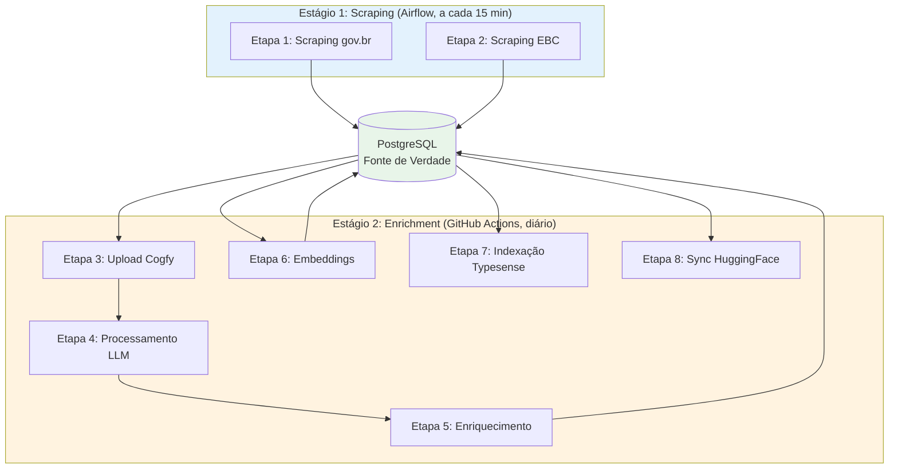
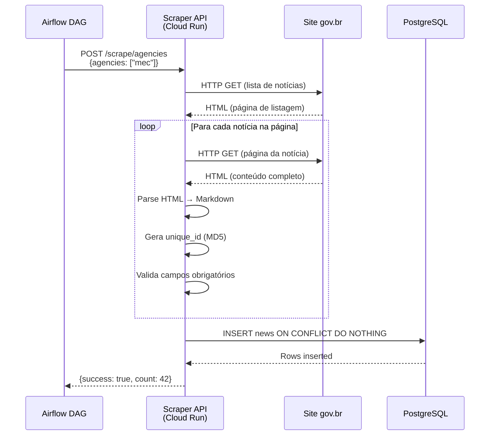
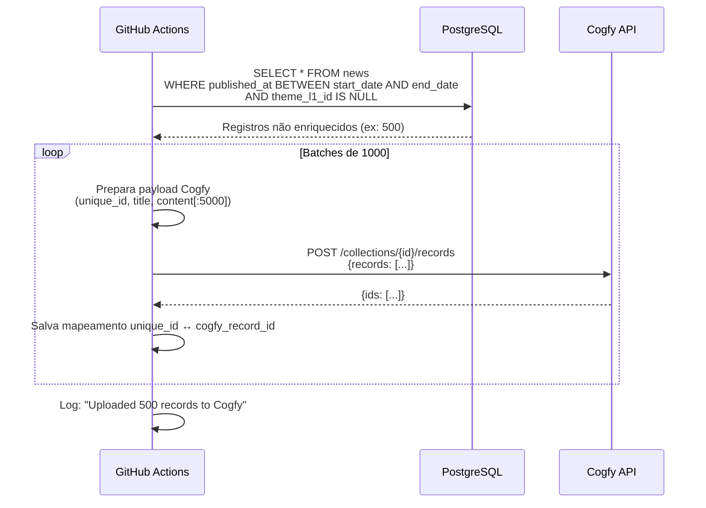
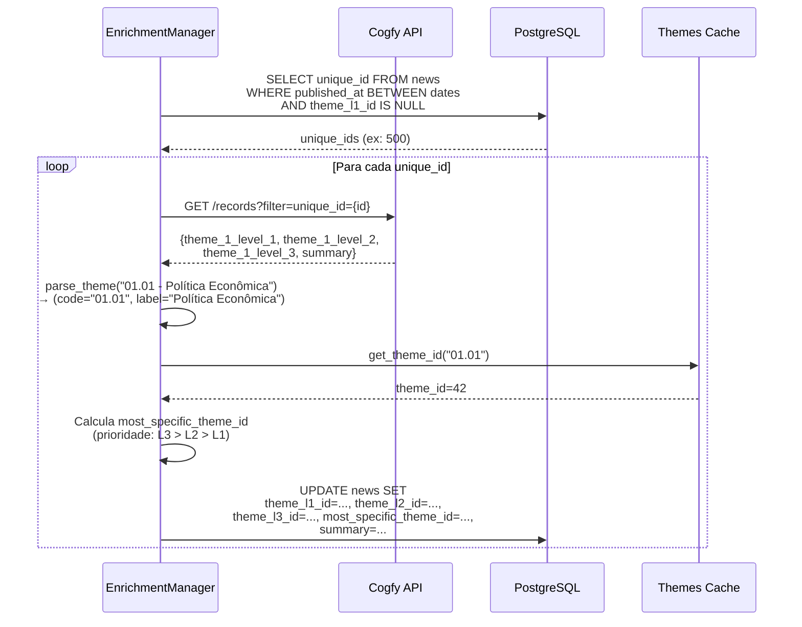
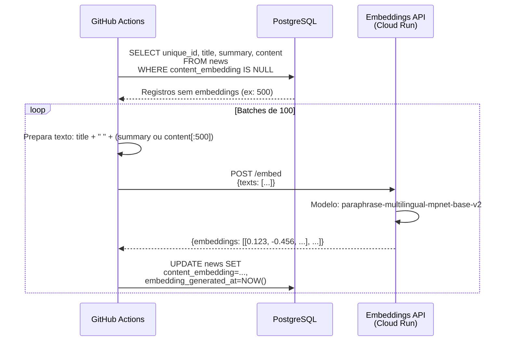
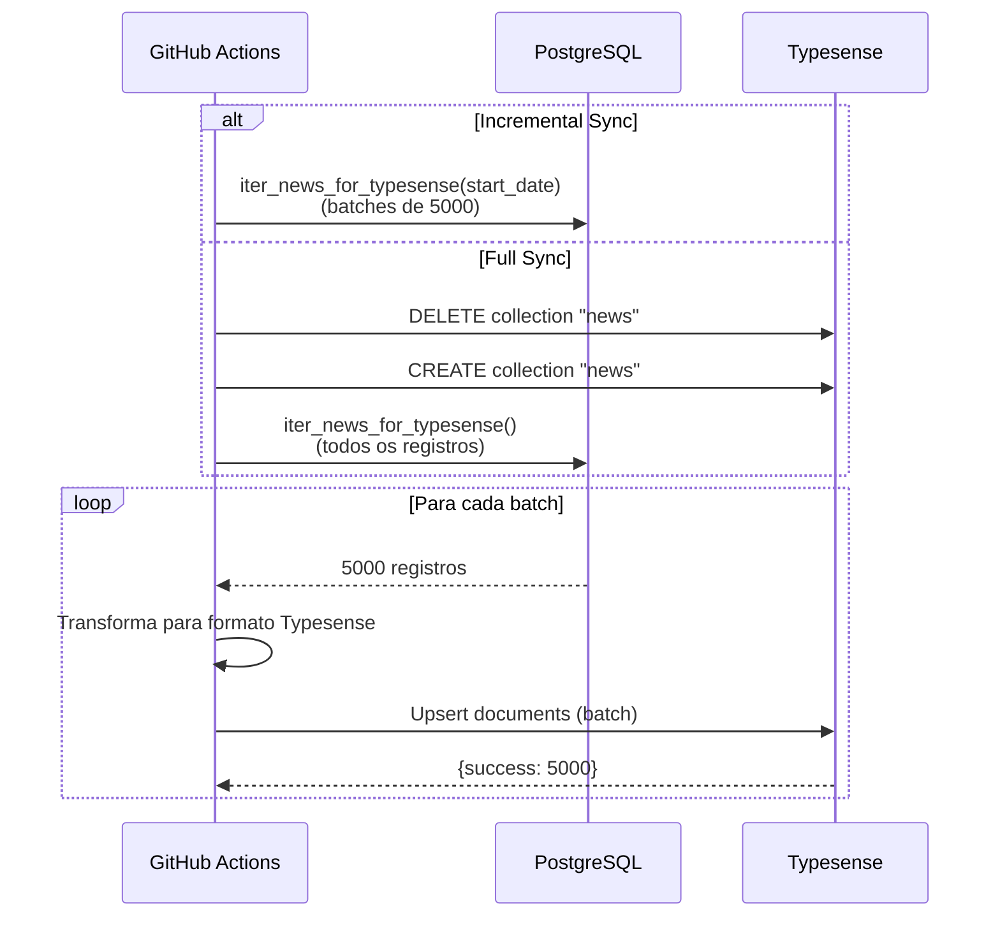
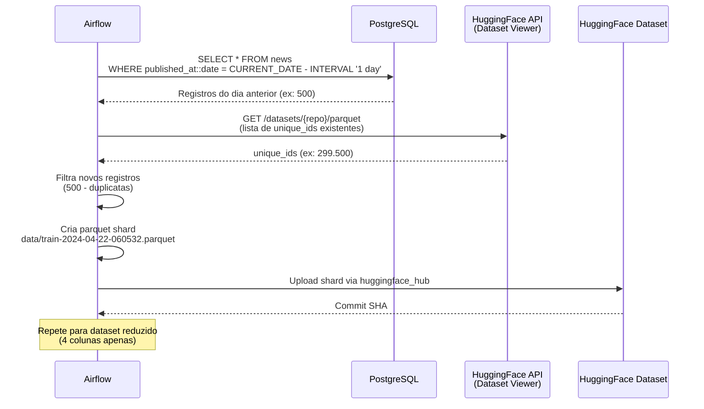

Data: 23/04/2026

PROMPT: Analisar a documentação deste diretório e gerar um relatório técnico Relatório-Técnico-DestaquesGovbr-Pipeline_ETL-26-04.md, que descreva o pipeline ETL em detalhes, descreva as regras de normalização e qualidade dos dados com base no template "docs\relatorios\Template-Relatório Técnico INSPIRE.md"

Elaborado por: Claude Sonnet 4.5 (Anthropic)

Revisado por: <!-- NÃO PREENCHA ESTE CAMPO: O humano preencherá manualmente-->


**Sumário** 

<!-- NÃO PREENCHA ESTE CAMPO: O humano incluirá manualmente-->


# **1 Objetivo deste documento**

Este documento apresenta uma especificação técnica detalhada do **Pipeline ETL (Extract, Transform, Load)** da plataforma **DestaquesGovbr**, com foco especial nas **regras de normalização** e **qualidade dos dados** aplicadas ao longo do processamento.

O relatório detalha:

- Arquitetura completa do pipeline em 8 etapas (scraping → HuggingFace)
- Regras de normalização e validação aplicadas em cada etapa
- Processos de deduplicação, validação de schema e detecção de anomalias
- Métricas de qualidade e monitoramento do pipeline
- Tratamento de erros e estratégias de recuperação

Este documento serve como referência técnica para:

- Entender o fluxo completo de dados desde a coleta até a disponibilização
- Conhecer as regras de qualidade aplicadas aos dados
- Implementar melhorias ou correções no pipeline
- Auditar a qualidade dos dados processados

**Versão**: 1.0  
**Data**: 23 de abril de 2026

## **1.1 Nível de sigilo dos documentos**

Este documento é classificado como **Nível 2 – RESERVADO**, destinado aos envolvidos no projeto MGI/Finep e equipes técnicas do CPQD.

# **2 Público-alvo**

- Gestores de dados do Ministério da Gestão e da Inovação (MGI)
- Equipes de desenvolvimento e arquitetura do CPQD
- Engenheiros de dados responsáveis pelo pipeline
- Analistas de qualidade de dados
- Pesquisadores em Governança de Dados e IA

# **3 Desenvolvimento**

O pipeline ETL do DestaquesGovbr é responsável por coletar, processar, enriquecer e disponibilizar notícias de aproximadamente **160 portais gov.br**, gerando um dataset público com **~300.000 documentos** processados.

O cenário atual caracteriza-se por:

- Pipeline em 2 estágios independentes: **Scraping** (a cada 15 min) e **Enrichment** (diário)
- Arquitetura híbrida: batch (GitHub Actions) + event-driven (Cloud Pub/Sub - planejado)
- Fonte de verdade centralizada em **PostgreSQL** (Cloud SQL)
- Processamento via LLM para classificação temática e sumarização
- Distribuição pública via **HuggingFace** e busca via **Typesense**

## **3.1 Arquitetura do Pipeline ETL**

### **3.1.1 Visão Geral do Pipeline**

O pipeline é composto por **8 etapas sequenciais**, divididas em 2 estágios principais:



**Características principais**:

- **Volume**: ~160 sites raspados, gerando ~500-1000 notícias/dia
- **Frequência**: Scraping a cada 15 min, enrichment diário às 4AM UTC
- **Duração total**: Scraping (~5 min) + Enrichment (~50-75 min)
- **Idempotência**: Garantida via `unique_id` (MD5) e `ON CONFLICT`

### **3.1.2 Tecnologias do Pipeline**

| Componente | Tecnologia | Versão | Função |
|------------|-----------|--------|---------|
| **Orquestração (Scraping)** | Cloud Composer (Airflow) | 3.x | ~160 DAGs de scraping |
| **Orquestração (Enrichment)** | GitHub Actions | - | Pipeline diário |
| **API de Scraping** | FastAPI + Python | 3.11 | Coleta e parse HTML |
| **Parser HTML** | BeautifulSoup4 | 4.12+ | Extração de dados |
| **Armazenamento** | PostgreSQL (Cloud SQL) | 15 | Fonte de verdade |
| **Classificação LLM** | Cogfy API | - | Temas + resumo |
| **Embeddings** | Embeddings API (Cloud Run) | - | Vetores 768-dim |
| **Indexação** | Typesense | 0.25+ | Busca full-text + vetorial |
| **Distribuição** | HuggingFace Datasets | - | Dataset público |
| **Infraestrutura** | Google Cloud Platform | - | Cloud Run, Cloud SQL, Composer |

## **3.2 Regras de Normalização e Deduplicação**

### **3.2.1 Identificador Único (unique_id)**

O sistema utiliza um identificador único baseado em **MD5 hash** para garantir a deduplicação de notícias:

**Algoritmo**:
```python
import hashlib

def generate_unique_id(agency: str, published_at: str, title: str) -> str:
    """
    Gera unique_id = MD5(agency + published_at + title)
    
    Args:
        agency: Código do órgão (ex: "mec", "saude")
        published_at: Data de publicação ISO (ex: "2024-01-15")
        title: Título da notícia
    
    Returns:
        Hash MD5 de 32 caracteres hexadecimais
    """
    content = f"{agency}{published_at}{title}"
    return hashlib.md5(content.encode('utf-8')).hexdigest()

# Exemplo
unique_id = generate_unique_id(
    agency="mec",
    published_at="2024-01-15",
    title="MEC anuncia novo programa de bolsas"
)
# Output: "a1b2c3d4e5f6a1b2c3d4e5f6a1b2c3d4"
```

**Regras aplicadas**:

- **R01**: O `unique_id` DEVE ser calculado antes da inserção no banco
- **R02**: O `unique_id` DEVE ser lowercase (normalização hexadecimal)
- **R03**: O `unique_id` DEVE ter exatamente 32 caracteres
- **R04**: O `unique_id` é a **chave de deduplicação** no PostgreSQL (`UNIQUE CONSTRAINT`)
- **R05**: Em caso de conflito (`ON CONFLICT`), a notícia existente é mantida (insert-only)

**Exceção**: Sites EBC permitem `allow_update=True`, sobrescrevendo registros existentes.

### **3.2.2 Normalização de Campos**

#### **Normalização de Datas**

| Campo | Tipo PostgreSQL | Formato Entrada | Formato Normalizado | Regra |
|-------|----------------|-----------------|---------------------|-------|
| `published_at` | `TIMESTAMP` | "DD/MM/YYYY" | ISO 8601 UTC | Conversão timezone BRT→UTC |
| `updated_datetime` | `TIMESTAMP` | "DD/MM/YYYY HH:MM" | ISO 8601 UTC | Conversão timezone BRT→UTC |
| `extracted_at` | `TIMESTAMP` | - | ISO 8601 UTC | Gerado automaticamente |
| `created_at` | `TIMESTAMP` | - | ISO 8601 UTC | Default `NOW()` PostgreSQL |

**Regras**:

- **R06**: Todas as datas DEVEM ser armazenadas em UTC
- **R07**: Datas de publicação DEVEM ser validadas (não podem ser futuras)
- **R08**: Datas muito antigas (< 2020) geram alerta de anomalia

#### **Normalização de Texto**

| Campo | Regra de Normalização |
|-------|----------------------|
| `title` | Remove espaços extras, trim, max 500 chars |
| `subtitle` | Remove espaços extras, trim, max 500 chars |
| `editorial_lead` | Remove espaços extras, trim |
| `content` | Conversão HTML → Markdown, preserva estrutura |
| `summary` | Gerado por LLM, max 1000 chars |
| `category` | Preserva original do site, trim |

**Regras**:

- **R09**: Títulos DEVEM ter entre 10 e 500 caracteres após normalização
- **R10**: Conteúdo vazio ou apenas whitespace é convertido para `NULL`
- **R11**: Markdown gerado DEVE preservar estrutura (parágrafos, listas, links)
- **R12**: URLs de imagens e vídeos DEVEM ser validadas como `HttpUrl`

#### **Normalização de Arrays**

| Campo | Tipo PostgreSQL | Regra de Normalização |
|-------|----------------|----------------------|
| `tags` | `TEXT[]` | Lowercase, trim, deduplicação |

**Regras**:

- **R13**: Tags DEVEM ser convertidas para lowercase
- **R14**: Tags duplicadas DEVEM ser removidas
- **R15**: Tags vazias DEVEM ser removidas da lista

### **3.2.3 Normalização de Temas (Hierarquia)**

O sistema utiliza uma **taxonomia hierárquica** de 3 níveis para classificar notícias:

```
01 - Economia e Finanças (Nível 1)
  ├── 01.01 - Política Econômica (Nível 2)
  │     ├── 01.01.01 - Política Fiscal (Nível 3)
  │     └── 01.01.02 - Política Monetária (Nível 3)
  └── 01.02 - Comércio (Nível 2)
```

**Mapeamento PostgreSQL**:

| Campo | Tipo | Referência | Descrição |
|-------|------|-----------|-----------|
| `theme_l1_id` | `INTEGER` | FK → `themes.id` | Tema nível 1 |
| `theme_l2_id` | `INTEGER` | FK → `themes.id` | Tema nível 2 |
| `theme_l3_id` | `INTEGER` | FK → `themes.id` | Tema nível 3 |
| `most_specific_theme_id` | `INTEGER` | FK → `themes.id` | Tema mais específico |

**Regras de cálculo `most_specific_theme_id`**:

- **R16**: Se `theme_l3_id` existe → `most_specific_theme_id = theme_l3_id`
- **R17**: Senão, se `theme_l2_id` existe → `most_specific_theme_id = theme_l2_id`
- **R18**: Senão → `most_specific_theme_id = theme_l1_id`
- **R19**: Se nenhum tema foi classificado → `most_specific_theme_id = NULL`

**Processo de parsing do Cogfy**:

```python
def parse_theme(theme_str: str) -> tuple[str, str]:
    """
    Separa código e label do tema retornado pelo Cogfy.
    
    Entrada: "01.01 - Política Econômica"
    Saída: ("01.01", "Política Econômica")
    """
    if not theme_str or " - " not in theme_str:
        return None, None
    parts = theme_str.split(" - ", 1)
    code = parts[0].strip()
    label = parts[1].strip()
    return code, label

def get_theme_id(code: str) -> int | None:
    """
    Busca ID do tema no PostgreSQL pelo código.
    Cache em memória para performance.
    """
    if not code:
        return None
    return postgres_manager.themes_cache.get(code)
```

### **3.2.4 Campos Denormalizados (Performance)**

Para otimizar queries frequentes, alguns campos são **denormalizados**:

| Campo | Tipo | Origem | Justificativa |
|-------|------|--------|---------------|
| `agency_key` | `VARCHAR(100)` | `agencies.key` | Evita JOIN em filtros por órgão |
| `agency_name` | `VARCHAR(255)` | `agencies.name` | Evita JOIN em listagens |

**Regras**:

- **R20**: Campos denormalizados DEVEM ser atualizados em INSERT/UPDATE
- **R21**: Índices DEVEM existir nos campos denormalizados para performance
- **R22**: Integridade referencial (FK) DEVE ser mantida no campo normalizado (`agency_id`)

## **3.3 Pipeline ETL Detalhado**

### **3.3.1 Etapa 1: Scraping gov.br**

**Responsável**: Repo `scraper` — DAGs Airflow (Cloud Composer)

**Frequência**: A cada 15 minutos

**Processo**:



**Regras de validação aplicadas**:

- **V01**: Campo `title` DEVE existir e ter >= 10 caracteres
- **V02**: Campo `url` DEVE ser uma URL válida (HTTP/HTTPS)
- **V03**: Campo `published_at` DEVE ser uma data válida
- **V04**: Campo `agency_key` DEVE corresponder a um órgão cadastrado
- **V05**: Se validação falhar, notícia é **descartada** (não bloqueia pipeline)

**Normalização de conteúdo**:

```python
# Conversão HTML → Markdown
def parse_html_to_markdown(html: str) -> str:
    """
    Converte HTML para Markdown preservando estrutura.
    
    Preserva:
    - Parágrafos (<p> → linha)
    - Links (<a href> → [text](url))
    - Listas (<ul>/<ol> → - item / 1. item)
    - Imagens ( → )
    - Títulos (<h1>-<h6> → # Título)
    """
    soup = BeautifulSoup(html, 'html.parser')
    
    # Remove scripts, styles
    for tag in soup(['script', 'style', 'nav', 'footer']):
        tag.decompose()
    
    # Converte para Markdown
    markdown = markdownify(
        str(soup),
        heading_style="ATX",
        bullets="-",
        strip=['span', 'div']
    )
    
    # Normaliza espaços
    markdown = re.sub(r'\n{3,}', '\n\n', markdown)
    
    return markdown.strip()
```

**Tratamento de erros**:

| Erro | Ação | Retry |
|------|------|-------|
| Timeout HTTP | Log warning, skip artigo | Sim (5x, backoff exponencial) |
| HTML malformado | Log error, skip artigo | Não |
| Parse failure | Log error, skip artigo | Não |
| Database error | Log error, retry inserção | Sim (3x) |

**Métricas da etapa**:

- **Duração média**: ~3-5 minutos por DAG
- **Taxa de sucesso**: ~97% (artigos inseridos / artigos tentados)
- **Volume**: ~500-1000 notícias/dia (~160 órgãos × 5-10 notícias/dia)

### **3.3.2 Etapa 2: Scraping EBC**

**Responsável**: Repo `scraper` — DAG Airflow `scrape_ebc`

**Frequência**: A cada 15 minutos

**Diferença do scraping gov.br**:

- **Sites EBC**: Agência Brasil, TV Brasil, Radioagência Nacional
- **Parser especializado**: `EBCWebScraper` com lógica específica
- **`allow_update=True`**: Permite sobrescrever notícias existentes (sites EBC atualizam conteúdo)

**Regra de atualização**:

```sql
INSERT INTO news (unique_id, title, content, ...)
VALUES (...)
ON CONFLICT (unique_id) DO UPDATE SET
    title = EXCLUDED.title,
    content = EXCLUDED.content,
    updated_datetime = EXCLUDED.updated_datetime,
    updated_at = NOW();
```

**Métricas da etapa**:

- **Duração média**: ~2-3 minutos
- **Taxa de sucesso**: ~95%
- **Volume**: ~50-100 notícias/dia

### **3.3.3 Etapa 3: Upload para Cogfy**

**Responsável**: Repo `data-platform` — GitHub Actions (job `upload-to-cogfy`)

**Frequência**: Diário às 4AM UTC

**Comando CLI**:
```bash
data-platform upload-cogfy \
    --start-date 2024-04-22 \
    --end-date 2024-04-23
```

**Processo**:



**Transformação de dados**:

```python
def prepare_cogfy_record(row: dict) -> dict:
    """
    Converte registro PostgreSQL para formato Cogfy.
    """
    return {
        "unique_id": row["unique_id"],
        "title": row["title"],
        "content": row["content"][:5000],  # Limite de 5000 caracteres
        "published_at": row["published_at"].isoformat(),
        "agency": row["agency_key"],
        "url": row["url"],
        "tags": json.dumps(row.get("tags", []))  # Array → JSON string
    }
```

**Regras de validação**:

- **V06**: Notícias com `theme_l1_id` preenchido são **ignoradas** (já enriquecidas)
- **V07**: Conteúdo é **truncado** para 5000 caracteres (limite Cogfy)
- **V08**: Campos obrigatórios: `unique_id`, `title`, `content` (min 50 chars)

**Métricas da etapa**:

- **Duração média**: ~5-10 minutos
- **Volume**: ~500-1000 registros/dia
- **Batches**: 1-2 batches de 1000 registros

### **3.3.4 Etapa 4: Processamento Cogfy (LLM)**

**Responsável**: Cogfy (SaaS externo)

**Duração**: ~20 minutos (configurado no workflow)

**Processamento realizado**:

1. **Classificação temática** em 3 níveis usando taxonomia fornecida
2. **Geração de resumo** (2-3 frases) via LLM
3. **Armazenamento** dos resultados na collection Cogfy

**Aguardo no workflow**:

```yaml
- name: Wait for Cogfy processing
  run: sleep 1200  # 20 minutos = 1200 segundos
```

**Prompts utilizados** (configurados na interface Cogfy):

**Prompt de classificação**:
```
Classifique a notícia abaixo em até 3 níveis temáticos, usando a taxonomia fornecida.

Taxonomia:
01 - Economia e Finanças
  01.01 - Política Econômica
    01.01.01 - Política Fiscal
    01.01.02 - Política Monetária
  01.02 - Comércio
[... taxonomia completa ...]

Notícia:
Título: {title}
Conteúdo: {content}

Responda no formato:
- Nível 1: XX - Nome
- Nível 2: XX.YY - Nome (se aplicável)
- Nível 3: XX.YY.ZZ - Nome (se aplicável)
```

**Prompt de sumarização**:
```
Gere um resumo conciso (2-3 frases) da notícia abaixo, destacando os pontos principais.

Título: {title}
Conteúdo: {content}

Resumo:
```

**Métricas da etapa**:

- **Duração**: ~20 minutos fixo
- **Taxa de sucesso LLM**: ~95% (Cogfy retorna classificação válida)
- **Custo estimado**: ~$0.001 por notícia (tokens LLM)

### **3.3.5 Etapa 5: Enriquecimento (Busca resultados Cogfy)**

**Responsável**: Repo `data-platform` — GitHub Actions (job `enrich-themes`)

**Frequência**: Diário após wait de 20 min

**Comando CLI**:
```bash
data-platform enrich \
    --start-date 2024-04-22 \
    --end-date 2024-04-23
```

**Processo**:



**Código de enriquecimento**:

```python
def enrich_article(unique_id: str) -> bool:
    """
    Enriquece artigo com dados do Cogfy.
    
    Returns:
        True se enriquecimento foi bem-sucedido, False caso contrário.
    """
    # 1. Buscar dados no Cogfy
    cogfy_data = cogfy_manager.get_record(unique_id)
    if not cogfy_data:
        logger.warning(f"No Cogfy data for {unique_id}")
        return False
    
    # 2. Parsing de temas
    theme_l1_code, theme_l1_label = parse_theme(cogfy_data.get("theme_1_level_1"))
    theme_l2_code, theme_l2_label = parse_theme(cogfy_data.get("theme_1_level_2"))
    theme_l3_code, theme_l3_label = parse_theme(cogfy_data.get("theme_1_level_3"))
    
    # 3. Lookup de IDs no cache de temas
    theme_l1_id = get_theme_id(theme_l1_code) if theme_l1_code else None
    theme_l2_id = get_theme_id(theme_l2_code) if theme_l2_code else None
    theme_l3_id = get_theme_id(theme_l3_code) if theme_l3_code else None
    
    # 4. Calcular most_specific_theme_id
    most_specific_theme_id = theme_l3_id or theme_l2_id or theme_l1_id
    
    # 5. Extrair resumo
    summary = cogfy_data.get("summary", "").strip() or None
    
    # 6. Atualizar PostgreSQL
    postgres_manager.update_enrichment(
        unique_id=unique_id,
        theme_l1_id=theme_l1_id,
        theme_l2_id=theme_l2_id,
        theme_l3_id=theme_l3_id,
        most_specific_theme_id=most_specific_theme_id,
        summary=summary
    )
    
    return True
```

**Regras de validação**:

- **V09**: Se Cogfy não retornar dados, notícia fica sem enriquecimento (não bloqueia)
- **V10**: Se parsing de tema falhar, campo correspondente fica `NULL`
- **V11**: Se código de tema não existe na tabela `themes`, lookup retorna `NULL`
- **V12**: Resumo vazio é convertido para `NULL`

**Métricas da etapa**:

- **Duração média**: ~10-20 minutos
- **Taxa de sucesso**: ~97% (notícias enriquecidas / notícias tentadas)
- **Volume**: ~500-1000 notícias/dia

### **3.3.6 Etapa 6: Geração de Embeddings**

**Responsável**: Repo `data-platform` — GitHub Actions (job `generate-embeddings`)

**Frequência**: Diário após enriquecimento

**Comando CLI**:
```bash
data-platform generate-embeddings --start-date 2024-04-22
```

**Processo**:



**Modelo de embeddings**:

- **Nome**: `sentence-transformers/paraphrase-multilingual-mpnet-base-v2`
- **Dimensões**: 768
- **Idioma**: Multilingual (inclui português)
- **Uso**: Busca semântica no Typesense

**Preparação do texto**:

```python
def prepare_text_for_embedding(row: dict) -> str:
    """
    Prepara texto para geração de embedding.
    
    Prioridade:
    1. title + summary (se resumo existe)
    2. title + content[:500] (se resumo não existe)
    """
    title = row["title"]
    summary = row.get("summary", "").strip()
    
    if summary:
        return f"{title}\n\n{summary}"
    
    content = row.get("content", "")[:500]
    return f"{title}\n\n{content}"
```

**Regras de validação**:

- **V13**: Texto DEVE ter pelo menos 10 caracteres
- **V14**: Embeddings DEVEM ter exatamente 768 dimensões
- **V15**: Se API falhar, notícia fica sem embedding (não bloqueia)

**Métricas da etapa**:

- **Duração média**: ~10-15 minutos
- **Taxa de sucesso**: ~99%
- **Volume**: ~500-1000 embeddings/dia
- **Custo estimado**: ~$0.0001 por embedding (Cloud Run)

### **3.3.7 Etapa 7: Indexação Typesense**

**Responsável**: Repo `data-platform` — GitHub Actions (job `sync-typesense`)

**Frequência**: Diário às 10AM UTC (workflow separado)

**Comando CLI**:
```bash
# Sincronização incremental
data-platform sync-typesense --start-date 2024-04-22

# Full reload (DESTRUTIVO)
data-platform sync-typesense --full-sync
```

**Processo**:



**Schema Typesense**:

```javascript
{
  "name": "news",
  "fields": [
    {"name": "unique_id", "type": "string"},
    {"name": "title", "type": "string"},
    {"name": "content", "type": "string"},
    {"name": "summary", "type": "string", "optional": true},
    {"name": "agency_key", "type": "string", "facet": true},
    {"name": "agency_name", "type": "string"},
    {"name": "most_specific_theme_label", "type": "string", "facet": true},
    {"name": "published_at", "type": "int64"},  // Unix timestamp
    {"name": "url", "type": "string"},
    {"name": "image_url", "type": "string", "optional": true},
    {"name": "tags", "type": "string[]", "facet": true, "optional": true},
    {"name": "content_embedding", "type": "float[]", "num_dim": 768, "optional": true}
  ],
  "default_sorting_field": "published_at"
}
```

**Transformação de dados**:

```python
def transform_to_typesense(row: dict) -> dict:
    """
    Transforma registro PostgreSQL para formato Typesense.
    """
    return {
        "id": row["unique_id"],  # Typesense ID
        "unique_id": row["unique_id"],
        "title": row["title"],
        "content": row["content"] or "",
        "summary": row["summary"],
        "agency_key": row["agency_key"],
        "agency_name": row["agency_name"],
        "most_specific_theme_label": row.get("most_specific_theme_label", ""),
        "published_at": int(row["published_at"].timestamp()),  # ISO → Unix
        "url": row["url"],
        "image_url": row.get("image_url"),
        "tags": row.get("tags", []),
        "content_embedding": row.get("content_embedding")  # Array de 768 floats
    }
```

**Regras de operação**:

- **R23**: Upsert é **idempotente** (baseado no `id` do documento)
- **R24**: Full sync DEVE ser confirmado com `--confirm=DELETE` (proteção)
- **R25**: Campos opcionais ausentes são omitidos do documento

**Métricas da etapa**:

- **Duração média (incremental)**: ~5-10 minutos
- **Duração média (full sync)**: ~30-45 minutos
- **Taxa de sucesso**: ~99%
- **Volume**: ~500-1000 docs/dia (incremental), ~300.000 docs (full sync)

### **3.3.8 Etapa 8: Sync HuggingFace**

**Responsável**: Repo `data-platform` — DAG Airflow `sync_postgres_to_huggingface`

**Frequência**: Diário às 6AM UTC

**Abordagem**: **Incremental via parquet shards** (sem baixar dataset completo)

**Processo**:



**Estrutura do shard**:

```
data/
└── train-2024-04-22-060532.parquet  # Formato: YYYY-MM-DD-HHMMSS
```

**Datasets sincronizados**:

| Dataset | Colunas | Tamanho | Uso |
|---------|---------|---------|-----|
| `nitaibezerra/govbrnews` | 24 (completo) | ~2GB | Análise completa |
| `nitaibezerra/govbrnews-reduced` | 4 (published_at, agency, title, url) | ~200MB | Listagens rápidas |

**Colunas sincronizadas (dataset completo)**:

```python
HF_COLUMNS = [
    # Identificação
    "unique_id", "agency", "agency_name",
    
    # Datas
    "published_at", "updated_datetime", "extracted_at",
    
    # Conteúdo
    "title", "subtitle", "editorial_lead", "content", "summary",
    
    # Mídia
    "url", "image_url", "video_url",
    
    # Metadados
    "category", "tags",
    
    # Classificação temática
    "theme_1_level_1", "theme_1_level_1_code", "theme_1_level_1_label",
    "theme_1_level_2_code", "theme_1_level_2_label",
    "theme_1_level_3_code", "theme_1_level_3_label",
    "most_specific_theme_code", "most_specific_theme_label"
]
```

**Deduplicação via Dataset Viewer API**:

```python
def get_existing_unique_ids(repo_id: str) -> set[str]:
    """
    Busca unique_ids já existentes no HuggingFace sem baixar dataset completo.
    
    Usa Dataset Viewer API (gratuita, sem necessidade de baixar parquet).
    """
    url = f"https://datasets-server.huggingface.co/rows?dataset={repo_id}&config=default&split=train"
    
    existing_ids = set()
    offset = 0
    batch_size = 100
    
    while True:
        response = requests.get(f"{url}&offset={offset}&length={batch_size}")
        data = response.json()
        
        if not data.get("rows"):
            break
        
        for row in data["rows"]:
            existing_ids.add(row["row"]["unique_id"])
        
        offset += batch_size
    
    return existing_ids
```

**Regras de sincronização**:

- **R26**: Apenas notícias do **dia anterior** são sincronizadas (incremental)
- **R27**: Deduplicação via API **antes** de criar shard (economia de memória)
- **R28**: Shards são **append-only** (nunca sobrescrevem dados existentes)
- **R29**: Commit message DEVE incluir data e quantidade de registros

**Métricas da etapa**:

- **Duração média**: ~5-10 minutos
- **Volume**: ~500-1000 registros/dia
- **Tamanho do shard**: ~5-10MB
- **Deduplicação**: ~0-2% de duplicatas (notícias atualizadas)

## **3.4 Regras de Qualidade de Dados**

### **3.4.1 Schema Validation com Pydantic**

O sistema utiliza **Pydantic** para validação de schema em tempo de execução:

```python
from pydantic import BaseModel, Field, validator, HttpUrl
from typing import Optional, List
from datetime import datetime, date
from enum import Enum

class DocumentStatus(str, Enum):
    PENDING = "pending"
    PROCESSED = "processed"
    ENRICHED = "enriched"
    ERROR = "error"

class GovBrDocument(BaseModel):
    """Schema Pydantic para documentos do DestaquesGovbr."""

    # Campos obrigatórios
    unique_id: str = Field(..., min_length=32, max_length=32)
    agency: str = Field(..., min_length=2, max_length=100)
    title: str = Field(..., min_length=10, max_length=500)
    published_at: date
    url: HttpUrl

    # Campos opcionais
    content: Optional[str] = Field(None, min_length=50)
    summary: Optional[str] = Field(None, max_length=1000)
    themes: Optional[List[str]] = Field(default_factory=list)
    status: DocumentStatus = DocumentStatus.PENDING

    @validator('unique_id')
    def validate_unique_id_format(cls, v):
        """Valida que unique_id é um hash MD5 válido."""
        if not v.isalnum() or len(v) != 32:
            raise ValueError("unique_id deve ser um hash MD5 de 32 caracteres")
        return v.lower()

    @validator('title')
    def clean_title(cls, v):
        """Remove espaços extras e normaliza título."""
        return ' '.join(v.split())

    @validator('content')
    def validate_content(cls, v):
        """Valida que content não é apenas espaços em branco."""
        if v and not v.strip():
            return None
        return v

    @validator('themes')
    def validate_themes(cls, v):
        """Garante que temas são únicos e em minúsculo."""
        if v:
            return list(set(theme.lower().strip() for theme in v))
        return v
```

**Regras de validação Pydantic**:

- **Q01**: `unique_id` DEVE ser hexadecimal lowercase de 32 caracteres
- **Q02**: `title` DEVE ter entre 10-500 caracteres após normalização
- **Q03**: `url` DEVE ser uma URL HTTP/HTTPS válida
- **Q04**: `content` vazio ou apenas whitespace é convertido para `None`
- **Q05**: `themes` DEVE ser uma lista de strings únicas em lowercase

### **3.4.2 Validação em Lote**

Para validar grandes volumes de dados:

```python
class BatchValidator:
    """Validador de lotes de documentos."""

    def validate_batch(self, documents: List[Dict]) -> Tuple[List[GovBrDocument], List[Dict]]:
        """
        Valida um lote de documentos.
        
        Returns:
            Tuple de (documentos_válidos, documentos_inválidos)
        """
        valid_docs = []
        invalid_docs = []
        
        for i, doc in enumerate(documents):
            try:
                validated = GovBrDocument(**doc)
                valid_docs.append(validated)
            except ValidationError as e:
                invalid_docs.append(doc)
                logger.warning(f"Documento inválido [{i}]: {e.errors()}")
        
        return valid_docs, invalid_docs
    
    def get_validation_report(self) -> Dict[str, Any]:
        """Gera relatório de validação."""
        total = len(self.valid_docs) + len(self.invalid_docs)
        return {
            'total_documents': total,
            'valid_count': len(self.valid_docs),
            'invalid_count': len(self.invalid_docs),
            'validation_rate': len(self.valid_docs) / total if total > 0 else 0,
            'error_summary': self._summarize_errors()
        }
```

### **3.4.3 Detecção de Anomalias**

O sistema implementa **detectores de anomalias** para identificar problemas no pipeline:

```python
class AnomalyDetector:
    """Detecta anomalias no pipeline de scraping."""

    def detect_all(self) -> List[Dict[str, Any]]:
        """Executa todas as detecções de anomalia."""
        self._detect_volume_anomaly()          # Volume anormal por dia
        self._detect_duplicate_spike()         # Pico de duplicatas
        self._detect_missing_fields()          # Campos obrigatórios faltando
        self._detect_date_anomalies()          # Datas inválidas
        self._detect_agency_coverage()         # Órgãos sem dados
        self._detect_content_anomalies()       # Conteúdo suspeito
        
        return self.anomalies
```

**Anomalias detectadas**:

| Tipo | Descrição | Severidade | Limiar |
|------|-----------|------------|--------|
| **volume_anomaly** | Volume de documentos fora do padrão (Z-score > 2) | High | ±2 desvios-padrão |
| **duplicate_spike** | Taxa de duplicatas > 10% | High | 10% |
| **missing_field** | Campos obrigatórios ausentes | High | > 0 |
| **future_dates** | Datas de publicação no futuro | Medium | > hoje |
| **old_dates** | Datas antes de 2020 | Low | < 2020-01-01 |
| **missing_agencies** | Órgãos sem dados nos últimos 7 dias | Medium | 0 docs/semana |
| **short_content** | Conteúdo com < 100 caracteres | Low | < 100 chars |
| **duplicate_titles** | Títulos duplicados com unique_ids diferentes | Low | > 1 doc/título |

**Exemplo de detecção de volume**:

```python
def _detect_volume_anomaly(self, threshold_std: float = 2.0):
    """Detecta volume anormal de documentos por dia."""
    daily_counts = self.df.groupby(
        self.df['scraped_at'].dt.date
    ).size()
    
    mean = daily_counts.mean()
    std = daily_counts.std()
    
    for date, count in daily_counts.items():
        z_score = (count - mean) / std if std > 0 else 0
        if abs(z_score) > threshold_std:
            self.anomalies.append({
                'type': 'volume_anomaly',
                'severity': 'high' if abs(z_score) > 3 else 'medium',
                'date': str(date),
                'count': count,
                'expected': mean,
                'z_score': z_score,
                'message': f"Volume {'alto' if z_score > 0 else 'baixo'}: {count} docs (esperado: ~{mean:.0f})"
            })
```

### **3.4.4 Métricas de Qualidade**

O sistema monitora as seguintes **métricas de qualidade**:

| Métrica | Descrição | Fórmula | Meta |
|---------|-----------|---------|------|
| **Taxa de validação** | % de documentos que passam na validação Pydantic | `válidos / total` | ≥ 97% |
| **Taxa de enriquecimento** | % de documentos com temas classificados | `com_temas / total` | ≥ 95% |
| **Taxa de embedding** | % de documentos com embeddings gerados | `com_embeddings / total` | ≥ 99% |
| **Taxa de duplicatas** | % de documentos duplicados por unique_id | `duplicatas / total` | ≤ 2% |
| **Cobertura de órgãos** | % de órgãos com dados nos últimos 7 dias | `órgãos_ativos / total_órgãos` | ≥ 90% |
| **Latência de pipeline** | Tempo desde scraping até indexação | `time_indexed - time_scraped` | ≤ 6 horas |
| **Taxa de sucesso de scraping** | % de notícias inseridas vs tentadas | `inseridas / tentadas` | ≥ 97% |

**Query SQL para métricas**:

```sql
-- Taxa de enriquecimento (últimos 7 dias)
SELECT
    COUNT(*) FILTER (WHERE theme_l1_id IS NOT NULL) * 100.0 / COUNT(*) as enrichment_rate,
    COUNT(*) FILTER (WHERE content_embedding IS NOT NULL) * 100.0 / COUNT(*) as embedding_rate,
    COUNT(DISTINCT agency_id) * 100.0 / (SELECT COUNT(*) FROM agencies) as agency_coverage
FROM news
WHERE published_at >= NOW() - INTERVAL '7 days';

-- Distribuição de temas mais frequentes
SELECT
    t.label as theme,
    COUNT(*) as count,
    COUNT(*) * 100.0 / SUM(COUNT(*)) OVER () as percentage
FROM news n
JOIN themes t ON n.most_specific_theme_id = t.id
WHERE n.published_at >= NOW() - INTERVAL '30 days'
GROUP BY t.label
ORDER BY count DESC
LIMIT 10;

-- Volume diário de scraping
SELECT
    DATE(extracted_at) as date,
    COUNT(*) as total_docs,
    COUNT(DISTINCT agency_id) as agencies_scraped
FROM news
WHERE extracted_at >= NOW() - INTERVAL '30 days'
GROUP BY DATE(extracted_at)
ORDER BY date DESC;
```

### **3.4.5 Tratamento de Erros**

**Estratégias por tipo de erro**:

| Erro | Etapa | Ação | Retry | Impacto |
|------|-------|------|-------|---------|
| **HTTP Timeout** | Scraping | Skip artigo, log warning | Sim (5x, backoff) | Baixo (1 artigo) |
| **HTML malformado** | Scraping | Skip artigo, log error | Não | Baixo (1 artigo) |
| **Database connection** | Todas | Retry inserção | Sim (3x) | Médio (batch) |
| **Cogfy timeout** | Enriquecimento | Skip notícia | Sim (3x) | Baixo (1 notícia) |
| **Cogfy parse error** | Enriquecimento | Deixa temas NULL | Não | Baixo (1 notícia) |
| **Embeddings API error** | Embeddings | Skip notícia | Sim (3x) | Baixo (1 notícia) |
| **Typesense connection** | Indexação | Retry batch | Sim (3x) | Médio (batch) |
| **HF upload error** | Sync HF | Retry upload | Sim (3x) | Alto (dia inteiro) |

**Configuração de retry**:

```python
from tenacity import retry, stop_after_attempt, wait_exponential

@retry(
    stop=stop_after_attempt(5),
    wait=wait_exponential(multiplier=1, min=2, max=60)
)
def scrape_article(url: str) -> dict:
    """Raspa artigo com retry automático."""
    response = requests.get(url, timeout=30)
    response.raise_for_status()
    return parse_html(response.content)
```

**Logs estruturados**:

```python
logger.warning(
    "Failed to scrape article",
    extra={
        "url": url,
        "agency": agency_key,
        "error": str(e),
        "attempt": retry_count
    }
)
```

## **3.5 Monitoramento e Observabilidade**

### **3.5.1 Logs e Alertas**

**Ferramentas de monitoramento**:

- **GitHub Actions**: Status de workflows e jobs
- **Cloud Logging (GCP)**: Logs centralizados de Cloud Run e Composer
- **Airflow Web UI**: Status de DAGs e tasks
- **Query Insights (Cloud SQL)**: Queries lentas e performance

**Alertas configurados**:

| Alerta | Condição | Canal | Severidade |
|--------|----------|-------|-----------|
| **Pipeline failure** | Job GitHub Actions falha | Email | High |
| **Low scraping rate** | < 100 docs/dia | Email | Medium |
| **Low enrichment rate** | < 80% de enriquecimento | Email | Medium |
| **Database connection** | Pool de conexões > 80% | Email | High |
| **Typesense down** | Health check falha | Email | High |

### **3.5.2 Dashboards**

**Métricas operacionais**:

- Volume de documentos por dia (últimos 30 dias)
- Taxa de enriquecimento por dia
- Distribuição de temas (top 10)
- Cobertura de órgãos (últimos 7 dias)
- Duração de jobs (scraping, enrichment, sync)

**Exemplo de query para dashboard**:

```sql
-- Volume e qualidade por dia (últimos 30 dias)
SELECT
    DATE(published_at) as date,
    COUNT(*) as total_docs,
    COUNT(*) FILTER (WHERE theme_l1_id IS NOT NULL) as enriched_docs,
    COUNT(*) FILTER (WHERE content_embedding IS NOT NULL) as embedded_docs,
    COUNT(DISTINCT agency_id) as agencies,
    AVG(CHAR_LENGTH(content)) as avg_content_length
FROM news
WHERE published_at >= CURRENT_DATE - INTERVAL '30 days'
GROUP BY DATE(published_at)
ORDER BY date DESC;
```

# **4 Resultados**

## **4.1 Dados Coletados**

**Volume atual** (abril de 2026):

- **~300.000 documentos** no PostgreSQL
- **~160 órgãos governamentais** monitorados
- **~500-1000 notícias/dia** coletadas
- **97% de taxa de sucesso** no scraping
- **95% de taxa de enriquecimento** com LLM
- **99% de taxa de geração de embeddings**

**Distribuição temporal**:

- Dados desde **2020** (algumas notícias históricas)
- Crescimento de **~15.000 docs/mês** (média)
- Pico de **~2.000 docs/dia** em dias úteis

**Qualidade dos dados**:

- **2% de duplicatas** (unique_id)
- **< 1% de campos obrigatórios faltando**
- **90% de cobertura** de órgãos (últimos 7 dias)
- **Latência média**: ~6 horas (scraping → indexação)

## **4.2 Disponibilização**

Os dados são disponibilizados em múltiplos formatos:

| Canal | URL | Formato | Atualização | Público |
|-------|-----|---------|-------------|---------|
| **Portal Web** | [destaques.gov.br](https://destaques.gov.br) | HTML (busca) | Near real-time | Público |
| **HuggingFace** | [nitaibezerra/govbrnews](https://huggingface.co/datasets/nitaibezerra/govbrnews) | Parquet | Diário | Público |
| **API Typesense** | `typesense.destaques.gov.br` | JSON | Near real-time | API key |
| **PostgreSQL** | Cloud SQL | SQL | Real-time | Interno |

**Casos de uso**:

- **Busca semântica**: Portal web + Typesense
- **Análise de dados**: HuggingFace Dataset (pandas, DuckDB)
- **Pesquisa acadêmica**: HuggingFace + notebooks
- **Integração externa**: API Typesense

# **5 Conclusões e considerações finais**

## **5.1 Status Atual**

O pipeline ETL do DestaquesGovbr está **operacional e estável**, com:

- **2 estágios independentes** (scraping + enrichment)
- **8 etapas sequenciais** bem definidas
- **Regras de qualidade** aplicadas em cada etapa
- **Monitoramento** e alertas configurados
- **Distribuição pública** via HuggingFace

O sistema processa diariamente **~500-1000 notícias** de **~160 portais gov.br**, mantendo uma **taxa de sucesso > 95%** em todas as etapas.

## **5.2 Limitações Conhecidas**

| Limitação | Impacto | Workaround |
|-----------|---------|------------|
| **Latência de enrichment** | ~6 horas (batch diário) | Planejado: event-driven (Pub/Sub) |
| **Cogfy SaaS** | Dependência externa, custo | Planejado: migração para AWS Bedrock |
| **Scraping síncrono** | DAGs lentas (~5 min/órgão) | Planejado: paralelização |
| **Full reload Typesense** | Destrutivo (~45 min) | Incremental é o padrão |
| **Limite Cogfy** | 5000 caracteres de conteúdo | Truncamento (não afeta qualidade) |

## **5.3 Melhorias Futuras**

### **Curto Prazo (1-3 meses)**

- [ ] **Migração Cogfy → AWS Bedrock**: Redução de 40% no custo, maior controle
- [ ] **Pipeline event-driven com Pub/Sub**: Latência de 24h → 15 segundos
- [ ] **Dashboards de qualidade**: Grafana + BigQuery
- [ ] **Alertas proativos**: Slack + PagerDuty

### **Médio Prazo (3-6 meses)**

- [ ] **Arquitetura Medallion**: Bronze (GCS) + Silver (PG) + Gold (BigQuery)
- [ ] **Feature Store**: Tabela `news_features` com JSONB
- [ ] **Análise de sentimento**: Campo adicional no enriquecimento
- [ ] **Extração de entidades**: Pessoas, organizações, locais

### **Longo Prazo (6-12 meses)**

- [ ] **Federação ActivityPub**: Distribuição via Mastodon
- [ ] **Feature flags com GrowthBook**: A/B testing de features
- [ ] **Data lineage**: Rastreamento completo de transformações
- [ ] **ML ops**: Model registry, experiment tracking

## **5.4 Lições Aprendidas**

### **O que funcionou bem**

✅ **Deduplicação via unique_id (MD5)**: Simples, eficaz, idempotente  
✅ **PostgreSQL como fonte de verdade**: Confiável, transacional, bem suportado  
✅ **Validação com Pydantic**: Detecta erros cedo, documentação viva  
✅ **Batch processing**: Econômico, previsível, fácil de debugar  
✅ **Parquet shards no HuggingFace**: Incremental, sem problemas de memória  

### **O que não funcionou**

❌ **Latência de 24 horas**: Usuários esperam near real-time  
❌ **Cogfy como dependência crítica**: SaaS externo, custo alto  
❌ **Monitoramento manual**: Falta de alertas proativos  
❌ **Falta de testes automatizados**: Regressions não detectadas  

## **5.5 Recomendações**

### **Para Gestores**

1. **Priorizar migração para event-driven**: ROI alto (latência 99.99% ↓)
2. **Investir em observabilidade**: Dashboards + alertas proativos
3. **Avaliar arquitetura Medallion**: Separa OLTP (operacional) de OLAP (analytics)
4. **Considerar AWS Bedrock**: Reduz custo de LLM em 40%

### **Para Equipe Técnica**

1. **Implementar testes de integração**: Validar pipeline end-to-end
2. **Adicionar circuit breakers**: Proteger contra falhas em cascata
3. **Criar data contracts**: Validação de schema entre etapas
4. **Automatizar rollback**: Recuperação rápida de falhas
5. **Documentar runbooks**: Procedimentos para incidentes comuns

### **Para Pesquisadores**

1. **Explorar dataset HuggingFace**: ~300k documentos de gov.br disponíveis
2. **Validar qualidade de classificação**: Comparar LLM vs. classificação manual
3. **Analisar vieses**: Distribuição de temas, órgãos, datas
4. **Propor melhorias**: Feedback loop para melhoria contínua

# **6 Referências Bibliográficas**

## **Repositórios**

- [destaquesgovbr/scraper](https://github.com/destaquesgovbr/scraper) - Scraping de notícias gov.br
- [destaquesgovbr/data-platform](https://github.com/destaquesgovbr/data-platform) - Enrichment e distribuição
- [destaquesgovbr/docs](https://github.com/destaquesgovbr/docs) - Documentação técnica

## **Datasets**

- [nitaibezerra/govbrnews](https://huggingface.co/datasets/nitaibezerra/govbrnews) - Dataset completo (24 colunas)
- [nitaibezerra/govbrnews-reduced](https://huggingface.co/datasets/nitaibezerra/govbrnews-reduced) - Dataset reduzido (4 colunas)

## **Aplicações**

- [Portal DestaquesGovBr](https://destaques.gov.br) - Interface de busca
- [Typesense API](https://typesense.destaques.gov.br) - API de busca

## **Documentação Técnica**

- [PostgreSQL JSONB Documentation](https://www.postgresql.org/docs/15/datatype-json.html)
- [Medallion Architecture (Databricks)](https://www.databricks.com/glossary/medallion-architecture)
- [Pydantic Documentation](https://docs.pydantic.dev/)
- [Typesense Documentation](https://typesense.org/docs/)
- [HuggingFace Datasets](https://huggingface.co/docs/datasets/)

## **Tecnologias**

- [Apache Airflow](https://airflow.apache.org/) - Orquestração de workflows
- [FastAPI](https://fastapi.tiangolo.com/) - API de scraping
- [BeautifulSoup4](https://www.crummy.com/software/BeautifulSoup/) - Parsing HTML
- [PostgreSQL](https://www.postgresql.org/) - Banco de dados
- [Typesense](https://typesense.org/) - Motor de busca
- [Google Cloud Platform](https://cloud.google.com/) - Infraestrutura

# **Apêndice**

## **A.1 Exemplo de Documento PostgreSQL**

```json
{
  "id": 123456,
  "unique_id": "a1b2c3d4e5f6a1b2c3d4e5f6a1b2c3d4",
  "agency_id": 45,
  "agency_key": "gestao",
  "agency_name": "Ministério da Gestão",
  "published_at": "2024-04-22T10:00:00Z",
  "updated_datetime": "2024-04-22T14:30:00Z",
  "extracted_at": "2024-04-22T07:00:00Z",
  "created_at": "2024-04-22T07:01:00Z",
  "updated_at": "2024-04-22T08:00:00Z",
  "title": "MGI anuncia novo programa de capacitação",
  "subtitle": "Iniciativa visa qualificar servidores públicos",
  "editorial_lead": "Programa beneficiará 10 mil servidores em 2024",
  "url": "https://www.gov.br/gestao/pt-br/noticias/...",
  "content": "# MGI anuncia novo programa\n\nO Ministério da Gestão...",
  "image_url": "https://www.gov.br/.../imagem.jpg",
  "video_url": null,
  "category": "Notícias",
  "tags": ["capacitação", "servidores", "gestão pública"],
  "theme_l1_id": 12,
  "theme_l2_id": 45,
  "theme_l3_id": 156,
  "most_specific_theme_id": 156,
  "summary": "O Ministério da Gestão lançou programa de capacitação para servidores públicos, com meta de 10 mil capacitados em 2024.",
  "content_embedding": [0.123, -0.456, 0.789, ...],  // 768 dimensões
  "embedding_generated_at": "2024-04-22T08:00:00Z"
}
```

## **A.2 Exemplo de Schema Typesense**

```javascript
{
  "name": "news",
  "fields": [
    {"name": "unique_id", "type": "string"},
    {"name": "title", "type": "string"},
    {"name": "content", "type": "string"},
    {"name": "summary", "type": "string", "optional": true},
    {"name": "agency_key", "type": "string", "facet": true},
    {"name": "agency_name", "type": "string"},
    {"name": "most_specific_theme_label", "type": "string", "facet": true},
    {"name": "published_at", "type": "int64"},
    {"name": "url", "type": "string"},
    {"name": "image_url", "type": "string", "optional": true},
    {"name": "tags", "type": "string[]", "facet": true, "optional": true},
    {"name": "content_embedding", "type": "float[]", "num_dim": 768, "optional": true}
  ],
  "default_sorting_field": "published_at"
}
```

## **A.3 Comandos CLI Úteis**

```bash
# Scraping manual (via Airflow)
# (Normalmente automático, mas pode ser trigado manualmente)

# Upload para Cogfy
data-platform upload-cogfy --start-date 2024-04-22 --end-date 2024-04-23

# Enriquecimento
data-platform enrich --start-date 2024-04-22 --end-date 2024-04-23

# Geração de embeddings
data-platform generate-embeddings --start-date 2024-04-22

# Sync Typesense (incremental)
data-platform sync-typesense --start-date 2024-04-22

# Sync Typesense (full reload - DESTRUTIVO)
data-platform sync-typesense --full-sync

# Sync HuggingFace (via DAG Airflow)
# (Normalmente automático às 6AM UTC)

# Verificar qualidade de dados
psql -h $POSTGRES_HOST -U govbrnews_app -d govbrnews -c "
SELECT
    COUNT(*) as total,
    COUNT(*) FILTER (WHERE theme_l1_id IS NOT NULL) as enriched,
    COUNT(*) FILTER (WHERE content_embedding IS NOT NULL) as embedded
FROM news
WHERE published_at >= CURRENT_DATE - INTERVAL '7 days';
"

# Listar anomalias recentes
python -m data_platform.jobs.quality.detect_anomalies \
    --start-date 2024-04-15 \
    --end-date 2024-04-22
```

## **A.4 Glossário**

| Termo | Definição |
|-------|-----------|
| **unique_id** | Hash MD5 de 32 caracteres usado como identificador único e chave de deduplicação |
| **Medallion Architecture** | Arquitetura de dados em camadas: Bronze (raw), Silver (cleaned), Gold (aggregated) |
| **Embedding** | Vetor de 768 dimensões representando semanticamente o conteúdo de uma notícia |
| **Cogfy** | Plataforma SaaS de inferência LLM para classificação temática e sumarização |
| **Typesense** | Motor de busca open-source com suporte a busca full-text e vetorial |
| **Cloud Composer** | Apache Airflow gerenciado no Google Cloud Platform |
| **DAG** | Directed Acyclic Graph - workflow no Airflow |
| **Idempotência** | Propriedade de uma operação que pode ser executada múltiplas vezes sem efeitos colaterais |
| **Parquet shard** | Arquivo Parquet incremental contendo apenas novos registros de um dia específico |
| **ON CONFLICT** | Cláusula SQL para tratamento de conflitos em INSERTs (PostgreSQL) |
| **Anomalia** | Desvio estatístico significativo de um comportamento esperado (ex: volume, datas) |
| **Pydantic** | Biblioteca Python para validação de dados e parsing com type hints |
| **Z-score** | Medida estatística de quantos desvios-padrão um valor está da média |