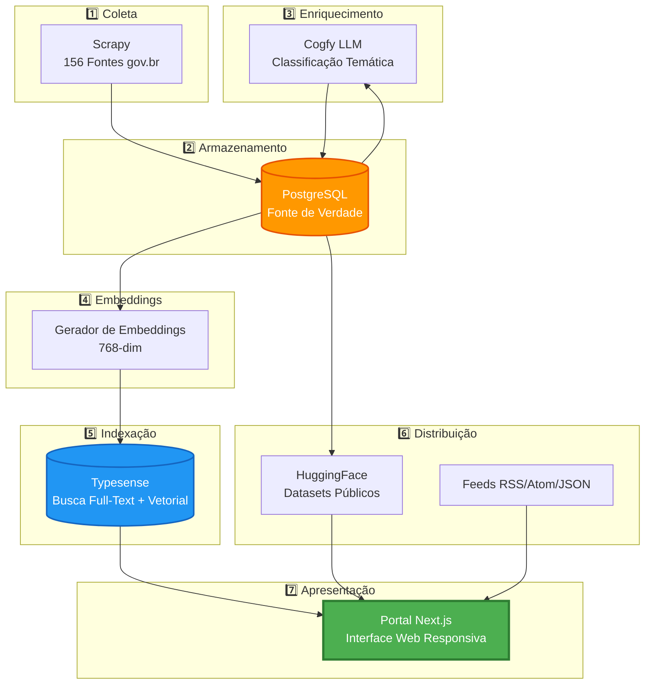
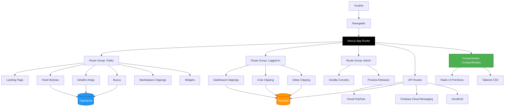
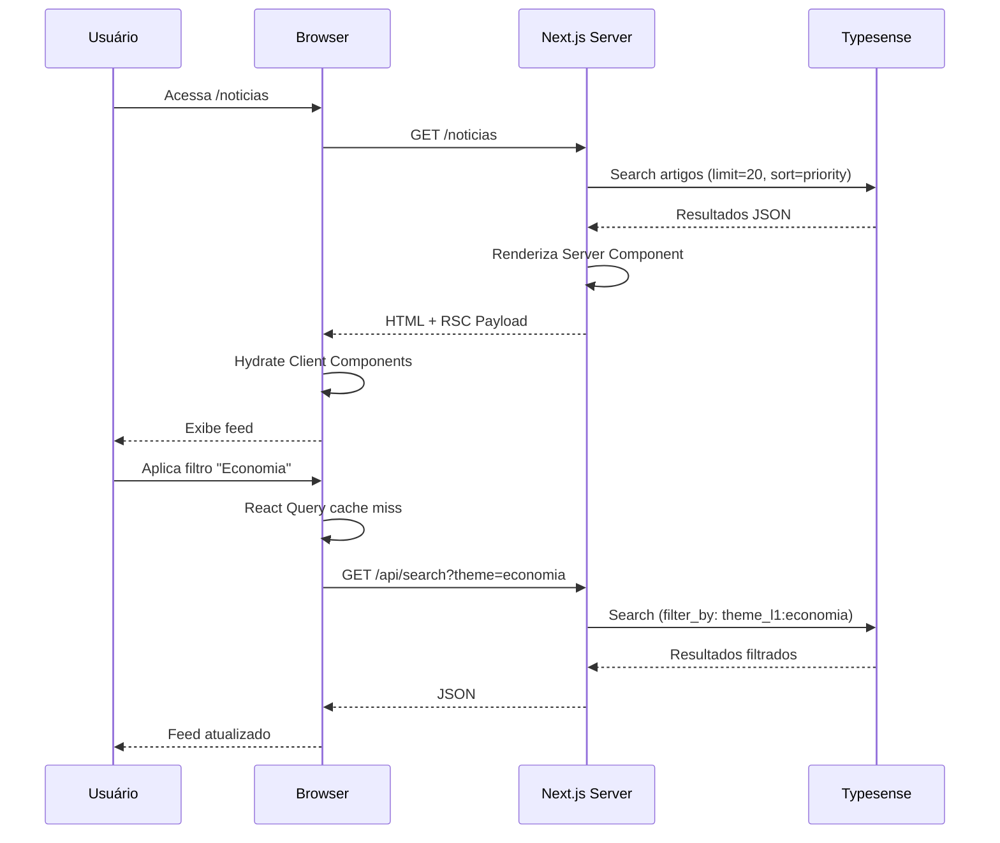
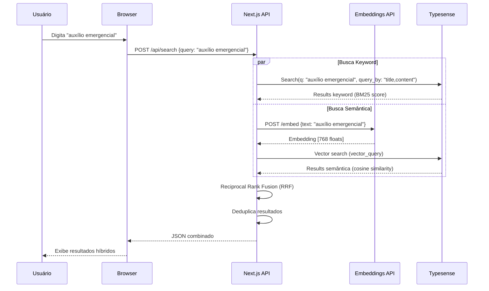
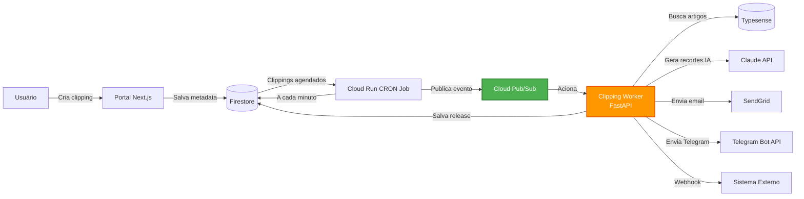
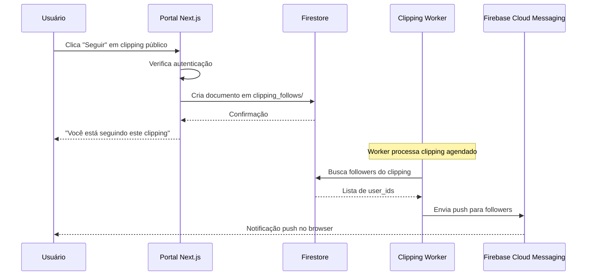
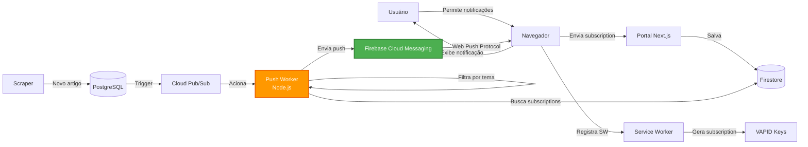

Data: 26/04/2026

PROMPT: Analisar a documentação deste diretório e gerar um relatório técnico Relatório-Técnico-DestaquesGovbr-Portal_Web-26-04.md, que descreva a arquitetura do portal web, destaque os requisitos funcionais e de acessibilidade e o mapa do site, com base no template "docs\relatorios\Template-Relatório Técnico INSPIRE.md". O repositorio do código fonte é C:\Users\joserm\Documents\Projetos\Inspire\Meta-7\Git\portal. Faça um plano para criação do documento e execute em etapas para não perder o contexto.

Elaborado por: Claude Sonnet 4.5 (Anthropic)

Revisado por: <!-- NÃO PREENCHA ESTE CAMPO: O humano preencherá manualmente-->

**Sumário** 

<!-- NÃO PREENCHA ESTE CAMPO: O humano incluirá manualmente-->

**Versão**: 1.0  
**Data**: 26 de abril de 2026

---

# **1 Objetivo deste documento**

Este documento apresenta uma especificação técnica detalhada do **Portal Web DestaquesGovbr**, a interface principal da plataforma de agregação de notícias governamentais brasileiras. O portal centraliza comunicação de aproximadamente 160 portais gov.br, oferecendo busca unificada, navegação temática e recursos avançados como clippings automáticos, widgets embarcáveis e notificações push.

O relatório detalha:

- **Arquitetura do portal web**: stack tecnológico, padrões arquiteturais (App Router, Server Components), estrutura de componentes e serviços
- **Mapa do site completo**: 23 rotas públicas, rotas autenticadas, área administrativa e 24 endpoints de API REST
- **Requisitos funcionais**: 10 funcionalidades principais (busca híbrida, clippings automáticos, marketplace, widgets, push notifications, autenticação federada)
- **Requisitos de acessibilidade**: conformidade com WCAG 2.1 Level AA, implementação de semântica HTML, ARIA, navegação por teclado, contraste e responsividade
- **Infraestrutura e deploy**: CI/CD com GitHub Actions, containerização Docker, hospedagem em Google Cloud Run
- **Segurança**: Content Security Policy dinâmica, autenticação JWT, gestão de secrets, conformidade LGPD
- **Observabilidade**: analytics privacy-first (Umami), session replay (Clarity), métricas de uso e KPIs
- **Testes**: cobertura unitária (Vitest), testes E2E (Playwright), linting e formatação (Biome)

Este documento serve como referência técnica para equipes de desenvolvimento, arquitetos de software, designers de UX/UI, especialistas em acessibilidade e gestores de produto envolvidos no projeto DestaquesGovbr.

**Versão**: 1.0  
**Data**: 26 de abril de 2026

## **1.1 Nível de sigilo dos documentos**

Este documento é classificado como **Nível 2 – RESERVADO**, destinado aos envolvidos no projeto MGI/Finep e equipes técnicas do CPQD.

---

# **2 Terminologias e Abreviações**

| Sigla/Termo | Significado | Descrição |
|-------------|-------------|-----------|
| **AI/IA** | Artificial Intelligence / Inteligência Artificial | Tecnologias de aprendizado de máquina e processamento de linguagem natural |
| **API** | Application Programming Interface | Interface de Programação de Aplicações para comunicação entre sistemas |
| **ARIA** | Accessible Rich Internet Applications | Especificação W3C para acessibilidade web dinâmica |
| **C4** | Context, Containers, Components, Code | Modelo de diagramação arquitetural hierárquico |
| **CORS** | Cross-Origin Resource Sharing | Mecanismo de segurança HTTP para requisições cross-domain |
| **CRON** | Command Run On | Sistema de agendamento de tarefas recorrentes (Unix) |
| **CSP** | Content Security Policy | Política de segurança HTTP para mitigar XSS e injeção de código |
| **E2E** | End-to-End | Testes que simulam fluxos completos de usuário |
| **FCM** | Firebase Cloud Messaging | Serviço Google para notificações push multiplataforma |
| **GCP** | Google Cloud Platform | Plataforma de computação em nuvem do Google |
| **HSTS** | HTTP Strict Transport Security | Header de segurança que força uso de HTTPS |
| **HTML** | HyperText Markup Language | Linguagem de marcação para estruturação de conteúdo web |
| **IAP** | Identity-Aware Proxy | Proxy de autenticação baseado em identidade (GCP) |
| **ISR** | Incremental Static Regeneration | Regeneração estática incremental (Next.js) para conteúdo semi-dinâmico |
| **JWT** | JSON Web Token | Padrão aberto (RFC 7519) para tokens de autenticação assinados |
| **L1/L2/L3** | Level 1/2/3 | Níveis da hierarquia temática (25 temas L1, 3 níveis totais) |
| **LGPD** | Lei Geral de Proteção de Dados | Lei brasileira nº 13.709/2018 sobre privacidade e dados pessoais |
| **LLM** | Large Language Model | Modelo de linguagem de grande escala (ex: GPT, Claude) |
| **MCP** | Model Context Protocol | Protocolo para integração de ferramentas com LLMs |
| **MSW** | Mock Service Worker | Biblioteca para mock de requisições HTTP em testes |
| **OIDC** | OpenID Connect | Camada de identidade sobre OAuth 2.0 |
| **PWA** | Progressive Web App | Aplicação web com capacidades de app nativo (offline, push, install) |
| **Pub/Sub** | Publish/Subscribe | Padrão de mensageria assíncrona (GCP Cloud Pub/Sub) |
| **REST** | Representational State Transfer | Estilo arquitetural para APIs web baseadas em HTTP |
| **RSC** | React Server Components | Componentes React renderizados no servidor (Next.js 13+) |
| **RSS** | Really Simple Syndication | Formato XML para distribuição de conteúdo web |
| **SDK** | Software Development Kit | Kit de ferramentas para desenvolvimento de software |
| **SEO** | Search Engine Optimization | Otimização para motores de busca |
| **SSG** | Static Site Generation | Geração de páginas HTML em tempo de build |
| **SSO** | Single Sign-On | Autenticação única para múltiplos sistemas |
| **SSR** | Server-Side Rendering | Renderização de páginas no servidor (Next.js) |
| **SW** | Service Worker | Script JavaScript executado em background (PWA) |
| **UI/UX** | User Interface / User Experience | Interface e Experiência do Usuário |
| **VAPID** | Voluntary Application Server Identification | Protocolo de identificação para Web Push notifications |
| **WCAG** | Web Content Accessibility Guidelines | Diretrizes W3C para acessibilidade de conteúdo web |
| **XSS** | Cross-Site Scripting | Vulnerabilidade de injeção de código JavaScript malicioso |

---

# **3 Público-alvo**

Este documento é destinado a:

- Gestores de dados e tecnologia do Ministério da Gestão e da Inovação (MGI)
- Equipes de desenvolvimento e arquitetura de software do CPQD
- Desenvolvedores frontend especializados em React, Next.js e TypeScript
- Arquitetos de software responsáveis por sistemas web governamentais
- Designers de UX/UI envolvidos na experiência do portal
- Especialistas em acessibilidade web e conformidade WCAG
- Engenheiros de DevOps e SRE responsáveis por deploy e infraestrutura
- Cientistas de dados interessados em analytics e métricas de uso
- Pesquisadores acadêmicos em áreas de agregação de conteúdo, semântica web e governança de dados

---

# **4 Desenvolvimento**

O cenário atual da comunicação governamental brasileira apresenta:

- **Fragmentação**: aproximadamente 160 portais gov.br independentes, dificultando o acesso cidadão a informações consolidadas
- **Dispersão de conteúdo**: notícias publicadas em múltiplos portais sem mecanismo unificado de busca ou navegação
- **Baixa descoberta**: cidadãos precisam conhecer previamente o órgão responsável para acessar informações específicas
- **Falta de personalização**: ausência de ferramentas para criação de alertas ou recortes temáticos personalizados

O **Portal Web DestaquesGovbr** surge como solução para esses desafios, atuando como interface unificada que:

- Agrega conteúdo de 156 órgãos governamentais organizados em 25 temas hierárquicos
- Oferece busca full-text e semântica sobre mais de 1 milhão de artigos indexados
- Permite criação de clippings automáticos personalizados com entrega multicanal
- Disponibiliza widgets embarcáveis para integração em portais institucionais
- Implementa notificações push para alertas em tempo real
- Garante acessibilidade WCAG 2.1 Level AA para inclusão digital

## **4.1 Contexto e Visão Geral**

O Portal Web é a **camada 7 (Apresentação)** da arquitetura do DestaquesGovbr, posicionando-se como interface final entre o sistema e os usuários finais (cidadãos, servidores públicos, jornalistas, pesquisadores).



**Posicionamento na Arquitetura:**

- **Upstream (Entrada de Dados)**: O portal consome dados de Typesense (busca), HuggingFace (datasets), PostgreSQL (metadados via APIs indiretas) e Feeds estruturados
- **Downstream (Saída de Dados)**: O portal não produz dados para outras camadas, mas sim para sistemas externos via API REST e widgets embarcáveis
- **Responsabilidade Principal**: Apresentar informação agregada de forma acessível, responsiva e performática

**Evolução do Portal:**

O portal passou por evolução incremental desde sua concepção:

- **v0.1-v0.5 (Out 2025 - Jan 2026)**: MVP com busca básica, listagem de artigos e navegação por temas
- **v0.6-v0.9 (Jan 2026 - Fev 2026)**: Adição de clippings automáticos, autenticação Google OAuth, marketplace beta
- **v1.0.0 (Mar 2026)**: Release de produção com Umami Analytics, GrowthBook A/B testing, Google OAuth consolidado, Push Notifications, sistema de convites e waitlist

**v1.0.0 Release Highlights** (Março 2026):

- 25 Pull Requests merged
- 6 repositórios impactados (portal, clipping-worker, infra, agencies, docs, themes)
- 3 novos serviços Cloud Run (GrowthBook Frontend, GrowthBook API, Push Worker)
- Autenticação NextAuth.js v5 com suporte a múltiplos provedores
- Service Worker para PWA e push notifications
- Dual-service architecture para GrowthBook (separação frontend/API)
- IAP (Identity-Aware Proxy) protegendo dashboards administrativos

## **4.2 Arquitetura do Portal**

### **4.2.1 Stack Tecnológico**

| Categoria | Tecnologia | Versão | Uso no Portal |
|-----------|-----------|--------|---------------|
| **Framework** | Next.js | 15.5.13 | Framework React full-stack (App Router, RSC, ISR) |
| **Linguagem** | TypeScript | 5.x | Tipagem estática com strict mode |
| **Runtime** | Node.js | 20 LTS | Ambiente de execução JavaScript server-side |
| **UI Library** | React | 18.3.1 | Biblioteca para interfaces reativas |
| **Componentes Base** | Radix UI | 1.x | Primitivos acessíveis (18 componentes: Dialog, Select, Tabs, etc.) |
| **Sistema de Componentes** | shadcn/ui | Latest | Componentes copiáveis baseados em Radix UI |
| **Estilos** | Tailwind CSS | 4.x | Framework CSS utility-first com Gov.Br Design System |
| **Animações** | Framer Motion | 12.23.24 | Animações declarativas para transições |
| **Busca** | Typesense | 2.1.0 | Motor de busca full-text e vetorial (768-dim embeddings) |
| **Data Fetching** | TanStack React Query | 5.89.0 | Cache client-side, prefetching, invalidação automática |
| **Autenticação** | NextAuth.js | 5.0.0-beta.30 | Autenticação federada (Google + Gov.Br OIDC + Credentials) |
| **Backend** | Firebase Admin SDK | 13.0.0 | Firestore (metadata), Cloud Messaging (push) |
| **Pub/Sub** | Google Cloud Pub/Sub | 5.3.0 | Fila de eventos para clippings e notificações |
| **Email** | SendGrid | Custom lib | Envio de emails transacionais e clippings |
| **Forms** | React Hook Form | 7.61.1 | Gerenciamento de formulários performático |
| **Validação** | Zod | 3.25.76 | Schema validation TypeScript-first |
| **Markdown** | react-markdown | 10.1.0 | Renderização de conteúdo Markdown com suporte a GFM |
| **Markdown Plugins** | remark-gfm, rehype-raw | Latest | GitHub Flavored Markdown e HTML raw |
| **Carrousel** | Embla Carousel React | 8.6.0 | Carrosséis acessíveis para galerias de artigos |
| **Ícones** | Lucide React | 0.544.0 | Biblioteca de ícones SVG otimizados |
| **Notificações Toast** | Sonner | 1.7.4 | Toasts elegantes e acessíveis |
| **Temas** | next-themes | 0.3.0 | Dark mode com persistência client-side |
| **Analytics** | Umami | Self-hosted | Analytics privacy-first sem cookies |
| **Session Replay** | Microsoft Clarity | SaaS | Heatmaps, session recordings, rage clicks |
| **A/B Testing** | GrowthBook | 1.6.4 | Feature flags e experimentação |
| **Lint/Format** | Biome | 2.2.0 | Linter + formatter all-in-one (substitui ESLint + Prettier) |
| **Testes Unitários** | Vitest | 2.1.9 | Test runner compatível com Vite |
| **Testes E2E** | Playwright | 1.57.0 | Testes cross-browser (Chromium, Firefox, WebKit) |
| **Mocks** | MSW (Mock Service Worker) | Latest | Mock de requisições HTTP para testes |
| **Git Hooks** | Husky | Latest | Pre-commit hooks para linting |
| **Staged Files** | lint-staged | Latest | Executa linters apenas em arquivos staged |
| **Package Manager** | pnpm | 10.18.2 | Gerenciador de dependências rápido e eficiente |
| **Build Tool** | Turbopack | Built-in Next.js 15 | Bundler de próxima geração (mais rápido que Webpack) |
| **Container** | Docker | Multi-stage | Containerização para Cloud Run |

**Justificativas Técnicas:**

- **Next.js 15**: Escolhido pela maturidade do App Router, suporte nativo a RSC, ISR para conteúdo semi-dinâmico, otimizações automáticas (code splitting, image optimization)
- **Radix UI**: Garantia de acessibilidade ARIA built-in, composability, unstyled (permite customização com Tailwind)
- **Typesense**: Performance superior a Elasticsearch para datasets de ~1M documentos, suporte nativo a busca vetorial, menor overhead operacional
- **NextAuth.js v5**: Suporte a múltiplos provedores OIDC, integração nativa com Next.js App Router, JWT com refresh tokens
- **Biome**: Substitui ESLint + Prettier com ~100x mais velocidade, configuração zero, formatação consistente
- **Vitest**: Compatível com Vite/Turbopack, API compatível com Jest, execução paralela rápida

### **4.2.2 Padrões Arquiteturais**

**App Router (Next.js 13+)**

O portal utiliza o App Router do Next.js 15, que traz mudanças paradigmáticas:

- **Diretório `app/`**: Substitui o antigo `pages/`, permitindo layouts aninhados e colocation de componentes
- **Server Components por padrão**: Componentes são renderizados no servidor por padrão, reduzindo bundle JavaScript client-side
- **Route Groups**: Organização lógica de rotas sem afetar URLs (ex: `(public)`, `(logged-in)`, `(admin)`)
- **Parallel Routes**: Renderização simultânea de múltiplas rotas na mesma página (ex: modal + página de fundo)
- **Intercepting Routes**: Captura de rotas para exibir modais sem navegação completa

**Server vs Client Components**

| Aspecto | Server Components | Client Components |
|---------|-------------------|-------------------|
| **Renderização** | Servidor (Node.js) | Navegador (JavaScript) |
| **Bundle** | Zero JavaScript no client | Incluído no bundle client |
| **Data Fetching** | Direto (async/await) | Hooks (useEffect, React Query) |
| **Acesso a Backend** | Direto (database, filesystem) | Apenas via API |
| **Interatividade** | Não (sem hooks, event handlers) | Sim (onClick, onChange, etc.) |
| **Marcador** | Padrão (sem diretiva) | `'use client'` no topo do arquivo |
| **Uso no Portal** | Páginas, layouts, fetching inicial | Formulários, modais, interações |

**Incremental Static Regeneration (ISR)**

Páginas com conteúdo semi-estático usam ISR:

- **Feed de notícias (`/noticias`)**: Regenera a cada 10 minutos, servindo cache entre regenerações
- **Páginas de tema/órgão**: ISR de 15 minutos, balanceando frescor e performance
- **Feeds RSS/Atom/JSON**: ISR de 10 minutos, garantindo conteúdo atualizado para agregadores

**Colocation e Organização**

```
src/app/
├── (public)/                 # Route group: rotas públicas
│   ├── page.tsx              # Landing page (/)
│   ├── noticias/
│   │   └── page.tsx          # Feed (/noticias)
│   ├── artigos/[articleId]/
│   │   └── page.tsx          # Detalhe artigo
│   └── ...
├── (logged-in)/              # Route group: autenticado
│   └── minha-conta/
│       └── clipping/
│           ├── page.tsx      # Dashboard
│           └── [id]/page.tsx # Edição
├── api/                      # API Routes
│   ├── clipping/route.ts
│   └── ...
├── layout.tsx                # Root layout (Header, Footer, Providers)
└── globals.css               # Estilos globais
```

### **4.2.3 Estrutura de Componentes**

O portal possui **103 componentes React** organizados em 12 categorias:

```
src/components/
├── ui/                       # 18 componentes shadcn/ui (Radix UI + Tailwind)
│   ├── button.tsx
│   ├── dialog.tsx
│   ├── select.tsx
│   ├── tabs.tsx
│   └── ...
├── layout/                   # Estrutura da página
│   ├── Header.tsx            # Navegação, busca, auth
│   ├── Footer.tsx            # Links, branding
│   ├── ZenMode.tsx           # FAB + toggle para modo zen
│   └── Providers.tsx         # React Query, NextAuth, GrowthBook
├── articles/                 # Exibição de artigos
│   ├── NewsCard.tsx          # Card de notícia (thumbnail, título, resumo)
│   ├── ArticleDetail.tsx     # Página completa de artigo
│   ├── ImageCarousel.tsx     # Galeria de imagens (Embla)
│   ├── VideoPlayer.tsx       # Embed de vídeos (YouTube)
│   └── ArticleFilters.tsx    # Filtros (órgão, tema, data)
├── search/                   # Busca
│   ├── SearchBar.tsx         # Input com autocomplete
│   ├── SearchResults.tsx     # Lista de resultados
│   └── SearchFilters.tsx     # Filtros avançados
├── clipping/                 # Clippings automáticos
│   ├── ClippingCard.tsx      # Card de clipping
│   ├── ClippingWizard.tsx    # Wizard de criação (multi-step)
│   ├── CronScheduleBuilder.tsx # Builder de expressões CRON
│   ├── ChannelSelector.tsx   # Seleção de canais (email, Telegram)
│   └── RecorteList.tsx       # Lista de recortes gerados
├── marketplace/              # Marketplace de clippings
│   ├── MarketplaceGrid.tsx   # Grid de clippings públicos
│   ├── ListingCard.tsx       # Card com stats (followers, likes)
│   └── FollowButton.tsx      # Botão de follow/unfollow
├── widgets/                  # Widgets embarcáveis
│   ├── WidgetConfigurator.tsx # Configurador interativo
│   ├── WidgetPreview.tsx     # Preview em tempo real
│   └── ArticleGallery.tsx    # Componente embarcável
├── push/                     # Notificações push
│   ├── PushSubscriber.tsx    # UI de subscription
│   ├── ServiceWorkerRegistrar.tsx # Registro do SW
│   └── TopicSelector.tsx     # Seleção de temas para notificação
├── auth/                     # Autenticação
│   ├── AuthButton.tsx        # Botão de login/logout
│   ├── SignInForm.tsx        # Formulário de login
│   └── ProviderButtons.tsx   # Botões Google/Gov.Br
├── landing/                  # Landing page
│   ├── LandingHero.tsx       # Hero section
│   ├── FeatureCard.tsx       # Card de feature
│   ├── PainPointGrid.tsx     # Grid de pain points
│   └── StatsBar.tsx          # Barra de estatísticas
├── analytics/                # Analytics
│   ├── UmamiScript.tsx       # Script Umami
│   ├── ClarityScript.tsx     # Script Clarity
│   └── ABDebugPanel.tsx      # Painel debug GrowthBook
├── admin/                    # Área administrativa
│   ├── InviteStatsCards.tsx  # Cards de estatísticas de convites
│   └── WaitlistManager.tsx   # Gerenciamento de waitlist
└── common/                   # Componentes compartilhados
    ├── LoadingSpinner.tsx
    ├── ErrorBoundary.tsx
    └── Pagination.tsx
```

**Diagrama de Arquitetura de Componentes:**



## **4.3 Mapa do Site e Estrutura de Rotas**

O portal possui **50 rotas** distribuídas em 5 grupos: públicas, autenticadas, admin, analytics e widget-embed.

### **4.3.1 Rotas Públicas (23 rotas)**

| Rota | Tipo | Descrição | ISR |
|------|------|-----------|-----|
| `/` | Landing | Página institucional com hero, features, pain points, estatísticas | Não |
| `/noticias` | Feed | Lista paginada de notícias mais recentes (trending + recentes) | 10 min |
| `/artigos/[articleId]` | Detalhe | Página completa de artigo com conteúdo Markdown, galeria de imagens, vídeos | Não |
| `/busca` | Busca | Interface de busca com filtros (órgão, tema, data, tipo de conteúdo) | Não |
| `/temas` | Navegação | Grid com 25 temas de nível 1 (ícones, títulos, contadores) | 15 min |
| `/temas/[themeLabel]` | Feed | Notícias filtradas por tema específico com breadcrumb hierárquico | 15 min |
| `/orgaos` | Navegação | Grid com 156 órgãos governamentais (logos, hierarquia ministério → agência) | 15 min |
| `/orgaos/[agencyKey]` | Feed | Notícias filtradas por órgão específico com informações institucionais | 15 min |
| `/clippings` | Marketplace | Galeria de clippings públicos com filtros (popularidade, categoria, recência) | Não |
| `/clippings/[listingId]` | Detalhe | Detalhe de clipping público com preview, stats (followers, likes), últimas releases | Não |
| `/clippings/[listingId]/releases` | Feed | Histórico de releases do clipping público (últimos 30 envios) | Não |
| `/widgets/configurador` | Configurador | Interface para configurar widgets embarcáveis (layout, tamanho, filtros) | Não |
| `/feeds` | Catálogo | Catálogo de feeds RSS/Atom/JSON disponíveis (global, por tema, por órgão) | Não |
| `/integracao` | Documentação | Página de integração com API, widgets, MCP server, SDKs | Não |
| `/web-difusora` | Demo | Demonstração da Web Difusora (distribuição de conteúdo para portais) | Não |
| `/transparencia-algoritmica` | Documentação | Explicação dos algoritmos de priorização, classificação temática, busca | Não |
| `/convite` | Auth | Página inicial do fluxo de convites (sistema de early access) | Não |
| `/convite/[code]` | Auth | Validação e visualização de código de convite (detalhes do convite) | Não |
| `/convite/[code]/redeem` | Auth | Resgate de convite (cria conta ou vincula a conta existente) | Não |
| `/convite/admin` | Admin | Login admin via Gov.Br SSO para geração de convites | Não |
| `/convite/admin/callback` | Auth | Callback OAuth Gov.Br para autenticação admin | Não |
| `/convites` | Catálogo | Listagem de convites (para usuários com permissão de visualização) | Não |
| `/lista-espera` | Cadastro | Formulário de cadastro em lista de espera (early access) | Não |

### **4.3.2 Rotas Autenticadas (3 rotas)**

| Rota | Descrição | Autenticação |
|------|-----------|--------------|
| `/minha-conta/clipping` | Dashboard pessoal de clippings automáticos (listagem, estatísticas) | NextAuth.js session |
| `/minha-conta/clipping/novo` | Wizard de criação de novo clipping (4 etapas: filtros → preview → scheduler → canais) | NextAuth.js session |
| `/minha-conta/clipping/[id]` | Página de edição de clipping existente (formulário completo) | NextAuth.js session + ownership check |

### **4.3.3 Rotas Admin (2 rotas)**

| Rota | Descrição | Autorização |
|------|-----------|-------------|
| `/admin/convites` | Painel de gerenciamento de convites (criar, revogar, estatísticas) | NextAuth.js session + email em `ADMIN_EMAILS` |
| `/admin/preview` | Preview de releases antes de publicação no marketplace | NextAuth.js session + email em `ADMIN_EMAILS` |

### **4.3.4 Rotas Analytics (1 rota)**

| Rota | Descrição | Autorização |
|------|-----------|-------------|
| `/dados-editoriais` | Dashboard com métricas editoriais (artigos/dia, temas trending, órgãos mais ativos) | Protegido via IAP (Google Cloud) |

### **4.3.5 Rotas Widget Embed (1 rota)**

| Rota | Descrição | CSP |
|------|-----------|-----|
| `/embed` | Página de widget embarcável sem Header/Footer (iframe-friendly) | `frame-ancestors *` (permite embedding) |

### **4.3.6 API REST (24 endpoints)**

**Autenticação**

| Endpoint | Método | Auth | Descrição |
|----------|--------|------|-----------|
| `/api/auth/[...nextauth]` | GET, POST | Público | Endpoints NextAuth.js (signin, callback, signout, session) |
| `/api/auth/telegram/initiate` | POST | Público | Inicia fluxo de autenticação via Telegram Bot |
| `/api/auth/telegram/callback` | GET | Público | Callback OAuth Telegram |

**Clippings - CRUD**

| Endpoint | Método | Auth | Descrição |
|----------|--------|------|-----------|
| `/api/clipping` | POST | Protegido | Cria novo clipping (filtros, scheduler, canais) |
| `/api/clipping` | GET | Protegido | Lista clippings do usuário autenticado |
| `/api/clipping/[id]` | GET | Protegido | Retorna detalhe de clipping (ownership check) |
| `/api/clipping/[id]` | PATCH | Protegido | Atualiza clipping existente (ownership check) |
| `/api/clipping/[id]` | DELETE | Protegido | Deleta clipping (ownership check) |
| `/api/clipping/[id]/send` | POST | Protegido | Envia clipping manualmente via email/Telegram |
| `/api/clipping/[id]/releases` | GET | Protegido | Lista releases do clipping (últimos 30) |
| `/api/clipping/estimate` | POST | Protegido | Estima número de artigos que o clipping retornará |
| `/api/clipping/generate-recortes` | POST | Protegido | Gera recortes do clipping via IA (FastAPI clipping-worker) |

**Clippings - Marketplace**

| Endpoint | Método | Auth | Descrição |
|----------|--------|------|-----------|
| `/api/clippings/public` | GET | Público | Lista clippings públicos (marketplace) com paginação |
| `/api/clippings/public/[listingId]` | GET | Público | Detalhe de clipping público |
| `/api/clippings/public/[listingId]/follow` | POST | Protegido | Seguir clipping público (recebe releases via push/email) |
| `/api/clippings/public/[listingId]/like` | POST | Protegido | Curtir clipping público (incrementa contador) |
| `/api/clippings/public/[listingId]/clone` | POST | Protegido | Clona clipping público para conta do usuário |
| `/api/clippings/public/[listingId]/releases` | GET | Público | Lista releases de clipping público |
| `/api/clippings/public/[listingId]/feed.xml` | GET | Público | Feed RSS 2.0 do clipping público |
| `/api/clippings/public/[listingId]/feed.json` | GET | Público | Feed JSON do clipping público |
| `/api/clippings/publish` | POST | Protegido | Publica clipping no marketplace (torna público) |

**Push Notifications**

| Endpoint | Método | Auth | Descrição |
|----------|--------|------|-----------|
| `/api/push/preferences` | GET | Protegido | Retorna preferências de notificação do usuário (temas selecionados) |
| `/api/push/preferences` | POST | Protegido | Atualiza preferências de notificação |
| `/api/push/sync` | POST | Protegido | Sincroniza subscription push (salva endpoint + keys VAPID) |
| `/api/push/filters-data` | GET | Público | Retorna dados para filtros de push (25 temas L1) |

**Widgets**

| Endpoint | Método | Auth | Descrição |
|----------|--------|------|-----------|
| `/api/widgets/config` | GET | Público | Retorna configuração de widget (agências, temas disponíveis) |
| `/api/widgets/articles` | GET | Público | Retorna artigos filtrados para widget (CORS habilitado) |

**Feeds Estruturados**

| Endpoint | Método | Auth | Descrição |
|----------|--------|------|-----------|
| `/feed.xml` | GET | Público | Feed RSS 2.0 global (últimas 50 notícias) |
| `/feed.atom` | GET | Público | Feed Atom 1.0 global |
| `/feed.json` | GET | Público | Feed JSON Feed global |

### **4.3.7 Mapa do Site Visual**

```mermaid
flowchart TB
    ROOT["/"] --> PUBLIC_AREA[Área Pública]
    ROOT --> AUTH_AREA[Área Autenticada]
    ROOT --> ADMIN_AREA[Área Admin]
    
    PUBLIC_AREA --> NOTICIAS["/noticias"]
    PUBLIC_AREA --> BUSCA["/busca"]
    PUBLIC_AREA --> TEMAS["/temas"]
    PUBLIC_AREA --> ORGAOS["/orgaos"]
    PUBLIC_AREA --> CLIPPINGS_MARKET["/clippings"]
    PUBLIC_AREA --> WIDGETS["/widgets"]
    PUBLIC_AREA --> INTEGRACAO["/integracao"]
    PUBLIC_AREA --> CONVITE["/convite"]
    
    NOTICIAS --> ARTIGO["/artigos/[id]"]
    TEMAS --> TEMA_DETAIL["/temas/[label]"]
    ORGAOS --> ORGAO_DETAIL["/orgaos/[key]"]
    CLIPPINGS_MARKET --> CLIP_DETAIL["/clippings/[id]"]
    CLIPPINGS_MARKET --> CLIP_RELEASES["/clippings/[id]/releases"]
    WIDGETS --> CONFIG["/widgets/configurador"]
    CONVITE --> CONVITE_CODE["/convite/[code]"]
    CONVITE_CODE --> REDEEM["/convite/[code]/redeem"]
    
    AUTH_AREA --> DASHBOARD["/minha-conta/clipping"]
    DASHBOARD --> NEW_CLIP["/minha-conta/clipping/novo"]
    DASHBOARD --> EDIT_CLIP["/minha-conta/clipping/[id]"]
    
    ADMIN_AREA --> ADMIN_CONVITES["/admin/convites"]
    ADMIN_AREA --> ADMIN_PREVIEW["/admin/preview"]
    
    ROOT --> API_AREA[API REST]
    API_AREA --> API_AUTH["/api/auth/*"]
    API_AREA --> API_CLIPPING["/api/clipping/*"]
    API_AREA --> API_CLIPPINGS["/api/clippings/public/*"]
    API_AREA --> API_PUSH["/api/push/*"]
    API_AREA --> API_WIDGETS["/api/widgets/*"]
    
    ROOT --> FEEDS[Feeds]
    FEEDS --> RSS["/feed.xml"]
    FEEDS --> ATOM["/feed.atom"]
    FEEDS --> JSON["/feed.json"]
    
    style ROOT fill:#4CAF50,stroke:#2E7D32,stroke-width:3px,color:#fff
    style PUBLIC_AREA fill:#2196F3,stroke:#1565C0,stroke-width:2px,color:#fff
    style AUTH_AREA fill:#FF9800,stroke:#E65100,stroke-width:2px,color:#fff
    style ADMIN_AREA fill:#F44336,stroke:#C62828,stroke-width:2px,color:#fff
    style API_AREA fill:#9C27B0,stroke:#6A1B9A,stroke-width:2px,color:#fff
    style FEEDS fill:#00BCD4,stroke:#00838F,stroke-width:2px,color:#fff
```



### **4.3.8 Navegação Hierárquica**

**Por Temas (3 níveis):**

```
/temas
├── economia-e-financas (L1)
│   ├── gestao-publica (L2)
│   │   ├── orcamento-e-planejamento (L3)
│   │   ├── licitacoes-e-contratos (L3)
│   │   └── patrimonio-publico (L3)
│   ├── financas-pessoais (L2)
│   └── impostos-e-tributos (L2)
├── educacao (L1)
│   ├── ensino-basico (L2)
│   ├── ensino-superior (L2)
│   └── educacao-profissional (L2)
└── ... (mais 23 temas L1)
```

**Por Órgãos (hierarquia ministerial):**

```
/orgaos
├── ministerio-da-fazenda
│   ├── secretaria-do-tesouro-nacional
│   ├── receita-federal
│   └── banco-central
├── ministerio-da-educacao
│   ├── inep
│   ├── capes
│   └── fnde
└── ... (mais 154 órgãos)
```

## **4.4 Requisitos Funcionais**

O portal implementa 10 requisitos funcionais principais, identificados como **RF01** a **RF10**.

### **RF01 - Agregação e Visualização de Conteúdo Governamental**

**Descrição:**

O portal deve exibir notícias agregadas de aproximadamente 160 portais gov.br, apresentando conteúdo de forma unificada, acessível e responsiva.

**Funcionalidades:**

- **Feed de notícias** (`/noticias`): Lista paginada com as notícias mais recentes, ordenadas por algoritmo de priorização (recência + relevância temática + importância do órgão)
- **NewsCard**: Componente que exibe título, subtítulo, imagem thumbnail, órgão emissor, tema principal, data de publicação
- **Filtros contextuais**: Filtros por órgão (156 opções), tema (25 L1 + subtemas L2/L3), data (hoje, semana, mês, customizado)
- **Ordenação**: Trending (priorização algorítmica) ou recente (data decrescente)
- **Paginação**: Infinite scroll ou paginação clássica (configurável via A/B testing)
- **Responsividade**: Mobile-first design com breakpoints (sm: 640px, md: 768px, lg: 1024px)

**Tecnologias:**

- **React Query**: Cache client-side com stale-time de 5 minutos, prefetching de próxima página
- **Typesense Client**: Busca com filtros booleanos (`agency_key:fazenda AND theme_l1:economia`)
- **Server Components**: Renderização inicial server-side para SEO e performance
- **ISR**: Regeneração incremental a cada 10 minutos no feed principal

**Fluxo:**



**Dados:**

- **Origem**: Typesense collection `articles` (1M+ documentos)
- **Schema**: `{id, title, subtitle, content, agency_key, theme_l1, theme_l2, theme_l3, published_at, thumbnail_url, priority_score}`
- **Priorização**: Score calculado em `config/prioritization.yaml` (pesos por órgão + tema + decay temporal)

### **RF02 - Busca Full-Text e Semântica**

**Descrição:**

O portal deve oferecer busca híbrida combinando busca por palavras-chave (full-text) e busca semântica via embeddings vetoriais.

**Funcionalidades:**

- **SearchBar**: Input de busca com autocomplete (suggestions baseadas em títulos frequentes)
- **Busca keyword**: Full-text search em título, subtítulo, conteúdo (algoritmo BM25 do Typesense)
- **Busca semântica**: Query convertida em embedding 768-dim, busca vetorial por similaridade cosseno
- **Busca híbrida**: Combina resultados keyword (70% peso) + semântica (30% peso) com RRF (Reciprocal Rank Fusion)
- **Filtros avançados**: Órgão, tema, data, tipo de conteúdo (notícia, artigo, comunicado, nota técnica)
- **Highlight**: Termos encontrados destacados em negrito no resultado
- **Sugestões**: "Você quis dizer..." para correção ortográfica (via Typesense typo tolerance)

**Tecnologias:**

- **Typesense**: Motor principal com índice invertido + índice vetorial HNSW (Hierarchical Navigable Small World)
- **Embeddings API**: Serviço FastAPI que gera embeddings usando modelo `sentence-transformers/all-MiniLM-L6-v2` (768-dim)
- **GrowthBook**: Feature flag `semantic_search_enabled` para habilitar busca semântica em 50% dos usuários (A/B test)

**Fluxo de Busca Híbrida:**



**Implementação:**

```typescript
// src/services/search/combined-search.ts
export async function getCombinedSearchResults(
  query: string,
  filters?: SearchFilters
): Promise<Article[]> {
  const [keywordResults, semanticResults] = await Promise.all([
    typesenseClient.search({
      q: query,
      query_by: 'title,subtitle,content',
      filter_by: buildFilterString(filters),
      sort_by: '_text_match:desc',
      per_page: 20
    }),
    getSemanticResults(query, filters) // chama Embeddings API + Typesense vector
  ]);
  
  return reciprocalRankFusion(keywordResults, semanticResults, {
    keywordWeight: 0.7,
    semanticWeight: 0.3
  });
}
```

### **RF03 - Navegação por Árvore Temática e Catálogo de Órgãos**

**Descrição:**

O portal deve permitir navegação estruturada por temas hierárquicos (25 temas L1 × 3 níveis) e catálogo de órgãos governamentais (156 agências).

**Funcionalidades:**

- **Grid de temas** (`/temas`): 25 cards com ícone, título, descrição curta, contador de artigos
- **Breadcrumb hierárquico**: Navegação L1 → L2 → L3 (ex: "Economia → Gestão Pública → Orçamento")
- **Grid de órgãos** (`/orgaos`): 156 cards com logo, nome, sigla, hierarquia (ministério → secretaria → autarquia)
- **Páginas dedicadas**: `/temas/[label]` e `/orgaos/[key]` com feed filtrado e informações contextuais
- **Cross-linking**: Tema → órgãos relacionados, Órgão → temas publicados
- **Estatísticas**: Número de artigos por tema/órgão, últimas publicações, frequência de publicação

**Dados:**

**Árvore Temática** (`src/config/themes.yaml`):

```yaml
economia-e-financas:
  name: "Economia e Finanças"
  icon: "TrendingUp"
  level: 1
  subtopics:
    gestao-publica:
      name: "Gestão Pública"
      level: 2
      subtopics:
        orcamento-e-planejamento:
          name: "Orçamento e Planejamento"
          level: 3
```

**Catálogo de Órgãos** (`src/config/agencies.yaml`):

```yaml
fazenda:
  name: "Ministério da Fazenda"
  short_name: "MF"
  logo_url: "/logos/fazenda.svg"
  hierarchy:
    ministry: "Ministério da Fazenda"
  url: "https://www.gov.br/fazenda"
```

**Tecnologias:**

- **YAML parsing**: Arquivos YAML carregados em build-time e convertidos para TypeScript types
- **Static Generation**: Páginas `/temas` e `/orgaos` geradas estaticamente com ISR de 15 minutos
- **Lucide React**: Biblioteca de ícones SVG para temas (TrendingUp, Heart, Book, etc.)

### **RF04 - Clippings Automáticos (CRON + Múltiplos Canais)**

**Descrição:**

O portal deve permitir criação de clippings personalizados que executam automaticamente em horários agendados, enviando resumos de notícias via múltiplos canais (email, Telegram, webhook, RSS).

**Funcionalidades:**

- **Wizard de criação** (`/minha-conta/clipping/novo`): 4 etapas (Filtros → Preview → Agendamento → Canais)
- **Filtros avançados**: Órgãos (multi-select), temas (multi-select), palavras-chave (AND/OR), data de publicação (últimas N horas)
- **Preview com estimativa**: Exibe número estimado de artigos que o clipping retornará
- **Agendamento CRON**: Interface visual para criar expressões CRON (ex: "Todo dia às 8h", "Seg-Sex às 18h")
- **Canais de entrega**:
  - **Email**: HTML formatado com SendGrid (até 50 recortes por envio)
  - **Telegram**: Mensagens via Bot API (até 20 recortes, links diretos)
  - **Webhook**: POST JSON para URL customizada (payload completo)
  - **RSS**: Feed privado gerado dinamicamente
- **Dashboard** (`/minha-conta/clipping`): Listagem de clippings com stats (última execução, próxima execução, total de envios)
- **Histórico de releases**: Últimos 30 envios com data, número de artigos, status (sucesso/erro)

**Arquitetura:**



**Tecnologias:**

- **Firestore**: Armazenamento de metadata de clippings (`clippings/`, `releases/`)
- **Cloud Pub/Sub**: Fila assíncrona para processamento de clippings
- **Cloud Run CRON**: Job executado a cada minuto para verificar clippings agendados
- **FastAPI Worker**: Serviço Python que processa clippings, gera recortes com IA, envia por canais
- **SendGrid**: API de email transacional com templates HTML
- **Telegram Bot API**: Envio de mensagens via bot dedicado

**Modelo de Dados (Firestore):**

```typescript
interface Clipping {
  id: string;
  user_id: string;
  name: string;
  filters: {
    agencies?: string[];       // ["fazenda", "educacao"]
    themes?: string[];          // ["economia", "educacao"]
    keywords?: string;          // "auxílio AND (emergencial OR pandemia)"
    published_within_hours?: number; // 24
  };
  schedule: {
    cron_expression: string;  // "0 8 * * *" (todo dia às 8h)
    timezone: string;          // "America/Sao_Paulo"
    enabled: boolean;
  };
  channels: {
    email?: {
      enabled: boolean;
      recipients: string[];    // ["user@example.com"]
      format: "html" | "plain";
    };
    telegram?: {
      enabled: boolean;
      chat_id: string;
    };
    webhook?: {
      enabled: boolean;
      url: string;
      headers?: Record<string, string>;
    };
    rss?: {
      enabled: boolean;
      feed_url: string;        // auto-gerado
    };
  };
  created_at: Timestamp;
  updated_at: Timestamp;
  last_run_at?: Timestamp;
  next_run_at?: Timestamp;
  total_releases: number;
}
```

### **RF05 - Marketplace de Clippings (Follow/Like/Clone)**

**Descrição:**

O portal deve oferecer um marketplace social onde usuários podem publicar clippings, permitindo que outros sigam, curtam ou clonem para uso próprio.

**Funcionalidades:**

- **Listagem de clippings públicos** (`/clippings`): Grid com título, descrição, autor, stats (followers, likes, releases)
- **Filtros de marketplace**: Popularidade (mais seguidos), categoria (tema principal), recência (publicados recentemente)
- **Página de detalhe** (`/clippings/[id]`): Preview do clipping, últimas 5 releases, botão "Seguir"
- **Ações sociais**:
  - **Follow**: Recebe releases do clipping via push notification ou email
  - **Like**: Incrementa contador de likes (gamificação)
  - **Clone**: Copia configuração do clipping para conta do usuário (permite edição)
- **Feeds por clipping**: Cada clipping público tem feed RSS/JSON (`/api/clippings/public/[id]/feed.xml`)
- **Estatísticas de criador**: Dashboard mostra quantos usuários seguem seus clippings públicos

**Modelo de Dados (Firestore):**

```typescript
interface MarketplaceListing {
  id: string;
  clipping_id: string;        // FK para clipping original
  owner_id: string;
  title: string;
  description: string;
  category: string;           // tema principal (L1)
  published_at: Timestamp;
  stats: {
    followers_count: number;
    likes_count: number;
    clones_count: number;
  };
  featured: boolean;          // destacado pelo admin
}

interface ClippingFollow {
  id: string;
  user_id: string;
  listing_id: string;
  notification_preferences: {
    push: boolean;
    email: boolean;
  };
  followed_at: Timestamp;
}
```

**Fluxo de Follow:**



### **RF06 - Widgets Embarcáveis (4 Layouts × 4 Tamanhos)**

**Descrição:**

O portal deve gerar widgets embarcáveis que permitem exibir notícias filtradas em portais externos via `<iframe>`.

**Funcionalidades:**

- **Configurador interativo** (`/widgets/configurador`): Interface para escolher layout, tamanho, filtros
- **4 Layouts disponíveis**:
  - **Grid 2 colunas**: Cards lado a lado (desktop) ou empilhados (mobile)
  - **Grid 3 colunas**: Densidade alta para desktops
  - **Lista vertical**: Cards empilhados (ótimo para sidebars)
  - **Carrossel**: Swiper horizontal com controles
- **4 Tamanhos**:
  - **Small**: 300×400px (sidebar)
  - **Medium**: 600×600px (seção de página)
  - **Large**: 1200×800px (destaque full-width)
  - **Custom**: Dimensões personalizadas
- **Filtros**: Órgãos (multi-select), temas (multi-select), limite de artigos (5-50)
- **Geração de snippet**: Código HTML `<iframe>` pronto para copiar e colar
- **Auto-atualização**: Widget atualiza a cada 15 minutos via ISR
- **Responsividade**: Widget adapta layout automaticamente ao tamanho do iframe

**Página de Embed:**

A rota `/embed` renderiza widget sem Header/Footer, com CSP ajustada para permitir embedding:

```typescript
// src/app/(widget-embed)/embed/page.tsx
export default async function EmbedPage({ searchParams }) {
  const { agencies, themes, layout, limit } = searchParams;
  
  const articles = await searchArticles({
    filter_by: buildFilter(agencies, themes),
    per_page: limit || 10
  });
  
  return (
    <ArticleGallery
      articles={articles}
      layout={layout || 'grid-2'}
    />
  );
}

// Revalidação ISR a cada 15 minutos
export const revalidate = 900;
```

**API de Widgets:**

```
GET /api/widgets/articles?agencies=fazenda,educacao&themes=economia&limit=10

Response:
{
  "articles": [...],
  "total": 87,
  "page": 1,
  "per_page": 10
}
```

**Headers CORS:**

```typescript
// src/app/api/widgets/articles/route.ts
export async function GET(request: Request) {
  const articles = await fetchArticles(filters);
  
  return NextResponse.json(articles, {
    headers: {
      'Access-Control-Allow-Origin': '*',
      'Access-Control-Allow-Methods': 'GET, OPTIONS',
      'Cache-Control': 's-maxage=900, stale-while-revalidate'
    }
  });
}
```

### **RF07 - Notificações Push (PWA + VAPID)**

**Descrição:**

O portal deve enviar notificações push para usuários inscritos quando novos artigos de temas selecionados são publicados.

**Funcionalidades:**

- **Service Worker** (`public/sw.js`): Registrado automaticamente ao acessar o portal
- **Sheet de inscrição**: UI lateral com checkboxes para 25 temas L1
- **Permissão do navegador**: Solicita permissão via Web Push API
- **Seleção de temas**: Usuário escolhe quais temas deseja receber notificações
- **Subscribe/Unsubscribe**: Botão toggle para ativar/desativar notificações
- **Persistência de preferências**: Salva no Firestore (`push_subscriptions/`)
- **Notificação rich**: Título, corpo, ícone, badge, actions ("Abrir", "Ver depois")

**Arquitetura:**



**Service Worker (Push Event):**

```javascript
// public/sw.js
self.addEventListener('push', event => {
  const data = event.data.json();
  
  const options = {
    body: data.body,
    icon: '/icons/icon-192x192.png',
    badge: '/icons/badge-72x72.png',
    data: {
      url: data.url,
      article_id: data.article_id
    },
    actions: [
      { action: 'open', title: 'Abrir Artigo' },
      { action: 'dismiss', title: 'Dispensar' }
    ],
    requireInteraction: false,
    vibrate: [200, 100, 200]
  };
  
  event.waitUntil(
    self.registration.showNotification(data.title, options)
  );
});

self.addEventListener('notificationclick', event => {
  event.notification.close();
  
  if (event.action === 'open') {
    event.waitUntil(
      clients.openWindow(event.notification.data.url)
    );
  }
});
```

**Modelo de Dados (Firestore):**

```typescript
interface PushSubscription {
  id: string;
  user_id?: string;           // null para anônimos
  endpoint: string;            // URL do push service
  keys: {
    p256dh: string;
    auth: string;
  };
  topics: string[];           // ["economia", "educacao", "saude"]
  created_at: Timestamp;
  last_notified_at?: Timestamp;
}
```

### **RF08 - Autenticação Federada (Google + Gov.Br)**

**Descrição:**

O portal deve suportar login federado via múltiplos provedores de identidade (Google OAuth para desenvolvimento/preview, Gov.Br OIDC para produção).

**Funcionalidades:**

- **NextAuth.js v5**: Biblioteca de autenticação com suporte a múltiplos provedores
- **Provedores configurados**:
  - **Google OAuth**: Ambiente dev/preview (client ID do Google Cloud Console)
  - **Gov.Br OIDC**: Ambiente produção (via Keycloak `sso.acesso.gov.br`)
  - **Credentials**: Login dev com email fixo (`dev@example.com` sem senha)
- **JWT com refresh tokens**: Sessão persistida em cookie httpOnly
- **Proteção de rotas**: Middleware Next.js verifica sessão antes de renderizar rotas protegidas
- **Roles**: `user` (padrão) e `admin` (lista de emails em `ADMIN_EMAILS`)
- **Logout universal**: Desconecta tanto do portal quanto do provedor externo

**Configuração NextAuth.js:**

```typescript
// src/auth.ts
import NextAuth from "next-auth";
import Google from "next-auth/providers/google";
import { FirestoreAdapter } from "@auth/firestore-adapter";

export const { handlers, signIn, signOut, auth } = NextAuth({
  adapter: FirestoreAdapter(firestoreInstance),
  providers: [
    Google({
      clientId: process.env.AUTH_GOOGLE_ID!,
      clientSecret: process.env.AUTH_GOOGLE_SECRET!,
      authorization: {
        params: {
          prompt: "consent",
          access_type: "offline",
          response_type: "code"
        }
      }
    }),
    // Gov.Br OIDC (produção)
    {
      id: "govbr",
      name: "Gov.Br",
      type: "oidc",
      issuer: "https://sso.acesso.gov.br",
      clientId: process.env.AUTH_GOVBR_ID!,
      clientSecret: process.env.AUTH_GOVBR_SECRET!,
      authorization: {
        params: {
          scope: "openid email profile govbr_confiabilidades"
        }
      }
    }
  ],
  callbacks: {
    async session({ session, user }) {
      session.user.id = user.id;
      session.user.role = getRole(user.email);
      return session;
    }
  },
  pages: {
    signIn: "/auth/signin",
    error: "/auth/error"
  }
});

function getRole(email: string): "user" | "admin" {
  const adminEmails = process.env.ADMIN_EMAILS?.split(",") || [];
  return adminEmails.includes(email) ? "admin" : "user";
}
```

**Proteção de Rotas (Middleware):**

```typescript
// src/middleware.ts
import { auth } from "./auth";

export default auth((req) => {
  const isLoggedIn = !!req.auth;
  const isAdminRoute = req.nextUrl.pathname.startsWith("/admin");
  const isMyAccountRoute = req.nextUrl.pathname.startsWith("/minha-conta");
  
  if (isMyAccountRoute && !isLoggedIn) {
    return Response.redirect(new URL("/auth/signin", req.url));
  }
  
  if (isAdminRoute) {
    const isAdmin = req.auth?.user?.role === "admin";
    if (!isAdmin) {
      return Response.redirect(new URL("/", req.url));
    }
  }
});

export const config = {
  matcher: ["/minha-conta/:path*", "/admin/:path*"]
};
```

### **RF09 - Feeds Estruturados (RSS/Atom/JSON)**

**Descrição:**

O portal deve exportar feeds padronizados em múltiplos formatos (RSS 2.0, Atom 1.0, JSON Feed) para integração com agregadores e leitores de feeds.

**Funcionalidades:**

- **Feed global**: `/feed.xml`, `/feed.atom`, `/feed.json` (últimas 50 notícias)
- **Feeds por clipping público**: `/api/clippings/public/[id]/feed.xml`, `/feed.json`
- **Metadados completos**: Título, conteúdo HTML (Markdown→HTML), autor (órgão), categoria (tema), data, link permanente
- **Enclosures**: Imagens como `<enclosure>` para leitores de feed exibirem thumbnails
- **Paginação**: Query param `?page=2` para feeds paginados (50 itens por página)
- **Cache**: ISR de 10 minutos, headers `Cache-Control: s-maxage=600`

**Implementação (Feed RSS):**

```typescript
// src/app/feed.xml/route.ts
import { Feed } from "feed";
import { searchArticles } from "@/services/typesense/client";

export async function GET() {
  const articles = await searchArticles({
    per_page: 50,
    sort_by: "published_at:desc"
  });
  
  const feed = new Feed({
    title: "DestaquesGovbr - Notícias Governamentais",
    description: "Agregador de notícias de 160+ portais gov.br",
    id: "https://destaquesgovbr.gov.br",
    link: "https://destaquesgovbr.gov.br",
    language: "pt-BR",
    updated: new Date(articles[0].published_at),
    generator: "Next.js 15 + feed library",
    feedLinks: {
      rss: "https://destaquesgovbr.gov.br/feed.xml",
      atom: "https://destaquesgovbr.gov.br/feed.atom",
      json: "https://destaquesgovbr.gov.br/feed.json"
    }
  });
  
  articles.forEach(article => {
    feed.addItem({
      title: article.title,
      id: article.id,
      link: `https://destaquesgovbr.gov.br/artigos/${article.id}`,
      description: article.subtitle,
      content: markdownToHtml(article.content),
      author: [{
        name: article.agency_name,
        link: article.agency_url
      }],
      date: new Date(article.published_at),
      category: [{
        name: article.theme_l1,
        domain: `https://destaquesgovbr.gov.br/temas/${article.theme_l1}`
      }],
      image: article.thumbnail_url
    });
  });
  
  return new Response(feed.rss2(), {
    headers: {
      "Content-Type": "application/rss+xml; charset=utf-8",
      "Cache-Control": "s-maxage=600, stale-while-revalidate"
    }
  });
}

export const revalidate = 600; // ISR de 10 minutos
```

### **RF10 - Analytics e A/B Testing**

**Descrição:**

O portal deve coletar dados de uso respeitando privacidade (LGPD) e permitir experimentação via feature flags e A/B testing.

**Funcionalidades:**

**Umami Analytics (Privacy-First):**

- **Pageviews**: Rastreamento automático de visualizações de página
- **Eventos customizados**: Cliques em filtros, buscas, criação de clippings, subscribe push
- **Sem cookies**: Identificação via hash anônimo de IP + User-Agent (LGPD compliant)
- **Dashboard**: Umami self-hosted em `umami.destaquesgovbr.gov.br` protegido por IAP
- **Métricas**: Top páginas, referrers, dispositivos, países, eventos

**Microsoft Clarity:**

- **Session Replay**: Gravação de sessões para análise de UX
- **Heatmaps**: Mapas de calor de cliques e scrolling
- **Rage Clicks**: Detecção de cliques repetidos (frustrações)
- **Filtros**: Por device type, país, página

**GrowthBook (Feature Flags + A/B Testing):**

- **Feature Flags**: Habilita/desabilita funcionalidades para % de usuários
  - `semantic_search_enabled`: Busca semântica (50% test group)
  - `infinite_scroll_enabled`: Infinite scroll vs paginação (50/50 split)
  - `marketplace_beta`: Acesso ao marketplace (100% usuários autenticados)
- **A/B Tests**: Compara variantes de UI
  - **Teste 1**: Layout de NewsCard (compact vs expanded)
  - **Teste 2**: Cor do botão CTA (azul vs verde)
- **SDK React**: Hooks `useFeatureFlag`, `useAB`, `useIsVariant`
- **Tracking automático**: Eventos enviados para Umami para análise de conversão

**Implementação (Umami):**

```typescript
// src/components/analytics/UmamiScript.tsx
'use client';

export function UmamiScript() {
  const websiteId = process.env.NEXT_PUBLIC_UMAMI_WEBSITE_ID;
  const scriptUrl = process.env.NEXT_PUBLIC_UMAMI_SCRIPT_URL;
  
  if (!websiteId || !scriptUrl) return null;
  
  return (
    <script
      async
      src={scriptUrl}
      data-website-id={websiteId}
      data-do-not-track="true"
      data-domains="destaquesgovbr.gov.br"
    />
  );
}

// Track custom event
export function trackEvent(eventName: string, data?: Record<string, any>) {
  if (typeof window !== 'undefined' && window.umami) {
    window.umami.track(eventName, data);
  }
}

// Uso:
trackEvent('search', { query: 'auxílio emergencial', results: 47 });
trackEvent('clipping_created', { filters: ['fazenda'], schedule: 'daily' });
```

**Implementação (GrowthBook):**

```typescript
// src/ab-testing/GrowthBookProvider.tsx
'use client';

import { GrowthBook, GrowthBookProvider as GBProvider } from "@growthbook/growthbook-react";

const gb = new GrowthBook({
  apiHost: process.env.NEXT_PUBLIC_GROWTHBOOK_API_HOST,
  clientKey: process.env.NEXT_PUBLIC_GROWTHBOOK_CLIENT_KEY,
  enableDevMode: process.env.NODE_ENV === "development",
  trackingCallback: (experiment, result) => {
    trackEvent("experiment_viewed", {
      experiment_id: experiment.key,
      variant_id: result.variationId
    });
  }
});

export function GrowthBookProvider({ children }) {
  useEffect(() => {
    gb.loadFeatures();
  }, []);
  
  return <GBProvider growthbook={gb}>{children}</GBProvider>;
}

// Uso em componente:
import { useFeatureFlag } from "@/ab-testing/hooks";

export function SearchPage() {
  const semanticSearchEnabled = useFeatureFlag("semantic_search_enabled");
  
  return (
    <div>
      {semanticSearchEnabled ? (
        <HybridSearch />  // Keyword + Semantic
      ) : (
        <KeywordSearch /> // Apenas Keyword
      )}
    </div>
  );
}
```