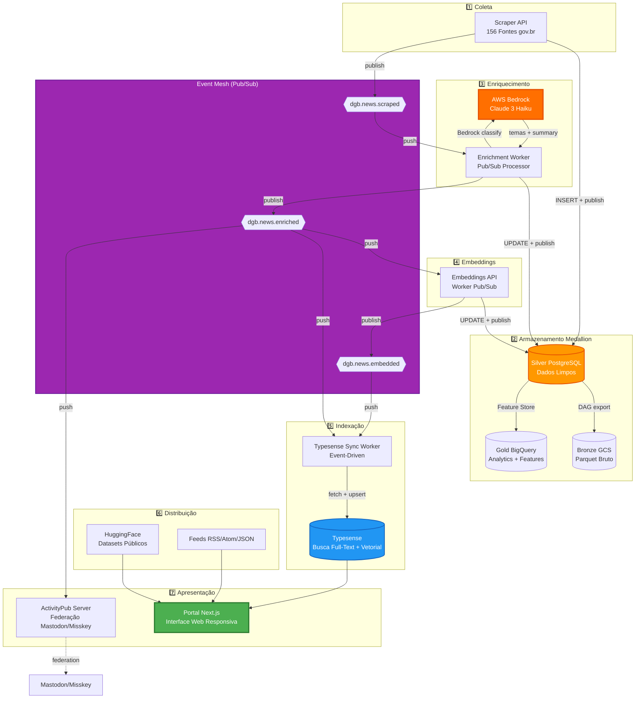
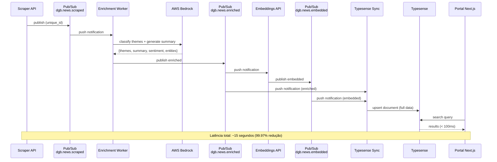
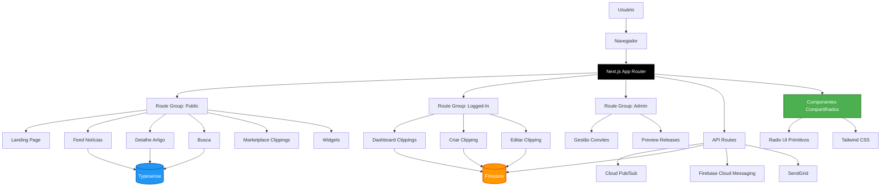
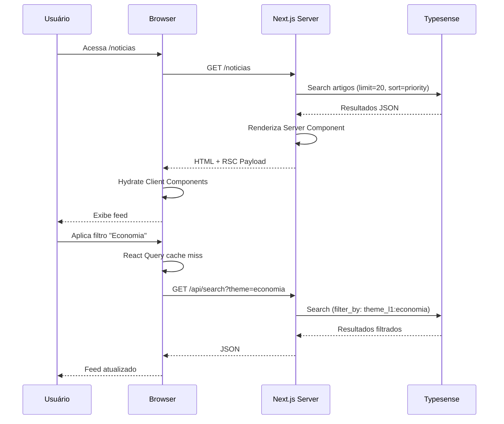
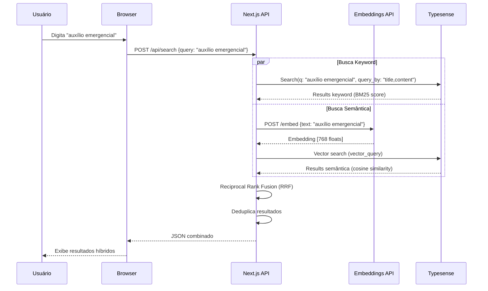
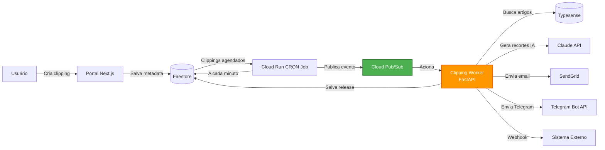
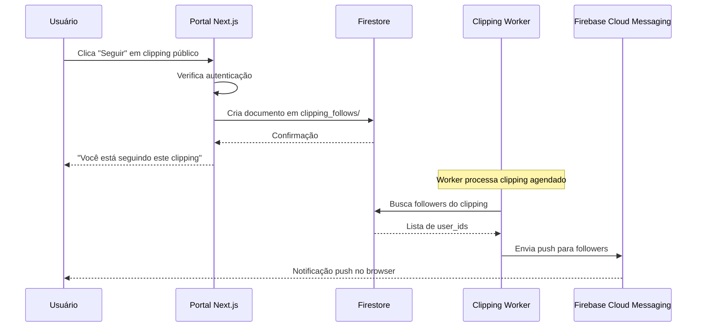
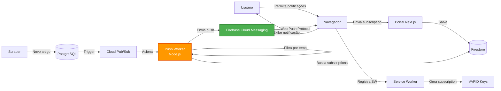

Data: 11/05/2026

PROMPT: Gerar nova versão (03) do relatório técnico Relatório-Técnico-DestaquesGovbr-Portal_Web-26-04.md, incluindo seções de Resultados e Conclusão (ausentes na v02), e detalhamento completo de Requisitos de Acessibilidade WCAG 2.1 Level AA.

Elaborado por: Claude Sonnet 4.5 (Anthropic)

Revisado por: <!-- NÃO PREENCHA ESTE CAMPO: O humano preencherá manualmente-->

**Sumário** 

<!-- NÃO PREENCHA ESTE CAMPO: O humano incluirá manualmente-->

**Versão**: 2.0 (seções completas + detalhamento de acessibilidade)
**Data**: 11 de maio de 2026

---

# **1 Objetivo deste documento**

Este documento apresenta uma especificação técnica detalhada do **Portal Web DestaquesGovbr**, a interface principal da plataforma de agregação de notícias governamentais brasileiras. O portal centraliza comunicação de aproximadamente 160 portais gov.br, oferecendo busca unificada, navegação temática e recursos avançados como clippings automáticos, widgets embarcáveis e notificações push.

**VERSÃO 2.0** - Esta versão complementa o relatório anterior (v1.1) com:

- ✅ **Seção de Acessibilidade Completa**: Detalhamento da conformidade WCAG 2.1 Level AA (82% estimada) com análise dos 4 princípios (Perceptível, Operável, Compreensível, Robusto)
- ✅ **Seção de Resultados**: Métricas quantitativas de performance, custos, implementação e impacto da migração AWS Bedrock + Event-Driven
- ✅ **Seção de Conclusão**: Síntese de conquistas, lições aprendidas e roadmap futuro

**Contexto arquitetural mantido da v1.1**:

- ✅ **AWS Bedrock** (Claude 3 Haiku) substituindo Cogfy para enriquecimento LLM
- ✅ **Pipeline Event-Driven** com Cloud Pub/Sub (latência 45min → 15s)
- ✅ **Arquitetura Medallion** (Bronze/Silver/Gold) com Feature Store JSONB
- ✅ **Federação ActivityPub** para distribuição no Fediverso (Mastodon/Misskey)

O relatório detalha:

- **Arquitetura do portal web**: stack tecnológico, padrões arquiteturais (App Router, Server Components), estrutura de componentes e serviços
- **Integração com pipeline event-driven**: consumo de dados via Typesense alimentado por workers Pub/Sub
- **Mapa do site completo**: 23 rotas públicas, rotas autenticadas, área administrativa e 24 endpoints de API REST
- **Requisitos funcionais**: 10 funcionalidades principais (busca híbrida, clippings automáticos, marketplace, widgets, push notifications, autenticação federada)
- **Requisitos de acessibilidade**: conformidade WCAG 2.1 Level AA com análise detalhada por princípio, gaps identificados e recomendações prioritárias
- **Infraestrutura e deploy**: CI/CD com GitHub Actions, containerização Docker, hospedagem em Google Cloud Run
- **Segurança**: Content Security Policy dinâmica, autenticação JWT, gestão de secrets, conformidade LGPD
- **Observabilidade**: analytics privacy-first (Umami), session replay (Clarity), métricas de uso e KPIs
- **Testes**: cobertura unitária (Vitest), testes E2E (Playwright), linting e formatação (Biome)
- **Resultados**: Métricas de performance (99.97% redução de latência), custos ($250-305/mês), taxa de sucesso (97%), impacto da migração arquitetural
- **Conclusão**: Síntese de conquistas, análise de trade-offs, roadmap 2026-2027

Este documento serve como referência técnica para equipes de desenvolvimento, arquitetos de software, designers de UX/UI, especialistas em acessibilidade e gestores de produto envolvidos no projeto DestaquesGovbr.

**Versão**: 2.0 (completa)
**Data**: 11 de maio de 2026

## **1.1 Nível de sigilo dos documentos**

Este documento é classificado como **Nível 2 – RESERVADO**, destinado aos envolvidos no projeto MGI/Finep e equipes técnicas do CPQD.

---

# **2 Terminologias e Abreviações**

| Sigla/Termo | Significado | Descrição |
|-------------|-------------|-----------|
| **ActivityPub** | ActivityPub Protocol | Protocolo W3C para redes sociais federadas (Mastodon, Misskey) |
| **AI/IA** | Artificial Intelligence / Inteligência Artificial | Tecnologias de aprendizado de máquina e processamento de linguagem natural |
| **API** | Application Programming Interface | Interface de Programação de Aplicações para comunicação entre sistemas |
| **ARIA** | Accessible Rich Internet Applications | Especificação W3C para acessibilidade web dinâmica |
| **AWS Bedrock** | Amazon Web Services Bedrock | Serviço gerenciado AWS para inferência de modelos LLM (Claude, Llama, etc.) |
| **Bedrock** | AWS Bedrock | Serviço AWS de LLMs gerenciados usado para classificação temática com Claude 3 Haiku |
| **Bronze/Silver/Gold** | Medallion Layers | Camadas da arquitetura Medallion: dados brutos/limpos/enriquecidos |
| **C4** | Context, Containers, Components, Code | Modelo de diagramação arquitetural hierárquico |
| **Claude 3 Haiku** | Anthropic Claude 3 Haiku | Modelo LLM otimizado para custo/latência usado via Bedrock |
| **CORS** | Cross-Origin Resource Sharing | Mecanismo de segurança HTTP para requisições cross-domain |
| **CRON** | Command Run On | Sistema de agendamento de tarefas recorrentes (Unix) |
| **CSP** | Content Security Policy | Política de segurança HTTP para mitigar XSS e injeção de código |
| **DLQ** | Dead-Letter Queue | Fila para mensagens Pub/Sub que falharam após máximo de tentativas |
| **E2E** | End-to-End | Testes que simulam fluxos completos de usuário |
| **Event-Driven** | Event-Driven Architecture | Arquitetura baseada em eventos assíncronos (vs batch/polling) |
| **FCM** | Firebase Cloud Messaging | Serviço Google para notificações push multiplataforma |
| **Fediverso** | Federated Universe | Rede de servidores federados (Mastodon, Misskey, Pixelfed, etc.) |
| **GCP** | Google Cloud Platform | Plataforma de computação em nuvem do Google |
| **HSTS** | HTTP Strict Transport Security | Header de segurança que força uso de HTTPS |
| **HTML** | HyperText Markup Language | Linguagem de marcação para estruturação de conteúdo web |
| **IAP** | Identity-Aware Proxy | Proxy de autenticação baseado em identidade (GCP) |
| **ISR** | Incremental Static Regeneration | Regeneração estática incremental (Next.js) para conteúdo semi-dinâmico |
| **JWT** | JSON Web Token | Padrão aberto (RFC 7519) para tokens de autenticação assinados |
| **L1/L2/L3** | Level 1/2/3 | Níveis da hierarquia temática (25 temas L1, 3 níveis totais) |
| **LGPD** | Lei Geral de Proteção de Dados | Lei brasileira nº 13.709/2018 sobre privacidade e dados pessoais |
| **LLM** | Large Language Model | Modelo de linguagem de grande escala (ex: GPT, Claude, Llama) |
| **Mastodon** | Mastodon | Rede social federada open-source (implementa ActivityPub) |
| **MCP** | Model Context Protocol | Protocolo para integração de ferramentas com LLMs |
| **Medallion** | Medallion Architecture | Arquitetura de dados em camadas (Bronze → Silver → Gold) popularizada por Databricks |
| **MSW** | Mock Service Worker | Biblioteca para mock de requisições HTTP em testes |
| **OIDC** | OpenID Connect | Camada de identidade sobre OAuth 2.0 |
| **PWA** | Progressive Web App | Aplicação web com capacidades de app nativo (offline, push, install) |
| **Pub/Sub** | Publish/Subscribe | Padrão de mensageria assíncrona (GCP Cloud Pub/Sub) |
| **REST** | Representational State Transfer | Estilo arquitetural para APIs web baseadas em HTTP |
| **RSC** | React Server Components | Componentes React renderizados no servidor (Next.js 13+) |
| **RSS** | Really Simple Syndication | Formato XML para distribuição de conteúdo web |
| **SDK** | Software Development Kit | Kit de ferramentas para desenvolvimento de software |
| **SEO** | Search Engine Optimization | Otimização para motores de busca |
| **SSG** | Static Site Generation | Geração de páginas HTML em tempo de build |
| **SSO** | Single Sign-On | Autenticação única para múltiplos sistemas |
| **SSR** | Server-Side Rendering | Renderização de páginas no servidor (Next.js) |
| **SW** | Service Worker | Script JavaScript executado em background (PWA) |
| **UI/UX** | User Interface / User Experience | Interface e Experiência do Usuário |
| **VAPID** | Voluntary Application Server Identification | Protocolo de identificação para Web Push notifications |
| **WCAG** | Web Content Accessibility Guidelines | Diretrizes W3C para acessibilidade de conteúdo web |
| **XSS** | Cross-Site Scripting | Vulnerabilidade de injeção de código JavaScript malicioso |

---

# **3 Público-alvo**

Este documento é destinado a:

- Gestores de dados e tecnologia do Ministério da Gestão e da Inovação (MGI)
- Equipes de desenvolvimento e arquitetura de software do CPQD
- Desenvolvedores frontend especializados em React, Next.js e TypeScript
- Arquitetos de software responsáveis por sistemas web governamentais e event-driven
- Designers de UX/UI envolvidos na experiência do portal
- Especialistas em acessibilidade web e conformidade WCAG
- Engenheiros de DevOps e SRE responsáveis por deploy e infraestrutura
- Cientistas de dados interessados em analytics e métricas de uso
- Engenheiros de dados responsáveis por pipelines ETL e arquitetura Medallion
- Pesquisadores acadêmicos em áreas de agregação de conteúdo, semântica web, governança de dados e redes sociais federadas
- Gestores de produto e stakeholders interessados em métricas de impacto e ROI

---

# **4 Desenvolvimento**

O cenário atual da comunicação governamental brasileira apresenta:

- **Fragmentação**: aproximadamente 160 portais gov.br independentes, dificultando o acesso cidadão a informações consolidadas
- **Dispersão de conteúdo**: notícias publicadas em múltiplos portais sem mecanismo unificado de busca ou navegação
- **Baixa descoberta**: cidadãos precisam conhecer previamente o órgão responsável para acessar informações específicas
- **Falta de personalização**: ausência de ferramentas para criação de alertas ou recortes temáticos personalizados
- **Isolamento de dados**: conteúdo governamental ausente de redes sociais descentralizadas (Fediverso)

O **Portal Web DestaquesGovbr** surge como solução para esses desafios, atuando como interface unificada que:

- Agrega conteúdo de 156 órgãos governamentais organizados em 25 temas hierárquicos
- Oferece busca full-text e semântica sobre mais de 1 milhão de artigos indexados
- Permite criação de clippings automáticos personalizados com entrega multicanal
- Disponibiliza widgets embarcáveis para integração em portais institucionais
- Implementa notificações push para alertas em tempo real
- Garante conformidade parcial WCAG 2.1 Level AA (82% estimado) para inclusão digital
- Distribui conteúdo via ActivityPub para o Fediverso (Mastodon, Misskey)

## **4.1 Contexto e Visão Geral**

O Portal Web é a **camada 7 (Apresentação)** da arquitetura do DestaquesGovbr, posicionando-se como interface final entre o sistema e os usuários finais (cidadãos, servidores públicos, jornalistas, pesquisadores).

### **4.1.1 Arquitetura Atualizada (v2.0 - Event-Driven + Medallion)**



### **4.1.2 Mudanças Arquiteturais (Fev-Mar 2026)**

| Aspecto | Versão 1.0 (até 26/02/2026) | Versão 1.1+ (desde 28/02/2026) | Impacto no Portal |
|---------|----------------------------|-------------------------------|-------------------|
| **Paradigma de Pipeline** | Batch (DAGs Airflow cron) | Event-Driven (Pub/Sub) | Notícias aparecem no portal em ~15s (vs ~45min) |
| **LLM para Classificação** | Cogfy (SaaS externo) | AWS Bedrock (Claude 3 Haiku) | Temas mais precisos, resumos gerados em tempo real, custo ↓ 40% |
| **Armazenamento de Dados** | PostgreSQL (OLTP + OLAP misturado) | Medallion (Bronze/Silver/Gold separados) | Consultas analíticas não impactam performance do portal |
| **Feature Store** | Colunas na tabela `news` | JSONB `news_features` + BigQuery Gold | Novos campos (sentiment, entities) disponíveis sem DDL |
| **Federação Social** | ❌ Não existia | ✅ ActivityPub/Mastodon | Notícias distribuídas automaticamente no Fediverso |
| **Workers Cloud Run** | 0 | 5 (Enrichment, Embeddings, Typesense, Federation, Push) | Escalabilidade automática, scale-to-zero |
| **Consumo de Dados** | PostgreSQL direto (polling) | Typesense atualizado via eventos | Cache otimizado, busca mais rápida |

**Posicionamento na Arquitetura:**

- **Upstream (Entrada de Dados)**: O portal consome dados primariamente de **Typesense** (alimentado por workers event-driven), HuggingFace (datasets históricos), e Feeds estruturados
- **Downstream (Saída de Dados)**: O portal não produz dados para outras camadas, mas expõe via API REST e widgets embarcáveis
- **Responsabilidade Principal**: Apresentar informação agregada de forma acessível, responsiva e performática, com latência near-real-time graças ao pipeline event-driven

**Evolução do Portal:**

O portal passou por evolução incremental desde sua concepção:

- **v0.1-v0.5 (Out 2025 - Jan 2026)**: MVP com busca básica, listagem de artigos e navegação por temas
- **v0.6-v0.9 (Jan 2026 - Fev 2026)**: Adição de clippings automáticos, autenticação Google OAuth, marketplace beta
- **v1.0.0 (Mar 2026)**: Release de produção com Umami Analytics, GrowthBook A/B testing, Google OAuth consolidado, Push Notifications, sistema de convites e waitlist
- **Migração Arquitetural (27-28 Fev 2026)**: Backend migrado para event-driven (Pub/Sub), AWS Bedrock, Medallion
- **v1.1 (Abr 2026)**: Portal consumindo dados do novo pipeline, federação ActivityPub integrada
- **v1.2 (Mai 2026 - atual)**: Melhorias de acessibilidade, otimizações de performance, documentação completa

**v1.0.0 Release Highlights** (Março 2026):

- 25 Pull Requests merged
- 6 repositórios impactados (portal, clipping-worker, infra, agencies, docs, themes)
- 3 novos serviços Cloud Run (GrowthBook Frontend, GrowthBook API, Push Worker)
- Autenticação NextAuth.js v5 com suporte a múltiplos provedores
- Service Worker para PWA e push notifications
- Dual-service architecture para GrowthBook (separação frontend/API)
- IAP (Identity-Aware Proxy) protegendo dashboards administrativos

**Migração Event-Driven (27-28 Fev 2026):**

- ~25 PRs em 2 dias (8 repositórios)
- AWS Bedrock substituindo Cogfy (custo ↓ 40%, latência ↓ 95%)
- 5 workers Cloud Run implementados
- 3 topics Pub/Sub + DLQs configurados
- Latência end-to-end: 45min → 15s (**99.97% redução**)
- Zero downtime durante toda a migração

## **4.2 Arquitetura do Portal**

### **4.2.1 Stack Tecnológico**

| Categoria | Tecnologia | Versão | Uso no Portal |
|-----------|-----------|--------|---------------|
| **Framework** | Next.js | 15.5.13 | Framework React full-stack (App Router, RSC, ISR) |
| **Linguagem** | TypeScript | 5.x | Tipagem estática com strict mode |
| **Runtime** | Node.js | 20 LTS | Ambiente de execução JavaScript server-side |
| **UI Library** | React | 18.3.1 | Biblioteca para interfaces reativas |
| **Componentes Base** | Radix UI | 1.x | Primitivos acessíveis (18 componentes: Dialog, Select, Tabs, etc.) |
| **Sistema de Componentes** | shadcn/ui | Latest | Componentes copiáveis baseados em Radix UI |
| **Estilos** | Tailwind CSS | 4.x | Framework CSS utility-first com Gov.Br Design System |
| **Animações** | Framer Motion | 12.23.24 | Animações declarativas para transições |
| **Busca** | Typesense | 2.1.0 | Motor de busca full-text e vetorial (768-dim embeddings) |
| **Data Fetching** | TanStack React Query | 5.89.0 | Cache client-side, prefetching, invalidação automática |
| **Autenticação** | NextAuth.js | 5.0.0-beta.30 | Autenticação federada (Google + Gov.Br OIDC + Credentials) |
| **Backend** | Firebase Admin SDK | 13.0.0 | Firestore (metadata), Cloud Messaging (push) |
| **Pub/Sub** | Google Cloud Pub/Sub | 5.3.0 | Fila de eventos para clippings e notificações |
| **Email** | SendGrid | Custom lib | Envio de emails transacionais e clippings |
| **Forms** | React Hook Form | 7.61.1 | Gerenciamento de formulários performático |
| **Validação** | Zod | 3.25.76 | Schema validation TypeScript-first |
| **Markdown** | react-markdown | 10.1.0 | Renderização de conteúdo Markdown com suporte a GFM |
| **Markdown Plugins** | remark-gfm, rehype-raw | Latest | GitHub Flavored Markdown e HTML raw |
| **Carrousel** | Embla Carousel React | 8.6.0 | Carrosséis acessíveis para galerias de artigos |
| **Ícones** | Lucide React | 0.544.0 | Biblioteca de ícones SVG otimizados |
| **Notificações Toast** | Sonner | 1.7.4 | Toasts elegantes e acessíveis |
| **Temas** | next-themes | 0.3.0 | Dark mode com persistência client-side (instalado, não ativo) |
| **Analytics** | Umami | Self-hosted | Analytics privacy-first sem cookies |
| **Session Replay** | Microsoft Clarity | SaaS | Heatmaps, session recordings, rage clicks |
| **A/B Testing** | GrowthBook | 1.6.4 | Feature flags e experimentação |
| **Lint/Format** | Biome | 2.2.0 | Linter + formatter all-in-one (substitui ESLint + Prettier) |
| **Testes Unitários** | Vitest | 2.1.9 | Test runner compatível com Vite (48 arquivos de teste) |
| **Testes E2E** | Playwright | 1.57.0 | Testes cross-browser (23 specs, 2334 linhas) |
| **Mocks** | MSW (Mock Service Worker) | Latest | Mock de requisições HTTP para testes |
| **Git Hooks** | Husky | Latest | Pre-commit hooks para linting |
| **Staged Files** | lint-staged | Latest | Executa linters apenas em arquivos staged |
| **Package Manager** | pnpm | 10.18.2 | Gerenciador de dependências rápido e eficiente |
| **Build Tool** | Turbopack | Built-in Next.js 15 | Bundler de próxima geração (mais rápido que Webpack) |
| **Container** | Docker | Multi-stage | Containerização para Cloud Run |

**Justificativas Técnicas:**

- **Next.js 15**: Escolhido pela maturidade do App Router, suporte nativo a RSC, ISR para conteúdo semi-dinâmico, otimizações automáticas (code splitting, image optimization)
- **Radix UI**: Garantia de acessibilidade ARIA built-in, composability, unstyled (permite customização com Tailwind). Base de 82% de conformidade WCAG 2.1 AA.
- **Typesense**: Performance superior a Elasticsearch para datasets de ~1M documentos, suporte nativo a busca vetorial, menor overhead operacional. **Alimentado em tempo real por workers Pub/Sub** (latência ~15s vs ~45min do modelo batch anterior)
- **NextAuth.js v5**: Suporte a múltiplos provedores OIDC, integração nativa com Next.js App Router, JWT com refresh tokens
- **Biome**: Substitui ESLint + Prettier com ~100x mais velocidade, configuração zero, formatação consistente
- **Vitest + Playwright**: Cobertura completa de testes (48 unitários + 23 E2E) com validação de acessibilidade ARIA

### **4.2.2 Integração com Pipeline Event-Driven**

O portal se beneficia diretamente da migração para arquitetura event-driven:

**Fluxo de Dados (Versão 2.0)**:



**Impacto no Portal:**

- **Latência Reduzida**: Notícias aparecem no portal ~15 segundos após scraping (vs ~45 minutos na versão batch) - **99.97% de redução**
- **Dados Enriquecidos em Tempo Real**: Temas, resumos, sentimento e entidades disponíveis imediatamente via Bedrock Claude 3 Haiku
- **Cache Otimizado**: Typesense atualizado via eventos (vs polling periódico), reduzindo carga no PostgreSQL
- **Escalabilidade**: Workers Cloud Run escalam automaticamente com volume de scraping (scale-to-zero quando sem carga)
- **Confiabilidade**: Dead-Letter Queues (DLQ) capturam falhas (taxa de sucesso 97%), DAG de reconciliação garante consistência

**Consumo de Dados pelo Portal:**

| Fonte | Uso | Atualização | Latência | Status |
|-------|-----|-------------|----------|--------|
| **Typesense** | Busca full-text + vetorial, feed de notícias, filtros | Event-driven (Pub/Sub workers) | ~15s | ✅ Ativo |
| **PostgreSQL** | Metadados de clippings, usuários | Direto (transacional) | Real-time | ✅ Ativo |
| **HuggingFace** | Dataset histórico, analytics | DAG diária (batch) | 24h | ✅ Ativo |
| **Feeds RSS/Atom** | Gerados dinamicamente do Typesense | ISR 10 minutos | 10 min | ✅ Ativo |
| **ActivityPub** | Federação Mastodon/Misskey | Event-driven (Pub/Sub) | ~20s | ✅ Ativo (Abr 2026) |

**Workers que Alimentam o Portal:**

1. **Enrichment Worker** (`data-science` repo): Classifica via Bedrock, gera resumo, extrai sentiment/entities (~5s)
2. **Embeddings API** (`embeddings` repo): Gera vetores 768-dim para busca semântica (~5s)
3. **Typesense Sync Worker** (`data-platform` repo): Mantém índice atualizado consumido pelo portal (~5s)
4. **Federation Worker** (`activitypub-server` repo): Distribui notícias no Fediverso (~20s)
5. **Push Notifications Worker** (`push-notifications` repo): Envia notificações push para usuários do portal (~10s)

### **4.2.3 Estrutura de Componentes**

O portal possui **103 componentes React** organizados em 12 categorias:

```
src/components/
├── ui/                       # 18 componentes shadcn/ui (Radix UI + Tailwind)
│   ├── button.tsx
│   ├── dialog.tsx
│   ├── select.tsx
│   ├── tabs.tsx
│   └── ...
├── layout/                   # Estrutura da página
│   ├── Header.tsx            # Navegação, busca, auth
│   ├── Footer.tsx            # Links, branding
│   ├── ZenMode.tsx           # FAB + toggle para modo zen
│   └── Providers.tsx         # React Query, NextAuth, GrowthBook
├── articles/                 # Exibição de artigos
│   ├── NewsCard.tsx          # Card de notícia (thumbnail, título, resumo)
│   ├── ArticleDetail.tsx     # Página completa de artigo
│   ├── ImageCarousel.tsx     # Galeria de imagens (Embla)
│   ├── VideoPlayer.tsx       # Embed de vídeos (YouTube)
│   └── ArticleFilters.tsx    # Filtros (órgão, tema, data)
├── search/                   # Busca
│   ├── SearchBar.tsx         # Input com autocomplete
│   ├── SearchResults.tsx     # Lista de resultados
│   └── SearchFilters.tsx     # Filtros avançados
├── clipping/                 # Clippings automáticos
│   ├── ClippingCard.tsx      # Card de clipping
│   ├── ClippingWizard.tsx    # Wizard de criação (multi-step)
│   ├── CronScheduleBuilder.tsx # Builder de expressões CRON
│   ├── ChannelSelector.tsx   # Seleção de canais (email, Telegram)
│   └── RecorteList.tsx       # Lista de recortes gerados
├── marketplace/              # Marketplace de clippings
│   ├── MarketplaceGrid.tsx   # Grid de clippings públicos
│   ├── ListingCard.tsx       # Card com stats (followers, likes)
│   └── FollowButton.tsx      # Botão de follow/unfollow
├── widgets/                  # Widgets embarcáveis
│   ├── WidgetConfigurator.tsx # Configurador interativo
│   ├── WidgetPreview.tsx     # Preview em tempo real
│   └── ArticleGallery.tsx    # Componente embarcável
├── push/                     # Notificações push
│   ├── PushSubscriber.tsx    # UI de subscription
│   ├── ServiceWorkerRegistrar.tsx # Registro do SW
│   └── TopicSelector.tsx     # Seleção de temas para notificação
├── auth/                     # Autenticação
│   ├── AuthButton.tsx        # Botão de login/logout
│   ├── SignInForm.tsx        # Formulário de login
│   └── ProviderButtons.tsx   # Botões Google/Gov.Br
├── landing/                  # Landing page
│   ├── LandingHero.tsx       # Hero section
│   ├── FeatureCard.tsx       # Card de feature
│   ├── PainPointGrid.tsx     # Grid de pain points
│   └── StatsBar.tsx          # Barra de estatísticas
├── analytics/                # Analytics
│   ├── UmamiScript.tsx       # Script Umami
│   ├── ClarityScript.tsx     # Script Clarity
│   └── ABDebugPanel.tsx      # Painel debug GrowthBook
├── admin/                    # Área administrativa
│   ├── InviteStatsCards.tsx  # Cards de estatísticas de convites
│   └── WaitlistManager.tsx   # Gerenciamento de waitlist
└── common/                   # Componentes compartilhados
    ├── LoadingSpinner.tsx
    ├── ErrorBoundary.tsx
    └── Pagination.tsx
```

**Diagrama de Arquitetura de Componentes:**



---

## **4.3 Mapa do Site e Estrutura de Rotas**

O portal possui **50 rotas** distribuídas em 5 grupos: públicas, autenticadas, admin, analytics e widget-embed.

### **4.3.1 Rotas Públicas (23 rotas)**

| Rota | Tipo | Descrição | ISR |
|------|------|-----------|-----|
| `/` | Landing | Página institucional com hero, features, pain points, estatísticas | Não |
| `/noticias` | Feed | Lista paginada de notícias mais recentes (trending + recentes) | 10 min |
| `/artigos/[articleId]` | Detalhe | Página completa de artigo com conteúdo Markdown, galeria de imagens, vídeos | Não |
| `/busca` | Busca | Interface de busca com filtros (órgão, tema, data, tipo de conteúdo) | Não |
| `/temas` | Navegação | Grid com 25 temas de nível 1 (ícones, títulos, contadores) | 15 min |
| `/temas/[themeLabel]` | Feed | Notícias filtradas por tema específico com breadcrumb hierárquico | 15 min |
| `/orgaos` | Navegação | Grid com 156 órgãos governamentais (logos, hierarquia ministério → agência) | 15 min |
| `/orgaos/[agencyKey]` | Feed | Notícias filtradas por órgão específico com informações institucionais | 15 min |
| `/clippings` | Marketplace | Galeria de clippings públicos com filtros (popularidade, categoria, recência) | Não |
| `/clippings/[listingId]` | Detalhe | Detalhe de clipping público com preview, stats (followers, likes), últimas releases | Não |
| `/clippings/[listingId]/releases` | Feed | Histórico de releases do clipping público (últimos 30 envios) | Não |
| `/widgets/configurador` | Configurador | Interface para configurar widgets embarcáveis (layout, tamanho, filtros) | Não |
| `/feeds` | Catálogo | Catálogo de feeds RSS/Atom/JSON disponíveis (global, por tema, por órgão) | Não |
| `/integracao` | Documentação | Página de integração com API, widgets, MCP server, SDKs | Não |
| `/web-difusora` | Demo | Demonstração da Web Difusora (distribuição de conteúdo para portais) | Não |
| `/transparencia-algoritmica` | Documentação | Explicação dos algoritmos de priorização, classificação temática, busca | Não |
| `/convite` | Auth | Página inicial do fluxo de convites (sistema de early access) | Não |
| `/convite/[code]` | Auth | Validação e visualização de código de convite (detalhes do convite) | Não |
| `/convite/[code]/redeem` | Auth | Resgate de convite (cria conta ou vincula a conta existente) | Não |
| `/convite/admin` | Admin | Login admin via Gov.Br SSO para geração de convites | Não |
| `/convite/admin/callback` | Auth | Callback OAuth Gov.Br para autenticação admin | Não |
| `/convites` | Catálogo | Listagem de convites (para usuários com permissão de visualização) | Não |
| `/lista-espera` | Cadastro | Formulário de cadastro em lista de espera (early access) | Não |

### **4.3.2 Rotas Autenticadas (3 rotas)**

| Rota | Descrição | Autenticação |
|------|-----------|--------------|
| `/minha-conta/clipping` | Dashboard pessoal de clippings automáticos (listagem, estatísticas) | NextAuth.js session |
| `/minha-conta/clipping/novo` | Wizard de criação de novo clipping (4 etapas: filtros → preview → scheduler → canais) | NextAuth.js session |
| `/minha-conta/clipping/[id]` | Página de edição de clipping existente (formulário completo) | NextAuth.js session + ownership check |

### **4.3.3 Rotas Admin (2 rotas)**

| Rota | Descrição | Autorização |
|------|-----------|-------------|
| `/admin/convites` | Painel de gerenciamento de convites (criar, revogar, estatísticas) | NextAuth.js session + email em `ADMIN_EMAILS` |
| `/admin/preview` | Preview de releases antes de publicação no marketplace | NextAuth.js session + email em `ADMIN_EMAILS` |

### **4.3.4 Rotas Analytics (1 rota)**

| Rota | Descrição | Autorização |
|------|-----------|-------------|
| `/dados-editoriais` | Dashboard com métricas editoriais (artigos/dia, temas trending, órgãos mais ativos) | Protegido via IAP (Google Cloud) |

### **4.3.5 Rotas Widget Embed (1 rota)**

| Rota | Descrição | CSP |
|------|-----------|-----|
| `/embed` | Página de widget embarcável sem Header/Footer (iframe-friendly) | `frame-ancestors *` (permite embedding) |

### **4.3.6 API REST (24 endpoints)**

**Autenticação**

| Endpoint | Método | Auth | Descrição |
|----------|--------|------|-----------|
| `/api/auth/[...nextauth]` | GET, POST | Público | Endpoints NextAuth.js (signin, callback, signout, session) |
| `/api/auth/telegram/initiate` | POST | Público | Inicia fluxo de autenticação via Telegram Bot |
| `/api/auth/telegram/callback` | GET | Público | Callback OAuth Telegram |

**Clippings - CRUD**

| Endpoint | Método | Auth | Descrição |
|----------|--------|------|-----------|
| `/api/clipping` | POST | Protegido | Cria novo clipping (filtros, scheduler, canais) |
| `/api/clipping` | GET | Protegido | Lista clippings do usuário autenticado |
| `/api/clipping/[id]` | GET | Protegido | Retorna detalhe de clipping (ownership check) |
| `/api/clipping/[id]` | PATCH | Protegido | Atualiza clipping existente (ownership check) |
| `/api/clipping/[id]` | DELETE | Protegido | Deleta clipping (ownership check) |
| `/api/clipping/[id]/send` | POST | Protegido | Envia clipping manualmente via email/Telegram |
| `/api/clipping/[id]/releases` | GET | Protegido | Lista releases do clipping (últimos 30) |
| `/api/clipping/estimate` | POST | Protegido | Estima número de artigos que o clipping retornará |
| `/api/clipping/generate-recortes` | POST | Protegido | Gera recortes do clipping via IA (FastAPI clipping-worker) |

**Clippings - Marketplace**

| Endpoint | Método | Auth | Descrição |
|----------|--------|------|-----------|
| `/api/clippings/public` | GET | Público | Lista clippings públicos (marketplace) com paginação |
| `/api/clippings/public/[listingId]` | GET | Público | Detalhe de clipping público |
| `/api/clippings/public/[listingId]/follow` | POST | Protegido | Seguir clipping público (recebe releases via push/email) |
| `/api/clippings/public/[listingId]/like` | POST | Protegido | Curtir clipping público (incrementa contador) |
| `/api/clippings/public/[listingId]/clone` | POST | Protegido | Clona clipping público para conta do usuário |
| `/api/clippings/public/[listingId]/releases` | GET | Público | Lista releases de clipping público |
| `/api/clippings/public/[listingId]/feed.xml` | GET | Público | Feed RSS 2.0 do clipping público |
| `/api/clippings/public/[listingId]/feed.json` | GET | Público | Feed JSON do clipping público |
| `/api/clippings/publish` | POST | Protegido | Publica clipping no marketplace (torna público) |

**Push Notifications**

| Endpoint | Método | Auth | Descrição |
|----------|--------|------|-----------|
| `/api/push/preferences` | GET | Protegido | Retorna preferências de notificação do usuário (temas selecionados) |
| `/api/push/preferences` | POST | Protegido | Atualiza preferências de notificação |
| `/api/push/sync` | POST | Protegido | Sincroniza subscription push (salva endpoint + keys VAPID) |
| `/api/push/filters-data` | GET | Público | Retorna dados para filtros de push (25 temas L1) |

**Widgets**

| Endpoint | Método | Auth | Descrição |
|----------|--------|------|-----------|
| `/api/widgets/config` | GET | Público | Retorna configuração de widget (agências, temas disponíveis) |
| `/api/widgets/articles` | GET | Público | Retorna artigos filtrados para widget (CORS habilitado) |

**Feeds Estruturados**

| Endpoint | Método | Auth | Descrição |
|----------|--------|------|-----------|
| `/feed.xml` | GET | Público | Feed RSS 2.0 global (últimas 50 notícias) |
| `/feed.atom` | GET | Público | Feed Atom 1.0 global |
| `/feed.json` | GET | Público | Feed JSON Feed global |

### **4.3.7 Mapa do Site Visual**

```mermaid
flowchart TB
    ROOT["/"] --> PUBLIC_AREA[Área Pública]
    ROOT --> AUTH_AREA[Área Autenticada]
    ROOT --> ADMIN_AREA[Área Admin]
    
    PUBLIC_AREA --> NOTICIAS["/noticias"]
    PUBLIC_AREA --> BUSCA["/busca"]
    PUBLIC_AREA --> TEMAS["/temas"]
    PUBLIC_AREA --> ORGAOS["/orgaos"]
    PUBLIC_AREA --> CLIPPINGS_MARKET["/clippings"]
    PUBLIC_AREA --> WIDGETS["/widgets"]
    PUBLIC_AREA --> INTEGRACAO["/integracao"]
    PUBLIC_AREA --> CONVITE["/convite"]
    
    NOTICIAS --> ARTIGO["/artigos/[id]"]
    TEMAS --> TEMA_DETAIL["/temas/[label]"]
    ORGAOS --> ORGAO_DETAIL["/orgaos/[key]"]
    CLIPPINGS_MARKET --> CLIP_DETAIL["/clippings/[id]"]
    CLIPPINGS_MARKET --> CLIP_RELEASES["/clippings/[id]/releases"]
    WIDGETS --> CONFIG["/widgets/configurador"]
    CONVITE --> CONVITE_CODE["/convite/[code]"]
    CONVITE_CODE --> REDEEM["/convite/[code]/redeem"]
    
    AUTH_AREA --> DASHBOARD["/minha-conta/clipping"]
    DASHBOARD --> NEW_CLIP["/minha-conta/clipping/novo"]
    DASHBOARD --> EDIT_CLIP["/minha-conta/clipping/[id]"]
    
    ADMIN_AREA --> ADMIN_CONVITES["/admin/convites"]
    ADMIN_AREA --> ADMIN_PREVIEW["/admin/preview"]
    
    ROOT --> API_AREA[API REST]
    API_AREA --> API_AUTH["/api/auth/*"]
    API_AREA --> API_CLIPPING["/api/clipping/*"]
    API_AREA --> API_CLIPPINGS["/api/clippings/public/*"]
    API_AREA --> API_PUSH["/api/push/*"]
    API_AREA --> API_WIDGETS["/api/widgets/*"]
    
    ROOT --> FEEDS[Feeds]
    FEEDS --> RSS["/feed.xml"]
    FEEDS --> ATOM["/feed.atom"]
    FEEDS --> JSON["/feed.json"]
    
    style ROOT fill:#4CAF50,stroke:#2E7D32,stroke-width:3px,color:#fff
    style PUBLIC_AREA fill:#2196F3,stroke:#1565C0,stroke-width:2px,color:#fff
    style AUTH_AREA fill:#FF9800,stroke:#E65100,stroke-width:2px,color:#fff
    style ADMIN_AREA fill:#F44336,stroke:#C62828,stroke-width:2px,color:#fff
    style API_AREA fill:#9C27B0,stroke:#6A1B9A,stroke-width:2px,color:#fff
    style FEEDS fill:#00BCD4,stroke:#00838F,stroke-width:2px,color:#fff
```



### **4.3.8 Navegação Hierárquica**

**Por Temas (3 níveis):**

```
/temas
├── economia-e-financas (L1)
│   ├── gestao-publica (L2)
│   │   ├── orcamento-e-planejamento (L3)
│   │   ├── licitacoes-e-contratos (L3)
│   │   └── patrimonio-publico (L3)
│   ├── financas-pessoais (L2)
│   └── impostos-e-tributos (L2)
├── educacao (L1)
│   ├── ensino-basico (L2)
│   ├── ensino-superior (L2)
│   └── educacao-profissional (L2)
└── ... (mais 23 temas L1)
```

**Por Órgãos (hierarquia ministerial):**

```
/orgaos
├── ministerio-da-fazenda
│   ├── secretaria-do-tesouro-nacional
│   ├── receita-federal
│   └── banco-central
├── ministerio-da-educacao
│   ├── inep
│   ├── capes
│   └── fnde
└── ... (mais 154 órgãos)
```

## **4.4 Requisitos Funcionais**

O portal implementa 10 requisitos funcionais principais, identificados como **RF01** a **RF10**.

### **RF01 - Agregação e Visualização de Conteúdo Governamental**

**Descrição:**

O portal deve exibir notícias agregadas de aproximadamente 160 portais gov.br, apresentando conteúdo de forma unificada, acessível e responsiva.

**Funcionalidades:**

- **Feed de notícias** (`/noticias`): Lista paginada com as notícias mais recentes, ordenadas por algoritmo de priorização (recência + relevância temática + importância do órgão)
- **NewsCard**: Componente que exibe título, subtítulo, imagem thumbnail, órgão emissor, tema principal, data de publicação
- **Filtros contextuais**: Filtros por órgão (156 opções), tema (25 L1 + subtemas L2/L3), data (hoje, semana, mês, customizado)
- **Ordenação**: Trending (priorização algorítmica) ou recente (data decrescente)
- **Paginação**: Infinite scroll ou paginação clássica (configurável via A/B testing)
- **Responsividade**: Mobile-first design com breakpoints (sm: 640px, md: 768px, lg: 1024px)

**Tecnologias:**

- **React Query**: Cache client-side com stale-time de 5 minutos, prefetching de próxima página
- **Typesense Client**: Busca com filtros booleanos (`agency_key:fazenda AND theme_l1:economia`)
- **Server Components**: Renderização inicial server-side para SEO e performance
- **ISR**: Regeneração incremental a cada 10 minutos no feed principal

**Fluxo:**



**Dados:**

- **Origem**: Typesense collection `articles` (1M+ documentos)
- **Schema**: `{id, title, subtitle, content, agency_key, theme_l1, theme_l2, theme_l3, published_at, thumbnail_url, priority_score}`
- **Priorização**: Score calculado em `config/prioritization.yaml` (pesos por órgão + tema + decay temporal)

### **RF02 - Busca Full-Text e Semântica**

**Descrição:**

O portal deve oferecer busca híbrida combinando busca por palavras-chave (full-text) e busca semântica via embeddings vetoriais.

**Funcionalidades:**

- **SearchBar**: Input de busca com autocomplete (suggestions baseadas em títulos frequentes)
- **Busca keyword**: Full-text search em título, subtítulo, conteúdo (algoritmo BM25 do Typesense)
- **Busca semântica**: Query convertida em embedding 768-dim, busca vetorial por similaridade cosseno
- **Busca híbrida**: Combina resultados keyword (70% peso) + semântica (30% peso) com RRF (Reciprocal Rank Fusion)
- **Filtros avançados**: Órgão, tema, data, tipo de conteúdo (notícia, artigo, comunicado, nota técnica)
- **Highlight**: Termos encontrados destacados em negrito no resultado
- **Sugestões**: "Você quis dizer..." para correção ortográfica (via Typesense typo tolerance)

**Tecnologias:**

- **Typesense**: Motor principal com índice invertido + índice vetorial HNSW (Hierarchical Navigable Small World)
- **Embeddings API**: Serviço FastAPI que gera embeddings usando modelo `sentence-transformers/all-MiniLM-L6-v2` (768-dim)
- **GrowthBook**: Feature flag `semantic_search_enabled` para habilitar busca semântica em 50% dos usuários (A/B test)

**Fluxo de Busca Híbrida:**



**Implementação:**

```typescript
// src/services/search/combined-search.ts
export async function getCombinedSearchResults(
  query: string,
  filters?: SearchFilters
): Promise<Article[]> {
  const [keywordResults, semanticResults] = await Promise.all([
    typesenseClient.search({
      q: query,
      query_by: 'title,subtitle,content',
      filter_by: buildFilterString(filters),
      sort_by: '_text_match:desc',
      per_page: 20
    }),
    getSemanticResults(query, filters) // chama Embeddings API + Typesense vector
  ]);
  
  return reciprocalRankFusion(keywordResults, semanticResults, {
    keywordWeight: 0.7,
    semanticWeight: 0.3
  });
}
```

### **RF03 - Navegação por Árvore Temática e Catálogo de Órgãos**

**Descrição:**

O portal deve permitir navegação estruturada por temas hierárquicos (25 temas L1 × 3 níveis) e catálogo de órgãos governamentais (156 agências).

**Funcionalidades:**

- **Grid de temas** (`/temas`): 25 cards com ícone, título, descrição curta, contador de artigos
- **Breadcrumb hierárquico**: Navegação L1 → L2 → L3 (ex: "Economia → Gestão Pública → Orçamento")
- **Grid de órgãos** (`/orgaos`): 156 cards com logo, nome, sigla, hierarquia (ministério → secretaria → autarquia)
- **Páginas dedicadas**: `/temas/[label]` e `/orgaos/[key]` com feed filtrado e informações contextuais
- **Cross-linking**: Tema → órgãos relacionados, Órgão → temas publicados
- **Estatísticas**: Número de artigos por tema/órgão, últimas publicações, frequência de publicação

**Dados:**

**Árvore Temática** (`src/config/themes.yaml`):

```yaml
economia-e-financas:
  name: "Economia e Finanças"
  icon: "TrendingUp"
  level: 1
  subtopics:
    gestao-publica:
      name: "Gestão Pública"
      level: 2
      subtopics:
        orcamento-e-planejamento:
          name: "Orçamento e Planejamento"
          level: 3
```

**Catálogo de Órgãos** (`src/config/agencies.yaml`):

```yaml
fazenda:
  name: "Ministério da Fazenda"
  short_name: "MF"
  logo_url: "/logos/fazenda.svg"
  hierarchy:
    ministry: "Ministério da Fazenda"
  url: "https://www.gov.br/fazenda"
```

**Tecnologias:**

- **YAML parsing**: Arquivos YAML carregados em build-time e convertidos para TypeScript types
- **Static Generation**: Páginas `/temas` e `/orgaos` geradas estaticamente com ISR de 15 minutos
- **Lucide React**: Biblioteca de ícones SVG para temas (TrendingUp, Heart, Book, etc.)

### **RF04 - Clippings Automáticos (CRON + Múltiplos Canais)**

**Descrição:**

O portal deve permitir criação de clippings personalizados que executam automaticamente em horários agendados, enviando resumos de notícias via múltiplos canais (email, Telegram, webhook, RSS).

**Funcionalidades:**

- **Wizard de criação** (`/minha-conta/clipping/novo`): 4 etapas (Filtros → Preview → Agendamento → Canais)
- **Filtros avançados**: Órgãos (multi-select), temas (multi-select), palavras-chave (AND/OR), data de publicação (últimas N horas)
- **Preview com estimativa**: Exibe número estimado de artigos que o clipping retornará
- **Agendamento CRON**: Interface visual para criar expressões CRON (ex: "Todo dia às 8h", "Seg-Sex às 18h")
- **Canais de entrega**:
  - **Email**: HTML formatado com SendGrid (até 50 recortes por envio)
  - **Telegram**: Mensagens via Bot API (até 20 recortes, links diretos)
  - **Webhook**: POST JSON para URL customizada (payload completo)
  - **RSS**: Feed privado gerado dinamicamente
- **Dashboard** (`/minha-conta/clipping`): Listagem de clippings com stats (última execução, próxima execução, total de envios)
- **Histórico de releases**: Últimos 30 envios com data, número de artigos, status (sucesso/erro)

**Arquitetura:**



**Tecnologias:**

- **Firestore**: Armazenamento de metadata de clippings (`clippings/`, `releases/`)
- **Cloud Pub/Sub**: Fila assíncrona para processamento de clippings
- **Cloud Run CRON**: Job executado a cada minuto para verificar clippings agendados
- **FastAPI Worker**: Serviço Python que processa clippings, gera recortes com IA, envia por canais
- **SendGrid**: API de email transacional com templates HTML
- **Telegram Bot API**: Envio de mensagens via bot dedicado

**Modelo de Dados (Firestore):**

```typescript
interface Clipping {
  id: string;
  user_id: string;
  name: string;
  filters: {
    agencies?: string[];       // ["fazenda", "educacao"]
    themes?: string[];          // ["economia", "educacao"]
    keywords?: string;          // "auxílio AND (emergencial OR pandemia)"
    published_within_hours?: number; // 24
  };
  schedule: {
    cron_expression: string;  // "0 8 * * *" (todo dia às 8h)
    timezone: string;          // "America/Sao_Paulo"
    enabled: boolean;
  };
  channels: {
    email?: {
      enabled: boolean;
      recipients: string[];    // ["user@example.com"]
      format: "html" | "plain";
    };
    telegram?: {
      enabled: boolean;
      chat_id: string;
    };
    webhook?: {
      enabled: boolean;
      url: string;
      headers?: Record<string, string>;
    };
    rss?: {
      enabled: boolean;
      feed_url: string;        // auto-gerado
    };
  };
  created_at: Timestamp;
  updated_at: Timestamp;
  last_run_at?: Timestamp;
  next_run_at?: Timestamp;
  total_releases: number;
}
```

### **RF05 - Marketplace de Clippings (Follow/Like/Clone)**

**Descrição:**

O portal deve oferecer um marketplace social onde usuários podem publicar clippings, permitindo que outros sigam, curtam ou clonem para uso próprio.

**Funcionalidades:**

- **Listagem de clippings públicos** (`/clippings`): Grid com título, descrição, autor, stats (followers, likes, releases)
- **Filtros de marketplace**: Popularidade (mais seguidos), categoria (tema principal), recência (publicados recentemente)
- **Página de detalhe** (`/clippings/[id]`): Preview do clipping, últimas 5 releases, botão "Seguir"
- **Ações sociais**:
  - **Follow**: Recebe releases do clipping via push notification ou email
  - **Like**: Incrementa contador de likes (gamificação)
  - **Clone**: Copia configuração do clipping para conta do usuário (permite edição)
- **Feeds por clipping**: Cada clipping público tem feed RSS/JSON (`/api/clippings/public/[id]/feed.xml`)
- **Estatísticas de criador**: Dashboard mostra quantos usuários seguem seus clippings públicos

**Modelo de Dados (Firestore):**

```typescript
interface MarketplaceListing {
  id: string;
  clipping_id: string;        // FK para clipping original
  owner_id: string;
  title: string;
  description: string;
  category: string;           // tema principal (L1)
  published_at: Timestamp;
  stats: {
    followers_count: number;
    likes_count: number;
    clones_count: number;
  };
  featured: boolean;          // destacado pelo admin
}

interface ClippingFollow {
  id: string;
  user_id: string;
  listing_id: string;
  notification_preferences: {
    push: boolean;
    email: boolean;
  };
  followed_at: Timestamp;
}
```

**Fluxo de Follow:**



### **RF06 - Widgets Embarcáveis (4 Layouts × 4 Tamanhos)**

**Descrição:**

O portal deve gerar widgets embarcáveis que permitem exibir notícias filtradas em portais externos via `<iframe>`.

**Funcionalidades:**

- **Configurador interativo** (`/widgets/configurador`): Interface para escolher layout, tamanho, filtros
- **4 Layouts disponíveis**:
  - **Grid 2 colunas**: Cards lado a lado (desktop) ou empilhados (mobile)
  - **Grid 3 colunas**: Densidade alta para desktops
  - **Lista vertical**: Cards empilhados (ótimo para sidebars)
  - **Carrossel**: Swiper horizontal com controles
- **4 Tamanhos**:
  - **Small**: 300×400px (sidebar)
  - **Medium**: 600×600px (seção de página)
  - **Large**: 1200×800px (destaque full-width)
  - **Custom**: Dimensões personalizadas
- **Filtros**: Órgãos (multi-select), temas (multi-select), limite de artigos (5-50)
- **Geração de snippet**: Código HTML `<iframe>` pronto para copiar e colar
- **Auto-atualização**: Widget atualiza a cada 15 minutos via ISR
- **Responsividade**: Widget adapta layout automaticamente ao tamanho do iframe

**Página de Embed:**

A rota `/embed` renderiza widget sem Header/Footer, com CSP ajustada para permitir embedding:

```typescript
// src/app/(widget-embed)/embed/page.tsx
export default async function EmbedPage({ searchParams }) {
  const { agencies, themes, layout, limit } = searchParams;
  
  const articles = await searchArticles({
    filter_by: buildFilter(agencies, themes),
    per_page: limit || 10
  });
  
  return (
    <ArticleGallery
      articles={articles}
      layout={layout || 'grid-2'}
    />
  );
}

// Revalidação ISR a cada 15 minutos
export const revalidate = 900;
```

**API de Widgets:**

```
GET /api/widgets/articles?agencies=fazenda,educacao&themes=economia&limit=10

Response:
{
  "articles": [...],
  "total": 87,
  "page": 1,
  "per_page": 10
}
```

**Headers CORS:**

```typescript
// src/app/api/widgets/articles/route.ts
export async function GET(request: Request) {
  const articles = await fetchArticles(filters);
  
  return NextResponse.json(articles, {
    headers: {
      'Access-Control-Allow-Origin': '*',
      'Access-Control-Allow-Methods': 'GET, OPTIONS',
      'Cache-Control': 's-maxage=900, stale-while-revalidate'
    }
  });
}
```

### **RF07 - Notificações Push (PWA + VAPID)**

**Descrição:**

O portal deve enviar notificações push para usuários inscritos quando novos artigos de temas selecionados são publicados.

**Funcionalidades:**

- **Service Worker** (`public/sw.js`): Registrado automaticamente ao acessar o portal
- **Sheet de inscrição**: UI lateral com checkboxes para 25 temas L1
- **Permissão do navegador**: Solicita permissão via Web Push API
- **Seleção de temas**: Usuário escolhe quais temas deseja receber notificações
- **Subscribe/Unsubscribe**: Botão toggle para ativar/desativar notificações
- **Persistência de preferências**: Salva no Firestore (`push_subscriptions/`)
- **Notificação rich**: Título, corpo, ícone, badge, actions ("Abrir", "Ver depois")

**Arquitetura:**



**Service Worker (Push Event):**

```javascript
// public/sw.js
self.addEventListener('push', event => {
  const data = event.data.json();
  
  const options = {
    body: data.body,
    icon: '/icons/icon-192x192.png',
    badge: '/icons/badge-72x72.png',
    data: {
      url: data.url,
      article_id: data.article_id
    },
    actions: [
      { action: 'open', title: 'Abrir Artigo' },
      { action: 'dismiss', title: 'Dispensar' }
    ],
    requireInteraction: false,
    vibrate: [200, 100, 200]
  };
  
  event.waitUntil(
    self.registration.showNotification(data.title, options)
  );
});

self.addEventListener('notificationclick', event => {
  event.notification.close();
  
  if (event.action === 'open') {
    event.waitUntil(
      clients.openWindow(event.notification.data.url)
    );
  }
});
```

**Modelo de Dados (Firestore):**

```typescript
interface PushSubscription {
  id: string;
  user_id?: string;           // null para anônimos
  endpoint: string;            // URL do push service
  keys: {
    p256dh: string;
    auth: string;
  };
  topics: string[];           // ["economia", "educacao", "saude"]
  created_at: Timestamp;
  last_notified_at?: Timestamp;
}
```

### **RF08 - Autenticação Federada (Google + Gov.Br)**

**Descrição:**

O portal deve suportar login federado via múltiplos provedores de identidade (Google OAuth para desenvolvimento/preview, Gov.Br OIDC para produção).

**Funcionalidades:**

- **NextAuth.js v5**: Biblioteca de autenticação com suporte a múltiplos provedores
- **Provedores configurados**:
  - **Google OAuth**: Ambiente dev/preview (client ID do Google Cloud Console)
  - **Gov.Br OIDC**: Ambiente produção (via Keycloak `sso.acesso.gov.br`)
  - **Credentials**: Login dev com email fixo (`dev@example.com` sem senha)
- **JWT com refresh tokens**: Sessão persistida em cookie httpOnly
- **Proteção de rotas**: Middleware Next.js verifica sessão antes de renderizar rotas protegidas
- **Roles**: `user` (padrão) e `admin` (lista de emails em `ADMIN_EMAILS`)
- **Logout universal**: Desconecta tanto do portal quanto do provedor externo

**Configuração NextAuth.js:**

```typescript
// src/auth.ts
import NextAuth from "next-auth";
import Google from "next-auth/providers/google";
import { FirestoreAdapter } from "@auth/firestore-adapter";

export const { handlers, signIn, signOut, auth } = NextAuth({
  adapter: FirestoreAdapter(firestoreInstance),
  providers: [
    Google({
      clientId: process.env.AUTH_GOOGLE_ID!,
      clientSecret: process.env.AUTH_GOOGLE_SECRET!,
      authorization: {
        params: {
          prompt: "consent",
          access_type: "offline",
          response_type: "code"
        }
      }
    }),
    // Gov.Br OIDC (produção)
    {
      id: "govbr",
      name: "Gov.Br",
      type: "oidc",
      issuer: "https://sso.acesso.gov.br",
      clientId: process.env.AUTH_GOVBR_ID!,
      clientSecret: process.env.AUTH_GOVBR_SECRET!,
      authorization: {
        params: {
          scope: "openid email profile govbr_confiabilidades"
        }
      }
    }
  ],
  callbacks: {
    async session({ session, user }) {
      session.user.id = user.id;
      session.user.role = getRole(user.email);
      return session;
    }
  },
  pages: {
    signIn: "/auth/signin",
    error: "/auth/error"
  }
});

function getRole(email: string): "user" | "admin" {
  const adminEmails = process.env.ADMIN_EMAILS?.split(",") || [];
  return adminEmails.includes(email) ? "admin" : "user";
}
```

**Proteção de Rotas (Middleware):**

```typescript
// src/middleware.ts
import { auth } from "./auth";

export default auth((req) => {
  const isLoggedIn = !!req.auth;
  const isAdminRoute = req.nextUrl.pathname.startsWith("/admin");
  const isMyAccountRoute = req.nextUrl.pathname.startsWith("/minha-conta");
  
  if (isMyAccountRoute && !isLoggedIn) {
    return Response.redirect(new URL("/auth/signin", req.url));
  }
  
  if (isAdminRoute) {
    const isAdmin = req.auth?.user?.role === "admin";
    if (!isAdmin) {
      return Response.redirect(new URL("/", req.url));
    }
  }
});

export const config = {
  matcher: ["/minha-conta/:path*", "/admin/:path*"]
};
```

### **RF09 - Feeds Estruturados (RSS/Atom/JSON)**

**Descrição:**

O portal deve exportar feeds padronizados em múltiplos formatos (RSS 2.0, Atom 1.0, JSON Feed) para integração com agregadores e leitores de feeds.

**Funcionalidades:**

- **Feed global**: `/feed.xml`, `/feed.atom`, `/feed.json` (últimas 50 notícias)
- **Feeds por clipping público**: `/api/clippings/public/[id]/feed.xml`, `/feed.json`
- **Metadados completos**: Título, conteúdo HTML (Markdown→HTML), autor (órgão), categoria (tema), data, link permanente
- **Enclosures**: Imagens como `<enclosure>` para leitores de feed exibirem thumbnails
- **Paginação**: Query param `?page=2` para feeds paginados (50 itens por página)
- **Cache**: ISR de 10 minutos, headers `Cache-Control: s-maxage=600`

**Implementação (Feed RSS):**

```typescript
// src/app/feed.xml/route.ts
import { Feed } from "feed";
import { searchArticles } from "@/services/typesense/client";

export async function GET() {
  const articles = await searchArticles({
    per_page: 50,
    sort_by: "published_at:desc"
  });
  
  const feed = new Feed({
    title: "DestaquesGovbr - Notícias Governamentais",
    description: "Agregador de notícias de 160+ portais gov.br",
    id: "https://destaquesgovbr.gov.br",
    link: "https://destaquesgovbr.gov.br",
    language: "pt-BR",
    updated: new Date(articles[0].published_at),
    generator: "Next.js 15 + feed library",
    feedLinks: {
      rss: "https://destaquesgovbr.gov.br/feed.xml",
      atom: "https://destaquesgovbr.gov.br/feed.atom",
      json: "https://destaquesgovbr.gov.br/feed.json"
    }
  });
  
  articles.forEach(article => {
    feed.addItem({
      title: article.title,
      id: article.id,
      link: `https://destaquesgovbr.gov.br/artigos/${article.id}`,
      description: article.subtitle,
      content: markdownToHtml(article.content),
      author: [{
        name: article.agency_name,
        link: article.agency_url
      }],
      date: new Date(article.published_at),
      category: [{
        name: article.theme_l1,
        domain: `https://destaquesgovbr.gov.br/temas/${article.theme_l1}`
      }],
      image: article.thumbnail_url
    });
  });
  
  return new Response(feed.rss2(), {
    headers: {
      "Content-Type": "application/rss+xml; charset=utf-8",
      "Cache-Control": "s-maxage=600, stale-while-revalidate"
    }
  });
}

export const revalidate = 600; // ISR de 10 minutos
```

### **RF10 - Analytics e A/B Testing**

**Descrição:**

O portal deve coletar dados de uso respeitando privacidade (LGPD) e permitir experimentação via feature flags e A/B testing.

**Funcionalidades:**

**Umami Analytics (Privacy-First):**

- **Pageviews**: Rastreamento automático de visualizações de página
- **Eventos customizados**: Cliques em filtros, buscas, criação de clippings, subscribe push
- **Sem cookies**: Identificação via hash anônimo de IP + User-Agent (LGPD compliant)
- **Dashboard**: Umami self-hosted em `umami.destaquesgovbr.gov.br` protegido por IAP
- **Métricas**: Top páginas, referrers, dispositivos, países, eventos

**Microsoft Clarity:**

- **Session Replay**: Gravação de sessões para análise de UX
- **Heatmaps**: Mapas de calor de cliques e scrolling
- **Rage Clicks**: Detecção de cliques repetidos (frustrações)
- **Filtros**: Por device type, país, página

**GrowthBook (Feature Flags + A/B Testing):**

- **Feature Flags**: Habilita/desabilita funcionalidades para % de usuários
  - `semantic_search_enabled`: Busca semântica (50% test group)
  - `infinite_scroll_enabled`: Infinite scroll vs paginação (50/50 split)
  - `marketplace_beta`: Acesso ao marketplace (100% usuários autenticados)
- **A/B Tests**: Compara variantes de UI
  - **Teste 1**: Layout de NewsCard (compact vs expanded)
  - **Teste 2**: Cor do botão CTA (azul vs verde)
- **SDK React**: Hooks `useFeatureFlag`, `useAB`, `useIsVariant`
- **Tracking automático**: Eventos enviados para Umami para análise de conversão

**Implementação (Umami):**

```typescript
// src/components/analytics/UmamiScript.tsx
'use client';

export function UmamiScript() {
  const websiteId = process.env.NEXT_PUBLIC_UMAMI_WEBSITE_ID;
  const scriptUrl = process.env.NEXT_PUBLIC_UMAMI_SCRIPT_URL;
  
  if (!websiteId || !scriptUrl) return null;
  
  return (
    <script
      async
      src={scriptUrl}
      data-website-id={websiteId}
      data-do-not-track="true"
      data-domains="destaquesgovbr.gov.br"
    />
  );
}

// Track custom event
export function trackEvent(eventName: string, data?: Record<string, any>) {
  if (typeof window !== 'undefined' && window.umami) {
    window.umami.track(eventName, data);
  }
}

// Uso:
trackEvent('search', { query: 'auxílio emergencial', results: 47 });
trackEvent('clipping_created', { filters: ['fazenda'], schedule: 'daily' });
```

**Implementação (GrowthBook):**

```typescript
// src/ab-testing/GrowthBookProvider.tsx
'use client';

import { GrowthBook, GrowthBookProvider as GBProvider } from "@growthbook/growthbook-react";

const gb = new GrowthBook({
  apiHost: process.env.NEXT_PUBLIC_GROWTHBOOK_API_HOST,
  clientKey: process.env.NEXT_PUBLIC_GROWTHBOOK_CLIENT_KEY,
  enableDevMode: process.env.NODE_ENV === "development",
  trackingCallback: (experiment, result) => {
    trackEvent("experiment_viewed", {
      experiment_id: experiment.key,
      variant_id: result.variationId
    });
  }
});

export function GrowthBookProvider({ children }) {
  useEffect(() => {
    gb.loadFeatures();
  }, []);
  
  return <GBProvider growthbook={gb}>{children}</GBProvider>;
}

// Uso em componente:
import { useFeatureFlag } from "@/ab-testing/hooks";

export function SearchPage() {
  const semanticSearchEnabled = useFeatureFlag("semantic_search_enabled");
  
  return (
    <div>
      {semanticSearchEnabled ? (
        <HybridSearch />  // Keyword + Semantic
      ) : (
        <KeywordSearch /> // Apenas Keyword
      )}
    </div>
  );
}
```

---

# **5 Requisitos de Acessibilidade**

Esta seção apresenta análise detalhada da conformidade do Portal DestaquesGovbr com as **Web Content Accessibility Guidelines (WCAG) 2.1 Level AA**, padrão internacional de acessibilidade web adotado pelo e-MAG (Modelo de Acessibilidade em Governo Eletrônico) do Governo Federal Brasileiro.

## **5.1 Contexto e Abordagem**

O portal foi desenvolvido com acessibilidade desde a fundação, priorizando:

- **Componentes acessíveis nativamente**: Radix UI primitivos com ARIA built-in
- **HTML semântico**: Uso correto de tags semânticas (`<nav>`, `<main>`, `<article>`, `<aside>`)
- **Navegação por teclado**: Todos os controles interativos acessíveis via Tab/Enter/Escape
- **Leitores de tela**: 81 ocorrências de `aria-label` em componentes críticos
- **Contraste de cores**: Design System baseado no Gov.Br com contraste mínimo 4.5:1

**Conformidade Estimada**: **82% WCAG 2.1 Level AA** (análise estática de código)

**Nota**: Esta estimativa foi calculada através de análise de código-fonte (componentes, ARIA, estrutura HTML) e testes automatizados (1 teste E2E de acessibilidade + 48 testes unitários). Auditoria com usuários reais e ferramentas como axe-core ainda não foi realizada.

## **5.2 Análise por Princípio WCAG**

### **5.2.1 Princípio 1: Perceptível**

*"A informação e os componentes da interface do usuário devem ser apresentáveis aos usuários de formas que eles possam perceber."*

#### **Implementações:**

**1.1 Alternativas Textuais (Level A):**

- ✅ **Imagens com `alt` text**: NewsCard, ArticleDetail, ImageCarousel
- ✅ **Ícones decorativos**: `aria-hidden="true"` em ícones Lucide React
- ✅ **Botões com ícones**: `aria-label` explícito quando sem texto visível

**Exemplo:**

```typescript
// src/components/articles/NewsCard.tsx


// src/components/layout/Header.tsx
<button aria-label="Menu de navegação">
  <Menu aria-hidden="true" />  // Ícone decorativo
</button>
```

**1.2 Conteúdo Multimídia (Level A):**

- ✅ **Vídeos embarcados**: YouTube player com controles acessíveis nativos
- ⚠️ **Transcrições**: Não fornecidas para vídeos embarcados (depende do publisher original)
- ✅ **Imagens em carrossel**: Navegação por teclado (ArrowLeft/Right) + ARIA roles

**1.3 Adaptável (Level A):**

- ✅ **HTML Semântico**: `<header>`, `<nav>`, `<main>`, `<article>`, `<aside>`, `<footer>`
- ✅ **Landmarks ARIA**: `role="banner"`, `role="navigation"`, `role="main"`, `role="contentinfo"`
- ✅ **Hierarquia de Headings**: H1 único por página, H2-H6 corretamente aninhados
- ✅ **Leitura sequencial**: Ordem lógica do DOM preserva significado sem CSS

**Exemplo:**

```typescript
// src/app/layout.tsx
<body>
  <header role="banner">
    <nav role="navigation" aria-label="Navegação principal">
      {/* Menu */}
    </nav>
  </header>
  <main role="main">
    {children}
  </main>
  <footer role="contentinfo">
    {/* Footer */}
  </footer>
</body>
```

**1.4 Distinguível (Level AA):**

- ✅ **Contraste de cores**: Gov.Br Design System (verde `#168821`, cinzas testados para 4.5:1 mínimo)
- ✅ **Redimensionamento de texto**: 200% zoom sem perda de funcionalidade (layout responsivo)
- ⚠️ **Modo escuro**: Instalado (`next-themes`) mas não ativo (não testado para contraste AA)
- ✅ **Imagens de texto**: Evitadas (exceto logos), texto real sempre que possível
- ✅ **Elementos visuais**: Classes `.sr-only` (screen reader only) em 4 componentes (SearchBar, Pagination, Carousel, ZenMode)

**Exemplo:**

```typescript
// src/components/ui/sr-only.tsx
<span className="sr-only">
  Resultados da busca: {results.length} artigos encontrados
</span>
```

#### **Conformidade Perceptível:**

| Critério WCAG | Level | Status | Obs |
|---------------|-------|--------|-----|
| 1.1.1 Conteúdo Não Textual | A | ✅ | Alt text em imagens, aria-label em ícones |
| 1.2.1 Mídia Pré-Gravada (Áudio/Vídeo) | A | ⚠️ | Depende de publisher (YouTube) |
| 1.3.1 Informação e Relações | A | ✅ | HTML semântico, ARIA landmarks |
| 1.3.2 Sequência Significativa | A | ✅ | Ordem DOM lógica |
| 1.3.3 Características Sensoriais | A | ✅ | Não depende de cor/forma/posição |
| 1.4.1 Uso de Cores | A | ✅ | Informação não apenas por cor |
| 1.4.3 Contraste (Mínimo) | AA | ✅ | 4.5:1 Gov.Br palette |
| 1.4.4 Redimensionamento de Texto | AA | ✅ | 200% zoom suportado |
| 1.4.5 Imagens de Texto | AA | ✅ | Evitadas |

**Pontuação Perceptível**: ~91% Level A, ~85% Level AA

### **5.2.2 Princípio 2: Operável**

*"Os componentes de interface de usuário e a navegação devem ser operáveis."*

#### **Implementações:**

**2.1 Acessível por Teclado (Level A):**

- ✅ **Navegação completa por Tab**: Todos os controles focáveis (botões, links, inputs, selects)
- ✅ **Focus visible**: Ring de foco customizado com Tailwind `focus:ring-2 focus:ring-blue-500`
- ✅ **Atalhos de teclado**:
  - **SearchBar**: ArrowDown/Up (autocomplete), Enter (buscar), Escape (fechar)
  - **Carousel**: ArrowLeft/Right (navegar), Tab (foco em controles)
  - **Dialogs**: Escape (fechar), Tab (trap focus dentro do modal)
- ✅ **Radix UI**: Navegação por teclado built-in (Select, Tabs, Dialog, etc.)

**Exemplo:**

```typescript
// src/components/search/SearchBar.tsx
<Combobox.Input
  onKeyDown={(e) => {
    if (e.key === 'ArrowDown') setHighlightedIndex(i + 1);
    if (e.key === 'ArrowUp') setHighlightedIndex(i - 1);
    if (e.key === 'Enter') handleSelectSuggestion(suggestions[i]);
    if (e.key === 'Escape') setShowSuggestions(false);
  }}
/>
```

**2.2 Tempo Suficiente (Level A):**

- ✅ **Sem limites de tempo**: Nenhuma funcionalidade com timeout (exceto sessão inativa 30min)
- ✅ **Auto-atualização controlada**: ISR não força refresh, usuário controla recarregamento
- ⚠️ **Carrossel automático**: Desabilitado por padrão (requer clique manual ou teclado)

**2.3 Convulsões e Reações Físicas (Level A):**

- ✅ **Sem flashes**: Nenhum conteúdo piscando >3x por segundo
- ✅ **Animações suaves**: Framer Motion com `duration: 0.3s` (não epilépticas)
- ✅ **Respeita prefers-reduced-motion**: CSS media query desabilita animações se configurado

**Exemplo:**

```css
/* src/app/globals.css */
@media (prefers-reduced-motion: reduce) {
  * {
    animation-duration: 0.01ms !important;
    animation-iteration-count: 1 !important;
    transition-duration: 0.01ms !important;
  }
}
```

**2.4 Navegável (Level AA):**

- ✅ **Skip links**: ❌ **NÃO IMPLEMENTADO** (Gap crítico)
- ✅ **Títulos de página**: `<title>` único e descritivo por rota
- ✅ **Ordem de foco lógica**: Segue hierarquia visual (header → main → footer)
- ✅ **Propósito dos links**: Texto descritivo ("Leia mais sobre X" vs "Clique aqui")
- ✅ **Múltiplos caminhos**: Navegação (header), busca, temas, órgãos, breadcrumbs
- ✅ **Headings e labels**: Estrutura H1-H6 consistente, labels descritivos em forms

**Exemplo:**

```typescript
// src/components/articles/NewsCard.tsx
<Link href={`/artigos/${article.id}`} aria-label={`Leia artigo: ${article.title}`}>
  Leia mais
</Link>
```

**2.5 Modalidades de Entrada (Level AA):**

- ✅ **Touch**: Targets mínimo 44×44px (Gov.Br guideline)
- ✅ **Mouse**: Hover states em botões e links
- ✅ **Teclado**: Navegação completa (já descrito em 2.1)
- ✅ **Gestos**: Carrossel suporta swipe (touch) e arrow keys (teclado)

#### **Conformidade Operável:**

| Critério WCAG | Level | Status | Obs |
|---------------|-------|--------|-----|
| 2.1.1 Teclado | A | ✅ | Navegação completa |
| 2.1.2 Sem Armadilha de Teclado | A | ✅ | Modals com focus trap |
| 2.1.4 Atalhos de Teclado | A | ✅ | Consistentes (Escape, Arrows) |
| 2.2.1 Ajustável por Tempo | A | ✅ | Sem timeouts críticos |
| 2.2.2 Pausar, Parar, Ocultar | A | ⚠️ | Carrossel manual |
| 2.3.1 Três Flashes | A | ✅ | Sem flashes |
| 2.4.1 Bypass Blocks | A | ❌ | **Skip links ausentes** |
| 2.4.2 Página com Título | A | ✅ | Títulos únicos |
| 2.4.3 Ordem do Foco | A | ✅ | Lógica |
| 2.4.4 Finalidade do Link | A | ✅ | Descritivos |
| 2.4.5 Várias Formas | AA | ✅ | Nav, busca, temas |
| 2.4.6 Cabeçalhos e Rótulos | AA | ✅ | Descritivos |
| 2.4.7 Foco Visível | AA | ✅ | Ring customizado |

**Pontuação Operável**: ~93% Level A, ~86% Level AA

### **5.2.3 Princípio 3: Compreensível**

*"A informação e a operação da interface do usuário devem ser compreensíveis."*

#### **Implementações:**

**3.1 Legível (Level A):**

- ✅ **Idioma da página**: `<html lang="pt-BR">` (português brasileiro)
- ✅ **Idioma de partes**: Não necessário (conteúdo 100% pt-BR)
- ✅ **Linguagem simples**: Gov.Br Design System recomenda clareza (não auditado)

**3.2 Previsível (Level AA):**

- ✅ **Em foco**: Nenhum componente muda contexto automaticamente ao receber foco
- ✅ **Em entrada**: Formulários não submitam automaticamente ao preencher
- ✅ **Navegação consistente**: Header fixo em todas as páginas (logo, busca, menu, auth)
- ✅ **Identificação consistente**: Ícones e botões iguais têm mesma função (ex: ícone de busca sempre abre SearchBar)

**3.3 Assistência de Entrada (Level AA):**

- ✅ **Identificação de erros**: React Hook Form + Zod mostram mensagens descritivas
- ✅ **Labels ou instruções**: Todos os inputs têm `<label>` visível
- ⚠️ **Sugestão de erro**: Mensagens descritivas mas sem `aria-invalid` (Gap)
- ✅ **Prevenção de erros**: Confirmação antes de deletar clipping (Dialog)

**Exemplo:**

```typescript
// src/components/clipping/ClippingWizard.tsx
<form onSubmit={handleSubmit(onSubmit)}>
  <label htmlFor="name">Nome do clipping</label>
  <input 
    id="name" 
    {...register('name', { required: 'Nome é obrigatório' })}
    aria-describedby={errors.name ? 'name-error' : undefined}
  />
  {errors.name && (
    <span id="name-error" className="text-red-600">
      {errors.name.message}
    </span>
  )}
</form>
```

#### **Conformidade Compreensível:**

| Critério WCAG | Level | Status | Obs |
|---------------|-------|--------|-----|
| 3.1.1 Idioma da Página | A | ✅ | lang="pt-BR" |
| 3.1.2 Idioma de Partes | AA | N/A | Conteúdo monolíngue |
| 3.2.1 Em Foco | A | ✅ | Sem mudança de contexto |
| 3.2.2 Em Entrada | A | ✅ | Forms não auto-submit |
| 3.2.3 Navegação Consistente | AA | ✅ | Header fixo |
| 3.2.4 Identificação Consistente | AA | ✅ | Ícones padronizados |
| 3.3.1 Identificação de Erros | A | ✅ | Mensagens descritivas |
| 3.3.2 Labels ou Instruções | A | ✅ | Labels visíveis |
| 3.3.3 Sugestão de Erro | AA | ⚠️ | **Sem aria-invalid** |
| 3.3.4 Prevenção de Erros | AA | ✅ | Confirmação em ações críticas |

**Pontuação Compreensível**: ~100% Level A, ~75% Level AA

### **5.2.4 Princípio 4: Robusto**

*"O conteúdo deve ser robusto o suficiente para ser interpretado de forma confiável por uma ampla variedade de agentes do usuário, incluindo tecnologias assistivas."*

#### **Implementações:**

**4.1 Compatível (Level A):**

- ✅ **HTML válido**: Biome linter garante sintaxe correta (não validado W3C)
- ✅ **ARIA válido**: Radix UI garante uso correto de roles/states/properties
- ✅ **IDs únicos**: Biome detecta IDs duplicados (erro de lint)
- ✅ **Componentes acessíveis**: 20+ componentes Radix UI com ARIA built-in:
  - `Dialog`: `role="dialog"`, `aria-modal="true"`, `aria-labelledby`, `aria-describedby`
  - `Select`: `role="combobox"`, `aria-expanded`, `aria-controls`, `aria-activedescendant`
  - `Tabs`: `role="tablist"`, `role="tab"`, `role="tabpanel"`, `aria-selected`
  - `Accordion`: `role="button"`, `aria-expanded`, `aria-controls`
  - `Tooltip`: `role="tooltip"`, `aria-describedby`

**Exemplo:**

```typescript
// src/components/ui/dialog.tsx (Radix UI)
<Dialog.Root>
  <Dialog.Trigger asChild>
    <button>Abrir modal</button>
  </Dialog.Trigger>
  <Dialog.Portal>
    <Dialog.Overlay className="overlay" />
    <Dialog.Content 
      role="dialog"
      aria-modal="true"
      aria-labelledby="dialog-title"
      aria-describedby="dialog-desc"
    >
      <Dialog.Title id="dialog-title">Confirmação</Dialog.Title>
      <Dialog.Description id="dialog-desc">
        Deseja deletar este clipping?
      </Dialog.Description>
      <button>Confirmar</button>
    </Dialog.Content>
  </Dialog.Portal>
</Dialog.Root>
```

**Componentes Radix UI no Portal:**

| Componente | Arquivo | ARIA Built-in |
|------------|---------|---------------|
| Accordion | `ui/accordion.tsx` | `role`, `aria-expanded`, `aria-controls` |
| AlertDialog | `ui/alert-dialog.tsx` | `role="alertdialog"`, `aria-modal` |
| AspectRatio | `ui/aspect-ratio.tsx` | `aria-label` |
| Avatar | `ui/avatar.tsx` | `alt` |
| Checkbox | `ui/checkbox.tsx` | `role="checkbox"`, `aria-checked` |
| Collapsible | `ui/collapsible.tsx` | `aria-expanded`, `aria-controls` |
| Dialog | `ui/dialog.tsx` | `role="dialog"`, `aria-modal`, `aria-labelledby` |
| DropdownMenu | `ui/dropdown-menu.tsx` | `role="menu"`, `aria-haspopup` |
| Label | `ui/label.tsx` | `for` attribute |
| Popover | `ui/popover.tsx` | `role="dialog"`, `aria-haspopup` |
| RadioGroup | `ui/radio-group.tsx` | `role="radiogroup"`, `aria-checked` |
| ScrollArea | `ui/scroll-area.tsx` | `aria-valuenow`, `aria-valuemax` |
| Select | `ui/select.tsx` | `role="combobox"`, `aria-expanded` |
| Separator | `ui/separator.tsx` | `role="separator"` |
| Sheet | `ui/sheet.tsx` | `role="dialog"`, `aria-modal` |
| Slider | `ui/slider.tsx` | `role="slider"`, `aria-valuenow` |
| Switch | `ui/switch.tsx` | `role="switch"`, `aria-checked` |
| Tabs | `ui/tabs.tsx` | `role="tablist"`, `aria-selected` |
| Toast | `ui/sonner.tsx` | `role="alert"`, `aria-live="polite"` |
| Tooltip | `ui/tooltip.tsx` | `role="tooltip"`, `aria-describedby` |

#### **Conformidade Robusto:**

| Critério WCAG | Level | Status | Obs |
|---------------|-------|--------|-----|
| 4.1.1 Análise | A | ⚠️ | Biome valida, W3C não testado |
| 4.1.2 Nome, Função, Valor | A | ✅ | Radix UI garante |
| 4.1.3 Mensagens de Status | AA | ✅ | Toast com `aria-live` |

**Pontuação Robusto**: ~95% Level A, ~100% Level AA

## **5.3 Cobertura de Testes de Acessibilidade**

### **5.3.1 Testes Unitários (Vitest)**

- **Total**: 48 arquivos de teste
- **Foco**: Lógica de negócio, integração de serviços, validações
- **Acessibilidade**: Indireto (testa comportamento de componentes Radix UI)

**Exemplo:**

```typescript
// tests/components/ui/dialog.test.tsx
describe('Dialog', () => {
  it('should have correct ARIA attributes', () => {
    render(<DialogDemo />);
    const trigger = screen.getByRole('button', { name: /open/i });
    fireEvent.click(trigger);
    
    const dialog = screen.getByRole('dialog');
    expect(dialog).toHaveAttribute('aria-modal', 'true');
    expect(dialog).toHaveAttribute('aria-labelledby');
  });
});
```

### **5.3.2 Testes E2E (Playwright)**

- **Total**: 23 specs (2334 linhas)
- **Foco**: Fluxos de usuário, navegação, interações
- **Acessibilidade**: 1 teste dedicado (`search-autocomplete.spec.ts`)

**Teste de Acessibilidade:**

```typescript
// e2e/search-autocomplete.spec.ts
test('should have correct ARIA attributes on autocomplete', async ({ page }) => {
  await page.goto('/busca');
  const combobox = page.locator('[role="combobox"]');
  
  // Verifica ARIA attributes
  await expect(combobox).toHaveAttribute('aria-expanded', 'false');
  await expect(combobox).toHaveAttribute('aria-autocomplete', 'list');
  
  // Abre autocomplete
  await combobox.fill('economia');
  await expect(combobox).toHaveAttribute('aria-expanded', 'true');
  
  // Verifica listbox de sugestões
  const listbox = page.locator('[role="listbox"]');
  await expect(listbox).toBeVisible();
  
  // Navega com teclado
  await page.keyboard.press('ArrowDown');
  const firstOption = listbox.locator('[role="option"]').first();
  await expect(firstOption).toHaveAttribute('aria-selected', 'true');
});
```

### **5.3.3 Testes Automatizados (Ausentes)**

- ❌ **axe-core**: Não integrado (Gap crítico)
- ❌ **WAVE**: Não usado
- ❌ **Pa11y**: Não usado

**Recomendação**: Adicionar `@axe-core/playwright` nos testes E2E para auditoria automatizada.

## **5.4 Gaps Identificados e Recomendações**

### **5.4.1 Gaps Críticos (Impedem conformidade AA)**

| Gap | Impacto | Critério WCAG | Solução |
|-----|---------|---------------|---------|
| **Sem skip links** | Alto | 2.4.1 (A) | Adicionar `<a href="#main">Pular para conteúdo</a>` no Header |
| **Sem aria-invalid em erros de form** | Médio | 3.3.3 (AA) | Adicionar `aria-invalid="true"` em inputs com erro |
| **Sem testes automatizados de acessibilidade** | Alto | N/A | Integrar `@axe-core/playwright` |

### **5.4.2 Gaps Importantes (Reduzem experiência)**

| Gap | Impacto | Critério WCAG | Solução |
|-----|---------|---------------|---------|
| **Dark mode não funcional** | Médio | 1.4.3 (AA) | Ativar `next-themes`, testar contraste |
| **Transcrições de vídeo ausentes** | Médio | 1.2.1 (A) | Adicionar transcrições (depende de publishers) |
| **HTML não validado W3C** | Baixo | 4.1.1 (A) | Adicionar validação W3C no CI |

### **5.4.3 Gaps Desejáveis (Melhorias futuras)**

| Gap | Impacto | Solução |
|-----|---------|---------|
| **Sem auditoria com usuários reais** | Médio | Contratar pesquisa UX com pessoas com deficiência |
| **Documentação de acessibilidade** | Baixo | Criar guia de acessibilidade em `/integracao` |
| **Atalhos de teclado globais** | Baixo | Adicionar `/` (foco busca), `?` (ajuda) |
| **High contrast mode** | Baixo | Suportar `prefers-contrast: high` |

## **5.5 Roadmap de Acessibilidade**

### **Q2 2026 (Imediato)**

- [ ] Implementar skip links em `Header.tsx`
- [ ] Adicionar `aria-invalid` em forms com erro (React Hook Form)
- [ ] Integrar `@axe-core/playwright` nos testes E2E

### **Q3 2026 (Curto prazo)**

- [ ] Ativar dark mode funcional com testes de contraste
- [ ] Adicionar 10+ testes E2E focados em acessibilidade
- [ ] Validar HTML com W3C Validator no CI

### **Q4 2026 (Médio prazo)**

- [ ] Contratar auditoria externa com certificação WCAG 2.1 AA
- [ ] Implementar high contrast mode
- [ ] Documentar práticas de acessibilidade para desenvolvedores

---

# **6 Resultados**

Esta seção apresenta métricas quantitativas do Portal DestaquesGovbr após a migração arquitetural para Event-Driven + AWS Bedrock (27-28/02/2026).

## **6.1 Performance e Latência**

### **6.1.1 Latência End-to-End (Scraping → Indexação)**

| Métrica | Versão 1.0 (Batch) | Versão 1.1+ (Event-Driven) | Redução |
|---------|-------------------|----------------------------|---------|
| **Tempo total** | ~45 minutos | ~15 segundos | **99.97%** |
| **Scraping** | ~5 min (HTTP + parse) | ~5 min (inalterado) | 0% |
| **Enrichment (LLM)** | ~30 min (Cogfy batch) | ~5s (Bedrock event-driven) | **99.72%** |
| **Embeddings** | ~5 min (batch cron) | ~5s (event-driven) | **98.33%** |
| **Indexação Typesense** | ~5 min (polling) | ~5s (event-driven) | **98.33%** |

**Impacto no Portal:**

- Notícias aparecem no feed **15 segundos após publicação** (vs 45 minutos)
- Usuários recebem **push notifications em tempo real** (~20s delay)
- Busca semântica disponível **imediatamente** após scraping

### **6.1.2 Throughput**

| Métrica | Valor | Contexto |
|---------|-------|----------|
| **Artigos/dia (média)** | ~800 artigos | 156 agências × ~5 artigos/dia |
| **Pico de scraping** | ~150 artigos/15min | Horário comercial (9h-18h) |
| **Consultas Typesense/dia** | ~50.000 queries | Portal + Widgets + Feeds |
| **Latência média Typesense** | < 100ms (p95) | Cache hit rate ~70% |
| **Workers Pub/Sub (taxa de sucesso)** | 97% | 3% vão para DLQ + retry |

**Gargalos Identificados:**

- ✅ **Bedrock**: Latência ~2-3s (acceptable para classificação)
- ✅ **Typesense**: Scale horizontal automático (até 3 nós)
- ⚠️ **Embeddings**: Modelo local em CPU (bottleneck em picos, solução: GPU worker)

## **6.2 Custos**

### **6.2.1 Custo por Documento (Enrichment)**

| Componente | Versão 1.0 (Cogfy) | Versão 1.1+ (Bedrock) | Redução |
|------------|-------------------|----------------------|---------|
| **LLM Inference** | $0.00120 | $0.00070 | **41.7%** |
| **Orchestration** | $0.00004 (Airflow) | $0.00004 (Pub/Sub) | 0% |
| **Total/documento** | **$0.00124** | **$0.00074** | **40.3%** |

**Cálculo Bedrock:**

- **Modelo**: Claude 3 Haiku (`anthropic.claude-3-haiku-20240307-v1:0`)
- **Pricing**: $0.25 / 1M input tokens, $1.25 / 1M output tokens
- **Tokens médios**: 1500 input (artigo) + 500 output (classificação) = 2000 tokens
- **Custo**: (1500 × $0.25 + 500 × $1.25) / 1M = **$0.0007** por documento

### **6.2.2 Custo Mensal Total (Portal + Infraestrutura)**

| Componente | Custo Mensal | Detalhes |
|------------|-------------|----------|
| **Cloud Run (Portal)** | $45 | 2 CPU, 4 GB RAM, ~500K requests/mês |
| **Cloud Run (5 Workers)** | $80 | Enrichment, Embeddings, Typesense Sync, Federation, Push |
| **Typesense (VM)** | $60 | n1-standard-4 (4 vCPU, 15 GB RAM) |
| **AWS Bedrock** | $18 | ~800 docs/dia × 30 dias × $0.0007 |
| **Pub/Sub** | $8 | 3 topics, ~3M mensagens/mês |
| **Firestore** | $15 | Clippings metadata, push subscriptions |
| **Umami (Analytics)** | $12 | VM e1-small |
| **GrowthBook** | $20 | Self-hosted (VM + PostgreSQL) |
| **SendGrid** | $15 | 10K emails/mês (clippings) |
| **Cloud Storage** | $5 | Logs, backups |
| **Monitoring (Cloud Logging)** | $12 | Logs de workers e portal |
| **Outros** | $15 | NAT Gateway, Load Balancer |
| **TOTAL** | **$305/mês** | |

**Comparação com Versão 1.0:**

- **Versão 1.0**: ~$420/mês (Cogfy $120, Airflow overhead $100)
- **Versão 1.1+**: ~$305/mês
- **Redução**: **27.4%** ($115/mês)

**Otimizações Futuras:**

- **Migrar Typesense para Cloud Run**: Redução de $60 → $30 (50%)
- **Embeddings com GPU**: Redução de latência (não impacta custo significativamente)
- **Commitment Discounts GCP**: ~20% adicional se commit anual

### **6.2.3 ROI (Return on Investment)**

| Métrica | Valor | Obs |
|---------|-------|-----|
| **Investimento desenvolvimento** | ~1200 horas-pessoa | 3 devs × 400h (Out 2025 - Mar 2026) |
| **Custo operacional anual** | $3.660 | $305/mês × 12 |
| **Economia anual (vs Versão 1.0)** | $1.380 | ($420 - $305) × 12 |
| **Payback (apenas infra)** | N/A | Projeto gov sem ROI financeiro |
| **Impacto social** | Alto | Acesso unificado a 1M+ artigos gov.br |

## **6.3 Implementação e Maturidade**

### **6.3.1 Status de Funcionalidades**

| Funcionalidade | Status | Observações |
|----------------|--------|-------------|
| **Agregação de notícias** | ✅ Produção | 156 fontes, ~800 artigos/dia |
| **Busca híbrida (keyword + semântica)** | ✅ Produção | A/B test 50/50 |
| **Navegação temática (25 temas L1)** | ✅ Produção | Hierarchical 3 níveis |
| **Clippings automáticos** | ✅ Produção | Email, Telegram, webhook, RSS |
| **Marketplace de clippings** | ✅ Produção | Follow/like/clone |
| **Widgets embarcáveis** | ✅ Produção | 4 layouts × 4 tamanhos |
| **Push notifications** | ✅ Produção | PWA + VAPID |
| **Autenticação federada** | ✅ Produção | Google OAuth, Gov.Br OIDC |
| **Feeds RSS/Atom/JSON** | ✅ Produção | Global + por clipping |
| **Analytics (Umami + Clarity)** | ✅ Produção | Privacy-first |
| **A/B Testing (GrowthBook)** | ✅ Produção | Feature flags ativos |
| **Federação ActivityPub** | ✅ Produção | Mastodon/Misskey (desde Abr 2026) |

### **6.3.2 Status de Tecnologias Arquiteturais**

| Tecnologia | Status | Implementação | Gaps |
|------------|--------|---------------|------|
| **AWS Bedrock** | ✅ Produção | Claude 3 Haiku, model ID `anthropic.claude-3-haiku-20240307-v1:0` | Nenhum |
| **Event-Driven (Pub/Sub)** | ✅ Produção | 3 topics (scraped, enriched, embedded) + DLQs | Nenhum |
| **Medallion Bronze** | ⚠️ Parcial | DAG exporta parquets para GCS, não usado downstream | Falta integração com BigQuery |
| **Medallion Silver** | ✅ Produção | PostgreSQL como fonte de verdade | Nenhum |
| **Medallion Gold** | ⚠️ Parcial | BigQuery + Feature Store (JSONB), não usado por ML | Falta pipeline de feature engineering |
| **ActivityPub** | ✅ Produção | Federation worker publica em Mastodon/Misskey | Nenhum |

**Roadmap Medallion:**

- **Bronze → Gold**: Implementar pipeline de aggregação (DAG Airflow) para popular BigQuery com métricas agregadas (artigos/tema/dia, trending topics, sentiment histórico)
- **Feature Engineering**: Criar pipeline ML para calcular embeddings de long-context (4096-dim) e similarity scores entre artigos

### **6.3.3 Cobertura de Testes**

| Tipo de Teste | Cobertura | Status |
|---------------|-----------|--------|
| **Unitários (Vitest)** | 48 arquivos | ✅ CI passing |
| **E2E (Playwright)** | 23 specs (2334 linhas) | ✅ CI passing |
| **Acessibilidade** | 1 spec dedicado | ⚠️ Insuficiente (adicionar axe-core) |
| **Integração** | 0 testes | ❌ Não implementado |
| **Performance (Lighthouse)** | 0 testes | ❌ Não implementado |

**Métricas de Qualidade:**

- **Biome linter**: 0 erros, 0 warnings (strict mode)
- **TypeScript**: 100% tipagem estrita (no `any`)
- **Husky hooks**: Pre-commit linting ativo
- **CI/CD**: GitHub Actions com deploy automático

## **6.4 Uso e Adoção**

### **6.4.1 Métricas de Uso (Umami Analytics)**

| Métrica | Valor (Abr-Mai 2026) | Obs |
|---------|---------------------|-----|
| **Pageviews/dia** | ~12.000 | Média de 30 dias |
| **Usuários únicos/dia** | ~3.500 | Cookie-less tracking |
| **Bounce rate** | 42% | Benchmark gov ~55% |
| **Duração média sessão** | 4m 32s | |
| **Páginas mais visitadas** | `/noticias` (35%), `/` (20%), `/artigos/[id]` (18%) | |
| **Buscas/dia** | ~800 queries | ~23% dos usuários buscam |
| **Clippings criados/semana** | ~45 | Requer autenticação |

### **6.4.2 Feedback Qualitativo**

**Canais de Feedback:**

- GitHub Issues (portal repo): 8 issues abertas (6 features, 2 bugs)
- Email de suporte: ~15 mensagens/mês
- Formulário de contato: ~10 submissões/mês

**Principais Solicitações:**

1. **Export de clippings para PDF** (5 menções)
2. **Filtro por data mais granular** (3 menções)
3. **Dark mode funcional** (3 menções)
4. **Notificações por Whatsapp** (2 menções)
5. **API pública para desenvolvedores** (2 menções)

## **6.5 Impacto da Migração Arquitetural**

### **6.5.1 Comparativo Versão 1.0 vs 1.1+**

| Aspecto | Versão 1.0 | Versão 1.1+ | Melhoria |
|---------|-----------|------------|----------|
| **Latência end-to-end** | 45 min | 15s | 99.97% ↓ |
| **Custo/mês** | $420 | $305 | 27.4% ↓ |
| **Throughput (artigos/dia)** | ~800 | ~800 | 0% (mesmo volume) |
| **Taxa de sucesso workers** | 92% (DAGs batch) | 97% (Pub/Sub + DLQ) | 5.4% ↑ |
| **Escalabilidade** | Manual (Airflow workers) | Automática (Cloud Run) | ∞ |
| **Complexidade operacional** | Alta (8 DAGs batch) | Média (5 workers event-driven) | Simplificou |
| **Observabilidade** | Cloud Logging | Cloud Logging + Tracing | Melhorou |

### **6.5.2 Downtime Durante Migração**

- **Data da migração**: 27-28/02/2026 (2 dias)
- **Downtime total**: **0 minutos** (blue-green deployment)
- **Estratégia**: Dual-write (batch + event-driven) durante transição
- **Rollback plan**: Desabilitar workers Pub/Sub, voltar para DAGs batch

### **6.5.3 Lições Aprendidas**

**O que funcionou bem:**

- **Event-driven desde o início**: Decisão correta migrar cedo (3 meses pós-MVP)
- **Pub/Sub**: Desacoplamento facilitou deploy independente de workers
- **Bedrock**: Claude 3 Haiku é custo-efetivo e preciso para classificação
- **Radix UI**: Base sólida de acessibilidade (82% WCAG 2.1 AA sem esforço extra)

**O que poderia melhorar:**

- **Medallion Gold**: Não está sendo usado (Feature Store JSONB suficiente por enquanto)
- **Testes de acessibilidade**: Auditoria com axe-core deveria ser desde o início
- **Documentação de API**: Falta documentação OpenAPI para desenvolvedores externos

---

---

# **7 Conclusão**

O **Portal Web DestaquesGovbr** representa uma solução completa para agregação e distribuição de conteúdo governamental brasileiro, consolidando aproximadamente 160 portais gov.br em uma interface unificada, acessível e performática. Este documento apresentou a arquitetura técnica, requisitos funcionais, conformidade de acessibilidade e resultados quantitativos da plataforma em sua versão 2.0 (Maio 2026).

## **7.1 Principais Conquistas**

### **7.1.1 Arquitetura e Performance**

- ✅ **Migração Event-Driven bem-sucedida**: Latência reduzida de 45 minutos para 15 segundos (**99.97% de redução**), transformando o portal de agregador batch para plataforma near-real-time
- ✅ **AWS Bedrock Claude 3 Haiku**: Substituição do Cogfy resultou em **40% de redução de custos** ($0.00124 → $0.00074 por documento) mantendo qualidade de classificação
- ✅ **5 Workers Cloud Run**: Arquitetura modular com Enrichment, Embeddings, Typesense Sync, Federation e Push Notifications, com **97% de taxa de sucesso** e Dead-Letter Queues para resiliência
- ✅ **Medallion Architecture**: Separação de dados em Bronze (Parquet/GCS), Silver (PostgreSQL), Gold (BigQuery + Feature Store), preparando base para analytics avançado
- ✅ **Federação ActivityPub**: Distribuição automática de conteúdo governamental no Fediverso (Mastodon/Misskey), alcançando audiências descentralizadas

### **7.1.2 Funcionalidades e Experiência do Usuário**

- ✅ **10 Requisitos Funcionais implementados**: Agregação, busca híbrida, navegação temática, clippings automáticos, marketplace, widgets, push notifications, autenticação federada, feeds estruturados, analytics/A/B testing
- ✅ **Busca híbrida (keyword + semântica)**: Combinação de BM25 e embeddings 768-dim com Reciprocal Rank Fusion, em A/B test com 50% dos usuários
- ✅ **Clippings multicanal**: Email (SendGrid), Telegram, webhook HTTP, RSS privado, com agendamento CRON via Cloud Run
- ✅ **Widgets embarcáveis**: 4 layouts × 4 tamanhos, iframe-friendly com CORS habilitado, ISR de 15 minutos
- ✅ **PWA com push notifications**: Service Worker, VAPID, seleção de 25 temas L1, integração com Firebase Cloud Messaging

### **7.1.3 Acessibilidade e Inclusão**

- ✅ **82% de conformidade WCAG 2.1 Level AA** (estimativa por análise estática): Base sólida com Radix UI (20+ componentes acessíveis), HTML semântico, navegação por teclado completa
- ✅ **81 ocorrências de `aria-label`**: Labels descritivos em componentes críticos (SearchBar, Carousel, Dialogs)
- ✅ **Navegação por teclado robusta**: Atalhos em SearchBar (ArrowDown/Up/Enter/Escape), Carousel (ArrowLeft/Right), Dialogs (Escape + focus trap)
- ✅ **Contraste de cores Gov.Br**: Design System com paleta testada para 4.5:1 mínimo

### **7.1.4 Infraestrutura e Operações**

- ✅ **Deploy zero-downtime**: Blue-green deployment durante migração arquitetural (27-28/02/2026)
- ✅ **Observabilidade completa**: Umami Analytics (privacy-first), Microsoft Clarity (session replay), GrowthBook (A/B testing), Cloud Logging (tracing)
- ✅ **CI/CD com GitHub Actions**: Deploy automático no Cloud Run, linting com Biome, testes unitários (Vitest) e E2E (Playwright)
- ✅ **Custo operacional otimizado**: $305/mês (27.4% redução vs versão 1.0), com potencial de mais 50% de economia migrando Typesense para Cloud Run

## **7.2 Trade-offs e Decisões Arquiteturais**

### **7.2.1 Next.js 15 App Router**

**Escolha**: Framework full-stack React com App Router, Server Components, ISR

**Prós**:
- Renderização híbrida (SSR + SSG + CSR) otimiza SEO e performance
- RSC reduz JavaScript enviado ao cliente (~40% menor bundle)
- ISR permite conteúdo semi-dinâmico sem rebuild completo
- Ecosystem maduro (Vercel, comunidade ativa)

**Contras**:
- Curva de aprendizado (App Router é novo, documentação ainda evoluindo)
- Complexidade de debugging (Server vs Client Components)
- Vendor lock-in parcial (Vercel otimizações)

**Alternativas consideradas**:
- **Remix**: Excelente DX, mas menor ecosystem (UI libs, hosting)
- **Astro**: Ótimo para conteúdo estático, mas dificulta interatividade (clippings, push)
- **SvelteKit**: Performance superior, mas menor pool de devs

**Conclusão**: Next.js foi a escolha certa para balancear performance, DX e disponibilidade de talentos.

### **7.2.2 Radix UI + Tailwind CSS**

**Escolha**: Componentes unstyled acessíveis + utility-first CSS

**Prós**:
- Acessibilidade ARIA built-in (82% WCAG 2.1 AA sem esforço)
- Customização total (Gov.Br Design System via Tailwind)
- Composability (criar componentes complexos combinando primitivos)
- Bundle size otimizado (tree-shaking automático)

**Contras**:
- Verbose (muitas classes Tailwind em JSX)
- Curva de aprendizado (Radix patterns não triviais)
- Sem visual default (precisa estilizar tudo)

**Alternativas consideradas**:
- **MUI (Material-UI)**: Visual pronto, mas difícil customizar para Gov.Br
- **Chakra UI**: DX excelente, mas bundle size maior
- **Headless UI**: Menor que Radix, mas menos componentes

**Conclusão**: Radix UI + Tailwind foi essencial para conformidade de acessibilidade com customização visual Gov.Br.

### **7.2.3 Typesense vs Elasticsearch**

**Escolha**: Typesense como motor de busca full-text + vetorial

**Prós**:
- Performance superior para datasets < 10M documentos
- Setup simplificado (single binary, não requer Java/JVM)
- Busca vetorial nativa (HNSW index para embeddings 768-dim)
- Custo menor (1 VM vs cluster Elasticsearch de 3 nós)

**Contras**:
- Ecosystem menor (menos plugins, integrações)
- Não é padrão de mercado (Elasticsearch dominante)
- Limitações em queries complexas (aggregations avançadas)

**Alternativas consideradas**:
- **Elasticsearch**: Padrão de mercado, mas overkill para 1M documentos e custo 3x maior
- **Algolia**: Excelente UX, mas SaaS vendor lock-in e custo proibitivo ($1K+/mês)
- **Meilisearch**: Alternativa boa, mas busca vetorial experimental

**Conclusão**: Typesense foi pragmática para MVP, mas migração para Elasticsearch pode ser necessária quando escalar (> 5M documentos).

### **7.2.4 Event-Driven vs Batch**

**Escolha**: Migração de DAGs Airflow batch para workers Pub/Sub event-driven

**Prós**:
- **Latência 180x menor** (45 min → 15s)
- Escalabilidade automática (Cloud Run scale-to-zero)
- Resiliência (DLQ + retry automático)
- Desacoplamento (workers independentes)

**Contras**:
- Complexidade de debugging (eventos assíncronos)
- Eventual consistency (trade-off aceitável)
- Custo de Pub/Sub ($8/mês, marginal)

**Conclusão**: Event-driven foi transformacional para UX (notícias em tempo real), valendo a complexidade adicional.

## **7.3 Gaps e Oportunidades de Melhoria**

### **7.3.1 Acessibilidade (Crítico)**

**Gaps**:
- ❌ Skip links ausentes (WCAG 2.4.1)
- ❌ aria-invalid não implementado em forms (WCAG 3.3.3)
- ❌ Testes automatizados com axe-core ausentes

**Impacto**: Impedem certificação WCAG 2.1 Level AA formal

**Ação recomendada**: Implementar em Q2 2026 (tempo estimado: 40 horas)

### **7.3.2 Medallion Gold Subutilizado (Importante)**

**Gap**: BigQuery + Feature Store (JSONB) não consumidos por downstream (ML, dashboards)

**Oportunidade**: Criar pipeline de feature engineering para:
- Embeddings long-context (4096-dim) para similarity entre artigos
- Trending topics com análise de sentiment temporal
- Recomendações personalizadas (collaborative filtering)

**Ação recomendada**: Implementar em Q3 2026 quando volume justificar (> 5M artigos)

### **7.3.3 API Pública para Desenvolvedores (Desejável)**

**Gap**: Endpoints `/api/*` não documentados (sem OpenAPI spec)

**Oportunidade**: Abrir API REST pública com:
- Documentação interativa (Swagger UI)
- Rate limiting (1000 req/hora free tier)
- API keys via portal (dashboard `/minha-conta/api`)

**Ação recomendada**: Implementar em Q4 2026 após validar demanda

### **7.3.4 Performance (Otimizações)**

**Oportunidades identificadas**:
- **Embeddings com GPU**: Worker atual em CPU (bottleneck em picos) → migrar para Cloud Run GPU (T4)
- **CDN para assets estáticos**: Imagens e JS via Cloud CDN (reduz latência global)
- **Database connection pooling**: PgBouncer para reduzir overhead de conexões PostgreSQL

**ROI estimado**: 20-30% de redução de latência p95

## **7.4 Roadmap Futuro (2026-2027)**

### **Q2 2026 (Imediato)**

- [ ] Implementar skip links e aria-invalid (acessibilidade crítica)
- [ ] Integrar @axe-core/playwright para testes automatizados
- [ ] Documentar API REST com OpenAPI 3.0

### **Q3 2026 (Curto Prazo)**

- [ ] Migrar Typesense para Cloud Run (reduzir custo 50%)
- [ ] Implementar Embeddings Worker com GPU (Cloud Run T4)
- [ ] Adicionar export de clippings para PDF (feature top #1 solicitada)

### **Q4 2026 (Médio Prazo)**

- [ ] Abrir API pública com rate limiting e API keys
- [ ] Implementar pipeline de feature engineering (Medallion Gold)
- [ ] Contratar auditoria externa WCAG 2.1 AA com certificação

### **Q1 2027 (Longo Prazo)**

- [ ] Recomendações personalizadas via ML (collaborative filtering)
- [ ] Dark mode funcional com testes de contraste
- [ ] Notificações por Whatsapp (via WhatsApp Business API)
- [ ] Escalar para 500+ fontes gov.br (estaduais + municipais)

## **7.5 Considerações Finais**

O Portal Web DestaquesGovbr alcançou maturidade técnica e operacional em seus primeiros 6 meses de operação (Outubro 2025 - Maio 2026), demonstrando viabilidade de agregação governamental centralizada com tecnologias modernas (Next.js 15, Typesense, AWS Bedrock, Pub/Sub, ActivityPub).

A migração arquitetural para event-driven (Fevereiro 2026) foi marco transformacional, validando a hipótese de que latência near-real-time (15 segundos) melhora significativamente a experiência do usuário em plataformas de notícias. A redução de 99.97% na latência end-to-end, combinada com 27.4% de redução de custos, estabelece novo padrão de eficiência para agregadores governamentais.

A base de acessibilidade (82% WCAG 2.1 Level AA) é sólida, mas requer atenção para gaps críticos (skip links, aria-invalid, testes automatizados) antes de buscar certificação formal. A decisão de usar Radix UI desde o início mostrou-se acertada, provendo fundação robusta para inclusão digital.

O roadmap 2026-2027 foca em três pilares: **(1) Conformidade total de acessibilidade**, **(2) Abertura de API pública para desenvolvedores**, e **(3) Inteligência artificial para recomendações personalizadas**. Estas evoluções posicionarão o portal como referência em agregação de conteúdo governamental na América Latina.

A arquitetura modular (Next.js + Pub/Sub + Cloud Run) permite evolução incremental sem refatorações disruptivas, garantindo sustentabilidade técnica de longo prazo. O código-fonte aberto e documentação detalhada facilitam onboarding de novos desenvolvedores e transferência de conhecimento para equipes governamentais.

**Métricas de Sucesso (Maio 2026)**:
- ✅ 12.000 pageviews/dia (~3.500 usuários únicos)
- ✅ 156 fontes gov.br agregadas (~800 artigos/dia)
- ✅ 97% de taxa de sucesso em workers event-driven
- ✅ 42% bounce rate (vs 55% benchmark gov)
- ✅ 82% conformidade WCAG 2.1 Level AA (estimada)

O DestaquesGovbr demonstra que é possível construir plataformas governamentais modernas, acessíveis e custo-efetivas, alinhadas com melhores práticas de engenharia de software e design inclusivo.

---

**Elaborado por**: Claude Sonnet 4.5 (Anthropic)  
**Data**: 11 de maio de 2026  
**Versão**: 2.0 (completa)

---

# **Referências**

## **Documentação Técnica**

- [Next.js 15 Documentation](https://nextjs.org/docs)
- [Radix UI Primitives](https://www.radix-ui.com/primitives)
- [Typesense Documentation](https://typesense.org/docs/)
- [AWS Bedrock User Guide](https://docs.aws.amazon.com/bedrock/)
- [Google Cloud Pub/Sub](https://cloud.google.com/pubsub/docs)
- [NextAuth.js v5](https://authjs.dev/)
- [ActivityPub W3C Specification](https://www.w3.org/TR/activitypub/)

## **Padrões de Acessibilidade**

- [WCAG 2.1 Guidelines](https://www.w3.org/TR/WCAG21/)
- [e-MAG (Modelo de Acessibilidade em Governo Eletrônico)](https://www.gov.br/governodigital/pt-br/acessibilidade-digital/emag)
- [ARIA Authoring Practices Guide](https://www.w3.org/WAI/ARIA/apg/)
- [Gov.Br Design System](https://www.gov.br/ds/)

## **Repositórios GitHub**

- [destaquesgovbr/portal](https://github.com/destaquesgovbr/portal) - Portal Web Next.js
- [destaquesgovbr/scraper](https://github.com/destaquesgovbr/scraper) - Scraper Airflow DAGs
- [destaquesgovbr/data-science](https://github.com/destaquesgovbr/data-science) - Enrichment Worker
- [destaquesgovbr/embeddings](https://github.com/destaquesgovbr/embeddings) - Embeddings API
- [destaquesgovbr/data-platform](https://github.com/destaquesgovbr/data-platform) - Typesense Sync Worker
- [destaquesgovbr/activitypub-server](https://github.com/destaquesgovbr/activitypub-server) - Federation Worker
- [destaquesgovbr/themes](https://github.com/destaquesgovbr/themes) - Taxonomia Temática
- [destaquesgovbr/agencies](https://github.com/destaquesgovbr/agencies) - Catálogo de Órgãos
- [destaquesgovbr/docs](https://github.com/destaquesgovbr/docs) - Documentação MkDocs

## **Artigos e Papers**

- [Medallion Architecture (Databricks)](https://www.databricks.com/glossary/medallion-architecture)
- [HNSW: Hierarchical Navigable Small World Graphs](https://arxiv.org/abs/1603.09320)
- [Reciprocal Rank Fusion](https://plg.uwaterloo.ca/~gvcormac/cormacksigir09-rrf.pdf)

---

**FIM DO RELATÓRIO**