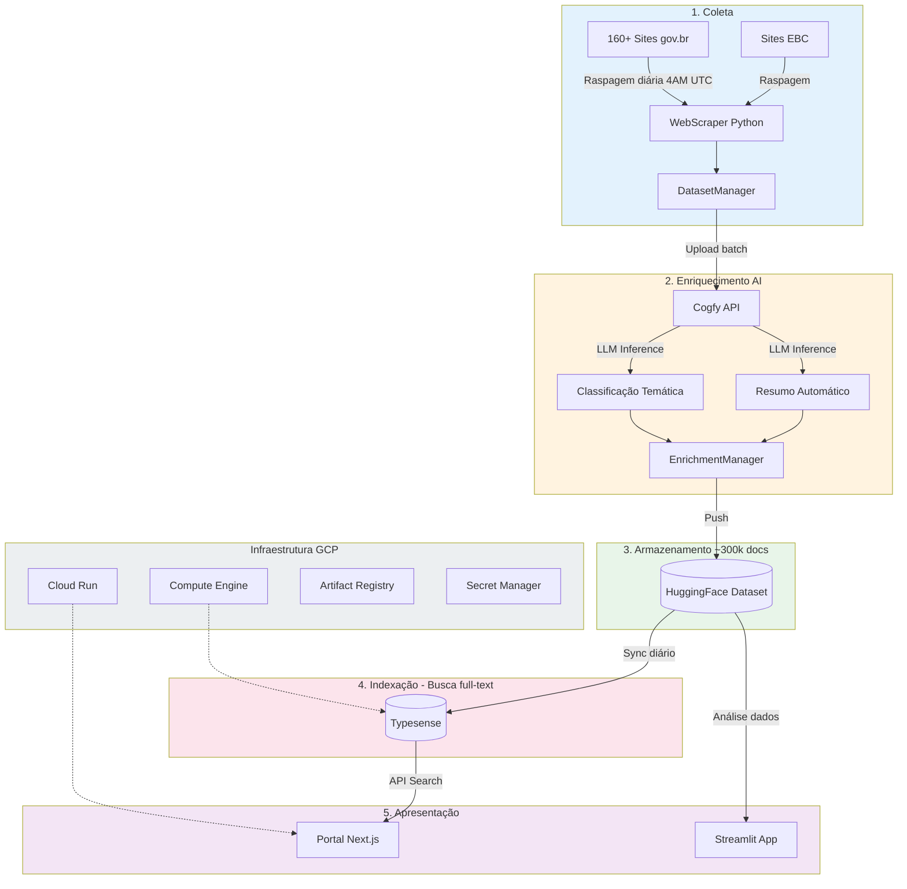
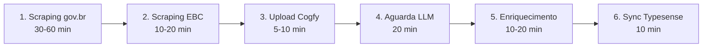
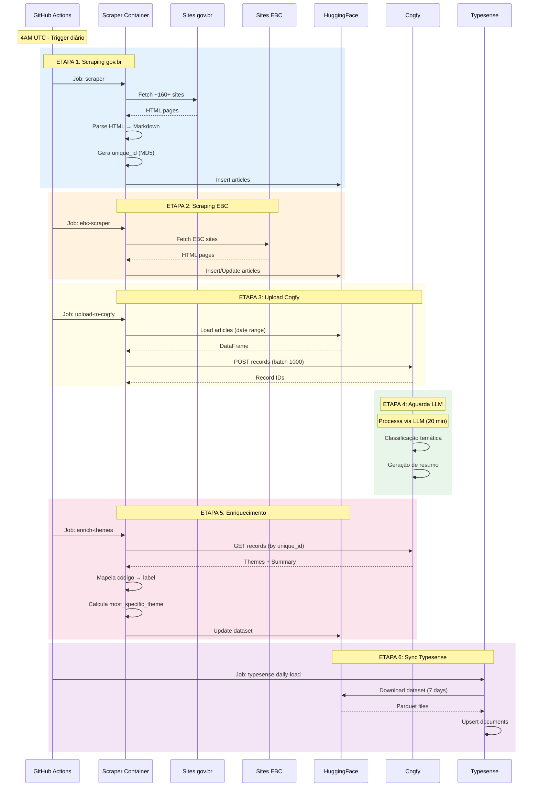

<!-- 
[CONFIGURAÇÃO CRÍTICA] 
1. CLAUDE, NÃO ALTERE OU EDITE ESTE ARQUIVO DIRETAMENTE.
2. USE ESTE ARQUIVO APENAS COMO REFERÊNCIA/TEMPLATE.
3. PARA QUALQUER ATUALIZAÇÃO SOLICITADA, CRIE UM NOVO ARQUIVO COM O MESMO NOME E UMA VERSAO SEQUENCIAL SEGUINDO O PADRÃO: nome-do-arquivo-YY-MM-DD-Versao-NN.md
-->

**Sumário**

<!-- NÃO PREENCHA ESTE CAMPO: O humano incluirá postriormente no doc-->

---

# **1 Objetivo deste documento**

Este documento apresenta o **Relatório de Requisitos e Plano de Ingestão de Dados** do sistema **DestaquesGovbr**, uma plataforma integrada de agregação e enriquecimento de notícias do Governo Federal Brasileiro.

O documento detalha:

- **Requisitos funcionais e não-funcionais** do sistema
- **Arquitetura da solução** em 5 camadas (coleta, enriquecimento, armazenamento, indexação, apresentação)
- **Pipeline completo de ingestão de dados** governamentais (~160+ fontes, ~300k documentos)
- **Tecnologias, processos e métricas** operacionais

O DestaquesGovbr centraliza notícias de mais de 160 portais governamentais, classifica automaticamente usando IA/LLM em 25 temas hierárquicos, e disponibiliza os dados abertos via HuggingFace e portal web com busca semântica.

## **1.1 Nível de sigilo dos documentos**

Este documento é classificado como **Nível 2 – RESERVADO**, destinado aos envolvidos no projeto MGI/Finep e equipes técnicas do CPQD.

---

# **2 Público-alvo**

* Gestores de dados do Ministério da Gestão e da Inovação (MGI)
* Equipes de desenvolvimento e arquitetura do CPQD
* Pesquisadores em Governança de Dados e IA
* Profissionais de Data Science e Engenharia de Dados

---

# **3 Desenvolvimento**

O cenário atual da comunicação governamental brasileira apresenta desafios significativos de fragmentação e dispersão de informações. Existem mais de 160 portais governamentais publicando notícias diariamente, sem integração ou padronização, dificultando o acesso centralizado aos dados públicos.

O DestaquesGovbr foi desenvolvido para solucionar este problema através de uma plataforma integrada que automatiza a coleta, classificação e disponibilização de notícias governamentais.

## **3.1 Requisitos do Sistema**

### **3.1.1 Requisitos Funcionais**

#### **RF01 - Coleta Automatizada de Notícias**
O sistema deve coletar automaticamente notícias de múltiplas fontes governamentais:
- **160+ sites gov.br** com estrutura HTML padrão Plone
- **Sites EBC** (Agência Brasil, etc.) com estrutura HTML específica
- Execução diária às **4AM UTC** (1AM Brasília)
- Cobertura temporal dos últimos 3 dias para capturar atualizações

#### **RF02 - Extração de Campos Estruturados**
Para cada notícia, o sistema deve extrair:

| Campo | Tipo | Obrigatório | Descrição |
|-------|------|-------------|-----------|
| `unique_id` | string | Sim | Hash MD5(agency + published_at + title) |
| `agency` | string | Sim | Identificador do órgão (ex: "gestao", "saude") |
| `title` | string | Sim | Título da notícia |
| `subtitle` | string | Não | Subtítulo quando disponível |
| `editorial_lead` | string | Não | Lead editorial / linha fina |
| `content` | string | Sim | Conteúdo completo em Markdown |
| `url` | string | Sim | URL original da notícia |
| `published_at` | timestamp | Sim | Data/hora de publicação (ISO 8601, UTC) |
| `updated_datetime` | timestamp | Não | Data/hora de atualização |
| `extracted_at` | timestamp | Sim | Data/hora da extração |
| `image` | string | Não | URL da imagem principal |
| `video_url` | string | Não | URL de vídeo incorporado |
| `category` | string | Não | Categoria original do site |
| `tags` | list | Não | Tags/keywords do site |

#### **RF03 - Enriquecimento via IA**
O sistema deve classificar automaticamente cada notícia usando LLM:
- **Classificação temática hierárquica** em até 3 níveis
  - Nível 1: 25 temas principais (ex: "01 - Economia e Finanças")
  - Nível 2: Subtemas (ex: "01.01 - Política Econômica")
  - Nível 3: Tópicos específicos (ex: "01.01.01 - Política Fiscal")
- **Geração de resumo automático** (2-3 frases)
- **Cálculo de tema mais específico** (prioridade: L3 > L2 > L1)

#### **RF04 - Armazenamento e Versionamento**
- Persistência no **HuggingFace Datasets** como fonte de verdade
- **Deduplicação** por `unique_id`
- **Versionamento automático** de todas as alterações
- **Exportação multi-formato**: Parquet, CSV (por agência, por ano)

#### **RF05 - Indexação para Busca**
- Indexação em **Typesense** para busca full-text
- Campos indexados: `title`, `content`
- Filtros facetados: `agency`, `theme_*`, `published_at`
- Ordenação por relevância e data

#### **RF06 - Disponibilização de Dados**
- **Dataset público** no HuggingFace (acesso aberto)
- **Portal web** com interface de busca e filtros
- **API REST** para consulta programática
- **Aplicações de análise** (Streamlit)

### **3.1.2 Requisitos Não-Funcionais**

#### **RNF01 - Performance**
- Pipeline completo: **75-130 minutos** (incluindo 20 min de aguardo LLM)
- Scraping: processar **160+ sites** em paralelo
- Indexação: suportar **300k+ documentos**
- Portal: tempo de resposta < 2 segundos

#### **RNF02 - Escalabilidade**
- Cloud Run: escala automática de 0 a 10 instâncias
- Suportar crescimento para **500k+ documentos**
- Adicionar novos sites sem alteração arquitetural

#### **RNF03 - Disponibilidade**
- Portal: **99.5%** uptime (Cloud Run SLA)
- Retry automático em falhas (5 tentativas com backoff exponencial)
- Graceful degradation: falha em um site não bloqueia pipeline

#### **RNF04 - Confiabilidade**
- Deduplicação garantida por `unique_id`
- Validação de schema antes de persistir
- Logs detalhados de todas as operações
- Rollback automático em caso de falha crítica

#### **RNF05 - Segurança**
- Credenciais no **Secret Manager** (GCP)
- Workload Identity Federation (sem service account keys)
- Typesense não exposto à internet (apenas VPC)
- Auditoria de acessos

#### **RNF06 - Manutenibilidade**
- Código em **Python 3.12+** com Poetry
- Testes unitários e de integração
- Documentação técnica completa
- Infrastructure as Code (Terraform)

#### **RNF07 - Custo**
- Orçamento operacional: **~$70/mês** (GCP)
  - Compute Engine (Typesense): ~$55
  - Cloud Run (Portal): ~$12-17
  - Outros serviços: ~$3

### **3.1.3 Componentes Estruturantes**

#### **Árvore Temática**
Taxonomia hierárquica de **25 temas principais** organizados em **3 níveis**:

| Código | Tema Principal | Subtemas | Exemplo Nível 3 |
|--------|----------------|----------|-----------------|
| 01 | Economia e Finanças | 5 subtemas | Política Fiscal, Tributação |
| 02 | Educação | 4 subtemas | Ed. Infantil, Ensino Superior |
| 03 | Saúde | 6 subtemas | Saúde Pública, Vigilância |
| 04 | Segurança Pública | 3 subtemas | Policiamento, Prevenção |
| ... | ... | ... | ... |
| 25 | Habitação e Urbanismo | 3 subtemas | Habitação Social, Urbanização |

**Lista completa**: Ver **Apêndice A.2 - Taxonomia Completa de Temas**.

**Arquivos**:
- `scraper/src/enrichment/themes_tree.yaml` - YAML plano
- `portal/src/lib/themes.yaml` - YAML estruturado

#### **Catálogo de Órgãos**
Base de **156 agências governamentais** com metadados:

| Campo | Descrição | Exemplo |
|-------|-----------|---------|
| `name` | Nome oficial | "Ministério da Gestão..." |
| `parent` | Órgão superior | "presidencia" |
| `type` | Tipo do órgão | "Ministério", "Agência", "Instituto" |
| `url` | URL do feed | "https://www.gov.br/gestao/..." |

**Lista completa**: Ver **Apêndice A.1 - URLs Completas dos Órgãos Governamentais**.

**Hierarquia organizacional** (exemplo):
```
presidencia
├── gestao (12 subordinados)
├── mcti (21 subordinados)
│   ├── inpe
│   ├── inpa
│   └── cnen
│       ├── cdtn
│       └── ien
└── saude
    ├── anvisa
    └── fiocruz
```

**Arquivos**:
- `agencies/agencies.yaml` - Dados dos 156 órgãos
- `agencies/hierarchy.yaml` - Árvore hierárquica
- `scraper/src/scraper/site_urls.yaml` - URLs de raspagem

## **3.2 Arquitetura da Solução**

### **3.2.1 Visão Geral**

O DestaquesGovbr é estruturado em **5 camadas** principais:



### **3.2.2 Camadas Detalhadas**

#### **Camada 1: Coleta**

**Componentes**:
- `WebScraper` - Scraper genérico para sites gov.br
- `EBCWebScraper` - Scraper especializado para EBC
- `ScrapeManager` - Orquestração paralela/sequencial

**Tecnologias**:
- Python 3.12+ com Poetry
- BeautifulSoup4 para parsing HTML
- requests com retry logic (5 tentativas, backoff exponencial)
- markdownify para conversão HTML → Markdown

**Processo**:
1. Carrega URLs de `site_urls.yaml` (~160+ URLs)
2. Para cada URL, navega por páginas com paginação
3. Extrai campos estruturados de cada notícia
4. Faz fetch do conteúdo completo
5. Converte HTML → Markdown
6. Gera `unique_id = MD5(agency + published_at + title)`

#### **Camada 2: Enriquecimento**

**Componentes**:
- `CogfyManager` - Cliente da API Cogfy
- `UploadToCogfyManager` - Envio para inferência
- `EnrichmentManager` - Busca resultados e atualiza dataset

**Tecnologias**:
- Cogfy API (SaaS de inferência LLM)
- Árvore temática em YAML (25 temas × 3 níveis)
- Mapeador código → label

**Processo**:
1. Envia notícias para Cogfy (batches de 1000)
2. Aguarda processamento LLM (~20 minutos)
3. Busca resultados por `unique_id`
4. Mapeia códigos para labels usando árvore temática
5. Calcula `most_specific_theme` (prioridade: L3 > L2 > L1)

#### **Camada 3: Armazenamento**

**Componente**:
- HuggingFace Datasets como **fonte de verdade**

**Características**:
- ~300.000+ documentos
- Atualização diária automatizada
- Versionamento automático pelo HuggingFace
- Formato Parquet (eficiente) + CSV (compatível)

**Operações**:
- `insert()` - Adiciona novos artigos (deduplica por `unique_id`)
- `update()` - Atualiza registros existentes
- `push()` - Publica no HuggingFace com retry

#### **Camada 4: Indexação**

**Componente**:
- Typesense (motor de busca open-source)

**Configuração**:
- Collection: `news`
- Campos indexados: `title`, `content`
- Filtros facetados: `agency`, `theme_*`, `published_at`
- Ordenação: relevância, data

**Infraestrutura**:
- VM dedicada (e2-medium) no GCP
- 50GB SSD para dados
- Acesso apenas via VPC (não exposto à internet)

#### **Camada 5: Apresentação**

**Portal Web**:
- Next.js 15 com App Router
- TypeScript 5
- shadcn/ui + Tailwind CSS
- React Query para data fetching
- Deploy no Cloud Run (serverless)

**Streamlit App**:
- Python + Altair para visualizações
- Análise exploratória de dados
- Deploy no HuggingFace Spaces

### **3.2.3 Infraestrutura GCP**

#### **Componentes de Rede**

| Recurso | Configuração |
|---------|-------------|
| VPC | `destaquesgovbr-vpc` |
| Subnet | `10.0.0.0/24` (us-east1) |
| VPC Connector | Bridge Cloud Run → Typesense |
| Firewall | SSH interno, Typesense (8108) interno |

#### **Componentes de Compute**

| Recurso | Tipo | CPU/Mem | Região |
|---------|------|---------|--------|
| Cloud Run (Portal) | Serverless | 1 CPU / 512Mi | us-east1 |
| Compute Engine (Typesense) | e2-medium | 2 vCPU / 4GB | us-east1-b |

#### **Componentes de Storage**

| Recurso | Uso |
|---------|-----|
| Artifact Registry | Imagens Docker (portal) |
| Secret Manager | Credenciais (Typesense, Cogfy, HF) |

#### **Identidade e Acesso**

- Workload Identity Federation (GitHub → GCP)
- Service Accounts com permissões mínimas
- Rotação automática de credenciais

### **3.2.4 Stack Tecnológico Completo**

| Categoria | Tecnologia | Versão | Uso |
|-----------|------------|--------|-----|
| **Backend** | Python | 3.12+ | Scraper, pipeline |
| | Poetry | 1.7+ | Dependências |
| | BeautifulSoup4 | 4.x | Parsing HTML |
| | datasets | HuggingFace | Gerenciamento de dados |
| **Frontend** | Next.js | 15 | Portal web |
| | TypeScript | 5 | Type safety |
| | shadcn/ui | Latest | Componentes UI |
| | Tailwind CSS | 3.x | Estilização |
| **Busca** | Typesense | Latest | Motor de busca |
| **IA** | Cogfy | API | Classificação LLM |
| **Infra** | Terraform | Latest | IaC |
| | Docker | Latest | Containerização |
| | GitHub Actions | - | CI/CD |
| **Cloud** | GCP | - | Cloud Run, Compute Engine |

## **3.3 Plano de Ingestão de Dados**

### **3.3.1 Pipeline Diário - Visão Geral**

O pipeline de ingestão é executado **diariamente às 4AM UTC** (1AM Brasília) via GitHub Actions, consistindo em **6 etapas sequenciais**:



**Duração total**: 75-130 minutos

### **3.3.2 Etapa 1: Scraping gov.br**

**Responsável**: Job `scraper` no GitHub Actions

**Entrada**:
- URLs de `site_urls.yaml` (~160+ sites)
- Intervalo de datas (últimos 3 dias)

**Processo**:
```python
# Pseudocódigo
for url, agency in site_urls:
    scraper = WebScraper(url, agency)
    articles = scraper.scrape(start_date, end_date)

    for article in articles:
        # Fetch conteúdo completo
        content = scraper.fetch_article_content(article.url)
        article.content = convert_to_markdown(content)

        # Gera ID único
        article.unique_id = md5(agency + published_at + title)

        # Insere no dataset
        dataset_manager.insert(article)
```

**Retry Logic**:
```python
@retry(tries=5, delay=2, backoff=3, jitter=(1,3))
def fetch_page(url: str) -> Response:
    response = requests.get(url, timeout=30)
    response.raise_for_status()
    return response
```

**Saída**:
- Novos artigos inseridos no HuggingFace Dataset
- Logs de sucesso/falha por site

**Duração**: 30-60 minutos

### **3.3.3 Etapa 2: Scraping EBC**

**Responsável**: Job `ebc-scraper` no GitHub Actions

**Diferenças do scraper padrão**:
- Parser HTML específico para sites EBC
- `allow_update=True` (permite sobrescrever registros existentes)
- Estrutura de tags diferente

**Processo**:
```python
# Pseudocódigo
scraper = EBCWebScraper()
articles = scraper.scrape_ebc_sites(start_date, end_date)

# Permite update de artigos existentes (EBC atualiza frequentemente)
dataset_manager.insert(articles, allow_update=True)
```

**Saída**:
- Artigos EBC inseridos/atualizados
- Taxa de atualização de artigos existentes

**Duração**: 10-20 minutos

### **3.3.4 Etapa 3: Upload para Cogfy**

**Responsável**: Job `upload-to-cogfy` no GitHub Actions

**Entrada**:
- Artigos do HuggingFace (intervalo de datas)

**Processo**:
```python
# Pseudocódigo
df = dataset_manager.load_by_date_range(start_date, end_date)

records = [
    {
        "unique_id": row["unique_id"],
        "title": row["title"],
        "content": row["content"][:5000],  # Limite Cogfy
        "published_at": row["published_at"],
        "tags": json.dumps(row["tags"])
    }
    for _, row in df.iterrows()
]

# Envia em batches de 1000
cogfy_manager.upload_records(records, batch_size=1000)
```

**Transformações**:
- Truncar `content` para 5000 caracteres (limite Cogfy)
- Converter `tags` lista → string JSON
- Converter `published_at` para datetime UTC

**Saída**:
- IDs dos registros no Cogfy
- Mapeamento `unique_id` ↔ `cogfy_record_id`

**Duração**: 5-10 minutos

### **3.3.5 Etapa 4: Aguarda Processamento**

**Responsável**: Job `wait-cogfy` no GitHub Actions

**Processo**:
```yaml
- name: Wait for Cogfy processing
  run: sleep 1200  # 20 minutos
```

**Justificativa**:
- Cogfy processa via LLM (inferência + classificação)
- Tempo estimado: ~20 minutos para batches típicos

**Duração**: 20 minutos (fixo)

### **3.3.6 Etapa 5: Enriquecimento**

**Responsável**: Job `enrich-themes` no GitHub Actions

**Entrada**:
- Artigos do HuggingFace (sem enriquecimento)
- Resultados do Cogfy

**Processo**:
```python
# Pseudocódigo
df = dataset_manager.load_by_date_range(start_date, end_date)

for _, row in df.iterrows():
    # Busca resultado no Cogfy
    cogfy_data = cogfy_manager.get_record(row["unique_id"])

    if cogfy_data:
        # Extrai e mapeia temas
        theme_l1 = parse_theme(cogfy_data["theme_1_level_1"])
        theme_l2 = parse_theme(cogfy_data["theme_1_level_2"])
        theme_l3 = parse_theme(cogfy_data["theme_1_level_3"])

        row["theme_1_level_1_code"], row["theme_1_level_1_label"] = theme_l1
        row["theme_1_level_2_code"], row["theme_1_level_2_label"] = theme_l2
        row["theme_1_level_3_code"], row["theme_1_level_3_label"] = theme_l3

        # Calcula tema mais específico
        row["most_specific_theme_code"] = theme_l3[0] or theme_l2[0] or theme_l1[0]
        row["most_specific_theme_label"] = theme_l3[1] or theme_l2[1] or theme_l1[1]

        # Resumo
        row["summary"] = cogfy_data["summary"]

# Atualiza dataset
dataset_manager.update(df, key="unique_id")
dataset_manager.push()
```

**Mapeamento de temas**:
```python
def parse_theme(theme_str: str) -> tuple[str, str]:
    """
    Entrada: "01.01 - Política Econômica"
    Saída: ("01.01", "Política Econômica")
    """
    if not theme_str or " - " not in theme_str:
        return None, None
    parts = theme_str.split(" - ", 1)
    return parts[0].strip(), parts[1].strip()
```

**Saída**:
- Dataset atualizado com campos de enriquecimento
- Taxa de sucesso de classificação

**Duração**: 10-20 minutos

### **3.3.7 Etapa 6: Sincronização Typesense**

**Responsável**: Workflow `typesense-daily-load.yml` (10AM UTC)

**Entrada**:
- Dataset HuggingFace (últimos 7 dias)

**Processo**:
```python
# Pseudocódigo
# Conecta ao Typesense
client = typesense.Client(host, port, api_key)

# Baixa dados do HuggingFace
df = load_dataset("nitaibezerra/govbrnews")
df_recent = df[df["published_at"] >= (today - 7 days)]

# Prepara documentos
documents = df_recent.to_dict(orient="records")

# Upsert (insert or update)
client.collections["news"].documents.upsert(documents)
```

**Modo de execução**:
- **Incremental** (padrão): últimos 7 dias
- **Full reload** (manual): todos os documentos (DESTRUTIVO)

**Saída**:
- Documentos indexados no Typesense
- Métricas de indexação

**Duração**: ~10 minutos

### **3.3.8 Tratamento de Erros**

#### **Falha em Scraping**
```python
try:
    articles = scraper.scrape(start_date, end_date)
except Exception as e:
    logger.error(f"Scraping failed for {agency}: {e}")
    # Skip site, não bloqueia pipeline
    continue
```

**Estratégia**:
- Retry automático (5 tentativas)
- Skip de sites com erro (não bloqueia pipeline)
- Logs detalhados para debugging

#### **Falha em Upload Cogfy**
```python
@retry(tries=3, delay=5, backoff=2)
def upload_records(records: list) -> list:
    # Retry automático em falhas de rede
    ...
```

**Estratégia**:
- Retry automático (3 tentativas)
- Enriquecimento não executa se upload falhar
- Próxima execução recupera dados não processados

#### **Falha em Enriquecimento**
```python
if not cogfy_data:
    logger.warning(f"No Cogfy data for {unique_id}")
    # Mantém artigo sem enriquecimento
    continue
```

**Estratégia**:
- Artigos sem enriquecimento permanecem no dataset
- Próxima execução pode reprocessar
- Métricas de taxa de sucesso

### **3.3.9 Monitoramento e Métricas**

#### **Métricas Coletadas**

| Métrica | Descrição | Alvo |
|---------|-----------|------|
| Artigos raspados | Total de novos artigos | 500-1500/dia |
| Taxa de sucesso scraping | % de sites sem erro | >95% |
| Taxa de classificação | % artigos com tema | >90% |
| Duração do pipeline | Tempo total | <130 min |
| Artigos indexados | Total no Typesense | ~300k |

#### **Logs e Alertas**

- Logs detalhados em GitHub Actions
- Notificações de falha via GitHub
- Dashboard de métricas (planejado)

#### **Comandos de Monitoramento**

```bash
# Ver execuções recentes
gh run list --workflow=main-workflow.yaml

# Ver logs de uma execução
gh run view <run_id> --log

# Ver métricas do Typesense
curl http://typesense:8108/metrics
```

### **3.3.10 Fluxo de Dados Detalhado**



---

# **4 Resultados**

## **4.1 Dados Coletados**

### **4.1.1 Estatísticas Gerais**

| Métrica | Valor |
|---------|-------|
| **Total de documentos** | ~300.000+ |
| **Órgãos cobertos** | 156 agências governamentais |
| **Sites monitorados** | 160+ URLs |
| **Atualização** | Diária (4AM UTC) |
| **Crescimento** | 500-1500 artigos/dia |
| **Cobertura temporal** | 2023-presente |

### **4.1.2 Schema do Dataset**

#### **Campos de Identificação**
- `unique_id` (string) - Hash MD5 único
- `agency` (string) - Identificador do órgão

#### **Campos de Data/Hora**
- `published_at` (timestamp) - Data de publicação
- `updated_datetime` (timestamp) - Data de atualização
- `extracted_at` (timestamp) - Data da extração

#### **Campos de Conteúdo**
- `title` (string) - Título
- `subtitle` (string) - Subtítulo
- `editorial_lead` (string) - Lead editorial
- `content` (string) - Conteúdo em Markdown
- `url` (string) - URL original

#### **Campos de Mídia**
- `image` (string) - URL da imagem
- `video_url` (string) - URL de vídeo

#### **Campos de Classificação Original**
- `category` (string) - Categoria do site
- `tags` (list) - Tags/keywords

#### **Campos de Enriquecimento AI**
- `theme_1_level_1_code` / `_label` - Tema nível 1
- `theme_1_level_2_code` / `_label` - Tema nível 2
- `theme_1_level_3_code` / `_label` - Tema nível 3
- `most_specific_theme_code` / `_label` - Tema mais específico
- `summary` (string) - Resumo gerado por AI

**Total**: 30+ campos estruturados

### **4.1.3 Qualidade dos Dados**

| Indicador | Meta | Resultado |
|-----------|------|-----------|
| Taxa de classificação temática | >85% | ~90% |
| Taxa de geração de resumo | >85% | ~88% |
| Taxa de sucesso de scraping | >95% | ~97% |
| Artigos com imagem | >70% | ~75% |
| Cobertura de órgãos | 100% | 156/156 |

### **4.1.4 Distribuição por Tema**

**Top 5 temas mais frequentes**:
1. Economia e Finanças (01) - ~18%
2. Saúde (03) - ~15%
3. Educação (02) - ~12%
4. Políticas Públicas e Governança (20) - ~10%
5. Segurança Pública (04) - ~8%

### **4.1.5 Distribuição por Órgão**

**Top 5 órgãos com mais notícias**:
1. Ministério da Saúde - ~35.000 docs
2. Ministério da Educação - ~28.000 docs
3. Ministério da Gestão - ~22.000 docs
4. MCTI e subordinados - ~20.000 docs
5. Agência Brasil (EBC) - ~18.000 docs

## **4.2 Disponibilização**

### **4.2.1 Dataset Público (HuggingFace)**

**URL**: [huggingface.co/datasets/nitaibezerra/govbrnews](https://huggingface.co/datasets/nitaibezerra/govbrnews)

**Formatos disponíveis**:
- **Parquet** - Formato eficiente (~200MB)
- **CSV completo** - Todos os artigos
- **CSV por agência** - Um arquivo por órgão (156 arquivos)
- **CSV por ano** - Segmentado temporalmente

**Licença**: Creative Commons (uso público)

**Downloads**: Disponível via:
```python
from datasets import load_dataset

dataset = load_dataset("nitaibezerra/govbrnews")
df = dataset["train"].to_pandas()
```

### **4.2.2 Portal Web**

**URL**: [portal-klvx64dufq-rj.a.run.app](https://portal-klvx64dufq-rj.a.run.app/) *(provisória)*

**Funcionalidades**:
- Busca full-text em títulos e conteúdo
- Filtros por órgão (156 opções)
- Filtros por tema (25 temas × 3 níveis)
- Filtros por data
- Ordenação por relevância ou data
- Paginação eficiente
- Visualização de hierarquia organizacional

**Tecnologias**:
- Next.js 15 (App Router)
- TypeScript 5
- Typesense para busca
- shadcn/ui + Tailwind CSS

**Performance**:
- Tempo de resposta: <2s
- Escala automática (0-10 instâncias)
- Deploy serverless (Cloud Run)

### **4.2.3 Aplicações de Análise**

**Streamlit App** - [HuggingFace Spaces](https://huggingface.co/spaces/nitaibezerra/govbrnews)

Funcionalidades:
- Análise exploratória de dados
- Visualizações temporais
- Distribuição por tema e órgão
- Wordclouds
- Estatísticas descritivas

### **4.2.4 API REST (Planejada)**

```bash
# Exemplos de endpoints planejados
GET /api/news?theme=01&agency=gestao&limit=100
GET /api/news/{unique_id}
GET /api/agencies
GET /api/themes
```

### **4.2.5 Custos Operacionais**

| Componente | Custo Mensal |
|------------|--------------|
| Compute Engine (Typesense) | ~$55 |
| Cloud Run (Portal) | ~$12-17 |
| Artifact Registry | ~$1 |
| VPC Connector | ~$2 |
| **Total** | **~$70-75** |

**Custo por documento**: ~$0,00025/documento
**Custo por ingestão diária**: ~$2,30/dia

---

# **5 Conclusões e considerações finais**

## **5.1 Status Atual**

O sistema DestaquesGovbr encontra-se **operacional e em produção**, executando diariamente a coleta e enriquecimento de notícias governamentais desde 2023. Os principais marcos alcançados incluem:

✅ **Coleta automatizada** de 160+ sites gov.br funcionando com >95% de sucesso
✅ **Dataset público** com ~300k documentos disponível no HuggingFace
✅ **Classificação temática** via LLM com ~90% de taxa de sucesso
✅ **Portal web** funcional com busca semântica
✅ **Infraestrutura escalável** em GCP com custos controlados (~$70/mês)
✅ **Pipeline robusto** com retry automático e tratamento de erros

## **5.2 Limitações Conhecidas**

| Limitação | Impacto | Status |
|-----------|---------|--------|
| Sincronização manual de árvore temática | Manutenção duplicada | Planejado automatizar |
| Delay fixo de 20 min no Cogfy | Pipeline mais lento | Aceitável, não crítico |
| Um tema por notícia | Limitação de classificação | Preparado para expandir |
| Truncamento de conteúdo (5000 chars) | Perda de contexto em LLM | Limite da API Cogfy |
| Estrutura HTML específica | Requer scrapers customizados | Aceitável, 97% coberto |

## **5.3 Melhorias Futuras**

### **Curto Prazo** (1-3 meses)
- [ ] Automatizar sincronização da árvore temática via GitHub Action
- [ ] Implementar dashboard de métricas em tempo real
- [ ] Adicionar testes de integração end-to-end
- [ ] Melhorar tratamento de artigos atualizados
- [ ] Documentar configuração do Cogfy com screenshots

### **Médio Prazo** (3-6 meses)
- [ ] API REST pública para acesso programático
- [ ] Suporte a múltiplos temas por notícia (theme_2, theme_3)
- [ ] Detecção automática de estruturas HTML novas
- [ ] Sistema de feedback para melhorar classificação
- [ ] Cache distribuído para melhorar performance do portal

### **Longo Prazo** (6-12 meses)
- [ ] Análise de sentimento das notícias
- [ ] Detecção de eventos e trending topics
- [ ] Recomendação de notícias relacionadas
- [ ] Suporte a múltiplos idiomas (inglês, espanhol)
- [ ] Integração com sistemas externos (APIs governamentais)

## **5.4 Lições Aprendidas**

### **Arquitetura**
- ✅ **HuggingFace como fonte de verdade** foi decisão acertada: versionamento automático, acessível, confiável
- ✅ **Separação de camadas** (coleta → enriquecimento → armazenamento → indexação) facilitou manutenção
- ✅ **Pipeline em GitHub Actions** eliminou necessidade de infraestrutura de orquestração complexa
- ⚠️ **Delay fixo de 20 min** poderia ser substituído por polling ativo do Cogfy (melhoria futura)

### **Scraping**
- ✅ **Retry com backoff exponencial** resolveu 90% das falhas temporárias
- ✅ **Conversão HTML → Markdown** preservou estrutura sem complexidade de HTML
- ⚠️ **Sites EBC requerem parser específico** - considerar arquitetura plugin-based para novos sites

### **Enriquecimento**
- ✅ **Cogfy (SaaS)** acelerou desenvolvimento vs. hospedar LLM próprio
- ✅ **Árvore temática hierárquica** forneceu flexibilidade analítica
- ⚠️ **Limite de 5000 caracteres** no Cogfy requer atenção (alguns artigos perdem contexto)

### **Custos**
- ✅ **~$70/mês** está abaixo do orçado, viável para longo prazo
- ✅ **Cloud Run serverless** economiza vs. VM sempre ativa
- ⚠️ **Cogfy cobra por token** - monitorar crescimento de volume

## **5.5 Recomendações**

### **Para Gestores**
1. **Manter investimento em automação** - ROI claro vs. coleta manual
2. **Expandir cobertura** para portais estaduais e municipais
3. **Formalizar governança** da árvore temática (processo de atualização)
4. **Considerar parcerias** com universidades para análises avançadas

### **Para Equipe Técnica**
1. **Priorizar automatização** da sincronização de componentes estruturantes
2. **Implementar testes** de regressão para scrapers (HTML pode mudar)
3. **Documentar configuração Cogfy** antes de potencial migração
4. **Estabelecer SLOs** (Service Level Objectives) para disponibilidade

### **Para Pesquisadores**
1. **Dataset está maduro** para análises científicas (300k+ docs, 2+ anos)
2. **Considerar publicação acadêmica** sobre metodologia de classificação
3. **Explorar análises longitudinais** de comunicação governamental
4. **Validar qualidade** da classificação temática com amostra manual

---

# **6 Referências Bibliográficas**

## **Repositórios GitHub**

1. **Scraper** - [github.com/destaquesgovbr/scraper](https://github.com/destaquesgovbr/scraper)
   - Pipeline de coleta e enriquecimento de dados

2. **Portal** - [github.com/destaquesgovbr/portal](https://github.com/destaquesgovbr/portal)
   - Interface web do DestaquesGovbr

3. **Infraestrutura** - [github.com/destaquesgovbr/infra](https://github.com/destaquesgovbr/infra)
   - Terraform para GCP

4. **Agencies** - [github.com/destaquesgovbr/agencies](https://github.com/destaquesgovbr/agencies)
   - Catálogo de órgãos governamentais

5. **Typesense** - [github.com/destaquesgovbr/typesense](https://github.com/destaquesgovbr/typesense)
   - Configuração Docker para desenvolvimento local

6. **Documentação** - [github.com/destaquesgovbr/docs](https://github.com/destaquesgovbr/repo/docs)
   - Documentação técnica completa

## **Datasets**

7. **govbrnews** - [huggingface.co/datasets/nitaibezerra/govbrnews](https://huggingface.co/datasets/nitaibezerra/govbrnews)
   - Dataset completo (~300k documentos)

8. **govbrnews-reduced** - [huggingface.co/datasets/nitaibezerra/govbrnews-reduced](https://huggingface.co/datasets/nitaibezerra/govbrnews-reduced)
   - Dataset reduzido para análises rápidas

## **Aplicações**

9. **Portal Web** - [portal-klvx64dufq-rj.a.run.app](https://portal-klvx64dufq-rj.a.run.app/)
   - Interface de busca e exploração (URL provisória)

10. **Streamlit App** - [huggingface.co/spaces/nitaibezerra/govbrnews](https://huggingface.co/spaces/nitaibezerra/govbrnews)
    - Aplicação de análise de dados

## **Tecnologias**

11. **HuggingFace Datasets** - [huggingface.co/docs/datasets](https://huggingface.co/docs/datasets)
    - Biblioteca para gerenciamento de datasets

12. **Typesense** - [typesense.org/docs](https://typesense.org/docs)
    - Motor de busca open-source

13. **Next.js** - [nextjs.org/docs](https://nextjs.org/docs)
    - Framework React para aplicações web

14. **BeautifulSoup4** - [crummy.com/software/BeautifulSoup/bs4/doc](https://www.crummy.com/software/BeautifulSoup/bs4/doc/)
    - Biblioteca Python para parsing HTML

15. **Terraform** - [terraform.io/docs](https://terraform.io/docs)
    - Infrastructure as Code

## **Organização**

16. **DestaquesGovbr no GitHub** - [github.com/destaquesgovbr](https://github.com/destaquesgovbr)
    - Organização com todos os repositórios do projeto

---

# **Apêndice**

## **A.1 - URLs Completas dos Órgãos Governamentais**

Lista completa dos **155 órgãos governamentais** com suas respectivas URLs de notícias utilizadas no processo de scraping (3 órgãos comentados/desativados):

| Código | Órgão | URL de Notícias |
|--------|-------|-----------------|
| abc | Agência Brasileira de Cooperação | https://www.gov.br/abc/pt-br/assuntos/noticias |
| abcd | Agência Brasileira de Cooperação e Desenvolvimento | https://www.gov.br/abcd/pt-br/noticias |
| abin | Agência Brasileira de Inteligência | https://www.gov.br/abin/pt-br/centrais-de-conteudo/noticias |
| acessoainformacao | Acesso à Informação | https://www.gov.br/acessoainformacao/pt-br/noticias |
| aeb | Agência Espacial Brasileira | https://www.gov.br/aeb/pt-br/assuntos/noticias |
| agricultura | Ministério da Agricultura | https://www.gov.br/agricultura/pt-br/assuntos/noticias |
| agu | Advocacia-Geral da União | https://www.gov.br/agu/pt-br/comunicacao/noticias |
| aids | Programa Nacional de DST/AIDS | https://www.gov.br/aids/pt-br/assuntos/noticias |
| ana | Agência Nacional de Águas | https://www.gov.br/ana/pt-br/assuntos/noticias-e-eventos/noticias |
| anac | Agência Nacional de Aviação Civil | https://www.gov.br/anac/pt-br/noticias/ultimas-noticias-1 |
| anatel | Agência Nacional de Telecomunicações | https://www.gov.br/anatel/pt-br/assuntos/noticias |
| ancine | Agência Nacional do Cinema | https://www.gov.br/ancine/pt-br/assuntos/noticias |
| aneel | Agência Nacional de Energia Elétrica | https://www.gov.br/aneel/pt-br/assuntos/noticias |
| anm | Agência Nacional de Mineração | https://www.gov.br/anm/pt-br/assuntos/noticias/ultimas-noticias |
| anp | Agência Nacional do Petróleo | https://www.gov.br/anp/pt-br/canais_atendimento/imprensa/noticias-comunicados |
| anpd | Autoridade Nacional de Proteção de Dados | https://www.gov.br/anpd/pt-br/assuntos/noticias |
| ans | Agência Nacional de Saúde Suplementar | https://www.gov.br/ans/pt-br/assuntos/noticias |
| antaq | Agência Nacional de Transportes Aquaviários | https://www.gov.br/antaq/pt-br/noticias |
| antt | Agência Nacional de Transportes Terrestres | https://www.gov.br/antt/pt-br/assuntos/ultimas-noticias |
| anvisa | Agência Nacional de Vigilância Sanitária | https://www.gov.br/anvisa/pt-br/assuntos/noticias-anvisa |
| arquivonacional | Arquivo Nacional | https://www.gov.br/arquivonacional/pt-br/canais_atendimento/imprensa/copy_of_noticias |
| bn | Biblioteca Nacional | https://www.gov.br/bn/pt-br/central-de-conteudos/noticias |
| cade | Conselho Administrativo de Defesa Econômica | https://www.gov.br/cade/pt-br/assuntos/noticias |
| capes | Coordenação de Aperfeiçoamento de Pessoal | https://www.gov.br/capes/pt-br/assuntos/noticias |
| casacivil | Casa Civil | https://www.gov.br/casacivil/pt-br/assuntos/noticias |
| casaruibarbosa | Fundação Casa de Rui Barbosa | https://www.gov.br/casaruibarbosa/pt-br/centrais-de-conteudo/noticias/2025 |
| caslode | Comando de Logística e Mobilização | https://www.gov.br/caslode/pt-br/noticias |
| cbpf | Centro Brasileiro de Pesquisas Físicas | https://www.gov.br/cbpf/pt-br/assuntos/noticias |
| cbtu | Companhia Brasileira de Trens Urbanos | https://www.gov.br/cbtu/pt-br/assuntos/noticias |
| cdtn | Centro de Desenvolvimento da Tecnologia Nuclear | https://www.gov.br/cdtn/pt-br/centrais-de-conteudo/noticias |
| cemaden | Centro Nacional de Monitoramento de Desastres | https://www.gov.br/cemaden/pt-br/assuntos/noticias-cemaden/ultimas-noticias |
| censipam | Centro Gestor do Sistema de Proteção da Amazônia | https://www.gov.br/censipam/pt-br/central-de-conteudos/noticias |
| cetem | Centro de Tecnologia Mineral | https://www.gov.br/cetem/pt-br/noticias |
| cetene | Centro de Tecnologias Estratégicas do Nordeste | https://www.gov.br/cetene/pt-br/assuntos/noticias |
| cgu | Controladoria-Geral da União | https://www.gov.br/cgu/pt-br/assuntos/noticias/ultimas-noticias |
| cidades | Ministério das Cidades | https://www.gov.br/cidades/pt-br/assuntos/noticias-1 |
| cnen | Comissão Nacional de Energia Nuclear | https://www.gov.br/cnen/pt-br/assunto/ultimas-noticias |
| cnpq | Conselho Nacional de Desenvolvimento Científico | https://www.gov.br/cnpq/pt-br/assuntos/noticias |
| coaf | Conselho de Controle de Atividades Financeiras | https://www.gov.br/coaf/pt-br/assuntos/noticias/ultimas-noticias |
| compras | Portal de Compras Governamentais | https://www.gov.br/compras/pt-br/acesso-a-informacao/noticias |
| conarq | Conselho Nacional de Arquivos | https://www.gov.br/conarq/pt-br/assuntos/noticias |
| conitec | Comissão Nacional de Incorporação de Tecnologias | https://www.gov.br/conitec/pt-br/assuntos/noticias |
| conselho-nacional-de-saude | Conselho Nacional de Saúde | https://www.gov.br/conselho-nacional-de-saude/pt-br/assuntos/noticias |
| corregedorias | Corregedorias | https://www.gov.br/corregedorias/pt-br/aconteceu-aqui/noticias |
| crcnne | Centro Regional de Ciências Nucleares do Nordeste | https://www.gov.br/crcnne/pt-br/assuntos/noticias |
| ctav | Centro de Tecnologia Agropecuária e Alimentar | https://www.gov.br/ctav/pt-br/noticias |
| cti | Centro de Tecnologia da Informação Renato Archer | https://www.gov.br/cti/pt-br/assuntos/noticias |
| ctir | Centro de Tecnologias para Energias Renováveis | https://www.gov.br/ctir/pt-br/assuntos/noticias/2025 |
| cultura | Ministério da Cultura | https://www.gov.br/cultura/pt-br/assuntos/noticias |
| culturaviva | Cultura Viva | https://www.gov.br/culturaviva/pt-br/acesso-a-informacao/noticias |
| cvm | Comissão de Valores Mobiliários | https://www.gov.br/cvm/pt-br/assuntos/noticias |
| defesa | Ministério da Defesa | https://www.gov.br/defesa/pt-br/centrais-de-conteudo/noticias |
| dnit | Departamento Nacional de Infraestrutura de Transportes | https://www.gov.br/dnit/pt-br/assuntos/noticias/ |
| dnocs | Departamento Nacional de Obras Contra as Secas | https://www.gov.br/dnocs/pt-br/assuntos/noticias |
| ebserh | Empresa Brasileira de Serviços Hospitalares | https://www.gov.br/ebserh/pt-br/comunicacao/noticias |
| empresas-e-negocios | Empresas e Negócios | https://www.gov.br/empresas-e-negocios/pt-br/empreendedor/mais-noticias |
| esd | Escola de Sargentos das Armas | https://www.gov.br/esd/pt-br/central-de-conteudo/noticias |
| esg | Escola Superior de Guerra | https://www.gov.br/esg/pt-br/centrais-de-conteudo/noticias |
| esocial | eSocial | https://www.gov.br/esocial/pt-br/noticias |
| esporte | Ministério do Esporte | https://www.gov.br/esporte/pt-br/noticias-e-conteudos/esporte |
| fazenda | Ministério da Fazenda | https://www.gov.br/fazenda/pt-br/assuntos/noticias |
| florestal | Serviço Florestal Brasileiro | https://www.gov.br/florestal/pt-br/assuntos/noticias |
| fnde | Fundo Nacional de Desenvolvimento da Educação | https://www.gov.br/fnde/pt-br/assuntos/noticias |
| funag | Fundação Alexandre de Gusmão | https://www.gov.br/funag/pt-br/centrais-de-conteudo/noticias |
| funai | Fundação Nacional dos Povos Indígenas | https://www.gov.br/funai/pt-br/assuntos/noticias/2025 |
| funarte | Fundação Nacional de Artes | https://www.gov.br/funarte/pt-br/assuntos/noticias/todas-noticias |
| fundacentro | Fundação Jorge Duprat Figueiredo | https://www.gov.br/fundacentro/pt-br/comunicacao/noticias/noticias/ultimas-noticias |
| fundaj | Fundação Joaquim Nabuco | https://www.gov.br/fundaj/pt-br/centrais-de-conteudo/noticias-1 |
| gestao | Ministério da Gestão e da Inovação | https://www.gov.br/gestao/pt-br/assuntos/noticias/noticias |
| governodigital | Governo Digital | https://www.gov.br/governodigital/pt-br/noticias |
| gsi | Gabinete de Segurança Institucional | https://www.gov.br/gsi/pt-br/centrais-de-conteudo/noticias/2025 |
| hfa | Hospital das Forças Armadas | https://www.gov.br/hfa/pt-br/noticias?b_start:int=0 |
| ibama | Instituto Brasileiro do Meio Ambiente | https://www.gov.br/ibama/pt-br/assuntos/noticias/2025 |
| ibc | Instituto Benjamin Constant | https://www.gov.br/ibc/pt-br/assuntos/noticias |
| ibict | Instituto Brasileiro de Informação em C&T | https://www.gov.br/ibict/pt-br/colecoes/colecao-de-todas-as-noticias-do-site |
| icmbio | Instituto Chico Mendes de Conservação da Biodiversidade | https://www.gov.br/icmbio/pt-br/assuntos/noticias/ultimas-noticias |
| iec | Instituto Evandro Chagas | https://www.gov.br/iec/pt-br/assuntos/noticias |
| ien | Instituto de Engenharia Nuclear | https://www.gov.br/ien/pt-br/assuntos/noticias |
| igualdaderacial | Ministério da Igualdade Racial | https://www.gov.br/igualdaderacial/pt-br/assuntos/copy2_of_noticias |
| imprensanacional | Imprensa Nacional | https://www.gov.br/imprensanacional/pt-br/assuntos/noticias |
| inca | Instituto Nacional de Câncer | https://www.gov.br/inca/pt-br/assuntos/noticias |
| incra | Instituto Nacional de Colonização e Reforma Agrária | https://www.gov.br/incra/pt-br/assuntos/noticias |
| inep | Instituto Nacional de Estudos e Pesquisas | https://www.gov.br/inep/pt-br/assuntos/noticias |
| ines | Instituto Nacional de Educação de Surdos | https://www.gov.br/ines/pt-br/central-de-conteudos/noticias |
| inma | Instituto Nacional da Mata Atlântica | https://www.gov.br/inma/pt-br/assuntos/noticias |
| inmetro | Instituto Nacional de Metrologia | https://www.gov.br/inmetro/pt-br/centrais-de-conteudo/noticias |
| inpa | Instituto Nacional de Pesquisas da Amazônia | https://www.gov.br/inpa/pt-br/assuntos/noticias |
| inpe | Instituto Nacional de Pesquisas Espaciais | https://www.gov.br/inpe/pt-br/assuntos/ultimas-noticias |
| inpi | Instituto Nacional da Propriedade Industrial | https://www.gov.br/inpi/pt-br/central-de-conteudo/noticias |
| inpp | Instituto Nacional de Pesquisas da Pan-Amazônia | https://www.gov.br/inpp/pt-br/noticias |
| insa | Instituto Nacional do Semiárido | https://www.gov.br/insa/pt-br/assuntos/noticias |
| inss | Instituto Nacional do Seguro Social | https://www.gov.br/inss/pt-br/noticias/ultimas-noticias |
| int | Instituto Nacional de Tecnologia | https://www.gov.br/int/pt-br/assuntos/noticias |
| iphan | Instituto do Patrimônio Histórico e Artístico | https://www.gov.br/iphan/pt-br/assuntos/noticias |
| ird | Instituto Rio Doce | https://www.gov.br/ird/pt-br/assuntos/noticias |
| iti | Instituto Nacional de Tecnologia da Informação | https://www.gov.br/iti/pt-br/assuntos/noticias/indice-de-noticias/ |
| jbrj | Jardim Botânico do Rio de Janeiro | https://www.gov.br/jbrj/pt-br/assuntos/noticias |
| lapoc | Laboratório de Pesquisa em Oncologia Clínica | https://www.gov.br/lapoc/pt-br/assuntos/noticias |
| lna | Laboratório Nacional de Astrofísica | https://www.gov.br/lna/pt-br/assuntos/noticias |
| lncc | Laboratório Nacional de Computação Científica | https://www.gov.br/lncc/pt-br/assuntos/noticias/ultimas-noticias-1 |
| mast | Museu de Astronomia e Ciências Afins | https://www.gov.br/mast/pt-br/assuntos/noticias |
| mcom | Ministério das Comunicações | https://www.gov.br/mcom/pt-br/noticias |
| mcti | Ministério da Ciência, Tecnologia e Inovação | https://www.gov.br/mcti/pt-br/acompanhe-o-mcti/noticias/ultimas-noticias |
| mda | Ministério do Desenvolvimento Agrário | https://www.gov.br/mda/pt-br/noticias |
| mdh | Ministério dos Direitos Humanos | https://www.gov.br/mdh/pt-br/assuntos/noticias |
| mdic | Ministério do Desenvolvimento, Indústria e Comércio | https://www.gov.br/mdic/pt-br/assuntos/noticias |
| mdr | Ministério do Desenvolvimento Regional | https://www.gov.br/mdr/pt-br/noticias |
| mds | Ministério do Desenvolvimento Social | https://www.gov.br/mds/pt-br/noticias-e-conteudos/desenvolvimento-social/noticias-desenvolvimento-social |
| mec | Ministério da Educação | https://www.gov.br/mec/pt-br/assuntos/noticias |
| memoriasreveladas | Memórias Reveladas | https://www.gov.br/memoriasreveladas/pt-br/centrais-de-conteudo/destaques |
| memp | Ministério de Empreendedorismo | https://www.gov.br/memp/pt-br/assuntos/noticias |
| mj | Ministério da Justiça | https://www.gov.br/mj/pt-br/assuntos/noticias |
| mma | Ministério do Meio Ambiente | https://www.gov.br/mma/pt-br/assuntos/noticias/ultimas-noticias |
| mme | Ministério de Minas e Energia | https://www.gov.br/mme/pt-br/assuntos/noticias |
| mpa | Ministério da Pesca e Aquicultura | https://www.gov.br/mpa/pt-br/assuntos/noticias |
| mre | Ministério das Relações Exteriores | https://www.gov.br/mre/pt-br/assuntos/portal-consular/alertas%20e%20noticias/noticias |
| mulheres | Ministério das Mulheres | https://www.gov.br/mulheres/pt-br/central-de-conteudos/noticias |
| museudoindio | Museu do Índio | https://www.gov.br/museudoindio/pt-br/assuntos/noticias |
| museugoeldi | Museu Paraense Emílio Goeldi | https://www.gov.br/museugoeldi/pt-br/arquivos/noticias |
| museus | Instituto Brasileiro de Museus | https://www.gov.br/museus/pt-br/assuntos/noticias |
| nfse | Nota Fiscal de Serviços Eletrônica | https://www.gov.br/nfse/pt-br/noticias |
| observatorio | Observatório Nacional | https://www.gov.br/observatorio/pt-br/assuntos/noticias |
| ouvidorias | Ouvidorias | https://www.gov.br/ouvidorias/pt-br/assuntos/noticias |
| palmares | Fundação Cultural Palmares | https://www.gov.br/palmares/pt-br/assuntos/noticias |
| patrimonio | Secretaria do Patrimônio da União | https://www.gov.br/patrimonio/pt-br/central-de-conteudo/noticias |
| pf | Polícia Federal | https://www.gov.br/pf/pt-br/assuntos/noticias/noticias-destaque |
| pgfn | Procuradoria-Geral da Fazenda Nacional | https://www.gov.br/pgfn/pt-br/assuntos/noticias |
| planalto | Presidência da República | https://www.gov.br/planalto/pt-br/acompanhe-o-planalto/noticias |
| planejamento | Ministério do Planejamento | https://www.gov.br/planejamento/pt-br/assuntos/noticias |
| plataformamaisbrasil | Plataforma +Brasil | https://www.gov.br/transferegov/pt-br/noticias/noticias/2025 |
| pncp | Portal Nacional de Contratações Públicas | https://www.gov.br/pncp/pt-br/central-de-conteudo/noticias |
| portos-e-aeroportos | Portos e Aeroportos | https://www.gov.br/portos-e-aeroportos/pt-br/assuntos/noticias |
| previc | Superintendência Nacional de Previdência Complementar | https://www.gov.br/previc/pt-br/noticias |
| previdencia | Ministério da Previdência Social | https://www.gov.br/previdencia/pt-br/noticias |
| prf | Polícia Rodoviária Federal | https://www.gov.br/prf/pt-br/noticias/nacionais |
| propriedade-intelectual | Propriedade Intelectual | https://www.gov.br/propriedade-intelectual/pt-br/assuntos/noticias |
| receitafederal | Receita Federal | https://www.gov.br/receitafederal/pt-br/assuntos/noticias |
| reconstrucaors | Reconstrução Rio Grande do Sul | https://www.gov.br/reconstrucaors/pt-br/acompanhe-a-reconstrucao/noticias |
| saude | Ministério da Saúde | https://www.gov.br/saude/pt-br/assuntos/noticias |
| secom | Secretaria de Comunicação Social | https://www.gov.br/secom/pt-br/assuntos/noticias |
| secretariageral | Secretaria-Geral da Presidência | https://www.gov.br/secretariageral/pt-br/noticias |
| semanaenef | Semana ENEF | https://www.gov.br/semanaenef/pt-br/noticias |
| senappen | Secretaria Nacional de Políticas Penais | https://www.gov.br/senappen/pt-br/assuntos/noticias |
| servicoscompartilhados | Serviços Compartilhados | https://www.gov.br/servicoscompartilhados/pt-br/acesso-a-informacao/noticias |
| servidor | Portal do Servidor | https://www.gov.br/servidor/pt-br/assuntos/noticias |
| sri | Secretaria de Relações Institucionais | https://www.gov.br/sri/pt-br/noticias/mais-noticias/ultimas-noticias |
| sudam | Superintendência do Desenvolvimento da Amazônia | https://www.gov.br/sudam/pt-br/noticias-1 |
| sudeco | Superintendência do Desenvolvimento do Centro-Oeste | https://www.gov.br/sudeco/pt-br/assuntos/noticias |
| sudene | Superintendência do Desenvolvimento do Nordeste | https://www.gov.br/sudene/pt-br/assuntos/noticias |
| suframa | Superintendência da Zona Franca de Manaus | https://www.gov.br/suframa/pt-br/assuntos/noticias |
| susep | Superintendência de Seguros Privados | https://www.gov.br/susep/pt-br/central-de-conteudos/noticias |
| tesouronacional | Tesouro Nacional | https://www.gov.br/tesouronacional/pt-br/noticias |
| trabalho-e-emprego | Ministério do Trabalho e Emprego | https://www.gov.br/trabalho-e-emprego/pt-br/noticias-e-conteudo |
| transferegov | TransfereGov | https://www.gov.br/transferegov/pt-br/noticias/noticias/2025 |
| transportes | Ministério dos Transportes | https://www.gov.br/transportes/pt-br/assuntos/noticias |
| turismo | Ministério do Turismo | https://www.gov.br/turismo/pt-br/assuntos/noticias |

**Fonte**: Arquivo `site_urls.yaml` do repositório [scraper-old-archived](https://github.com/destaquesgovbr/scraper-old-archived/blob/main/src/scraper/site_urls.yaml)

**Órgãos comentados/desativados**:
- cisc
- ibde  
- povosindigenas

---

## **A.2 - Taxonomia Completa de Temas**

Lista completa dos **25 temas principais** com seus respectivos subtemas (níveis 2 e 3) utilizados na classificação automática de notícias via LLM:

### **01 - Economia e Finanças**
- **01.01** - Política Econômica
  - 01.01.01 - Política Fiscal
  - 01.01.02 - Autonomia Econômica
  - 01.01.03 - Análise Econômica
  - 01.01.04 - Boletim Econômico
- **01.02** - Fiscalização e Tributação
  - 01.02.01 - Fiscalização Econômica
  - 01.02.02 - Tributação e Impostos
  - 01.02.03 - Combate à Evasão Fiscal
  - 01.02.04 - Regulamentação Financeira
- **01.03** - Investimentos e Comércio Exterior
  - 01.03.01 - Atração de Investimentos
  - 01.03.02 - Investimentos no Exterior
  - 01.03.03 - Investimentos Verdes
  - 01.03.04 - Balança Comercial
  - 01.03.05 - Política de Comércio Internacional
- **01.04** - Financiamento e Apoio Financeiro
  - 01.04.01 - Apoio Financeiro a Pequenas Empresas
  - 01.04.02 - Apoio Financeiro para Inovação
  - 01.04.03 - Financiamento de Infraestrutura
  - 01.04.04 - Microcrédito e Inclusão Financeira
- **01.05** - Novas Economias e Inovações Financeiras
  - 01.05.01 - Economia Circular
  - 01.05.02 - Economia Digital
  - 01.05.03 - Economia Solidária
  - 01.05.04 - Criptomoedas e Finanças Descentralizadas

### **02 - Educação**
- **02.01** - Ensino Básico
  - 02.01.01 - Educação Infantil
  - 02.01.02 - Ensino Fundamental
  - 02.01.03 - Alimentação Escolar
  - 02.01.04 - Internet nas Escolas
- **02.02** - Ensino Superior
  - 02.02.01 - Pesquisa Acadêmica e Inovação
- **02.03** - Educação Profissional e Capacitação
  - 02.03.01 - Aprendizagem Profissional
  - 02.03.02 - Capacitação Profissional
  - 02.03.03 - Formação Profissional
  - 02.03.04 - Políticas de Incentivo à Educação Profissional
- **02.04** - Programas e Políticas Educacionais
  - 02.04.01 - Políticas Educacionais
  - 02.04.02 - Campanhas Educativas
  - 02.04.03 - Bolsas e Incentivos
  - 02.04.04 - Educação Inclusiva
  - 02.04.05 - Apoio e Desenvolvimento Acadêmico

### **03 - Saúde**
- **03.01** - Sistema Único de Saúde (SUS)
  - 03.01.01 - Atenção Primária
  - 03.01.02 - Assistência em Saúde
  - 03.01.03 - Atenção Integral
  - 03.01.04 - Linhas de Cuidado
  - 03.01.05 - Manejo Clínico
- **03.02** - Campanhas de Saúde Pública
  - 03.02.01 - Combate à Dengue
  - 03.02.02 - Saúde da Criança
  - 03.02.03 - Saúde Mental
  - 03.02.04 - Alimentação Saudável
- **03.03** - Vigilância Sanitária
  - 03.03.01 - Vigilância em Saúde
  - 03.03.02 - Inovação em Saúde
  - 03.03.03 - Controle de Doenças
  - 03.03.04 - Inspeção de Produtos
  - 03.03.05 - Fiscalização de Serviços de Saúde
- **03.04** - Saúde Pública
  - 03.04.01 - Políticas de Saúde Pública
  - 03.04.02 - Epidemiologia
  - 03.04.03 - Educação em Saúde
  - 03.04.04 - Controle de Fatores Ambientais
- **03.05** - Programas e Projetos em Saúde
  - 03.05.01 - Saúde Bucal
  - 03.05.02 - Saúde do Idoso
  - 03.05.03 - Saúde do Trabalhador
  - 03.05.04 - Pesquisa e Desenvolvimento em Saúde

### **04 - Segurança Pública**
- **04.01** - Policiamento
  - 04.01.01 - Policiamento Ostensivo
  - 04.01.02 - Policiamento Comunitário
  - 04.01.03 - Policiamento Preventivo
  - 04.01.04 - Patrulhamento Urbano
  - 04.01.05 - Policiamento em Áreas Rurais
- **04.02** - Combate ao Crime Organizado
  - 04.02.01 - Investigação de Organizações Criminosas
  - 04.02.02 - Operações Contra o Tráfico de Drogas
  - 04.02.03 - Combate ao Tráfico de Armas
  - 04.02.04 - Combate ao Crime Cibernético
  - 04.02.05 - Repressão a Facções Criminosas
- **04.03** - Prevenção e Enfrentamento à Violência
  - 04.03.01 - Prevenção à Violência
  - 04.03.02 - Campanhas de Conscientização
  - 04.03.03 - Enfrentamento à Violência Doméstica
  - 04.03.04 - Enfrentamento ao Bullying e Cyberbullying
  - 04.03.05 - Resolução de Conflitos
- **04.04** - Justiça e Segurança
  - 04.04.01 - Cooperação entre Polícia e Sistema Judiciário
  - 04.04.02 - Execução Penal e Reintegração Social
  - 04.04.03 - Garantia de Direitos Humanos no Sistema Penal
  - 04.04.04 - Atuação da Defensoria Pública
  - 04.04.05 - Investigação de Crimes de Colarinho Branco

### **05 - Meio Ambiente e Sustentabilidade**
- **05.01** - Conservação Ambiental
  - 05.01.01 - Proteção da Vida Selvagem
  - 05.01.02 - Conservação Marinha
  - 05.01.03 - Qualidade da Água
  - 05.01.04 - Qualidade do Ar
  - 05.01.05 - Recursos Hídricos
  - 05.01.06 - Agricultura Sustentável
- **05.02** - Mudanças Climáticas
  - 05.02.01 - Catástrofes Climáticas
  - 05.02.02 - Justiça Climática
  - 05.02.03 - Educação Ambiental
  - 05.02.04 - Desenvolvimento Sustentável
- **05.03** - Energia Renovável e Limpa
  - 05.03.01 - Energia Renovável
  - 05.03.02 - Energia Limpa
- **05.04** - Gestão de Resíduos e Licenciamento
  - 05.04.01 - Gestão de Resíduos
  - 05.04.02 - Licenciamento Ambiental

### **06 - Ciência, Tecnologia e Inovação**
- **06.01** - Pesquisa Científica
  - 06.01.01 - Ciência Aberta
  - 06.01.02 - Ciência e Democracia
  - 06.01.03 - Inteligência em Dados
- **06.02** - Desenvolvimento Tecnológico
  - 06.02.01 - Inteligência Artificial
  - 06.02.02 - Propriedade Intelectual
  - 06.02.03 - Novas Tecnologias
  - 06.02.04 - Transferência de Tecnologia
- **06.03** - Inovação
  - 06.03.01 - Inovação e Startups
  - 06.03.02 - Inovação Aberta
  - 06.03.03 - Inovação em Rede
  - 06.03.04 - Política de Inovação
- **06.04** - Sustentabilidade e Descarbonização
  - 06.04.01 - Inovação e Sustentabilidade
  - 06.04.02 - Inovação e Descarbonização
  - 06.04.03 - Tecnologias Verdes
- **06.05** - Política e Regulação
  - 06.05.01 - Políticas de Ciência e Tecnologia
  - 06.05.02 - Regulação Tecnológica
  - 06.05.03 - Ética em Tecnologia e Inovação

### **07 - Infraestrutura e Transportes**
- **07.01** - Obras Públicas
  - 07.01.01 - Construção de Estradas
  - 07.01.02 - Construção de Pontes e Viadutos
  - 07.01.03 - Infraestrutura de Qualidade
  - 07.01.04 - Saneamento e Drenagem
  - 07.01.05 - Urbanização de Áreas
- **07.02** - Mobilidade Urbana
  - 07.02.01 - Transporte Público
  - 07.02.02 - Inovação e Mobilidade Verde
  - 07.02.03 - Ciclovias e Pedestres
  - 07.02.04 - Infraestrutura para Bicicletas
  - 07.02.05 - Acessibilidade Urbana
- **07.03** - Logística e Transporte
  - 07.03.01 - Transporte Rodoviário
  - 07.03.02 - Transporte Ferroviário
  - 07.03.03 - Transporte Aquaviário
  - 07.03.04 - Transporte de Cargas
  - 07.03.05 - Logística Integrada
- **07.04** - Aviação Civil
  - 07.04.01 - Infraestrutura Aeroportuária
  - 07.04.02 - Conectividade e Infraestrutura
  - 07.04.03 - Segurança e Regulamentação
  - 07.04.04 - Serviços Aeroportuários
  - 07.04.05 - Expansão da Malha Aérea
- **07.05** - Malha Ferroviária
  - 07.05.01 - Expansão da Malha Ferroviária
  - 07.05.02 - Modernização de Infraestrutura Ferroviária
  - 07.05.03 - Segurança no Transporte Ferroviário
  - 07.05.04 - Concessões Ferroviárias
  - 07.05.05 - Transporte de Passageiros e Cargas

### **08 - Cultura, Artes e Patrimônio**
- **08.01** - Eventos Culturais
  - 08.01.01 - Festivais e Feiras
  - 08.01.02 - Mostras e Exposições
  - 08.01.03 - Apresentações Artísticas
  - 08.01.04 - Eventos Tradicionais
  - 08.01.05 - Encontros Comunitários
- **08.02** - Preservação do Patrimônio
  - 08.02.01 - Patrimônio Histórico
  - 08.02.02 - Patrimônio Imaterial
  - 08.02.03 - Patrimônio Natural
  - 08.02.04 - Educação Patrimonial
  - 08.02.05 - Restauração e Conservação
- **08.03** - Incentivo às Artes
  - 08.03.01 - Apoio a Artistas
  - 08.03.02 - Financiamento e Editais
  - 08.03.03 - Formação e Capacitação Artística
  - 08.03.04 - Produção Audiovisual
  - 08.03.05 - Artes Plásticas
- **08.04** - Cultura e Identidade Nacional
  - 08.04.01 - Artesanato Brasileiro
  - 08.04.02 - Língua e Cultura
  - 08.04.03 - Tradições e Costumes
  - 08.04.04 - Cultura Popular
  - 08.04.05 - Diversidade Cultural
  - 08.04.06 - Mestres e Mestras da Cultura
- **08.05** - Cultura e Inovação
  - 08.05.01 - Cultura Digital
  - 08.05.02 - Economia Criativa
  - 08.05.03 - Integração Cultural
  - 08.05.04 - Intercâmbio Cultural
  - 08.05.05 - Pontos de Cultura
  - 08.05.06 - Agentes Culturais Comunitários

### **09 - Esportes e Lazer**
- **09.01** - Competições Esportivas
  - 09.01.01 - Jogos Olímpicos
  - 09.01.02 - Jogos Paralímpicos
  - 09.01.03 - Jogos de Inverno
  - 09.01.04 - Competições Nacionais
  - 09.01.05 - Competições Internacionais
- **09.02** - Políticas de Lazer
  - 09.02.01 - Lazer Comunitário
  - 09.02.02 - Infraestrutura de Lazer
  - 09.02.03 - Festivais e Eventos Recreativos
  - 09.02.04 - Parques e Espaços Públicos
  - 09.02.05 - Campanhas de Lazer Saudável
- **09.03** - Incentivo ao Esporte
  - 09.03.01 - Financiamento Esportivo
  - 09.03.02 - Desenvolvimento Esportivo
  - 09.03.03 - Apoio a Atletas
  - 09.03.04 - Educação e Formação no Esporte
  - 09.03.05 - Parcerias e Patrocínios
- **09.04** - Esporte e Inclusão
  - 09.04.01 - Inclusão Social no Esporte
  - 09.04.02 - Esporte para Pessoas com Deficiência
  - 09.04.03 - Esporte para Idosos
  - 09.04.04 - Diversidade no Esporte
  - 09.04.05 - Acessibilidade em Infraestruturas Esportivas
- **09.05** - Integridade Esportiva
  - 09.05.01 - Combate à Manipulação de Resultados
  - 09.05.02 - Antidoping e Controle de Substâncias
  - 09.05.03 - Ética e Conduta Esportiva
  - 09.05.04 - Transparência em Organizações Esportivas
  - 09.05.05 - Proteção de Jovens Atletas

### **10 - Agricultura, Pecuária e Abastecimento**
- **10.01** - Agronegócio
  - 10.01.01 - Produção de Alimentos
  - 10.01.02 - Desenvolvimento Rural
  - 10.01.03 - Agricultura e Pecuária
- **10.02** - Segurança Alimentar
  - 10.02.01 - Abastecimento e Distribuição de Alimentos
  - 10.02.02 - Combate à Fome
  - 10.02.03 - Nutrição e Sustentabilidade
- **10.03** - Política Agrícola
  - 10.03.01 - Incentivos e Subsídios
  - 10.03.02 - Crédito Agrícola
  - 10.03.03 - Seguros Rurais
- **10.04** - Agricultura Familiar
  - 10.04.01 - Assistência Técnica e Extensão Rural
  - 10.04.02 - Cooperativismo e Associativismo
  - 10.04.03 - Apoio a Pequenos Produtores
- **10.05** - Sanidade
  - 10.05.01 - Sanidade Animal
  - 10.05.02 - Sanidade Vegetal
  - 10.05.03 - Controle de Pragas e Doenças

### **11 - Indústria e Comércio**
- **11.01** - Desenvolvimento Industrial
  - 11.01.01 - Inovação Tecnológica
  - 11.01.02 - Políticas de Incentivo
  - 11.01.03 - Capacitação Profissional
  - 11.01.04 - Sustentabilidade Industrial
  - 11.01.05 - Indústria 4.0
- **11.02** - Comércio Interno e Exterior
  - 11.02.01 - Exportação e Importação
  - 11.02.02 - Acordos Comerciais
  - 11.02.03 - Competitividade
  - 11.02.04 - Tarifas e Barreiras Comerciais
  - 11.02.05 - Feiras e Eventos Comerciais
- **11.03** - Pequenas e Médias Empresas
  - 11.03.01 - Crédito e Financiamento
  - 11.03.02 - Formalização e Regularização
  - 11.03.03 - Empreendedorismo e Startups
  - 11.03.04 - Capacitação para Pequenos Negócios
  - 11.03.05 - Redes de Apoio e Parcerias
- **11.04** - Cadeia Produtiva
  - 11.04.01 - Logística e Distribuição
  - 11.04.02 - Fornecedores e Subcontratados
  - 11.04.03 - Gestão de Qualidade
  - 11.04.04 - Sustentabilidade na Cadeia Produtiva
  - 11.04.05 - Processos de Produção
- **11.05** - Integridade Empresarial
  - 11.05.01 - Compliance e Ética
  - 11.05.02 - Transparência Corporativa
  - 11.05.03 - Anticorrupção
  - 11.05.04 - Gestão de Riscos
  - 11.05.05 - Responsabilidade Social Empresarial

### **12 - Relações Internacionais e Diplomacia**
- **12.01** - Acordos Internacionais
  - 12.01.01 - Acordos Comerciais
  - 12.01.02 - Acordos de Cooperação Técnica
  - 12.01.03 - Acordos Ambientais
  - 12.01.04 - Acordos Culturais
  - 12.01.05 - Acordos de Defesa e Segurança
- **12.02** - Cooperação Internacional
  - 12.02.01 - Assistência Humanitária
  - 12.02.02 - Cooperação Técnica para o Desenvolvimento
  - 12.02.03 - Parcerias de Pesquisa e Educação
  - 12.02.04 - Capacitação e Treinamento
  - 12.02.05 - Cooperação em Saúde Pública
- **12.03** - Política Externa
  - 12.03.01 - Estratégia Geopolítica
  - 12.03.02 - Relações Bilaterais
  - 12.03.03 - Relações Multilaterais
  - 12.03.04 - Representações Diplomáticas
  - 12.03.05 - Política Externa Econômica
- **12.04** - Integração Regional
  - 12.04.01 - Mercosul
  - 12.04.02 - Aliança para o Pacífico
  - 12.04.03 - Integração Energética
  - 12.04.04 - Infraestrutura e Logística Regional
  - 12.04.05 - Integração Cultural e Educacional
- **12.05** - Eventos e Conferências Internacionais
  - 12.05.01 - Reuniões de Alto Nível
  - 12.05.02 - Eventos de Promoção Comercial

### **13 - Justiça e Direitos Humanos**
- **13.01** - Sistema Judiciário
  - 13.01.01 - Advocacia Pública
  - 13.01.02 - Direitos do Consumidor
  - 13.01.03 - Justiça e Lei
  - 13.01.04 - Prevenção e Combate à Corrupção
- **13.02** - Direitos Humanos
  - 13.02.01 - Direitos das Crianças
  - 13.02.02 - Justiça Social
  - 13.02.03 - Liberdade Religiosa
  - 13.02.04 - Políticas Antidiscriminatórias
  - 13.02.05 - Justiça Climática
- **13.03** - Direitos Fundamentais
  - 13.03.01 - Direitos das Crianças
  - 13.03.02 - Liberdade Religiosa

### **14 - Trabalho e Emprego**
- **14.01** - Mercado de Trabalho
  - 14.01.01 - Emprego e Renda
  - 14.01.02 - Inserção no Mercado
  - 14.01.03 - Intermediação de Mão de Obra
  - 14.01.04 - Carreira Profissional
  - 14.01.05 - Conferência Internacional do Trabalho
- **14.02** - Legislação Trabalhista
  - 14.02.01 - Direitos Trabalhistas
  - 14.02.02 - Contratos de Trabalho
  - 14.02.03 - Carteira de Trabalho Digital
  - 14.02.04 - Acordos e Convenções Coletivas
  - 14.02.05 - Rescisão Contratual
- **14.03** - Programas de Emprego
  - 14.03.01 - Qualificação Profissional
  - 14.03.02 - Incentivos ao Emprego
  - 14.03.03 - Políticas Ativas de Emprego
  - 14.03.04 - Inclusão no Trabalho
  - 14.03.05 - Apoio ao Primeiro Emprego
- **14.04** - Auditoria e Inspeção do Trabalho
  - 14.04.01 - Auditoria Fiscal do Trabalho
  - 14.04.02 - Inspeção do Trabalho
  - 14.04.03 - Combate ao Trabalho Infantil
  - 14.04.04 - Combate ao Trabalho Escravo
  - 14.04.05 - Monitoramento de Condições de Trabalho
- **14.05** - Segurança e Saúde no Trabalho
  - 14.05.01 - Normas Regulamentadoras (NRs)
  - 14.05.02 - Prevenção de Acidentes de Trabalho
  - 14.05.03 - Condições Ambientais de Trabalho
  - 14.05.04 - Ergonomia no Trabalho
  - 14.05.05 - Saúde Ocupacional

### **15 - Desenvolvimento Social**
- **15.01** - Programas Sociais
  - 15.01.01 - Bolsa Família
  - 15.01.02 - Iniciativa Social
  - 15.01.03 - Juventude no Campo
  - 15.01.04 - Programas para a Juventude
  - 15.01.05 - Juventude Rural
  - 15.01.06 - Atenção ao Idoso
- **15.02** - Combate à Pobreza
  - 15.02.01 - Combate à Desigualdade
  - 15.02.02 - Combate à Fome
  - 15.02.03 - Apoio Emergencial
  - 15.02.04 - Igualdade Social
- **15.03** - Previdência Social
  - 15.03.01 - Benefícios Previdenciários
  - 15.03.02 - Assistência à Aposentadoria

### **16 - Turismo**
- **16.01** - Promoção Turística
  - 16.01.01 - Campanhas de Divulgação
  - 16.01.02 - Parcerias e Cooperação Internacional
  - 16.01.03 - Promoção de Destinos Nacionais
  - 16.01.04 - Promoção de Destinos Regionais
- **16.02** - Infraestrutura Turística
  - 16.02.01 - Investimentos em Hospedagem
  - 16.02.02 - Transporte e Acessibilidade
  - 16.02.03 - Centros de Informação Turística
  - 16.02.04 - Infraestrutura em Parques Naturais e Áreas de Lazer
- **16.03** - Eventos Turísticos
  - 16.03.01 - Feiras e Exposições
  - 16.03.02 - Festivais e Celebrações Locais
  - 16.03.03 - Eventos Esportivos de Turismo
  - 16.03.04 - Congressos e Conferências
- **16.04** - Sustentabilidade no Turismo
  - 16.04.01 - Turismo Ecológico e de Natureza
  - 16.04.02 - Práticas Sustentáveis em Destinos Turísticos
  - 16.04.03 - Proteção de Patrimônio Cultural e Natural
- **16.05** - Capacitação e Qualificação
  - 16.05.01 - Formação Profissional em Turismo
  - 16.05.02 - Qualificação de Guias Turísticos
  - 16.05.03 - Cursos de Atendimento ao Cliente
  - 16.05.04 - Treinamentos para Hotéis e Restaurantes
  - 16.05.05 - Idiomas para Profissionais do Turismo

### **17 - Energia e Recursos Minerais**
- **17.01** - Petróleo e Gás
  - 17.01.01 - Exploração de Petróleo
  - 17.01.02 - Produção e Refino de Petróleo
  - 17.01.03 - Exploração de Gás Natural
  - 17.01.04 - Logística e Distribuição
  - 17.01.05 - Investimentos no Setor de Petróleo e Gás
- **17.02** - Mineração
  - 17.02.01 - Extração de Minerais
  - 17.02.02 - Processamento Mineral
  - 17.02.03 - Pesquisa e Desenvolvimento Mineral
  - 17.02.04 - Levantamento Geológico
  - 17.02.05 - Sustentabilidade e Impacto Ambiental
- **17.03** - Políticas Energéticas
  - 17.03.01 - Regulação e Legislação Energética
  - 17.03.02 - Subsídios e Incentivos
  - 17.03.03 - Planejamento Energético Nacional
  - 17.03.04 - Parcerias e Acordos Internacionais
  - 17.03.05 - Luz para Todos
- **17.04** - Energias Renováveis
  - 17.04.01 - Energia Solar
  - 17.04.02 - Energia Eólica
  - 17.04.03 - Energia Hidrelétrica
  - 17.04.04 - Biomassa e Biocombustíveis
  - 17.04.05 - Pesquisa e Inovação em Energias Renováveis
- **17.05** - Infraestrutura e Investimentos
  - 17.05.01 - Investimentos em Transmissão e Distribuição
  - 17.05.02 - Modernização da Infraestrutura Energética
  - 17.05.03 - Redes de Energia Inteligente
  - 17.05.04 - Manutenção e Expansão da Infraestrutura
  - 17.05.05 - Parcerias Público-Privadas no Setor Energético

### **18 - Comunicações e Mídia**
- **18.01** - Telecomunicações
  - 18.01.01 - Serviços Digitais
  - 18.01.02 - Ligações Indesejadas
  - 18.01.03 - Inclusão Digital
  - 18.01.04 - Segurança da Informação
  - 18.01.05 - Proteção de Dados
- **18.02** - Regulamentação da Mídia
  - 18.02.01 - Liberdade de Imprensa
  - 18.02.02 - Linha Editorial
  - 18.02.03 - Integridade da Informação
  - 18.02.04 - Combate à Desinformação
  - 18.02.05 - Linguagem Simples
- **18.03** - Comunicação Digital
  - 18.03.01 - Interação Digital
  - 18.03.02 - Cidadania Digital
  - 18.03.03 - Comunicação Antirracista
  - 18.03.04 - Comunicação Pública
  - 18.03.05 - Comunicação Digital

### **19 - Defesa e Forças Armadas**
- **19.01** - Segurança Nacional
  - 19.01.01 - Inteligência e Contrainteligência
  - 19.01.02 - Proteção de Infraestruturas Críticas
  - 19.01.03 - Combate ao Terrorismo
  - 19.01.04 - Segurança de Fronteiras
  - 19.01.05 - Controle do Espaço Aéreo e Marítimo
- **19.02** - Missões Militares
  - 19.02.01 - Operações de Paz
  - 19.02.02 - Operações no Exterior
  - 19.02.03 - Cooperação Internacional em Defesa
  - 19.02.04 - Treinamentos e Exercícios Militares
  - 19.02.05 - Operações Antidrogas
- **19.03** - Defesa Civil
  - 19.03.01 - Preparação para Desastres
  - 19.03.02 - Planejamento de Evacuação
  - 19.03.03 - Resposta a Desastres
  - 19.03.04 - Monitoramento de Riscos Naturais
  - 19.03.05 - Gestão de Abrigos
- **19.04** - Situações de Emergência
  - 19.04.01 - Resgate e Salvamento
  - 19.04.02 - Logística de Emergência
  - 19.04.03 - Ações Humanitárias
  - 19.04.04 - Reconstrução Pós-Desastre
  - 19.04.05 - Assistência a Deslocados Internos
- **19.05** - Políticas e Estratégias de Defesa
  - 19.05.01 - Planejamento de Defesa Nacional
  - 19.05.02 - Modernização das Forças Armadas
  - 19.05.03 - Estratégia de Defesa Cibernética
  - 19.05.04 - Desenvolvimento Militar
  - 19.05.05 - Relações com a Indústria de Defesa

### **20 - Políticas Públicas e Governança**
- **20.01** - Transparência e Prestação de Contas
  - 20.01.01 - Controle Interno
  - 20.01.02 - Controle Social
  - 20.01.03 - Integridade Pública
- **20.02** - Planejamento Governamental
  - 20.02.01 - Fortalecimento Institucional
  - 20.02.02 - Reforma Administrativa
  - 20.02.03 - Melhorias na Gestão
- **20.03** - Gestão Pública
  - 20.03.01 - Recursos Humanos
  - 20.03.02 - Capacitação de Servidores
  - 20.03.03 - Licitações e Contratos
- **20.04** - Administração Pública
  - 20.04.01 - Concursos Públicos
  - 20.04.02 - Serviços Públicos
  - 20.04.03 - Atendimento à População
- **20.05** - Participação e Colaboração Social
  - 20.05.01 - Sociedade Civil
  - 20.05.02 - Transparência e Diálogo

### **21 - Legislação e Regulamentação**
- **21.01** - Novas Leis e Decretos
  - 21.01.01 - Publicação de Leis e Decretos
  - 21.01.02 - Aplicação e Vigência
  - 21.01.03 - Alterações e Ajustes Normativos
  - 21.01.04 - Regulamentações Complementares
- **21.02** - Reformas Legislativas
  - 21.02.01 - Propostas de Reforma
  - 21.02.02 - Análise de Impacto das Reformas
  - 21.02.03 - Aprovação de Reformas
  - 21.02.04 - Implementação das Reformas
- **21.03** - Consultas Públicas
  - 21.03.01 - Abertura de Consultas
  - 21.03.02 - Recebimento de Contribuições
  - 21.03.03 - Análise de Contribuições
  - 21.03.04 - Resultados de Consultas
- **21.04** - Avaliação Regulatória
  - 21.04.01 - Revisão de Normas e Regulamentos
  - 21.04.02 - Análise de Impacto Regulatório
  - 21.04.03 - Monitoramento da Implementação
  - 21.04.04 - Relatórios de Desempenho Regulatórios
- **21.05** - Boas Práticas e Inovação Regulatória
  - 21.05.01 - Boas Práticas Regulatórias
  - 21.05.02 - Inovação Jurídica e Regulatória
  - 21.05.03 - Política Regulatória
  - 21.05.04 - Cooperação Internacional em Regulação

### **22 - Eventos Oficiais e Cerimônias**
- **22.01** - Discursos Oficiais
  - 22.01.01 - Pronunciamento em Rede Nacional
  - 22.01.02 - Discursos em Cerimônias Públicas
  - 22.01.03 - Entrevistas e Coletivas de Imprensa
  - 22.01.04 - Discursos em Eventos Internacionais
  - 22.01.05 - Mensagens de Fim de Ano e Comemorações
- **22.02** - Inaugurações
  - 22.02.01 - Inauguração de Obras Públicas
  - 22.02.02 - Lançamento de Programas e Projetos
  - 22.02.03 - Inauguração de Equipamentos Públicos
  - 22.02.04 - Eventos de Entrega de Infraestrutura
  - 22.02.05 - Cerimônias de Descerramento de Placas
- **22.03** - Visitas Oficiais
  - 22.03.01 - Visitas Internacionais de Chefes de Estado
  - 22.03.02 - Visitas a Estados e Municípios
  - 22.03.03 - Recepção de Dignitários Estrangeiros
  - 22.03.04 - Encontros Bilaterais e Multilaterais
  - 22.03.05 - Inspeções e Visitas Técnicas
- **22.04** - Luto Oficial
  - 22.04.01 - Declarações de Luto Nacional
  - 22.04.02 - Homenagens Oficiais
  - 22.04.03 - Cerimônias de Condolências
- **22.05** - Comemorações e Datas Festivas
  - 22.05.01 - Comemoração de Datas Cívicas
  - 22.05.02 - Celebrações de Efemérides
  - 22.05.03 - Eventos Comemorativos de Instituições Públicas
  - 22.05.04 - Cerimônias de Posse e Aniversários de Instituições
  - 22.05.05 - Homenagens e Reconhecimentos Públicos

### **23 - Estatísticas e Dados Públicos**
- **23.01** - Censos e Pesquisas
  - 23.01.01 - Censo Demográfico
  - 23.01.02 - Censo Agropecuário
  - 23.01.03 - Pesquisa de Emprego e Renda
  - 23.01.04 - Pesquisa de Saúde
  - 23.01.05 - Pesquisa de Educação
- **23.02** - Indicadores Econômicos e Sociais
  - 23.02.01 - Índice de Preços
  - 23.02.02 - Indicadores de Pobreza
  - 23.02.03 - Índice de Desenvolvimento Humano (IDH)
  - 23.02.04 - Taxa de Desemprego
  - 23.02.05 - Taxa de Escolaridade
- **23.03** - Interoperabilidade
  - 23.03.01 - Dados Abertos
  - 23.03.02 - Infraestrutura de Dados Públicos (IDP)
  - 23.03.03 - Integração de Bases de Dados
- **23.04** - Transparência e Acesso à Informação
  - 23.04.01 - Portal da Transparência
  - 23.04.02 - Lei de Acesso à Informação (LAI)
  - 23.04.03 - Relatórios de Prestação de Contas
  - 23.04.04 - Auditorias e Fiscalizações Públicas
  - 23.04.05 - Dados sobre Licitações e Contratos Públicos

### **24 - Minorias e Grupos Especiais**
- **24.01** - Políticas para Mulheres
  - 24.01.01 - Igualdade de Gênero
  - 24.01.02 - Liderança Feminina
  - 24.01.03 - Violência contra Mulheres
  - 24.01.04 - Saúde da Mulher
  - 24.01.05 - Educação e Empoderamento Feminino
- **24.02** - Populações Indígenas
  - 24.02.01 - Direitos Territoriais
  - 24.02.02 - Saúde e Bem-Estar Indígena
  - 24.02.03 - Educação Indígena
- **24.03** - Comunidade LGBTQIA+
  - 24.03.01 - Direitos e Políticas LGBTQIA+
  - 24.03.02 - Saúde LGBTQIA+
  - 24.03.03 - Combate à Discriminação
  - 24.03.04 - Visibilidade e Inclusão
- **24.04** - Comunidades Tradicionais
  - 24.04.01 - Quilombolas
  - 24.04.02 - Povos Ribeirinhos
  - 24.04.03 - Povos de Terreiro
  - 24.04.04 - Preservação Cultural e Patrimônio
  - 24.04.05 - Acesso a Recursos Naturais
- **24.05** - Direitos das Pessoas com Deficiência
  - 24.05.01 - Acessibilidade e Inclusão
  - 24.05.02 - Saúde e Reabilitação
  - 24.05.03 - Inclusão no Mercado de Trabalho
  - 24.05.04 - Direitos e Políticas Públicas para Deficientes

### **25 - Habitação e Urbanismo**
- **25.01** - Programas Habitacionais
  - 25.01.01 - Minha Casa Minha Vida
  - 25.01.02 - Parcerias Público-Privadas em Habitação
  - 25.01.03 - Financiamento Habitacional
  - 25.01.04 - Regularização Fundiária
  - 25.01.05 - Moradia de Interesse Social
- **25.02** - Planejamento Urbano
  - 25.02.01 - Zoneamento Urbano
  - 25.02.02 - Uso e Ocupação do Solo
  - 25.02.03 - Áreas de Preservação e Espaços Verdes
  - 25.02.04 - Licenciamento Urbano
- **25.03** - Saneamento Básico
  - 25.03.01 - Abastecimento de Água
  - 25.03.02 - Coleta e Tratamento de Esgoto
  - 25.03.03 - Gestão de Resíduos Sólidos
  - 25.03.04 - Drenagem Urbana
  - 25.03.05 - Saneamento Rural
- **25.04** - Desenvolvimento Urbano
  - 25.04.01 - Revitalização de Áreas Urbanas
  - 25.04.02 - Sustentabilidade Urbana
  - 25.04.03 - Projetos de Reurbanização
  - 25.04.04 - Parcerias para Desenvolvimento Local
  - 25.04.05 - Governança Metropolitana
- **25.05** - Infraestrutura Urbana
  - 25.05.01 - Obras Públicas e Infraestrutura Viária
  - 25.05.02 - Iluminação Pública
  - 25.05.03 - Equipamentos Urbanos (praças, parques)
  - 25.05.04 - Acessibilidade Urbana
  - 25.05.05 - Conservação e Manutenção Urbana

**Fonte**: Arquivo `themes_tree.yaml` do repositório [scraper-old-archived](https://github.com/destaquesgovbr/scraper-old-archived/blob/main/src/enrichment/themes_tree.yaml)

---

## Apêndice: Terminologias e Abreviações

### Siglas e Abreviações

#### A
- **AI** (Artificial Intelligence) - Inteligência Artificial utilizada para classificação temática e geração de resumos automáticos
- **ANS** (Agência Nacional de Saúde Suplementar) - Agência reguladora do setor de saúde suplementar
- **API** (Application Programming Interface) - Interface de comunicação entre sistemas de software
- **App Router** - Padrão de roteamento do Next.js 15 utilizado no portal web

#### B
- **Bronze Layer** - Camada de dados brutos sem transformação no pipeline

#### C
- **CI/CD** (Continuous Integration/Continuous Deployment) - Práticas de automação de pipelines de desenvolvimento
- **CPQD** - Centro de Pesquisa e Desenvolvimento em Telecomunicações
- **CPU** (Central Processing Unit) - Unidade Central de Processamento
- **CSV** (Comma-Separated Values) - Formato de arquivo de texto para dados tabulares

#### D
- **DAGs** (Directed Acyclic Graphs) - Grafos Acíclicos Direcionados para orquestração de workflows

#### E
- **EBC** (Empresa Brasil de Comunicação) - Empresa pública de comunicação (Agência Brasil)
- **ETL** (Extract, Transform, Load) - Processo de Extração, Transformação e Carga de dados

#### F
- **Finep** - Financiadora de Estudos e Projetos

#### G
- **GB** (Gigabyte) - Unidade de medida de armazenamento
- **GCP** (Google Cloud Platform) - Plataforma de serviços em nuvem da Google
- **Gold Layer** - Camada de dados refinados prontos para consumo analítico
- **gov.br** - Domínio oficial do governo brasileiro

#### H
- **HTML** (HyperText Markup Language) - Linguagem de marcação para páginas web
- **HTTP** (HyperText Transfer Protocol) - Protocolo de transferência de hipertexto

#### I
- **IaC** (Infrastructure as Code) - Infraestrutura como Código
- **IDH** (Índice de Desenvolvimento Humano) - Indicador socioeconômico internacional
- **IDP** (Infraestrutura de Dados Públicos) - Framework de integração de bases governamentais
- **ISO 8601** - Padrão internacional para representação de data e hora

#### J
- **JSON** (JavaScript Object Notation) - Formato de intercâmbio de dados

#### L
- **LAI** (Lei de Acesso à Informação) - Legislação sobre transparência e acesso a dados públicos
- **LLM** (Large Language Model) - Modelo de Linguagem de Grande Escala para classificação

#### M
- **MD5** (Message Digest Algorithm 5) - Algoritmo de hash para gerar identificadores únicos
- **MGI** (Ministério da Gestão e da Inovação) - Órgão federal responsável pela gestão pública
- **Mi** (Mebibyte) - Unidade de memória (1 Mi = 1.048.576 bytes)

#### N
- **NRs** (Normas Regulamentadoras) - Normas de segurança e saúde no trabalho

#### P
- **Parquet** - Formato colunar otimizado para grandes volumes de dados
- **Plone** - Sistema de gerenciamento de conteúdo usado em sites gov.br
- **pt-BR** (Português Brasileiro) - Código de idioma

#### R
- **REST** (Representational State Transfer) - Estilo arquitetural para APIs web
- **RF** (Requisito Funcional) - Especificação de funcionalidade do sistema
- **RNF** (Requisito Não-Funcional) - Especificação de qualidade ou restrição
- **ROI** (Return on Investment) - Retorno sobre Investimento

#### S
- **SaaS** (Software as a Service) - Software como Serviço
- **SLA** (Service Level Agreement) - Acordo de Nível de Serviço
- **SLO** (Service Level Objective) - Objetivo de Nível de Serviço
- **SSD** (Solid-State Drive) - Unidade de armazenamento de estado sólido
- **SSH** (Secure Shell) - Protocolo criptográfico para comunicação segura
- **SUS** (Sistema Único de Saúde) - Sistema público de saúde brasileiro

#### T
- **TypeScript** - Linguagem de programação com tipagem estática

#### U
- **UI** (User Interface) - Interface de Usuário
- **URL** (Uniform Resource Locator) - Endereço web
- **UTC** (Coordinated Universal Time) - Tempo Universal Coordenado

#### V
- **vCPU** (Virtual CPU) - CPU virtual em ambiente de nuvem
- **VM** (Virtual Machine) - Máquina Virtual
- **VPC** (Virtual Private Cloud) - Rede privada virtual isolada

#### Y
- **YAML** (YAML Ain't Markup Language) - Formato de serialização de dados legível

---

### Tecnologias e Ferramentas

#### Linguagens de Programação
- **Python 3.12+** - Linguagem principal para scraper e pipeline
- **TypeScript 5** - Linguagem para desenvolvimento do portal Next.js

#### Frameworks Backend
- **BeautifulSoup4** - Parsing e extração de dados HTML
- **datasets** (HuggingFace) - Carregamento e processamento de datasets
- **markdownify** - Conversão HTML para Markdown
- **Poetry** - Gerenciador de dependências Python (v1.7+)
- **requests** - Cliente HTTP para scraping

#### Frameworks Frontend
- **Next.js 15** - Framework React com renderização server-side
- **React Query** - Gerenciamento de estado assíncrono
- **shadcn/ui** - Componentes UI reutilizáveis
- **Tailwind CSS 3.x** - Framework CSS utility-first

#### Análise de Dados
- **Altair** - Visualização de dados declarativa
- **pandas** - Manipulação e análise de dados
- **Streamlit** - Criação de aplicações web de análise

#### Infraestrutura GCP
- **Artifact Registry** - Armazenamento de imagens Docker
- **Cloud Run** - Plataforma serverless para containers
- **Compute Engine** - Máquinas virtuais (e2-medium: 2 vCPU / 4GB RAM)
- **Secret Manager** - Armazenamento seguro de credenciais
- **VPC Connector** - Conexão Cloud Run com VPC privada
- **Workload Identity Federation** - Autenticação GitHub → GCP

#### DevOps
- **Docker** - Plataforma de containerização
- **GitHub Actions** - Automação CI/CD
- **Terraform** - Provisionamento de infraestrutura como código

#### Banco de Dados e Busca
- **HuggingFace Datasets** - Hospedagem de datasets públicos (~300k docs)
- **PostgreSQL** - Sistema de gerenciamento de banco relacional
- **Typesense** - Motor de busca full-text (e2-medium, 50GB SSD, porta 8108)

#### Inteligência Artificial
- **Cogfy** - API SaaS para inferência LLM (classificação temática, limite 5000 chars)

#### Documentação
- **Markdown** - Linguagem de marcação para conteúdo
- **Mermaid** - Linguagem para diagramas em texto

---

### Conceitos do Domínio

#### Arquitetura de Dados
- **Camada de Apresentação** - Interface com usuário (Portal, Streamlit)
- **Camada de Armazenamento** - Persistência no HuggingFace (~300k docs)
- **Camada de Coleta** - Scraping de 160+ sites gov.br
- **Camada de Enriquecimento** - Classificação temática via LLM
- **Camada de Indexação** - Indexação Typesense para busca
- **Fonte de Verdade** - Sistema autoritativo único (HuggingFace no DestaquesGovbr)
- **Silver Layer** - Dados parcialmente processados e limpos

#### Pipeline de Dados
- **Backoff Exponencial** - Retry com intervalo crescente (2, 4, 8, 16s)
- **Batch Processing** - Processamento em lotes (1000 registros no Cogfy)
- **Deduplicação** - Remoção de duplicatas via unique_id
- **Full Reload** - Recarga completa de dados (DESTRUTIVO)
- **Graceful Degradation** - Falha em componente não bloqueia pipeline
- **Incremental Load** - Carga apenas dos últimos 7 dias (padrão)
- **Retry Logic** - Repetição automática (5 tentativas com backoff)
- **Rollback** - Reversão automática em falha crítica
- **Upsert** - Insert or update (inserir se novo, atualizar se existe)
- **Versionamento** - Controle automático de versões do dataset

#### Classificação e Taxonomia
- **Árvore Temática** - Taxonomia hierárquica 25 temas × 3 níveis
- **Classificação Temática** - Atribuição automática via LLM (L1, L2, L3)
- **Lead Editorial** - Parágrafo introdutório resumindo notícia
- **Most Specific Theme** - Tema mais específico (prioridade: L3 > L2 > L1)
- **Nível 1** - 25 temas principais (ex: "01 - Economia e Finanças")
- **Nível 2** - Subtemas (ex: "01.01 - Política Econômica")
- **Nível 3** - Tópicos específicos (ex: "01.01.01 - Política Fiscal")
- **Resumo Automático** - Síntese 2-3 frases gerada por LLM
- **Theme Code** - Código numérico hierárquico (ex: "01.01.01")
- **Theme Label** - Nome textual do tema

#### Scraping
- **Cobertura Temporal** - Período histórico (2023-presente, últimos 3 dias/execução)
- **Conversão HTML → Markdown** - Transformação preservando estrutura
- **EBCWebScraper** - Scraper para sites EBC (parser HTML específico)
- **Extração de Campos** - Parsing HTML para extrair 30+ campos
- **Paginação** - Navegação sequencial por múltiplas páginas
- **Parser HTML** - Interpretação de estrutura HTML
- **ScrapeManager** - Orquestrador paralelo/sequencial de scrapers
- **Taxa de Sucesso** - Percentual sem erro (meta >95%, resultado ~97%)
- **Truncamento** - Limitação a 5000 caracteres (restrição Cogfy)
- **unique_id** - Hash MD5(agency + published_at + title)
- **WebScraper** - Scraper genérico para sites gov.br Plone

#### Qualidade e Métricas
- **Artigos Indexados** - Total no Typesense (~300k)
- **Artigos Raspados** - Coleta diária (500-1500/dia)
- **Cobertura de Órgãos** - Percentual monitorado (156/156 = 100%)
- **Duração do Pipeline** - Tempo total execução (75-130 min)
- **Taxa de Classificação** - Com tema atribuído (meta >85%, resultado ~90%)
- **Taxa de Geração de Resumo** - Com resumo gerado (meta >85%, resultado ~88%)

#### Componentes
- **Catálogo de Órgãos** - Base 156 agências com metadados
- **Hierarquia Organizacional** - Árvore de subordinação de órgãos
- **Schema do Dataset** - Estrutura 30+ campos definindo formato

#### Segurança
- **Auditoria de Acessos** - Registro e monitoramento de acessos
- **Compliance** - Conformidade com regulamentações
- **Dados Abertos** - Dados públicos livres para acesso/reutilização
- **Licença Creative Commons** - Licença de uso público com atribuição
- **Nível 2 – RESERVADO** - Classificação de sigilo (documentos internos)
- **Rotação de Credenciais** - Atualização periódica automática
- **Validação de Schema** - Verificação de conformidade antes de persistir

#### Performance
- **Cache Distribuído** - Armazenamento temporário multi-nó (planejado)
- **Escala Automática** - Ajuste dinâmico de recursos (Cloud Run: 0-10)
- **Filtros Facetados** - Filtragem multidimensional (agency, theme, date)
- **Hot Reload** - Atualização automática em desenvolvimento
- **Serverless** - Provedor gerencia infraestrutura automaticamente
- **Tempo de Resposta** - Latência da aplicação (meta <2s)

#### Busca
- **Busca Full-Text** - Busca textual em title e content
- **Busca Semântica** - Compreende significado além de palavras exatas
- **Collection** - Agrupamento lógico de documentos (collection "news")
- **Ordenação por Relevância** - Score de correspondência com query

---

### Formatos e Padrões

- **Conventional Commits** - Padrão de mensagens (feat:, fix:, docs:, chore:)
- **CSV** - Formato texto (3 variações: completo, por agência, por ano)
- **ISO 8601** - Timestamps (YYYY-MM-DDTHH:MM:SSZ)
- **Parquet** - Formato colunar eficiente (~200MB, formato principal)
- **Utility-First CSS** - Estilização com classes atômicas (Tailwind)

---

### Etapas do Pipeline Diário

1. **Scraping gov.br** - Coleta 160+ sites padrão (30-60 min, 4AM UTC)
2. **Scraping EBC** - Sites EBC com parser específico (10-20 min, allow_update=True)
3. **Upload para Cogfy** - Envio para processamento LLM (5-10 min, batches 1000)
4. **Aguarda Processamento** - Delay fixo inferência LLM (20 min, sleep 1200s)
5. **Enriquecimento** - Busca resultados Cogfy e atualiza (10-20 min)
6. **Sincronização Typesense** - Indexação incremental 7 dias (10 min, 10AM UTC)

---

**Documento elaborado em**: 23 de março de 2026

**Versão**: 1.0

**Mantido por**: Equipe DestaquesGovbr - Ministério da Gestão e da Inovação em Serviços Públicos

**Licença**: CC-BY-4.0
