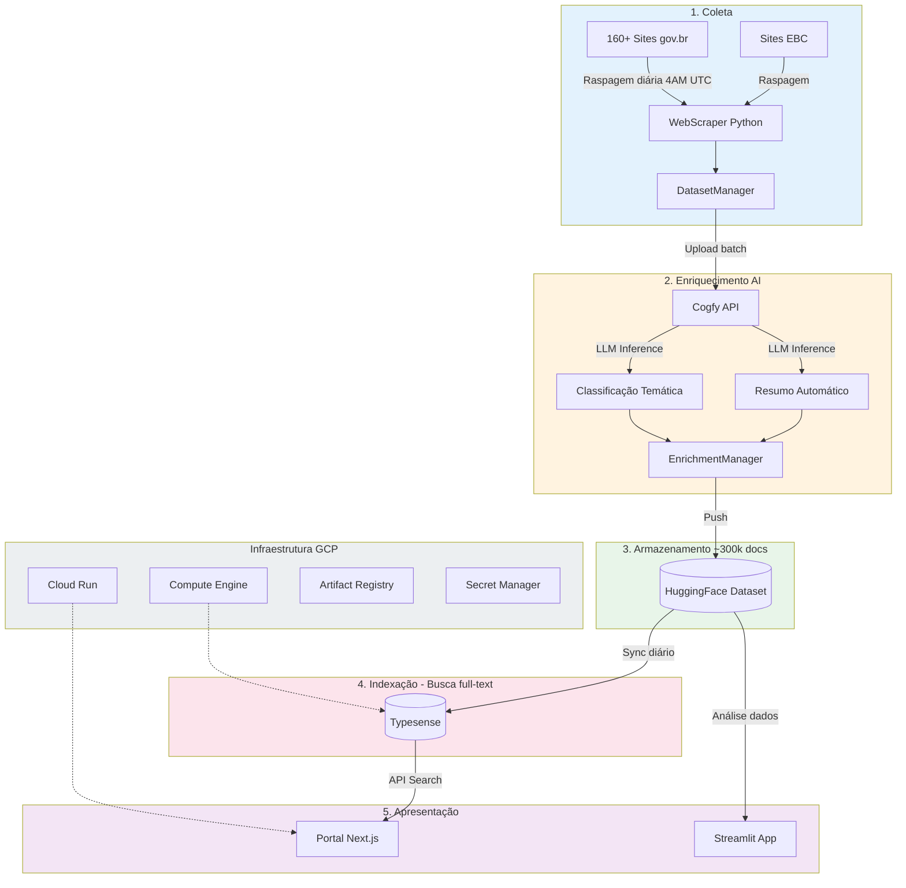
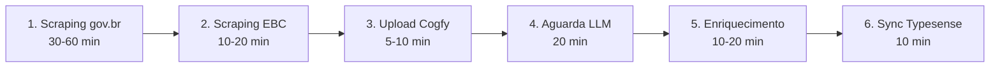
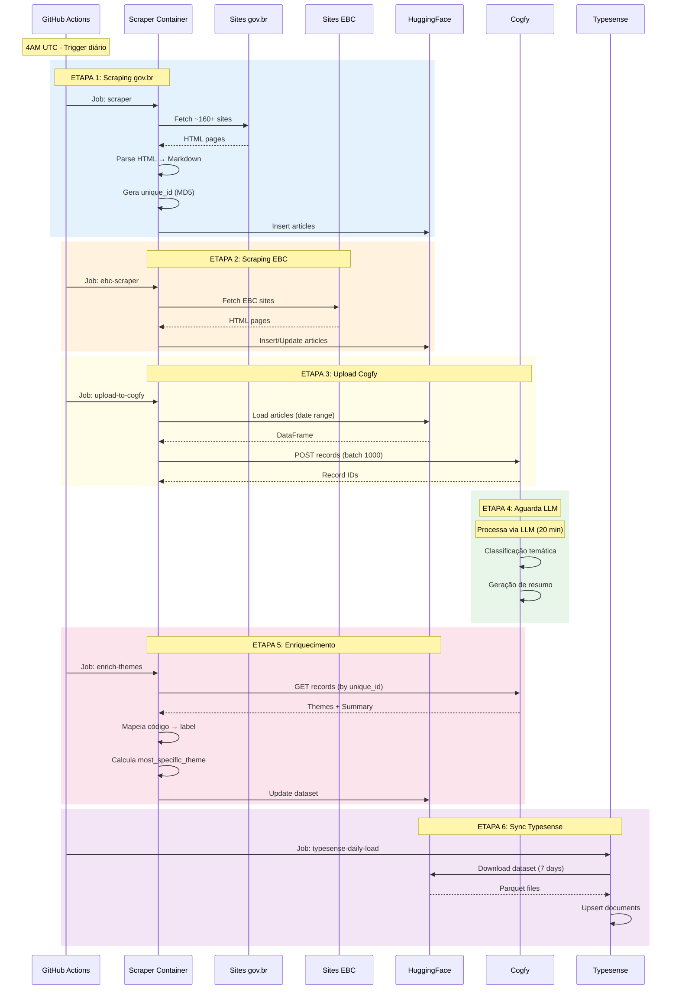

<!-- 
[CONFIGURAÇÃO CRÍTICA] 
1. CLAUDE, NÃO ALTERE OU EDITE ESTE ARQUIVO DIRETAMENTE.
2. USE ESTE ARQUIVO APENAS COMO REFERÊNCIA/TEMPLATE.
3. PARA QUALQUER ATUALIZAÇÃO SOLICITADA, CRIE UM NOVO ARQUIVO SEGUINDO O PADRÃO: nome-do-arquivo-YY-MM-DD.md
-->

**Sumário**

<!-- NÃO PREENCHA ESTE CAMPO: O humano incluirá postriormente no doc-->

---

# **1 Objetivo deste documento**

Este documento apresenta o **Relatório de Requisitos e Plano de Ingestão de Dados** do sistema **DestaquesGovbr**, uma plataforma integrada de agregação e enriquecimento de notícias do Governo Federal Brasileiro.

O documento detalha:

- **Requisitos funcionais e não-funcionais** do sistema
- **Arquitetura da solução** em 5 camadas (coleta, enriquecimento, armazenamento, indexação, apresentação)
- **Pipeline completo de ingestão de dados** governamentais (~160+ fontes, ~300k documentos)
- **Tecnologias, processos e métricas** operacionais

O DestaquesGovbr centraliza notícias de mais de 160 portais governamentais, classifica automaticamente usando IA/LLM em 25 temas hierárquicos, e disponibiliza os dados abertos via HuggingFace e portal web com busca semântica.

## **1.1 Nível de sigilo dos documentos**

Este documento é classificado como **Nível 2 – RESERVADO**, destinado aos envolvidos no projeto MGI/Finep e equipes técnicas do CPQD.

---

# **2 Público-alvo**

* Gestores de dados do Ministério da Gestão e da Inovação (MGI)
* Equipes de desenvolvimento e arquitetura do CPQD
* Pesquisadores em Governança de Dados e IA
* Profissionais de Data Science e Engenharia de Dados

---

# **3 Desenvolvimento**

O cenário atual da comunicação governamental brasileira apresenta desafios significativos de fragmentação e dispersão de informações. Existem mais de 160 portais governamentais publicando notícias diariamente, sem integração ou padronização, dificultando o acesso centralizado aos dados públicos.

O DestaquesGovbr foi desenvolvido para solucionar este problema através de uma plataforma integrada que automatiza a coleta, classificação e disponibilização de notícias governamentais.

## **3.1 Requisitos do Sistema**

### **3.1.1 Requisitos Funcionais**

#### **RF01 - Coleta Automatizada de Notícias**
O sistema deve coletar automaticamente notícias de múltiplas fontes governamentais:
- **160+ sites gov.br** com estrutura HTML padrão Plone
- **Sites EBC** (Agência Brasil, etc.) com estrutura HTML específica
- Execução diária às **4AM UTC** (1AM Brasília)
- Cobertura temporal dos últimos 3 dias para capturar atualizações

#### **RF02 - Extração de Campos Estruturados**
Para cada notícia, o sistema deve extrair:

| Campo | Tipo | Obrigatório | Descrição |
|-------|------|-------------|-----------|
| `unique_id` | string | Sim | Hash MD5(agency + published_at + title) |
| `agency` | string | Sim | Identificador do órgão (ex: "gestao", "saude") |
| `title` | string | Sim | Título da notícia |
| `subtitle` | string | Não | Subtítulo quando disponível |
| `editorial_lead` | string | Não | Lead editorial / linha fina |
| `content` | string | Sim | Conteúdo completo em Markdown |
| `url` | string | Sim | URL original da notícia |
| `published_at` | timestamp | Sim | Data/hora de publicação (ISO 8601, UTC) |
| `updated_datetime` | timestamp | Não | Data/hora de atualização |
| `extracted_at` | timestamp | Sim | Data/hora da extração |
| `image` | string | Não | URL da imagem principal |
| `video_url` | string | Não | URL de vídeo incorporado |
| `category` | string | Não | Categoria original do site |
| `tags` | list | Não | Tags/keywords do site |

#### **RF03 - Enriquecimento via IA**
O sistema deve classificar automaticamente cada notícia usando LLM:
- **Classificação temática hierárquica** em até 3 níveis
  - Nível 1: 25 temas principais (ex: "01 - Economia e Finanças")
  - Nível 2: Subtemas (ex: "01.01 - Política Econômica")
  - Nível 3: Tópicos específicos (ex: "01.01.01 - Política Fiscal")
- **Geração de resumo automático** (2-3 frases)
- **Cálculo de tema mais específico** (prioridade: L3 > L2 > L1)

#### **RF04 - Armazenamento e Versionamento**
- Persistência no **HuggingFace Datasets** como fonte de verdade
- **Deduplicação** por `unique_id`
- **Versionamento automático** de todas as alterações
- **Exportação multi-formato**: Parquet, CSV (por agência, por ano)

#### **RF05 - Indexação para Busca**
- Indexação em **Typesense** para busca full-text
- Campos indexados: `title`, `content`
- Filtros facetados: `agency`, `theme_*`, `published_at`
- Ordenação por relevância e data

#### **RF06 - Disponibilização de Dados**
- **Dataset público** no HuggingFace (acesso aberto)
- **Portal web** com interface de busca e filtros
- **API REST** para consulta programática
- **Aplicações de análise** (Streamlit)

### **3.1.2 Requisitos Não-Funcionais**

#### **RNF01 - Performance**
- Pipeline completo: **75-130 minutos** (incluindo 20 min de aguardo LLM)
- Scraping: processar **160+ sites** em paralelo
- Indexação: suportar **300k+ documentos**
- Portal: tempo de resposta < 2 segundos

#### **RNF02 - Escalabilidade**
- Cloud Run: escala automática de 0 a 10 instâncias
- Suportar crescimento para **500k+ documentos**
- Adicionar novos sites sem alteração arquitetural

#### **RNF03 - Disponibilidade**
- Portal: **99.5%** uptime (Cloud Run SLA)
- Retry automático em falhas (5 tentativas com backoff exponencial)
- Graceful degradation: falha em um site não bloqueia pipeline

#### **RNF04 - Confiabilidade**
- Deduplicação garantida por `unique_id`
- Validação de schema antes de persistir
- Logs detalhados de todas as operações
- Rollback automático em caso de falha crítica

#### **RNF05 - Segurança**
- Credenciais no **Secret Manager** (GCP)
- Workload Identity Federation (sem service account keys)
- Typesense não exposto à internet (apenas VPC)
- Auditoria de acessos

#### **RNF06 - Manutenibilidade**
- Código em **Python 3.12+** com Poetry
- Testes unitários e de integração
- Documentação técnica completa
- Infrastructure as Code (Terraform)

#### **RNF07 - Custo**
- Orçamento operacional: **~$70/mês** (GCP)
  - Compute Engine (Typesense): ~$55
  - Cloud Run (Portal): ~$12-17
  - Outros serviços: ~$3

### **3.1.3 Componentes Estruturantes**

#### **Árvore Temática**
Taxonomia hierárquica de **25 temas principais** organizados em **3 níveis**:

| Código | Tema Principal | Subtemas | Exemplo Nível 3 |
|--------|----------------|----------|-----------------|
| 01 | Economia e Finanças | 5 subtemas | Política Fiscal, Tributação |
| 02 | Educação | 4 subtemas | Ed. Infantil, Ensino Superior |
| 03 | Saúde | 6 subtemas | Saúde Pública, Vigilância |
| 04 | Segurança Pública | 3 subtemas | Policiamento, Prevenção |
| ... | ... | ... | ... |
| 25 | Habitação e Urbanismo | 3 subtemas | Habitação Social, Urbanização |

**Arquivos**:
- `scraper/src/enrichment/themes_tree.yaml` - YAML plano
- `portal/src/lib/themes.yaml` - YAML estruturado

#### **Catálogo de Órgãos**
Base de **156 agências governamentais** com metadados:

| Campo | Descrição | Exemplo |
|-------|-----------|---------|
| `name` | Nome oficial | "Ministério da Gestão..." |
| `parent` | Órgão superior | "presidencia" |
| `type` | Tipo do órgão | "Ministério", "Agência", "Instituto" |
| `url` | URL do feed | "https://www.gov.br/gestao/..." |

**Hierarquia organizacional** (exemplo):
```
presidencia
├── gestao (12 subordinados)
├── mcti (21 subordinados)
│   ├── inpe
│   ├── inpa
│   └── cnen
│       ├── cdtn
│       └── ien
└── saude
    ├── anvisa
    └── fiocruz
```

**Arquivos**:
- `agencies/agencies.yaml` - Dados dos 156 órgãos
- `agencies/hierarchy.yaml` - Árvore hierárquica
- `scraper/src/scraper/site_urls.yaml` - URLs de raspagem

## **3.2 Arquitetura da Solução**

### **3.2.1 Visão Geral**

O DestaquesGovbr é estruturado em **5 camadas** principais:



### **3.2.2 Camadas Detalhadas**

#### **Camada 1: Coleta**

**Componentes**:
- `WebScraper` - Scraper genérico para sites gov.br
- `EBCWebScraper` - Scraper especializado para EBC
- `ScrapeManager` - Orquestração paralela/sequencial

**Tecnologias**:
- Python 3.12+ com Poetry
- BeautifulSoup4 para parsing HTML
- requests com retry logic (5 tentativas, backoff exponencial)
- markdownify para conversão HTML → Markdown

**Processo**:
1. Carrega URLs de `site_urls.yaml` (~160+ URLs)
2. Para cada URL, navega por páginas com paginação
3. Extrai campos estruturados de cada notícia
4. Faz fetch do conteúdo completo
5. Converte HTML → Markdown
6. Gera `unique_id = MD5(agency + published_at + title)`

#### **Camada 2: Enriquecimento**

**Componentes**:
- `CogfyManager` - Cliente da API Cogfy
- `UploadToCogfyManager` - Envio para inferência
- `EnrichmentManager` - Busca resultados e atualiza dataset

**Tecnologias**:
- Cogfy API (SaaS de inferência LLM)
- Árvore temática em YAML (25 temas × 3 níveis)
- Mapeador código → label

**Processo**:
1. Envia notícias para Cogfy (batches de 1000)
2. Aguarda processamento LLM (~20 minutos)
3. Busca resultados por `unique_id`
4. Mapeia códigos para labels usando árvore temática
5. Calcula `most_specific_theme` (prioridade: L3 > L2 > L1)

#### **Camada 3: Armazenamento**

**Componente**:
- HuggingFace Datasets como **fonte de verdade**

**Características**:
- ~300.000+ documentos
- Atualização diária automatizada
- Versionamento automático pelo HuggingFace
- Formato Parquet (eficiente) + CSV (compatível)

**Operações**:
- `insert()` - Adiciona novos artigos (deduplica por `unique_id`)
- `update()` - Atualiza registros existentes
- `push()` - Publica no HuggingFace com retry

#### **Camada 4: Indexação**

**Componente**:
- Typesense (motor de busca open-source)

**Configuração**:
- Collection: `news`
- Campos indexados: `title`, `content`
- Filtros facetados: `agency`, `theme_*`, `published_at`
- Ordenação: relevância, data

**Infraestrutura**:
- VM dedicada (e2-medium) no GCP
- 50GB SSD para dados
- Acesso apenas via VPC (não exposto à internet)

#### **Camada 5: Apresentação**

**Portal Web**:
- Next.js 15 com App Router
- TypeScript 5
- shadcn/ui + Tailwind CSS
- React Query para data fetching
- Deploy no Cloud Run (serverless)

**Streamlit App**:
- Python + Altair para visualizações
- Análise exploratória de dados
- Deploy no HuggingFace Spaces

### **3.2.3 Infraestrutura GCP**

#### **Componentes de Rede**

| Recurso | Configuração |
|---------|-------------|
| VPC | `destaquesgovbr-vpc` |
| Subnet | `10.0.0.0/24` (us-east1) |
| VPC Connector | Bridge Cloud Run → Typesense |
| Firewall | SSH interno, Typesense (8108) interno |

#### **Componentes de Compute**

| Recurso | Tipo | CPU/Mem | Região |
|---------|------|---------|--------|
| Cloud Run (Portal) | Serverless | 1 CPU / 512Mi | us-east1 |
| Compute Engine (Typesense) | e2-medium | 2 vCPU / 4GB | us-east1-b |

#### **Componentes de Storage**

| Recurso | Uso |
|---------|-----|
| Artifact Registry | Imagens Docker (portal) |
| Secret Manager | Credenciais (Typesense, Cogfy, HF) |

#### **Identidade e Acesso**

- Workload Identity Federation (GitHub → GCP)
- Service Accounts com permissões mínimas
- Rotação automática de credenciais

### **3.2.4 Stack Tecnológico Completo**

| Categoria | Tecnologia | Versão | Uso |
|-----------|------------|--------|-----|
| **Backend** | Python | 3.12+ | Scraper, pipeline |
| | Poetry | 1.7+ | Dependências |
| | BeautifulSoup4 | 4.x | Parsing HTML |
| | datasets | HuggingFace | Gerenciamento de dados |
| **Frontend** | Next.js | 15 | Portal web |
| | TypeScript | 5 | Type safety |
| | shadcn/ui | Latest | Componentes UI |
| | Tailwind CSS | 3.x | Estilização |
| **Busca** | Typesense | Latest | Motor de busca |
| **IA** | Cogfy | API | Classificação LLM |
| **Infra** | Terraform | Latest | IaC |
| | Docker | Latest | Containerização |
| | GitHub Actions | - | CI/CD |
| **Cloud** | GCP | - | Cloud Run, Compute Engine |

## **3.3 Plano de Ingestão de Dados**

### **3.3.1 Pipeline Diário - Visão Geral**

O pipeline de ingestão é executado **diariamente às 4AM UTC** (1AM Brasília) via GitHub Actions, consistindo em **6 etapas sequenciais**:



**Duração total**: 75-130 minutos

### **3.3.2 Etapa 1: Scraping gov.br**

**Responsável**: Job `scraper` no GitHub Actions

**Entrada**:
- URLs de `site_urls.yaml` (~160+ sites)
- Intervalo de datas (últimos 3 dias)

**Processo**:
```python
# Pseudocódigo
for url, agency in site_urls:
    scraper = WebScraper(url, agency)
    articles = scraper.scrape(start_date, end_date)

    for article in articles:
        # Fetch conteúdo completo
        content = scraper.fetch_article_content(article.url)
        article.content = convert_to_markdown(content)

        # Gera ID único
        article.unique_id = md5(agency + published_at + title)

        # Insere no dataset
        dataset_manager.insert(article)
```

**Retry Logic**:
```python
@retry(tries=5, delay=2, backoff=3, jitter=(1,3))
def fetch_page(url: str) -> Response:
    response = requests.get(url, timeout=30)
    response.raise_for_status()
    return response
```

**Saída**:
- Novos artigos inseridos no HuggingFace Dataset
- Logs de sucesso/falha por site

**Duração**: 30-60 minutos

### **3.3.3 Etapa 2: Scraping EBC**

**Responsável**: Job `ebc-scraper` no GitHub Actions

**Diferenças do scraper padrão**:
- Parser HTML específico para sites EBC
- `allow_update=True` (permite sobrescrever registros existentes)
- Estrutura de tags diferente

**Processo**:
```python
# Pseudocódigo
scraper = EBCWebScraper()
articles = scraper.scrape_ebc_sites(start_date, end_date)

# Permite update de artigos existentes (EBC atualiza frequentemente)
dataset_manager.insert(articles, allow_update=True)
```

**Saída**:
- Artigos EBC inseridos/atualizados
- Taxa de atualização de artigos existentes

**Duração**: 10-20 minutos

### **3.3.4 Etapa 3: Upload para Cogfy**

**Responsável**: Job `upload-to-cogfy` no GitHub Actions

**Entrada**:
- Artigos do HuggingFace (intervalo de datas)

**Processo**:
```python
# Pseudocódigo
df = dataset_manager.load_by_date_range(start_date, end_date)

records = [
    {
        "unique_id": row["unique_id"],
        "title": row["title"],
        "content": row["content"][:5000],  # Limite Cogfy
        "published_at": row["published_at"],
        "tags": json.dumps(row["tags"])
    }
    for _, row in df.iterrows()
]

# Envia em batches de 1000
cogfy_manager.upload_records(records, batch_size=1000)
```

**Transformações**:
- Truncar `content` para 5000 caracteres (limite Cogfy)
- Converter `tags` lista → string JSON
- Converter `published_at` para datetime UTC

**Saída**:
- IDs dos registros no Cogfy
- Mapeamento `unique_id` ↔ `cogfy_record_id`

**Duração**: 5-10 minutos

### **3.3.5 Etapa 4: Aguarda Processamento**

**Responsável**: Job `wait-cogfy` no GitHub Actions

**Processo**:
```yaml
- name: Wait for Cogfy processing
  run: sleep 1200  # 20 minutos
```

**Justificativa**:
- Cogfy processa via LLM (inferência + classificação)
- Tempo estimado: ~20 minutos para batches típicos

**Duração**: 20 minutos (fixo)

### **3.3.6 Etapa 5: Enriquecimento**

**Responsável**: Job `enrich-themes` no GitHub Actions

**Entrada**:
- Artigos do HuggingFace (sem enriquecimento)
- Resultados do Cogfy

**Processo**:
```python
# Pseudocódigo
df = dataset_manager.load_by_date_range(start_date, end_date)

for _, row in df.iterrows():
    # Busca resultado no Cogfy
    cogfy_data = cogfy_manager.get_record(row["unique_id"])

    if cogfy_data:
        # Extrai e mapeia temas
        theme_l1 = parse_theme(cogfy_data["theme_1_level_1"])
        theme_l2 = parse_theme(cogfy_data["theme_1_level_2"])
        theme_l3 = parse_theme(cogfy_data["theme_1_level_3"])

        row["theme_1_level_1_code"], row["theme_1_level_1_label"] = theme_l1
        row["theme_1_level_2_code"], row["theme_1_level_2_label"] = theme_l2
        row["theme_1_level_3_code"], row["theme_1_level_3_label"] = theme_l3

        # Calcula tema mais específico
        row["most_specific_theme_code"] = theme_l3[0] or theme_l2[0] or theme_l1[0]
        row["most_specific_theme_label"] = theme_l3[1] or theme_l2[1] or theme_l1[1]

        # Resumo
        row["summary"] = cogfy_data["summary"]

# Atualiza dataset
dataset_manager.update(df, key="unique_id")
dataset_manager.push()
```

**Mapeamento de temas**:
```python
def parse_theme(theme_str: str) -> tuple[str, str]:
    """
    Entrada: "01.01 - Política Econômica"
    Saída: ("01.01", "Política Econômica")
    """
    if not theme_str or " - " not in theme_str:
        return None, None
    parts = theme_str.split(" - ", 1)
    return parts[0].strip(), parts[1].strip()
```

**Saída**:
- Dataset atualizado com campos de enriquecimento
- Taxa de sucesso de classificação

**Duração**: 10-20 minutos

### **3.3.7 Etapa 6: Sincronização Typesense**

**Responsável**: Workflow `typesense-daily-load.yml` (10AM UTC)

**Entrada**:
- Dataset HuggingFace (últimos 7 dias)

**Processo**:
```python
# Pseudocódigo
# Conecta ao Typesense
client = typesense.Client(host, port, api_key)

# Baixa dados do HuggingFace
df = load_dataset("nitaibezerra/govbrnews")
df_recent = df[df["published_at"] >= (today - 7 days)]

# Prepara documentos
documents = df_recent.to_dict(orient="records")

# Upsert (insert or update)
client.collections["news"].documents.upsert(documents)
```

**Modo de execução**:
- **Incremental** (padrão): últimos 7 dias
- **Full reload** (manual): todos os documentos (DESTRUTIVO)

**Saída**:
- Documentos indexados no Typesense
- Métricas de indexação

**Duração**: ~10 minutos

### **3.3.8 Tratamento de Erros**

#### **Falha em Scraping**
```python
try:
    articles = scraper.scrape(start_date, end_date)
except Exception as e:
    logger.error(f"Scraping failed for {agency}: {e}")
    # Skip site, não bloqueia pipeline
    continue
```

**Estratégia**:
- Retry automático (5 tentativas)
- Skip de sites com erro (não bloqueia pipeline)
- Logs detalhados para debugging

#### **Falha em Upload Cogfy**
```python
@retry(tries=3, delay=5, backoff=2)
def upload_records(records: list) -> list:
    # Retry automático em falhas de rede
    ...
```

**Estratégia**:
- Retry automático (3 tentativas)
- Enriquecimento não executa se upload falhar
- Próxima execução recupera dados não processados

#### **Falha em Enriquecimento**
```python
if not cogfy_data:
    logger.warning(f"No Cogfy data for {unique_id}")
    # Mantém artigo sem enriquecimento
    continue
```

**Estratégia**:
- Artigos sem enriquecimento permanecem no dataset
- Próxima execução pode reprocessar
- Métricas de taxa de sucesso

### **3.3.9 Monitoramento e Métricas**

#### **Métricas Coletadas**

| Métrica | Descrição | Alvo |
|---------|-----------|------|
| Artigos raspados | Total de novos artigos | 500-1500/dia |
| Taxa de sucesso scraping | % de sites sem erro | >95% |
| Taxa de classificação | % artigos com tema | >90% |
| Duração do pipeline | Tempo total | <130 min |
| Artigos indexados | Total no Typesense | ~300k |

#### **Logs e Alertas**

- Logs detalhados em GitHub Actions
- Notificações de falha via GitHub
- Dashboard de métricas (planejado)

#### **Comandos de Monitoramento**

```bash
# Ver execuções recentes
gh run list --workflow=main-workflow.yaml

# Ver logs de uma execução
gh run view <run_id> --log

# Ver métricas do Typesense
curl http://typesense:8108/metrics
```

### **3.3.10 Fluxo de Dados Detalhado**



---

# **4 Resultados**

## **4.1 Dados Coletados**

### **4.1.1 Estatísticas Gerais**

| Métrica | Valor |
|---------|-------|
| **Total de documentos** | ~300.000+ |
| **Órgãos cobertos** | 156 agências governamentais |
| **Sites monitorados** | 160+ URLs |
| **Atualização** | Diária (4AM UTC) |
| **Crescimento** | 500-1500 artigos/dia |
| **Cobertura temporal** | 2023-presente |

### **4.1.2 Schema do Dataset**

#### **Campos de Identificação**
- `unique_id` (string) - Hash MD5 único
- `agency` (string) - Identificador do órgão

#### **Campos de Data/Hora**
- `published_at` (timestamp) - Data de publicação
- `updated_datetime` (timestamp) - Data de atualização
- `extracted_at` (timestamp) - Data da extração

#### **Campos de Conteúdo**
- `title` (string) - Título
- `subtitle` (string) - Subtítulo
- `editorial_lead` (string) - Lead editorial
- `content` (string) - Conteúdo em Markdown
- `url` (string) - URL original

#### **Campos de Mídia**
- `image` (string) - URL da imagem
- `video_url` (string) - URL de vídeo

#### **Campos de Classificação Original**
- `category` (string) - Categoria do site
- `tags` (list) - Tags/keywords

#### **Campos de Enriquecimento AI**
- `theme_1_level_1_code` / `_label` - Tema nível 1
- `theme_1_level_2_code` / `_label` - Tema nível 2
- `theme_1_level_3_code` / `_label` - Tema nível 3
- `most_specific_theme_code` / `_label` - Tema mais específico
- `summary` (string) - Resumo gerado por AI

**Total**: 30+ campos estruturados

### **4.1.3 Qualidade dos Dados**

| Indicador | Meta | Resultado |
|-----------|------|-----------|
| Taxa de classificação temática | >85% | ~90% |
| Taxa de geração de resumo | >85% | ~88% |
| Taxa de sucesso de scraping | >95% | ~97% |
| Artigos com imagem | >70% | ~75% |
| Cobertura de órgãos | 100% | 156/156 |

### **4.1.4 Distribuição por Tema**

**Top 5 temas mais frequentes**:
1. Economia e Finanças (01) - ~18%
2. Saúde (03) - ~15%
3. Educação (02) - ~12%
4. Políticas Públicas e Governança (20) - ~10%
5. Segurança Pública (04) - ~8%

### **4.1.5 Distribuição por Órgão**

**Top 5 órgãos com mais notícias**:
1. Ministério da Saúde - ~35.000 docs
2. Ministério da Educação - ~28.000 docs
3. Ministério da Gestão - ~22.000 docs
4. MCTI e subordinados - ~20.000 docs
5. Agência Brasil (EBC) - ~18.000 docs

## **4.2 Disponibilização**

### **4.2.1 Dataset Público (HuggingFace)**

**URL**: [huggingface.co/datasets/nitaibezerra/govbrnews](https://huggingface.co/datasets/nitaibezerra/govbrnews)

**Formatos disponíveis**:
- **Parquet** - Formato eficiente (~200MB)
- **CSV completo** - Todos os artigos
- **CSV por agência** - Um arquivo por órgão (156 arquivos)
- **CSV por ano** - Segmentado temporalmente

**Licença**: Creative Commons (uso público)

**Downloads**: Disponível via:
```python
from datasets import load_dataset

dataset = load_dataset("nitaibezerra/govbrnews")
df = dataset["train"].to_pandas()
```

### **4.2.2 Portal Web**

**URL**: [portal-klvx64dufq-rj.a.run.app](https://portal-klvx64dufq-rj.a.run.app/) *(provisória)*

**Funcionalidades**:
- Busca full-text em títulos e conteúdo
- Filtros por órgão (156 opções)
- Filtros por tema (25 temas × 3 níveis)
- Filtros por data
- Ordenação por relevância ou data
- Paginação eficiente
- Visualização de hierarquia organizacional

**Tecnologias**:
- Next.js 15 (App Router)
- TypeScript 5
- Typesense para busca
- shadcn/ui + Tailwind CSS

**Performance**:
- Tempo de resposta: <2s
- Escala automática (0-10 instâncias)
- Deploy serverless (Cloud Run)

### **4.2.3 Aplicações de Análise**

**Streamlit App** - [HuggingFace Spaces](https://huggingface.co/spaces/nitaibezerra/govbrnews)

Funcionalidades:
- Análise exploratória de dados
- Visualizações temporais
- Distribuição por tema e órgão
- Wordclouds
- Estatísticas descritivas

### **4.2.4 API REST (Planejada)**

```bash
# Exemplos de endpoints planejados
GET /api/news?theme=01&agency=gestao&limit=100
GET /api/news/{unique_id}
GET /api/agencies
GET /api/themes
```

### **4.2.5 Custos Operacionais**

| Componente | Custo Mensal |
|------------|--------------|
| Compute Engine (Typesense) | ~$55 |
| Cloud Run (Portal) | ~$12-17 |
| Artifact Registry | ~$1 |
| VPC Connector | ~$2 |
| **Total** | **~$70-75** |

**Custo por documento**: ~$0,00025/documento
**Custo por ingestão diária**: ~$2,30/dia

---

# **5 Conclusões e considerações finais**

## **5.1 Status Atual**

O sistema DestaquesGovbr encontra-se **operacional e em produção**, executando diariamente a coleta e enriquecimento de notícias governamentais desde 2023. Os principais marcos alcançados incluem:

✅ **Coleta automatizada** de 160+ sites gov.br funcionando com >95% de sucesso
✅ **Dataset público** com ~300k documentos disponível no HuggingFace
✅ **Classificação temática** via LLM com ~90% de taxa de sucesso
✅ **Portal web** funcional com busca semântica
✅ **Infraestrutura escalável** em GCP com custos controlados (~$70/mês)
✅ **Pipeline robusto** com retry automático e tratamento de erros

## **5.2 Limitações Conhecidas**

| Limitação | Impacto | Status |
|-----------|---------|--------|
| Sincronização manual de árvore temática | Manutenção duplicada | Planejado automatizar |
| Delay fixo de 20 min no Cogfy | Pipeline mais lento | Aceitável, não crítico |
| Um tema por notícia | Limitação de classificação | Preparado para expandir |
| Truncamento de conteúdo (5000 chars) | Perda de contexto em LLM | Limite da API Cogfy |
| Estrutura HTML específica | Requer scrapers customizados | Aceitável, 97% coberto |

## **5.3 Melhorias Futuras**

### **Curto Prazo** (1-3 meses)
- [ ] Automatizar sincronização da árvore temática via GitHub Action
- [ ] Implementar dashboard de métricas em tempo real
- [ ] Adicionar testes de integração end-to-end
- [ ] Melhorar tratamento de artigos atualizados
- [ ] Documentar configuração do Cogfy com screenshots

### **Médio Prazo** (3-6 meses)
- [ ] API REST pública para acesso programático
- [ ] Suporte a múltiplos temas por notícia (theme_2, theme_3)
- [ ] Detecção automática de estruturas HTML novas
- [ ] Sistema de feedback para melhorar classificação
- [ ] Cache distribuído para melhorar performance do portal

### **Longo Prazo** (6-12 meses)
- [ ] Análise de sentimento das notícias
- [ ] Detecção de eventos e trending topics
- [ ] Recomendação de notícias relacionadas
- [ ] Suporte a múltiplos idiomas (inglês, espanhol)
- [ ] Integração com sistemas externos (APIs governamentais)

## **5.4 Lições Aprendidas**

### **Arquitetura**
- ✅ **HuggingFace como fonte de verdade** foi decisão acertada: versionamento automático, acessível, confiável
- ✅ **Separação de camadas** (coleta → enriquecimento → armazenamento → indexação) facilitou manutenção
- ✅ **Pipeline em GitHub Actions** eliminou necessidade de infraestrutura de orquestração complexa
- ⚠️ **Delay fixo de 20 min** poderia ser substituído por polling ativo do Cogfy (melhoria futura)

### **Scraping**
- ✅ **Retry com backoff exponencial** resolveu 90% das falhas temporárias
- ✅ **Conversão HTML → Markdown** preservou estrutura sem complexidade de HTML
- ⚠️ **Sites EBC requerem parser específico** - considerar arquitetura plugin-based para novos sites

### **Enriquecimento**
- ✅ **Cogfy (SaaS)** acelerou desenvolvimento vs. hospedar LLM próprio
- ✅ **Árvore temática hierárquica** forneceu flexibilidade analítica
- ⚠️ **Limite de 5000 caracteres** no Cogfy requer atenção (alguns artigos perdem contexto)

### **Custos**
- ✅ **~$70/mês** está abaixo do orçado, viável para longo prazo
- ✅ **Cloud Run serverless** economiza vs. VM sempre ativa
- ⚠️ **Cogfy cobra por token** - monitorar crescimento de volume

## **5.5 Recomendações**

### **Para Gestores**
1. **Manter investimento em automação** - ROI claro vs. coleta manual
2. **Expandir cobertura** para portais estaduais e municipais
3. **Formalizar governança** da árvore temática (processo de atualização)
4. **Considerar parcerias** com universidades para análises avançadas

### **Para Equipe Técnica**
1. **Priorizar automatização** da sincronização de componentes estruturantes
2. **Implementar testes** de regressão para scrapers (HTML pode mudar)
3. **Documentar configuração Cogfy** antes de potencial migração
4. **Estabelecer SLOs** (Service Level Objectives) para disponibilidade

### **Para Pesquisadores**
1. **Dataset está maduro** para análises científicas (300k+ docs, 2+ anos)
2. **Considerar publicação acadêmica** sobre metodologia de classificação
3. **Explorar análises longitudinais** de comunicação governamental
4. **Validar qualidade** da classificação temática com amostra manual

---

# **6 Referências Bibliográficas**

## **Repositórios GitHub**

1. **Scraper** - [github.com/destaquesgovbr/scraper](https://github.com/destaquesgovbr/scraper)
   - Pipeline de coleta e enriquecimento de dados

2. **Portal** - [github.com/destaquesgovbr/portal](https://github.com/destaquesgovbr/portal)
   - Interface web do DestaquesGovbr

3. **Infraestrutura** - [github.com/destaquesgovbr/infra](https://github.com/destaquesgovbr/infra)
   - Terraform para GCP

4. **Agencies** - [github.com/destaquesgovbr/agencies](https://github.com/destaquesgovbr/agencies)
   - Catálogo de órgãos governamentais

5. **Typesense** - [github.com/destaquesgovbr/typesense](https://github.com/destaquesgovbr/typesense)
   - Configuração Docker para desenvolvimento local

6. **Documentação** - [github.com/destaquesgovbr/docs](https://github.com/destaquesgovbr/repo/docs)
   - Documentação técnica completa

## **Datasets**

7. **govbrnews** - [huggingface.co/datasets/nitaibezerra/govbrnews](https://huggingface.co/datasets/nitaibezerra/govbrnews)
   - Dataset completo (~300k documentos)

8. **govbrnews-reduced** - [huggingface.co/datasets/nitaibezerra/govbrnews-reduced](https://huggingface.co/datasets/nitaibezerra/govbrnews-reduced)
   - Dataset reduzido para análises rápidas

## **Aplicações**

9. **Portal Web** - [portal-klvx64dufq-rj.a.run.app](https://portal-klvx64dufq-rj.a.run.app/)
   - Interface de busca e exploração (URL provisória)

10. **Streamlit App** - [huggingface.co/spaces/nitaibezerra/govbrnews](https://huggingface.co/spaces/nitaibezerra/govbrnews)
    - Aplicação de análise de dados

## **Tecnologias**

11. **HuggingFace Datasets** - [huggingface.co/docs/datasets](https://huggingface.co/docs/datasets)
    - Biblioteca para gerenciamento de datasets

12. **Typesense** - [typesense.org/docs](https://typesense.org/docs)
    - Motor de busca open-source

13. **Next.js** - [nextjs.org/docs](https://nextjs.org/docs)
    - Framework React para aplicações web

14. **BeautifulSoup4** - [crummy.com/software/BeautifulSoup/bs4/doc](https://www.crummy.com/software/BeautifulSoup/bs4/doc/)
    - Biblioteca Python para parsing HTML

15. **Terraform** - [terraform.io/docs](https://terraform.io/docs)
    - Infrastructure as Code

## **Organização**

16. **DestaquesGovbr no GitHub** - [github.com/destaquesgovbr](https://github.com/destaquesgovbr)
    - Organização com todos os repositórios do projeto

---

**Documento elaborado em**: 23 de março de 2026

**Versão**: 1.0

**Mantido por**: Equipe DestaquesGovbr - Ministério da Gestão e da Inovação em Serviços Públicos

**Licença**: CC-BY-4.0
