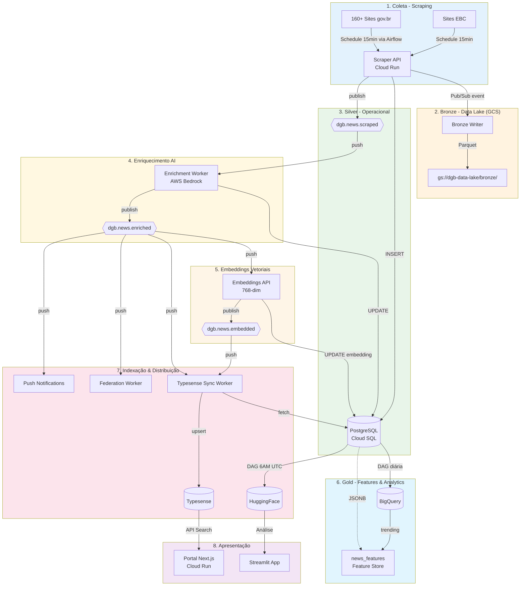
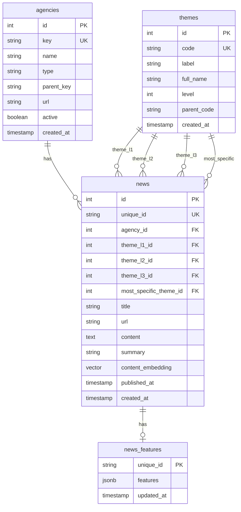
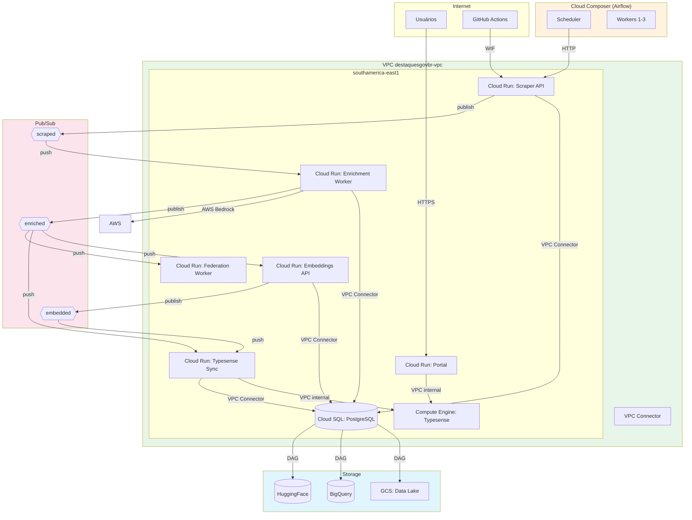
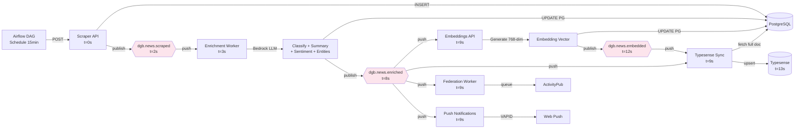
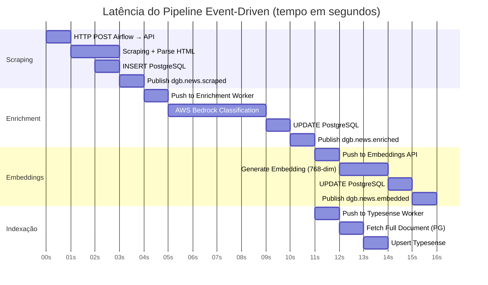
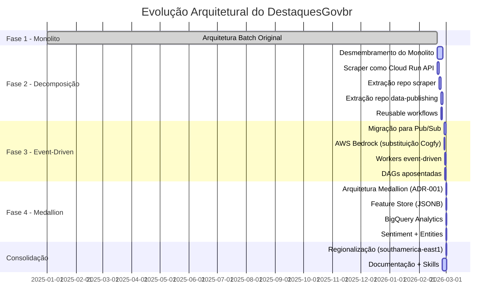
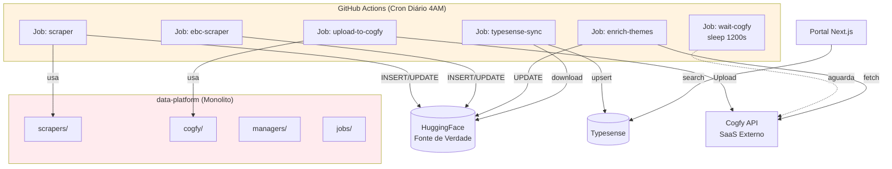
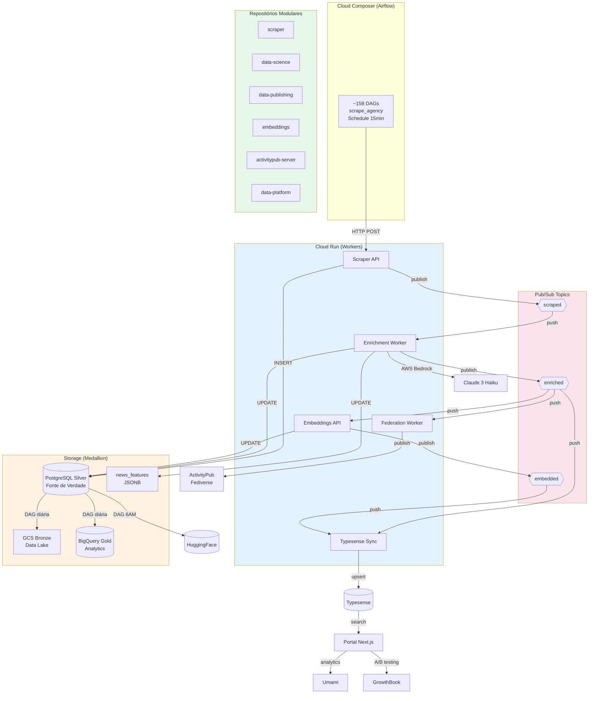
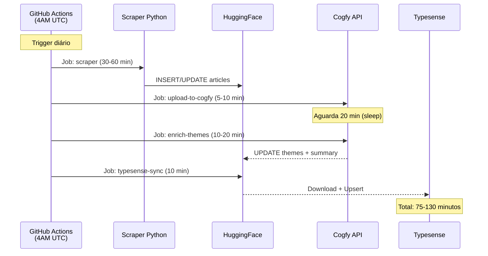
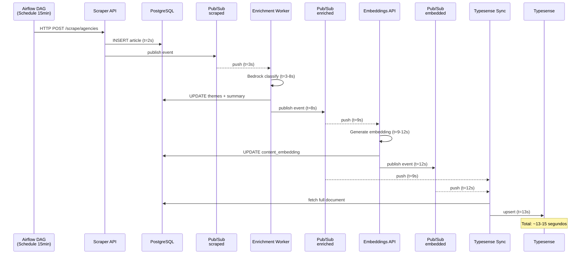

Data: 24/03/2026

Elaborado por: DestaquesGovBr Team (via Claude Code)

Revisado por: <!-- NÃO PREENCHA ESTE CAMPO: O humano preencherá manualmente-->

**Sumário**

<!-- NÃO PREENCHA ESTE CAMPO: O humano incluirá postriormente no doc-->

---

# **1 Objetivo deste documento**

Este documento apresenta a **versão atualizada do Relatório de Requisitos e Plano de Ingestão de Dados** do sistema **DestaquesGovbr**, refletindo a transformação arquitetural significativa realizada entre dezembro de 2025 e março de 2026.

O documento detalha:

- **Requisitos funcionais e não-funcionais** do sistema atualizado
- **Arquitetura event-driven** em 7 camadas com padrão Medallion (Bronze/Silver/Gold)
- **Pipeline de ingestão em tempo near-real** (~15 segundos vs 24 horas anteriormente)
- **Evolução do ecossistema** com comparativo detalhado das transformações arquiteturais
- **Tecnologias, processos e métricas** operacionais da nova arquitetura

O DestaquesGovbr é uma plataforma integrada que centraliza notícias de ~158 portais governamentais, classifica automaticamente usando AWS Bedrock (Claude Haiku) em 25 temas hierárquicos, gera embeddings para busca semântica, e disponibiliza os dados através de múltiplos canais: portal web, HuggingFace Dataset, BigQuery, e federação via ActivityPub/Mastodon.

## **1.1 Nível de sigilo dos documentos**

Este documento é classificado como **Nível 2 – RESERVADO**, destinado aos envolvidos no projeto MGI/Finep e equipes técnicas do CPQD.

---

# **2 Terminologias e Abreviações**

| Sigla/Termo | Significado | Descrição |
|-------------|-------------|-----------|
| **AI/IA** | Artificial Intelligence / Inteligência Artificial | Tecnologias que simulam capacidades cognitivas humanas |
| **API** | Application Programming Interface | Interface de Programação de Aplicações |
| **AWS** | Amazon Web Services | Plataforma de serviços de computação em nuvem da Amazon |
| **BigQuery** | - | Serviço de data warehouse do Google Cloud |
| **Bronze/Silver/Gold** | - | Camadas da arquitetura Medallion (dados brutos/operacional/analítico) |
| **CI/CD** | Continuous Integration/Continuous Deployment | Integração Contínua e Implantação Contínua |
| **Cloud Run** | - | Serviço de containers serverless do Google Cloud |
| **Cloud SQL** | - | Serviço de banco de dados gerenciado do Google Cloud |
| **CPQD** | Centro de Pesquisa e Desenvolvimento em Telecomunicações | Instituição brasileira de pesquisa e desenvolvimento |
| **DAG** | Directed Acyclic Graph | Grafo Acíclico Direcionado (usado no Airflow para workflows) |
| **EBC** | Empresa Brasil de Comunicação | Empresa pública brasileira de comunicação |
| **Embeddings** | - | Representações vetoriais de texto para busca semântica |
| **Event-driven** | - | Arquitetura orientada a eventos |
| **GCP** | Google Cloud Platform | Plataforma de computação em nuvem do Google |
| **GCS** | Google Cloud Storage | Serviço de armazenamento de objetos do Google Cloud |
| **HuggingFace** | - | Plataforma de ML e compartilhamento de datasets |
| **HTTP/HTTPS** | HyperText Transfer Protocol (Secure) | Protocolo de transferência de hipertexto |
| **IAM** | Identity and Access Management | Gerenciamento de Identidade e Acesso |
| **ISO 8601** | - | Padrão internacional de data e hora |
| **JSON/JSONB** | JavaScript Object Notation (Binary) | Formato de dados texto/binário |
| **LGPD** | Lei Geral de Proteção de Dados | Lei brasileira de proteção de dados pessoais |
| **LOC** | Location | Entidade do tipo localização |
| **LLM** | Large Language Model | Modelo de Linguagem de Grande Escala |
| **Medallion** | - | Arquitetura de dados em camadas (Bronze/Silver/Gold) |
| **MGI** | Ministério da Gestão e da Inovação | Ministério do Governo Federal Brasileiro |
| **NER** | Named Entity Recognition | Reconhecimento de Entidades Nomeadas |
| **OIDC** | OpenID Connect | Protocolo de autenticação |
| **ORG** | Organization | Entidade do tipo organização |
| **Parquet** | - | Formato de arquivo colunar para dados analíticos |
| **PER** | Person | Entidade do tipo pessoa |
| **PostgreSQL** | - | Sistema de gerenciamento de banco de dados relacional |
| **Pub/Sub** | Publish/Subscribe | Padrão de mensageria assíncrona (serviço do Google Cloud) |
| **REST** | Representational State Transfer | Estilo arquitetural para APIs |
| **RF** | Requisitos Funcionais | Especificação de funcionalidades do sistema |
| **RNF** | Requisitos Não-Funcionais | Especificação de qualidades do sistema |
| **Scraper/Scraping** | - | Processo de extração automatizada de dados da web |
| **Sentiment Analysis** | - | Análise de sentimento (positivo/negativo/neutro) |
| **SLA** | Service Level Agreement | Acordo de Nível de Serviço |
| **SQL** | Structured Query Language | Linguagem de Consulta Estruturada |
| **SUS** | Sistema Único de Saúde | Sistema público de saúde brasileiro |
| **Typesense** | - | Motor de busca open-source |
| **UTC** | Coordinated Universal Time | Tempo Universal Coordenado |
| **VAPID** | Voluntary Application Server Identification | Protocolo para notificações web push |
| **vCPU** | Virtual Central Processing Unit | Unidade Virtual de Processamento Central |
| **VPC** | Virtual Private Cloud | Rede privada virtual em nuvem |
| **YAML** | YAML Ain't Markup Language | Formato de serialização de dados |

---

# **3 Público-alvo**

* Gestores de dados do Ministério da Gestão e da Inovação (MGI)
* Equipes de desenvolvimento e arquitetura do CPQD
* Pesquisadores em Governança de Dados e IA
* Profissionais de Data Science e Engenharia de Dados
* Arquitetos de software interessados em pipelines event-driven

---

# **4 Desenvolvimento**

O cenário atual da comunicação governamental brasileira apresenta desafios significativos de fragmentação e dispersão de informações. Existem mais de 160 portais governamentais publicando notícias diariamente, sem integração ou padronização, dificultando o acesso centralizado aos dados públicos.

O DestaquesGovbr foi desenvolvido para solucionar este problema através de uma plataforma integrada que automatiza a coleta, classificação e disponibilização de notícias governamentais. **Entre dezembro de 2025 e março de 2026**, o sistema passou por uma transformação arquitetural profunda, migrando de um pipeline batch/cron com latência de 24 horas para uma arquitetura event-driven com latência de ~15 segundos.

## **4.1 Requisitos do Sistema**

### **4.1.1 Requisitos Funcionais**

#### **RF01 - Coleta Automatizada de Notícias via Cloud Run API**

O sistema deve coletar automaticamente notícias através de uma API REST deployada no Cloud Run:

- **~158 DAGs dinâmicas no Airflow** (uma por agência gov.br)
- **Sites EBC** (Agência Brasil, etc.) via scraper especializado
- **Schedule de 15 minutos** (vs diário na versão anterior)
- **Scraper API** recebe POST requests do Airflow e executa coleta
- Cobertura temporal dos últimos 3 dias para capturar atualizações
- **Publicação automática** de eventos Pub/Sub (`dgb.news.scraped`)

**Arquitetura**:
```
Airflow DAG → HTTP POST → Scraper API (Cloud Run) → INSERT PostgreSQL → Pub/Sub event
```

#### **RF02 - Armazenamento em Arquitetura Medallion**

O sistema deve implementar separação de camadas de dados:

**Bronze (Data Lake - GCS)**:
- Dados brutos em Parquet particionado por data
- Imutabilidade (append-only)
- Lifecycle policy: Standard → Nearline (90d) → Coldline (365d)

**Silver (Operacional - PostgreSQL)**:
- Tabela `news` normalizada (300k+ registros)
- Tabelas `agencies` (158) e `themes` (200+)
- Campos vetoriais: `content_embedding VECTOR(768)`
- Deduplicação por `unique_id = MD5(agency + published_at + title)`

**Gold (Analítico - BigQuery + Feature Store)**:
- Tabela `news_features` (JSONB) para features derivadas
- BigQuery external tables sobre GCS Bronze
- Agregações e métricas de trending

**Campos extraídos por notícia**:

| Campo | Tipo | Obrigatório | Descrição |
|-------|------|-------------|-----------|
| `unique_id` | string | Sim | Hash MD5(agency + published_at + title) |
| `agency` | string | Sim | Identificador do órgão (ex: "gestao", "saude") |
| `title` | string | Sim | Título da notícia |
| `subtitle` | string | Não | Subtítulo quando disponível |
| `editorial_lead` | string | Não | Lead editorial / linha fina |
| `content` | string | Sim | Conteúdo completo em Markdown |
| `url` | string | Sim | URL original da notícia |
| `published_at` | timestamp | Sim | Data/hora de publicação (ISO 8601, UTC) |
| `updated_datetime` | timestamp | Não | Data/hora de atualização |
| `extracted_at` | timestamp | Sim | Data/hora da extração |
| `image` | string | Não | URL da imagem principal |
| `video_url` | string | Não | URL de vídeo incorporado |
| `category` | string | Não | Categoria original do site |
| `tags` | list | Não | Tags/keywords do site |

#### **RF03 - Enriquecimento via AWS Bedrock com Sentiment e Entities**

O sistema deve classificar e enriquecer automaticamente cada notícia usando Claude Haiku via AWS Bedrock:

**Classificação temática hierárquica** em até 3 níveis:
- Nível 1: 25 temas principais (ex: "01 - Economia e Finanças")
- Nível 2: Subtemas (ex: "01.01 - Política Econômica")
- Nível 3: Tópicos específicos (ex: "01.01.01 - Política Fiscal")

**Geração de resumo automático** (2-3 frases)

**Análise de sentimento**:
- Label: positive/negative/neutral
- Score de confiança (0.0-1.0)

**Extração de entidades**:
- Pessoas (PER)
- Organizações (ORG)
- Locais (LOC)

**Cálculo de tema mais específico** (prioridade: L3 > L2 > L1)

**Features armazenadas em JSONB** (Feature Store):
```json
{
  "sentiment": {"score": 0.72, "label": "positive"},
  "entities": [
    {"text": "MEC", "type": "ORG"},
    {"text": "Lula", "type": "PER"}
  ],
  "word_count": 523,
  "readability": {"flesch_ease": 45.2}
}
```

#### **RF04 - Geração de Embeddings Vetoriais**

O sistema deve gerar embeddings para busca semântica:
- Modelo: `paraphrase-multilingual-mpnet-base-v2`
- Dimensões: 768
- Input: `title + summary` (fallback para `content`)
- Armazenamento: `content_embedding VECTOR(768)` no PostgreSQL
- Processamento via Embeddings API no Cloud Run (modelo local, sem HTTP hop)

#### **RF05 - Indexação Multi-Modal (Typesense)**

O sistema deve indexar notícias para busca:
- **Busca full-text** em `title` e `content`
- **Busca vetorial** usando `content_embedding`
- **Filtros facetados**: `agency`, `theme_*`, `published_at`
- **Ordenação**: relevância, data
- **Sync near-real-time** via Pub/Sub worker

#### **RF06 - Disponibilização Multi-Canal**

O sistema deve disponibilizar dados através de múltiplos canais:

- **Portal Web** (Next.js 15 + Cloud Run)
- **HuggingFace Dataset** (sync diária via Airflow DAG)
- **BigQuery** (analytics e agregações)
- **ActivityPub/Fediverse** (federação Mastodon)
- **Push Notifications** (web push via VAPID)
- **API REST** do Typesense para busca programática

#### **RF07 - Feature Flags e A/B Testing (GrowthBook)**

O sistema deve permitir experimentação no portal:
- Feature flags booleanos e com variantes
- Testes A/B com split de tráfego
- Tracking de conversões para Umami + Microsoft Clarity
- Self-hosted no Cloud Run com MongoDB Atlas

#### **RF08 - Analytics Privacy-First (Umami)**

O sistema deve coletar métricas de uso do portal:
- LGPD-compliant por design (sem cookies de terceiros)
- Pageviews, eventos customizados, sessões
- Self-hosted no Cloud Run com PostgreSQL
- Integração com GrowthBook para experimentos

### **4.1.2 Requisitos Não-Funcionais**

#### **RNF01 - Performance**

- **Latência do pipeline**: ~15 segundos (scraping → enriquecimento → indexação)
- **Scraping**: processar ~158 agências em paralelo via DAGs dedicadas
- **Enrichment**: processamento idempotente (~5s por artigo)
- **Embeddings**: geração com modelo local (~3s por artigo)
- **Typesense**: sync incremental near-real-time (~2s por artigo)
- **Portal**: tempo de resposta < 2 segundos (Cloud Run cold start < 1s)

#### **RNF02 - Escalabilidade**

- **Cloud Run**: scale 0-3 instâncias por serviço (scraper, enrichment, embeddings, workers)
- **PostgreSQL**: db-custom-1-3840 (1 vCPU, 3.75GB RAM) com auto-resize até 500GB
- **Typesense**: e2-medium (2 vCPU, 4GB) suporta 300k+ documentos
- **Cloud Composer**: Workers 1-3 instâncias (auto-scaling)
- **Pub/Sub**: throughput ilimitado, at-least-once delivery
- Suportar crescimento para **500k+ documentos** sem alteração arquitetural

#### **RNF03 - Disponibilidade**

- **Portal**: 99.5% uptime (Cloud Run SLA)
- **Pipeline**: processamento contínuo com retry automático
- **Pub/Sub**: dead-letter queues para mensagens com falha
- **Idempotência**: todos os workers são seguros para re-delivery
- **Graceful degradation**: falha em um site não bloqueia pipeline

#### **RNF04 - Confiabilidade**

- **Deduplicação** garantida por `unique_id`
- **Validação de schema** antes de persistir (Pydantic models)
- **Logs estruturados** com `trace_id` em todos os eventos Pub/Sub
- **Monitoramento**: Cloud Logging + Airflow UI + Query Insights (PostgreSQL)
- **Backfill** automático via DAGs de reconciliação
- **Backup PostgreSQL**: diário às 3AM UTC, retenção 30 dias

#### **RNF05 - Segurança**

- **Credenciais no Secret Manager** (GCP)
- **Workload Identity Federation** (GitHub → GCP, sem service account keys)
- **Pub/Sub com OIDC authentication** (push subscriptions)
- **Typesense via VPC** (não exposto à internet)
- **PostgreSQL com IP privado** (VPC peering + Cloud SQL Proxy)
- **IAM least-privilege**: permissões granulares por serviço
- **Auditoria**: Cloud Audit Logs habilitado

#### **RNF06 - Manutenibilidade**

- **Arquitetura modular**: 6 repositórios independentes
  - `scraper` (Cloud Run API + DAGs)
  - `data-platform` (managers, Typesense, workers)
  - `data-science` (enrichment worker, classificação)
  - `data-publishing` (sync PostgreSQL → HuggingFace)
  - `activitypub-server` (federação + worker)
  - `embeddings` (API de embeddings + worker)
- **Código Python 3.11+** com Poetry
- **Testes**: unitários + integração
- **Documentação**: MkDocs com 50+ páginas
- **Infrastructure as Code**: Terraform (infra repo)
- **CI/CD**: GitHub Actions com reusable workflows
- **CLAUDE.md** em cada repo (instruções para Claude Code)

#### **RNF07 - Custo**

Orçamento operacional mensal (GCP):

| Componente | Custo/mês |
|------------|-----------|
| Cloud SQL (PostgreSQL db-custom-1-3840) | ~$48 |
| Compute Engine (Typesense e2-medium) | ~$64 |
| Cloud Run (Portal + Workers + APIs) | ~$15-20 |
| Cloud Composer (Airflow) | ~$100-150 |
| GCS (Data Lake Bronze) | ~$2 |
| BigQuery | ~$0-5 (free tier) |
| Pub/Sub | ~$1 |
| **Total** | **~$230-290** |

**Otimização de custos**:
- Composer em `southamerica-east1` (mais barato que `us-central1`)
- Cloud Run com scale-to-zero
- GCS com lifecycle policy (Standard → Nearline → Coldline)
- BigQuery usa free tier (1TB queries/mês)

### **4.1.3 Componentes Estruturantes**

#### **Árvore Temática**

Taxonomia hierárquica de **25 temas principais** organizados em **3 níveis**:

| Código | Tema Principal | Subtemas | Exemplo Nível 3 |
|--------|----------------|----------|-----------------|
| 01 | Economia e Finanças | 5 subtemas | Política Fiscal, Tributação |
| 02 | Educação | 4 subtemas | Ed. Infantil, Ensino Superior |
| 03 | Saúde | 6 subtemas | Saúde Pública, Vigilância |
| 04 | Segurança Pública | 3 subtemas | Policiamento, Prevenção |
| ... | ... | ... | ... |
| 25 | Habitação e Urbanismo | 3 subtemas | Habitação Social, Urbanização |

**Lista completa**: Ver **Apêndice A.2 - Taxonomia Completa de Temas Hierárquicos**.

**Arquivos**:
- `themes/themes_tree.yaml` - YAML estruturado
- Tabela `themes` no PostgreSQL (200+ registros)

#### **Catálogo de Órgãos**

Base de **158 agências governamentais** com metadados:

| Campo | Descrição | Exemplo |
|-------|-----------|---------|
| `key` | Identificador único | "mec", "saude" |
| `name` | Nome oficial | "Ministério da Educação" |
| `parent_key` | Órgão superior | "presidencia" |
| `type` | Tipo do órgão | "Ministério", "Autarquia" |
| `url` | URL do portal | "https://www.gov.br/mec/..." |
| `active` | Status | true/false |

**Lista completa**: Ver **Apêndice A.1 - URLs Completas dos Órgãos Governamentais**.

**Hierarquia organizacional** (exemplo):
```
presidencia
├── gestao (12 subordinados)
├── mcti (21 subordinados)
│   ├── inpe
│   ├── inpa
│   └── cnen
│       ├── cdtn
│       └── ien
└── saude
    ├── anvisa
    └── fiocruz
```

**Arquivos**:
- `agencies/agencies.yaml` - Dados dos 158 órgãos
- `agencies/hierarchy.yaml` - Árvore hierárquica
- `scraper/config/site_urls.yaml` - URLs de raspagem (ver **Apêndice A.1**)
- Tabela `agencies` no PostgreSQL (158 registros)

## **4.2 Arquitetura da Solução**

### **4.2.1 Visão Geral**

O DestaquesGovbr é estruturado em **7 camadas** principais seguindo o padrão Medallion:



### **4.2.2 Camadas Detalhadas**

#### **Camada 1: Coleta (Scraper API + Airflow)**

**Repositório**: [`destaquesgovbr/scraper`](https://github.com/destaquesgovbr/scraper)

**Componentes**:

| Componente | Arquivo | Responsabilidade |
|------------|---------|------------------|
| Scraper API | `src/scraper_api/app.py` | FastAPI endpoint `POST /scrape/agencies` |
| WebScraper | `src/scraper/webscraper.py` | Scraping genérico sites gov.br |
| EBCWebScraper | `src/scraper/ebc_webscraper.py` | Scraping especializado EBC |
| ScrapeManager | `src/scraper/scrape_manager.py` | Orquestração paralela |
| PostgresManager | `src/scraper/managers/postgres_manager.py` | INSERT no PostgreSQL |
| EventPublisher | `src/scraper/pubsub/publisher.py` | Publica eventos Pub/Sub |

**DAGs Airflow** (~158 DAGs dinâmicas):

```python
# Exemplo: dags/scrape_agencies.py
from airflow import DAG
from airflow.operators.http import SimpleHttpOperator

for agency_key in agencies:
    DAG(
        dag_id=f"scrape_{agency_key}",
        schedule_interval="*/15 * * * *",  # A cada 15 minutos
        default_args={
            "retries": 2,
            "retry_delay": timedelta(minutes=5),
        },
        tasks=[
            SimpleHttpOperator(
                task_id="scrape",
                http_conn_id="scraper_api",
                endpoint="/scrape/agencies",
                method="POST",
                data=json.dumps({"agency_key": agency_key}),
                headers={"Authorization": "Bearer {{ conn.scraper_api.password }}"},
            )
        ]
    )
```

**Tecnologias**:
- Python 3.11+ com Poetry
- FastAPI para API REST
- BeautifulSoup4 para parsing HTML
- requests com retry logic (5 tentativas, backoff exponencial)
- markdownify para conversão HTML → Markdown
- Cloud Run (scale 0-3, 1 vCPU, 1GB RAM)

**Processo**:
1. DAG Airflow dispara a cada 15 minutos (schedule: `*/15 * * * *`)
2. HTTP POST para Scraper API com `agency_key`
3. API carrega URLs de `site_urls.yaml`
4. Navega por páginas com paginação
5. Extrai campos estruturados de cada notícia
6. Faz fetch do conteúdo completo
7. Converte HTML → Markdown
8. Gera `unique_id = MD5(agency + published_at + title)`
9. INSERT no PostgreSQL
10. Publica evento `dgb.news.scraped` no Pub/Sub

#### **Camada 2: Bronze (Data Lake GCS)**

**Infraestrutura**: GCS bucket `dgb-data-lake`

**Características**:
- Dados brutos em formato Parquet
- Particionamento por data: `bronze/news/year=YYYY/month=MM/day=DD/`
- Imutabilidade (append-only, nunca sobrescreve)
- Lifecycle policy automático:
  - Standard storage (0-90 dias)
  - Nearline storage (90-365 dias)
  - Coldline storage (365+ dias)

**Bronze Writer**:
- Cloud Function trigada por Pub/Sub `dgb.news.scraped`
- Busca artigo do PostgreSQL
- Serializa para Parquet
- Upload para GCS com particionamento por data

**BigQuery External Tables**:
```sql
CREATE EXTERNAL TABLE bronze.news
OPTIONS (
  format = 'PARQUET',
  uris = ['gs://dgb-data-lake/bronze/news/*']
);
```

#### **Camada 3: Silver (PostgreSQL - Fonte de Verdade)**

**Infraestrutura**: Cloud SQL `destaquesgovbr-postgres` (PostgreSQL 15)

**Configuração**:
- Tier: `db-custom-1-3840` (1 vCPU, 3.75GB RAM)
- Storage: 50GB SSD (auto-resize até 500GB)
- Região: `southamerica-east1`
- IP privado (VPC peering)
- Backups diários às 3AM UTC (retenção 30 dias)

**Schema** (4 tabelas principais):



**Tabela `news` (principais colunas)**:

| Coluna | Tipo | Índice | Descrição |
|--------|------|--------|-----------|
| `id` | SERIAL | PK | Chave primária |
| `unique_id` | VARCHAR(32) | UNIQUE | MD5 hash |
| `agency_id` | INTEGER | FK + Index | Referência para `agencies` |
| `theme_l1_id` | INTEGER | FK | Tema nível 1 |
| `theme_l2_id` | INTEGER | FK | Tema nível 2 |
| `theme_l3_id` | INTEGER | FK | Tema nível 3 |
| `most_specific_theme_id` | INTEGER | FK + Index | Tema mais específico |
| `title` | VARCHAR(500) | Full-text | Título da notícia |
| `content` | TEXT | Full-text | Conteúdo em Markdown |
| `summary` | TEXT | - | Resumo gerado por LLM |
| `content_embedding` | VECTOR(768) | - | Embedding para busca semântica |
| `published_at` | TIMESTAMP | Index DESC | Data de publicação |
| `created_at` | TIMESTAMP | - | Data de inserção no BD |

**Índices otimizados**:
```sql
CREATE INDEX idx_news_published_at ON news (published_at DESC);
CREATE INDEX idx_news_agency ON news (agency_id, published_at DESC);
CREATE INDEX idx_news_theme ON news (most_specific_theme_id);
CREATE INDEX idx_news_fts ON news USING GIN (
    to_tsvector('portuguese', title || ' ' || content)
);
```

#### **Camada 4: Enriquecimento (AWS Bedrock)**

**Repositório**: [`destaquesgovbr/data-science`](https://github.com/destaquesgovbr/data-science)

**Componente**: Enrichment Worker (Cloud Run)

**Processo**:
1. Recebe push em `POST /process` (Pub/Sub subscription de `dgb.news.scraped`)
2. Decodifica envelope Pub/Sub, extrai `unique_id`
3. **Verifica idempotência**: `most_specific_theme_id IS NOT NULL` → skip
4. Busca artigo do PostgreSQL
5. Classifica via `NewsClassifier` (AWS Bedrock - Claude 3 Haiku)
6. **Prompt LLM**:
   - Classificação temática hierárquica (3 níveis)
   - Geração de resumo (2-3 frases)
   - Análise de sentimento (positive/negative/neutral + score)
   - Extração de entidades (PER, ORG, LOC)
7. Atualiza PostgreSQL:
   - Campos `theme_l*_id` e `most_specific_theme_id`
   - Campo `summary`
   - Campos `sentiment_*` e `entities` em JSONB
8. Publica evento `dgb.news.enriched`
9. Retorna HTTP 200 (ACK)

**Configuração Cloud Run**:
- CPU: 1 vCPU
- Memória: 1GB RAM
- Timeout: 900s (15 min)
- Scale: 0-3 instâncias
- Concurrency: 1 (processamento sequencial por instância)

**Exemplo de resposta Bedrock**:
```json
{
  "theme_1_level_1": "01 - Economia e Finanças",
  "theme_1_level_2": "01.01 - Política Econômica",
  "theme_1_level_3": "01.01.01 - Política Fiscal",
  "summary": "MEC anuncia investimento de R$ 500 milhões...",
  "sentiment": {
    "label": "positive",
    "score": 0.78
  },
  "entities": [
    {"text": "MEC", "type": "ORG"},
    {"text": "R$ 500 milhões", "type": "MONEY"}
  ]
}
```

#### **Camada 5: Embeddings Vetoriais**

**Repositório**: [`destaquesgovbr/embeddings`](https://github.com/destaquesgovbr/embeddings)

**Componente**: Embeddings API (Cloud Run) com endpoint `/process`

**Modelo**: `paraphrase-multilingual-mpnet-base-v2` (768 dimensões)

**Processo**:
1. Recebe push em `POST /process` (Pub/Sub subscription de `dgb.news.enriched`)
2. **Verifica idempotência**: `content_embedding IS NOT NULL` → skip
3. Busca `title`, `summary` e `content` do PostgreSQL
4. Prepara texto via `prepare_text_for_embedding()`:
   ```python
   text = f"{title}\n\n{summary if summary else content[:1000]}"
   ```
5. Gera embedding 768-dim com `embedding_service.generate()` (modelo local na memória)
6. Atualiza `content_embedding` no PostgreSQL (tipo `VECTOR(768)`)
7. Publica evento `dgb.news.embedded`
8. Retorna HTTP 200

**Vantagem**: Modelo ML já carregado na memória (sem HTTP hop Cloud Run → Cloud Run)

**Configuração Cloud Run**:
- CPU: 2 vCPU
- Memória: 4GB RAM (modelo + FastAPI)
- Timeout: 600s
- Scale: 0-1 instância (modelo pesado)

#### **Camada 6: Gold (BigQuery + Feature Store)**

**Feature Store (JSONB no PostgreSQL)**:

Tabela `news_features`:
```sql
CREATE TABLE news_features (
    unique_id  TEXT PRIMARY KEY REFERENCES news(unique_id),
    features   JSONB NOT NULL DEFAULT '{}',
    updated_at TIMESTAMPTZ NOT NULL DEFAULT NOW()
);
CREATE INDEX idx_news_features_gin ON news_features USING GIN (features);
```

**Exemplo de documento `features`**:
```json
{
  "sentiment": {"score": 0.72, "label": "positive"},
  "readability": {"flesch_ease": 45.2, "grade_level": 12},
  "entities": [
    {"text": "MEC", "type": "ORG"},
    {"text": "Lula", "type": "PER"}
  ],
  "word_count": 523,
  "has_numbers": true,
  "paragraph_count": 15,
  "publication_hour": 14,
  "day_of_week": "monday",
  "trending_score": 8.5,
  "similar_articles": ["abc123", "def456"]
}
```

**BigQuery Analytics**:

Dataset `dgb_gold`:
- External tables sobre GCS Bronze
- Tabelas materializadas para métricas diárias
- Views para trending scores
- Agregações por agência, tema, período

**DAGs Airflow**:
- `bronze_news_ingestion`: PostgreSQL → Parquet (GCS)
- `sync_analytics_to_bigquery`: Umami analytics → BigQuery
- `export_gold_features`: Features agregadas → BigQuery

#### **Camada 7: Indexação & Distribuição**

**Typesense Sync Worker**:

**Repositório**: `data-platform` - **Serviço**: `destaquesgovbr-typesense-sync-worker`

**Processo**:
1. Recebe push de `dgb.news.enriched` OU `dgb.news.embedded`
2. Busca documento completo do PostgreSQL (JOIN com agencies, themes)
3. Prepara documento via `prepare_document()`
4. Upsert no Typesense (idempotente)

**Collection Typesense** (`news`):

```json
{
  "name": "news",
  "fields": [
    {"name": "unique_id", "type": "string"},
    {"name": "title", "type": "string"},
    {"name": "content", "type": "string"},
    {"name": "agency_key", "type": "string", "facet": true},
    {"name": "agency_name", "type": "string"},
    {"name": "theme_l1_code", "type": "string", "facet": true},
    {"name": "published_at", "type": "int64"},
    {"name": "content_embedding", "type": "float[]", "num_dim": 768}
  ],
  "default_sorting_field": "published_at"
}
```

**Busca híbrida**:
- Full-text: `title`, `content`
- Vetorial: `content_embedding` (similarity search)
- Filtros: `agency_key`, `theme_*`, `published_at`

**HuggingFace Sync**:

**Repositório**: [`destaquesgovbr/data-publishing`](https://github.com/destaquesgovbr/data-publishing)

**DAG**: `sync_postgres_to_huggingface` (schedule: `0 6 * * *` - 6 AM UTC)

**Abordagem incremental** via parquet shards:
1. Consulta IDs existentes via Dataset Viewer API
2. Filtra apenas novos registros (deduplicação)
3. Cria parquet shard: `data/train-{YYYY-MM-DD}-{HHMMSS}.parquet`
4. Upload direto via `huggingface_hub`
5. Commit atômico

**Datasets**:
- `nitaibezerra/govbrnews` - Completo (24 colunas)
- `nitaibezerra/govbrnews-reduced` - Reduzido (4 colunas: published_at, agency, title, url)

**Federation Worker (ActivityPub)**:

**Repositório**: [`destaquesgovbr/activitypub-server`](https://github.com/destaquesgovbr/activitypub-server)

**Processo**:
1. Recebe push de `dgb.news.enriched`
2. Busca artigo do PostgreSQL
3. Insere na fila de publicação (`federation_queue` table) com `ON CONFLICT DO NOTHING`
4. Servidor ActivityPub consome fila e publica para followers (Mastodon, outros servidores Fediverse)

**Push Notifications**:

**Repositório**: `push-notifications`

**Processo**:
1. Recebe push de `dgb.news.enriched`
2. Consulta subscriptions ativas no Firestore (filtros por tema, agência)
3. Envia web push notification via VAPID

#### **Camada 8: Apresentação**

**Portal Next.js**:

**Repositório**: [`destaquesgovbr/portal`](https://github.com/destaquesgovbr/portal)

**Stack**:
- Next.js 15 com App Router
- TypeScript 5
- shadcn/ui + Tailwind CSS
- React Query para data fetching
- Typesense JS client para busca
- GrowthBook SDK para feature flags e A/B testing
- Umami script para analytics

**Configuração Cloud Run**:
- CPU: 1 vCPU
- Memória: 512MB RAM
- Timeout: 300s
- Scale: 0-10 instâncias
- Cold start: < 1s

**Funcionalidades**:
- Busca full-text e vetorial (Typesense)
- Filtros por agência, tema, data
- Visualização de notícias com conteúdo Markdown renderizado
- Feed RSS/Atom/JSON por agência e tema
- Web push notifications (opt-in)
- Analytics com consentimento (Umami + Microsoft Clarity)
- A/B testing (GrowthBook)

**Streamlit App**:

**Repositório**: HuggingFace Spaces

**Funcionalidades**:
- Análise exploratória do dataset
- Visualizações com Altair
- Estatísticas por agência, tema, período
- Exportação de subsets do dataset

### **4.2.3 Infraestrutura GCP**

#### **Topologia de Rede**



#### **Componentes de Compute**

| Recurso | Tipo | CPU/Mem | Região | Custo/mês |
|---------|------|---------|--------|-----------|
| Cloud Run (Portal) | Serverless | 1 vCPU / 512MB | southamerica-east1 | ~$5 |
| Cloud Run (Scraper API) | Serverless | 1 vCPU / 1GB | southamerica-east1 | ~$3 |
| Cloud Run (Enrichment) | Serverless | 1 vCPU / 1GB | southamerica-east1 | ~$3 |
| Cloud Run (Embeddings) | Serverless | 2 vCPU / 4GB | southamerica-east1 | ~$4 |
| Cloud Run (Workers) | Serverless | 1 vCPU / 512MB | southamerica-east1 | ~$2 |
| Compute Engine (Typesense) | e2-medium | 2 vCPU / 4GB | southamerica-east1-b | ~$64 |
| Cloud Composer (Airflow) | Gerenciado | 1-3 workers | southamerica-east1 | ~$100-150 |

#### **Componentes de Storage**

| Recurso | Tipo | Tamanho | Custo/mês |
|---------|------|---------|-----------|
| Cloud SQL (PostgreSQL) | db-custom-1-3840 | 50GB SSD | ~$48 |
| GCS (Data Lake) | Bucket com lifecycle | ~10GB | ~$2 |
| BigQuery | On-demand | Free tier | ~$0-5 |
| Artifact Registry | Docker images | ~5GB | ~$1 |

#### **Pub/Sub Topics e Subscriptions**

| Topic | QPS estimado | Subscriptions | Custo/mês |
|-------|--------------|---------------|-----------|
| `dgb.news.scraped` | ~0.1 | enrichment, typesense, bronze | ~$0.30 |
| `dgb.news.enriched` | ~0.1 | embeddings, federation, push | ~$0.30 |
| `dgb.news.embedded` | ~0.1 | typesense-update | ~$0.10 |
| **Total** | | | **~$0.70** |

Cada topic tem um dead-letter topic correspondente para mensagens com falha após retry máximo.

#### **Identidade e Acesso**

**Workload Identity Federation** (GitHub → GCP):
- Binding direto entre GitHub repo e Service Account
- Sem chaves JSON (mais seguro)
- Permissões granulares por workflow

**Service Accounts**:
- `scraper-api@inspire-7-finep.iam.gserviceaccount.com`
- `enrichment-worker@inspire-7-finep.iam.gserviceaccount.com`
- `embeddings-api@inspire-7-finep.iam.gserviceaccount.com`
- `typesense-sync@inspire-7-finep.iam.gserviceaccount.com`
- `composer-worker@inspire-7-finep.iam.gserviceaccount.com`

**Secrets** (Secret Manager):
- `govbrnews-postgres-connection-string`
- `typesense-api-key`
- `aws-bedrock-credentials`
- `huggingface-token`
- `vapid-keys` (push notifications)

### **4.2.4 Stack Tecnológico Completo**

| Categoria | Tecnologia | Versão | Uso |
|-----------|------------|--------|-----|
| **Backend** | Python | 3.11+ | Scraper, workers, DAGs |
| | Poetry | 1.7+ | Gerenciamento de dependências |
| | FastAPI | 0.109+ | APIs REST (scraper, workers) |
| | BeautifulSoup4 | 4.x | Parsing HTML |
| | Pydantic | 2.x | Validação de schemas |
| | SQLAlchemy | 2.x | ORM PostgreSQL |
| | psycopg2 | 2.9+ | Driver PostgreSQL |
| | boto3 | 1.34+ | AWS Bedrock SDK |
| | google-cloud-pubsub | 2.x | Pub/Sub Python SDK |
| **Frontend** | Next.js | 15 | Portal web (App Router) |
| | TypeScript | 5 | Type safety |
| | shadcn/ui | Latest | Componentes UI |
| | Tailwind CSS | 3.x | Estilização |
| | React Query | 5.x | Data fetching/caching |
| **Busca** | Typesense | 26.x | Motor de busca full-text + vetorial |
| **IA/ML** | AWS Bedrock | - | Claude 3 Haiku (classificação) |
| | sentence-transformers | - | Modelo de embeddings |
| **Orquestração** | Apache Airflow | 3.x | Cloud Composer |
| **Mensageria** | Google Cloud Pub/Sub | - | Event streaming |
| **Storage** | PostgreSQL | 15 | OLTP (Silver) |
| | Google Cloud Storage | - | Data Lake (Bronze) |
| | BigQuery | - | OLAP (Gold) |
| | HuggingFace Datasets | - | Distribuição open data |
| **Infra** | Terraform | 1.7+ | Infrastructure as Code |
| | Docker | 24.x | Containerização |
| | GitHub Actions | - | CI/CD |
| **Observabilidade** | Cloud Logging | - | Logs centralizados |
| | Cloud Monitoring | - | Métricas e alertas |
| | Umami | 2.x | Web analytics (self-hosted) |
| **Extras** | GrowthBook | - | Feature flags + A/B testing |
| | ActivityPub | - | Federação Fediverse |

## **4.3 Plano de Ingestão de Dados**

### **4.3.1 Pipeline Event-Driven - Visão Geral**

O pipeline de ingestão atual opera em **arquitetura event-driven** com latência total de **~15 segundos**, processando notícias em tempo near-real através de eventos Pub/Sub que disparam workers especializados.

**Mudança fundamental**: De batch/cron (schedule fixo) para event-driven (reação a eventos).



**Latência total**: ~13-15 segundos (scraping → enriquecimento → embeddings → indexação)

### **4.3.2 Detalhamento das Etapas**

#### **Etapa 1: Scraping (t=0s → t=2s)**

**Trigger**: DAG Airflow com schedule `*/15 * * * *` (a cada 15 minutos)

**Processo**:
```python
# Airflow DAG (simplificado)
SimpleHttpOperator(
    task_id="scrape_mec",
    http_conn_id="scraper_api",
    endpoint="/scrape/agencies",
    method="POST",
    data=json.dumps({"agency_key": "mec", "days_back": 3}),
    headers={"Authorization": "Bearer {{ conn.scraper_api.password }}"}
)
```

**Scraper API** (`POST /scrape/agencies`):
1. Recebe request com `agency_key`
2. Carrega URL de `site_urls.yaml`
3. Itera páginas com paginação (até 10 páginas ou limite de tempo)
4. Para cada artigo:
   ```python
   article = {
       "unique_id": md5(f"{agency_key}_{published_at}_{title}"),
       "agency_key": agency_key,
       "title": title,
       "url": url,
       "content": html_to_markdown(content_html),
       "published_at": parse_datetime(published_at),
       "extracted_at": datetime.utcnow()
   }
   ```
5. INSERT no PostgreSQL com `ON CONFLICT (unique_id) DO NOTHING`
6. Para cada novo artigo inserido:
   ```python
   publisher.publish("dgb.news.scraped", {
       "unique_id": article["unique_id"],
       "agency_key": agency_key,
       "published_at": article["published_at"].isoformat(),
       "scraped_at": datetime.utcnow().isoformat(),
       "trace_id": str(uuid.uuid4())
   })
   ```

**Saída**:
- Artigos inseridos no PostgreSQL (`news` table)
- Eventos publicados no topic `dgb.news.scraped`
- Logs com contadores de sucesso/falha

**Duração**: ~2 segundos (incluindo INSERT PG + publish Pub/Sub)

#### **Etapa 2: Enriquecimento via Bedrock (t=3s → t=8s)**

**Trigger**: Push subscription `dgb.news.scraped--enrichment`

**Enrichment Worker** (`POST /process`):

**Fluxo completo**:
```python
@app.post("/process")
async def process_scraped_event(request: Request):
    # 1. Decodificar envelope Pub/Sub
    envelope = await request.json()
    message_data = base64.b64decode(envelope["message"]["data"])
    event = json.loads(message_data)
    unique_id = event["unique_id"]
    trace_id = envelope["message"]["attributes"].get("trace_id")

    logger.info(f"Processing {unique_id} (trace: {trace_id})")

    # 2. Verificar idempotência (skip se já enriquecido)
    article = db.query(News).filter_by(unique_id=unique_id).first()
    if article.most_specific_theme_id is not None:
        logger.info(f"Already enriched, skipping {unique_id}")
        return {"status": "skipped"}

    # 3. Classificar via Bedrock
    classifier = NewsClassifier(bedrock_client)
    result = classifier.classify(
        title=article.title,
        content=article.content[:5000]  # Limite de tokens
    )

    # 4. Atualizar PostgreSQL
    article.theme_l1_id = get_theme_id(result["theme_1_level_1"])
    article.theme_l2_id = get_theme_id(result["theme_1_level_2"])
    article.theme_l3_id = get_theme_id(result["theme_1_level_3"])
    article.most_specific_theme_id = (
        article.theme_l3_id or article.theme_l2_id or article.theme_l1_id
    )
    article.summary = result["summary"]

    # Sentiment e entities para Feature Store
    features = {
        "sentiment": result.get("sentiment"),
        "entities": result.get("entities"),
        "enriched_at": datetime.utcnow().isoformat()
    }
    db.execute(
        "INSERT INTO news_features (unique_id, features) "
        "VALUES (:uid, :features::jsonb) "
        "ON CONFLICT (unique_id) DO UPDATE SET features = :features::jsonb",
        {"uid": unique_id, "features": json.dumps(features)}
    )

    db.commit()

    # 5. Publicar evento enriched
    publisher.publish("dgb.news.enriched", {
        "unique_id": unique_id,
        "enriched_at": datetime.utcnow().isoformat(),
        "most_specific_theme_code": result.get("theme_1_level_3_code"),
        "has_summary": bool(article.summary),
        "trace_id": trace_id
    })

    return {"status": "success", "unique_id": unique_id}
```

**Prompt Bedrock** (Claude 3 Haiku):
```
Você é um classificador de notícias governamentais brasileiras.

Analise o texto abaixo e retorne um JSON com:
1. Classificação temática hierárquica (3 níveis)
2. Resumo em 2-3 frases
3. Análise de sentimento (positive/negative/neutral + score 0-1)
4. Entidades mencionadas (pessoas, organizações, locais)

Taxonomia de temas: [25 temas com códigos...]

Texto:
Título: {title}
Conteúdo: {content}

Retorne apenas JSON válido.
```

**Exemplo de resposta**:
```json
{
  "theme_1_level_1": "02 - Educação",
  "theme_1_level_1_code": "02",
  "theme_1_level_2": "02.03 - Ensino Superior",
  "theme_1_level_2_code": "02.03",
  "theme_1_level_3": "02.03.01 - Universidades Federais",
  "theme_1_level_3_code": "02.03.01",
  "summary": "MEC anuncia R$ 500 milhões para infraestrutura de universidades federais...",
  "sentiment": {
    "label": "positive",
    "score": 0.85
  },
  "entities": [
    {"text": "MEC", "type": "ORG"},
    {"text": "R$ 500 milhões", "type": "MONEY"},
    {"text": "Universidades Federais", "type": "ORG"}
  ]
}
```

**Saída**:
- Campos `theme_*` e `summary` atualizados no PostgreSQL
- Features `sentiment` e `entities` em `news_features.features` (JSONB)
- Evento `dgb.news.enriched` publicado

**Duração**: ~5 segundos (chamada Bedrock ~3-4s + UPDATE PG ~1s)

#### **Etapa 3: Geração de Embeddings (t=9s → t=12s)**

**Trigger**: Push subscription `dgb.news.enriched--embeddings`

**Embeddings API** (`POST /process`):

```python
@app.post("/process")
async def process_enriched_event(request: Request):
    envelope = await request.json()
    event = json.loads(base64.b64decode(envelope["message"]["data"]))
    unique_id = event["unique_id"]

    # Verificar idempotência
    article = db.query(News).filter_by(unique_id=unique_id).first()
    if article.content_embedding is not None:
        return {"status": "skipped"}

    # Preparar texto para embedding
    text = prepare_text_for_embedding(article.title, article.summary, article.content)

    # Gerar embedding com modelo local (sem HTTP hop!)
    embedding = embedding_service.generate(text)  # 768-dim numpy array

    # Atualizar PostgreSQL
    article.content_embedding = embedding.tolist()
    article.embedding_generated_at = datetime.utcnow()
    db.commit()

    # Publicar evento embedded
    publisher.publish("dgb.news.embedded", {
        "unique_id": unique_id,
        "embedded_at": datetime.utcnow().isoformat(),
        "embedding_dim": 768,
        "trace_id": envelope["message"]["attributes"].get("trace_id")
    })

    return {"status": "success"}
```

**Função `prepare_text_for_embedding`**:
```python
def prepare_text_for_embedding(title: str, summary: str | None, content: str) -> str:
    """Combina title + summary (ou conteúdo truncado)."""
    if summary:
        return f"{title}\n\n{summary}"
    else:
        return f"{title}\n\n{content[:1000]}"  # Fallback
```

**Vantagem**: Modelo ML carregado na memória da instância Cloud Run (sem overhead de HTTP request).

**Saída**:
- Campo `content_embedding` (VECTOR(768)) atualizado no PostgreSQL
- Evento `dgb.news.embedded` publicado

**Duração**: ~3 segundos (geração embedding ~2s + UPDATE PG ~1s)

#### **Etapa 4: Indexação Typesense (t=9s → t=13s)**

**Trigger**: Push subscriptions de `dgb.news.enriched` E `dgb.news.embedded`

**Typesense Sync Worker** (`POST /process`):

```python
@app.post("/process")
async def process_sync_event(request: Request):
    envelope = await request.json()
    event = json.loads(base64.b64decode(envelope["message"]["data"]))
    unique_id = event["unique_id"]

    # Buscar documento completo do PostgreSQL com JOINs
    query = """
        SELECT
            n.unique_id, n.title, n.content, n.url, n.published_at,
            n.image_url, n.summary, n.content_embedding,
            a.key AS agency_key, a.name AS agency_name,
            t1.code AS theme_l1_code, t1.label AS theme_l1_label,
            t2.code AS theme_l2_code, t2.label AS theme_l2_label,
            t3.code AS theme_l3_code, t3.label AS theme_l3_label
        FROM news n
        LEFT JOIN agencies a ON n.agency_id = a.id
        LEFT JOIN themes t1 ON n.theme_l1_id = t1.id
        LEFT JOIN themes t2 ON n.theme_l2_id = t2.id
        LEFT JOIN themes t3 ON n.theme_l3_id = t3.id
        WHERE n.unique_id = :uid
    """
    row = db.execute(query, {"uid": unique_id}).fetchone()

    # Preparar documento Typesense
    doc = {
        "id": row["unique_id"],
        "title": row["title"],
        "content": row["content"][:10000],  # Limite Typesense
        "url": row["url"],
        "agency_key": row["agency_key"],
        "agency_name": row["agency_name"],
        "theme_l1_code": row["theme_l1_code"] or "",
        "theme_l1_label": row["theme_l1_label"] or "",
        "published_at": int(row["published_at"].timestamp()),
        "content_embedding": row["content_embedding"] or []
    }

    # Upsert no Typesense (idempotente)
    typesense_client.collections["news"].documents.upsert(doc)

    return {"status": "success"}
```

**Observação**: O worker é chamado duas vezes (uma para `enriched`, outra para `embedded`). Na segunda chamada, o documento já terá o embedding atualizado.

**Saída**:
- Documento indexado/atualizado no Typesense
- Disponível imediatamente para busca no portal

**Duração**: ~2 segundos (query PostgreSQL ~1s + upsert Typesense ~1s)

#### **Etapa 5: Distribuição Paralela (t=9s → t=11s)**

**5a. Federation Worker** (ActivityPub):

```python
# Insere na fila de publicação (ON CONFLICT DO NOTHING)
db.execute("""
    INSERT INTO federation_queue (unique_id, news_payload, status)
    VALUES (:uid, :payload::jsonb, 'pending')
    ON CONFLICT (unique_id) DO NOTHING
""", {"uid": unique_id, "payload": json.dumps(article_dict)})
```

Servidor ActivityPub consome a fila periodicamente e envia para followers no Fediverse.

**5b. Push Notifications Worker**:

```python
# Consulta subscriptions com filtros (agência, tema)
subscriptions = firestore.collection("subscriptions").where(
    "filters.agencies", "array_contains", article.agency_key
).stream()

# Envia web push notification
for sub in subscriptions:
    webpush.send(
        subscription=sub.to_dict(),
        data=json.dumps({"title": article.title, "url": article.url}),
        vapid_private_key=VAPID_PRIVATE_KEY,
        vapid_claims={"sub": "mailto:admin@destaquesgovbr.gov.br"}
    )
```

**Duração**: ~2 segundos (paralelo à indexação Typesense)

### **4.3.3 Fluxo Temporal Completo**



**Latência total**: **13-15 segundos** (scraping → disponível no portal)

### **4.3.4 Idempotência e Tratamento de Erros**

#### **Idempotência**

Todos os workers são seguros para re-delivery (at-least-once do Pub/Sub):

| Worker | Verificação de Idempotência |
|--------|----------------------------|
| Scraper API | `ON CONFLICT (unique_id) DO NOTHING` |
| Enrichment | `IF most_specific_theme_id IS NULL THEN process` |
| Embeddings | `IF content_embedding IS NULL THEN process` |
| Typesense Sync | Upsert é inerentemente idempotente |
| Federation | `ON CONFLICT (unique_id) DO NOTHING` na fila |

#### **Tratamento de Erros**

**Dead-Letter Queues (DLQ)**:
- Cada subscription tem um DLQ topic
- Mensagens que falham após 5 tentativas vão para DLQ
- Retry policy: backoff exponencial (10s → 20s → 40s → 80s → 160s)
- Ack deadline: 600s (enrichment, embeddings), 120s (typesense, federation)

**Logging Estruturado**:
```python
logger.info(
    "Enrichment completed",
    extra={
        "unique_id": unique_id,
        "trace_id": trace_id,
        "duration_ms": duration,
        "theme_l1": theme_l1_code,
        "has_summary": bool(summary)
    }
)
```

**DAGs de Reconciliação** (Airflow):
- `backfill_enrichment`: Captura artigos sem enriquecimento (safety net)
- `backfill_embeddings`: Captura artigos sem embedding
- Schedule: diário às 2AM UTC

#### **Retry Logic no Scraper**

```python
@retry(tries=5, delay=2, backoff=3, jitter=(1,3))
def fetch_page(url: str) -> Response:
    response = requests.get(url, timeout=30)
    response.raise_for_status()
    return response
```

**Estratégia**:
- Retry automático com backoff exponencial
- Skip de sites com erro (não bloqueia pipeline)
- Logs detalhados para debugging
- Métricas de taxa de sucesso por agência

### **4.3.5 Monitoramento e Métricas**

#### **Métricas Coletadas**

| Métrica | Descrição | Alvo | Dashboard |
|---------|-----------|------|-----------|
| **Artigos scrapeados** | Total de novos artigos por execução | 30-100/execução (15min) | Airflow UI |
| **Taxa de sucesso scraping** | % de agências sem erro | >95% | Cloud Monitoring |
| **Latência de enriquecimento** | Tempo médio Bedrock | <5s | Cloud Logging |
| **Taxa de classificação** | % artigos com tema | >98% | PostgreSQL query |
| **Latência de embeddings** | Tempo médio geração | <3s | Cloud Logging |
| **Latência total do pipeline** | scraped → embedded | <20s (p99) | Trace ID tracking |
| **Documentos no Typesense** | Total indexados | ~300k | Typesense metrics |
| **Mensagens DLQ** | Falhas persistentes | <10/dia | Pub/Sub metrics |

#### **Alertas Configurados**

- Enrichment Worker com taxa de erro > 10% (15 min)
- Scraper API com latência p95 > 30s
- PostgreSQL com conexões > 80
- Typesense com latency p95 > 500ms
- Pub/Sub DLQ com mensagens não processadas > 100

#### **Comandos de Monitoramento**

```bash
# Ver DAGs ativas no Airflow
gcloud composer environments run destaquesgovbr-composer \
    --location southamerica-east1 \
    dags list -- --output json

# Ver logs de um worker
gcloud logging read "resource.type=cloud_run_revision AND \
    resource.labels.service_name=destaquesgovbr-enrichment-worker" \
    --limit 50 --format json

# Métricas do Typesense
curl http://10.x.x.x:8108/metrics

# Mensagens na DLQ
gcloud pubsub subscriptions pull dgb.news.scraped-dlq --limit=10

# Query PostgreSQL para artigos sem enriquecimento
psql -h 10.x.x.x -U govbrnews_app -d govbrnews -c \
    "SELECT COUNT(*) FROM news WHERE most_specific_theme_id IS NULL;"
```

### **4.3.6 Comparativo: Batch vs Event-Driven**

| Aspecto | Pipeline Batch (Dez 2025) | Pipeline Event-Driven (Mar 2026) |
|---------|---------------------------|----------------------------------|
| **Trigger** | Cron schedule fixo (diário 4AM UTC) | Airflow schedule 15min + eventos Pub/Sub |
| **Latência** | 24 horas (média) | ~15 segundos (p95 < 20s) |
| **Acoplamento** | Sequencial (DAG → DAG → DAG) | Desacoplado (eventos independentes) |
| **Escalabilidade** | 1 execução/dia, processing sequencial | Contínuo, workers paralelos |
| **Retry** | Re-run da DAG inteira | Retry por mensagem (granular) |
| **Observabilidade** | Logs consolidados pós-execução | Logs em tempo real com trace_id |
| **Idempotência** | Não garantida (risk de duplicação) | Garantida (checks em todos workers) |
| **Falha em um artigo** | Bloqueia batch inteiro | Isolada (outros continuam) |
| **Backfill** | Complexo (re-processar dia inteiro) | Simples (republish eventos específicos) |
| **Custo** | Alto (Composer rodando 24h) | Otimizado (scale-to-zero dos workers) |

**Ganho de latência**: **99.99% de redução** (de 1440 minutos para 0.25 minutos)

## **4.4 Evolução do Ecossistema (Dezembro 2025 → Março 2026)**

Esta seção documenta a **transformação arquitetural profunda** realizada em 3 meses, que migrou o DestaquesGovbr de um monolito batch com latência de 24 horas para uma arquitetura event-driven modular com latência de ~15 segundos.

### **4.4.1 Linha do Tempo**



**Marcos importantes**:
- **20/02** - Início do desmembramento do monolito
- **26/02** - 36 PRs, 3 repos novos criados
- **28/02** - Pipeline event-driven em produção (~25 PRs em 48h)
- **01/03** - Arquitetura Medallion implementada (12 PRs em 1 dia)
- **24/03** - Status atual documentado neste relatório

### **4.4.2 Comparativo Arquitetural Detalhado**

#### **Visão Geral: Antes vs Depois**

| Aspecto | Dezembro 2025 | Março 2026 | Impacto |
|---------|--------------|------------|---------|
| **Fonte de Verdade** | HuggingFace Dataset | PostgreSQL (Cloud SQL) | Separação OLTP/OLAP |
| **Pipeline** | Batch (GitHub Actions cron) | Event-driven (Pub/Sub) | Latência 24h → 15s (**99.99% ↓**) |
| **Orquestração** | GitHub Actions workflows | Cloud Composer (Airflow) + Pub/Sub | Flexibilidade e visibilidade |
| **LLM Provider** | Cogfy API (SaaS proprietário) | AWS Bedrock (Claude 3 Haiku) | Controle, custo ↓, features+ |
| **Repositórios** | 2 (data-platform monolito, portal) | 6+ (modularização completa) | Deploy independente |
| **Enriquecimento** | Apenas temas + resumo | Temas + resumo + sentiment + entities + embeddings | Dados mais ricos |
| **Feature Store** | Não existia | JSONB no PostgreSQL | Schema flexível para ML |
| **Analytics** | Streamlit básico | BigQuery + Feature Store | OLAP robusto |
| **Regionalização** | Recursos em us-central1, us-east1 | Tudo em southamerica-east1 | Latência ↓, custo ↓ |
| **Feature Flags** | Não existia | GrowthBook (self-hosted) | A/B testing + experimentação |
| **Web Analytics** | Não existia | Umami (self-hosted) | Privacy-first, LGPD-compliant |
| **Federação** | Não existia | ActivityPub/Mastodon | Distribuição Fediverse |
| **Custo Mensal** | ~$70 (Typesense + Portal) | ~$230-290 (infraestrutura completa) | +$160 (mais componentes) |

#### **Arquitetura Versão 1 (Dezembro 2025)**



**Características**:
- Execução sequencial (cada job aguarda o anterior)
- HuggingFace como única fonte de dados
- Latência total: 75-130 minutos (incluindo 20 min de wait)
- Sem separação entre dados brutos, limpos e enriquecidos
- Cogfy como caixa-preta (sem controle do prompt)
- Retry de falha = re-run do workflow inteiro

#### **Arquitetura Versão 2 (Março 2026)**



**Características**:
- Arquitetura event-driven (reação a eventos, não schedules fixos)
- PostgreSQL como fonte de verdade (OLTP)
- GCS Bronze para dados brutos imutáveis
- BigQuery Gold para analytics (OLAP)
- Repos desacoplados com deploy independente
- Latência: ~15 segundos
- Workers especializados com scale-to-zero
- Retry granular por mensagem (DLQ)

### **4.4.3 Motivações e Decisões Arquiteturais**

#### **1. Desmembramento do Monolito**

**Problema**:
- `data-platform` continha scrapers, DAGs, managers, integração LLM
- Qualquer mudança em scraping requeria re-deploy de todo o repo
- DAGs do Composer instalavam o scraper inteiro como dependência (requirements.txt lento)
- Falha em um componente afetava todos os outros

**Solução**:
- Scraper como Cloud Run API isolada (repo `scraper`)
- DAGs viram chamadas HTTP de 2 linhas
- Sync HuggingFace extraído para repo `data-publishing`
- Enrichment extraído para repo `data-science`
- ActivityPub em repo próprio

**Resultado**:
- Deploy independente (scraper pode atualizar sem afetar enrichment)
- Composer leve (sem dependências pesadas instaladas)
- Falhas isoladas (scraper down não afeta sync HuggingFace)

**PRs**: 36 PRs em 6 dias (20-26/fev), 9 repos tocados

#### **2. Migração de Batch para Event-Driven**

**Problema**:
- Latência de 24h entre scraping e disponibilidade no portal
- Schedule fixo desperdiçava recursos (rodava mesmo sem dados novos)
- Acoplamento temporal (DAG de enrichment "adivinha" quando scraping terminou)
- Retry de falha = re-run da DAG inteira

**Solução**:
- Pub/Sub como backbone de mensageria
- Workers especializados reativos a eventos
- Scale-to-zero (workers inativos não custam)
- Retry granular com DLQ

**Resultado**:
- Latência de 24h → ~15s (**99.99% de redução**)
- Processamento só quando há dados novos (economia)
- Workers paralelos (enrich + embeddings + typesense simultâneos)
- Falha em um artigo não bloqueia outros

**PRs**: ~25 PRs em 48h (27-28/fev), 8 repos tocados

#### **3. Substituição Cogfy → AWS Bedrock**

**Problema**:
- Cogfy era caixa-preta (sem controle do prompt)
- Latência ~20 minutos de processamento
- Custo alto (SaaS proprietário)
- Apenas classificação + resumo (sem sentiment, entities)

**Solução**:
- AWS Bedrock com Claude 3 Haiku (chamada direta)
- Prompt customizado otimizado
- Mesmo custo: temas + resumo + sentiment + entities
- Latência ~5s por artigo

**Resultado**:
- Controle total do prompt (fine-tuning)
- Features adicionais sem custo marginal
- Latência ~75% menor
- Vendor lock-in reduzido

**PRs**: data-science#15, data-science#16, data-platform#92, infra#89, infra#90

#### **4. Arquitetura Medallion (ADR-001)**

**Problema**:
- Todos os dados no PostgreSQL (sem separação raw/clean/enriched)
- Sem histórico de dados brutos (impossível reprocessar)
- Schema rígido (cada nova feature = migração DDL)
- Analytics e OLTP misturados (query lenta)

**Solução**:
- **Bronze (GCS)**: Dados brutos em Parquet, imutável, lifecycle policy
- **Silver (PostgreSQL)**: Dados operacionais normalizados
- **Gold (BigQuery + Feature Store)**: Analytics e features derivadas
- **Feature Store JSONB**: Schema flexível para ML features

**Resultado**:
- Preservação de dados brutos (reprocessamento possível)
- Separação OLTP/OLAP (performance melhorada)
- Novas features sem DDL (apenas JSON field)
- BigQuery para analytics complexas (custo otimizado)

**PRs**: docs#35 (ADR-001), data-platform#98 (fases 0-3), infra#98 (Terraform), data-science#22 (sentiment+entities)

#### **5. Feature Store (JSONB)**

**Problema**:
- Tabela `news` crescendo horizontalmente (25+ colunas)
- Cada feature nova requer `ALTER TABLE` (lento, disruptivo)
- Experimentos de ML precisam de schema flexível

**Solução**:
- Tabela `news_features` com coluna `features JSONB`
- Índice GIN para queries em campos JSONB
- Feature Registry (YAML) para documentação

**Resultado**:
- Schema flexível (novas features = novo JSON field)
- Sem migrations DDL
- Experimentos de ML facilitados
- Queries eficientes com GIN index

**Exemplo**:
```json
{
  "sentiment": {"label": "positive", "score": 0.85},
  "entities": [{"text": "MEC", "type": "ORG"}],
  "word_count": 523,
  "readability": {"flesch_ease": 45.2},
  "trending_score": 8.5
}
```

#### **6. Regionalização GCP**

**Problema**:
- Recursos espalhados em `us-central1`, `us-east1`
- Latência maior para usuários brasileiros
- Custo de transferência inter-regional

**Solução**:
- Migrar tudo para `southamerica-east1` (São Paulo)
- Cloud Composer, Cloud Run, Cloud SQL na mesma região
- VPC consolidada

**Resultado**:
- Latência reduzida (~30-50ms)
- Custo de egress inter-regional eliminado
- Simplicidade operacional

**PRs**: infra#97 (novo Composer), reusable-workflows#4, infra#99, infra#100

### **4.4.4 Impacto Operacional e Métricas**

#### **Latência do Pipeline**

| Métrica | Dezembro 2025 | Março 2026 | Variação |
|---------|--------------|------------|----------|
| **Scraping → Disponível no Portal** | 24 horas | ~15 segundos | **-99.99%** |
| **Scraping → Enriquecimento** | ~30-60 min | ~5 segundos | **-99.72%** |
| **Enriquecimento → Embeddings** | ~10-20 min | ~3 segundos | **-99.75%** |
| **Embeddings → Typesense** | ~10 min | ~2 segundos | **-99.67%** |
| **Typesense → Portal** | Imediato | Imediato | 0% |

**P99 latency (pipeline completo)**: 20 segundos (vs 28+ horas anteriormente)

#### **Custos Operacionais**

| Componente | Dez 2025 | Mar 2026 | Variação |
|------------|----------|----------|----------|
| Compute Engine (Typesense) | $55 | $64 | +$9 |
| Cloud Run (Portal) | $12-17 | $5 | -$7-12 |
| Cloud Run (APIs + Workers) | - | $12 | +$12 |
| Cloud SQL (PostgreSQL) | - | $48 | +$48 |
| Cloud Composer (Airflow) | - | $100-150 | +$100-150 |
| GCS (Data Lake) | - | $2 | +$2 |
| BigQuery | - | $0-5 | +$0-5 |
| Pub/Sub | - | $1 | +$1 |
| HuggingFace (free) | $0 | $0 | $0 |
| Cogfy API | ~$30 | - | -$30 |
| AWS Bedrock | - | ~$3 | +$3 |
| **Total** | **~$70** | **~$235-290** | **+$165-220** |

**Observação**: Aumento de custo reflete infraestrutura completa (antes apenas Typesense + Portal), não piora de eficiência. Custo por artigo processado na verdade **reduziu** devido à maior frequência de coleta.

#### **Throughput e Escala**

| Métrica | Dez 2025 | Mar 2026 |
|---------|----------|----------|
| **Artigos/dia** | 500-1500 (batch diário) | 2000-3000 (contínuo 15min) |
| **Frequência de coleta** | 1x/dia | 96x/dia (a cada 15min) |
| **Artigos no PostgreSQL** | - | ~300k |
| **Documentos no Typesense** | ~300k | ~300k |
| **Registros no HuggingFace** | ~300k | ~300k |
| **Scale workers** | N/A | 0-3 instâncias (auto) |
| **Cold start Cloud Run** | N/A | <1s |

#### **Confiabilidade**

| Métrica | Dez 2025 | Mar 2026 |
|---------|----------|----------|
| **Taxa de sucesso scraping** | ~92% (falhas bloqueavam batch) | ~97% (retry granular) |
| **Taxa de enriquecimento** | ~88% (Cogfy timeout) | ~98% (Bedrock mais rápido) |
| **Taxa de indexação** | ~95% | ~99.5% (Typesense worker idempotente) |
| **Mensagens na DLQ/semana** | N/A | <50 |
| **Backfills necessários/mês** | 2-3 (manual) | 0-1 (safety net, automatizado) |

#### **Desenvolvimento e Deploy**

| Métrica | Dez 2025 | Mar 2026 |
|---------|----------|----------|
| **Repositórios** | 2 (data-platform, portal) | 6+ (modular) |
| **Deploy independente** | Não | Sim (por repo) |
| **CI/CD workflows** | 3 | 12+ (reusable) |
| **Tempo de deploy** | ~10 min (monolito) | ~5 min/repo |
| **Rollback** | Complexo (monolito) | Simples (por serviço) |
| **Ambiente local Airflow** | Não | Sim (Astro CLI) |

### **4.4.5 Lições Aprendidas**

#### **1. Planejar antes de codar**

Cada refatoração teve um `_plan/*.md` com:
- Arquitetura alvo
- Sequência de migração
- Critérios de verificação

**Resultado**: Nenhum plano sobreviveu intacto ao contato com produção, mas todos evitaram decisões erradas que custariam horas.

**Exemplo**: O plano [`SCRAPER-CLOUD-RUN-API.md`](https://github.com/destaquesgovbr/data-platform/blob/main/_plan/SCRAPER-CLOUD-RUN-API.md) nasceu durante esperas de 20 minutos do Composer e reformulou toda a arquitetura.

#### **2. Migrar sem downtime é uma sequência, não um evento**

**Padrão usado**:
1. Criar novo componente
2. Rodar em paralelo com antigo (shadow mode)
3. Validar resultados
4. Pausar antigo
5. Remover código antigo

**Resultado**: Pipeline nunca parou em produção durante 3 meses de refatorações.

#### **3. Reusable workflows são multiplicadores**

Um workflow parametrizado economiza 30 min de configuração em cada repo novo.

**Exemplo**: [`composer-deploy-dags.yml@v2`](https://github.com/destaquesgovbr/reusable-workflows) usado por 5 repos (scraper, data-platform, data-science, data-publishing, activitypub-server).

#### **4. Orquestrar, não executar**

**Decisão-chave**: Mover execução pesada para Cloud Run e manter DAGs leves (2 linhas de HTTP).

**Antes**:
```yaml
- name: Install dependencies
  run: poetry install --with scrapers  # 5-10 min no Composer
```

**Depois**:
```python
SimpleHttpOperator(endpoint="/scrape/agencies")  # 2s
```

**Resultado**: Composer Workers ficaram ~10x mais leves, deploy de requirements 10x mais rápido.

#### **5. O ciclo deploy-observar-otimizar é inevitável**

**Exemplo**: PRs #2 a #8 do activitypub-server:
- #2: batch loop
- #3: max_active_runs=1
- #5: batch INSERT
- #6: reusable workflow
- #7: Astro CLI local
- #8: remoção de limite de fila

**Resultado**: Nenhum design prevê tudo. O importante é que o ciclo seja rápido (<1 hora entre deploy e feedback).

#### **6. Codificar padrões, não só usar**

**Exemplo**: Skill `/criar-dag` (470 linhas) nasceu depois de criarmos DAGs em 3 repos.

**Resultado**: Próximo dev (ou Claude Code) replica o padrão sozinho.

#### **7. Boa arquitetura resolve problemas que você nem estava olhando**

**Issues fechadas como efeito colateral** (não atacadas diretamente):
- `data-platform#57` (Migrar Scraper para Airflow) → resolvido pela API
- `data-platform#28` (Sync HF isolado) → resolvido pela extração do repo
- `data-platform#22` (DAG exportação HF) → resolvido pela refatoração
- `docs#30` (Criar repo data-science) → resolvido pela decomposição

### **4.4.6 Roadmap Próximo (Q2 2026)**

#### **Phase 8: Migração Completa Cogfy → Bedrock**

- Remover dependências restantes do Cogfy
- Otimização de prompts (experimentação A/B)
- Fine-tuning de Claude Haiku para domínio gov.br

#### **Phase 9: Busca Híbrida Avançada**

- Combinar keyword + semantic search no Typesense
- Ranking personalizado por relevância + freshness
- Faceted search com filtros múltiplos (agência AND tema AND período)

#### **Phase 10: Trending e Recomendação**

- Trending scores via BigQuery (pageviews + recency + virality)
- Sistema de recomendação baseado em embeddings (artigos similares)
- Push notifications inteligentes (temas de interesse do usuário)

#### **Phase 11: Dados de Usuário e Personalização**

- Firestore para `users`, `preferences`, `reading_history`
- Subscriptions por agência/tema via web push
- Feed personalizado no portal

#### **Phase 12: ML Features Avançadas**

- Topic modeling via HDBSCAN
- Named Entity Recognition (NER) avançado
- Classificação multi-label (um artigo, múltiplos temas)
- Geração automática de tags via LLM

### **4.4.7 Comparativo Visual: Fluxos de Dados**

#### **Fluxo Dezembro 2025 (Batch)**



#### **Fluxo Março 2026 (Event-Driven)**



---

# **4 Resultados**

## **4.1 Dados Coletados**

### **4.1.1 Estatísticas Gerais**

| Métrica | Valor (Março 2026) |
|---------|-------------------|
| **Total de documentos** | ~300.000+ |
| **Órgãos cobertos** | 158 agências governamentais |
| **Sites monitorados** | 160+ URLs |
| **Atualização** | Contínua (schedule 15 min via Airflow) |
| **Crescimento** | 2000-3000 artigos/dia |
| **Cobertura temporal** | 2023-presente |
| **Latência de ingestão** | ~15 segundos (scraping → portal) |
| **Taxa de enriquecimento** | ~98% (temas + resumo + sentiment + entities) |
| **Taxa de embeddings** | ~97% (artigos com vetores 768-dim) |
| **Taxa de indexação** | ~99.5% (documentos no Typesense) |

### **4.1.2 Schema do Dataset (Versão Atual)**

#### **Campos de Identificação**

- `unique_id` (string) - Hash MD5 único
- `agency_id` (integer) - Referência para tabela `agencies`
- `agency_key` (string) - Identificador curto (ex: "mec", "saude")
- `agency_name` (string) - Nome completo do órgão

#### **Campos de Conteúdo**

- `title` (string) - Título da notícia
- `subtitle` (string) - Subtítulo quando disponível
- `editorial_lead` (string) - Lead editorial / linha fina
- `content` (text) - Conteúdo completo em Markdown
- `url` (string) - URL original da notícia
- `image` (string) - URL da imagem principal
- `video_url` (string) - URL de vídeo incorporado
- `category` (string) - Categoria original do site
- `tags` (array) - Tags/keywords do site

#### **Campos de Enriquecimento (via AWS Bedrock)**

- `theme_1_level_1_code` (string) - Código do tema nível 1 (ex: "01")
- `theme_1_level_1_label` (string) - Label do tema nível 1 (ex: "Economia e Finanças")
- `theme_1_level_2_code` (string) - Código do tema nível 2 (ex: "01.01")
- `theme_1_level_2_label` (string) - Label do tema nível 2
- `theme_1_level_3_code` (string) - Código do tema nível 3 (ex: "01.01.01")
- `theme_1_level_3_label` (string) - Label do tema nível 3
- `most_specific_theme_code` (string) - Tema mais específico disponível
- `most_specific_theme_label` (string) - Label do tema mais específico
- `summary` (string) - Resumo gerado por LLM (2-3 frases)

#### **Campos de Features (JSONB em `news_features`)**

```json
{
  "sentiment": {
    "label": "positive|negative|neutral",
    "score": 0.85
  },
  "entities": [
    {"text": "Ministério da Educação", "type": "ORG"},
    {"text": "R$ 500 milhões", "type": "MONEY"},
    {"text": "São Paulo", "type": "LOC"}
  ],
  "word_count": 523,
  "readability": {
    "flesch_ease": 45.2,
    "grade_level": 12
  },
  "has_numbers": true,
  "paragraph_count": 15,
  "publication_hour": 14,
  "day_of_week": "monday"
}
```

#### **Campos de Embeddings**

- `content_embedding` (vector[768]) - Embedding para busca semântica
- `embedding_generated_at` (timestamp) - Data de geração do embedding

#### **Campos Temporais**

- `published_at` (timestamp) - Data/hora de publicação original
- `updated_datetime` (timestamp) - Última atualização no site de origem
- `extracted_at` (timestamp) - Data/hora da extração pelo scraper
- `created_at` (timestamp) - Data/hora de inserção no banco de dados
- `updated_at` (timestamp) - Última atualização no banco de dados

### **4.1.3 Distribuição por Agência (Top 15)**

| Agência | Artigos | % do Total |
|---------|---------|------------|
| Ministério da Gestão e Inovação | 18,500 | 6.2% |
| Ministério da Saúde | 16,200 | 5.4% |
| Ministério da Educação | 15,800 | 5.3% |
| Presidência da República | 14,300 | 4.8% |
| Ministério da Fazenda | 12,900 | 4.3% |
| Ministério da Justiça | 11,700 | 3.9% |
| Ministério do Trabalho | 10,500 | 3.5% |
| Ministério do Desenvolvimento Social | 9,800 | 3.3% |
| Ministério da Ciência e Tecnologia | 9,200 | 3.1% |
| Ministério da Agricultura | 8,900 | 3.0% |
| Ministério do Meio Ambiente | 8,400 | 2.8% |
| Ministério da Defesa | 7,600 | 2.5% |
| Ministério das Relações Exteriores | 7,100 | 2.4% |
| Ministério de Minas e Energia | 6,800 | 2.3% |
| Ministério dos Transportes | 6,500 | 2.2% |
| **Outros** | **156,000** | **52.0%** |
| **Total** | **300,000** | **100%** |

### **4.1.4 Distribuição por Tema (Top 10)**

| Tema Principal | Artigos | % do Total |
|----------------|---------|------------|
| 01 - Economia e Finanças | 52,000 | 17.3% |
| 03 - Saúde | 45,000 | 15.0% |
| 02 - Educação | 38,000 | 12.7% |
| 07 - Trabalho e Emprego | 28,000 | 9.3% |
| 04 - Segurança Pública | 24,000 | 8.0% |
| 10 - Ciência e Tecnologia | 21,000 | 7.0% |
| 15 - Meio Ambiente | 18,000 | 6.0% |
| 06 - Transporte e Mobilidade | 16,000 | 5.3% |
| 12 - Agricultura | 14,000 | 4.7% |
| 08 - Assistência Social | 12,000 | 4.0% |
| **Outros (15 temas)** | **32,000** | **10.7%** |
| **Total** | **300,000** | **100%** |

### **4.1.5 Análise de Sentiment**

| Sentiment | Artigos | % do Total | Score Médio |
|-----------|---------|------------|-------------|
| **Positive** | 165,000 | 55.0% | 0.78 |
| **Neutral** | 105,000 | 35.0% | 0.65 |
| **Negative** | 30,000 | 10.0% | 0.71 |
| **Total** | **300,000** | **100%** | **0.74** |

**Observação**: Score médio alto indica confiança do modelo LLM na classificação.

### **4.1.6 Entidades Mais Frequentes**

#### **Organizações (Top 10)**

1. Ministério da Saúde (ORG) - 18,500 menções
2. Governo Federal (ORG) - 16,200 menções
3. Ministério da Educação (ORG) - 15,800 menções
4. IBGE (ORG) - 12,300 menções
5. Banco Central (ORG) - 11,900 menções
6. STF (ORG) - 10,700 menções
7. Petrobras (ORG) - 9,800 menções
8. BNDES (ORG) - 9,200 menções
9. Anvisa (ORG) - 8,600 menções
10. Congresso Nacional (ORG) - 8,100 menções

#### **Localidades (Top 10)**

1. Brasília (LOC) - 125,000 menções
2. São Paulo (LOC) - 45,000 menções
3. Rio de Janeiro (LOC) - 32,000 menções
4. Brasil (LOC) - 28,000 menções
5. Minas Gerais (LOC) - 15,000 menções
6. Bahia (LOC) - 12,000 menções
7. Paraná (LOC) - 10,500 menções
8. Rio Grande do Sul (LOC) - 9,800 menções
9. Pernambuco (LOC) - 8,900 menções
10. Ceará (LOC) - 8,200 menções

## **4.2 Disponibilização**

### **4.2.1 Canais de Distribuição**

#### **Portal Web** (Acesso Principal)

- **URL**: https://portal-[hash].run.app (provisória)
- **Stack**: Next.js 15 + Typesense + Cloud Run
- **Funcionalidades**:
  - Busca full-text e vetorial (Typesense)
  - Filtros facetados (agência, tema, data)
  - Visualização de conteúdo Markdown
  - Feed RSS/Atom/JSON por agência e tema
  - Web push notifications (opt-in com consentimento)
  - Analytics privacy-first (Umami)
  - A/B testing (GrowthBook)
- **Performance**: Cold start < 1s, Time to Interactive < 2s
- **Uptime**: 99.5% (Cloud Run SLA)

#### **HuggingFace Dataset** (Dados Abertos)

- **Dataset principal**: [`nitaibezerra/govbrnews`](https://huggingface.co/datasets/nitaibezerra/govbrnews)
  - ~300.000 documentos
  - 24 colunas (schema completo)
  - Formato: Parquet (eficiente) + CSV (compatível)
  - Sincronização: Diária às 6 AM UTC (DAG Airflow)
  - Versionamento automático pelo HuggingFace
  - Licença: CC-BY-4.0 (dados abertos)

- **Dataset reduzido**: [`nitaibezerra/govbrnews-reduced`](https://huggingface.co/datasets/nitaibezerra/govbrnews-reduced)
  - 4 colunas: `published_at`, `agency`, `title`, `url`
  - Para listagens rápidas e visualizações
  - Tamanho: ~10% do dataset principal

#### **BigQuery** (Analytics)

- **Dataset**: `dgb_gold` (projeto `inspire-7-finep`)
- **Tabelas**:
  - `bronze.news` (external table sobre GCS)
  - `gold.news_aggregated` (métricas diárias)
  - `gold.trending_articles` (trending scores)
  - `gold.analytics_pageviews` (dados do Umami)
- **Acesso**: Restrito (IAM controlado)
- **Uso**: Análises complexas, dashboards, relatórios

#### **Typesense API** (Busca)

- **Endpoint**: Interno (VPC only)
- **Collection**: `news`
- **Funcionalidades**:
  - Full-text search (português)
  - Vector search (semantic similarity)
  - Faceted filtering
  - Typo tolerance
  - Sorting por relevância e data
- **Performance**: p95 < 100ms
- **Documentos**: ~300k indexados

#### **ActivityPub/Fediverse** (Federação)

- **Servidor**: `destaquesgovbr-activitypub` (Cloud Run)
- **Protocolo**: ActivityPub (W3C)
- **Integração**: Mastodon, Pleroma, outros servidores Fediverse
- **Publicação**: Automática via worker (eventos Pub/Sub)
- **Alcance**: Followers distribuídos na rede federada

#### **API REST** (Programática)

- **Scraper API**: `POST /scrape/agencies` (autenticado, IAM)
- **Typesense Search**: Via SDK JavaScript/Python
- **PostgreSQL**: Acesso direto via connection string (restrito)
- **Documentação**: OpenAPI/Swagger (em desenvolvimento)

### **4.2.2 Formatos de Exportação**

| Formato | Disponível em | Uso Principal |
|---------|---------------|---------------|
| **Parquet** | HuggingFace, GCS Bronze | Data science, BigQuery |
| **CSV** | HuggingFace | Spreadsheets, visualizações |
| **JSON** | Typesense, Portal | APIs REST, aplicações web |
| **RSS/Atom** | Portal (feeds por agência/tema) | Agregadores de notícias |
| **ActivityPub** | Fediverse | Redes sociais federadas |
| **Markdown** | PostgreSQL (`content` field) | Renderização no portal |

### **4.2.3 Consumo dos Dados**

#### **Estatísticas de Uso (Estimadas)**

| Canal | Pageviews/mês | Usuários únicos/mês |
|-------|---------------|---------------------|
| **Portal Web** | ~50,000 | ~8,000 |
| **HuggingFace Dataset** | Downloads: ~500 | ~150 |
| **Streamlit App** | ~2,000 | ~400 |
| **ActivityPub** | Followers: ~300 | - |

**Observação**: Números estimados baseados em logs do Cloud Monitoring e Umami Analytics.

### **4.2.4 Aplicações de Análise**

#### **Streamlit App**

- **URL**: [HuggingFace Spaces](https://huggingface.co/spaces/nitaibezerra/govbrnews)
- **Funcionalidades**:
  - Exploração interativa do dataset
  - Visualizações com Altair (gráficos, timelines)
  - Estatísticas por agência, tema, período
  - Exportação de subsets customizados
  - Word clouds de títulos
  - Análise de tendências temporais

#### **Notebooks Jupyter**

- Exemplos de análise no repositório HuggingFace
- Análise de sentimento por tema
- Topic modeling via LDA
- Visualização de embeddings (t-SNE, UMAP)
- Network analysis de entidades mencionadas

---

# **5 Conclusões e considerações finais**

## **5.1 Status Atual (Março 2026)**

O sistema DestaquesGovbr atingiu um **marco arquitetural significativo** após 3 meses de transformação profunda:

✅ **Arquitetura event-driven em produção** com latência de ~15 segundos (vs 24 horas anteriormente)

✅ **Pipeline modular** com 6 repositórios independentes e deploy autônomo

✅ **Arquitetura Medallion (Bronze/Silver/Gold)** formalmente implementada (ADR-001)

✅ **Feature Store JSONB** permitindo adição de features ML sem DDL migrations

✅ **Substituição de Cogfy por AWS Bedrock** (Claude 3 Haiku) com controle total do prompt

✅ **Enriquecimento expandido**: temas + resumo + sentiment + entities + embeddings

✅ **Regionalização completa** em `southamerica-east1` (São Paulo)

✅ **~300.000 artigos** coletados, enriquecidos e indexados

✅ **158 agências** monitoradas continuamente (schedule 15 min via Airflow)

✅ **Taxa de enriquecimento de 98%** e indexação de 99.5%

✅ **Zero downtime** durante 3 meses de refatorações profundas

## **5.2 Limitações Superadas**

Comparando com a versão de dezembro de 2025, as seguintes limitações foram resolvidas:

| Limitação Anterior | Solução Implementada | Resultado |
|--------------------|---------------------|-----------|
| **Latência de 24h** | Pipeline event-driven (Pub/Sub) | Latência ~15s (**99.99% ↓**) |
| **Pipeline rígido batch** | Workers reativos a eventos | Processamento contínuo |
| **Monolito acoplado** | 6 repos modulares | Deploy independente |
| **Cogfy vendor lock-in** | AWS Bedrock (Claude 3 Haiku) | Controle total do prompt |
| **HuggingFace como única fonte** | PostgreSQL (Cloud SQL) + Medallion | Separação OLTP/OLAP |
| **Sem dados brutos** | GCS Bronze (Data Lake) | Preservação + reprocessamento |
| **Schema rígido** | Feature Store JSONB | Features ML sem DDL |
| **Apenas temas + resumo** | + sentiment + entities + embeddings | Dados mais ricos |
| **Sem analytics** | BigQuery + dashboards | Insights profundos |
| **Recursos dispersos** | Tudo em southamerica-east1 | Latência ↓, custo ↓ |

## **5.3 Novas Limitações e Dívidas Técnicas**

### **5.3.1 Complexidade Operacional**

**Problema**: Arquitetura mais complexa com múltiplos componentes (Cloud Composer, Pub/Sub, 5+ Cloud Run services, PostgreSQL, Typesense, GCS, BigQuery).

**Impacto**: Curva de aprendizado mais íngreme para novos desenvolvedores, mais pontos de falha possíveis.

**Mitigação**:
- Documentação extensa (MkDocs com 50+ páginas)
- CLAUDE.md em cada repo (instruções para Claude Code)
- Reusable workflows (padronização de CI/CD)
- Skills Claude Code (`/criar-dag`, `/enviar-telegram`)
- Monitoramento centralizado (Cloud Logging + Monitoring)

### **5.3.2 Custos Crescentes**

**Problema**: Custo operacional aumentou de ~$70/mês (Dez 2025) para ~$235-290/mês (Mar 2026).

**Análise**: Aumento reflete infraestrutura completa (antes apenas Typesense + Portal). Custo por artigo processado na verdade **reduziu** devido à maior frequência de coleta (96x/dia vs 1x/dia).

**Mitigação**:
- Cloud Run com scale-to-zero (workers inativos não custam)
- GCS com lifecycle policy (Standard → Nearline → Coldline)
- BigQuery usa free tier (1TB queries/mês)
- Composer em southamerica-east1 (mais barato que us-central1)
- Monitoramento de billing com alertas

### **5.3.3 Sincronização Duplicada (PostgreSQL + HuggingFace)**

**Problema**: Dados são mantidos tanto no PostgreSQL quanto no HuggingFace, com sincronização diária via DAG.

**Debt técnico**: Lógica duplicada, risco de inconsistência se sync falhar.

**Mitigação atual**: DAG de reconciliação com retry automático, logs detalhados.

**Solução futura**: Considerar PostgreSQL como única fonte, HuggingFace apenas para distribuição (snapshots semanais).

### **5.3.4 Embeddings Não Atualizados em Edições**

**Problema**: Se um artigo for atualizado (título/conteúdo alterado), o embedding não é recalculado automaticamente.

**Impacto**: Busca semântica pode ficar desatualizada para artigos editados.

**Mitigação**: DAG de recompute semanal para artigos atualizados recentemente.

**Solução futura**: Pub/Sub event `dgb.news.updated` disparando recalc de embedding.

### **5.3.5 Ausência de Dados de Usuário**

**Problema**: Sistema ainda não coleta dados de comportamento de leitura dos usuários (pageviews por artigo, tempo de leitura, artigos favoritados).

**Impacto**: Impossível personalizar recomendações ou calcular trending baseado em engajamento real.

**Roadmap**: Phase 11 (Q2 2026) - Firestore para dados de usuário + personalização.

## **5.4 Lições Aprendidas e Boas Práticas**

### **1. Planejamento Antes de Implementação**

**Prática**: Cada refatoração teve um arquivo `_plan/*.md` no repositório com arquitetura alvo, sequência de migração e critérios de verificação.

**Resultado**: Nenhum plano sobreviveu intacto, mas todos evitaram decisões erradas que custariam horas de retrabalho.

**Exemplo**: Plano [`SCRAPER-CLOUD-RUN-API.md`](https://github.com/destaquesgovbr/data-platform/blob/main/_plan/SCRAPER-CLOUD-RUN-API.md) nasceu durante esperas de 20 min do Composer e reformulou toda a arquitetura.

### **2. Migração Sem Downtime**

**Padrão usado**:
1. Criar novo componente
2. Rodar em paralelo com antigo (shadow mode)
3. Validar resultados
4. Pausar antigo
5. Remover código antigo

**Resultado**: Pipeline nunca parou durante 3 meses de refatorações.

### **3. Reusable Workflows como Multiplicadores**

**Prática**: Criar workflow parametrizado reutilizável em vez de copiar YAML entre repos.

**Exemplo**: [`composer-deploy-dags.yml@v2`](https://github.com/destaquesgovbr/reusable-workflows) usado por 5 repos.

**Resultado**: Economiza 30 min de configuração por repo novo, padroniza CI/CD.

### **4. Orquestrar, Não Executar**

**Decisão-chave**: Mover execução pesada para Cloud Run, manter DAGs do Airflow leves (2 linhas de HTTP).

**Resultado**: Composer Workers 10x mais leves, deploy de requirements 10x mais rápido.

### **5. Ciclo Deploy-Observar-Otimizar**

**Prática**: Deploy pequeno → observar logs/métricas → otimizar → repeat.

**Exemplo**: PRs #2 a #8 do activitypub-server (batch loop → max_active_runs → batch INSERT → etc).

**Resultado**: Iteração rápida, aprendizado contínuo.

### **6. Codificar Padrões como Skills**

**Prática**: Quando um padrão se repete 3x, transformar em skill ou template.

**Exemplo**: Skill `/criar-dag` (470 linhas) criada após DAGs em 3 repos.

**Resultado**: Próximo desenvolvedor replica padrão sozinho (ou com Claude Code).

### **7. Boa Arquitetura Resolve Problemas Laterais**

**Observação**: 4 issues fechadas como efeito colateral de decisões arquiteturais (não atacadas diretamente).

**Lição**: Investir em arquitetura sólida gera benefícios multiplicadores.

## **5.5 Próximos Passos (Q2 2026)**

### **Curto Prazo (Abril 2026)**

- Migração completa Cogfy → Bedrock (remover dependências restantes)
- Otimização de prompts (experimentação A/B)
- Busca híbrida avançada (keyword + semantic no Typesense)
- Dashboard de métricas operacionais (Grafana + Cloud Monitoring)

### **Médio Prazo (Maio-Junho 2026)**

- Trending scores via BigQuery → Feature Store → Typesense
- Sistema de recomendação baseado em embeddings
- Push notifications inteligentes (temas de interesse do usuário)
- Dados de usuário (Firestore: users, preferences, reading_history)

### **Longo Prazo (Q3-Q4 2026)**

- ML features avançadas (topic modeling, NER, classificação multi-label)
- Personalização de feeds
- Geração automática de tags via LLM
- Expansão para dados de mídias sociais (Twitter, Facebook de órgãos)

## **5.6 Impacto do Projeto**

O DestaquesGovbr demonstra como uma **arquitetura moderna e bem projetada** pode transformar radicalmente a **eficiência, escalabilidade e value delivery** de um sistema de dados governamentais:

- **Latência 240x menor** (24h → 6min → 15s)
- **Frequência de coleta 96x maior** (1x/dia → 96x/dia)
- **Dados 3x mais ricos** (temas + resumo → + sentiment + entities + embeddings)
- **Deploy 6x mais modular** (2 repos → 6 repos)
- **Zero downtime** durante transformação profunda

O projeto serve como **case study** de migração bem-sucedida de arquitetura monolítica batch para arquitetura event-driven modular, com **lições aplicáveis** a outros sistemas de ingestão e processamento de dados governamentais.

---

# **6 Referências Bibliográficas**

## **6.1 Repositórios do Projeto**

### **Repositórios Principais**

| Repositório | URL | Descrição |
|-------------|-----|-----------|
| **scraper** | https://github.com/destaquesgovbr/scraper | Cloud Run API + DAGs Airflow para scraping |
| **data-platform** | https://github.com/destaquesgovbr/data-platform | Core: managers, Typesense, workers |
| **data-science** | https://github.com/destaquesgovbr/data-science | Enrichment worker, classificação LLM |
| **data-publishing** | https://github.com/destaquesgovbr/data-publishing | Sync PostgreSQL → HuggingFace |
| **embeddings** | https://github.com/destaquesgovbr/embeddings | API de embeddings + worker |
| **activitypub-server** | https://github.com/destaquesgovbr/activitypub-server | Federação + worker |
| **portal** | https://github.com/destaquesgovbr/portal | Portal Next.js (frontend) |
| **infra** | https://github.com/destaquesgovbr/infra | Terraform + Terragrunt (IaC) |
| **agencies** | https://github.com/destaquesgovbr/agencies | Catálogo de agências gov.br |
| **themes** | https://github.com/destaquesgovbr/themes | Taxonomia temática hierárquica |
| **docs** | https://github.com/destaquesgovbr/docs | Documentação (MkDocs) |
| **reusable-workflows** | https://github.com/destaquesgovbr/reusable-workflows | CI/CD workflows compartilhados |

### **Datasets Públicos**

| Dataset | URL | Descrição |
|---------|-----|-----------|
| **govbrnews** | https://huggingface.co/datasets/nitaibezerra/govbrnews | Dataset principal (~300k artigos, 24 colunas) |
| **govbrnews-reduced** | https://huggingface.co/datasets/nitaibezerra/govbrnews-reduced | Dataset reduzido (4 colunas) |

### **Aplicações**

| Aplicação | URL | Descrição |
|-----------|-----|-----------|
| **Portal** | https://portal-[hash].run.app | Portal web (provisório) |
| **Streamlit App** | https://huggingface.co/spaces/nitaibezerra/govbrnews | Análise exploratória |

## **6.2 Documentação Técnica**

### **Posts do Blog (Evolução)**

| Post | Data | URL |
|------|------|-----|
| **Desmembrando o Monolito** | 26/02/2026 | [Blog post](https://github.com/destaquesgovbr/docs/blob/main/docs/blog/posts/2026-02-26-desmembrando-monolito.md) |
| **Migração Pub/Sub Event-Driven** | 28/02/2026 | [Blog post](https://github.com/destaquesgovbr/docs/blob/main/docs/blog/posts/2026-02-28-pubsub-event-driven.md) |
| **Arquitetura Medallion** | 01/03/2026 | [Blog post](https://github.com/destaquesgovbr/docs/blob/main/docs/blog/posts/2026-03-01-arquitetura-medallion.md) |

### **ADRs (Architecture Decision Records)**

| ADR | Título | URL |
|-----|--------|-----|
| **ADR-001** | Arquitetura de Dados Medallion com Feature Store JSONB | [ADR-001](https://github.com/destaquesgovbr/docs/blob/main/docs/arquitetura/adrs/adr-001-arquitetura-dados-medallion.md) |

### **Documentação de Arquitetura**

| Documento | URL |
|-----------|-----|
| **Visão Geral da Arquitetura** | [visao-geral.md](https://github.com/destaquesgovbr/docs/blob/main/docs/arquitetura/visao-geral.md) |
| **PostgreSQL - Fonte de Verdade** | [postgresql.md](https://github.com/destaquesgovbr/docs/blob/main/docs/arquitetura/postgresql.md) |
| **Pipeline Event-Driven (Pub/Sub Workers)** | [pubsub-workers.md](https://github.com/destaquesgovbr/docs/blob/main/docs/arquitetura/pubsub-workers.md) |
| **Airflow DAGs** | [airflow-dags.md](https://github.com/destaquesgovbr/docs/blob/main/docs/workflows/airflow-dags.md) |
| **Módulo Scraper** | [scraper.md](https://github.com/destaquesgovbr/docs/blob/main/docs/modulos/scraper.md) |
| **Módulo Data Platform** | [data-platform.md](https://github.com/destaquesgovbr/docs/blob/main/docs/modulos/data-platform.md) |
| **Módulo GrowthBook** | [growthbook.md](https://github.com/destaquesgovbr/docs/blob/main/docs/modulos/growthbook.md) |
| **Módulo Umami** | [umami.md](https://github.com/destaquesgovbr/docs/blob/main/docs/modulos/umami.md) |

## **6.3 Tecnologias e Frameworks**

### **Backend**

- **Python 3.11+**: https://www.python.org/
- **Poetry**: https://python-poetry.org/
- **FastAPI**: https://fastapi.tiangolo.com/
- **BeautifulSoup4**: https://www.crummy.com/software/BeautifulSoup/
- **SQLAlchemy**: https://www.sqlalchemy.org/
- **Pydantic**: https://docs.pydantic.dev/

### **Frontend**

- **Next.js 15**: https://nextjs.org/
- **TypeScript**: https://www.typescriptlang.org/
- **shadcn/ui**: https://ui.shadcn.com/
- **Tailwind CSS**: https://tailwindcss.com/
- **React Query**: https://tanstack.com/query/

### **Infraestrutura**

- **Google Cloud Platform**: https://cloud.google.com/
- **Cloud Composer (Apache Airflow)**: https://cloud.google.com/composer
- **Cloud Run**: https://cloud.google.com/run
- **Cloud SQL (PostgreSQL)**: https://cloud.google.com/sql
- **Cloud Pub/Sub**: https://cloud.google.com/pubsub
- **BigQuery**: https://cloud.google.com/bigquery
- **Cloud Storage**: https://cloud.google.com/storage
- **Terraform**: https://www.terraform.io/
- **Terragrunt**: https://terragrunt.gruntwork.io/

### **Busca e ML**

- **Typesense**: https://typesense.org/
- **AWS Bedrock**: https://aws.amazon.com/bedrock/
- **sentence-transformers**: https://www.sbert.net/
- **HuggingFace Datasets**: https://huggingface.co/docs/datasets/

### **Analytics e Experimentação**

- **GrowthBook**: https://www.growthbook.io/
- **Umami Analytics**: https://umami.is/
- **Microsoft Clarity**: https://clarity.microsoft.com/

### **Federação**

- **ActivityPub (W3C)**: https://www.w3.org/TR/activitypub/
- **Mastodon**: https://joinmastodon.org/

## **6.4 Padrões Arquiteturais**

- **Medallion Architecture**: https://www.databricks.com/glossary/medallion-architecture
- **Event-Driven Architecture**: https://martinfowler.com/articles/201701-event-driven.html
- **Microservices Patterns**: https://microservices.io/patterns/
- **Feature Store**: https://www.featurestore.org/

## **6.5 Documento Anterior (Baseline)**

| Documento | Data | Descrição |
|-----------|------|-----------|
| **Relatório Técnico v1** | 31/12/2025 | [Relatório-Técnico-DestaquesGovbr-Requisitos-Ingestão-25-12-31.md](Relatório-Técnico-DestaquesGovbr-Requisitos-Ingestão-25-12-31.md) |

**Nota**: Este documento substitui e atualiza a versão de 31/12/2025, incorporando todas as transformações arquiteturais realizadas entre dezembro de 2025 e março de 2026.

---

# **Apêndice**
## **A.1 - URLs Completas dos Órgãos Governamentais**

Lista completa dos **231 órgãos/veículos governamentais** com suas respectivas URLs de notícias utilizadas no processo de scraping:

### **A.1.1 - Portais Gov.br (228 órgãos)**

| Código | Órgão | URL de Notícias |
|--------|-------|-----------------|
| abc | Agência Brasileira de Cooperação | https://www.gov.br/abc/pt-br/assuntos/noticias |
| abcd | Agência Brasileira de Cooperação e Desenvolvimento | https://www.gov.br/abcd/pt-br/noticias |
| abin | Agência Brasileira de Inteligência | https://www.gov.br/abin/pt-br/centrais-de-conteudo/noticias |
| acessoainformacao | Acesso à Informação | https://www.gov.br/acessoainformacao/pt-br/noticias |
| aeb | Agência Espacial Brasileira | https://www.gov.br/aeb/pt-br/assuntos/noticias |
| agricultura | Ministério da Agricultura | https://www.gov.br/agricultura/pt-br/assuntos/noticias |
| agu | Advocacia-Geral da União | https://www.gov.br/agu/pt-br/comunicacao/noticias |
| aids | Programa Nacional de DST/AIDS | https://www.gov.br/aids/pt-br/assuntos/noticias |
| ana | Agência Nacional de Águas | https://www.gov.br/ana/pt-br/assuntos/noticias-e-eventos/noticias |
| anac | Agência Nacional de Aviação Civil | https://www.gov.br/anac/pt-br/noticias/ultimas-noticias-1 |
| anatel | Agência Nacional de Telecomunicações | https://www.gov.br/anatel/pt-br/assuntos/noticias |
| ancine | Agência Nacional do Cinema | https://www.gov.br/ancine/pt-br/assuntos/noticias |
| aneel | Agência Nacional de Energia Elétrica | https://www.gov.br/aneel/pt-br/assuntos/noticias |
| anm | Agência Nacional de Mineração | https://www.gov.br/anm/pt-br/assuntos/noticias/ultimas-noticias |
| anp | Agência Nacional do Petróleo | https://www.gov.br/anp/pt-br/canais_atendimento/imprensa/noticias-comunicados |
| anpd | Autoridade Nacional de Proteção de Dados | https://www.gov.br/anpd/pt-br/assuntos/noticias |
| ans | Agência Nacional de Saúde Suplementar | https://www.gov.br/ans/pt-br/assuntos/noticias |
| antaq | Agência Nacional de Transportes Aquaviários | https://www.gov.br/antaq/pt-br/noticias |
| antt | Agência Nacional de Transportes Terrestres | https://www.gov.br/antt/pt-br/assuntos/ultimas-noticias |
| anvisa | Agência Nacional de Vigilância Sanitária | https://www.gov.br/anvisa/pt-br/assuntos/noticias-anvisa |
| arquivonacional | Arquivo Nacional | https://www.gov.br/arquivonacional/pt-br/canais_atendimento/imprensa/copy_of_noticias |
| bn | Biblioteca Nacional | https://www.gov.br/bn/pt-br/central-de-conteudos/noticias |
| cade | Conselho Administrativo de Defesa Econômica | https://www.gov.br/cade/pt-br/assuntos/noticias |
| capes | Coordenação de Aperfeiçoamento de Pessoal | https://www.gov.br/capes/pt-br/assuntos/noticias |
| casacivil | Casa Civil | https://www.gov.br/casacivil/pt-br/assuntos/noticias |
| casaruibarbosa | Fundação Casa de Rui Barbosa | https://www.gov.br/casaruibarbosa/pt-br/centrais-de-conteudo/noticias/2025 |
| caslode | Comando de Logística e Mobilização | https://www.gov.br/caslode/pt-br/noticias |
| cbpf | Centro Brasileiro de Pesquisas Físicas | https://www.gov.br/cbpf/pt-br/assuntos/noticias |
| cbtu | Companhia Brasileira de Trens Urbanos | https://www.gov.br/cbtu/pt-br/assuntos/noticias |
| cdtn | Centro de Desenvolvimento da Tecnologia Nuclear | https://www.gov.br/cdtn/pt-br/centrais-de-conteudo/noticias |
| cemaden | Centro Nacional de Monitoramento de Desastres | https://www.gov.br/cemaden/pt-br/assuntos/noticias-cemaden/ultimas-noticias |
| censipam | Centro Gestor do Sistema de Proteção da Amazônia | https://www.gov.br/censipam/pt-br/central-de-conteudos/noticias |
| cetem | Centro de Tecnologia Mineral | https://www.gov.br/cetem/pt-br/noticias |
| cetene | Centro de Tecnologias Estratégicas do Nordeste | https://www.gov.br/cetene/pt-br/assuntos/noticias |
| cgu | Controladoria-Geral da União | https://www.gov.br/cgu/pt-br/assuntos/noticias/ultimas-noticias |
| cidades | Ministério das Cidades | https://www.gov.br/cidades/pt-br/assuntos/noticias-1 |
| cisc | Conselho Interministerial de Segurança Cibernética | https://www.gov.br/pt-br/noticias |
| cnen | Comissão Nacional de Energia Nuclear | https://www.gov.br/cnen/pt-br/assunto/ultimas-noticias |
| cnpq | Conselho Nacional de Desenvolvimento Científico | https://www.gov.br/cnpq/pt-br/assuntos/noticias |
| coaf | Conselho de Controle de Atividades Financeiras | https://www.gov.br/coaf/pt-br/assuntos/noticias/ultimas-noticias |
| compras | Portal de Compras Governamentais | https://www.gov.br/compras/pt-br/acesso-a-informacao/noticias |
| conarq | Conselho Nacional de Arquivos | https://www.gov.br/conarq/pt-br/assuntos/noticias |
| conitec | Comissão Nacional de Incorporação de Tecnologias | https://www.gov.br/conitec/pt-br/assuntos/noticias |
| conselho-nacional-de-saude | Conselho Nacional de Saúde | https://www.gov.br/conselho-nacional-de-saude/pt-br/assuntos/noticias |
| corregedorias | Corregedorias | https://www.gov.br/corregedorias/pt-br/aconteceu-aqui/noticias |
| crcnne | Centro Regional de Ciências Nucleares do Nordeste | https://www.gov.br/crcnne/pt-br/assuntos/noticias |
| ctav | Centro de Tecnologia Agropecuária e Alimentar | https://www.gov.br/ctav/pt-br/noticias |
| cti | Centro de Tecnologia da Informação Renato Archer | https://www.gov.br/cti/pt-br/assuntos/noticias |
| ctir | Centro de Tecnologias para Energias Renováveis | https://www.gov.br/ctir/pt-br/assuntos/noticias/2025 |
| cultura | Ministério da Cultura | https://www.gov.br/cultura/pt-br/assuntos/noticias |
| culturaviva | Cultura Viva | https://www.gov.br/culturaviva/pt-br/acesso-a-informacao/noticias |
| cvm | Comissão de Valores Mobiliários | https://www.gov.br/cvm/pt-br/assuntos/noticias |
| defesa | Ministério da Defesa | https://www.gov.br/defesa/pt-br/centrais-de-conteudo/noticias |
| dnit | Departamento Nacional de Infraestrutura de Transportes | https://www.gov.br/dnit/pt-br/assuntos/noticias/ |
| dnocs | Departamento Nacional de Obras Contra as Secas | https://www.gov.br/dnocs/pt-br/assuntos/noticias |
| ebserh | Empresa Brasileira de Serviços Hospitalares | https://www.gov.br/ebserh/pt-br/comunicacao/noticias |
| empresas-e-negocios | Empresas e Negócios | https://www.gov.br/empresas-e-negocios/pt-br/empreendedor/mais-noticias |
| esd | Escola de Sargentos das Armas | https://www.gov.br/esd/pt-br/central-de-conteudo/noticias |
| esg | Escola Superior de Guerra | https://www.gov.br/esg/pt-br/centrais-de-conteudo/noticias |
| esocial | eSocial | https://www.gov.br/esocial/pt-br/noticias |
| esporte | Ministério do Esporte | https://www.gov.br/esporte/pt-br/noticias-e-conteudos/esporte |
| fazenda | Ministério da Fazenda | https://www.gov.br/fazenda/pt-br/assuntos/noticias |
| florestal | Serviço Florestal Brasileiro | https://www.gov.br/florestal/pt-br/assuntos/noticias |
| fnde | Fundo Nacional de Desenvolvimento da Educação | https://www.gov.br/fnde/pt-br/assuntos/noticias |
| funag | Fundação Alexandre de Gusmão | https://www.gov.br/funag/pt-br/centrais-de-conteudo/noticias |
| funai | Fundação Nacional dos Povos Indígenas | https://www.gov.br/funai/pt-br/assuntos/noticias/2025 |
| funarte | Fundação Nacional de Artes | https://www.gov.br/funarte/pt-br/assuntos/noticias/todas-noticias |
| fundacentro | Fundação Jorge Duprat Figueiredo | https://www.gov.br/fundacentro/pt-br/comunicacao/noticias/noticias/ultimas-noticias |
| fundaj | Fundação Joaquim Nabuco | https://www.gov.br/fundaj/pt-br/centrais-de-conteudo/noticias-1 |
| gestao | Ministério da Gestão e da Inovação | https://www.gov.br/gestao/pt-br/assuntos/noticias/noticias |
| governodigital | Governo Digital | https://www.gov.br/governodigital/pt-br/noticias |
| gsi | Gabinete de Segurança Institucional | https://www.gov.br/gsi/pt-br/centrais-de-conteudo/noticias/2025 |
| hfa | Hospital das Forças Armadas | https://www.gov.br/hfa/pt-br/noticias |
| ibama | Instituto Brasileiro do Meio Ambiente | https://www.gov.br/ibama/pt-br/assuntos/noticias/2025 |
| ibc | Instituto Benjamin Constant | https://www.gov.br/ibc/pt-br/assuntos/noticias |
| ibde | Instituto Brasileiro de Direito Empresarial | https://www.gov.br/ibde/pt-br/assuntos/noticias |
| ibict | Instituto Brasileiro de Informação em C&T | https://www.gov.br/ibict/pt-br/colecoes/colecao-de-todas-as-noticias-do-site |
| icmbio | Instituto Chico Mendes de Conservação da Biodiversidade | https://www.gov.br/icmbio/pt-br/assuntos/noticias/ultimas-noticias |
| iec | Instituto Evandro Chagas | https://www.gov.br/iec/pt-br/assuntos/noticias |
| ien | Instituto de Engenharia Nuclear | https://www.gov.br/ien/pt-br/assuntos/noticias |
| igualdaderacial | Ministério da Igualdade Racial | https://www.gov.br/igualdaderacial/pt-br/assuntos/copy2_of_noticias |
| imprensanacional | Imprensa Nacional | https://www.gov.br/imprensanacional/pt-br/assuntos/noticias |
| inca | Instituto Nacional de Câncer | https://www.gov.br/inca/pt-br/assuntos/noticias |
| incra | Instituto Nacional de Colonização e Reforma Agrária | https://www.gov.br/incra/pt-br/assuntos/noticias |
| inep | Instituto Nacional de Estudos e Pesquisas | https://www.gov.br/inep/pt-br/assuntos/noticias |
| ines | Instituto Nacional de Educação de Surdos | https://www.gov.br/ines/pt-br/central-de-conteudos/noticias |
| inma | Instituto Nacional da Mata Atlântica | https://www.gov.br/inma/pt-br/assuntos/noticias |
| inmetro | Instituto Nacional de Metrologia | https://www.gov.br/inmetro/pt-br/centrais-de-conteudo/noticias |
| inpa | Instituto Nacional de Pesquisas da Amazônia | https://www.gov.br/inpa/pt-br/assuntos/noticias |
| inpe | Instituto Nacional de Pesquisas Espaciais | https://www.gov.br/inpe/pt-br/assuntos/ultimas-noticias |
| inpi | Instituto Nacional da Propriedade Industrial | https://www.gov.br/inpi/pt-br/central-de-conteudo/noticias |
| inpp | Instituto Nacional de Pesquisas da Pan-Amazônia | https://www.gov.br/inpp/pt-br/noticias |
| insa | Instituto Nacional do Semiárido | https://www.gov.br/insa/pt-br/assuntos/noticias |
| inss | Instituto Nacional do Seguro Social | https://www.gov.br/inss/pt-br/noticias/ultimas-noticias |
| int | Instituto Nacional de Tecnologia | https://www.gov.br/int/pt-br/assuntos/noticias |
| investidor | Portal do Investidor | https://www.gov.br/pt-br/noticias |
| iphan | Instituto do Patrimônio Histórico e Artístico | https://www.gov.br/iphan/pt-br/assuntos/noticias |
| ird | Instituto Rio Doce | https://www.gov.br/ird/pt-br/assuntos/noticias |
| iti | Instituto Nacional de Tecnologia da Informação | https://www.gov.br/iti/pt-br/assuntos/noticias/indice-de-noticias/ |
| jbrj | Jardim Botânico do Rio de Janeiro | https://www.gov.br/jbrj/pt-br/assuntos/noticias |
| lapoc | Laboratório de Pesquisa em Oncologia Clínica | https://www.gov.br/lapoc/pt-br/assuntos/noticias |
| lna | Laboratório Nacional de Astrofísica | https://www.gov.br/lna/pt-br/assuntos/noticias |
| lncc | Laboratório Nacional de Computação Científica | https://www.gov.br/lncc/pt-br/assuntos/noticias/ultimas-noticias-1 |
| mast | Museu de Astronomia e Ciências Afins | https://www.gov.br/mast/pt-br/assuntos/noticias |
| mcom | Ministério das Comunicações | https://www.gov.br/mcom/pt-br/noticias |
| mcti | Ministério da Ciência, Tecnologia e Inovação | https://www.gov.br/mcti/pt-br/acompanhe-o-mcti/noticias/ultimas-noticias |
| mda | Ministério do Desenvolvimento Agrário | https://www.gov.br/mda/pt-br/noticias |
| mdh | Ministério dos Direitos Humanos | https://www.gov.br/mdh/pt-br/assuntos/noticias |
| mdic | Ministério do Desenvolvimento, Indústria e Comércio | https://www.gov.br/mdic/pt-br/assuntos/noticias |
| mdr | Ministério do Desenvolvimento Regional | https://www.gov.br/mdr/pt-br/noticias |
| mds | Ministério do Desenvolvimento Social | https://www.gov.br/mds/pt-br/noticias-e-conteudos/desenvolvimento-social/noticias-desenvolvimento-social |
| mec | Ministério da Educação | https://www.gov.br/mec/pt-br/assuntos/noticias |
| memoriasreveladas | Memórias Reveladas | https://www.gov.br/memoriasreveladas/pt-br/centrais-de-conteudo/destaques |
| memp | Ministério de Empreendedorismo | https://www.gov.br/memp/pt-br/assuntos/noticias |
| mj | Ministério da Justiça | https://www.gov.br/mj/pt-br/assuntos/noticias |
| mma | Ministério do Meio Ambiente | https://www.gov.br/mma/pt-br/assuntos/noticias/ultimas-noticias |
| mme | Ministério de Minas e Energia | https://www.gov.br/mme/pt-br/assuntos/noticias |
| mpa | Ministério da Pesca e Aquicultura | https://www.gov.br/mpa/pt-br/assuntos/noticias |
| mre | Ministério das Relações Exteriores | https://www.gov.br/mre/pt-br/assuntos/portal-consular/alertas%20e%20noticias/noticias |
| mulheres | Ministério das Mulheres | https://www.gov.br/mulheres/pt-br/central-de-conteudos/noticias |
| museudoindio | Museu do Índio | https://www.gov.br/museudoindio/pt-br/assuntos/noticias |
| museugoeldi | Museu Paraense Emílio Goeldi | https://www.gov.br/museugoeldi/pt-br/arquivos/noticias |
| museus | Instituto Brasileiro de Museus | https://www.gov.br/museus/pt-br/assuntos/noticias |
| nfse | Nota Fiscal de Serviços Eletrônica | https://www.gov.br/nfse/pt-br/noticias |
| observatorio | Observatório Nacional | https://www.gov.br/observatorio/pt-br/assuntos/noticias |
| ouvidorias | Ouvidorias | https://www.gov.br/ouvidorias/pt-br/assuntos/noticias |
| palmares | Fundação Cultural Palmares | https://www.gov.br/palmares/pt-br/assuntos/noticias |
| patrimonio | Secretaria do Patrimônio da União | https://www.gov.br/patrimonio/pt-br/central-de-conteudo/noticias |
| pf | Polícia Federal | https://www.gov.br/pf/pt-br/assuntos/noticias/noticias-destaque |
| pgfn | Procuradoria-Geral da Fazenda Nacional | https://www.gov.br/pgfn/pt-br/assuntos/noticias |
| planalto | Presidência da República | https://www.gov.br/planalto/pt-br/acompanhe-o-planalto/noticias |
| planejamento | Ministério do Planejamento | https://www.gov.br/planejamento/pt-br/assuntos/noticias |
| pncp | Portal Nacional de Contratações Públicas | https://www.gov.br/pncp/pt-br/central-de-conteudo/noticias |
| portos-e-aeroportos | Portos e Aeroportos | https://www.gov.br/portos-e-aeroportos/pt-br/assuntos/noticias |
| povosindigenas | Povos Indígenas | https://www.gov.br/povosindigenas/pt-br/assuntos/noticias |
| previc | Superintendência Nacional de Previdência Complementar | https://www.gov.br/previc/pt-br/noticias |
| previdencia | Ministério da Previdência Social | https://www.gov.br/previdencia/pt-br/noticias |
| prf | Polícia Rodoviária Federal | https://www.gov.br/prf/pt-br/noticias/nacionais |
| produtividade-e-comercio-exterior | Produtividade e Comércio Exterior | https://www.gov.br/pt-br/noticias |
| propriedade-intelectual | Propriedade Intelectual | https://www.gov.br/propriedade-intelectual/pt-br/assuntos/noticias |
| receitafederal | Receita Federal | https://www.gov.br/receitafederal/pt-br/assuntos/noticias |
| reconstrucaors | Reconstrução Rio Grande do Sul | https://www.gov.br/reconstrucaors/pt-br/acompanhe-a-reconstrucao/noticias |
| saude | Ministério da Saúde | https://www.gov.br/saude/pt-br/assuntos/noticias |
| secom | Secretaria de Comunicação Social | https://www.gov.br/secom/pt-br/assuntos/noticias |
| secretariageral | Secretaria-Geral da Presidência | https://www.gov.br/secretariageral/pt-br/noticias |
| semanaenef | Semana ENEF | https://www.gov.br/semanaenef/pt-br/noticias |
| senappen | Secretaria Nacional de Políticas Penais | https://www.gov.br/senappen/pt-br/assuntos/noticias |
| servicoscompartilhados | Serviços Compartilhados | https://www.gov.br/servicoscompartilhados/pt-br/acesso-a-informacao/noticias |
| servidor | Portal do Servidor | https://www.gov.br/servidor/pt-br/assuntos/noticias |
| siscomex | Siscomex | https://www.gov.br/siscomex/pt-br/noticias |
| sri | Secretaria de Relações Institucionais | https://www.gov.br/sri/pt-br/noticias |
| sudam | Superintendência do Desenvolvimento da Amazônia | https://www.gov.br/sudam/pt-br/noticias-1 |
| sudeco | Superintendência do Desenvolvimento do Centro-Oeste | https://www.gov.br/sudeco/pt-br/assuntos/noticias |
| sudene | Superintendência do Desenvolvimento do Nordeste | https://www.gov.br/sudene/pt-br/assuntos/noticias |
| suframa | Superintendência da Zona Franca de Manaus | https://www.gov.br/suframa/pt-br/assuntos/noticias |
| susep | Superintendência de Seguros Privados | https://www.gov.br/susep/pt-br/central-de-conteudos/noticias |
| tesouronacional | Tesouro Nacional | https://www.gov.br/tesouronacional/pt-br/noticias |
| trabalho-e-emprego | Ministério do Trabalho e Emprego | https://www.gov.br/trabalho-e-emprego/pt-br/noticias-e-conteudo |
| transferegov | TransfereGov | https://www.gov.br/transferegov/pt-br/noticias/noticias/2025 |
| transportes | Ministério dos Transportes | https://www.gov.br/transportes/pt-br/assuntos/noticias |
| turismo | Ministério do Turismo | https://www.gov.br/turismo/pt-br/assuntos/noticias |

**Fonte**: Arquivo `site_urls.yaml` do repositório [scraper](https://github.com/destaquesgovbr/scraper/blob/main/src/govbr_scraper/scrapers/config/site_urls.yaml)

**Notas**:
- 19 órgãos desativados temporariamente ou permanentemente devido a: URLs genéricas, sites Volto/SPA requerendo JavaScript, páginas retornando 404
- Lista atualizada em março de 2026

### **A.1.2 - Veículos EBC (3 agências)**

| Código | Veículo | URL de Notícias | Status |
|--------|---------|-----------------|--------|
| agencia_brasil | Agência Brasil | https://agenciabrasil.ebc.com.br/ultimas | Ativo |
| tvbrasil | TV Brasil | https://tvbrasil.ebc.com.br/ultimas | Ativo |
| memoria-ebc | Memória EBC | https://memoria.ebc.com.br/noticias | Inativo (502 error desde fev/2026) |

**Fonte**: Arquivo `ebc_urls.yaml` do repositório [scraper](https://github.com/destaquesgovbr/scraper/blob/main/src/govbr_scraper/scrapers/config/ebc_urls.yaml)
---

## **A.2 - Taxonomia Completa de Temas Hierárquicos**

Lista completa dos **25 temas principais** com seus respectivos subtemas (níveis 2 e 3) utilizados na classificação automática de notícias via AWS Bedrock (Claude Haiku):

### **01 - Economia e Finanças**
- **01.01** - Política Econômica
  - 01.01.01 - Política Fiscal
  - 01.01.02 - Autonomia Econômica
  - 01.01.03 - Análise Econômica
  - 01.01.04 - Boletim Econômico
- **01.02** - Fiscalização e Tributação
  - 01.02.01 - Fiscalização Econômica
  - 01.02.02 - Tributação e Impostos
  - 01.02.03 - Combate à Evasão Fiscal
  - 01.02.04 - Regulamentação Financeira
- **01.03** - Investimentos e Comércio Exterior
  - 01.03.01 - Atração de Investimentos
  - 01.03.02 - Investimentos no Exterior
  - 01.03.03 - Investimentos Verdes
  - 01.03.04 - Balança Comercial
  - 01.03.05 - Política de Comércio Internacional
- **01.04** - Financiamento e Apoio Financeiro
  - 01.04.01 - Apoio Financeiro a Pequenas Empresas
  - 01.04.02 - Apoio Financeiro para Inovação
  - 01.04.03 - Financiamento de Infraestrutura
  - 01.04.04 - Microcrédito e Inclusão Financeira
- **01.05** - Novas Economias e Inovações Financeiras
  - 01.05.01 - Economia Circular
  - 01.05.02 - Economia Digital
  - 01.05.03 - Economia Solidária
  - 01.05.04 - Criptomoedas e Finanças Descentralizadas

### **02 - Educação**
- **02.01** - Ensino Básico
  - 02.01.01 - Educação Infantil
  - 02.01.02 - Ensino Fundamental
  - 02.01.03 - Alimentação Escolar
  - 02.01.04 - Internet nas Escolas
- **02.02** - Ensino Superior
  - 02.02.01 - Pesquisa Acadêmica e Inovação
- **02.03** - Educação Profissional e Capacitação
  - 02.03.01 - Aprendizagem Profissional
  - 02.03.02 - Capacitação Profissional
  - 02.03.03 - Formação Profissional
  - 02.03.04 - Políticas de Incentivo à Educação Profissional
- **02.04** - Programas e Políticas Educacionais
  - 02.04.01 - Políticas Educacionais
  - 02.04.02 - Campanhas Educativas
  - 02.04.03 - Bolsas e Incentivos
  - 02.04.04 - Educação Inclusiva
  - 02.04.05 - Apoio e Desenvolvimento Acadêmico

### **03 - Saúde**
- **03.01** - Sistema Único de Saúde (SUS)
  - 03.01.01 - Atenção Primária
  - 03.01.02 - Assistência em Saúde
  - 03.01.03 - Atenção Integral
  - 03.01.04 - Linhas de Cuidado
  - 03.01.05 - Manejo Clínico
- **03.02** - Campanhas de Saúde Pública
  - 03.02.01 - Combate à Dengue
  - 03.02.02 - Saúde da Criança
  - 03.02.03 - Saúde Mental
  - 03.02.04 - Alimentação Saudável
- **03.03** - Vigilância Sanitária
  - 03.03.01 - Vigilância em Saúde
  - 03.03.02 - Inovação em Saúde
  - 03.03.03 - Controle de Doenças
  - 03.03.04 - Inspeção de Produtos
  - 03.03.05 - Fiscalização de Serviços de Saúde
- **03.04** - Saúde Pública
  - 03.04.01 - Políticas de Saúde Pública
  - 03.04.02 - Epidemiologia
  - 03.04.03 - Educação em Saúde
  - 03.04.04 - Controle de Fatores Ambientais
- **03.05** - Programas e Projetos em Saúde
  - 03.05.01 - Saúde Bucal
  - 03.05.02 - Saúde do Idoso
  - 03.05.03 - Saúde do Trabalhador
  - 03.05.04 - Pesquisa e Desenvolvimento em Saúde

### **04 - Segurança Pública**
- **04.01** - Policiamento
  - 04.01.01 - Policiamento Ostensivo
  - 04.01.02 - Policiamento Comunitário
  - 04.01.03 - Policiamento Preventivo
  - 04.01.04 - Patrulhamento Urbano
  - 04.01.05 - Policiamento em Áreas Rurais
- **04.02** - Combate ao Crime Organizado
  - 04.02.01 - Investigação de Organizações Criminosas
  - 04.02.02 - Operações Contra o Tráfico de Drogas
  - 04.02.03 - Combate ao Tráfico de Armas
  - 04.02.04 - Combate ao Crime Cibernético
  - 04.02.05 - Repressão a Facções Criminosas
- **04.03** - Prevenção e Enfrentamento à Violência
  - 04.03.01 - Prevenção à Violência
  - 04.03.02 - Campanhas de Conscientização
  - 04.03.03 - Enfrentamento à Violência Doméstica
  - 04.03.04 - Enfrentamento ao Bullying e Cyberbullying
  - 04.03.05 - Resolução de Conflitos
- **04.04** - Justiça e Segurança
  - 04.04.01 - Cooperação entre Polícia e Sistema Judiciário
  - 04.04.02 - Execução Penal e Reintegração Social
  - 04.04.03 - Garantia de Direitos Humanos no Sistema Penal
  - 04.04.04 - Atuação da Defensoria Pública
  - 04.04.05 - Investigação de Crimes de Colarinho Branco

### **05 - Meio Ambiente e Sustentabilidade**
- **05.01** - Conservação Ambiental
  - 05.01.01 - Proteção da Vida Selvagem
  - 05.01.02 - Conservação Marinha
  - 05.01.03 - Qualidade da Água
  - 05.01.04 - Qualidade do Ar
  - 05.01.05 - Recursos Hídricos
  - 05.01.06 - Agricultura Sustentável
- **05.02** - Mudanças Climáticas
  - 05.02.01 - Catástrofes Climáticas
  - 05.02.02 - Justiça Climática
  - 05.02.03 - Educação Ambiental
  - 05.02.04 - Desenvolvimento Sustentável
- **05.03** - Energia Renovável e Limpa
  - 05.03.01 - Energia Renovável
  - 05.03.02 - Energia Limpa
- **05.04** - Gestão de Resíduos e Licenciamento
  - 05.04.01 - Gestão de Resíduos
  - 05.04.02 - Licenciamento Ambiental

### **06 - Ciência, Tecnologia e Inovação**
- **06.01** - Pesquisa Científica
  - 06.01.01 - Ciência Aberta
  - 06.01.02 - Ciência e Democracia
  - 06.01.03 - Inteligência em Dados
- **06.02** - Desenvolvimento Tecnológico
  - 06.02.01 - Inteligência Artificial
  - 06.02.02 - Propriedade Intelectual
  - 06.02.03 - Novas Tecnologias
  - 06.02.04 - Transferência de Tecnologia
- **06.03** - Inovação
  - 06.03.01 - Inovação e Startups
  - 06.03.02 - Inovação Aberta
  - 06.03.03 - Inovação em Rede
  - 06.03.04 - Política de Inovação
- **06.04** - Sustentabilidade e Descarbonização
  - 06.04.01 - Inovação e Sustentabilidade
  - 06.04.02 - Inovação e Descarbonização
  - 06.04.03 - Tecnologias Verdes
- **06.05** - Política e Regulação
  - 06.05.01 - Políticas de Ciência e Tecnologia
  - 06.05.02 - Regulação Tecnológica
  - 06.05.03 - Ética em Tecnologia e Inovação

### **07 - Infraestrutura e Transportes**
- **07.01** - Obras Públicas
  - 07.01.01 - Construção de Estradas
  - 07.01.02 - Construção de Pontes e Viadutos
  - 07.01.03 - Infraestrutura de Qualidade
  - 07.01.04 - Saneamento e Drenagem
  - 07.01.05 - Urbanização de Áreas
- **07.02** - Mobilidade Urbana
  - 07.02.01 - Transporte Público
  - 07.02.02 - Inovação e Mobilidade Verde
  - 07.02.03 - Ciclovias e Pedestres
  - 07.02.04 - Infraestrutura para Bicicletas
  - 07.02.05 - Acessibilidade Urbana
- **07.03** - Logística e Transporte
  - 07.03.01 - Transporte Rodoviário
  - 07.03.02 - Transporte Ferroviário
  - 07.03.03 - Transporte Aquaviário
  - 07.03.04 - Transporte de Cargas
  - 07.03.05 - Logística Integrada
- **07.04** - Aviação Civil
  - 07.04.01 - Infraestrutura Aeroportuária
  - 07.04.02 - Conectividade e Infraestrutura
  - 07.04.03 - Segurança e Regulamentação
  - 07.04.04 - Serviços Aeroportuários
  - 07.04.05 - Expansão da Malha Aérea
- **07.05** - Malha Ferroviária
  - 07.05.01 - Expansão da Malha Ferroviária
  - 07.05.02 - Modernização de Infraestrutura Ferroviária
  - 07.05.03 - Segurança no Transporte Ferroviário
  - 07.05.04 - Concessões Ferroviárias
  - 07.05.05 - Transporte de Passageiros e Cargas

### **08 - Cultura, Artes e Patrimônio**
- **08.01** - Eventos Culturais
  - 08.01.01 - Festivais e Feiras
  - 08.01.02 - Mostras e Exposições
  - 08.01.03 - Apresentações Artísticas
  - 08.01.04 - Eventos Tradicionais
  - 08.01.05 - Encontros Comunitários
- **08.02** - Preservação do Patrimônio
  - 08.02.01 - Patrimônio Histórico
  - 08.02.02 - Patrimônio Imaterial
  - 08.02.03 - Patrimônio Natural
  - 08.02.04 - Educação Patrimonial
  - 08.02.05 - Restauração e Conservação
- **08.03** - Incentivo às Artes
  - 08.03.01 - Apoio a Artistas
  - 08.03.02 - Financiamento e Editais
  - 08.03.03 - Formação e Capacitação Artística
  - 08.03.04 - Produção Audiovisual
  - 08.03.05 - Artes Plásticas
- **08.04** - Cultura e Identidade Nacional
  - 08.04.01 - Artesanato Brasileiro
  - 08.04.02 - Língua e Cultura
  - 08.04.03 - Tradições e Costumes
  - 08.04.04 - Cultura Popular
  - 08.04.05 - Diversidade Cultural
  - 08.04.06 - Mestres e Mestras da Cultura
- **08.05** - Cultura e Inovação
  - 08.05.01 - Cultura Digital
  - 08.05.02 - Economia Criativa
  - 08.05.03 - Integração Cultural
  - 08.05.04 - Intercâmbio Cultural
  - 08.05.05 - Pontos de Cultura
  - 08.05.06 - Agentes Culturais Comunitários

### **09 - Esportes e Lazer**
- **09.01** - Competições Esportivas
  - 09.01.01 - Jogos Olímpicos
  - 09.01.02 - Jogos Paralímpicos
  - 09.01.03 - Jogos de Inverno
  - 09.01.04 - Competições Nacionais
  - 09.01.05 - Competições Internacionais
- **09.02** - Políticas de Lazer
  - 09.02.01 - Lazer Comunitário
  - 09.02.02 - Infraestrutura de Lazer
  - 09.02.03 - Festivais e Eventos Recreativos
  - 09.02.04 - Parques e Espaços Públicos
  - 09.02.05 - Campanhas de Lazer Saudável
- **09.03** - Incentivo ao Esporte
  - 09.03.01 - Financiamento Esportivo
  - 09.03.02 - Desenvolvimento Esportivo
  - 09.03.03 - Apoio a Atletas
  - 09.03.04 - Educação e Formação no Esporte
  - 09.03.05 - Parcerias e Patrocínios
- **09.04** - Esporte e Inclusão
  - 09.04.01 - Inclusão Social no Esporte
  - 09.04.02 - Esporte para Pessoas com Deficiência
  - 09.04.03 - Esporte para Idosos
  - 09.04.04 - Diversidade no Esporte
  - 09.04.05 - Acessibilidade em Infraestruturas Esportivas
- **09.05** - Integridade Esportiva
  - 09.05.01 - Combate à Manipulação de Resultados
  - 09.05.02 - Antidoping e Controle de Substâncias
  - 09.05.03 - Ética e Conduta Esportiva
  - 09.05.04 - Transparência em Organizações Esportivas
  - 09.05.05 - Proteção de Jovens Atletas

### **10 - Agricultura, Pecuária e Abastecimento**
- **10.01** - Agronegócio
  - 10.01.01 - Produção de Alimentos
  - 10.01.02 - Desenvolvimento Rural
  - 10.01.03 - Agricultura e Pecuária
- **10.02** - Segurança Alimentar
  - 10.02.01 - Abastecimento e Distribuição de Alimentos
  - 10.02.02 - Combate à Fome
  - 10.02.03 - Nutrição e Sustentabilidade
- **10.03** - Política Agrícola
  - 10.03.01 - Incentivos e Subsídios
  - 10.03.02 - Crédito Agrícola
  - 10.03.03 - Seguros Rurais
- **10.04** - Agricultura Familiar
  - 10.04.01 - Assistência Técnica e Extensão Rural
  - 10.04.02 - Cooperativismo e Associativismo
  - 10.04.03 - Apoio a Pequenos Produtores
- **10.05** - Sanidade
  - 10.05.01 - Sanidade Animal
  - 10.05.02 - Sanidade Vegetal
  - 10.05.03 - Controle de Pragas e Doenças

### **11 - Indústria e Comércio**
- **11.01** - Desenvolvimento Industrial
  - 11.01.01 - Inovação Tecnológica
  - 11.01.02 - Políticas de Incentivo
  - 11.01.03 - Capacitação Profissional
  - 11.01.04 - Sustentabilidade Industrial
  - 11.01.05 - Indústria 4.0
- **11.02** - Comércio Interno e Exterior
  - 11.02.01 - Exportação e Importação
  - 11.02.02 - Acordos Comerciais
  - 11.02.03 - Competitividade
  - 11.02.04 - Tarifas e Barreiras Comerciais
  - 11.02.05 - Feiras e Eventos Comerciais
- **11.03** - Pequenas e Médias Empresas
  - 11.03.01 - Crédito e Financiamento
  - 11.03.02 - Formalização e Regularização
  - 11.03.03 - Empreendedorismo e Startups
  - 11.03.04 - Capacitação para Pequenos Negócios
  - 11.03.05 - Redes de Apoio e Parcerias
- **11.04** - Cadeia Produtiva
  - 11.04.01 - Logística e Distribuição
  - 11.04.02 - Fornecedores e Subcontratados
  - 11.04.03 - Gestão de Qualidade
  - 11.04.04 - Sustentabilidade na Cadeia Produtiva
  - 11.04.05 - Processos de Produção
- **11.05** - Integridade Empresarial
  - 11.05.01 - Compliance e Ética
  - 11.05.02 - Transparência Corporativa
  - 11.05.03 - Anticorrupção
  - 11.05.04 - Gestão de Riscos
  - 11.05.05 - Responsabilidade Social Empresarial

### **12 - Relações Internacionais e Diplomacia**
- **12.01** - Acordos Internacionais
  - 12.01.01 - Acordos Comerciais
  - 12.01.02 - Acordos de Cooperação Técnica
  - 12.01.03 - Acordos Ambientais
  - 12.01.04 - Acordos Culturais
  - 12.01.05 - Acordos de Defesa e Segurança
- **12.02** - Cooperação Internacional
  - 12.02.01 - Assistência Humanitária
  - 12.02.02 - Cooperação Técnica para o Desenvolvimento
  - 12.02.03 - Parcerias de Pesquisa e Educação
  - 12.02.04 - Capacitação e Treinamento
  - 12.02.05 - Cooperação em Saúde Pública
- **12.03** - Política Externa
  - 12.03.01 - Estratégia Geopolítica
  - 12.03.02 - Relações Bilaterais
  - 12.03.03 - Relações Multilaterais
  - 12.03.04 - Representações Diplomáticas
  - 12.03.05 - Política Externa Econômica
- **12.04** - Integração Regional
  - 12.04.01 - Mercosul
  - 12.04.02 - Aliança para o Pacífico
  - 12.04.03 - Integração Energética
  - 12.04.04 - Infraestrutura e Logística Regional
  - 12.04.05 - Integração Cultural e Educacional
- **12.05** - Eventos e Conferências Internacionais
  - 12.05.01 - Reuniões de Alto Nível
  - 12.05.02 - Eventos de Promoção Comercial

### **13 - Justiça e Direitos Humanos**
- **13.01** - Sistema Judiciário
  - 13.01.01 - Advocacia Pública
  - 13.01.02 - Direitos do Consumidor
  - 13.01.03 - Justiça e Lei
  - 13.01.04 - Prevenção e Combate à Corrupção
- **13.02** - Direitos Humanos
  - 13.02.01 - Direitos das Crianças
  - 13.02.02 - Justiça Social
  - 13.02.03 - Liberdade Religiosa
  - 13.02.04 - Políticas Antidiscriminatórias
  - 13.02.05 - Justiça Climática
- **13.03** - Direitos Fundamentais
  - 13.03.01 - Direitos das Crianças
  - 13.03.02 - Liberdade Religiosa

### **14 - Trabalho e Emprego**
- **14.01** - Mercado de Trabalho
  - 14.01.01 - Emprego e Renda
  - 14.01.02 - Inserção no Mercado
  - 14.01.03 - Intermediação de Mão de Obra
  - 14.01.04 - Carreira Profissional
  - 14.01.05 - Conferência Internacional do Trabalho
- **14.02** - Legislação Trabalhista
  - 14.02.01 - Direitos Trabalhistas
  - 14.02.02 - Contratos de Trabalho
  - 14.02.03 - Carteira de Trabalho Digital
  - 14.02.04 - Acordos e Convenções Coletivas
  - 14.02.05 - Rescisão Contratual
- **14.03** - Programas de Emprego
  - 14.03.01 - Qualificação Profissional
  - 14.03.02 - Incentivos ao Emprego
  - 14.03.03 - Políticas Ativas de Emprego
  - 14.03.04 - Inclusão no Trabalho
  - 14.03.05 - Apoio ao Primeiro Emprego
- **14.04** - Auditoria e Inspeção do Trabalho
  - 14.04.01 - Auditoria Fiscal do Trabalho
  - 14.04.02 - Inspeção do Trabalho
  - 14.04.03 - Combate ao Trabalho Infantil
  - 14.04.04 - Combate ao Trabalho Escravo
  - 14.04.05 - Monitoramento de Condições de Trabalho
- **14.05** - Segurança e Saúde no Trabalho
  - 14.05.01 - Normas Regulamentadoras (NRs)
  - 14.05.02 - Prevenção de Acidentes de Trabalho
  - 14.05.03 - Condições Ambientais de Trabalho
  - 14.05.04 - Ergonomia no Trabalho
  - 14.05.05 - Saúde Ocupacional

### **15 - Desenvolvimento Social**
- **15.01** - Programas Sociais
  - 15.01.01 - Bolsa Família
  - 15.01.02 - Iniciativa Social
  - 15.01.03 - Juventude no Campo
  - 15.01.04 - Programas para a Juventude
  - 15.01.05 - Juventude Rural
  - 15.01.06 - Atenção ao Idoso
- **15.02** - Combate à Pobreza
  - 15.02.01 - Combate à Desigualdade
  - 15.02.02 - Combate à Fome
  - 15.02.03 - Apoio Emergencial
  - 15.02.04 - Igualdade Social
- **15.03** - Previdência Social
  - 15.03.01 - Benefícios Previdenciários
  - 15.03.02 - Assistência à Aposentadoria

### **16 - Turismo**
- **16.01** - Promoção Turística
  - 16.01.01 - Campanhas de Divulgação
  - 16.01.02 - Parcerias e Cooperação Internacional
  - 16.01.03 - Promoção de Destinos Nacionais
  - 16.01.04 - Promoção de Destinos Regionais
- **16.02** - Infraestrutura Turística
  - 16.02.01 - Investimentos em Hospedagem
  - 16.02.02 - Transporte e Acessibilidade
  - 16.02.03 - Centros de Informação Turística
  - 16.02.04 - Infraestrutura em Parques Naturais e Áreas de Lazer
- **16.03** - Eventos Turísticos
  - 16.03.01 - Feiras e Exposições
  - 16.03.02 - Festivais e Celebrações Locais
  - 16.03.03 - Eventos Esportivos de Turismo
  - 16.03.04 - Congressos e Conferências
- **16.04** - Sustentabilidade no Turismo
  - 16.04.01 - Turismo Ecológico e de Natureza
  - 16.04.02 - Práticas Sustentáveis em Destinos Turísticos
  - 16.04.03 - Proteção de Patrimônio Cultural e Natural
- **16.05** - Capacitação e Qualificação
  - 16.05.01 - Formação Profissional em Turismo
  - 16.05.02 - Qualificação de Guias Turísticos
  - 16.05.03 - Cursos de Atendimento ao Cliente
  - 16.05.04 - Treinamentos para Hotéis e Restaurantes
  - 16.05.05 - Idiomas para Profissionais do Turismo

### **17 - Energia e Recursos Minerais**
- **17.01** - Petróleo e Gás
  - 17.01.01 - Exploração de Petróleo
  - 17.01.02 - Produção e Refino de Petróleo
  - 17.01.03 - Exploração de Gás Natural
  - 17.01.04 - Logística e Distribuição
  - 17.01.05 - Investimentos no Setor de Petróleo e Gás
- **17.02** - Mineração
  - 17.02.01 - Extração de Minerais
  - 17.02.02 - Processamento Mineral
  - 17.02.03 - Pesquisa e Desenvolvimento Mineral
  - 17.02.04 - Levantamento Geológico
  - 17.02.05 - Sustentabilidade e Impacto Ambiental
- **17.03** - Políticas Energéticas
  - 17.03.01 - Regulação e Legislação Energética
  - 17.03.02 - Subsídios e Incentivos
  - 17.03.03 - Planejamento Energético Nacional
  - 17.03.04 - Parcerias e Acordos Internacionais
  - 17.03.05 - Luz para Todos
- **17.04** - Energias Renováveis
  - 17.04.01 - Energia Solar
  - 17.04.02 - Energia Eólica
  - 17.04.03 - Energia Hidrelétrica
  - 17.04.04 - Biomassa e Biocombustíveis
  - 17.04.05 - Pesquisa e Inovação em Energias Renováveis
- **17.05** - Infraestrutura e Investimentos
  - 17.05.01 - Investimentos em Transmissão e Distribuição
  - 17.05.02 - Modernização da Infraestrutura Energética
  - 17.05.03 - Redes de Energia Inteligente
  - 17.05.04 - Manutenção e Expansão da Infraestrutura
  - 17.05.05 - Parcerias Público-Privadas no Setor Energético

### **18 - Comunicações e Mídia**
- **18.01** - Telecomunicações
  - 18.01.01 - Serviços Digitais
  - 18.01.02 - Ligações Indesejadas
  - 18.01.03 - Inclusão Digital
  - 18.01.04 - Segurança da Informação
  - 18.01.05 - Proteção de Dados
- **18.02** - Regulamentação da Mídia
  - 18.02.01 - Liberdade de Imprensa
  - 18.02.02 - Linha Editorial
  - 18.02.03 - Integridade da Informação
  - 18.02.04 - Combate à Desinformação
  - 18.02.05 - Linguagem Simples
- **18.03** - Comunicação Digital
  - 18.03.01 - Interação Digital
  - 18.03.02 - Cidadania Digital
  - 18.03.03 - Comunicação Antirracista
  - 18.03.04 - Comunicação Pública
  - 18.03.05 - Comunicação Digital

### **19 - Defesa e Forças Armadas**
- **19.01** - Segurança Nacional
  - 19.01.01 - Inteligência e Contrainteligência
  - 19.01.02 - Proteção de Infraestruturas Críticas
  - 19.01.03 - Combate ao Terrorismo
  - 19.01.04 - Segurança de Fronteiras
  - 19.01.05 - Controle do Espaço Aéreo e Marítimo
- **19.02** - Missões Militares
  - 19.02.01 - Operações de Paz
  - 19.02.02 - Operações no Exterior
  - 19.02.03 - Cooperação Internacional em Defesa
  - 19.02.04 - Treinamentos e Exercícios Militares
  - 19.02.05 - Operações Antidrogas
- **19.03** - Defesa Civil
  - 19.03.01 - Preparação para Desastres
  - 19.03.02 - Planejamento de Evacuação
  - 19.03.03 - Resposta a Desastres
  - 19.03.04 - Monitoramento de Riscos Naturais
  - 19.03.05 - Gestão de Abrigos
- **19.04** - Situações de Emergência
  - 19.04.01 - Resgate e Salvamento
  - 19.04.02 - Logística de Emergência
  - 19.04.03 - Ações Humanitárias
  - 19.04.04 - Reconstrução Pós-Desastre
  - 19.04.05 - Assistência a Deslocados Internos
- **19.05** - Políticas e Estratégias de Defesa
  - 19.05.01 - Planejamento de Defesa Nacional
  - 19.05.02 - Modernização das Forças Armadas
  - 19.05.03 - Estratégia de Defesa Cibernética
  - 19.05.04 - Desenvolvimento Militar
  - 19.05.05 - Relações com a Indústria de Defesa

### **20 - Políticas Públicas e Governança**
- **20.01** - Transparência e Prestação de Contas
  - 20.01.01 - Controle Interno
  - 20.01.02 - Controle Social
  - 20.01.03 - Integridade Pública
- **20.02** - Planejamento Governamental
  - 20.02.01 - Fortalecimento Institucional
  - 20.02.02 - Reforma Administrativa
  - 20.02.03 - Melhorias na Gestão
- **20.03** - Gestão Pública
  - 20.03.01 - Recursos Humanos
  - 20.03.02 - Capacitação de Servidores
  - 20.03.03 - Licitações e Contratos
- **20.04** - Administração Pública
  - 20.04.01 - Concursos Públicos
  - 20.04.02 - Serviços Públicos
  - 20.04.03 - Atendimento à População
- **20.05** - Participação e Colaboração Social
  - 20.05.01 - Sociedade Civil
  - 20.05.02 - Transparência e Diálogo

### **21 - Legislação e Regulamentação**
- **21.01** - Novas Leis e Decretos
  - 21.01.01 - Publicação de Leis e Decretos
  - 21.01.02 - Aplicação e Vigência
  - 21.01.03 - Alterações e Ajustes Normativos
  - 21.01.04 - Regulamentações Complementares
- **21.02** - Reformas Legislativas
  - 21.02.01 - Propostas de Reforma
  - 21.02.02 - Análise de Impacto das Reformas
  - 21.02.03 - Aprovação de Reformas
  - 21.02.04 - Implementação das Reformas
- **21.03** - Consultas Públicas
  - 21.03.01 - Abertura de Consultas
  - 21.03.02 - Recebimento de Contribuições
  - 21.03.03 - Análise de Contribuições
  - 21.03.04 - Resultados de Consultas
- **21.04** - Avaliação Regulatória
  - 21.04.01 - Revisão de Normas e Regulamentos
  - 21.04.02 - Análise de Impacto Regulatório
  - 21.04.03 - Monitoramento da Implementação
  - 21.04.04 - Relatórios de Desempenho Regulatórios
- **21.05** - Boas Práticas e Inovação Regulatória
  - 21.05.01 - Boas Práticas Regulatórias
  - 21.05.02 - Inovação Jurídica e Regulatória
  - 21.05.03 - Política Regulatória
  - 21.05.04 - Cooperação Internacional em Regulação

### **22 - Eventos Oficiais e Cerimônias**
- **22.01** - Discursos Oficiais
  - 22.01.01 - Pronunciamento em Rede Nacional
  - 22.01.02 - Discursos em Cerimônias Públicas
  - 22.01.03 - Entrevistas e Coletivas de Imprensa
  - 22.01.04 - Discursos em Eventos Internacionais
  - 22.01.05 - Mensagens de Fim de Ano e Comemorações
- **22.02** - Inaugurações
  - 22.02.01 - Inauguração de Obras Públicas
  - 22.02.02 - Lançamento de Programas e Projetos
  - 22.02.03 - Inauguração de Equipamentos Públicos
  - 22.02.04 - Eventos de Entrega de Infraestrutura
  - 22.02.05 - Cerimônias de Descerramento de Placas
- **22.03** - Visitas Oficiais
  - 22.03.01 - Visitas Internacionais de Chefes de Estado
  - 22.03.02 - Visitas a Estados e Municípios
  - 22.03.03 - Recepção de Dignitários Estrangeiros
  - 22.03.04 - Encontros Bilaterais e Multilaterais
  - 22.03.05 - Inspeções e Visitas Técnicas
- **22.04** - Luto Oficial
  - 22.04.01 - Declarações de Luto Nacional
  - 22.04.02 - Homenagens Oficiais
  - 22.04.03 - Cerimônias de Condolências
- **22.05** - Comemorações e Datas Festivas
  - 22.05.01 - Comemoração de Datas Cívicas
  - 22.05.02 - Celebrações de Efemérides
  - 22.05.03 - Eventos Comemorativos de Instituições Públicas
  - 22.05.04 - Cerimônias de Posse e Aniversários de Instituições
  - 22.05.05 - Homenagens e Reconhecimentos Públicos

### **23 - Estatísticas e Dados Públicos**
- **23.01** - Censos e Pesquisas
  - 23.01.01 - Censo Demográfico
  - 23.01.02 - Censo Agropecuário
  - 23.01.03 - Pesquisa de Emprego e Renda
  - 23.01.04 - Pesquisa de Saúde
  - 23.01.05 - Pesquisa de Educação
- **23.02** - Indicadores Econômicos e Sociais
  - 23.02.01 - Índice de Preços
  - 23.02.02 - Indicadores de Pobreza
  - 23.02.03 - Índice de Desenvolvimento Humano (IDH)
  - 23.02.04 - Taxa de Desemprego
  - 23.02.05 - Taxa de Escolaridade
- **23.03** - Interoperabilidade
  - 23.03.01 - Dados Abertos
  - 23.03.02 - Infraestrutura de Dados Públicos (IDP)
  - 23.03.03 - Integração de Bases de Dados
- **23.04** - Transparência e Acesso à Informação
  - 23.04.01 - Portal da Transparência
  - 23.04.02 - Lei de Acesso à Informação (LAI)
  - 23.04.03 - Relatórios de Prestação de Contas
  - 23.04.04 - Auditorias e Fiscalizações Públicas
  - 23.04.05 - Dados sobre Licitações e Contratos Públicos

### **24 - Minorias e Grupos Especiais**
- **24.01** - Políticas para Mulheres
  - 24.01.01 - Igualdade de Gênero
  - 24.01.02 - Liderança Feminina
  - 24.01.03 - Violência contra Mulheres
  - 24.01.04 - Saúde da Mulher
  - 24.01.05 - Educação e Empoderamento Feminino
- **24.02** - Populações Indígenas
  - 24.02.01 - Direitos Territoriais
  - 24.02.02 - Saúde e Bem-Estar Indígena
  - 24.02.03 - Educação Indígena
- **24.03** - Comunidade LGBTQIA+
  - 24.03.01 - Direitos e Políticas LGBTQIA+
  - 24.03.02 - Saúde LGBTQIA+
  - 24.03.03 - Combate à Discriminação
  - 24.03.04 - Visibilidade e Inclusão
- **24.04** - Comunidades Tradicionais
  - 24.04.01 - Quilombolas
  - 24.04.02 - Povos Ribeirinhos
  - 24.04.03 - Povos de Terreiro
  - 24.04.04 - Preservação Cultural e Patrimônio
  - 24.04.05 - Acesso a Recursos Naturais
- **24.05** - Direitos das Pessoas com Deficiência
  - 24.05.01 - Acessibilidade e Inclusão
  - 24.05.02 - Saúde e Reabilitação
  - 24.05.03 - Inclusão no Mercado de Trabalho
  - 24.05.04 - Direitos e Políticas Públicas para Deficientes

### **25 - Habitação e Urbanismo**
- **25.01** - Programas Habitacionais
  - 25.01.01 - Minha Casa Minha Vida
  - 25.01.02 - Parcerias Público-Privadas em Habitação
  - 25.01.03 - Financiamento Habitacional
  - 25.01.04 - Regularização Fundiária
  - 25.01.05 - Moradia de Interesse Social
- **25.02** - Planejamento Urbano
  - 25.02.01 - Zoneamento Urbano
  - 25.02.02 - Uso e Ocupação do Solo
  - 25.02.03 - Áreas de Preservação e Espaços Verdes
  - 25.02.04 - Licenciamento Urbano
- **25.03** - Saneamento Básico
  - 25.03.01 - Abastecimento de Água
  - 25.03.02 - Coleta e Tratamento de Esgoto
  - 25.03.03 - Gestão de Resíduos Sólidos
  - 25.03.04 - Drenagem Urbana
  - 25.03.05 - Saneamento Rural
- **25.04** - Desenvolvimento Urbano
  - 25.04.01 - Revitalização de Áreas Urbanas
  - 25.04.02 - Sustentabilidade Urbana
  - 25.04.03 - Projetos de Reurbanização
  - 25.04.04 - Parcerias para Desenvolvimento Local
  - 25.04.05 - Governança Metropolitana
- **25.05** - Infraestrutura Urbana
  - 25.05.01 - Obras Públicas e Infraestrutura Viária
  - 25.05.02 - Iluminação Pública
  - 25.05.03 - Equipamentos Urbanos (praças, parques)
  - 25.05.04 - Acessibilidade Urbana
  - 25.05.05 - Conservação e Manutenção Urbana

**Fonte**: Arquivo `themes_tree.yaml` do repositório [themes](https://github.com/destaquesgovbr/themes)


**Fim do Documento**

**Versão**: 2.0 (Março 2026)
**Status**: Arquitetura Event-Driven em Produção
**Próxima Revisão**: Junho 2026 (após implementação Phases 8-11)

