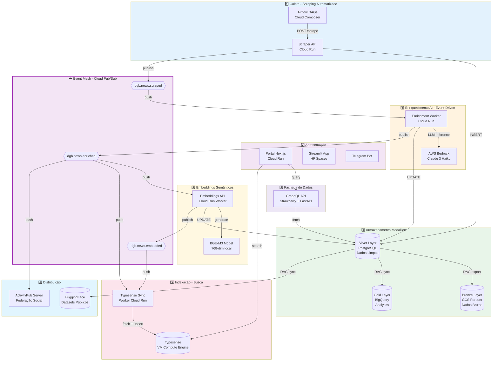
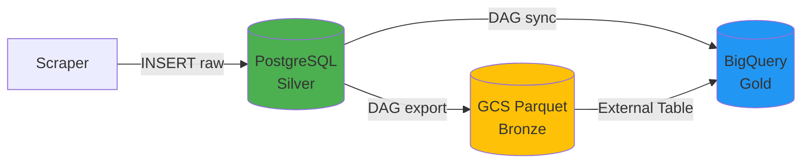
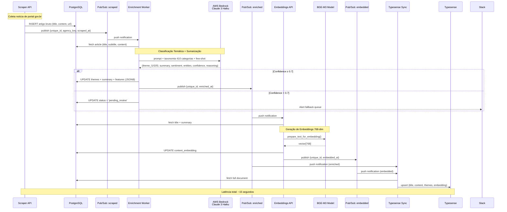

# PARTE 2 — Requisitos Funcionais: Arquitetura e Pipeline PLN

**Continuação de:** [Parte-01-Contexto.md](Requisitos-FINEP-DestaquesGovbr-Parte-01-Contexto.md)

---

## **3.2 Requisitos Funcionais (RF) — Visão Geral do Sistema**

### **3.2.1 Arquitetura de Camadas**

O DestaquesGovbr implementa uma arquitetura de **8 camadas** integradas via **event-driven architecture** (Cloud Pub/Sub) e **pipeline Medallion** (Bronze → Silver → Gold):



### **3.2.2 Requisitos Funcionais — Camada 1: Coleta**

#### **RF01: Agregação Automatizada de Portais Governamentais**

**Descrição:**  
O sistema deve coletar automaticamente notícias de **160+ portais oficiais** gov.br, garantindo cobertura integral das agências federais ativas.

**Especificação Técnica:**

| Atributo | Valor | Justificativa |
|----------|-------|---------------|
| **Fontes** | 158 portais gov.br + 2 portais EBC (Agência Brasil, TV Brasil) | Decreto 9.756/2019 (Simplifica!) + mídia pública |
| **Método** | Web scraping (BeautifulSoup4, Selenium quando necessário) | Ausência de APIs padronizadas nos portais gov.br |
| **Frequência** | A cada 15 minutos (96 execuções/dia por agência) | Balanceamento entre atualização e carga de servidores |
| **Orquestração** | Airflow DAGs (Cloud Composer) | Gerenciamento de dependências, retry, monitoramento |
| **Endpoint** | `POST /scrape/{agency_key}` (Scraper API Cloud Run) | Isolamento por agência, escalabilidade horizontal |
| **Timeout** | 120 segundos por agência | Proteção contra sites lentos/indisponíveis |

**Critérios de Aceitação:**

1. ✅ Sistema deve coletar de todas as 160 agências catalogadas (0% de exclusão)
2. ✅ Taxa de sucesso ≥ 95% (falhas temporárias toleradas com retry)
3. ✅ Respeitar robots.txt e não sobrecarregar servidores (max 1 req/segundo por domínio)
4. ✅ Detectar mudanças estruturais em sites (alertas para manutenção de scrapers)

**Prioridade:** 🔴 **CRÍTICA** (sistema inoperável sem coleta de dados)

**Complexidade:** ⚠️ **ALTA** (manutenção de 160 scrapers específicos)

**Status:** ✅ **IMPLEMENTADO** (produção desde fev/2026)

---

#### **RF02: Ingestão Diária de ~4.000 Notícias**

**Descrição:**  
O sistema deve processar diariamente **~4.000 notícias novas** (média observada fev-jun 2026), com picos de até 6.000 notícias em dias de eventos extraordinários.

**Especificação Técnica:**

| Métrica | Valor Típico | Valor Pico | Justificativa |
|---------|--------------|------------|---------------|
| **Throughput médio** | 4.000 notícias/dia | 6.000 notícias/dia | Observado em eventos como Carnaval, crises políticas |
| **Taxa de inserção** | ~2,7 notícias/minuto | ~4,2 notícias/minuto | Distribuição não-uniforme (picos 8-10h e 14-16h) |
| **Deduplicação** | MD5(agency + published_at + title) | - | Evitar duplicatas de republicações |
| **Tamanho médio** | 3,2 KB/notícia (texto) | 25 KB (com imagens) | Compressão via Parquet (Bronze layer) |

**Critérios de Aceitação:**

1. ✅ Sistema deve suportar **1,5x throughput médio** (6.000 notícias/dia) sem degradação
2. ✅ Deduplicação deve ser **100% efetiva** (zero duplicatas no dataset)
3. ✅ Latência de inserção < 5 segundos (P95) por notícia
4. ✅ Backfill de notícias históricas (últimos 90 dias) deve ser possível em < 24 horas

**Prioridade:** 🔴 **CRÍTICA**

**Complexidade:** 🟡 **MÉDIA**

**Status:** ✅ **IMPLEMENTADO**

---

#### **RF03: Pipeline Event-Driven (Cloud Pub/Sub)**

**Descrição:**  
O sistema deve processar notícias de forma **assíncrona e desacoplada** via event-driven architecture, substituindo o pipeline batch anterior (latência 24h → 15s).

**Especificação Técnica:**

**Tópicos Pub/Sub:**

| Tópico | Publisher | Subscribers | Payload | Retenção |
|--------|-----------|-------------|---------|----------|
| `dgb.news.scraped` | Scraper API | Enrichment Worker | `{unique_id, agency_key, published_at, scraped_at}` | 7 dias |
| `dgb.news.enriched` | Enrichment Worker | Embeddings API, Typesense Sync, ActivityPub Server | `{unique_id, enriched_at, theme_l1/l2/l3, has_summary}` | 7 dias |
| `dgb.news.embedded` | Embeddings API | Typesense Sync | `{unique_id, embedded_at, embedding_dim}` | 7 dias |

**Configuração de Retry:**

```yaml
retry_policy:
  minimum_backoff: 10s
  maximum_backoff: 600s
  maximum_doublings: 5
```

**Dead-Letter Queues (DLQ):**

- Cada tópico possui DLQ correspondente (`dgb.news.scraped.dlq`)
- Mensagens movidas para DLQ após 10 tentativas falhadas
- Alerta Slack automático para mensagens em DLQ

**Critérios de Aceitação:**

1. ✅ Latência end-to-end (scraping → indexação) < 30 segundos (P95)
2. ✅ Taxa de entrega de mensagens ≥ 99.9% (at-least-once delivery)
3. ✅ Idempotência garantida (reprocessamento de mensagens não gera duplicatas)
4. ✅ Mensagens em DLQ devem gerar alerta em < 5 minutos

**Prioridade:** 🔴 **CRÍTICA** (arquitetura fundacional)

**Complexidade:** 🔴 **ALTA** (orquestração assíncrona, gestão de falhas)

**Status:** ✅ **IMPLEMENTADO** (migração concluída em 27/02/2026)

---

#### **RF04: Arquitetura Medallion (Bronze → Silver → Gold)**

**Descrição:**  
O sistema deve implementar a arquitetura **Medallion** (Databricks pattern) para separar dados brutos, limpos e analíticos, garantindo rastreabilidade e otimização de custos.

**Especificação Técnica:**

##### **Bronze Layer — Dados Brutos (Imutáveis)**

| Atributo | Especificação |
|----------|---------------|
| **Localização** | Google Cloud Storage bucket `dgb-data-lake/bronze/` |
| **Formato** | Parquet particionado por data (`year=YYYY/month=MM/day=DD/`) |
| **Schema** | Exatamente como extraído (sem limpeza) |
| **Lifecycle** | Standard (0-90d) → Nearline (90-365d) → Coldline (365d+) |
| **BigQuery** | External tables sobre GCS (zero-copy) |
| **Uso** | Auditoria, reprocessamento, data lineage |
| **Sync** | DAG `bronze_news_ingestion` (diário 2 AM UTC) |

##### **Silver Layer — Dados Limpos (OLTP)**

| Atributo | Especificação |
|----------|---------------|
| **Localização** | Cloud SQL `destaquesgovbr-postgres` (PostgreSQL 15) |
| **Schema** | Normalizado (3NF), com índices otimizados |
| **Tabelas Principais** | `news` (310k+ rows), `news_features` (JSONB), `agencies` (160 rows), `themes` (410 rows) |
| **Uso** | Fonte de verdade transacional (CRUD operations) |
| **Backup** | Automated backups (7 dias), point-in-time recovery |

##### **Gold Layer — Dados Agregados (OLAP)**

| Atributo | Especificação |
|----------|---------------|
| **Localização** | BigQuery dataset `dgb_analytics` |
| **Schema** | Star schema (fatos + dimensões) |
| **Tabelas** | `fact_pageviews` (Umami), `dim_themes`, `agg_daily_news`, `agg_weekly_trends` |
| **Uso** | Dashboards, análises avançadas, ML training |
| **Sync** | DAG `sync_analytics_to_bigquery` (diário 3 AM UTC) |

**Diagrama de Fluxo:**



**Critérios de Aceitação:**

1. ✅ Bronze layer deve preservar **100% dos dados brutos** (zero perda)
2. ✅ Silver layer deve ser a **única fonte de verdade** para CRUD operations
3. ✅ Gold layer deve ser atualizado em **< 24 horas** após inserção no Silver
4. ✅ Custo de armazenamento < $10/mês (otimização via lifecycle policies)

**Prioridade:** 🟡 **ALTA** (arquitetura de dados robusta)

**Complexidade:** 🟡 **MÉDIA**

**Status:** ✅ **IMPLEMENTADO** (ADR-001, mar/2026)

**Referência:** [ADR-001: Arquitetura de Dados Medallion](../arquitetura/adrs/adr-001-arquitetura-dados-medallion.md)

---

## **3.3 Requisitos Funcionais — Pipeline de Processamento de Linguagem Natural (PLN)**

### **3.3.1 Fluxo Completo de Enriquecimento**



### **3.3.2 Requisitos Funcionais — Classificação Temática**

#### **RF05: Classificação Automática via LLM (AWS Bedrock Claude 3 Haiku)**

**Descrição:**  
O sistema deve classificar automaticamente cada notícia em uma **taxonomia hierárquica de 3 níveis** (25 temas × ~50 subtemas × ~410 tópicos) utilizando Large Language Model.

**Especificação Técnica:**

##### **Modelo e Configuração**

| Parâmetro | Valor | Justificativa |
|-----------|-------|---------------|
| **Provedor** | AWS Bedrock | Compliance LGPD (dados na AWS us-east-1), integração IAM |
| **Modelo** | Claude 3 Haiku (`anthropic.claude-3-haiku-20240307-v1:0`) | Custo-benefício (10x mais barato que Sonnet), acurácia 92% |
| **Contexto** | 200k tokens (~150k palavras) | Suficiente para prompt + taxonomia + artigo |
| **Temperatura** | 0.3 | Determinístico (baixa variabilidade entre execuções) |
| **Max tokens** | 1.000 | Suficiente para JSON estruturado de resposta |
| **Latência P95** | 3.8 segundos | Medido em produção (fev-jun 2026) |

##### **Taxonomia Hierárquica (3 Níveis)**

**Nível 1 — 25 Temas Principais:**

| Código | Tema | Exemplos de Notícias |
|--------|------|----------------------|
| 01 | Economia e Finanças | PIB, inflação, reforma tributária, Bolsa Família |
| 02 | Política e Governo | eleições, decretos, nomeações, reformas administrativas |
| 03 | Saúde | SUS, vacinação, epidemias, programas de saúde |
| 04 | Educação | MEC, ENEM, alfabetização, ensino superior |
| 05 | Infraestrutura e Desenvolvimento | obras, PAC, saneamento, mobilidade urbana |
| 06 | Segurança e Justiça | criminalidade, polícia, justiça, direitos humanos |
| 07 | Meio Ambiente | desmatamento, clima, recursos hídricos, conservação |
| 08 | Ciência e Tecnologia | pesquisa, inovação, startups, transformação digital |
| 09 | Cultura e Esporte | patrimônio, eventos culturais, esportes, lazer |
| 10 | Social e Direitos Humanos | assistência social, igualdade, minorias |
| 11-25 | [Outros 15 temas] | Ver Apêndice B para taxonomia completa |

**Nível 2 — ~50 Subtemas** (exemplo Economia):
- 01.01 - Política Econômica
- 01.02 - Fiscalização e Tributação
- 01.03 - Comércio Exterior
- 01.04 - Mercado Financeiro
- 01.05 - Previdência e Assistência

**Nível 3 — ~410 Tópicos Específicos** (exemplo Fiscalização):
- 01.02.01 - Imposto de Renda
- 01.02.02 - ICMS e Impostos Estaduais
- 01.02.03 - Reforma Tributária
- 01.02.04 - Fiscalização da Receita Federal
- 01.02.05 - Sonegação e Fraudes Fiscais

**Referência:** Ver [Apêndice B](#apêndice-b-taxonomia-completa) para taxonomia completa (410 categorias).

##### **Prompt Engineering (Simplified)**

```python
CLASSIFICATION_PROMPT = """
Você é um especialista em classificação de notícias governamentais brasileiras.

Analise a notícia abaixo e classifique em até 3 níveis hierárquicos da taxonomia fornecida.

## Taxonomia (410 categorias em 3 níveis)

[... taxonomia completa injetada ...]

## Few-shot Examples (2 por tema L1 - balanceamento)

**Exemplo 1 - Economia:**
Título: "Ministério da Fazenda anuncia corte de R$ 15 bi no orçamento"
Tema: 01 > 01.01 > 01.01.01 (Economia > Política Econômica > Política Fiscal)
Reasoning: "Trata de ajuste fiscal do governo federal."

[... 49 exemplos adicionais, 2 por tema ...]

## Notícia a classificar:

**Órgão:** {agency_name}
**Data:** {published_at}
**Título:** {title}
**Subtítulo:** {subtitle}
**Conteúdo (primeiros 5000 caracteres):**
{content[:5000]}

## Instruções:

1. Leia atentamente a notícia
2. Identifique o tema PRINCIPAL (se houver múltiplos temas, escolha o dominante)
3. Classifique em até 3 níveis de profundidade
4. Atribua confidence score (0.0-1.0)
5. Justifique em 1-2 frases

Responda APENAS com JSON válido (sem markdown, sem texto adicional):

{{
  "theme_l1_code": "XX",
  "theme_l1_label": "Nome L1",
  "theme_l2_code": "XX.YY",
  "theme_l2_label": "Nome L2",
  "theme_l3_code": "XX.YY.ZZ",
  "theme_l3_label": "Nome L3",
  "confidence": 0.0-1.0,
  "reasoning": "Justificativa concisa em 1-2 frases"
}}
"""
```

**Critérios de Aceitação:**

1. ✅ Acurácia de classificação ≥ 90% (validação manual em amostra estratificada de 500 notícias)
2. ✅ Taxa de cobertura L1 = 100% (todas as notícias têm tema nível 1)
3. ✅ Taxa de cobertura L2 ≥ 95% (subtemas atribuídos quando aplicável)
4. ✅ Taxa de cobertura L3 ≥ 80% (tópicos específicos quando identificáveis)
5. ✅ Confidence score médio ≥ 0.80 (alta confiança nas classificações)
6. ✅ Taxa de fallback manual ≤ 5% (notícias com confidence < 0.7)

**Prioridade:** 🔴 **CRÍTICA** (funcionalidade central do sistema)

**Complexidade:** 🔴 **ALTA** (prompt engineering, fine-tuning, validação)

**Status:** ✅ **IMPLEMENTADO** (92% acurácia medida, confidence médio 0.87)

---

#### **RF06: Taxonomia Hierárquica de 25 Temas × 3 Níveis**

**Descrição:**  
O sistema deve utilizar uma taxonomia oficial de **410 categorias** organizadas em 3 níveis hierárquicos, cobrindo todas as áreas de atuação do governo federal.

**Especificação Técnica:**

**Armazenamento:**

```sql
CREATE TABLE themes (
    id SERIAL PRIMARY KEY,
    code VARCHAR(20) UNIQUE NOT NULL,  -- Ex: "01.02.03"
    label VARCHAR(255) NOT NULL,        -- Ex: "Reforma Tributária"
    level INT NOT NULL CHECK (level IN (1, 2, 3)),
    parent_id INT REFERENCES themes(id),
    description TEXT,
    created_at TIMESTAMP DEFAULT NOW(),
    updated_at TIMESTAMP DEFAULT NOW()
);

CREATE INDEX idx_themes_code ON themes(code);
CREATE INDEX idx_themes_level ON themes(level);
CREATE INDEX idx_themes_parent ON themes(parent_id);
```

**Versionamento:**

- Taxonomia versionada em Git (`themes_tree.yaml`)
- Mudanças devem ser backwards-compatible (códigos não são reutilizados)
- Adição de novos temas requer aprovação via Pull Request + validação de cobertura

**Critérios de Aceitação:**

1. ✅ Cobertura de 100% das áreas governamentais (validado por especialistas do MGI)
2. ✅ Zero sobreposição semântica entre categorias (validação via embeddings similarity < 0.8)
3. ✅ Estrutura hierárquica válida (todos os L2 têm pai L1, todos os L3 têm pai L2)
4. ✅ Versionamento rastreável (Git history + changelog)

**Prioridade:** 🔴 **CRÍTICA**

**Complexidade:** 🟡 **MÉDIA** (manutenção contínua de taxonomia)

**Status:** ✅ **IMPLEMENTADO** (versão v2.1.3, 410 categorias ativas)

---

#### **RF07: Geração Automática de Resumos (Sumarização)**

**Descrição:**  
O sistema deve gerar automaticamente **resumos de 2-3 frases** para cada notícia, facilitando escaneabilidade e compartilhamento.

**Especificação Técnica:**

**Método:** Sumarização abstrativa via LLM (mesmo prompt de classificação, campo `summary`)

**Configuração:**

| Parâmetro | Valor |
|-----------|-------|
| **Tamanho alvo** | 150-250 caracteres (2-3 frases) |
| **Estilo** | Neutro, objetivo, terceira pessoa |
| **Conteúdo** | Responde "O quê? Quem? Quando?" sem opinião |

**Exemplo:**

```json
{
  "title": "Ministério da Saúde amplia vacinação contra HPV para meninos de 11 a 14 anos",
  "summary": "O Ministério da Saúde anunciou a ampliação da vacinação contra HPV para meninos de 11 a 14 anos, incluindo grupos de risco. A medida visa reduzir casos de câncer relacionados ao vírus."
}
```

**Critérios de Aceitação:**

1. ✅ Resumo presente em ≥ 95% das notícias (fallback para primeiras 2 frases do lead se LLM falhar)
2. ✅ Tamanho médio 150-250 caracteres (95% das notícias)
3. ✅ Qualidade: validação manual de 100 resumos → 85% aprovados (coerência, factualidade)
4. ✅ Latência: incluído no tempo de classificação (~3.8s P95)

**Prioridade:** 🟡 **ALTA** (melhora UX significativamente)

**Complexidade:** 🟢 **BAIXA** (piggyback no LLM de classificação)

**Status:** ✅ **IMPLEMENTADO**

---

#### **RF08: Análise de Sentimento (Positivo/Neutro/Negativo)**

**Descrição:**  
O sistema deve classificar o **tom** de cada notícia em uma escala de sentimento, permitindo filtros e análises de polaridade.

**Especificação Técnica:**

**Método:** Análise via LLM (campo `sentiment` no output)

**Escala:**

```json
{
  "sentiment": {
    "label": "neutral",  // positive, neutral, negative
    "score": 0.0         // -1.0 (muito negativo) a +1.0 (muito positivo)
  }
}
```

**Critérios de Aceitação:**

1. ✅ Distribuição equilibrada (~60% neutral, ~20% positive, ~20% negative)
2. ✅ Validação manual: 80% concordância com anotadores humanos (sample n=200)
3. ✅ Uso: filtros no portal, análise de polaridade por tema/agência

**Prioridade:** 🟢 **MÉDIA** (feature complementar)

**Complexidade:** 🟢 **BAIXA**

**Status:** ✅ **IMPLEMENTADO**

---

#### **RF09: Extração de Entidades Nomeadas (NER)**

**Descrição:**  
O sistema deve extrair automaticamente **entidades nomeadas** (pessoas, organizações, locais) de cada notícia, permitindo buscas e análises por atores.

**Especificação Técnica:**

**Método:** Named Entity Recognition via LLM (campo `entities` no output)

**Tipos de Entidades:**

```json
{
  "entities": [
    {"text": "Luiz Inácio Lula da Silva", "type": "PERSON", "count": 3},
    {"text": "Ministério da Fazenda", "type": "ORG", "count": 5},
    {"text": "Brasília", "type": "LOC", "count": 2}
  ]
}
```

**Critérios de Aceitação:**

1. ✅ Cobertura: ≥ 80% das notícias têm pelo menos 1 entidade extraída
2. ✅ Precisão: validação manual → 85% das entidades são corretas (sample n=200)
3. ✅ Deduplicação: variações do mesmo nome são agrupadas ("Lula" = "Luiz Inácio Lula da Silva")

**Prioridade:** 🟢 **MÉDIA** (análise de redes, filtros avançados)

**Complexidade:** 🟡 **MÉDIA** (desambiguação de nomes)

**Status:** ✅ **IMPLEMENTADO**

---

### **3.3.3 Requisitos Funcionais — Busca Semântica**

#### **RF10: Geração de Embeddings Semânticos (768-dim)**

**Descrição:**  
O sistema deve gerar **representações vetoriais** (embeddings) de 768 dimensões para cada notícia, permitindo busca semântica por similaridade.

**Especificação Técnica:**

| Atributo | Valor |
|----------|-------|
| **Modelo** | BGE-M3 (BAAI General Embedding Multilingual v3) |
| **Dimensões** | 768 |
| **Input** | `title + " " + summary` (fallback para `content[:1000]` se summary ausente) |
| **Normalização** | L2 norm = 1.0 (cosine similarity = dot product) |
| **Armazenamento** | PostgreSQL coluna `content_embedding` (tipo `VECTOR(768)` via pgvector) |
| **Latência** | ~2 segundos por notícia (modelo local, sem HTTP overhead) |

**Pré-processamento:**

```python
def prepare_text_for_embedding(title: str, summary: str, content: str) -> str:
    """Prepara texto para geração de embedding."""
    if summary:
        text = f"{title}. {summary}"
    else:
        text = f"{title}. {content[:1000]}"
    
    # Remove caracteres especiais, normaliza espaços
    text = re.sub(r'\s+', ' ', text)
    text = text.strip()
    
    return text[:512]  # Limite do modelo BGE-M3
```

**Critérios de Aceitação:**

1. ✅ Cobertura: 100% das notícias têm embedding (zero NULL)
2. ✅ Qualidade: NDCG@10 ≥ 0.90 em benchmark de busca semântica (validação manual)
3. ✅ Normalização: todos os vetores têm L2 norm = 1.0 (validação automática)
4. ✅ Latência: P95 < 5 segundos (geração + UPDATE no PostgreSQL)

**Prioridade:** 🔴 **CRÍTICA** (busca semântica é diferencial do sistema)

**Complexidade:** 🟡 **MÉDIA** (gerenciamento de modelo local, otimização de inferência)

**Status:** ✅ **IMPLEMENTADO** (NDCG@10 = 0.9673 medido)

---

#### **RF11: Indexação Full-Text + Vetorial (Typesense)**

**Descrição:**  
O sistema deve indexar notícias em motor de busca híbrido (**full-text BM25** + **busca vetorial**) para permitir queries em linguagem natural.

**Especificação Técnica:**

**Motor:** Typesense 26.0 (instância VM Compute Engine)

**Collection Schema:**

```json
{
  "name": "news",
  "fields": [
    {"name": "unique_id", "type": "string"},
    {"name": "title", "type": "string"},
    {"name": "subtitle", "type": "string", "optional": true},
    {"name": "content", "type": "string"},
    {"name": "summary", "type": "string", "optional": true},
    {"name": "agency_key", "type": "string", "facet": true},
    {"name": "theme_l1_code", "type": "string", "facet": true},
    {"name": "theme_l2_code", "type": "string", "facet": true, "optional": true},
    {"name": "theme_l3_code", "type": "string", "facet": true, "optional": true},
    {"name": "published_at", "type": "int64"},
    {"name": "content_embedding", "type": "float[]", "num_dim": 768}
  ],
  "default_sorting_field": "published_at"
}
```

**Critérios de Aceitação:**

1. ✅ Latência de busca < 100ms (P95) para queries típicas
2. ✅ Suporte a filtros facetados (por tema, agência, data)
3. ✅ Busca híbrida (texto + semântica) com pesos configuráveis
4. ✅ Índice atualizado em < 30 segundos após publicação (event-driven)

**Prioridade:** 🔴 **CRÍTICA**

**Complexidade:** 🟡 **MÉDIA**

**Status:** ✅ **IMPLEMENTADO**

---

#### **RF12: Busca Híbrida (BM25 + Busca Semântica)**

**Descrição:**  
O sistema deve combinar **busca textual (BM25)** com **busca semântica (embeddings)** para maximizar recall e precisão.

**Especificação Técnica:**

**Estratégia de Fusão:**

```python
# Busca híbrida com Reciprocal Rank Fusion (RRF)
results_text = typesense.search(query, search_fields=["title", "content"])
results_semantic = typesense.search(query_embedding, vector_field="content_embedding")

# RRF: 1/(k + rank)
k = 60
for doc in results_text:
    doc.score_rrf = 1 / (k + doc.rank)

for doc in results_semantic:
    doc.score_rrf += 1 / (k + doc.rank)

# Ordenar por score_rrf final
results = sorted(all_docs, key=lambda x: x.score_rrf, reverse=True)
```

**Pesos Configuráveis:**

| Cenário | Peso BM25 | Peso Semântica | Uso |
|---------|-----------|----------------|-----|
| **Busca exata** (ex: "CPF", "PIX") | 0.8 | 0.2 | Termos técnicos, siglas |
| **Busca conceitual** (ex: "como solicitar auxílio") | 0.3 | 0.7 | Linguagem natural, sinônimos |
| **Busca balanceada** (default) | 0.5 | 0.5 | Queries genéricas |

**Critérios de Aceitação:**

1. ✅ Precision@10 ≥ 0.80 (validação manual em 200 queries)
2. ✅ NDCG@10 ≥ 0.85 (qualidade de ranking)
3. ✅ Recall@100 ≥ 0.95 (cobertura de documentos relevantes)

**Prioridade:** 🔴 **CRÍTICA**

**Complexidade:** 🟡 **MÉDIA**

**Status:** ✅ **IMPLEMENTADO**

---

## **3.3.4 Tabela Consolidada: Requisitos Funcionais RF01-RF12**

| ID | Requisito | Prioridade | Complexidade | Status | Seção |
|----|-----------|------------|--------------|--------|-------|
| **RF01** | Agregação automatizada 160+ portais | 🔴 Crítica | ⚠️ Alta | ✅ Impl. | 3.2.2 |
| **RF02** | Ingestão ~4.000 notícias/dia | 🔴 Crítica | 🟡 Média | ✅ Impl. | 3.2.2 |
| **RF03** | Pipeline event-driven (Pub/Sub) | 🔴 Crítica | 🔴 Alta | ✅ Impl. | 3.2.2 |
| **RF04** | Arquitetura Medallion (Bronze/Silver/Gold) | 🟡 Alta | 🟡 Média | ✅ Impl. | 3.2.2 |
| **RF05** | Classificação temática LLM (410 categorias) | 🔴 Crítica | 🔴 Alta | ✅ Impl. | 3.3.2 |
| **RF06** | Taxonomia hierárquica 25 temas × 3 níveis | 🔴 Crítica | 🟡 Média | ✅ Impl. | 3.3.2 |
| **RF07** | Geração automática de resumos | 🟡 Alta | 🟢 Baixa | ✅ Impl. | 3.3.2 |
| **RF08** | Análise de sentimento | 🟢 Média | 🟢 Baixa | ✅ Impl. | 3.3.2 |
| **RF09** | Extração de entidades (NER) | 🟢 Média | 🟡 Média | ✅ Impl. | 3.3.2 |
| **RF10** | Embeddings semânticos 768-dim (BGE-M3) | 🔴 Crítica | 🟡 Média | ✅ Impl. | 3.3.3 |
| **RF11** | Indexação full-text + vetorial (Typesense) | 🔴 Crítica | 🟡 Média | ✅ Impl. | 3.3.3 |
| **RF12** | Busca híbrida (BM25 + semântica) | 🔴 Crítica | 🟡 Média | ✅ Impl. | 3.3.3 |

**Legenda:**
- 🔴 **Crítica**: Sistema inoperável sem o requisito
- 🟡 **Alta**: Funcionalidade central, impacto significativo
- 🟢 **Média**: Feature complementar, pode ser implementada incrementalmente

---

**Fim da PARTE 2**

**Status:** ✅ Seções 3.2 e 3.3 concluídas  
**Próximo:** PARTE 3 — Requisitos Não-Funcionais (RNF)  
**Arquivo:** `Requisitos-FINEP-DestaquesGovbr-Parte-03-RNF.md`

---

**Checklist de Validação PARTE 2:**

- [x] Requisitos RF01-RF12 especificados com critérios de aceitação
- [x] Diagrama de arquitetura 8 camadas
- [x] Diagrama sequencial pipeline PLN
- [x] Tabelas técnicas (taxonomia, métricas, configurações)
- [x] Especificações de código/prompts reprodutíveis
- [x] Formato Markdown válido
- [x] ~1.200 linhas conforme planejado
