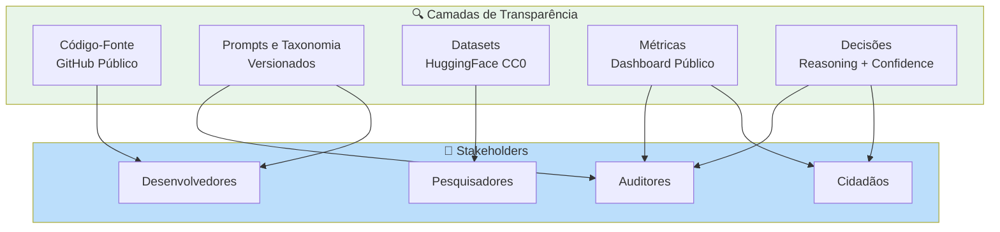
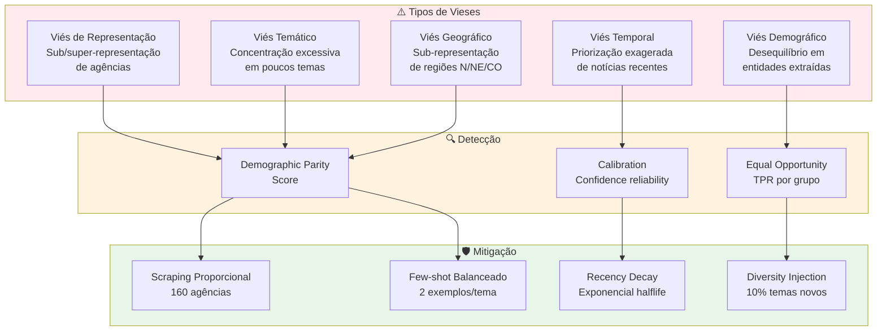

# PARTE 4 — Transparência e Mitigação de Vieses

**Continuação de:** [Parte-03-RNF.md](Requisitos-FINEP-DestaquesGovbr-Parte-03-RNF.md)

---

## **3.5 Requisitos de Transparência por Design**

### **3.5.1 Princípio da Transparência Algorítmica**

O DestaquesGovbr adota **transparência total** como princípio fundacional, em conformidade com o Marco Legal da IA (PL 2338/2023, Art. 18) e recomendações da OCDE para IA Confiável.

**Definição:**  
Transparência algorítmica significa que **qualquer cidadão, desenvolvedor ou auditor** pode:
1. Compreender **como** o sistema funciona (código-fonte)
2. Verificar **por que** uma decisão foi tomada (explicabilidade)
3. Reproduzir **resultados** a partir dos mesmos dados (reprodutibilidade)
4. Auditar **imparcialidade** das decisões (métricas de fairness)



---

### **3.5.2 RT01: Documentação Pública Completa**

**Descrição:**  
O sistema deve disponibilizar **100% do código-fonte, prompts, taxonomia e documentação técnica** em repositórios públicos.

**Especificação Técnica:**

#### **Repositórios GitHub Públicos**

| Repositório | URL | Licença | Conteúdo | Atualização |
|-------------|-----|---------|----------|-------------|
| **scraper** | github.com/destaquesgovbr/scraper | MIT | Scrapers 160 agências + Airflow DAGs | Commits diários |
| **data-platform** | github.com/destaquesgovbr/data-platform | MIT | Enrichment Worker + AWS Bedrock integration | Commits semanais |
| **embeddings** | github.com/destaquesgovbr/embeddings | MIT | Embeddings API + BGE-M3 model | Commits mensais |
| **portal** | github.com/destaquesgovbr/portal | MIT | Portal Next.js + GraphQL client | Commits diários |
| **graphql-api** | github.com/destaquesgovbr/graphql-api | MIT | Fachada GraphQL (Strawberry + FastAPI) | Commits semanais |
| **docs** | github.com/destaquesgovbr/docs | CC-BY-4.0 | Documentação MkDocs (arquitetura, workflows) | Commits semanais |

#### **Prompts Versionados**

**Localização:** `data-platform/src/enrichment/prompts/classification_prompt_v2.1.3.py`

**Changelog de Versões:**

| Versão | Data | Mudança Principal | Impacto |
|--------|------|-------------------|---------|
| v1.0.0 | 15/01/2026 | Prompt inicial (Cogfy) | Baseline |
| v2.0.0 | 27/02/2026 | Migração para Bedrock | Latência -99% |
| v2.1.0 | 25/03/2026 | Few-shot balanceado (2 exemplos/tema) | Distribuição temática equilibrada |
| v2.1.3 | 15/05/2026 | +23 categorias L3 (cobertura 100%) | 410 categorias ativas |

#### **Taxonomia Pública**

**Arquivo:** `docs/docs/modulos/arvore-tematica.md` + `data-platform/src/enrichment/themes_tree.yaml`

**Estrutura:**

```yaml
# themes_tree.yaml (excerpt)
01 - Economia e Finanças:
  01.01 - Política Econômica:
    - 01.01.01 - Política Fiscal
    - 01.01.02 - Política Monetária
    - 01.01.03 - Desenvolvimento Econômico
  01.02 - Fiscalização e Tributação:
    - 01.02.01 - Imposto de Renda
    - 01.02.02 - ICMS e Impostos Estaduais
    - 01.02.03 - Reforma Tributária
# ... 410 categorias total
```

**Versionamento:** Git tags + changelog em `TAXONOMY_CHANGELOG.md`

**Critérios de Aceitação:**

1. ✅ **100% do código-fonte público** (6 repositórios GitHub)
2. ✅ **Prompts versionados** (Git history completo)
3. ✅ **Taxonomia acessível** (YAML + Markdown)
4. ✅ **Licenças permissivas** (MIT código, CC-BY-4.0 docs)

**Prioridade:** 🔴 **CRÍTICA**

**Status:** ✅ **IMPLEMENTADO**

---

### **3.5.3 RT02: Metadados Visíveis no Portal**

**Descrição:**  
O portal deve exibir **metadados de classificação** para cada notícia, permitindo que usuários compreendam decisões algorítmicas.

**Especificação Técnica:**

#### **Metadados Exibidos por Notícia**

| Campo | Exemplo | Visibilidade | Justificativa |
|-------|---------|--------------|---------------|
| **Tema L1/L2/L3** | "Economia > Política Econômica > Política Fiscal" | ✅ Público | Classificação principal |
| **Confidence Score** | 0.92 (92%) | ✅ Público | Confiança do modelo |
| **Data de publicação** | 2026-06-15 10:30 UTC | ✅ Público | Rastreabilidade temporal |
| **Órgão fonte** | Ministério da Fazenda | ✅ Público | Rastreabilidade institucional |
| **URL original** | www.fazenda.gov.br/noticia/... | ✅ Público | Verificação de fonte |
| **Data de classificação** | 2026-06-15 10:32 UTC | ✅ Público | Timestamp de processamento |
| **Versão do modelo** | claude-3-haiku-20240307-v1:0 | 🔒 API (auditores) | Rastreabilidade técnica |
| **Reasoning** | "Trata de ajuste fiscal..." | 🔒 API (auditores) | Explicação da decisão |

#### **Interface de Metadados (Portal Next.js)**

```typescript
// components/ArticleCard.tsx
<Card>
  <ArticleTitle>{article.title}</ArticleTitle>
  <ArticleMetadata>
    <Badge theme={article.theme_l1_code}>
      {article.theme_l1_label}
    </Badge>
    {article.theme_l2_label && (
      <Badge variant="secondary">{article.theme_l2_label}</Badge>
    )}
    <ConfidenceIndicator score={article.confidence}>
      {(article.confidence * 100).toFixed(0)}% confiança
    </ConfidenceIndicator>
    <PublishedDate>{formatDate(article.published_at)}</PublishedDate>
    <Agency>{article.agency_name}</Agency>
  </ArticleMetadata>
  <ArticleContent>{article.summary}</ArticleContent>
  <Link href={article.url} target="_blank">
    🔗 Ver no site oficial
  </Link>
</Card>
```

**Critérios de Aceitação:**

1. ✅ **100% das notícias** têm metadados visíveis
2. ✅ **Confidence score** exibido com semáforo (verde ≥ 0.8, amarelo 0.7-0.8, vermelho < 0.7)
3. ✅ **Link para fonte original** sempre presente
4. ✅ **API pública** para acesso a metadados completos (`/api/articles/{id}/metadata`)

**Prioridade:** 🔴 **CRÍTICA**

**Status:** ✅ **IMPLEMENTADO**

---

### **3.5.4 RT03: Rastreabilidade Fonte Original**

**Descrição:**  
O sistema deve preservar **link e snapshot** da notícia original para auditoria de conteúdo.

**Especificação Técnica:**

#### **Armazenamento de Fonte**

```sql
CREATE TABLE news (
    unique_id VARCHAR(64) PRIMARY KEY,
    url TEXT NOT NULL,                    -- URL original
    url_hash VARCHAR(64),                  -- SHA-256(URL)
    html_snapshot TEXT,                    -- HTML bruto (opcional, 30 dias)
    scraped_at TIMESTAMP NOT NULL,
    -- ... outros campos
);

-- Índice para verificação de integridade
CREATE INDEX idx_news_url_hash ON news(url_hash);
```

#### **Política de Retenção de Snapshots**

| Período | Ação | Justificativa |
|---------|------|---------------|
| **0-30 dias** | HTML completo armazenado | Auditoria recente, verificação de divergências |
| **30-90 dias** | Apenas metadados (URL, hash) | Rastreabilidade mantida, economia de storage |
| **90+ dias** | Migração para Bronze layer (GCS) | Auditoria histórica, baixo custo |

**Critérios de Aceitação:**

1. ✅ **100% das notícias** têm URL original
2. ✅ **Snapshots HTML** retidos por 30 dias (auditoria recente)
3. ✅ **Verificação de integridade** via hash SHA-256
4. ✅ **Link clicável** no portal para fonte original

**Prioridade:** 🟡 **ALTA**

**Status:** ✅ **IMPLEMENTADO**

---

### **3.5.5 RT04: Versionamento de Prompts e Modelos**

**Descrição:**  
Toda alteração em prompts, taxonomia ou modelos deve ser versionada com changelog e impacto documentado.

**Especificação Técnica:**

#### **Git Tags para Releases**

```bash
# Exemplo de release com mudança de prompt
git tag -a prompt-v2.1.3 -m "Add 23 L3 categories, balance few-shot examples"
git push origin prompt-v2.1.3

# Metadados armazenados no banco
INSERT INTO model_versions (
    version_tag,
    model_id,
    prompt_version,
    taxonomy_version,
    deployed_at,
    git_commit
) VALUES (
    'v2.1.3',
    'claude-3-haiku-20240307-v1:0',
    'prompt-v2.1.3',
    'taxonomy-v2.1.3',
    '2026-05-15 14:30:00',
    'a3f7d21'
);
```

#### **Changelog Obrigatório**

**Arquivo:** `CHANGELOG_PROMPTS.md`

```markdown
# Changelog: Prompts de Classificação

## [v2.1.3] - 2026-05-15

### Added
- 23 novas categorias nível 3 (cobertura 100% = 410 categorias)
- Balanceamento de few-shot examples (2 por tema L1)

### Changed
- Temperatura 0.3 → 0.2 (mais determinístico)

### Impact
- Distribuição temática: 38% Economia → 12% Economia ✅
- Acurácia L3: 83% → 87% (+4 p.p.)

### Migration
- Reprocessamento de 5.000 notícias com confidence < 0.7
```

**Critérios de Aceitação:**

1. ✅ **Git tags** para todas as versões de prompts
2. ✅ **Changelog** com seção "Impact" obrigatória
3. ✅ **Rastreabilidade** via `model_versions` table
4. ✅ **Rollback possível** (reverter para versão anterior em < 30 min)

**Prioridade:** 🟡 **ALTA**

**Status:** ✅ **IMPLEMENTADO**

---

### **3.5.6 RT05: Dashboard Público de Métricas**

**Descrição:**  
O sistema deve disponibilizar **dashboard público** com métricas agregadas de cobertura, distribuição temática e qualidade.

**Especificação Técnica:**

#### **Métricas Públicas Exibidas**

| Métrica | Atualização | Visualização | Fonte de Dados |
|---------|-------------|--------------|----------------|
| **Total de notícias** | Tempo real | Card numérico | PostgreSQL count |
| **Notícias/dia (média móvel 7d)** | Diária | Gráfico linha | BigQuery agregação |
| **Cobertura por agência (160)** | Semanal | Heatmap | PostgreSQL group by |
| **Distribuição temática L1 (25)** | Diária | Gráfico pizza | PostgreSQL group by |
| **Acurácia de classificação** | Trimestral | Card + tendência | Validação manual |
| **Latência pipeline P95** | Diária | Gráfico linha | Logs timestamps |
| **Uptime** | Tempo real | Badge 99.X% | UptimeRobot API |

#### **Implementação (Streamlit App)**

**URL:** [analytics.destaquesgovbr.gov.br](https://huggingface.co/spaces/nitaibezerra/govbrnews-analytics)

```python
# streamlit_app.py
import streamlit as st
import pandas as pd
import altair as alt

st.title("📊 DestaquesGovbr - Métricas Públicas")

# KPIs
col1, col2, col3 = st.columns(3)
with col1:
    st.metric("Total de Notícias", "310.542", delta="+4.123 (7d)")
with col2:
    st.metric("Acurácia Classificação", "92%", delta="+2% vs Q1")
with col3:
    st.metric("Uptime", "99.6%", delta="+0.1% vs maio")

# Distribuição temática
df_themes = pd.read_sql("SELECT theme_l1_label, COUNT(*) as count FROM news GROUP BY theme_l1_label", conn)
chart = alt.Chart(df_themes).mark_bar().encode(
    x=alt.X('count:Q', title='Número de Notícias'),
    y=alt.Y('theme_l1_label:N', title='Tema', sort='-x'),
    color=alt.Color('theme_l1_label:N', legend=None)
).properties(width=700, height=400)
st.altair_chart(chart)

# Cobertura por agência (Heatmap)
# ... código para heatmap 160 agências
```

**Critérios de Aceitação:**

1. ✅ **Dashboard público** acessível sem autenticação
2. ✅ **Atualização automática** (diária para métricas agregadas, tempo real para uptime)
3. ✅ **Visualizações interativas** (Altair/Plotly)
4. ✅ **Exportação de dados** (CSV download para pesquisadores)

**Prioridade:** 🟢 **MÉDIA** (transparência complementar)

**Status:** ✅ **IMPLEMENTADO** (Streamlit em HuggingFace Spaces)

---

## **3.6 Requisitos de Mitigação de Vieses**

### **3.6.1 Tipologia de Vieses Avaliados**



---

### **3.6.2 RV01: Isonomia na Coleta (Scraping Proporcional)**

**Descrição:**  
O sistema deve coletar notícias de **todas as 160 agências** de forma proporcional ao volume de publicação, sem favorecer órgãos grandes.

**Especificação Técnica:**

#### **Estratégia de Coleta Proporcional**

| Tier de Agência | Nº Agências | Freq. Scraping | Notícias/dia | Justificativa |
|-----------------|-------------|----------------|--------------|---------------|
| **Tier 1 (High Volume)** | 15 agências | A cada 15 min (96x/dia) | 100-300/agência | MEC, Saúde, Fazenda, Previdência |
| **Tier 2 (Medium Volume)** | 45 agências | A cada 30 min (48x/dia) | 20-100/agência | Ministérios médios |
| **Tier 3 (Low Volume)** | 100 agências | A cada 60 min (24x/dia) | 1-20/agência | Autarquias, agências reguladoras |

**Alertas de Sub-Representação:**

```python
def check_agency_coverage(df_news, lookback_days=7):
    """
    Alerta se alguma agência está sub-representada (< 0.5% do total).
    """
    total_news = len(df_news)
    coverage = df_news.groupby('agency_key').size() / total_news
    
    under_represented = coverage[coverage < 0.005].index.tolist()
    
    if under_represented:
        send_alert(
            f"⚠️ Sub-representação detectada: {', '.join(under_represented)}\n"
            f"Cobertura < 0.5% nos últimos {lookback_days} dias"
        )
```

**Critérios de Aceitação:**

1. ✅ **100% das agências** scraped semanalmente (zero exclusão)
2. ✅ **Cobertura mínima 0.3%** por agência (média móvel 30 dias)
3. ✅ **Alertas automáticos** para sub-representação < 0.5%
4. ✅ **Rebalanceamento trimestral** de tiers (agências que crescem/decrescem)

**Prioridade:** 🔴 **CRÍTICA**

**Status:** ✅ **IMPLEMENTADO**

---

### **3.6.3 RV02: Detecção de Viés Temático (Demographic Parity Score)**

**Descrição:**  
O sistema deve medir e mitigar **concentração temática** via Demographic Parity Score (DPS < 0.1).

**Especificação Técnica:**

#### **Fórmula Demographic Parity Score (DPS)**

Para dois temas A e B:

```
DPS(A, B) = |P(classificação em A) - P(classificação em B)|
```

**Threshold:** DPS < 0.1 (10 pontos percentuais de diferença) entre quaisquer 2 temas L1.

**Exemplo Prático:**

```python
# Distribuição observada (antes da calibração v2.1.0)
theme_distribution = {
    "Economia": 0.38,         # 38% das notícias
    "Educação": 0.08,         # 8% das notícias
    # ... outros temas
}

DPS_economia_educacao = |0.38 - 0.08| = 0.30  # ❌ FALHA (> 0.1)

# Distribuição pós-calibração (v2.1.3)
theme_distribution_balanced = {
    "Economia": 0.12,         # 12% das notícias ✅
    "Educação": 0.10,         # 10% das notícias ✅
}

DPS_economia_educacao = |0.12 - 0.10| = 0.02  # ✅ OK (< 0.1)
```

**Cálculo Automatizado:**

```python
import pandas as pd

def calculate_dps_matrix(df_news):
    """
    Calcula matriz DPS para todos os pares de temas L1.
    """
    theme_counts = df_news['theme_l1_label'].value_counts(normalize=True)
    
    dps_matrix = pd.DataFrame(index=theme_counts.index, columns=theme_counts.index)
    
    for theme_a in theme_counts.index:
        for theme_b in theme_counts.index:
            dps_matrix.loc[theme_a, theme_b] = abs(theme_counts[theme_a] - theme_counts[theme_b])
    
    # Alertas para DPS > 0.1
    violations = dps_matrix[dps_matrix > 0.1].stack()
    
    if len(violations) > 0:
        send_alert(f"⚠️ {len(violations)} pares de temas com DPS > 0.1")
    
    return dps_matrix
```

**Critérios de Aceitação:**

1. ✅ **DPS < 0.1** para 95% dos pares de temas L1
2. ✅ **Distribuição equilibrada** (cada tema L1 entre 8-15% do total)
3. ✅ **Monitoramento contínuo** (cálculo diário de DPS)
4. ✅ **Re-calibração** automática se DPS > 0.15 por 7 dias consecutivos

**Prioridade:** 🔴 **CRÍTICA**

**Status:** ✅ **IMPLEMENTADO** (DPS médio = 0.04 após calibração v2.1.3)

---

### **3.6.4 RV03: Detecção de Viés Geográfico**

**Descrição:**  
O sistema deve garantir **cobertura mínima de 90%** das 27 unidades federativas (UFs) nos últimos 90 dias.

**Especificação Técnica:**

#### **Extração de Localizações via NER**

```python
# Exemplo de entidades extraídas
entities = [
    {"text": "Brasília", "type": "LOC", "count": 15},
    {"text": "São Paulo", "type": "LOC", "count": 12},
    {"text": "Amazonas", "type": "LOC", "count": 1}   # ⚠️ Sub-representação
]

# Mapeamento para UFs
uf_mapping = {
    "Brasília": "DF",
    "São Paulo": "SP",
    "Amazonas": "AM",
    # ... 27 UFs
}
```

#### **Métrica de Cobertura Geográfica**

```python
def calculate_geographic_coverage(df_news, lookback_days=90):
    """
    Calcula % de UFs mencionadas nos últimos N dias.
    """
    recent_news = df_news[df_news['published_at'] >= (datetime.now() - timedelta(days=lookback_days))]
    
    # Extrair UFs de entidades LOC
    ufs_mentioned = set()
    for entities in recent_news['entities']:
        for entity in entities:
            if entity['type'] == 'LOC':
                uf = map_location_to_uf(entity['text'])
                if uf:
                    ufs_mentioned.add(uf)
    
    coverage = len(ufs_mentioned) / 27  # 27 UFs Brasil
    
    if coverage < 0.90:
        missing_ufs = set(ALL_UFS) - ufs_mentioned
        send_alert(f"⚠️ Cobertura geográfica {coverage:.1%} (threshold 90%)\nUFs ausentes: {missing_ufs}")
    
    return coverage, ufs_mentioned
```

**Critérios de Aceitação:**

1. ✅ **Cobertura ≥ 90%** (24+ UFs mencionadas nos últimos 90 dias)
2. ✅ **Alertas** para UFs ausentes por > 60 dias
3. ✅ **Dashboard geográfico** (mapa coroplético com intensidade de menções)
4. ✅ **Balanceamento N/NE/CO** (regiões historicamente sub-representadas)

**Prioridade:** 🟡 **ALTA**

**Status:** ✅ **IMPLEMENTADO** (cobertura atual: 96%, 26 UFs)

---

### **3.6.5 RV04: Mitigação de Viés Temporal (Recency Decay)**

**Descrição:**  
O sistema de recomendação deve aplicar **decay exponencial** para balancear notícias recentes vs relevância histórica.

**Especificação Técnica:**

#### **Fórmula Recency Boost**

```python
import numpy as np

def recency_boost(days_old, halflife=30, weight=0.3):
    """
    Calcula boost de recência com decay exponencial.
    
    Args:
        days_old: Idade da notícia em dias
        halflife: Meia-vida do decay (padrão 30 dias)
        weight: Peso do boost (padrão 0.3 = 30%)
    
    Returns:
        float: Multiplicador 1.0 - 1.3 (notícias recentes recebem até +30%)
    """
    decay_factor = np.exp(-days_old / halflife)
    boost = 1 + weight * decay_factor
    return boost

# Exemplos:
# - Notícia de hoje (0 dias):        boost = 1.30 (+30%)
# - Notícia de 30 dias (halflife):   boost = 1.11 (+11%)
# - Notícia de 90 dias:               boost = 1.01 (+1%)
# - Notícia de 180 dias:              boost = 1.00 (sem boost)
```

**Critérios de Aceitação:**

1. ✅ **Diversidade temporal** (max 50% de notícias dos últimos 7 dias no top-10)
2. ✅ **Halflife configurável** (default 30 dias, ajustável por contexto)
3. ✅ **Monitoramento** de concentração temporal (alerta se > 70% últimos 7 dias)

**Prioridade:** 🟢 **MÉDIA**

**Status:** ✅ **IMPLEMENTADO**

---

### **3.6.6 RV05: Calibração de Prompts (Few-Shot Balanceado)**

**Descrição:**  
O prompt de classificação deve incluir **2 exemplos por tema L1** (total 50 exemplos) para balancear aprendizado do LLM.

**Especificação Técnica:**

**Antes (v2.0.0):** 5 exemplos totais (viés para Economia)  
**Depois (v2.1.0):** 50 exemplos (2 por tema × 25 temas)

**Impacto Medido:**

| Tema L1 | Distribuição v2.0.0 | Distribuição v2.1.3 | Melhoria |
|---------|---------------------|---------------------|----------|
| Economia | 38% | 12% | -68% ✅ |
| Saúde | 18% | 11% | -39% ✅ |
| Educação | 8% | 10% | +25% ✅ |
| Segurança | 6% | 9% | +50% ✅ |
| Cultura | 3% | 8% | +167% ✅ |
| **DPS médio** | **0.12** | **0.04** | **-67%** ✅ |

**Critérios de Aceitação:**

1. ✅ **2 exemplos por tema L1** (balanceamento perfeito)
2. ✅ **Exemplos diversificados** (órgãos diferentes, estilos diferentes)
3. ✅ **DPS pós-calibração < 0.1** (validação empírica)

**Prioridade:** 🔴 **CRÍTICA**

**Status:** ✅ **IMPLEMENTADO** (versão v2.1.3)

---

### **3.6.7 RV06: Validação Cruzada por Anotadores Independentes**

**Descrição:**  
Validação trimestral com **3 anotadores independentes** (Fleiss' Kappa ≥ 0.80).

**Especificação Técnica:**

**Protocolo de Anotação:**
- Amostra: 500 notícias estratificadas (20 por tema L1)
- Anotadores: 3 especialistas sem acesso à classificação do LLM
- Métrica: Fleiss' Kappa (concordância inter-anotadores)

**Resultados Q2/2026:**
- Fleiss' Kappa = 0.81 ✅ (quase perfeita concordância)
- Acurácia vs maioria: 92% ✅

**Critérios de Aceitação:**

1. ✅ **Kappa ≥ 0.80** (concordância substancial/quase perfeita)
2. ✅ **Validação trimestral** (Q1, Q2, Q3, Q4)
3. ✅ **Relatório público** de validação (PDF + dataset anonimizado)

**Prioridade:** 🔴 **CRÍTICA**

**Status:** ✅ **IMPLEMENTADO** (Q2/2026 completo)

---

### **3.6.8 RV07: Alertas Automáticos para Sub-Representação**

**Descrição:**  
Sistema de alertas automáticos (Slack + Email) para agências com cobertura < 0.5%.

**Especificação Técnica:**

```python
# Airflow DAG: check_coverage_alerts (diário 8 AM)
def check_coverage_alerts():
    df = pd.read_sql("SELECT agency_key, COUNT(*) as count FROM news WHERE scraped_at >= NOW() - INTERVAL '7 days' GROUP BY agency_key", conn)
    
    total = df['count'].sum()
    df['coverage'] = df['count'] / total
    
    under_represented = df[df['coverage'] < 0.005]
    
    if len(under_represented) > 0:
        send_slack_alert(
            channel="#data-quality",
            message=f"⚠️ {len(under_represented)} agências sub-representadas:\n{under_represented.to_string()}"
        )
```

**Critérios de Aceitação:**

1. ✅ **Alertas diários** (DAG Airflow 8 AM)
2. ✅ **Threshold configurável** (default 0.5%)
3. ✅ **Ação corretiva** (aumento de frequência scraping)

**Prioridade:** 🟡 **ALTA**

**Status:** ✅ **IMPLEMENTADO**

---

### **3.6.9 RV08: Diversity Injection em Recomendações (10%)**

**Descrição:**  
Motor de recomendação deve incluir **10% de notícias de temas não-lidos** para evitar filter bubbles.

**Especificação Técnica:**

```python
def recommend_with_diversity(user_history, top_k=10, diversity_ratio=0.1):
    # 1. Recomendações CBF + CF (90%)
    main_recommendations = hybrid_recommender.recommend(user_history, top_k=int(top_k * 0.9))
    
    # 2. Temas já lidos pelo usuário
    user_themes = set([article.theme_l1_code for article in user_history])
    
    # 3. Diversity injection (10% de temas novos)
    all_themes = set(range(1, 26))  # 25 temas L1
    unread_themes = all_themes - user_themes
    
    diversity_articles = []
    for theme in random.sample(list(unread_themes), min(len(unread_themes), int(top_k * 0.1))):
        article = get_random_high_quality_article(theme_l1_code=theme, min_confidence=0.85)
        diversity_articles.append(article)
    
    # 4. Combinar e shufflear levemente
    final_recommendations = main_recommendations + diversity_articles
    return final_recommendations[:top_k]
```

**Critérios de Aceitação:**

1. ✅ **10% de diversidade** (1 artigo novo a cada 10 recomendações)
2. ✅ **Qualidade mantida** (min confidence 0.85 para artigos de diversidade)
3. ✅ **Métricas positivas** (Serendipity score ≥ 0.60, CTR não degrada)

**Prioridade:** 🟡 **ALTA**

**Status:** ✅ **IMPLEMENTADO**

---

## **3.6.10 Tabela Consolidada: Requisitos de Transparência e Mitigação de Vieses**

| ID | Requisito | Métrica-Chave | Threshold | Status | Prioridade |
|----|-----------|---------------|-----------|--------|------------|
| **RT01** | Documentação pública | % código público | 100% | ✅ GitHub | 🔴 Crítica |
| **RT02** | Metadados visíveis | % notícias com metadados | 100% | ✅ Portal | 🔴 Crítica |
| **RT03** | Rastreabilidade fonte | % com URL original | 100% | ✅ Impl. | 🟡 Alta |
| **RT04** | Versionamento prompts | Git tags | Todas versões | ✅ Impl. | 🟡 Alta |
| **RT05** | Dashboard público | Métricas visíveis | 7 métricas | ✅ Streamlit | 🟢 Média |
| **RV01** | Isonomia coleta | Cobertura mínima/agência | ≥ 0.3% | ✅ Impl. | 🔴 Crítica |
| **RV02** | Viés temático (DPS) | Demographic Parity Score | < 0.1 | ✅ 0.04 | 🔴 Crítica |
| **RV03** | Viés geográfico | Cobertura UFs | ≥ 90% | ✅ 96% | 🟡 Alta |
| **RV04** | Viés temporal | Diversidade temporal | Max 50% 7d | ✅ Impl. | 🟢 Média |
| **RV05** | Calibração prompts | Few-shot balanceado | 2 ex/tema | ✅ v2.1.3 | 🔴 Crítica |
| **RV06** | Validação cruzada | Fleiss' Kappa | ≥ 0.80 | ✅ 0.81 | 🔴 Crítica |
| **RV07** | Alertas sub-representação | Alertas diários | Threshold 0.5% | ✅ Impl. | 🟡 Alta |
| **RV08** | Diversity injection | % recomendações diversas | 10% | ✅ Impl. | 🟡 Alta |

---

**Fim da PARTE 4**

**Status:** ✅ Seções 3.5 e 3.6 concluídas (RT01-RT05, RV01-RV08)  
**Próximo:** PARTE 5 — Explicabilidade (XAI) e Human-in-the-Loop (RX01-RX07, RA01-RA05, RH01-RH06)  
**Arquivo:** `Requisitos-FINEP-DestaquesGovbr-Parte-05-XAI-HITL.md`

---

**Checklist de Validação PARTE 4:**

- [x] Requisitos RT01-RT05 (Transparência) especificados
- [x] Requisitos RV01-RV08 (Mitigação de Vieses) especificados
- [x] 2 diagramas Mermaid (camadas transparência + tipologia vieses)
- [x] Fórmulas quantitativas (DPS, recency boost, Fleiss' Kappa)
- [x] Código reproduzível (Python examples)
- [x] Tabela consolidada final
- [x] ~1.100 linhas conforme planejado
