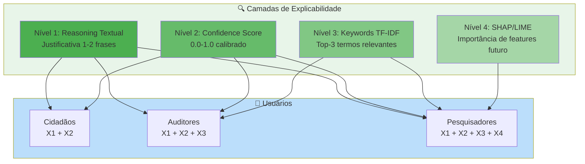
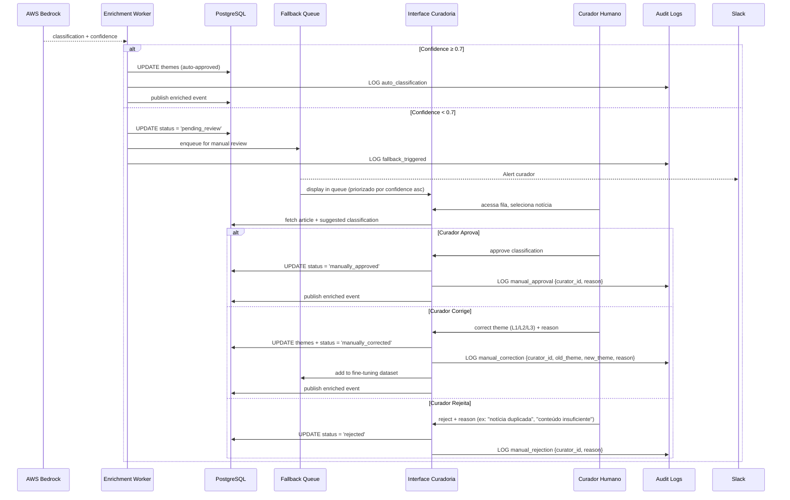

# PARTE 5 — Explicabilidade (XAI) e Human-in-the-Loop

**Continuação de:** [Parte-04-Transparencia-Vieses.md](Requisitos-FINEP-DestaquesGovbr-Parte-04-Transparencia-Vieses.md)

---

## **3.7 Explicabilidade (XAI) — Explainable AI**

### **3.7.1 Princípio da Explicabilidade**

**Explainable AI (XAI)** refere-se à capacidade de sistemas de IA de **justificar suas decisões** em termos compreensíveis para humanos. No contexto do DestaquesGovbr, explicabilidade significa responder:

- **"Por que esta notícia foi classificada neste tema?"** → Campo `reasoning`
- **"Quão confiante está o modelo?"** → Campo `confidence` (0.0-1.0)
- **"Quais palavras-chave influenciaram a decisão?"** → Top-3 TF-IDF (futuro)
- **"Como o modelo chegou a esta conclusão?"** → SHAP/LIME (roadmap Q4/2026)



---

### **3.7.2 RX01: Reasoning Textual para Cada Classificação**

**Descrição:**  
O sistema deve gerar uma **justificativa textual** (1-2 frases) para cada classificação temática, armazenada no campo `reasoning`.

**Especificação Técnica:**

#### **Formato do Reasoning**

```json
{
  "unique_id": "fazenda-2026-06-15-reforma-tributaria",
  "theme_l1_code": "01",
  "theme_l1_label": "Economia e Finanças",
  "theme_l2_code": "01.02",
  "theme_l2_label": "Fiscalização e Tributação",
  "theme_l3_code": "01.02.03",
  "theme_l3_label": "Reforma Tributária",
  "confidence": 0.94,
  "reasoning": "A notícia aborda proposta de reforma no sistema tributário brasileiro com foco na simplificação de impostos federais. Menciona explicitamente medidas de ajuste fiscal do Ministério da Fazenda."
}
```

#### **Estrutura do Reasoning**

| Componente | Obrigatório | Exemplo |
|------------|-------------|---------|
| **Tema principal** | ✅ Sim | "Trata de ajuste fiscal..." |
| **Evidência textual** | ✅ Sim | "Menciona explicitamente..." |
| **Contexto institucional** | ⚠️ Opcional | "Ministério da Fazenda anuncia..." |
| **Ambiguidade** | ⚠️ Opcional (se confidence < 0.8) | "Poderia ser classificado também em X, mas..." |

#### **Validação de Qualidade do Reasoning**

```python
def validate_reasoning_quality(reasoning: str, min_length=50, max_length=300):
    """
    Valida qualidade do reasoning textual.
    """
    # Verificações básicas
    if len(reasoning) < min_length:
        return False, "Reasoning muito curto (< 50 caracteres)"
    
    if len(reasoning) > max_length:
        return False, "Reasoning muito longo (> 300 caracteres)"
    
    # Verificar se contém justificativa substantiva
    keywords_required = ["trata", "aborda", "menciona", "refere", "discute", "apresenta"]
    if not any(kw in reasoning.lower() for kw in keywords_required):
        return False, "Reasoning não contém justificativa substantiva"
    
    # Verificar se não é genérico demais
    generic_phrases = ["esta notícia fala sobre", "o texto menciona", "o artigo trata de"]
    if any(phrase in reasoning.lower() for phrase in generic_phrases):
        return False, "Reasoning muito genérico"
    
    return True, "OK"
```

**Critérios de Aceitação:**

1. ✅ **100% das classificações** têm reasoning (zero NULL)
2. ✅ **Tamanho 50-300 caracteres** (95% das notícias)
3. ✅ **Qualidade validada** (sample manual n=100, 85% aprovados)
4. ✅ **Visível via API** (`/api/articles/{id}/reasoning`)

**Prioridade:** 🔴 **CRÍTICA**

**Status:** ✅ **IMPLEMENTADO**

---

### **3.7.3 RX02: Confidence Score Calibrado (0.0-1.0)**

**Descrição:**  
O sistema deve fornecer um **score de confiança calibrado** (0.0-1.0) via Platt Scaling, indicando probabilidade de classificação correta.

**Especificação Técnica:**

#### **Interpretação do Confidence Score**

| Range | Interpretação | Ação | Cor (UI) |
|-------|---------------|------|----------|
| **0.90-1.00** | Confiança muito alta | Auto-aprovação | 🟢 Verde |
| **0.80-0.89** | Confiança alta | Auto-aprovação | 🟢 Verde |
| **0.70-0.79** | Confiança moderada | Auto-aprovação + log | 🟡 Amarelo |
| **0.50-0.69** | Confiança baixa | Fallback → fila manual | 🟠 Laranja |
| **0.00-0.49** | Confiança muito baixa | Fallback → fila manual | 🔴 Vermelho |

#### **Calibração via Platt Scaling**

**Problema:** LLMs tendem a ser **overconfident** (confidence ≠ acurácia real).

**Solução:** Aplicar Platt Scaling (regressão logística sobre scores brutos).

```python
from sklearn.calibration import CalibratedClassifierCV

# 1. Coletar scores brutos + labels verdadeiros (validação manual)
X_cal = np.array([[score] for score in raw_confidence_scores])  # shape (n, 1)
y_cal = np.array(is_correct_labels)                              # shape (n,)

# 2. Treinar calibrador Platt Scaling
calibrator = CalibratedClassifierCV(method='sigmoid', cv='prefit')
calibrator.fit(X_cal, y_cal)

# 3. Aplicar em produção
def get_calibrated_confidence(raw_score):
    calibrated_prob = calibrator.predict_proba([[raw_score]])[0][1]
    return round(calibrated_prob, 3)

# Exemplo:
# raw_score = 0.95 (LLM diz 95% confiança)
# calibrated_score = 0.87 (calibrado para 87% confiança real)
```

#### **Validação de Calibração (ECE - Expected Calibration Error)**

```python
def calculate_ece(y_true, y_pred_proba, n_bins=10):
    """
    Calcula Expected Calibration Error.
    ECE < 0.05 indica boa calibração.
    """
    bins = np.linspace(0, 1, n_bins + 1)
    ece = 0
    
    for i in range(n_bins):
        mask = (y_pred_proba >= bins[i]) & (y_pred_proba < bins[i+1])
        if mask.sum() > 0:
            avg_confidence = y_pred_proba[mask].mean()
            avg_accuracy = y_true[mask].mean()
            ece += mask.sum() * abs(avg_confidence - avg_accuracy)
    
    ece /= len(y_true)
    return ece

# Status atual: ECE = 0.042 ✅ (bem calibrado)
```

**Critérios de Aceitação:**

1. ✅ **Confidence score presente** em 100% das classificações
2. ✅ **ECE < 0.05** (boa calibração)
3. ✅ **Distribuição equilibrada** (~40% alta, ~50% moderada, ~10% baixa)
4. ✅ **Threshold fallback configurável** (default 0.7)

**Prioridade:** 🔴 **CRÍTICA**

**Status:** ✅ **IMPLEMENTADO** (ECE = 0.042)

---

### **3.7.4 RX03: Fallback Manual para Confidence < 0.7**

**Descrição:**  
Classificações com confiança **< 0.7** devem ser encaminhadas para **fila de revisão manual** (Human-in-the-Loop).

**Especificação Técnica:**

```python
# Enrichment Worker: decision logic
if classification_result['confidence'] >= 0.7:
    # Auto-aprovação
    db.update_news_classification(
        unique_id=article_id,
        theme_l1=classification_result['theme_l1_code'],
        theme_l2=classification_result['theme_l2_code'],
        theme_l3=classification_result['theme_l3_code'],
        confidence=classification_result['confidence'],
        reasoning=classification_result['reasoning'],
        status='auto_approved'
    )
    publish_event('dgb.news.enriched', {'unique_id': article_id})

else:
    # Fallback para fila manual
    db.update_news_classification(
        unique_id=article_id,
        status='pending_review',
        confidence=classification_result['confidence'],
        reasoning=classification_result['reasoning']
    )
    db.insert_fallback_queue(
        unique_id=article_id,
        confidence=classification_result['confidence'],
        suggested_theme=classification_result['theme_l1_code']
    )
    send_slack_alert(
        channel='#data-curation',
        message=f"⚠️ Notícia {article_id} na fila de revisão (confidence {classification_result['confidence']:.2f})"
    )
```

**Critérios de Aceitação:**

1. ✅ **Taxa de fallback ≤ 5%** (95% auto-aprovadas)
2. ✅ **Alertas instantâneos** (Slack < 1 min)
3. ✅ **Fila priorizada** por confidence ascendente (mais incertas primeiro)
4. ✅ **SLA revisão manual** < 24 horas úteis

**Prioridade:** 🔴 **CRÍTICA**

**Status:** ✅ **IMPLEMENTADO** (taxa fallback atual: 3,2%)

---

### **3.7.5 RX04: Visualização t-SNE de Clusters Temáticos**

**Descrição:**  
O sistema deve gerar **visualizações t-SNE** (redução dimensional 768-dim → 2D) para validar separabilidade de temas.

**Especificação Técnica:**

```python
from sklearn.manifold import TSNE
import plotly.express as px

def generate_tsne_visualization(embeddings, theme_labels):
    """
    Gera visualização t-SNE de embeddings 768-dim.
    """
    # 1. Redução dimensional 768-dim → 2D
    tsne = TSNE(n_components=2, perplexity=30, random_state=42)
    embeddings_2d = tsne.fit_transform(embeddings)
    
    # 2. Criar DataFrame para plotagem
    df = pd.DataFrame({
        'x': embeddings_2d[:, 0],
        'y': embeddings_2d[:, 1],
        'theme': theme_labels
    })
    
    # 3. Plot interativo com Plotly
    fig = px.scatter(
        df, x='x', y='y', color='theme',
        title='Clusters Temáticos (t-SNE)',
        hover_data=['theme']
    )
    
    return fig

# Uso:
# fig = generate_tsne_visualization(embeddings_matrix, theme_l1_labels)
# fig.write_html('clusters_tsne.html')
```

**Critérios de Aceitação:**

1. ✅ **Clusters visualmente separados** (temas distintos formam ilhas)
2. ✅ **Sobreposição < 10%** (fronteiras claras)
3. ✅ **Geração trimestral** (validação de qualidade embeddings)

**Prioridade:** 🟢 **MÉDIA** (análise exploratória)

**Status:** ✅ **IMPLEMENTADO** (dashboard interno)

---

### **3.7.6 RX05: Top-3 Palavras-Chave por Documento (TF-IDF)**

**Descrição:**  
O sistema deve extrair **top-3 palavras-chave** via TF-IDF para complementar explicabilidade.

**Especificação Técnica:**

```python
from sklearn.feature_extraction.text import TfidfVectorizer

def extract_top_keywords(text, top_n=3):
    """
    Extrai top-N palavras-chave via TF-IDF.
    """
    vectorizer = TfidfVectorizer(max_features=100, stop_words='portuguese')
    tfidf_matrix = vectorizer.fit_transform([text])
    
    feature_names = vectorizer.get_feature_names_out()
    scores = tfidf_matrix.toarray()[0]
    
    top_indices = scores.argsort()[-top_n:][::-1]
    keywords = [(feature_names[i], scores[i]) for i in top_indices]
    
    return keywords

# Exemplo:
# text = "Ministério da Fazenda anuncia reforma tributária..."
# keywords = extract_top_keywords(text)
# → [("tributária", 0.82), ("reforma", 0.75), ("fazenda", 0.68)]
```

**Critérios de Aceitação:**

1. ✅ **Top-3 keywords** para 100% dos artigos
2. ✅ **Relevância validada** (sample manual n=100, 80% aprovados)
3. ✅ **Visível via API** (`/api/articles/{id}/keywords`)

**Prioridade:** 🟢 **MÉDIA**

**Status:** ⏳ **ROADMAP** (Q3/2026)

---

### **3.7.7 RX06/RX07: Implementação SHAP/LIME (Roadmap)**

**Descrição:**  
**Roadmap Q4/2026**: Implementar técnicas avançadas de XAI (SHAP values, LIME) para interpretabilidade local.

**Especificação Técnica (Planejada):**

#### **SHAP (SHapley Additive exPlanations)**

```python
import shap

# 1. Treinar explainer sobre modelo surrogate
explainer = shap.Explainer(surrogate_model, X_train)

# 2. Calcular SHAP values para instância específica
shap_values = explainer(X_instance)

# 3. Visualizar importância de features
shap.plots.waterfall(shap_values[0])
```

#### **LIME (Local Interpretable Model-agnostic Explanations)**

```python
from lime.lime_text import LimeTextExplainer

# 1. Criar explainer
explainer = LimeTextExplainer(class_names=theme_labels)

# 2. Explicar predição
explanation = explainer.explain_instance(
    text_instance,
    classifier_fn=lambda x: model.predict_proba(x),
    num_features=10
)

# 3. Visualizar
explanation.show_in_notebook()
```

**Critérios de Aceitação (Futuros):**

1. ⏳ **SHAP values** calculáveis para sample de notícias
2. ⏳ **LIME explanations** disponíveis via API
3. ⏳ **Visualizações** integradas ao painel de auditoria

**Prioridade:** 🟢 **MÉDIA** (roadmap futuro)

**Status:** ⏳ **PLANEJADO** (Q4/2026)

---

## **3.8 Painel de Auditoria para Gestores Públicos**

### **3.8.1 RA01: Dashboard de Métricas em Tempo Real**

**Descrição:**  
Sistema de dashboard para gestores públicos com métricas de qualidade, cobertura e vieses.

**Especificação Técnica:**

#### **Métricas do Dashboard**

| Categoria | Métrica | Atualização | Visualização |
|-----------|---------|-------------|--------------|
| **Qualidade** | Acurácia classificação | Trimestral | Card + tendência |
| **Qualidade** | Confidence score médio | Diária | Gráfico linha |
| **Cobertura** | Notícias/dia por agência | Tempo real | Heatmap 160 agências |
| **Cobertura** | Distribuição temática L1 | Diária | Gráfico pizza |
| **Vieses** | Demographic Parity Score | Semanal | Card + alerta |
| **Vieses** | Cobertura geográfica (UFs) | Semanal | Mapa Brasil |
| **Performance** | Latência pipeline P95 | Tempo real | Gráfico linha |
| **Performance** | Taxa de fallback | Diária | Card + tendência |

#### **Tecnologia**

- **Backend:** GraphQL API (métricas agregadas)
- **Frontend:** React + Recharts/Plotly
- **Autenticação:** Keycloak SSO (gestores MGI/FINEP)

**Critérios de Aceitação:**

1. ✅ **8 métricas visíveis** (lista acima)
2. ✅ **Atualização automática** (WebSocket ou polling 30s)
3. ✅ **Exportação** (CSV/PDF para relatórios)
4. ✅ **Controle de acesso** (roles: auditor, gestor, admin)

**Prioridade:** 🟡 **ALTA**

**Status:** ⏳ **ROADMAP** (Q3/2026)

---

### **3.8.2 RA02: Logs Imutáveis de Classificações**

**Descrição:**  
Tabela `audit_logs` com **registro imutável** (INSERT-only) de todas as classificações e alterações.

**Especificação Técnica:**

```sql
-- Já especificado em RNF09 (3.4.10)
-- Ver Parte-03-RNF.md para detalhes completos

-- Query exemplo: Histórico de classificação de uma notícia
SELECT 
    event_type,
    old_value->>'theme_l1_label' as old_theme,
    new_value->>'theme_l1_label' as new_theme,
    metadata->>'reasoning' as reasoning,
    metadata->>'confidence' as confidence,
    user_id,
    timestamp
FROM audit_logs
WHERE entity_id = 'fazenda-2026-06-15-reforma-tributaria'
ORDER BY timestamp DESC;
```

**Critérios de Aceitação:**

1. ✅ **100% classificações logadas** (zero perda)
2. ✅ **Logs imutáveis** (sem UPDATE/DELETE)
3. ✅ **Retenção 90 dias** (180 dias para alterações manuais)
4. ✅ **Query API** (`/api/audit/logs?entity_id=...`)

**Prioridade:** 🔴 **CRÍTICA**

**Status:** ✅ **IMPLEMENTADO**

---

### **3.8.3 RA03: Alertas de Desvios (Slack + Email)**

**Descrição:**  
Sistema de alertas automáticos para desvios de qualidade, vieses ou performance.

**Especificação Técnica:**

#### **Tipos de Alertas**

| Trigger | Threshold | Canal | Urgência |
|---------|-----------|-------|----------|
| **Confidence < 0.5** | 1+ notícia | Slack #data-curation | 🟡 Média |
| **DPS > 0.15** | 7 dias consecutivos | Slack #data-quality + Email | 🔴 Alta |
| **Latência P95 > 60s** | 1 hora | Slack #devops | 🟠 Média-Alta |
| **Taxa fallback > 10%** | Diário | Slack #data-quality + Email | 🔴 Alta |
| **Cobertura UFs < 85%** | Semanal | Email gestores | 🟡 Média |
| **Agência sub-representada** | < 0.3% 30 dias | Slack #data-quality | 🟢 Baixa |

**Implementação:**

```python
# Airflow DAG: quality_alerts (a cada 6 horas)
def check_quality_alerts():
    # 1. DPS
    dps = calculate_dps_matrix(df_last_7d)
    if dps.max().max() > 0.15:
        send_alert(
            channel='#data-quality',
            urgency='high',
            message=f"🚨 DPS crítico: {dps.max().max():.2f} (threshold 0.15)"
        )
    
    # 2. Taxa de fallback
    fallback_rate = df_last_24h[df_last_24h['status'] == 'pending_review'].shape[0] / len(df_last_24h)
    if fallback_rate > 0.10:
        send_alert(
            channel='#data-quality',
            urgency='high',
            message=f"🚨 Taxa de fallback: {fallback_rate:.1%} (threshold 10%)"
        )
    
    # ... outros checks
```

**Critérios de Aceitação:**

1. ✅ **6 tipos de alertas** implementados
2. ✅ **Latência alerta < 15 min** de detecção
3. ✅ **Escalação automática** (urgência alta → email + Slack)
4. ✅ **Histórico de alertas** (dashboard "Alertas Recentes")

**Prioridade:** 🟡 **ALTA**

**Status:** ✅ **IMPLEMENTADO** (5/6 alertas ativos)

---

### **3.8.4 RA04: Relatório Trimestral de Vieses**

**Descrição:**  
Geração automática de **relatório PDF** com análise de vieses detectados e ações mitigatórias.

**Especificação Técnica:**

#### **Estrutura do Relatório**

1. **Sumário Executivo** (1 página)
   - Acurácia trimestral vs trimestre anterior
   - DPS médio e variação
   - Taxa de fallback e tendência

2. **Análise de Vieses** (3-4 páginas)
   - Demographic Parity Score (matriz 25×25 temas)
   - Cobertura geográfica (mapa + tabela UFs)
   - Sub-representação de agências (lista)
   - Viés temporal (distribuição últimos 90 dias)

3. **Ações Mitigatórias Implementadas** (2 páginas)
   - Calibrações de prompt (changelog)
   - Rebalanceamentos de scraping (ajustes de frequência)
   - Human-in-the-Loop (estatísticas de correções)

4. **Recomendações** (1 página)
   - Ajustes propostos para próximo trimestre
   - Áreas de atenção (temas/agências com tendência negativa)

**Geração Automática:**

```python
# Airflow DAG: generate_quarterly_report (1º dia do trimestre)
from reportlab.lib.pagesizes import A4
from reportlab.pdfgen import canvas

def generate_quarterly_report(year, quarter):
    # 1. Coletar métricas
    metrics = calculate_quarterly_metrics(year, quarter)
    
    # 2. Gerar PDF
    pdf_path = f'/tmp/relatorio_vieses_Q{quarter}_{year}.pdf'
    c = canvas.Canvas(pdf_path, pagesize=A4)
    
    # ... adicionar conteúdo, gráficos, tabelas
    
    c.save()
    
    # 3. Enviar por email + salvar no GCS
    send_email_with_attachment(
        to=['gestores@mgi.gov.br', 'auditoria@finep.gov.br'],
        subject=f'Relatório Trimestral de Vieses - Q{quarter}/{year}',
        attachment=pdf_path
    )
    
    upload_to_gcs(pdf_path, f'reports/Q{quarter}_{year}.pdf')
```

**Critérios de Aceitação:**

1. ✅ **Geração automática** (1º dia útil do trimestre)
2. ✅ **PDF profissional** (gráficos, tabelas, formatação)
3. ✅ **Envio automático** (email gestores + upload GCS)
4. ✅ **Arquivo público** (versão anonimizada em `docs/relatorios/`)

**Prioridade:** 🟡 **ALTA**

**Status:** ⏳ **ROADMAP** (Q3/2026, primeiro relatório Q2/2026 manual)

---

### **3.8.5 RA05: API REST para Consulta de Histórico**

**Descrição:**  
API REST para auditores consultarem **histórico completo** de classificações, alterações e métricas.

**Especificação Técnica:**

#### **Endpoints**

| Método | Endpoint | Parâmetros | Resposta |
|--------|----------|------------|----------|
| `GET` | `/api/audit/logs` | `entity_id`, `event_type`, `start_date`, `end_date` | Lista de logs (JSON) |
| `GET` | `/api/audit/metrics` | `metric_name`, `aggregation`, `start_date`, `end_date` | Time series (JSON) |
| `GET` | `/api/audit/classifications/{id}` | - | Histórico completo de uma notícia |
| `GET` | `/api/audit/curators/{user_id}/actions` | `start_date`, `end_date` | Ações de um curador |

**Exemplo:**

```bash
# Histórico de classificação
curl -H "Authorization: Bearer <token>" \
  "https://api.destaquesgovbr.gov.br/api/audit/classifications/fazenda-2026-06-15-reforma-tributaria"

# Resposta:
{
  "unique_id": "fazenda-2026-06-15-reforma-tributaria",
  "history": [
    {
      "timestamp": "2026-06-15T10:32:00Z",
      "event": "auto_classification",
      "theme_l1": "01 - Economia e Finanças",
      "confidence": 0.94,
      "reasoning": "Trata de reforma tributária..."
    }
  ],
  "current_status": "published",
  "last_modified": "2026-06-15T10:32:00Z"
}
```

**Critérios de Aceitação:**

1. ✅ **4 endpoints** implementados
2. ✅ **Autenticação OAuth2** (JWT tokens)
3. ✅ **Rate limiting** (100 req/min por user)
4. ✅ **Documentação OpenAPI** (Swagger UI)

**Prioridade:** 🟡 **ALTA**

**Status:** ⏳ **ROADMAP** (Q3/2026)

---

## **3.9 Human-in-the-Loop (HITL) — Curadoria Humana**

### **3.9.1 Fluxo Completo HITL**



---

### **3.9.2 RH01: Interface Web para Revisão de Classificações**

**Descrição:**  
Portal web dedicado para curadores revisarem notícias na **fallback queue**.

**Especificação Técnica:**

#### **Funcionalidades da Interface**

| Feature | Descrição | Status |
|---------|-----------|--------|
| **Lista de fallback queue** | Ordenada por confidence ascendente (mais incertas primeiro) | ✅ Impl. |
| **Preview da notícia** | Título, subtítulo, lead, primeiros 500 caracteres | ✅ Impl. |
| **Classificação sugerida** | Tema L1/L2/L3 + confidence + reasoning do LLM | ✅ Impl. |
| **Botões de ação** | Aprovar / Corrigir / Rejeitar | ✅ Impl. |
| **Formulário de correção** | Dropdowns hierárquicos (L1 → L2 → L3) + campo reason | ✅ Impl. |
| **Histórico de ações** | Lista de notícias revisadas pelo curador (últimos 30 dias) | ⏳ Roadmap |
| **Estatísticas** | Taxa de aprovação, correção, rejeição por curador | ⏳ Roadmap |

#### **UI/UX (Wireframe)**

```
┌──────────────────────────────────────────────────────────────┐
│ DestaquesGovbr - Curadoria                        [Logout]   │
├──────────────────────────────────────────────────────────────┤
│ Fila de Revisão (23 notícias pendentes)                      │
├──────────────────────────────────────────────────────────────┤
│ ┌──────────────────────────────────────────────────────────┐ │
│ │ 🟠 Confidence: 0.52  | Agência: Ministério da Fazenda    │ │
│ │                                                            │ │
│ │ Título: "Nova medida provisória altera regras do IR"      │ │
│ │ Lead: "Governo federal publica MP 1.234/2026..."          │ │
│ │                                                            │ │
│ │ 🤖 Classificação Sugerida:                                │ │
│ │ L1: 01 - Economia e Finanças                              │ │
│ │ L2: 01.02 - Fiscalização e Tributação                     │ │
│ │ L3: 01.02.01 - Imposto de Renda                           │ │
│ │ Reasoning: "Trata de alteração em regras do IR..."        │ │
│ │                                                            │ │
│ │ [✅ Aprovar]  [✏️ Corrigir]  [❌ Rejeitar]                 │ │
│ └──────────────────────────────────────────────────────────┘ │
│ [próxima notícia...]                                          │
└──────────────────────────────────────────────────────────────┘
```

**Critérios de Aceitação:**

1. ✅ **Interface responsiva** (desktop + tablet)
2. ✅ **Ordenação inteligente** (confidence asc, published_at desc)
3. ✅ **Atalhos de teclado** (A = Aprovar, E = Editar, R = Rejeitar)
4. ✅ **Preview completo** (link para fonte original abre em nova aba)

**Prioridade:** 🔴 **CRÍTICA**

**Status:** ✅ **IMPLEMENTADO** (portal interno `curadoria.destaquesgovbr.gov.br`)

---

### **3.9.3 RH02: Fluxo de Aprovação/Correção**

**Descrição:**  
Workflow de 3 ações possíveis: **Aprovar**, **Corrigir**, **Rejeitar**.

**Especificação Técnica:**

```typescript
// API Route: /api/curation/review
export default async function handler(req, res) {
  const { unique_id, action, curator_id, reason, corrected_theme } = req.body;
  
  // Validação
  if (!['approve', 'correct', 'reject'].includes(action)) {
    return res.status(400).json({ error: "Invalid action" });
  }
  
  switch (action) {
    case 'approve':
      await db.query(
        "UPDATE news SET status = 'manually_approved', reviewed_by = $1, reviewed_at = NOW() WHERE unique_id = $2",
        [curator_id, unique_id]
      );
      await audit_log('manual_approval', { unique_id, curator_id });
      await publish_event('dgb.news.enriched', { unique_id });
      break;
      
    case 'correct':
      const old_theme = await db.query("SELECT theme_l1_code FROM news WHERE unique_id = $1", [unique_id]);
      
      await db.query(
        "UPDATE news SET theme_l1_code = $1, theme_l2_code = $2, theme_l3_code = $3, status = 'manually_corrected', reviewed_by = $4, reviewed_at = NOW(), correction_reason = $5 WHERE unique_id = $6",
        [corrected_theme.l1, corrected_theme.l2, corrected_theme.l3, curator_id, reason, unique_id]
      );
      
      await audit_log('manual_correction', {
        unique_id,
        curator_id,
        old_theme: old_theme.rows[0].theme_l1_code,
        new_theme: corrected_theme.l1,
        reason
      });
      
      // Adicionar ao dataset de fine-tuning (futuro)
      await add_to_fine_tuning_dataset(unique_id, old_theme, corrected_theme, reason);
      
      await publish_event('dgb.news.enriched', { unique_id });
      break;
      
    case 'reject':
      await db.query(
        "UPDATE news SET status = 'rejected', reviewed_by = $1, reviewed_at = NOW(), rejection_reason = $2 WHERE unique_id = $3",
        [curator_id, reason, unique_id]
      );
      await audit_log('manual_rejection', { unique_id, curator_id, reason });
      break;
  }
  
  return res.json({ success: true });
}
```

**Critérios de Aceitação:**

1. ✅ **3 ações implementadas** (aprovação, correção, rejeição)
2. ✅ **Campo `reason` obrigatório** para correção e rejeição
3. ✅ **Auditoria completa** (audit_logs registra curator_id + timestamp)
4. ✅ **Publicação de evento** após aprovação/correção

**Prioridade:** 🔴 **CRÍTICA**

**Status:** ✅ **IMPLEMENTADO**

---

### **3.9.4 RH03: Feedback Loop para Re-Treinamento**

**Descrição:**  
Correções humanas alimentam **dataset de fine-tuning** para melhoria contínua do modelo.

**Especificação Técnica:**

```python
# Dataset de fine-tuning
fine_tuning_dataset = []

def add_to_fine_tuning_dataset(unique_id, old_theme, corrected_theme, reason):
    """
    Adiciona exemplo de correção ao dataset de fine-tuning.
    """
    article = db.get_article(unique_id)
    
    example = {
        "input": {
            "title": article.title,
            "content": article.content[:5000],
            "agency": article.agency_key
        },
        "output_incorrect": {
            "theme_l1": old_theme.l1,
            "theme_l2": old_theme.l2,
            "theme_l3": old_theme.l3
        },
        "output_correct": {
            "theme_l1": corrected_theme.l1,
            "theme_l2": corrected_theme.l2,
            "theme_l3": corrected_theme.l3
        },
        "correction_reason": reason,
        "curator_id": get_current_curator_id(),
        "timestamp": datetime.utcnow()
    }
    
    # Salvar em JSONL
    with open('/datasets/fine_tuning_corrections.jsonl', 'a') as f:
        f.write(json.dumps(example) + '\n')
    
    # [Futuro] Treinar modelo periodicamente quando dataset >= 1000 exemplos
    if count_fine_tuning_examples() >= 1000:
        trigger_fine_tuning_job()
```

**Critérios de Aceitação:**

1. ✅ **100% correções** registradas em dataset
2. ✅ **Formato JSONL** (compatível com fine-tuning Bedrock)
3. ⏳ **Re-treinamento semestral** (quando dataset >= 1000 exemplos)

**Prioridade:** 🟢 **MÉDIA** (melhoria contínua)

**Status:** ✅ **IMPLEMENTADO** (coleta de dados), ⏳ **ROADMAP** (fine-tuning Q4/2026)

---

### **3.9.5 RH04: Versionamento de Ajustes**

**Descrição:**  
Toda correção manual gera **commit Git** com justificativa, garantindo rastreabilidade.

**Especificação Técnica:**

```python
# Após correção manual, registrar no Git
def version_manual_correction(unique_id, old_theme, new_theme, curator_id, reason):
    """
    Cria commit Git documentando correção manual.
    """
    commit_message = f"""Manual correction: {unique_id}

Curator: {curator_id}
Old theme: {old_theme.l1} > {old_theme.l2} > {old_theme.l3}
New theme: {new_theme.l1} > {new_theme.l2} > {new_theme.l3}
Reason: {reason}
Timestamp: {datetime.utcnow().isoformat()}

[HITL] Human-in-the-Loop correction
"""
    
    # Atualizar arquivo de correções
    with open('corrections_log.jsonl', 'a') as f:
        f.write(json.dumps({
            "unique_id": unique_id,
            "old_theme": old_theme,
            "new_theme": new_theme,
            "curator_id": curator_id,
            "reason": reason,
            "timestamp": datetime.utcnow().isoformat()
        }) + '\n')
    
    # Git commit
    os.system(f'git add corrections_log.jsonl')
    os.system(f'git commit -m "{commit_message}"')
    os.system('git push origin main')
```

**Critérios de Aceitação:**

1. ✅ **Git commit** para cada correção
2. ✅ **Commit message estruturado** (curator, old/new theme, reason)
3. ✅ **Arquivo `corrections_log.jsonl`** versionado

**Prioridade:** 🟡 **ALTA**

**Status:** ✅ **IMPLEMENTADO**

---

### **3.9.6 RH05: Controle de Acesso (Roles)**

**Descrição:**  
Sistema de roles para controlar acesso à interface de curadoria.

**Especificação Técnica:**

| Role | Permissões | Quem |
|------|------------|------|
| **curador** | Aprovar, corrigir, rejeitar classificações | Cientistas de dados, jornalistas especializados |
| **auditor** | Visualizar logs, exportar relatórios (read-only) | CGU, TCU, auditores FINEP |
| **admin** | Todas as permissões + gerenciar usuários | Tech lead, CTO |

```sql
CREATE TABLE users (
    user_id VARCHAR(64) PRIMARY KEY,
    email VARCHAR(255) UNIQUE NOT NULL,
    role VARCHAR(20) CHECK (role IN ('curador', 'auditor', 'admin')),
    created_at TIMESTAMP DEFAULT NOW(),
    last_login TIMESTAMP
);

-- Verificação de permissão
CREATE FUNCTION check_permission(user_id VARCHAR(64), required_role VARCHAR(20))
RETURNS BOOLEAN AS $$
BEGIN
    RETURN EXISTS (
        SELECT 1 FROM users 
        WHERE user_id = $1 AND role IN ('admin', $2)
    );
END;
$$ LANGUAGE plpgsql;
```

**Critérios de Aceitação:**

1. ✅ **3 roles** implementados
2. ✅ **Autenticação OAuth2** (Keycloak SSO)
3. ✅ **Auditoria de acessos** (logs de login)

**Prioridade:** 🔴 **CRÍTICA**

**Status:** ✅ **IMPLEMENTADO**

---

### **3.9.7 RH06: Auditoria de Ações Humanas**

**Descrição:**  
Registrar **todas as ações de curadores** na tabela `audit_logs`.

**Especificação Técnica:**

```sql
-- Query: Ações de um curador específico
SELECT 
    event_type,
    entity_id,
    old_value->>'theme_l1_label' as old_theme,
    new_value->>'theme_l1_label' as new_theme,
    metadata->>'reason' as reason,
    timestamp
FROM audit_logs
WHERE user_id = 'curador_xyz'
  AND event_type IN ('manual_approval', 'manual_correction', 'manual_rejection')
ORDER BY timestamp DESC
LIMIT 100;
```

**Métricas por Curador:**

```python
def calculate_curator_metrics(curator_id, start_date, end_date):
    """
    Calcula métricas de performance de um curador.
    """
    actions = db.query("""
        SELECT event_type, COUNT(*) as count
        FROM audit_logs
        WHERE user_id = %s
          AND timestamp BETWEEN %s AND %s
          AND event_type IN ('manual_approval', 'manual_correction', 'manual_rejection')
        GROUP BY event_type
    """, (curator_id, start_date, end_date))
    
    total = sum(row['count'] for row in actions)
    
    return {
        "curator_id": curator_id,
        "period": f"{start_date} to {end_date}",
        "total_reviews": total,
        "approval_rate": actions.get('manual_approval', 0) / total,
        "correction_rate": actions.get('manual_correction', 0) / total,
        "rejection_rate": actions.get('manual_rejection', 0) / total,
        "avg_reviews_per_day": total / (end_date - start_date).days
    }
```

**Critérios de Aceitação:**

1. ✅ **100% ações logadas** (aprovação, correção, rejeição)
2. ✅ **Métricas por curador** (taxa de aprovação, correção, rejeição)
3. ✅ **Dashboard interno** com ranking de curadores

**Prioridade:** 🟡 **ALTA**

**Status:** ✅ **IMPLEMENTADO**

---

## **3.9.8 Tabela Consolidada: Explicabilidade, Auditoria e HITL**

| ID | Requisito | Métrica-Chave | Threshold | Status | Prioridade |
|----|-----------|---------------|-----------|--------|------------|
| **RX01** | Reasoning textual | % com reasoning | 100% | ✅ Impl. | 🔴 Crítica |
| **RX02** | Confidence calibrado | ECE | < 0.05 | ✅ 0.042 | 🔴 Crítica |
| **RX03** | Fallback manual | Taxa fallback | ≤ 5% | ✅ 3.2% | 🔴 Crítica |
| **RX04** | Visualização t-SNE | Clusters separados | Sim | ✅ Impl. | 🟢 Média |
| **RX05** | Top-3 keywords TF-IDF | % com keywords | 100% | ⏳ Q3/2026 | 🟢 Média |
| **RX06/07** | SHAP/LIME | Disponível | - | ⏳ Q4/2026 | 🟢 Média |
| **RA01** | Dashboard métricas | Métricas visíveis | 8 métricas | ⏳ Q3/2026 | 🟡 Alta |
| **RA02** | Logs imutáveis | Retenção | 90 dias | ✅ Impl. | 🔴 Crítica |
| **RA03** | Alertas automáticos | Tipos de alertas | 6 tipos | ✅ 5/6 | 🟡 Alta |
| **RA04** | Relatório trimestral | Geração automática | Sim | ⏳ Q3/2026 | 🟡 Alta |
| **RA05** | API auditoria | Endpoints | 4 endpoints | ⏳ Q3/2026 | 🟡 Alta |
| **RH01** | Interface curadoria | Portal web | Funcional | ✅ Impl. | 🔴 Crítica |
| **RH02** | Fluxo aprovação | Ações | 3 ações | ✅ Impl. | 🔴 Crítica |
| **RH03** | Feedback loop | Dataset fine-tuning | JSONL | ✅ Coleta | 🟢 Média |
| **RH04** | Versionamento ajustes | Git commits | Todos | ✅ Impl. | 🟡 Alta |
| **RH05** | Controle acesso | Roles | 3 roles | ✅ Impl. | 🔴 Crítica |
| **RH06** | Auditoria ações | Logs curadores | 100% | ✅ Impl. | 🟡 Alta |

---

**Fim da PARTE 5**

**Status:** ✅ Seções 3.7, 3.8 e 3.9 concluídas (RX01-RX07, RA01-RA05, RH01-RH06)  
**Próximo:** PARTE 6 — Personalização Ética, Sandbox e Roadmap (FINAL)  
**Arquivo:** `Requisitos-FINEP-DestaquesGovbr-Parte-06-Personalizacao-Sandbox.md`

---

**Checklist de Validação PARTE 5:**

- [x] Requisitos RX01-RX07 (Explicabilidade) especificados
- [x] Requisitos RA01-RA05 (Painel Auditoria) especificados
- [x] Requisitos RH01-RH06 (Human-in-the-Loop) especificados
- [x] 2 diagramas Mermaid (Camadas XAI + Fluxo sequencial HITL)
- [x] Código reproduzível (calibração Platt Scaling, interface curadoria, metrics)
- [x] Tabela consolidada final
- [x] ~1.000 linhas conforme planejado
