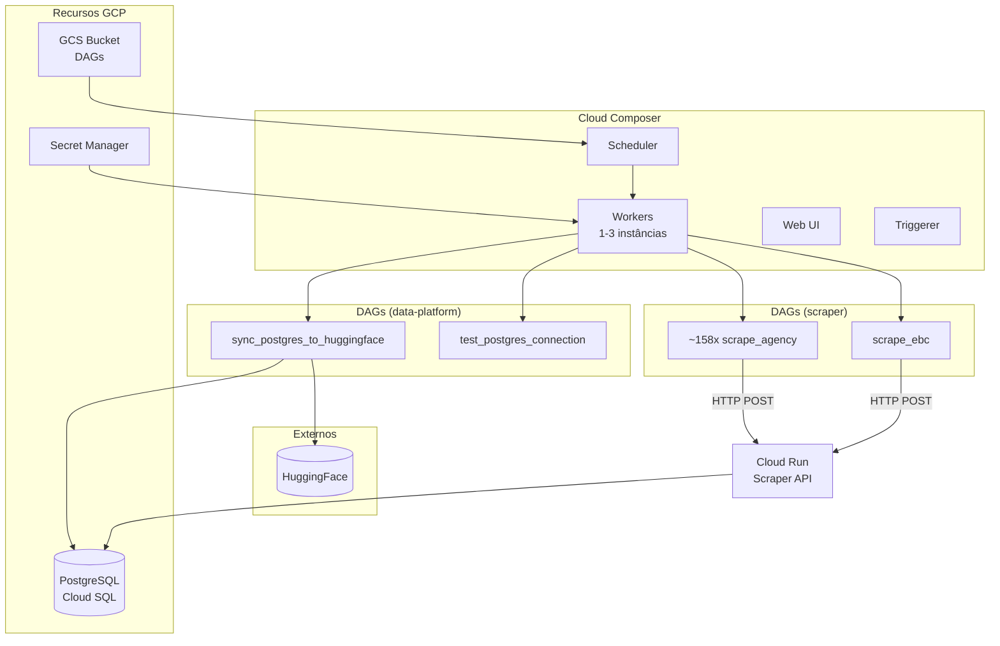
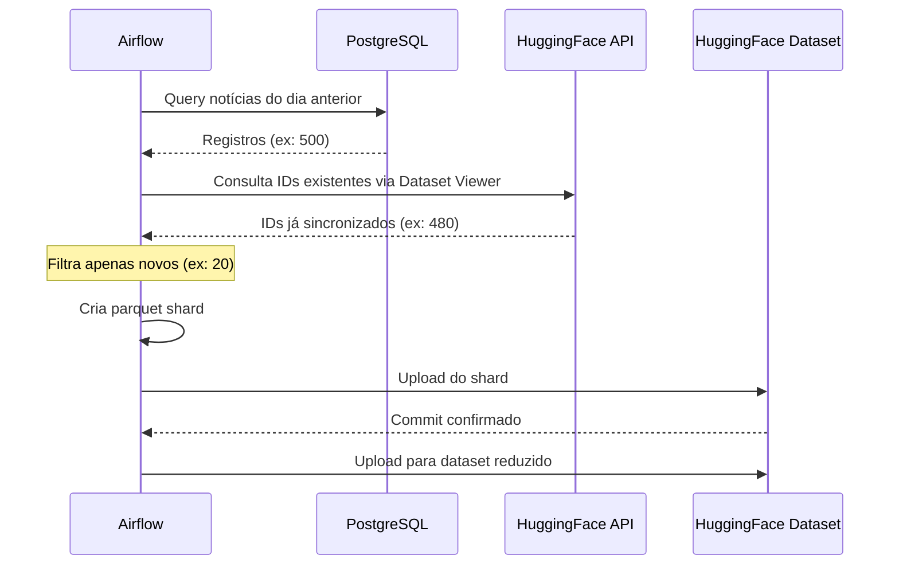

# Airflow DAGs (Cloud Composer)

O projeto utiliza **Cloud Composer 3** (Apache Airflow gerenciado) para orquestração de pipelines de dados: scraping de notícias (repo `scraper`) e sincronização entre PostgreSQL e HuggingFace (repo `data-platform`).

!!! info "Cloud Composer"
    **Ambiente**: `destaquesgovbr-composer`
    **Região**: `us-central1`
    **Versão**: Composer 3 / Airflow 3.x

## Arquitetura



## Organização de DAGs no Bucket

O Composer armazena DAGs de múltiplos repos em subdiretórios do mesmo bucket:

```
gs://{COMPOSER_BUCKET}/dags/
├── data-platform/                    # DAGs do repo data-platform
│   ├── sync_postgres_to_huggingface.py
│   └── test_postgres_connection.py
└── scraper/                          # DAGs do repo scraper
    ├── scrape_agencies.py            # ~158 DAGs dinâmicas
    ├── scrape_ebc.py
    └── config/
        └── site_urls.yaml
```

Cada repo tem seu próprio workflow `composer-deploy-dags.yaml` que faz `gsutil rsync` para seu subdiretório.

## DAGs Disponíveis

### DAGs do Scraper (repo `scraper`)

#### `scrape_{agency_key}` (~158 DAGs dinâmicas)

Cada agência gov.br gera uma DAG de scraping independente.

| Configuração | Valor |
|--------------|-------|
| **Schedule** | `*/15 * * * *` (a cada 15 min) |
| **Catchup** | Desabilitado |
| **Retries** | 2 (com backoff de 5 min) |
| **Timeout** | 15 min |

Cada DAG faz HTTP POST para a Scraper API no Cloud Run (`POST /scrape/agencies` com a agência específica).

#### `scrape_ebc`

DAG para scraping dos sites EBC (Agência Brasil, TV Brasil).

| Configuração | Valor |
|--------------|-------|
| **Schedule** | `*/15 * * * *` (a cada 15 min) |
| **Retries** | 2 (com backoff de 5 min) |

Faz HTTP POST para `POST /scrape/ebc` no Cloud Run.

→ Veja [Módulo Scraper](../modulos/scraper.md) para detalhes da API e do repo.

### DAGs do Data Platform (repo `data-platform`)

### `sync_postgres_to_huggingface`

Sincroniza notícias do PostgreSQL para o HuggingFace diariamente.

| Configuração | Valor |
|--------------|-------|
| **Schedule** | `0 6 * * *` (6 AM UTC) |
| **Catchup** | Desabilitado |
| **Retries** | 3 (com backoff exponencial) |
| **Tags** | `sync`, `huggingface`, `postgres`, `daily` |

#### Fluxo de Execução



#### Abordagem Incremental

A DAG utiliza uma abordagem de **append incremental via parquet shards** para evitar problemas de memória:

1. **Consulta IDs existentes** via Dataset Viewer API (sem baixar o dataset completo)
2. **Cria parquet shard** apenas com novos registros
3. **Upload direto** via `huggingface_hub`

**Vantagens**:
- Memória: ~10MB (apenas novos registros) vs ~1-2GB (dataset completo)
- Deduplicação automática
- Commits atômicos por dia

#### Estrutura do Shard

```
data/train-{YYYY-MM-DD}-{HHMMSS}.parquet
```

Exemplo: `data/train-2025-01-10-060532.parquet`

#### Colunas Sincronizadas

```python
HF_COLUMNS = [
    "unique_id", "agency", "published_at", "updated_datetime", "extracted_at",
    "title", "subtitle", "editorial_lead", "url", "content",
    "image", "video_url", "category", "tags",
    "theme_1_level_1", "theme_1_level_1_code", "theme_1_level_1_label",
    "theme_1_level_2_code", "theme_1_level_2_label",
    "theme_1_level_3_code", "theme_1_level_3_label",
    "most_specific_theme_code", "most_specific_theme_label",
    "summary"
]
```

#### Datasets Atualizados

| Dataset | Colunas | Uso |
|---------|---------|-----|
| `nitaibezerra/govbrnews` | Todas (24) | Análise completa |
| `nitaibezerra/govbrnews-reduced` | 4 (published_at, agency, title, url) | Listagens rápidas |

### `test_postgres_connection`

DAG de teste para verificar conectividade com o PostgreSQL.

| Configuração | Valor |
|--------------|-------|
| **Schedule** | Manual (`None`) |
| **Uso** | Validação pós-deploy |

## Configuração do Composer

### Workloads

| Componente | CPU | Memória | Storage | Instâncias |
|------------|-----|---------|---------|------------|
| Scheduler | 0.5 | 2GB | 2GB | 1 |
| Web Server | 1 | 2GB | 2GB | 1 |
| Worker | 1 | 2GB | 2GB | 1-3 (auto) |
| Triggerer | 0.5 | 2GB | - | 1 |
| DAG Processor | 0.5 | 2GB | 1GB | 1 |

### Airflow Config Overrides

```python
{
    # Secret Manager Backend
    "secrets-backend": "airflow.providers.google.cloud.secrets.secret_manager.CloudSecretManagerBackend",
    "secrets-backend_kwargs": {
        "connections_prefix": "airflow-connections",
        "variables_prefix": "airflow-variables",
        "project_id": "inspire-7-finep"
    },

    # Timezone
    "core-default_timezone": "America/Sao_Paulo",

    # Web UI
    "webserver-rbac": "True",
    "webserver-authenticate": "True",
}
```

### PyPI Packages

```
psycopg2-binary>=2.9.9
apache-airflow-providers-postgres>=5.10.2
apache-airflow-providers-google>=10.14.0
sqlalchemy>=1.4.52
requests>=2.31.0
pyyaml>=6.0
```

### Environment Variables

```bash
POSTGRES_HOST=10.x.x.x  # IP privado Cloud SQL
POSTGRES_PORT=5432
POSTGRES_DB=govbrnews
GCP_PROJECT_ID=inspire-7-finep
GCP_REGION=southamerica-east1
TYPESENSE_HOST=34.39.186.38
```

## Connections

As connections são gerenciadas via **Secret Manager**:

| Connection ID | Tipo | Secret |
|--------------|------|--------|
| `postgres_default` | Postgres | `airflow-connections-postgres_default` |
| `huggingface_default` | Generic | `airflow-connections-huggingface_default` |

### Formato das Connections

```json
// postgres_default
{
    "conn_type": "postgres",
    "host": "10.x.x.x",
    "port": 5432,
    "schema": "govbrnews",
    "login": "govbrnews_app",
    "password": "xxx"
}

// huggingface_default
{
    "conn_type": "generic",
    "password": "hf_xxx"  // Token HuggingFace
}
```

## Deploy de DAGs

### Via GitHub Actions

Cada repo tem seu próprio workflow `composer-deploy-dags.yaml` que sincroniza para o subdiretório correspondente:

**Repo `data-platform`**:
```bash
gsutil -m rsync -r -d src/data_platform/dags/ gs://{BUCKET}/dags/data-platform/
```

**Repo `scraper`**:
```bash
gsutil -m rsync -r -d dags/ gs://{BUCKET}/dags/scraper/
```

### Manual via gcloud

```bash
# Descobrir bucket do Composer
BUCKET=$(gcloud composer environments describe destaquesgovbr-composer \
    --location us-central1 \
    --format="value(config.dagGcsPrefix)")

# Upload das DAGs do data-platform
gsutil -m rsync -r -d src/data_platform/dags/ $BUCKET/data-platform/

# Upload das DAGs do scraper
gsutil -m rsync -r -d dags/ $BUCKET/scraper/
```

## Monitoramento

### Acessar Web UI

```bash
# Obter URL do Airflow
gcloud composer environments describe destaquesgovbr-composer \
    --location us-central1 \
    --format="value(config.airflowUri)"
```

### Logs

```bash
# Ver logs de uma DAG run
gcloud composer environments run destaquesgovbr-composer \
    --location us-central1 \
    dags list-runs -- -d sync_postgres_to_huggingface
```

### Métricas

O Composer exporta métricas para Cloud Monitoring:

- `composer.googleapis.com/environment/dag_processing/total_parse_time`
- `composer.googleapis.com/environment/worker/task_success_count`
- `composer.googleapis.com/environment/worker/task_failed_count`

## Troubleshooting

### DAG não aparece na UI

1. Verificar se o arquivo foi copiado para o bucket:
   ```bash
   gsutil ls $BUCKET/dags/
   ```

2. Verificar logs do DAG Processor:
   ```bash
   gcloud composer environments run destaquesgovbr-composer \
       --location us-central1 \
       tasks log-read -- -d sync_postgres_to_huggingface -t sync_news_to_huggingface
   ```

### Erro de conexão com PostgreSQL

1. Verificar se a connection existe no Secret Manager
2. Verificar se o Composer tem acesso ao Cloud SQL via VPC

### Erro de memória (OOM)

- A abordagem incremental resolve isso
- Se persistir, aumentar `memory_gb` dos workers no Terraform

## Custos Estimados

| Componente | Custo/mês |
|------------|-----------|
| Cloud Composer (SMALL) | ~$100-150 |
| GCS (DAGs bucket) | ~$1 |
| **Total** | **~$100-150** |

!!! tip "Otimização de Custos"
    O Composer está em `us-central1` (não `southamerica-east1`) para reduzir custos. A latência adicional é aceitável para jobs batch.
