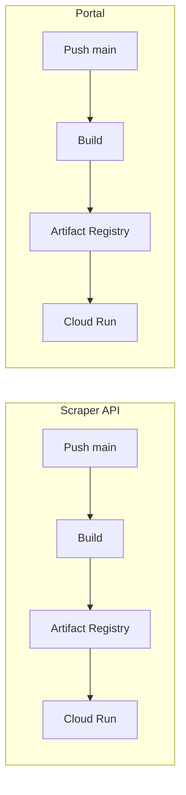

# Workflow: Docker Builds

> Builds automatizados de imagens Docker para os serviços.

## Visão Geral

O projeto usa Docker para containerização de dois serviços principais:

| Serviço | Imagem    | Registry                  |
| ------- | --------- | ------------------------- |
| Scraper API | `scraper` | GCP Artifact Registry |
| Portal  | `portal`  | GCP Artifact Registry     |



---

## Build do Scraper API

**Arquivo**: `scraper/.github/workflows/scraper-api-deploy.yaml`

O workflow faz build da imagem Docker e deploy automático no Cloud Run em push para `main`.

### Trigger

```yaml
on:
  push:
    branches: [main]
    paths:
      - 'src/**'
      - 'docker/**'
      - 'pyproject.toml'
  workflow_dispatch:
```

### Pipeline

1. Build da imagem Docker
2. Push para GCP Artifact Registry
3. Deploy no Cloud Run (`destaquesgovbr-scraper-api`)

### Dockerfile

Localizado em `scraper/docker/Dockerfile`.

### Execução

```bash
# Deploy automático em push para main

# Manual
gh workflow run scraper-api-deploy.yaml -R destaquesgovbr/scraper
```

---

## Build do Portal

**Arquivo**: `portal/.github/workflows/deploy-production.yml`

> O build do portal está integrado ao workflow de deploy (ver [portal-deploy.md](./portal-deploy.md)).

### Dockerfile do Portal (Multistage)

```dockerfile
# Stage 1: Dependencies
FROM node:20-alpine AS deps
WORKDIR /app
RUN corepack enable && corepack prepare pnpm@latest --activate
COPY package.json pnpm-lock.yaml ./
RUN pnpm install --prod --frozen-lockfile

# Stage 2: Build
FROM node:20-alpine AS builder
WORKDIR /app

# Copiar node_modules
COPY --from=deps /app/node_modules ./node_modules
COPY . .

# Args de build
ARG TYPESENSE_HOST
ARG TYPESENSE_PORT
ARG TYPESENSE_PROTOCOL
ARG TYPESENSE_API_KEY

# Variáveis de ambiente para build
ENV TYPESENSE_HOST=$TYPESENSE_HOST
ENV TYPESENSE_PORT=$TYPESENSE_PORT
ENV TYPESENSE_PROTOCOL=$TYPESENSE_PROTOCOL
ENV TYPESENSE_API_KEY=$TYPESENSE_API_KEY
ENV NEXT_TELEMETRY_DISABLED=1

# Build Next.js standalone
RUN corepack enable && corepack prepare pnpm@latest --activate && pnpm build

# Stage 3: Production
FROM node:20-alpine AS runner
WORKDIR /app

ENV NODE_ENV=production
ENV NEXT_TELEMETRY_DISABLED=1

# Criar usuário não-root
RUN addgroup --system --gid 1001 nodejs
RUN adduser --system --uid 1001 nextjs

# Copiar artifacts de build
COPY --from=builder /app/public ./public
COPY --from=builder --chown=nextjs:nodejs /app/.next/standalone ./
COPY --from=builder --chown=nextjs:nodejs /app/.next/static ./.next/static

USER nextjs

EXPOSE 3000
ENV PORT=3000

CMD ["node", "server.js"]
```

### Otimizações

- **Multistage**: Reduz tamanho final da imagem
- **Standalone output**: Next.js gera servidor independente
- **Non-root user**: Segurança
- **Layer caching**: Deps em stage separado

---

## GCP Artifact Registry

### Autenticação

```bash
# Via gcloud
gcloud auth configure-docker us-east1-docker.pkg.dev
```

### Push de imagem

```bash
docker push us-east1-docker.pkg.dev/PROJECT_ID/destaquesgovbr/portal:TAG
```

---

## Build Local

### Scraper API

```bash
cd scraper

# Build
docker build -f docker/Dockerfile -t scraper-api .

# Executar
docker run --env-file .env -p 8080:8080 scraper-api
```

### Portal

```bash
cd portal

# Build (precisa das vars de ambiente)
docker build \
  --build-arg TYPESENSE_HOST=localhost \
  --build-arg TYPESENSE_PORT=8108 \
  --build-arg TYPESENSE_PROTOCOL=http \
  --build-arg TYPESENSE_API_KEY=xyz \
  -t portal .

# Executar
docker run -p 3000:3000 portal
```

---

## Boas Práticas

### 1. Cache de layers

```dockerfile
# ❌ Ruim - invalida cache a cada mudança
COPY . .
RUN pnpm install

# ✅ Bom - aproveita cache de deps
COPY package.json pnpm-lock.yaml ./
RUN pnpm install --frozen-lockfile
COPY . .
```

### 2. Imagens pequenas

```dockerfile
# ❌ Ruim - imagem base grande
FROM node:20

# ✅ Bom - imagem Alpine menor
FROM node:20-alpine
```

### 3. Non-root user

```dockerfile
RUN adduser -D appuser
USER appuser
```

### 4. Multi-stage build

```dockerfile
FROM node:20-alpine AS builder
# ... build ...

FROM node:20-alpine AS runner
COPY --from=builder /app/dist ./
```

---

## Troubleshooting

### Build falha

1. Verificar Dockerfile syntax
2. Verificar se todas as deps estão listadas
3. Verificar logs do build

### Push falha

1. Verificar autenticação
2. Verificar permissões no registry
3. Verificar nome da imagem

### Imagem muito grande

1. Usar imagem base Alpine
2. Usar multi-stage build
3. Limpar cache de package managers
4. Usar .dockerignore

---

## .dockerignore

### Scraper

```
.git
.github
.env*
*.pyc
__pycache__
.pytest_cache
.mypy_cache
tests/
docs/
```

### Portal

```
.git
.github
node_modules
.next
.env*
*.md
tests/
```

---

## Links Relacionados

- [Pipeline Scraper](./scraper-pipeline.md) - Uso da imagem
- [Deploy Portal](./portal-deploy.md) - Build + Deploy
- [Setup Backend](../onboarding/setup-backend.md) - Desenvolvimento local
- [Setup Frontend](../onboarding/setup-frontend.md) - Desenvolvimento local
