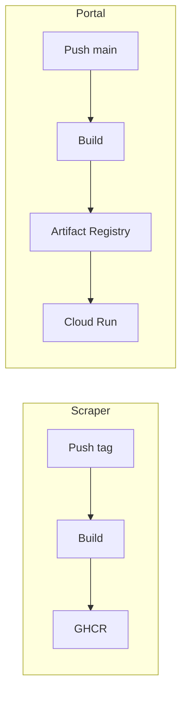

# Workflow: Docker Builds

> Builds automatizados de imagens Docker para os serviços.

## Visão Geral

O projeto usa Docker para containerização de dois serviços principais:

| Serviço | Imagem | Registry |
|---------|--------|----------|
| Scraper | `govbrnews-scraper` | GitHub Container Registry |
| Portal | `destaquesgovbr-portal` | GCP Artifact Registry |



---

## Build do Scraper

**Arquivo**: `govbrnews-scraper/.github/workflows/docker-build.yaml`

### Trigger

```yaml
on:
  push:
    tags:
      - 'v*'  # Apenas tags de versão
  workflow_dispatch:  # Manual
```

### Workflow

```yaml
name: Build Docker Image

on:
  push:
    tags:
      - 'v*'
  workflow_dispatch:

jobs:
  build:
    runs-on: ubuntu-latest
    permissions:
      contents: read
      packages: write

    steps:
      - name: Checkout
        uses: actions/checkout@v4

      - name: Login to GHCR
        uses: docker/login-action@v3
        with:
          registry: ghcr.io
          username: ${{ github.actor }}
          password: ${{ secrets.GITHUB_TOKEN }}

      - name: Extract metadata
        id: meta
        uses: docker/metadata-action@v5
        with:
          images: ghcr.io/${{ github.repository }}
          tags: |
            type=semver,pattern={{version}}
            type=semver,pattern={{major}}.{{minor}}
            type=raw,value=latest

      - name: Build and push
        uses: docker/build-push-action@v5
        with:
          context: .
          push: true
          tags: ${{ steps.meta.outputs.tags }}
          labels: ${{ steps.meta.outputs.labels }}
```

### Dockerfile do Scraper

```dockerfile
FROM python:3.12-slim

WORKDIR /app

# Instalar dependências do sistema
RUN apt-get update && apt-get install -y \
    git \
    && rm -rf /var/lib/apt/lists/*

# Instalar Poetry
RUN pip install poetry

# Copiar arquivos de dependência
COPY pyproject.toml poetry.lock ./

# Instalar dependências
RUN poetry config virtualenvs.create false \
    && poetry install --no-dev --no-interaction --no-ansi

# Copiar código
COPY src/ ./src/

# Comando padrão
CMD ["python", "src/main.py", "--help"]
```

### Tags geradas

Para tag `v1.2.3`:
- `ghcr.io/destaquesgovbr/govbrnews-scraper:1.2.3`
- `ghcr.io/destaquesgovbr/govbrnews-scraper:1.2`
- `ghcr.io/destaquesgovbr/govbrnews-scraper:latest`

### Execução

```bash
# Via tag (dispara automático)
git tag v1.2.3
git push origin v1.2.3

# Manual
gh workflow run docker-build.yaml
```

---

## Build do Portal

**Arquivo**: `destaquesgovbr-portal/.github/workflows/deploy-production.yml`

> O build do portal está integrado ao workflow de deploy (ver [portal-deploy.md](./portal-deploy.md)).

### Dockerfile do Portal (Multistage)

```dockerfile
# Stage 1: Dependencies
FROM node:20-alpine AS deps
WORKDIR /app
COPY package*.json ./
RUN npm ci --only=production

# Stage 2: Build
FROM node:20-alpine AS builder
WORKDIR /app

# Copiar node_modules
COPY --from=deps /app/node_modules ./node_modules
COPY . .

# Args de build
ARG TYPESENSE_HOST
ARG TYPESENSE_PORT
ARG TYPESENSE_PROTOCOL
ARG TYPESENSE_API_KEY

# Variáveis de ambiente para build
ENV TYPESENSE_HOST=$TYPESENSE_HOST
ENV TYPESENSE_PORT=$TYPESENSE_PORT
ENV TYPESENSE_PROTOCOL=$TYPESENSE_PROTOCOL
ENV TYPESENSE_API_KEY=$TYPESENSE_API_KEY
ENV NEXT_TELEMETRY_DISABLED=1

# Build Next.js standalone
RUN npm run build

# Stage 3: Production
FROM node:20-alpine AS runner
WORKDIR /app

ENV NODE_ENV=production
ENV NEXT_TELEMETRY_DISABLED=1

# Criar usuário não-root
RUN addgroup --system --gid 1001 nodejs
RUN adduser --system --uid 1001 nextjs

# Copiar artifacts de build
COPY --from=builder /app/public ./public
COPY --from=builder --chown=nextjs:nodejs /app/.next/standalone ./
COPY --from=builder --chown=nextjs:nodejs /app/.next/static ./.next/static

USER nextjs

EXPOSE 3000
ENV PORT=3000

CMD ["node", "server.js"]
```

### Otimizações

- **Multistage**: Reduz tamanho final da imagem
- **Standalone output**: Next.js gera servidor independente
- **Non-root user**: Segurança
- **Layer caching**: Deps em stage separado

---

## GitHub Container Registry (GHCR)

### Autenticação

```bash
# Login via CLI
echo $GITHUB_TOKEN | docker login ghcr.io -u USERNAME --password-stdin
```

### Pull de imagem

```bash
docker pull ghcr.io/destaquesgovbr/govbrnews-scraper:latest
```

### Permissões

O workflow usa `GITHUB_TOKEN` automático com permissão `packages: write`.

---

## GCP Artifact Registry

### Autenticação

```bash
# Via gcloud
gcloud auth configure-docker us-east1-docker.pkg.dev
```

### Push de imagem

```bash
docker push us-east1-docker.pkg.dev/PROJECT_ID/destaquesgovbr/portal:TAG
```

---

## Build Local

### Scraper

```bash
cd govbrnews-scraper

# Build
docker build -t govbrnews-scraper .

# Executar
docker run --env-file .env govbrnews-scraper python src/main.py --help
```

### Portal

```bash
cd destaquesgovbr-portal

# Build (precisa das vars de ambiente)
docker build \
  --build-arg TYPESENSE_HOST=localhost \
  --build-arg TYPESENSE_PORT=8108 \
  --build-arg TYPESENSE_PROTOCOL=http \
  --build-arg TYPESENSE_API_KEY=xyz \
  -t destaquesgovbr-portal .

# Executar
docker run -p 3000:3000 destaquesgovbr-portal
```

---

## Boas Práticas

### 1. Cache de layers

```dockerfile
# ❌ Ruim - invalida cache a cada mudança
COPY . .
RUN npm install

# ✅ Bom - aproveita cache de deps
COPY package*.json ./
RUN npm ci
COPY . .
```

### 2. Imagens pequenas

```dockerfile
# ❌ Ruim - imagem base grande
FROM node:20

# ✅ Bom - imagem Alpine menor
FROM node:20-alpine
```

### 3. Non-root user

```dockerfile
RUN adduser -D appuser
USER appuser
```

### 4. Multi-stage build

```dockerfile
FROM node:20-alpine AS builder
# ... build ...

FROM node:20-alpine AS runner
COPY --from=builder /app/dist ./
```

---

## Troubleshooting

### Build falha

1. Verificar Dockerfile syntax
2. Verificar se todas as deps estão listadas
3. Verificar logs do build

### Push falha

1. Verificar autenticação
2. Verificar permissões no registry
3. Verificar nome da imagem

### Imagem muito grande

1. Usar imagem base Alpine
2. Usar multi-stage build
3. Limpar cache de package managers
4. Usar .dockerignore

---

## .dockerignore

### Scraper

```
.git
.github
.env*
*.pyc
__pycache__
.pytest_cache
.mypy_cache
tests/
docs/
```

### Portal

```
.git
.github
node_modules
.next
.env*
*.md
tests/
```

---

## Links Relacionados

- [Pipeline Scraper](./scraper-pipeline.md) - Uso da imagem
- [Deploy Portal](./portal-deploy.md) - Build + Deploy
- [Setup Backend](../onboarding/setup-backend.md) - Desenvolvimento local
- [Setup Frontend](../onboarding/setup-frontend.md) - Desenvolvimento local
