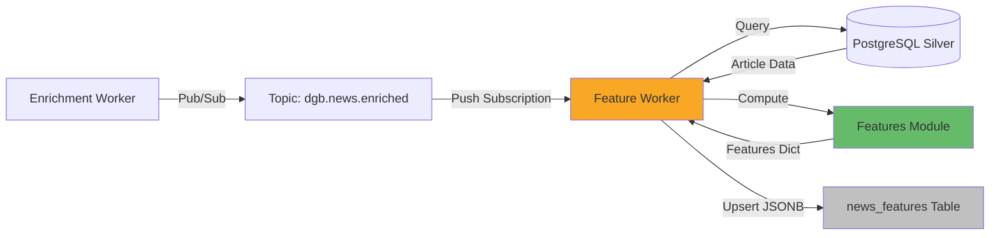
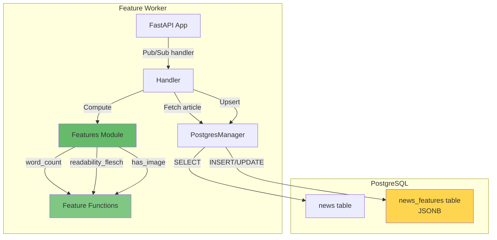

# Feature Engineering Pipeline

**Pipeline de extração e computação de features** para notícias do DestaquesGovbr usando Feature Store JSONB.

---

## Visão Geral

O **Feature Worker** é um serviço Cloud Run event-driven que consome eventos do tópico Pub/Sub `dgb.news.enriched` e computa features locais (sem IA) para cada notícia, armazenando-as em uma tabela PostgreSQL `news_features` com schema JSONB flexível.

### Características

- ✅ **Event-Driven**: Processa eventos Pub/Sub (push subscription)
- ✅ **Feature Store JSONB**: Schema flexível para adicionar features sem migrations
- ✅ **Local Features**: Computação determinística sem dependência de modelos externos
- ✅ **Idempotente**: Merge de features preserva valores existentes
- ✅ **Testável**: Funções puras de computação (sem I/O)
- ✅ **Latência**: P95 < 500ms por notícia

---

## Arquitetura

### Fluxo de Dados



### Componentes



---

## Feature Store: `news_features` Table

### Schema PostgreSQL

```sql
CREATE TABLE news_features (
    unique_id VARCHAR(32) PRIMARY KEY REFERENCES news(unique_id) ON DELETE CASCADE,
    features JSONB NOT NULL DEFAULT '{}',
    updated_at TIMESTAMP WITH TIME ZONE NOT NULL DEFAULT NOW()
);

-- Índice GIN para queries em campos específicos do JSONB
CREATE INDEX idx_news_features_gin ON news_features USING GIN (features);

-- Índice para ordenação por data de atualização
CREATE INDEX idx_news_features_updated_at ON news_features (updated_at DESC);
```

### Estrutura JSONB

```json
{
  "word_count": 450,
  "char_count": 2850,
  "paragraph_count": 8,
  "has_image": true,
  "has_video": false,
  "publication_hour": 14,
  "publication_dow": 2,
  "readability_flesch": 62.5
}
```

### Operações JSONB

#### Upsert com Merge

```python
def upsert_features(self, unique_id: str, features: dict) -> bool:
    """
    Merge features into news_features (JSONB || operator).
    Preserva features existentes, adiciona novas, sobrescreve duplicadas.
    """
    cursor.execute("""
        INSERT INTO news_features (unique_id, features)
        VALUES (%s, %s::jsonb)
        ON CONFLICT (unique_id) DO UPDATE SET
            features = news_features.features || EXCLUDED.features,
            updated_at = NOW()
    """, (unique_id, json.dumps(features)))
```

#### Query Específica

```sql
-- Notícias com imagens
SELECT n.title, nf.features->>'word_count' as word_count
FROM news n
JOIN news_features nf ON n.unique_id = nf.unique_id
WHERE nf.features @> '{"has_image": true}'
ORDER BY n.published_at DESC
LIMIT 10;

-- Notícias publicadas à tarde (14-18h)
SELECT n.title
FROM news n
JOIN news_features nf ON n.unique_id = nf.unique_id
WHERE (nf.features->>'publication_hour')::int BETWEEN 14 AND 18;

-- Readability score > 60 (fácil de ler)
SELECT n.title, nf.features->>'readability_flesch' as flesch
FROM news n
JOIN news_features nf ON n.unique_id = nf.unique_id
WHERE (nf.features->>'readability_flesch')::float > 60
ORDER BY (nf.features->>'readability_flesch')::float DESC;
```

---

## Features Computadas

### Lista de Features (Fase 1: Local)

| Feature | Tipo | Descrição | Função |
|---------|------|-----------|--------|
| `word_count` | int | Contagem de palavras do conteúdo | `compute_word_count()` |
| `char_count` | int | Contagem de caracteres | `compute_char_count()` |
| `paragraph_count` | int | Contagem de parágrafos | `compute_paragraph_count()` |
| `has_image` | bool | Notícia possui imagem | `compute_has_image()` |
| `has_video` | bool | Notícia possui vídeo | `compute_has_video()` |
| `publication_hour` | int | Hora de publicação (0-23) | `compute_publication_hour()` |
| `publication_dow` | int | Dia da semana (0=Mon, 6=Sun) | `compute_publication_dow()` |
| `readability_flesch` | float | Flesch Reading Ease Score | `compute_readability_flesch()` |

### Feature: `word_count`

**Descrição**: Contagem de palavras do conteúdo.

**Implementação**:
```python
def compute_word_count(content: str | None) -> int:
    if not content:
        return 0
    return len(content.split())
```

**Uso**: Filtrar notícias curtas/longas, análise de distribuição de tamanho.

---

### Feature: `readability_flesch`

**Descrição**: [Flesch Reading Ease Score](https://en.wikipedia.org/wiki/Flesch%E2%80%93Kincaid_readability_tests) - métrica de legibilidade (0-100, maior = mais fácil).

**Implementação**:
```python
import textstat

def compute_readability_flesch(content: str | None) -> float | None:
    if not content or len(content.split()) < 10:
        return None
    try:
        return round(textstat.flesch_reading_ease(content), 2)
    except Exception:
        return None
```

**Interpretação**:
- **90-100**: Muito fácil (5ª série)
- **60-70**: Padrão (8ª-9ª série)
- **30-50**: Difícil (universitário)
- **0-30**: Muito difícil (pós-graduação)

**Uso**: Recomendar notícias acessíveis, análise de complexidade por órgão.

---

### Feature: `publication_hour` e `publication_dow`

**Descrição**: Hora do dia (0-23) e dia da semana (0=Segunda, 6=Domingo).

**Implementação**:
```python
from datetime import datetime

def compute_publication_hour(published_at: datetime) -> int:
    return published_at.hour

def compute_publication_dow(published_at: datetime) -> int:
    return published_at.weekday()  # Monday=0, Sunday=6
```

**Uso**: Análise de padrões temporais (ex: órgãos que publicam mais à tarde, dias mais ativos).

---

## Módulo de Features

### Arquivo: `features.py`

**Localização**: `data-platform/src/data_platform/workers/feature_worker/features.py`

**Princípios**:
- ✅ **Pure functions**: Sem I/O, apenas computação
- ✅ **Testável**: Fácil de escrever testes unitários
- ✅ **Type hints**: Tipos explícitos para inputs/outputs
- ✅ **Defensive**: Retorna 0/None/False para inputs inválidos

**Função Principal**:
```python
def compute_all(article: dict) -> dict:
    """
    Compute all local features for an article.
    
    Args:
        article: dict with keys: content, image_url, video_url, published_at
    
    Returns:
        dict ready for JSONB merge via upsert_features()
    """
    content = article.get("content")
    published_at = article.get("published_at")
    
    features: dict = {
        "word_count": compute_word_count(content),
        "char_count": compute_char_count(content),
        "paragraph_count": compute_paragraph_count(content),
        "has_image": compute_has_image(article.get("image_url")),
        "has_video": compute_has_video(article.get("video_url")),
    }
    
    if published_at:
        features["publication_hour"] = compute_publication_hour(published_at)
        features["publication_dow"] = compute_publication_dow(published_at)
    
    flesch = compute_readability_flesch(content)
    if flesch is not None:
        features["readability_flesch"] = flesch
    
    return features
```

---

## Feature Worker

### Stack Tecnológico

| Componente | Tecnologia |
|-----------|-----------|
| **Framework** | FastAPI |
| **Runtime** | Python 3.11 |
| **Database** | PostgreSQL 15 |
| **Deploy** | Cloud Run |
| **Trigger** | Pub/Sub push subscription |
| **Dependencies** | textstat (readability) |

### Endpoints

#### POST `/process`

Processa evento Pub/Sub do tópico `dgb.news.enriched`.

**Request** (Pub/Sub envelope):
```json
{
  "message": {
    "data": "eyJ1bmlxdWVfaWQiOiAiYWJjMTIzIn0=",  // base64
    "attributes": {
      "trace_id": "xyz789"
    }
  }
}
```

**Payload decodificado**:
```json
{
  "unique_id": "abc123"
}
```

**Response**:
```json
{
  "status": "computed",
  "unique_id": "abc123",
  "features": [
    "word_count",
    "char_count",
    "paragraph_count",
    "has_image",
    "has_video",
    "publication_hour",
    "publication_dow",
    "readability_flesch"
  ]
}
```

#### GET `/health`

Health check endpoint.

**Response**:
```json
{
  "status": "ok"
}
```

---

## Deployment

### Pub/Sub Subscription

```bash
gcloud pubsub subscriptions create feature-worker-sub \
  --topic=dgb.news.enriched \
  --push-endpoint=https://feature-worker-xxx.a.run.app/process \
  --ack-deadline=60 \
  --retry-policy-minimum-backoff=5s \
  --retry-policy-maximum-backoff=300s \
  --max-delivery-attempts=5
```

### Cloud Run Deploy

```bash
gcloud run deploy feature-worker \
  --image=gcr.io/destaques-govbr/feature-worker:latest \
  --platform=managed \
  --region=southamerica-east1 \
  --memory=512Mi \
  --cpu=1 \
  --min-instances=0 \
  --max-instances=10 \
  --timeout=60 \
  --concurrency=10 \
  --set-env-vars=POSTGRES_HOST=10.x.x.x,POSTGRES_DB=govbrnews
```

### Dockerfile

```dockerfile
FROM python:3.11-slim

WORKDIR /app

# Install dependencies
COPY pyproject.toml poetry.lock ./
RUN pip install poetry && poetry install --no-dev

# Copy application
COPY src/data_platform ./data_platform

EXPOSE 8080

CMD ["poetry", "run", "uvicorn", "data_platform.workers.feature_worker.app:app", "--host", "0.0.0.0", "--port", "8080"]
```

---

## Configuração

### Variáveis de Ambiente

```bash
# PostgreSQL
POSTGRES_HOST=10.x.x.x
POSTGRES_PORT=5432
POSTGRES_DB=govbrnews
POSTGRES_USER=feature_worker
POSTGRES_PASSWORD=...

# Logging
LOG_LEVEL=INFO
```

---

## Testes

### Testes Unitários: Features

**Arquivo**: `data-platform/tests/unit/test_feature_computation.py`

```python
import pytest
from datetime import datetime
from data_platform.workers.feature_worker.features import (
    compute_word_count,
    compute_readability_flesch,
    compute_publication_hour,
    compute_all,
)

def test_compute_word_count():
    assert compute_word_count("Hello world") == 2
    assert compute_word_count("") == 0
    assert compute_word_count(None) == 0

def test_compute_readability_flesch():
    # Texto longo e simples (fácil)
    text = "O gato subiu no telhado. O cachorro latiu. A casa é bonita."
    score = compute_readability_flesch(text)
    assert score > 50  # Fácil de ler
    
    # Texto curto (não calcula)
    assert compute_readability_flesch("Olá") is None

def test_compute_publication_hour():
    dt = datetime(2026, 5, 6, 14, 30)
    assert compute_publication_hour(dt) == 14

def test_compute_all():
    article = {
        "content": "Ministério anuncia nova política pública. " * 50,
        "image_url": "https://example.com/img.jpg",
        "video_url": None,
        "published_at": datetime(2026, 5, 6, 10, 0),
    }
    features = compute_all(article)
    
    assert features["word_count"] > 0
    assert features["has_image"] is True
    assert features["has_video"] is False
    assert features["publication_hour"] == 10
    assert features["publication_dow"] == 1  # Tuesday
    assert "readability_flesch" in features
```

### Testes de Integração: Handler

**Arquivo**: `data-platform/tests/integration/test_feature_worker.py`

```python
def test_handle_feature_computation(pg_test: PostgresManager):
    # 1. Inserir notícia de teste
    article_id = "test-123"
    pg_test.insert_news({
        "unique_id": article_id,
        "title": "Título de teste",
        "content": "Conteúdo de teste " * 100,
        "image_url": "https://example.com/img.jpg",
        "published_at": datetime.now(),
    })
    
    # 2. Executar handler
    from data_platform.workers.feature_worker.handler import handle_feature_computation
    result = handle_feature_computation(article_id, pg_test)
    
    # 3. Verificar resultado
    assert result["status"] == "computed"
    assert "word_count" in result["features"]
    
    # 4. Verificar que features foram salvas
    features = pg_test.get_features(article_id)
    assert features is not None
    assert features["word_count"] > 0
    assert features["has_image"] is True
```

---

## Monitoramento

### Métricas Cloud Monitoring

```yaml
# Métricas recomendadas
- name: feature_worker_latency_p95
  metric: run.googleapis.com/request_latencies
  filter: resource.service_name="feature-worker"
  threshold: P95 > 500ms
  
- name: feature_worker_error_rate
  metric: run.googleapis.com/request_count
  filter: metric.response_code_class="5xx"
  threshold: > 0.5%
  
- name: feature_computation_success_rate
  metric: custom/feature_worker/computation_success
  threshold: < 98%
```

### Logs Estruturados

```python
# Em handler.py
logger.info(f"Processing {unique_id} (trace={trace_id})")
logger.info(f"Computed {len(features)} features for {unique_id}")
logger.warning(f"Article {unique_id} not found")
logger.error(f"Unhandled error for {unique_id}: {e}", exc_info=True)
```

### Dashboard Grafana

```yaml
# Query para monitorar throughput
- expr: |
    rate(feature_worker_requests_total[5m])
  legendFormat: "Features Computed/sec"

# Query para monitorar features por tipo
- expr: |
    sum by (feature_name) (feature_worker_computed_total)
  legendFormat: "{{ feature_name }}"
```

---

## Feature Registry (Planejado)

### Arquivo: `feature_registry.yaml`

**Objetivo**: Controle de versões de features e rastreamento de dependências.

```yaml
features:
  word_count:
    version: "1.0"
    type: integer
    description: "Contagem de palavras do conteúdo"
    model: "local/python"
    compute: "feature-worker"
    
  readability_flesch:
    version: "1.0"
    type: float
    description: "Flesch Reading Ease Score (0-100)"
    model: "textstat"
    compute: "feature-worker"
    dependencies:
      - textstat==0.7.3
```

**Uso Futuro**:
- Reprocessamento seletivo quando uma feature muda de versão
- Validação de schema JSONB
- Documentação automática de features disponíveis

---

## Roadmap: Fases Futuras

### Fase 2: Features com IA (Planejado)

| Feature | Tipo | Modelo | Compute |
|---------|------|--------|---------|
| `sentiment` | dict | AWS Bedrock Comprehend | sentiment-worker |
| `entities` | list | AWS Bedrock NER | entity-worker |
| `topics` | list | Topic Modeling | topic-worker |
| `image_labels` | list | Google Vision API | image-worker |

### Fase 3: Medallion Gold Layer (Planejado)

- Agregar features em BigQuery para análise
- Criar views materializadas para dashboards
- Trending topics baseado em features temporais

---

## Troubleshooting

### Problema: Feature Worker retorna 200 mas features não aparecem

**Causa**: Erro silencioso no handler (ACK enviado mesmo com exceção).

**Solução**:
```bash
# Verificar logs do Cloud Run
gcloud logging read \
  "resource.type=cloud_run_revision AND \
   resource.labels.service_name=feature-worker AND \
   severity>=ERROR" \
  --limit=50
```

---

### Problema: `readability_flesch` sempre `null`

**Causa**: textstat falha para textos em português.

**Solução**: O textstat não é otimizado para português. Considerar alternativa como [textstat-pt](https://github.com/rafaelha/textstat-pt) ou skip para português.

---

### Problema: JSONB merge sobrescreve features antigas indesejadamente

**Causa**: Operador `||` sobrescreve chaves duplicadas.

**Solução**: Se quiser preservar valores antigos, use `jsonb_set()` ao invés de merge.

---

## Referências

### Interna
- [Arquitetura Medallion (ADR-001)](../arquitetura/adrs/adr-001-arquitetura-dados-medallion.md)
- [Data Architecture Evolution Plan](https://github.com/destaquesgovbr/data-platform/blob/main/_plan/DATA-ARCHITECTURE-EVOLUTION.md)
- [PostgreSQL Manager](../modulos/data-platform.md#postgresmanager)
- [Pub/Sub Workers](../arquitetura/pubsub-workers.md)

### Externa
- [PostgreSQL JSONB Operators](https://www.postgresql.org/docs/current/functions-json.html)
- [Flesch Reading Ease](https://en.wikipedia.org/wiki/Flesch%E2%80%93Kincaid_readability_tests)
- [textstat Python Library](https://github.com/textstat/textstat)
- [Feature Store Concepts (Google ML)](https://cloud.google.com/architecture/mlops-continuous-delivery-and-automation-pipelines-in-machine-learning#feature_store)

---

**Última atualização**: 06/05/2026  
**Responsável**: Equipe Data Platform - DestaquesGovbr  
**Status**: ✅ Implementado (Fase 1 - Features Locais)