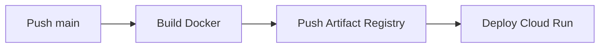
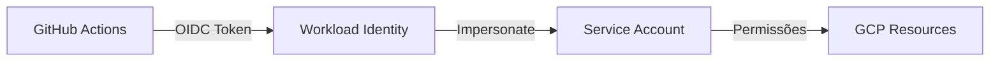
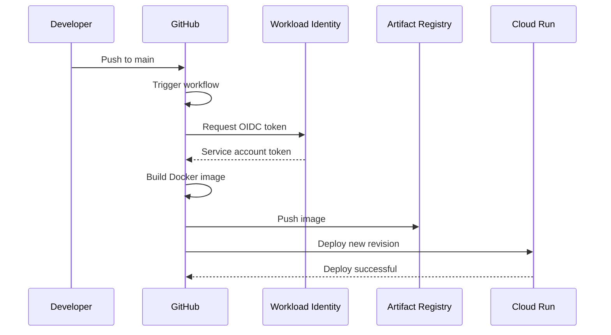

# Workflow: Deploy do Portal

> Deploy automatizado do portal Next.js para Google Cloud Run.

**Arquivo**: `portal/.github/workflows/deploy-production.yml`

## Visão Geral

O workflow faz deploy automático quando há push na branch `main`:



---

## Trigger

```yaml
on:
  push:
    branches:
      - main
  workflow_dispatch: # Manual
```

### Automático

- Push para `main` dispara deploy
- PRs não disparam (apenas após merge)

### Manual

```bash
gh workflow run deploy-production.yml
```

---

## Jobs

### Job: `build-and-deploy`

```yaml
build-and-deploy:
  runs-on: ubuntu-latest
  permissions:
    contents: read
    id-token: write # Para Workload Identity

  steps:
    - name: Checkout
      uses: actions/checkout@v4

    - name: Authenticate to Google Cloud
      uses: google-github-actions/auth@v2
      with:
        workload_identity_provider: ${{ secrets.WIF_PROVIDER }}
        service_account: ${{ secrets.WIF_SERVICE_ACCOUNT }}

    - name: Set up Cloud SDK
      uses: google-github-actions/setup-gcloud@v2

    - name: Configure Docker
      run: gcloud auth configure-docker us-east1-docker.pkg.dev

    - name: Build Docker image
      run: |
        docker build \
          --build-arg TYPESENSE_HOST=${{ secrets.TYPESENSE_HOST }} \
          --build-arg TYPESENSE_PORT=${{ secrets.TYPESENSE_PORT }} \
          --build-arg TYPESENSE_API_KEY=${{ secrets.TYPESENSE_API_KEY }} \
          -t us-east1-docker.pkg.dev/${{ secrets.GCP_PROJECT }}/destaquesgovbr/portal:${{ github.sha }} \
          -t us-east1-docker.pkg.dev/${{ secrets.GCP_PROJECT }}/destaquesgovbr/portal:latest \
          .

    - name: Push to Artifact Registry
      run: |
        docker push us-east1-docker.pkg.dev/${{ secrets.GCP_PROJECT }}/destaquesgovbr/portal:${{ github.sha }}
        docker push us-east1-docker.pkg.dev/${{ secrets.GCP_PROJECT }}/destaquesgovbr/portal:latest

    - name: Deploy to Cloud Run
      run: |
        gcloud run deploy portal \
          --image us-east1-docker.pkg.dev/${{ secrets.GCP_PROJECT }}/destaquesgovbr/portal:${{ github.sha }} \
          --region us-east1 \
          --platform managed \
          --allow-unauthenticated
```

---

## Dockerfile (Multistage)

```dockerfile
# Stage 1: Dependencies
FROM node:20-alpine AS deps
WORKDIR /app
RUN corepack enable && corepack prepare pnpm@latest --activate
COPY package.json pnpm-lock.yaml ./
RUN pnpm install --frozen-lockfile

# Stage 2: Build
FROM node:20-alpine AS builder
WORKDIR /app
COPY --from=deps /app/node_modules ./node_modules
COPY . .

# Build args para variáveis de ambiente
ARG TYPESENSE_HOST
ARG TYPESENSE_PORT
ARG TYPESENSE_API_KEY

ENV TYPESENSE_HOST=$TYPESENSE_HOST
ENV TYPESENSE_PORT=$TYPESENSE_PORT
ENV TYPESENSE_API_KEY=$TYPESENSE_API_KEY

RUN corepack enable && corepack prepare pnpm@latest --activate && pnpm build

# Stage 3: Production
FROM node:20-alpine AS runner
WORKDIR /app

ENV NODE_ENV=production

# Copiar apenas o necessário
COPY --from=builder /app/public ./public
COPY --from=builder /app/.next/standalone ./
COPY --from=builder /app/.next/static ./.next/static

EXPOSE 3000
CMD ["node", "server.js"]
```

---

## Autenticação: Workload Identity Federation

O workflow usa **Workload Identity Federation** para autenticar no GCP sem secrets de service account:



### Configuração no Terraform

```hcl
# workload-identity.tf
resource "google_iam_workload_identity_pool" "github" {
  workload_identity_pool_id = "github-pool"
}

resource "google_iam_workload_identity_pool_provider" "github" {
  workload_identity_pool_id          = google_iam_workload_identity_pool.github.workload_identity_pool_id
  workload_identity_pool_provider_id = "github-provider"

  attribute_mapping = {
    "google.subject"       = "assertion.sub"
    "attribute.actor"      = "assertion.actor"
    "attribute.repository" = "assertion.repository"
  }

  oidc {
    issuer_uri = "https://token.actions.githubusercontent.com"
  }
}
```

---

## Secrets Necessárias

| Secret                | Descrição                        |
| --------------------- | -------------------------------- |
| `GCP_PROJECT`         | ID do projeto GCP                |
| `WIF_PROVIDER`        | Provider do Workload Identity    |
| `WIF_SERVICE_ACCOUNT` | Service account para impersonate |
| `TYPESENSE_HOST`      | Host do Typesense (IP interno)   |
| `TYPESENSE_PORT`      | Porta do Typesense               |
| `TYPESENSE_API_KEY`   | API Key do Typesense             |

### Formato do WIF_PROVIDER

```
projects/<PROJECT_NUMBER>/locations/global/workloadIdentityPools/<POOL_ID>/providers/<PROVIDER_ID>
```

---

## Cloud Run Config

### Recursos

```yaml
# Configuração típica
cpu: 1
memory: 512Mi
min-instances: 0
max-instances: 10
concurrency: 80
timeout: 300s
```

### Networking

- VPC Connector para acesso ao Typesense (rede interna)
- Egress: all-traffic via VPC

---

## Diagrama de Deploy



---

## Monitoramento

### Ver status

```bash
# Execuções recentes
gh run list --workflow=deploy-production.yml

# Status do Cloud Run
gcloud run services describe portal --region=us-east1
```

### Logs do Cloud Run

```bash
gcloud run services logs read portal --region=us-east1
```

---

## Rollback

### Via Cloud Run

```bash
# Listar revisões
gcloud run revisions list --service=portal --region=us-east1

# Voltar para revisão anterior
gcloud run services update-traffic portal \
  --to-revisions=<revision-name>=100 \
  --region=us-east1
```

### Via Git

```bash
# Reverter commit
git revert HEAD
git push origin main
# Workflow dispara novo deploy
```

---

## Troubleshooting

### Build falha

- Verificar logs do Docker build
- Verificar se todas as dependências estão no package.json
- Verificar variáveis de ambiente

### Deploy falha

- Verificar permissões do service account
- Verificar se imagem foi pushed corretamente
- Verificar logs do Cloud Run

### Aplicação não responde

- Verificar conexão com Typesense
- Verificar variáveis de ambiente no Cloud Run
- Verificar logs de erro

---

## Duração

| Etapa            | Duração Típica |
| ---------------- | -------------- |
| Checkout         | ~10s           |
| Auth GCP         | ~20s           |
| Build Docker     | 2-4 min        |
| Push Registry    | 30-60s         |
| Deploy Cloud Run | 1-2 min        |
| **Total**        | **~5-8 min**   |

---

## Links Relacionados

- [Módulo Portal](../modulos/portal.md) - Detalhes do portal
- [Arquitetura GCP](../infraestrutura/arquitetura-gcp.md) - Infraestrutura
- [Terraform Guide](../infraestrutura/terraform-guide.md) - IaC
- [Secrets e IAM](../infraestrutura/secrets-iam.md) - Permissões
