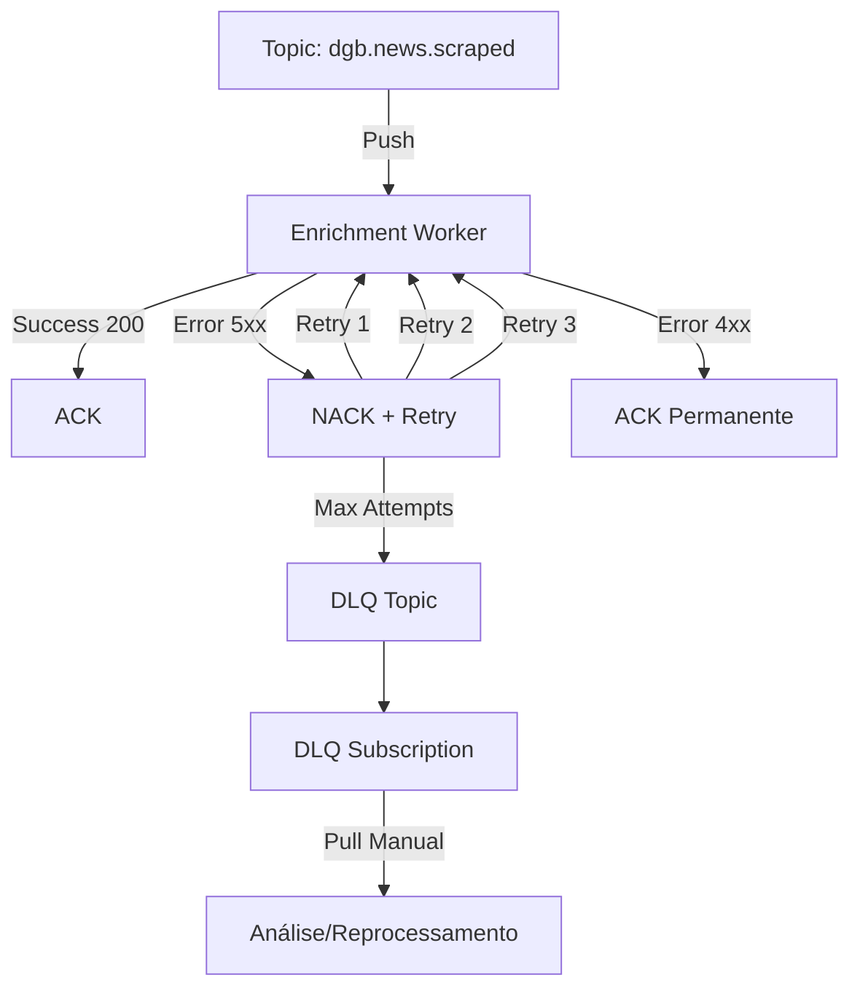

# Tratamento de Falhas com Pub/Sub Dead-Letter Queue

Guia para gerenciar mensagens falhadas e estratégias de retry no DestaquesGovbr.

---

## Visão Geral

O sistema usa **Dead-Letter Queues (DLQ)** para isolar mensagens que falharam após múltiplas tentativas de processamento, permitindo análise e reprocessamento manual sem bloquear o fluxo principal.

### Arquitetura



---

## Configuração de DLQ

### 1. Criar DLQ Topic

```bash
# Topic principal
gcloud pubsub topics create dgb.news.scraped

# Topic DLQ
gcloud pubsub topics create dgb.news.scraped-dlq
```

### 2. Criar Subscription com DLQ

```bash
gcloud pubsub subscriptions create enrichment-worker-sub \
  --topic=dgb.news.scraped \
  --push-endpoint=https://enrichment-worker-xxx.a.run.app \
  --ack-deadline=600 \
  --retry-policy-minimum-backoff=10s \
  --retry-policy-maximum-backoff=600s \
  --dead-letter-topic=dgb.news.scraped-dlq \
  --max-delivery-attempts=5
```

**Parâmetros importantes**:
- `--ack-deadline=600`: Tempo máximo de processamento (10 minutos)
- `--retry-policy-minimum-backoff=10s`: Delay inicial entre retries
- `--retry-policy-maximum-backoff=600s`: Delay máximo (10 minutos)
- `--max-delivery-attempts=5`: Tentativas antes de enviar para DLQ

### 3. Criar Subscription Pull para DLQ

```bash
gcloud pubsub subscriptions create enrichment-worker-dlq-sub \
  --topic=dgb.news.scraped-dlq \
  --ack-deadline=300
```

---

## Retry Policy (Exponential Backoff)

### Comportamento de Retry

| Tentativa | Backoff | Tempo Acumulado | Status |
|-----------|---------|-----------------|--------|
| 1ª | 0s | 0s | Processamento inicial |
| 2ª | 10s | 10s | Após 1ª falha |
| 3ª | 20s | 30s | Após 2ª falha |
| 4ª | 40s | 70s | Após 3ª falha |
| 5ª | 80s | 150s | Após 4ª falha |
| → DLQ | - | - | Após 5ª falha |

**Cálculo**: `backoff_time = min(max_backoff, min_backoff * 2^(attempt-1))`

### HTTP Status Codes

| Status | Comportamento | Descrição |
|--------|--------------|-----------|
| **200-299** | ACK | Sucesso, mensagem removida da fila |
| **400-499** | ACK | Erro do cliente (payload inválido), não retenta |
| **500-503** | NACK + Retry | Erro do servidor, retenta com backoff |
| **504** | NACK + Retry | Timeout, retenta |

---

## Monitoramento de DLQ

### 1. Métricas Cloud Monitoring

```bash
# Monitorar quantidade de mensagens na DLQ
gcloud monitoring time-series list \
  --filter='metric.type="pubsub.googleapis.com/subscription/num_undelivered_messages" AND resource.labels.subscription_id="enrichment-worker-dlq-sub"' \
  --format="table(metric.labels.subscription_id, points[0].value.int64_value)" \
  --limit=10
```

### 2. Dashboard Grafana

```yaml
# Query Prometheus para Grafana
- expr: |
    pubsub_subscription_num_undelivered_messages{subscription_id="enrichment-worker-dlq-sub"}
  legendFormat: "DLQ Messages"
```

### 3. Alertas

```yaml
# Cloud Monitoring Alert Policy
displayName: "DLQ Messages Threshold"
conditions:
  - conditionThreshold:
      filter: |
        metric.type="pubsub.googleapis.com/subscription/num_undelivered_messages"
        resource.type="pubsub_subscription"
        resource.labels.subscription_id="enrichment-worker-dlq-sub"
      comparison: COMPARISON_GT
      thresholdValue: 10
      duration: 300s
notificationChannels:
  - projects/destaques-govbr/notificationChannels/email-oncall
```

---

## Análise de Falhas

### 1. Listar Mensagens na DLQ

```bash
# Pull 10 mensagens (sem ACK)
gcloud pubsub subscriptions pull enrichment-worker-dlq-sub \
  --limit=10 \
  --format=json | jq '.'
```

**Output**:
```json
[
  {
    "ackId": "...",
    "message": {
      "data": "base64-encoded-payload",
      "attributes": {
        "trace_id": "abc123",
        "news_id": "xyz789",
        "delivery_attempt": "5"
      },
      "messageId": "1234567890",
      "publishTime": "2026-05-05T10:00:00Z"
    }
  }
]
```

### 2. Decodificar Mensagem

```bash
# Decodificar payload base64
gcloud pubsub subscriptions pull enrichment-worker-dlq-sub --limit=1 --format=json | \
  jq -r '.[0].message.data' | \
  base64 --decode | \
  jq '.'
```

### 3. Analisar Causa Raiz

**Causas comuns**:

| Erro | Causa | Solução |
|------|-------|---------|
| **ValidationException** | Payload inválido, modelo ID incorreto | Corrigir payload ou atualizar modelo |
| **ThrottlingException** | Rate limit AWS Bedrock excedido | Reduzir paralelização, aumentar backoff |
| **TimeoutError** | Worker timeout (>600s) | Otimizar processamento, aumentar ack-deadline |
| **DatabaseError** | PostgreSQL connection timeout | Aumentar connection pool, verificar DB |
| **ModelNotFound** | Modelo Claude não disponível na região | Verificar região, usar modelo alternativo |

### 4. Inspecionar Logs do Worker

```bash
# Buscar logs relacionados ao trace_id
gcloud logging read \
  "resource.type=cloud_run_revision AND \
   resource.labels.service_name=enrichment-worker AND \
   jsonPayload.trace_id=abc123" \
  --limit=50 \
  --format=json
```

---

## Reprocessamento

### Opção 1: Replay Individual

```bash
# Pull 1 mensagem e republicar no tópico principal
MESSAGE=$(gcloud pubsub subscriptions pull enrichment-worker-dlq-sub --limit=1 --format=json)

DATA=$(echo $MESSAGE | jq -r '.[0].message.data')

gcloud pubsub topics publish dgb.news.scraped --message=$DATA
```

### Opção 2: Replay em Batch

```bash
# Script para reprocessar todas as mensagens DLQ
#!/bin/bash

DLQ_SUB="enrichment-worker-dlq-sub"
TARGET_TOPIC="dgb.news.scraped"
BATCH_SIZE=100

while true; do
  MESSAGES=$(gcloud pubsub subscriptions pull $DLQ_SUB \
    --limit=$BATCH_SIZE \
    --format=json)
  
  # Verificar se há mensagens
  if [ "$(echo $MESSAGES | jq 'length')" -eq 0 ]; then
    echo "Nenhuma mensagem restante na DLQ"
    break
  fi
  
  # Republicar cada mensagem
  echo $MESSAGES | jq -r '.[] | .message.data' | while read DATA; do
    gcloud pubsub topics publish $TARGET_TOPIC --message=$DATA
  done
  
  echo "Batch de $BATCH_SIZE mensagens reprocessadas"
  sleep 2
done
```

### Opção 3: Replay com Filtragem

```bash
# Republicar apenas mensagens de uma agência específica
gcloud pubsub subscriptions pull enrichment-worker-dlq-sub \
  --limit=100 \
  --format=json | \
  jq -r '.[] | select(.message.attributes.agency_id == "mgi") | .message.data' | \
  while read DATA; do
    gcloud pubsub topics publish dgb.news.scraped --message=$DATA
  done
```

---

## Reconciliação Automática

### DAG Airflow de Reconciliação

```python
# dags/reconciliation_dlq.py
from airflow import DAG
from airflow.operators.bash import BashOperator
from datetime import datetime, timedelta

default_args = {
    'owner': 'data-platform',
    'depends_on_past': False,
    'email_on_failure': True,
    'email': ['oncall@destaquesgovbr.gov.br'],
    'retries': 1,
    'retry_delay': timedelta(minutes=5),
}

with DAG(
    'reconciliation_dlq',
    default_args=default_args,
    description='Reconcilia mensagens na DLQ após correção de bugs',
    schedule_interval=None,  # Manual trigger
    start_date=datetime(2026, 1, 1),
    catchup=False,
) as dag:

    check_dlq = BashOperator(
        task_id='check_dlq',
        bash_command="""
        COUNT=$(gcloud pubsub subscriptions describe enrichment-worker-dlq-sub \
          --format="value(messageRetentionDuration)")
        echo "Mensagens na DLQ: $COUNT"
        """,
    )

    replay_messages = BashOperator(
        task_id='replay_messages',
        bash_command="""
        gcloud pubsub subscriptions pull enrichment-worker-dlq-sub \
          --limit=1000 \
          --format=json | \
          jq -r '.[].message.data' | \
          while read DATA; do
            gcloud pubsub topics publish dgb.news.scraped --message=$DATA
          done
        """,
    )

    check_dlq >> replay_messages
```

---

## Best Practices

### 1. Ack Deadline

**Recomendação**: `ack_deadline = max_processing_time * 1.5`

```bash
# Para worker com P99 = 20s
ack_deadline = 20s * 1.5 = 30s

# Para worker com P99 = 400s (ex: embeddings)
ack_deadline = 400s * 1.5 = 600s
```

### 2. Max Delivery Attempts

**Recomendação**: 5 tentativas (suficiente para erros transitórios)

- Menos de 5: Pode descartar mensagens recuperáveis
- Mais de 5: Aumenta latência sem ganho significativo

### 3. Backoff Policy

**Recomendação**: Exponencial com limites razoáveis

```bash
--retry-policy-minimum-backoff=10s   # Evita retry imediato
--retry-policy-maximum-backoff=600s  # Evita espera excessiva
```

### 4. DLQ Retention

**Recomendação**: 7 dias (padrão Pub/Sub)

```bash
# Aumentar retenção se necessário
gcloud pubsub topics update dgb.news.scraped-dlq \
  --message-retention-duration=14d
```

---

## Troubleshooting

### Problema: DLQ crescendo rapidamente

**Diagnóstico**:
```bash
# Ver taxa de crescimento
gcloud pubsub subscriptions describe enrichment-worker-dlq-sub \
  --format="value(numUndeliveredMessages)"
```

**Causas**:
- Bug no worker (crash loop)
- Rate limit AWS Bedrock
- PostgreSQL indisponível
- Payload malformado sistemático

**Solução**:
1. Pausar publisher temporariamente
2. Corrigir bug no worker
3. Deploy nova versão
4. Replay mensagens DLQ

### Problema: Mensagens voltam para DLQ após replay

**Causa**: Bug não corrigido ou condição ainda presente.

**Solução**:
1. Analisar logs do worker após replay
2. Identificar erro específico
3. Corrigir código ou configuração
4. Testar com 1 mensagem antes de replay completo

### Problema: DLQ com mensagens antigas (>7 dias)

**Causa**: Mensagens expiradas (retention policy).

**Solução**:
```bash
# Verificar retenção
gcloud pubsub topics describe dgb.news.scraped-dlq \
  --format="value(messageRetentionDuration)"

# Não é possível recuperar mensagens expiradas
# Reprocessar desde a fonte (scraper)
```

---

## Métricas de Sucesso

| Métrica | Target | Atual | Status |
|---------|--------|-------|--------|
| **DLQ Messages** | < 10 | - | ⚠️ Monitorar |
| **Replay Success Rate** | > 95% | - | ⚠️ Monitorar |
| **Time to Resolution** | < 1 hora | - | ⚠️ Monitorar |
| **Max Delivery Attempts** | 5 | 5 | ✅ OK |

---

## Referências

### Interna
- [News Enrichment Worker](../modulos/news-enrichment-worker.md)
- [Workers Pub/Sub](../onboarding/ds/workers-pubsub.md)
- [Scraper Pipeline](./scraper-pipeline.md)

### Externa
- [Google Cloud Pub/Sub - Dead Letter Topics](https://cloud.google.com/pubsub/docs/dead-letter-topics)
- [Pub/Sub Retry Policy](https://cloud.google.com/pubsub/docs/subscription-properties#retry-policies)
- [Cloud Monitoring Pub/Sub Metrics](https://cloud.google.com/pubsub/docs/monitoring)

---

**Última atualização**: 05/05/2026  
**Responsável**: Equipe Data Platform - DestaquesGovbr