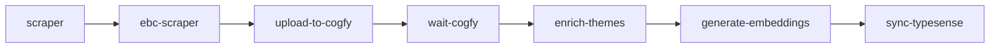
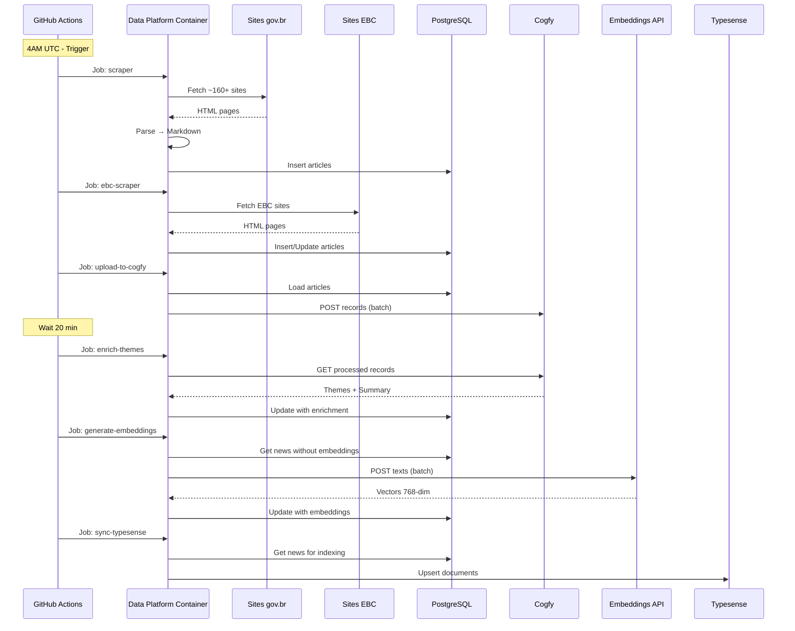

# Workflow: Pipeline do Scraper

> Pipeline diário de coleta e enriquecimento de notícias.

**Arquivo**: `data-platform/.github/workflows/main-workflow.yaml`

## Visão Geral

O pipeline é executado diariamente às **4AM UTC** (1AM Brasília) e consiste em 7 jobs sequenciais:



---

## Trigger

```yaml
on:
  schedule:
    - cron: '0 4 * * *'  # 4AM UTC diário
  workflow_dispatch:      # Manual
    inputs:
      start-date:
        description: 'Data inicial (YYYY-MM-DD)'
        required: false
      end-date:
        description: 'Data final (YYYY-MM-DD)'
        required: false
```

### Execução automática

- **Horário**: 4AM UTC (1AM Brasília)
- **Frequência**: Diária
- **Dias cobertos**: Últimos 3 dias (para capturar atualizações)

### Execução manual

Via GitHub Actions UI ou CLI:

```bash
# Últimos 3 dias (padrão)
gh workflow run main-workflow.yaml

# Período específico
gh workflow run main-workflow.yaml \
  -f start-date=2024-12-01 \
  -f end-date=2024-12-03
```

---

## Jobs Detalhados

### Job 1: `scraper`

Raspa notícias dos sites gov.br e insere no PostgreSQL.

```yaml
scraper:
  runs-on: ubuntu-latest
  container:
    image: ghcr.io/destaquesgovbr/data-platform:latest
  steps:
    - name: Scrape gov.br sites
      run: |
        data-platform scrape \
          --start-date ${{ inputs.start-date || steps.dates.outputs.start }} \
          --end-date ${{ inputs.end-date || steps.dates.outputs.end }}
      env:
        POSTGRES_HOST: ${{ secrets.POSTGRES_HOST }}
        POSTGRES_DB: ${{ secrets.POSTGRES_DB }}
        POSTGRES_USER: ${{ secrets.POSTGRES_USER }}
        POSTGRES_PASSWORD: ${{ secrets.POSTGRES_PASSWORD }}
```

**Duração**: ~30-60 minutos (dependendo do período)

### Job 2: `ebc-scraper`

Raspa notícias dos sites EBC (Agência Brasil, etc).

```yaml
ebc-scraper:
  needs: scraper
  runs-on: ubuntu-latest
  container:
    image: ghcr.io/destaquesgovbr/data-platform:latest
  steps:
    - name: Scrape EBC sites
      run: |
        data-platform scrape-ebc \
          --start-date ${{ inputs.start-date || steps.dates.outputs.start }} \
          --end-date ${{ inputs.end-date || steps.dates.outputs.end }} \
          --allow-update
      env:
        POSTGRES_HOST: ${{ secrets.POSTGRES_HOST }}
        POSTGRES_DB: ${{ secrets.POSTGRES_DB }}
        POSTGRES_USER: ${{ secrets.POSTGRES_USER }}
        POSTGRES_PASSWORD: ${{ secrets.POSTGRES_PASSWORD }}
```

**Duração**: ~10-20 minutos

### Job 3: `upload-to-cogfy`

Envia notícias do PostgreSQL para classificação no Cogfy.

```yaml
upload-to-cogfy:
  needs: ebc-scraper
  runs-on: ubuntu-latest
  container:
    image: ghcr.io/destaquesgovbr/data-platform:latest
  steps:
    - name: Upload to Cogfy
      run: |
        data-platform upload-cogfy \
          --start-date ${{ inputs.start-date || steps.dates.outputs.start }} \
          --end-date ${{ inputs.end-date || steps.dates.outputs.end }}
      env:
        POSTGRES_HOST: ${{ secrets.POSTGRES_HOST }}
        POSTGRES_DB: ${{ secrets.POSTGRES_DB }}
        POSTGRES_USER: ${{ secrets.POSTGRES_USER }}
        POSTGRES_PASSWORD: ${{ secrets.POSTGRES_PASSWORD }}
        COGFY_API_KEY: ${{ secrets.COGFY_API_KEY }}
        COGFY_COLLECTION_ID: ${{ secrets.COGFY_COLLECTION_ID }}
```

**Duração**: ~5-10 minutos

### Job 4: `wait-cogfy`

Aguarda processamento no Cogfy.

```yaml
wait-cogfy:
  needs: upload-to-cogfy
  runs-on: ubuntu-latest
  steps:
    - name: Wait for Cogfy processing
      run: sleep 1200  # 20 minutos
```

**Duração**: 20 minutos (fixo)

### Job 5: `enrich-themes`

Busca resultados do Cogfy e atualiza PostgreSQL.

```yaml
enrich-themes:
  needs: wait-cogfy
  runs-on: ubuntu-latest
  container:
    image: ghcr.io/destaquesgovbr/data-platform:latest
  steps:
    - name: Enrich with themes
      run: |
        data-platform enrich \
          --start-date ${{ inputs.start-date || steps.dates.outputs.start }} \
          --end-date ${{ inputs.end-date || steps.dates.outputs.end }}
      env:
        POSTGRES_HOST: ${{ secrets.POSTGRES_HOST }}
        POSTGRES_DB: ${{ secrets.POSTGRES_DB }}
        POSTGRES_USER: ${{ secrets.POSTGRES_USER }}
        POSTGRES_PASSWORD: ${{ secrets.POSTGRES_PASSWORD }}
        COGFY_API_KEY: ${{ secrets.COGFY_API_KEY }}
        COGFY_COLLECTION_ID: ${{ secrets.COGFY_COLLECTION_ID }}
```

**Duração**: ~10-20 minutos

### Job 6: `generate-embeddings`

Gera embeddings para notícias sem vetores.

```yaml
generate-embeddings:
  needs: enrich-themes
  runs-on: ubuntu-latest
  container:
    image: ghcr.io/destaquesgovbr/data-platform:latest
  steps:
    - name: Generate embeddings
      run: |
        data-platform generate-embeddings \
          --start-date ${{ inputs.start-date || steps.dates.outputs.start }}
      env:
        POSTGRES_HOST: ${{ secrets.POSTGRES_HOST }}
        POSTGRES_DB: ${{ secrets.POSTGRES_DB }}
        POSTGRES_USER: ${{ secrets.POSTGRES_USER }}
        POSTGRES_PASSWORD: ${{ secrets.POSTGRES_PASSWORD }}
        EMBEDDINGS_API_URL: ${{ secrets.EMBEDDINGS_API_URL }}
```

**Duração**: ~10-15 minutos

### Job 7: `sync-typesense`

Sincroniza dados do PostgreSQL para o Typesense.

```yaml
sync-typesense:
  needs: generate-embeddings
  runs-on: ubuntu-latest
  container:
    image: ghcr.io/destaquesgovbr/data-platform:latest
  steps:
    - name: Sync to Typesense
      run: |
        data-platform sync-typesense \
          --start-date ${{ inputs.start-date || steps.dates.outputs.start }}
      env:
        POSTGRES_HOST: ${{ secrets.POSTGRES_HOST }}
        POSTGRES_DB: ${{ secrets.POSTGRES_DB }}
        POSTGRES_USER: ${{ secrets.POSTGRES_USER }}
        POSTGRES_PASSWORD: ${{ secrets.POSTGRES_PASSWORD }}
        TYPESENSE_HOST: ${{ secrets.TYPESENSE_HOST }}
        TYPESENSE_API_KEY: ${{ secrets.TYPESENSE_API_KEY }}
```

**Duração**: ~5-10 minutos

---

## Diagrama de Sequência



---

## Secrets Necessárias

| Secret | Descrição | Usado em |
|--------|-----------|----------|
| `POSTGRES_HOST` | Host do Cloud SQL | Todos os jobs |
| `POSTGRES_DB` | Nome do banco | Todos os jobs |
| `POSTGRES_USER` | Usuário do banco | Todos os jobs |
| `POSTGRES_PASSWORD` | Senha do banco | Todos os jobs |
| `COGFY_API_KEY` | API Key do Cogfy | upload, enrich |
| `COGFY_COLLECTION_ID` | ID da collection Cogfy | upload, enrich |
| `EMBEDDINGS_API_URL` | URL da API de embeddings | embeddings |
| `TYPESENSE_HOST` | Host do Typesense | sync-typesense |
| `TYPESENSE_API_KEY` | API Key do Typesense | sync-typesense |

### Configurar secrets

```bash
# Via GitHub CLI
gh secret set POSTGRES_HOST --body "10.x.x.x"
gh secret set POSTGRES_DB --body "destaquesgovbr"
gh secret set POSTGRES_USER --body "admin"
gh secret set POSTGRES_PASSWORD --body "xxxxx"
gh secret set COGFY_API_KEY --body "sk-xxxxx"
gh secret set COGFY_COLLECTION_ID --body "uuid-xxxxx"
gh secret set EMBEDDINGS_API_URL --body "https://embeddings-xxx.run.app"
gh secret set TYPESENSE_HOST --body "10.x.x.x"
gh secret set TYPESENSE_API_KEY --body "xxxxx"
```

---

## Monitoramento

### Ver status do workflow

```bash
# Listar execuções recentes
gh run list --workflow=main-workflow.yaml

# Ver detalhes de uma execução
gh run view <run_id>

# Ver logs
gh run view <run_id> --log
```

### Via interface GitHub

1. Acessar repositório no GitHub
2. Aba "Actions"
3. Selecionar "main-workflow"
4. Ver execuções e logs

---

## Tratamento de Erros

### Falha em scraping

- Jobs posteriores **não executam** (dependência)
- Artigos com erro são **skipados** (não bloqueia)
- Logs detalhados disponíveis

### Falha em upload Cogfy

- Retry automático (3 tentativas)
- Enriquecimento não executa
- Dados ficam sem classificação até próxima execução

### Falha em embeddings

- Notícias sem embeddings são marcadas
- Próxima execução tenta novamente

### Falha em sync Typesense

- Portal continua funcionando com dados antigos
- Próxima execução tenta novamente

---

## Execução Manual (Dispatch)

### Para período específico

```bash
gh workflow run main-workflow.yaml \
  -f start-date=2024-01-01 \
  -f end-date=2024-01-31
```

### Para reprocessar

```bash
# Reprocessar últimos 7 dias
gh workflow run main-workflow.yaml \
  -f start-date=$(date -v-7d +%Y-%m-%d) \
  -f end-date=$(date +%Y-%m-%d)
```

---

## Duração Total

| Job | Duração Típica |
|-----|----------------|
| scraper | 30-60 min |
| ebc-scraper | 10-20 min |
| upload-to-cogfy | 5-10 min |
| wait-cogfy | 20 min (fixo) |
| enrich-themes | 10-20 min |
| generate-embeddings | 10-15 min |
| sync-typesense | 5-10 min |
| **Total** | **~90-155 min** |

---

## Sync HuggingFace (Separado)

O sync para o HuggingFace é feito via DAG no Cloud Composer, não faz parte deste workflow.

→ Veja [Airflow DAGs](./airflow-dags.md) para detalhes.

---

## Links Relacionados

- [Data Platform](../modulos/data-platform.md) - Repositório unificado
- [PostgreSQL](../arquitetura/postgresql.md) - Fonte de verdade
- [Fluxo de Dados](../arquitetura/fluxo-de-dados.md) - Visão geral do pipeline
- [Integração Cogfy](../modulos/cogfy-integracao.md) - Classificação LLM
- [Docker Builds](./docker-builds.md) - Build da imagem
