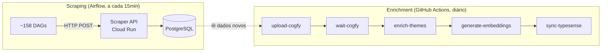
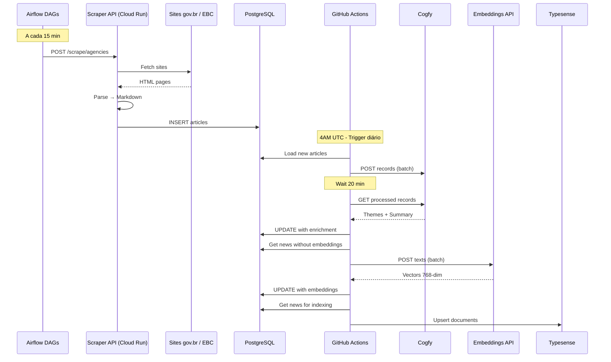

# Workflow: Pipeline de Coleta e Enriquecimento

> Pipeline completo de coleta de notícias (scraper) e enriquecimento (data-platform).

## Visão Geral

O pipeline é dividido em dois estágios independentes, em repositórios separados:

1. **Scraping** (repo `scraper`): Via Airflow DAGs, a cada 15 minutos
2. **Enrichment** (repo `data-platform`): Via GitHub Actions, diário às 4AM UTC



---

## Estágio 1: Scraping (Airflow)

**Repositório**: [destaquesgovbr/scraper](https://github.com/destaquesgovbr/scraper)

### Como funciona

- ~158 DAGs dinâmicas (1 por agência gov.br) + 1 DAG EBC
- Cada DAG roda a cada **15 minutos**
- A DAG faz HTTP POST para a Scraper API no Cloud Run
- A API raspa o site, parseia HTML → Markdown, e insere no PostgreSQL

### DAGs

| DAG | Schedule | Descrição |
|-----|----------|-----------|
| `scrape_{agency_key}` (~158) | `*/15 * * * *` | Raspa 1 agência gov.br |
| `scrape_ebc` | `*/15 * * * *` | Raspa sites EBC |

### API Endpoints

| Método | Endpoint | Descrição |
|--------|----------|-----------|
| `POST` | `/scrape/agencies` | Raspa sites gov.br |
| `POST` | `/scrape/ebc` | Raspa sites EBC |
| `GET` | `/health` | Health check |

### Deploy

| Componente | Destino | Workflow |
|-----------|---------|----------|
| API | Cloud Run | `scraper-api-deploy.yaml` |
| DAGs | Composer bucket `{bucket}/scraper/` | `composer-deploy-dags.yaml` |

---

## Estágio 2: Enrichment Pipeline (GitHub Actions)

**Repositório**: [destaquesgovbr/data-platform](https://github.com/destaquesgovbr/data-platform)

**Arquivo**: `data-platform/.github/workflows/main-workflow.yaml`

### Trigger

```yaml
on:
  schedule:
    - cron: '0 4 * * *'  # 4AM UTC diário
  workflow_dispatch:
    inputs:
      start_date:
        description: 'Start date (YYYY-MM-DD)'
      end_date:
        description: 'End date (YYYY-MM-DD)'
      cogfy_wait_minutes:
        description: 'Minutes to wait for Cogfy (default: 20)'
```

### Jobs

| # | Job | Descrição | Duração |
|---|-----|-----------|---------|
| 1 | `upload-to-cogfy` | Envia notícias novas para classificação no Cogfy | ~5-10 min |
| 2 | `wait-cogfy` | Aguarda processamento no Cogfy | 20 min (fixo) |
| 3 | `enrich-themes` | Busca temas e sumários do Cogfy, atualiza PostgreSQL | ~10-20 min |
| 4 | `generate-embeddings` | Gera vetores 768-dim via Embeddings API (Cloud Run) | ~10-15 min |
| 5 | `sync-typesense` | Sincroniza dados enriquecidos para o Typesense | ~5-10 min |

**Duração total**: ~50-75 minutos

---

## Diagrama de Sequência



---

## Secrets Necessárias

### Repo `data-platform` (enrichment)

| Secret | Descrição | Usado em |
|--------|-----------|----------|
| `POSTGRES_HOST` | Host do Cloud SQL | Todos os jobs |
| `POSTGRES_DB` | Nome do banco | Todos os jobs |
| `POSTGRES_USER` | Usuário do banco | Todos os jobs |
| `POSTGRES_PASSWORD` | Senha do banco | Todos os jobs |
| `COGFY_API_KEY` | API Key do Cogfy | upload, enrich |
| `COGFY_COLLECTION_ID` | ID da collection Cogfy | upload, enrich |
| `EMBEDDINGS_API_URL` | URL da API de embeddings | embeddings |
| `TYPESENSE_HOST` | Host do Typesense | sync-typesense |
| `TYPESENSE_API_KEY` | API Key do Typesense | sync-typesense |

### Repo `scraper`

| Secret | Descrição |
|--------|-----------|
| `DATABASE_URL` | Connection string PostgreSQL |
| GCP SA credentials | Para deploy no Cloud Run e Composer |

---

## Monitoramento

### Scraping (Airflow)

```bash
# Acessar Web UI do Airflow
gcloud composer environments describe destaquesgovbr-composer \
    --location us-central1 \
    --format="value(config.airflowUri)"
```

### Enrichment (GitHub Actions)

```bash
# Listar execuções recentes
gh run list --workflow=main-workflow.yaml -R destaquesgovbr/data-platform

# Ver detalhes de uma execução
gh run view <run_id> -R destaquesgovbr/data-platform
```

---

## Sync HuggingFace (Separado)

O sync para o HuggingFace é feito via DAG no Cloud Composer (repo `data-platform`), não faz parte dos pipelines acima.

→ Veja [Airflow DAGs](./airflow-dags.md) para detalhes.

---

## Links Relacionados

- [Módulo Scraper](../modulos/scraper.md) - Detalhes do scraper standalone
- [Data Platform](../modulos/data-platform.md) - Repositório de enrichment
- [PostgreSQL](../arquitetura/postgresql.md) - Fonte de verdade
- [Airflow DAGs](./airflow-dags.md) - DAGs de sync e scraping
- [Docker Builds](./docker-builds.md) - Build das imagens
