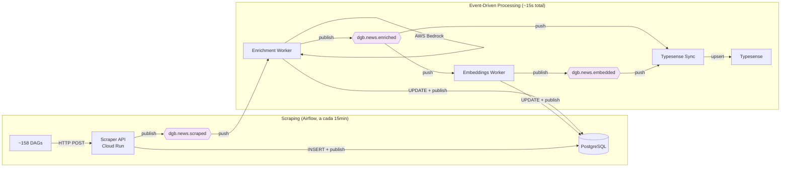
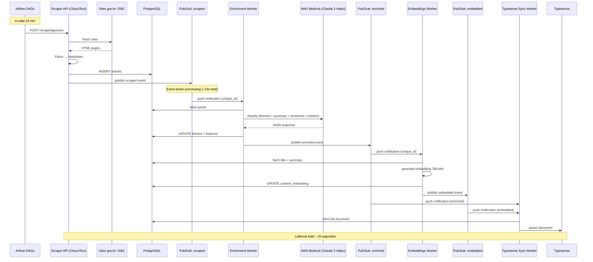

# Workflow: Pipeline de Coleta e Enriquecimento

> Pipeline completo de coleta de notícias (scraper) e enriquecimento event-driven.

!!! note "Arquitetura Atualizada (27/02/2026)"
    Pipeline migrado para **event-driven** com AWS Bedrock. Cogfy e GitHub Actions batch descontinuados.

## Visão Geral

O pipeline é baseado em **arquitetura event-driven** com Cloud Pub/Sub:

1. **Scraping** (repo `scraper`): Via Airflow DAGs, a cada 15 minutos → publica eventos
2. **Enrichment** (repo `data-science`): Via Enrichment Worker (Cloud Run) → event-driven
3. **Embeddings** (repo `embeddings`): Via Embeddings Worker (Cloud Run) → event-driven
4. **Indexação**: Via Typesense Sync Worker (Cloud Run) → event-driven


```mermaid
flowchart LR
    subgraph "Scraping (Airflow, a cada 15min)"
        DAG[~158 DAGs] -->|HTTP POST| API[Scraper API<br/>Cloud Run]
        API -->|INSERT + publish| PG[(PostgreSQL)]
        API -->|publish| PS1{{dgb.news.scraped}}
    end

    subgraph "Event-Driven Processing (~15s total)"
        PS1 -->|push| EW[Enrichment Worker]
        EW -->|AWS Bedrock| EW
        EW -->|UPDATE + publish| PG
        EW -->|publish| PS2{{dgb.news.enriched}}
        
        PS2 -->|push| EAPI[Embeddings Worker]
        EAPI -->|UPDATE + publish| PG
        EAPI -->|publish| PS3{{dgb.news.embedded}}
        
        PS2 -->|push| TSW[Typesense Sync]
        PS3 -->|push| TSW
        TSW -->|upsert| TS[Typesense]
    end

    style PS1 fill:#f3e5f5
    style PS2 fill:#f3e5f5
    style PS3 fill:#f3e5f5
```

---

## Estágio 1: Scraping (Airflow)

**Repositório**: [destaquesgovbr/scraper](https://github.com/destaquesgovbr/scraper)

### Como funciona

- ~158 DAGs dinâmicas (1 por agência gov.br) + 1 DAG EBC
- Cada DAG roda a cada **15 minutos**
- A DAG faz HTTP POST para a Scraper API no Cloud Run
- A API raspa o site, parseia HTML → Markdown, e insere no PostgreSQL

### DAGs

| DAG | Schedule | Descrição |
|-----|----------|-----------|
| `scrape_{agency_key}` (~158) | `*/15 * * * *` | Raspa 1 agência gov.br |
| `scrape_ebc` | `*/15 * * * *` | Raspa sites EBC |

### API Endpoints

| Método | Endpoint | Descrição |
|--------|----------|-----------|
| `POST` | `/scrape/agencies` | Raspa sites gov.br |
| `POST` | `/scrape/ebc` | Raspa sites EBC |
| `GET` | `/health` | Health check |

### Deploy

| Componente | Destino | Workflow |
|-----------|---------|----------|
| API | Cloud Run | `scraper-api-deploy.yaml` |
| DAGs | Composer bucket `{bucket}/scraper/` | `composer-deploy-dags.yaml` |

---

## Estágio 2: Enrichment Event-Driven (Cloud Run Workers)

**Repositórios**:
- [destaquesgovbr/data-science](https://github.com/destaquesgovbr/data-science) - Enrichment Worker
- [destaquesgovbr/embeddings](https://github.com/destaquesgovbr/embeddings) - Embeddings Worker
- [destaquesgovbr/data-platform](https://github.com/destaquesgovbr/data-platform) - Typesense Sync Worker

### Trigger

**Event-driven**: Push subscriptions do Cloud Pub/Sub chamam endpoints HTTP dos workers

### Workers

| # | Worker | Trigger | Descrição | Latência |
|---|--------|---------|-----------|----------|
| 1 | **Enrichment Worker** | Topic: `dgb.news.scraped` | Classifica via AWS Bedrock (Claude 3 Haiku): temas L1/L2/L3 + resumo + sentiment + entities | ~5s |
| 2 | **Embeddings Worker** | Topic: `dgb.news.enriched` | Gera vetores 768-dim via modelo local `paraphrase-multilingual-mpnet-base-v2` | ~5s |
| 3 | **Typesense Sync Worker** | Topics: `dgb.news.enriched` + `dgb.news.embedded` | Sincroniza documentos enriquecidos para Typesense (upsert idempotente) | ~5s |

**Latência total**: ~15 segundos (scraping → indexação)

---

## Diagrama de Sequência


```mermaid
sequenceDiagram
    participant AF as Airflow DAGs
    participant API as Scraper API (Cloud Run)
    participant GOV as Sites gov.br / EBC
    participant PG as PostgreSQL
    participant PS1 as Pub/Sub: scraped
    participant EW as Enrichment Worker
    participant Bedrock as AWS Bedrock (Claude 3 Haiku)
    participant PS2 as Pub/Sub: enriched
    participant EAPI as Embeddings Worker
    participant PS3 as Pub/Sub: embedded
    participant TSW as Typesense Sync Worker
    participant TS as Typesense

    Note over AF: A cada 15 min

    AF->>API: POST /scrape/agencies
    API->>GOV: Fetch sites
    GOV-->>API: HTML pages
    API->>API: Parse → Markdown
    API->>PG: INSERT articles
    API->>PS1: publish scraped event

    Note over PS1: Event-driven processing (~15s total)

    PS1->>EW: push notification (unique_id)
    EW->>PG: fetch article
    EW->>Bedrock: classify (themes + summary + sentiment + entities)
    Bedrock-->>EW: JSON response
    EW->>PG: UPDATE themes + features
    EW->>PS2: publish enriched event

    PS2->>EAPI: push notification (unique_id)
    EAPI->>PG: fetch title + summary
    EAPI->>EAPI: generate embedding 768-dim
    EAPI->>PG: UPDATE content_embedding
    EAPI->>PS3: publish embedded event

    PS2->>TSW: push notification (enriched)
    PS3->>TSW: push notification (embedded)
    TSW->>PG: fetch full document
    TSW->>TS: upsert document

    Note over API,TS: Latência total: ~15 segundos
```

---

## Secrets Necessárias

### Repo `data-science` (Enrichment Worker)

| Secret | Descrição |
|--------|-----------|
| `DATABASE_URL` | Connection string PostgreSQL |
| `AWS_ACCESS_KEY_ID` | AWS credentials para Bedrock |
| `AWS_SECRET_ACCESS_KEY` | AWS credentials para Bedrock |
| `AWS_REGION` | Região AWS (us-east-1) |
| `BEDROCK_MODEL_ID` | ID do modelo (anthropic.claude-3-haiku-20240307-v1:0) |
| `GCP_PROJECT_ID` | Projeto GCP para Pub/Sub |
| `PUBSUB_TOPIC_ENRICHED` | Nome do topic enriched |

### Repo `embeddings` (Embeddings Worker)

| Secret | Descrição |
|--------|-----------|
| `DATABASE_URL` | Connection string PostgreSQL |
| `GCP_PROJECT_ID` | Projeto GCP para Pub/Sub |
| `PUBSUB_TOPIC_EMBEDDED` | Nome do topic embedded |

### Repo `data-platform` (Typesense Sync Worker)

| Secret | Descrição |
|--------|-----------|
| `DATABASE_URL` | Connection string PostgreSQL |
| `TYPESENSE_HOST` | Host do Typesense |
| `TYPESENSE_API_KEY` | API Key do Typesense |

### Repo `scraper`

| Secret | Descrição |
|--------|-----------|
| `DATABASE_URL` | Connection string PostgreSQL |
| `GCP_PROJECT_ID` | Projeto GCP para Pub/Sub |
| `PUBSUB_TOPIC_SCRAPED` | Nome do topic scraped |
| GCP SA credentials | Para deploy no Cloud Run e Composer |

---

## Monitoramento

### Scraping (Airflow)

```bash
# Acessar Web UI do Airflow
gcloud composer environments describe destaquesgovbr-composer \
    --location us-central1 \
    --format="value(config.airflowUri)"
```

### Workers Event-Driven (Cloud Run + Pub/Sub)

```bash
# Logs do Enrichment Worker
gcloud logging read "resource.type=cloud_run_revision AND resource.labels.service_name=enrichment-worker" --limit 50

# Logs do Embeddings Worker
gcloud logging read "resource.type=cloud_run_revision AND resource.labels.service_name=embeddings-worker" --limit 50

# Logs do Typesense Sync Worker
gcloud logging read "resource.type=cloud_run_revision AND resource.labels.service_name=typesense-sync-worker" --limit 50

# Métricas de Pub/Sub (backlog de mensagens)
gcloud monitoring dashboards list --filter="displayName:Pub/Sub"

# Dead-Letter Queue (mensagens falhadas)
gcloud pubsub subscriptions pull dgb.news.scraped-dlq --limit=10
gcloud pubsub subscriptions pull dgb.news.enriched-dlq --limit=10
gcloud pubsub subscriptions pull dgb.news.embedded-dlq --limit=10
```

---

## Sync HuggingFace (Separado)

O sync para o HuggingFace é feito via DAG no Cloud Composer (repo `data-platform`), não faz parte dos pipelines acima.

→ Veja [Airflow DAGs](./airflow-dags.md) para detalhes.

---

## Links Relacionados

- [Módulo Scraper](../modulos/scraper.md) - Detalhes do scraper standalone
- [Data Platform](../modulos/data-platform.md) - Repositório de enrichment
- [PostgreSQL](../arquitetura/postgresql.md) - Fonte de verdade
- [Airflow DAGs](./airflow-dags.md) - DAGs de sync e scraping
- [Docker Builds](./docker-builds.md) - Build das imagens
