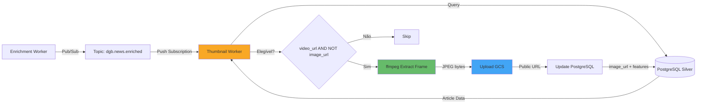
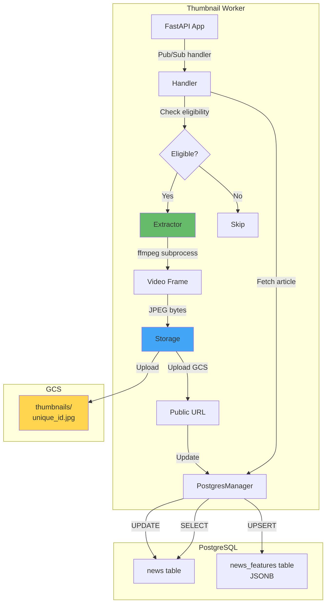
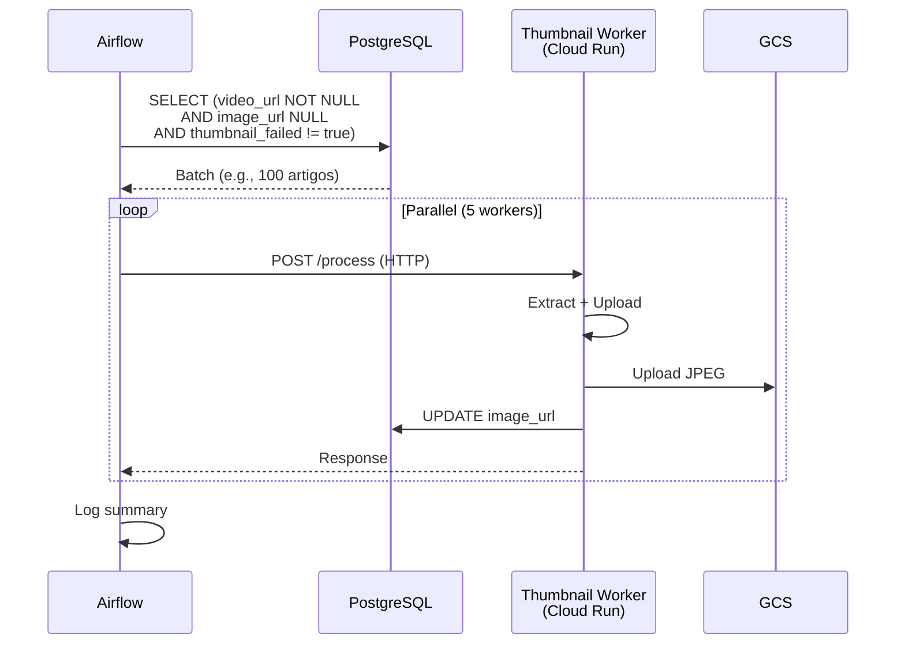

# Thumbnail Generation Pipeline

**Pipeline automático de geração de thumbnails** para notícias de vídeo no DestaquesGovbr.

---

## Visão Geral

O **Thumbnail Worker** é um serviço Cloud Run que extrai automaticamente o primeiro frame de vídeos de notícias (principalmente TV Brasil/EBC) e gera thumbnails quando `image_url` está ausente. O processo usa **ffmpeg** para extração de frames e armazena as imagens no **Google Cloud Storage (GCS)** com acesso público.

### Problema Resolvido

Notícias da TV Brasil/EBC que são vídeos possuem `video_url` mas não possuem `image_url`, fazendo com que apareçam **sem thumbnail** na listagem do portal, prejudicando a experiência visual.

### Características

- ✅ **Event-Driven**: Processa eventos Pub/Sub `dgb.news.enriched` em tempo real
- ✅ **ffmpeg**: Extração de primeiro frame como JPEG (640x360)
- ✅ **GCS Storage**: Armazenamento em `gs://{bucket}/thumbnails/{unique_id}.jpg`
- ✅ **Idempotente**: Não regenera se thumbnail já existe
- ✅ **Failure Tracking**: Marca `thumbnail_failed: true` para evitar retry infinito
- ✅ **Batch Backfill**: DAG Airflow para processar artigos históricos
- ✅ **Latência**: P95 < 3s por thumbnail

---

## Arquitetura

### Fluxo de Dados



### Componentes



---

## Extração de Thumbnail

### Módulo: `extractor.py`

**Responsabilidade**: Wrapper puro de ffmpeg (sem I/O de DB/GCS).

#### Função Principal: `extract_first_frame()`

```python
def extract_first_frame(
    video_url: str,
    width: int = 640,
    height: int = 360,
    timeout_seconds: int = 30,
) -> ThumbnailExtractionResult:
    """
    Extrai o primeiro frame de um vídeo URL como JPEG redimensionado.
    
    Args:
        video_url: URL HTTP(S) do arquivo de vídeo
        width: Largura alvo em pixels
        height: Altura alvo em pixels
        timeout_seconds: Tempo máximo de espera
    
    Returns:
        ThumbnailExtractionResult com bytes JPEG
    
    Raises:
        ThumbnailExtractionError: Se ffmpeg falhar ou timeout
    """
```

#### Comando ffmpeg

```bash
ffmpeg -nostdin \
  -i "https://example.com/video.mp4" \
  -vframes 1 \
  -vf "scale=640:360" \
  -f image2 \
  -c:v mjpeg \
  pipe:1
```

**Flags importantes**:
- `-nostdin`: Desabilita stdin (evita bloqueio em containers)
- `-vframes 1`: Extrai apenas 1 frame (primeiro disponível)
- `-vf scale=640:360`: Redimensiona para dimensões fixas
- `-f image2`: Formato de saída (single image)
- `-c:v mjpeg`: Codec JPEG
- `pipe:1`: Saída para stdout (evita arquivos temporários)

#### Validações de Segurança

```python
def _validate_video_url(video_url: str) -> None:
    """
    Valida que URL de vídeo usa scheme seguro.
    Previne SSRF via protocolos ffmpeg (file://, concat:, data:, etc).
    """
    ALLOWED_SCHEMES = ("http://", "https://")
    if not video_url.lower().startswith(ALLOWED_SCHEMES):
        raise ThumbnailExtractionError(f"Invalid URL scheme: {url}")
```

**Ataques Prevenidos**:
- **SSRF (Server-Side Request Forgery)**: Apenas HTTP(S) permitido
- **File disclosure**: Bloqueia `file:///etc/passwd`
- **Command injection**: URL não é passada via shell

#### Tratamento de Erros

| Erro | Causa | Resposta |
|------|-------|----------|
| `TimeoutExpired` | Vídeo muito grande ou rede lenta | `ThumbnailExtractionError` + `thumbnail_failed: true` |
| `CalledProcessError` | ffmpeg exit code != 0 | `ThumbnailExtractionError` + log stderr |
| Invalid JPEG | Output não começa com `\xff\xd8` | `ThumbnailExtractionError` |
| Empty output | ffmpeg retorna bytes vazios | `ThumbnailExtractionError` |

---

## Armazenamento GCS

### Módulo: `storage.py`

**Responsabilidade**: Upload GCS e verificação de existência.

#### Estrutura de Paths

```
gs://destaques-govbr-silver/
└── thumbnails/
    ├── tvbrasil_abc123.jpg
    ├── agenciabrasil_xyz789.jpg
    └── ...
```

**Path**: `thumbnails/{unique_id}.jpg`

#### Função: `upload_thumbnail()`

```python
def upload_thumbnail(
    bucket_name: str,
    unique_id: str,
    image_bytes: bytes,
    gcs_client: gcs_storage.Client | None = None,
    prefix: str = "thumbnails",
) -> str:
    """
    Upload JPEG thumbnail para GCS e retorna URL pública.
    
    Returns:
        Public URL: https://storage.googleapis.com/{bucket}/thumbnails/{unique_id}.jpg
    """
    client = gcs_client or _get_client()
    gcs_path = f"{prefix}/{unique_id}.jpg"
    
    bucket = client.bucket(bucket_name)
    blob = bucket.blob(gcs_path)
    blob.cache_control = "public, max-age=86400"  # Cache 24h
    blob.upload_from_string(image_bytes, content_type="image/jpeg")
    
    return f"https://storage.googleapis.com/{bucket_name}/{gcs_path}"
```

**Configurações**:
- `content_type: image/jpeg` - MIME type correto
- `cache_control: public, max-age=86400` - Cache CDN de 24h
- Sem `make_public()` - Bucket já tem IAM public read

#### Função: `thumbnail_exists()`

```python
def thumbnail_exists(
    bucket_name: str,
    unique_id: str,
    gcs_client: gcs_storage.Client | None = None,
    prefix: str = "thumbnails",
) -> bool:
    """
    Verifica se thumbnail já existe no GCS.
    Usado para idempotência.
    """
    gcs_path = f"{prefix}/{unique_id}.jpg"
    bucket = client.bucket(bucket_name)
    blob = bucket.blob(gcs_path)
    return blob.exists()
```

---

## Handler: Orquestração

### Módulo: `handler.py`

**Responsabilidade**: Orquestra fetch → check → extract → upload → update.

#### Função Principal: `handle_thumbnail_generation()`

```python
def handle_thumbnail_generation(
    unique_id: str,
    pg: PostgresManager,
    bucket_name: str,
    extractor_fn: Callable = extract_first_frame,
    uploader_fn: Callable = upload_thumbnail,
    exists_fn: Callable = thumbnail_exists,
) -> dict[str, Any]:
    """
    Orquestra geração de thumbnail para um artigo.
    
    Steps:
        1. Fetch article from PostgreSQL
        2. Check eligibility (has video_url, no image_url)
        3. Check if previously failed
        4. Check idempotency (thumbnail already in GCS?)
        5. Extract first frame via ffmpeg
        6. Upload to GCS
        7. Update image_url in news table
        8. Update features in news_features
    
    Returns:
        {"status": "generated|skipped|not_found|error", "unique_id": "..."}
    """
```

#### Elegibilidade

```python
def _is_eligible(article: Any) -> tuple[bool, str]:
    """Verifica se artigo é elegível para geração de thumbnail."""
    if article.image_url:
        return False, "already has image_url"
    if not article.video_url:
        return False, "no video_url"
    return True, ""
```

**Critérios**:
- ✅ `video_url IS NOT NULL`
- ✅ `image_url IS NULL`
- ✅ `thumbnail_failed IS NOT true` (no feature store)

#### Idempotência

```python
# Verificar se thumbnail já existe no GCS
already_in_gcs = exists_fn(bucket_name, unique_id)

if not already_in_gcs:
    # Extrair + Upload
    result = extractor_fn(article.video_url)
    public_url = uploader_fn(bucket_name, unique_id, result.image_bytes)
else:
    # Thumbnail já existe, apenas recuperar URL
    public_url = build_public_url(bucket_name, gcs_path)

# Atualizar DB (sempre, mesmo se GCS já existia)
pg.upsert_features(unique_id, {"has_image": True, "thumbnail_generated": True})
pg.update(unique_id, {"image_url": public_url})
```

**Cenário de Recuperação**: Se GCS tem thumbnail mas `image_url` no DB está NULL (ex: falha anterior de update), o handler atualiza o DB sem reextrair.

#### Tratamento de Falhas

```python
try:
    result = extractor_fn(article.video_url)
except ThumbnailExtractionError as e:
    logger.error(f"Extraction failed for {unique_id}: {e}")
    pg.upsert_features(unique_id, {"thumbnail_failed": True})
    return {"status": "error", "unique_id": unique_id, "error": str(e)}
```

**Marcação `thumbnail_failed: true`**: Evita retry infinito para vídeos inacessíveis, corrompidos ou formatos não suportados.

---

## Thumbnail Worker (FastAPI)

### Endpoints

#### POST `/process`

Processa evento Pub/Sub do tópico `dgb.news.enriched`.

**Request** (Pub/Sub envelope):
```json
{
  "message": {
    "data": "eyJ1bmlxdWVfaWQiOiAidHZicmFzaWxfYWJjMTIzIn0=",  // base64
    "attributes": {
      "trace_id": "xyz789"
    }
  }
}
```

**Payload decodificado**:
```json
{
  "unique_id": "tvbrasil_abc123"
}
```

**Response**:
```json
{
  "status": "generated",
  "unique_id": "tvbrasil_abc123",
  "url": "https://storage.googleapis.com/destaques-govbr-silver/thumbnails/tvbrasil_abc123.jpg"
}
```

**Status Possíveis**:
- `generated`: Thumbnail criado com sucesso
- `skipped`: Artigo não elegível (já tem image_url, sem video_url, ou thumbnail_failed)
- `not_found`: Artigo não encontrado no PostgreSQL
- `error`: Falha na extração (marcado como thumbnail_failed)

#### GET `/health`

Health check endpoint.

**Response**:
```json
{
  "status": "ok"
}
```

---

## Deployment

### Pub/Sub Subscription

```bash
gcloud pubsub subscriptions create thumbnail-worker-sub \
  --topic=dgb.news.enriched \
  --push-endpoint=https://thumbnail-worker-xxx.a.run.app/process \
  --ack-deadline=120 \
  --retry-policy-minimum-backoff=10s \
  --retry-policy-maximum-backoff=600s \
  --max-delivery-attempts=5
```

**Diferenças do Feature Worker**:
- `ack-deadline=120` (vs 60s) - ffmpeg pode demorar até 30s para vídeos grandes
- Subscription separada (mesma topic, endpoints diferentes)

### Cloud Run Deploy

```bash
gcloud run deploy thumbnail-worker \
  --image=gcr.io/destaques-govbr/thumbnail-worker:latest \
  --platform=managed \
  --region=southamerica-east1 \
  --memory=1Gi \
  --cpu=1 \
  --min-instances=0 \
  --max-instances=5 \
  --timeout=120 \
  --concurrency=5 \
  --set-env-vars=POSTGRES_HOST=10.x.x.x,GCS_BUCKET=destaques-govbr-silver
```

**Diferenças do Feature Worker**:
- `memory=1Gi` (vs 512Mi) - ffmpeg precisa de mais memória
- `timeout=120` (vs 60s) - extração pode demorar
- `concurrency=5` (vs 10) - ffmpeg é CPU-bound

### Dockerfile

```dockerfile
FROM python:3.11-slim

# Instalar ffmpeg
RUN apt-get update && \
    apt-get install -y --no-install-recommends ffmpeg && \
    apt-get clean && \
    rm -rf /var/lib/apt/lists/*

WORKDIR /app

# Install dependencies
COPY pyproject.toml poetry.lock ./
RUN pip install poetry && poetry install --no-dev

# Copy application
COPY src/data_platform ./data_platform

EXPOSE 8080

CMD ["poetry", "run", "uvicorn", "data_platform.workers.thumbnail_worker.app:app", "--host", "0.0.0.0", "--port", "8080"]
```

**Adição crítica**: `apt-get install ffmpeg` (~80MB)

---

## Batch Backfill (Airflow)

### DAG: `generate_video_thumbnails`

**Schedule**: A cada 4 horas (`0 */4 * * *`)

**Objetivo**: Processar artigos históricos que ainda não têm thumbnail.

#### Fluxo



#### Query de Fetch

```sql
SELECT n.unique_id, n.video_url
FROM news n
LEFT JOIN news_features nf ON n.unique_id = nf.unique_id
WHERE n.video_url IS NOT NULL
  AND n.image_url IS NULL
  AND (nf.features->>'thumbnail_failed' IS NULL OR nf.features->>'thumbnail_failed' != 'true')
ORDER BY n.published_at DESC
LIMIT %(batch_size)s
```

**Exclusões**:
- Artigos que já falharam (`thumbnail_failed: true`)
- Artigos que já têm `image_url`

#### Variáveis Airflow

| Variável | Padrão | Descrição |
|----------|--------|-----------|
| `thumbnail_batch_size` | 100 | Tamanho do batch por execução |
| `thumbnail_max_workers` | 5 | Paralelização HTTP requests |
| `thumbnail_worker_url` | - | URL base do Cloud Run worker |

**Exemplo**:
```bash
airflow variables set thumbnail_worker_url "https://thumbnail-worker-xxx.a.run.app"
airflow variables set thumbnail_batch_size "200"
```

#### Summary Report

```json
{
  "processed": 100,
  "generated": 85,
  "skipped": 10,
  "failed": 5
}
```

**Log**:
```
Thumbnail batch concluído: 100 processados, 85 gerados, 10 ignorados, 5 falhas
```

---

## Features no Feature Store

### Features Adicionadas

| Feature | Tipo | Descrição | Quando |
|---------|------|-----------|--------|
| `thumbnail_generated` | bool | Thumbnail gerado automaticamente | Após upload GCS bem-sucedido |
| `thumbnail_failed` | bool | Falha na extração de thumbnail | Após erro de ffmpeg/timeout |
| `has_image` | bool | Artigo possui imagem (atualizado) | Após upload (originalmente false) |

### Exemplo JSONB

```json
{
  "word_count": 320,
  "has_image": true,
  "has_video": true,
  "thumbnail_generated": true
}
```

**Artigo com falha**:
```json
{
  "word_count": 280,
  "has_image": false,
  "has_video": true,
  "thumbnail_failed": true
}
```

---

## Monitoramento

### Métricas Cloud Monitoring

```yaml
# Latência de extração
- name: thumbnail_worker_latency_p95
  metric: run.googleapis.com/request_latencies
  filter: resource.service_name="thumbnail-worker"
  threshold: P95 > 5s
  
# Taxa de erro
- name: thumbnail_worker_error_rate
  metric: run.googleapis.com/request_count
  filter: metric.response_code_class="5xx"
  threshold: > 1%
  
# Taxa de falhas de extração
- name: thumbnail_extraction_failure_rate
  metric: custom/thumbnail_failed_ratio
  threshold: > 10%
```

### Logs Estruturados

```python
# Em handler.py
logger.info(f"Processing {unique_id} (trace={trace_id})")
logger.debug(f"Skipping {unique_id}: {reason}")
logger.error(f"Extraction failed for {unique_id}: {e}")
logger.info(f"Thumbnail {'recovered' if already_in_gcs else 'generated'} for {unique_id}")
```

### Dashboard Grafana

```yaml
# Query para monitorar throughput
- expr: |
    rate(thumbnail_worker_requests_total[5m])
  legendFormat: "Thumbnails Generated/sec"

# Query para taxa de sucesso
- expr: |
    sum(rate(thumbnail_status_generated[5m])) / 
    sum(rate(thumbnail_status_total[5m]))
  legendFormat: "Success Rate"
```

---

## Testes

### Testes Unitários: Extractor

```python
def test_extract_first_frame_returns_jpeg_bytes(mocker):
    mock_run = mocker.patch("subprocess.run")
    mock_run.return_value = subprocess.CompletedProcess(
        args=[], returncode=0, stdout=FAKE_JPEG_BYTES
    )
    result = extract_first_frame("http://example.com/video.mp4")
    assert result.image_bytes[:2] == b'\xff\xd8'  # JPEG magic bytes

def test_extract_first_frame_timeout_raises_error(mocker):
    mocker.patch("subprocess.run", side_effect=subprocess.TimeoutExpired("ffmpeg", 30))
    with pytest.raises(ThumbnailExtractionError, match="timeout"):
        extract_first_frame("http://example.com/video.mp4")

def test_validate_video_url_blocks_file_scheme():
    with pytest.raises(ThumbnailExtractionError, match="Invalid URL scheme"):
        _validate_video_url("file:///etc/passwd")
```

### Testes Unitários: Storage

```python
def test_upload_thumbnail_calls_gcs_with_correct_params(mocker):
    mock_client = mocker.Mock()
    mock_bucket = mocker.Mock()
    mock_blob = mocker.Mock()
    mock_client.bucket.return_value = mock_bucket
    mock_bucket.blob.return_value = mock_blob

    url = upload_thumbnail("my-bucket", "article_123", b"jpeg_data", gcs_client=mock_client)

    mock_blob.upload_from_string.assert_called_once_with(b"jpeg_data", content_type="image/jpeg")
    assert "storage.googleapis.com" in url
```

### Testes de Integração: Handler

```python
def test_handler_generates_thumbnail_for_eligible_article(pg_test: PostgresManager):
    # 1. Inserir artigo elegível
    article_id = "tvbrasil_test123"
    pg_test.insert_news({
        "unique_id": article_id,
        "video_url": "http://example.com/video.mp4",
        "image_url": None,
    })
    
    # 2. Mock extractor e uploader
    mock_extractor = Mock(return_value=ThumbnailExtractionResult(
        image_bytes=b"\xff\xd8FAKE_JPEG", width=640, height=360, format="jpeg"
    ))
    mock_uploader = Mock(return_value="https://storage.googleapis.com/bucket/thumbnails/x.jpg")
    mock_exists = Mock(return_value=False)
    
    # 3. Executar handler
    result = handle_thumbnail_generation(
        article_id, pg_test, "test-bucket",
        extractor_fn=mock_extractor,
        uploader_fn=mock_uploader,
        exists_fn=mock_exists
    )
    
    # 4. Verificar resultado
    assert result["status"] == "generated"
    
    # 5. Verificar que DB foi atualizado
    article = pg_test.get_by_unique_id(article_id)
    assert article.image_url == "https://storage.googleapis.com/bucket/thumbnails/x.jpg"
    
    features = pg_test.get_features(article_id)
    assert features["thumbnail_generated"] is True
    assert features["has_image"] is True
```

---

## Troubleshooting

### Problema: ffmpeg timeout (30s)

**Causa**: Vídeo muito grande ou rede lenta.

**Solução**:
```bash
# Verificar tamanho do vídeo
curl -I "https://example.com/video.mp4" | grep Content-Length

# Aumentar timeout se necessário
# Em extractor.py: DEFAULT_TIMEOUT = 60
```

---

### Problema: Thumbnail Worker retorna 200 mas image_url não atualiza

**Causa**: Erro silencioso após upload GCS.

**Solução**:
```bash
# Verificar logs do Cloud Run
gcloud logging read \
  "resource.type=cloud_run_revision AND \
   resource.labels.service_name=thumbnail-worker AND \
   severity>=ERROR" \
  --limit=50
```

---

### Problema: Muitos artigos com `thumbnail_failed: true`

**Causa**: URLs de vídeo inacessíveis (404, CORS, timeout).

**Análise**:
```sql
-- Listar artigos com falha
SELECT n.unique_id, n.video_url
FROM news n
JOIN news_features nf ON n.unique_id = nf.unique_id
WHERE nf.features->>'thumbnail_failed' = 'true'
LIMIT 20;
```

**Solução**: Investigar padrões (ex: todos de uma agência, domínio específico), validar URLs manualmente.

---

### Problema: GCS bucket sem acesso público

**Causa**: IAM policy não configurada.

**Solução**:
```bash
# Verificar IAM
gsutil iam get gs://destaques-govbr-silver

# Adicionar acesso público (se não existir)
gsutil iam ch allUsers:objectViewer gs://destaques-govbr-silver
```

---

## Custos Estimados

### Cálculo

| Item | Quantidade | Custo Unitário | Custo Mensal |
|------|-----------|---------------|--------------|
| **Cloud Run (requests)** | ~5k thumbnails/mês | $0.40/million | $0.002 |
| **Cloud Run (CPU time)** | 3s/request × 5k | $0.000024/GB-s | $0.36 |
| **GCS Storage** | 50KB/thumbnail × 5k = 250MB | $0.02/GB/mês | $0.005 |
| **GCS Class A Ops** | 5k uploads | $0.05/10k ops | $0.025 |
| **Data Transfer** | 250MB egress | $0.12/GB | $0.03 |
| **Total** | - | - | **~$0.42/mês** |

**Assumptions**:
- 5.000 notícias com vídeo por mês (média histórica)
- JPEG 640x360 ~50KB
- ffmpeg extração ~3s/vídeo

---

## Referências

### Interna
- [Feature Engineering Pipeline](./feature-engineering.md)
- [Pub/Sub Workers](../arquitetura/pubsub-workers.md)
- [Data Architecture Evolution Plan](https://github.com/destaquesgovbr/data-platform/blob/main/_plan/DATA-ARCHITECTURE-EVOLUTION.md)
- [Thumbnail Worker Plan (THUMBNAIL-WORKER.md)](https://github.com/destaquesgovbr/data-platform/blob/main/_plan/THUMBNAIL-WORKER.md)

### Externa
- [ffmpeg Documentation](https://ffmpeg.org/documentation.html)
- [Google Cloud Storage Public Access](https://cloud.google.com/storage/docs/access-control/making-data-public)
- [SSRF Prevention in ffmpeg](https://security.stackexchange.com/questions/190188/ssrf-via-ffmpeg)

---

**Última atualização**: 06/05/2026  
**Responsável**: Equipe Data Platform - DestaquesGovbr  
**Status**: ✅ Implementado (Issue #21)