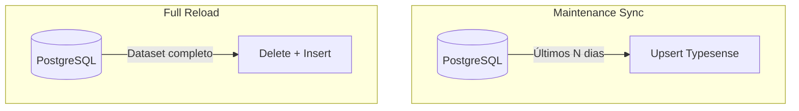
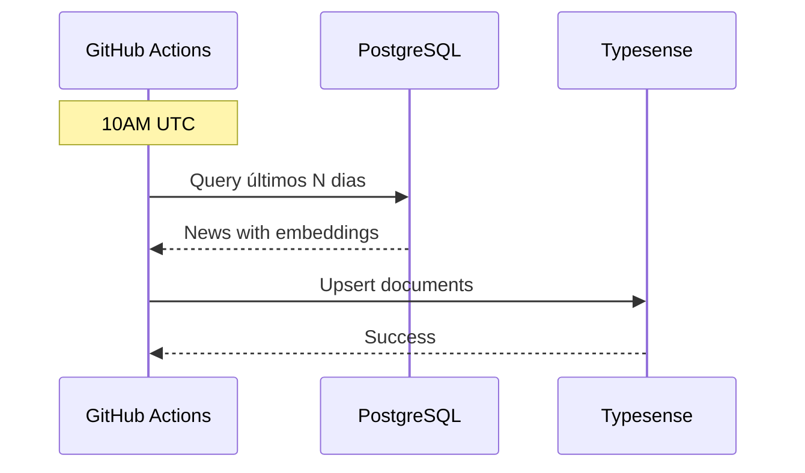

# Workflow: Dados do Typesense

> Workflows para carga e atualização de dados no Typesense.

**Arquivos**:

- `data-platform/.github/workflows/typesense-maintenance-sync.yaml`
- `data-platform/.github/workflows/typesense-full-reload.yaml`

## Visão Geral

Existem dois workflows para gerenciar dados no Typesense:

| Workflow | Uso | Frequência |
|----------|-----|------------|
| `typesense-maintenance-sync` | Sync incremental | Diário (10AM UTC) |
| `typesense-full-reload` | Recarga completa | Manual (destrutivo) |



---

## Workflow: Maintenance Sync

### Trigger

```yaml
on:
  schedule:
    - cron: '0 10 * * *'  # 10AM UTC diário
  workflow_dispatch:
    inputs:
      start-date:
        description: 'Data inicial (YYYY-MM-DD)'
        required: false
```

### Execução



### Job

```yaml
sync:
  runs-on: ubuntu-latest
  container:
    image: ghcr.io/destaquesgovbr/data-platform:latest
  steps:
    - name: Sync to Typesense
      run: |
        data-platform sync-typesense \
          --start-date ${{ inputs.start-date || steps.dates.outputs.start }}
      env:
        POSTGRES_HOST: ${{ secrets.POSTGRES_HOST }}
        POSTGRES_DB: ${{ secrets.POSTGRES_DB }}
        POSTGRES_USER: ${{ secrets.POSTGRES_USER }}
        POSTGRES_PASSWORD: ${{ secrets.POSTGRES_PASSWORD }}
        TYPESENSE_HOST: ${{ secrets.TYPESENSE_HOST }}
        TYPESENSE_API_KEY: ${{ secrets.TYPESENSE_API_KEY }}
```

### Execução manual

```bash
# Com padrão (últimos 7 dias)
gh workflow run typesense-maintenance-sync.yaml

# Com data específica
gh workflow run typesense-maintenance-sync.yaml -f start-date=2024-12-01
```

---

## Workflow: Full Reload

> **CUIDADO**: Este workflow é **destrutivo**! Deleta todos os dados antes de recarregar.

### Trigger

```yaml
on:
  workflow_dispatch:
    inputs:
      confirm:
        description: 'Digite DELETE para confirmar'
        required: true
```

### Proteção

```yaml
full-reload:
  runs-on: ubuntu-latest
  steps:
    - name: Validate confirmation
      if: inputs.confirm != 'DELETE'
      run: |
        echo "❌ Confirmação inválida. Digite 'DELETE' para confirmar."
        exit 1
```

### Job

```yaml
full-reload:
  runs-on: ubuntu-latest
  container:
    image: ghcr.io/destaquesgovbr/data-platform:latest
  steps:
    - name: Validate confirmation
      if: inputs.confirm != 'DELETE'
      run: exit 1

    - name: Full reload
      run: |
        data-platform sync-typesense --full-sync
      env:
        POSTGRES_HOST: ${{ secrets.POSTGRES_HOST }}
        POSTGRES_DB: ${{ secrets.POSTGRES_DB }}
        POSTGRES_USER: ${{ secrets.POSTGRES_USER }}
        POSTGRES_PASSWORD: ${{ secrets.POSTGRES_PASSWORD }}
        TYPESENSE_HOST: ${{ secrets.TYPESENSE_HOST }}
        TYPESENSE_API_KEY: ${{ secrets.TYPESENSE_API_KEY }}
```

### Execução

```bash
gh workflow run typesense-full-reload.yaml -f confirm=DELETE
```

---

## CLI do data-platform

### Sync Incremental

```bash
# Sync desde uma data
data-platform sync-typesense --start-date 2024-12-01

# Sync últimos 7 dias (padrão do workflow)
data-platform sync-typesense --start-date $(date -v-7d +%Y-%m-%d)
```

### Sync Completo

```bash
# Full sync (destrutivo)
data-platform sync-typesense --full-sync
```

### Funcionamento Interno

```python
# src/data_platform/jobs/typesense/sync_job.py
def sync_typesense(start_date: date = None, full_sync: bool = False):
    """Sincroniza PostgreSQL → Typesense."""
    # 1. Conectar ao PostgreSQL
    pg = PostgresManager()

    # 2. Conectar ao Typesense
    ts = TypesenseClient()

    if full_sync:
        # 3a. Full: deletar e recriar collection
        ts.delete_collection("news")
        ts.create_collection("news", NEWS_SCHEMA)

        # 4a. Buscar todos os registros
        news = pg.iter_news_for_typesense()
    else:
        # 3b. Incremental: apenas upsert
        # 4b. Buscar registros desde start_date
        news = pg.iter_news_for_typesense(since=start_date)

    # 5. Upsert em batches de 5000
    for batch in chunks(news, 5000):
        ts.upsert_documents("news", batch)
```

---

## Dados Sincronizados

O sync inclui embeddings para busca vetorial:

```python
document = {
    "unique_id": row["unique_id"],
    "agency": row["agency_key"],
    "agency_name": row["agency_name"],
    "title": row["title"],
    "url": row["url"],
    "image": row["image_url"],
    "content": row["content"],
    "summary": row["summary"],
    "published_at": int(row["published_at"].timestamp()),

    # Temas
    "theme_l1_code": theme_l1.code if theme_l1 else None,
    "theme_l1_label": theme_l1.label if theme_l1 else None,
    "theme_l2_code": theme_l2.code if theme_l2 else None,
    "theme_l2_label": theme_l2.label if theme_l2 else None,
    "theme_l3_code": theme_l3.code if theme_l3 else None,
    "theme_l3_label": theme_l3.label if theme_l3 else None,
    "most_specific_theme_code": most_specific.code if most_specific else None,
    "most_specific_theme_label": most_specific.label if most_specific else None,

    # Embedding para busca vetorial
    "content_embedding": row["content_embedding"],  # 768 dims
}
```

---

## Secrets Necessárias

| Secret | Descrição |
|--------|-----------|
| `POSTGRES_HOST` | Host do Cloud SQL |
| `POSTGRES_DB` | Nome do banco |
| `POSTGRES_USER` | Usuário do banco |
| `POSTGRES_PASSWORD` | Senha do banco |
| `TYPESENSE_HOST` | IP/hostname do Typesense |
| `TYPESENSE_API_KEY` | API Key de admin |

---

## Quando Usar Cada Workflow

### Maintenance Sync (Incremental)

- ✅ Atualização diária normal
- ✅ Correção de dados recentes
- ✅ Após pipeline diário do scraper

### Full Reload

- ⚠️ Mudança no schema da collection
- ⚠️ Dados corrompidos
- ⚠️ Limpeza completa necessária
- ⚠️ Primeira carga em novo ambiente
- ⚠️ Após adição de embeddings em massa

---

## Monitoramento

### Ver execuções

```bash
# Maintenance sync
gh run list --workflow=typesense-maintenance-sync.yaml

# Full reload
gh run list --workflow=typesense-full-reload.yaml
```

### Verificar dados no Typesense

```bash
# Via SSH no servidor ou API
curl "http://<TYPESENSE_HOST>:8108/collections/news" \
  -H "X-TYPESENSE-API-KEY: $API_KEY"

# Contagem de documentos
curl "http://<TYPESENSE_HOST>:8108/collections/news/documents/search?q=*&per_page=0" \
  -H "X-TYPESENSE-API-KEY: $API_KEY"
```

---

## Troubleshooting

### Maintenance sync não atualiza

1. Verificar se PostgreSQL tem dados novos
2. Verificar logs do workflow
3. Executar manualmente com data específica

### Full reload falha

1. Verificar conexão com PostgreSQL
2. Verificar conexão com Typesense
3. Verificar espaço em disco no servidor Typesense
4. Verificar memória disponível

### Dados inconsistentes

1. Executar full reload
2. Verificar schema da collection
3. Verificar dados no PostgreSQL

### Embeddings ausentes

1. Verificar se job `generate-embeddings` executou com sucesso
2. Verificar se registros têm `content_embedding` no PostgreSQL
3. Re-executar pipeline de embeddings se necessário

---

## Duração

| Workflow | Duração Típica |
|----------|----------------|
| Maintenance Sync (7 dias) | 5-10 min |
| Maintenance Sync (30 dias) | 15-20 min |
| Full Reload | 45-90 min |

---

## Links Relacionados

- [Data Platform](../modulos/data-platform.md) - Repositório unificado
- [PostgreSQL](../arquitetura/postgresql.md) - Fonte de verdade
- [Typesense Local](../modulos/typesense-local.md) - Ambiente de desenvolvimento
- [Fluxo de Dados](../arquitetura/fluxo-de-dados.md) - Pipeline completo
- [Arquitetura GCP](../infraestrutura/arquitetura-gcp.md) - Infraestrutura
