# Workflow: Dados do Typesense

> Workflows para carga e atualização de dados no Typesense.

**Arquivos**:
- `destaquesgovbr-infra/.github/workflows/typesense-daily-load.yml`
- `destaquesgovbr-infra/.github/workflows/typesense-full-reload.yml`

## Visão Geral

Existem dois workflows para gerenciar dados no Typesense:

| Workflow | Uso | Frequência |
|----------|-----|------------|
| `typesense-daily-load` | Carga incremental | Diário (10AM UTC) |
| `typesense-full-reload` | Recarga completa | Manual (destrutivo) |

```mermaid
flowchart TB
    subgraph "Daily Load"
        A[HuggingFace] -->|Últimos 7 dias| B[Upsert Typesense]
    end

    subgraph "Full Reload"
        C[HuggingFace] -->|Dataset completo| D[Delete + Insert]
    end
```



---

## Workflow: Daily Load

### Trigger

```yaml
on:
  schedule:
    - cron: '0 10 * * *'  # 10AM UTC diário
  workflow_dispatch:
    inputs:
      days:
        description: 'Número de dias para carregar'
        default: '7'
```

### Execução


### Job

```yaml
daily-load:
  runs-on: ubuntu-latest
  steps:
    - name: Checkout
      uses: actions/checkout@v4

    - name: Setup Python
      uses: actions/setup-python@v5
      with:
        python-version: '3.12'

    - name: Install dependencies
      run: pip install -r python/requirements.txt

    - name: Load data
      run: |
        python python/scripts/load_data.py \
          --mode incremental \
          --days ${{ inputs.days || 7 }}
      env:
        TYPESENSE_HOST: ${{ secrets.TYPESENSE_HOST }}
        TYPESENSE_PORT: ${{ secrets.TYPESENSE_PORT }}
        TYPESENSE_API_KEY: ${{ secrets.TYPESENSE_API_KEY }}
```

### Execução manual

```bash
# Com padrão de 7 dias
gh workflow run typesense-daily-load.yml

# Com número específico de dias
gh workflow run typesense-daily-load.yml -f days=30
```

---

## Workflow: Full Reload

> **CUIDADO**: Este workflow é **destrutivo**! Deleta todos os dados antes de recarregar.

### Trigger

```yaml
on:
  workflow_dispatch:
    inputs:
      confirm:
        description: 'Digite DELETE para confirmar'
        required: true
```

### Proteção

```yaml
full-reload:
  runs-on: ubuntu-latest
  steps:
    - name: Validate confirmation
      if: inputs.confirm != 'DELETE'
      run: |
        echo "❌ Confirmação inválida. Digite 'DELETE' para confirmar."
        exit 1
```

### Job

```yaml
full-reload:
  runs-on: ubuntu-latest
  steps:
    - name: Validate confirmation
      if: inputs.confirm != 'DELETE'
      run: exit 1

    - name: Checkout
      uses: actions/checkout@v4

    - name: Setup Python
      uses: actions/setup-python@v5

    - name: Install dependencies
      run: pip install -r python/requirements.txt

    - name: Full reload
      run: |
        python python/scripts/load_data.py --mode full
      env:
        TYPESENSE_HOST: ${{ secrets.TYPESENSE_HOST }}
        TYPESENSE_PORT: ${{ secrets.TYPESENSE_PORT }}
        TYPESENSE_API_KEY: ${{ secrets.TYPESENSE_API_KEY }}
```

### Execução

```bash
gh workflow run typesense-full-reload.yml -f confirm=DELETE
```

---

## Script de Carga (`load_data.py`)

### Modo Incremental

```python
def load_incremental(days: int):
    """Carrega últimos N dias via upsert."""
    # 1. Conectar ao Typesense
    client = get_typesense_client()

    # 2. Baixar dataset do HuggingFace
    ds = load_dataset("nitaibezerra/govbrnews")
    df = ds["train"].to_pandas()

    # 3. Filtrar por data
    cutoff = datetime.now() - timedelta(days=days)
    df = df[df["published_at"] >= cutoff.timestamp()]

    # 4. Upsert documentos
    for batch in chunks(df.to_dict("records"), 1000):
        client.collections["news"].documents.import_(
            batch,
            {"action": "upsert"}
        )

    print(f"✅ Loaded {len(df)} documents")
```

### Modo Full

```python
def load_full():
    """Recarga completa (destrutivo)."""
    client = get_typesense_client()

    # 1. Deletar collection existente
    try:
        client.collections["news"].delete()
        print("🗑️ Collection deleted")
    except Exception:
        pass

    # 2. Criar collection com schema
    client.collections.create(NEWS_SCHEMA)
    print("📦 Collection created")

    # 3. Baixar dataset completo
    ds = load_dataset("nitaibezerra/govbrnews")
    df = ds["train"].to_pandas()

    # 4. Inserir todos os documentos
    for batch in chunks(df.to_dict("records"), 1000):
        client.collections["news"].documents.import_(batch)

    print(f"✅ Loaded {len(df)} documents")
```

---

## Secrets Necessárias

| Secret | Descrição |
|--------|-----------|
| `TYPESENSE_HOST` | IP/hostname do Typesense |
| `TYPESENSE_PORT` | Porta (8108) |
| `TYPESENSE_API_KEY` | API Key de admin |

---

## Quando Usar Cada Workflow

### Daily Load (Incremental)

- ✅ Atualização diária normal
- ✅ Correção de dados recentes
- ✅ Teste com período maior

### Full Reload

- ⚠️ Mudança no schema da collection
- ⚠️ Dados corrompidos
- ⚠️ Limpeza completa necessária
- ⚠️ Primeira carga em novo ambiente

---

## Monitoramento

### Ver execuções

```bash
# Daily load
gh run list --workflow=typesense-daily-load.yml

# Full reload
gh run list --workflow=typesense-full-reload.yml
```

### Verificar dados no Typesense

```bash
# Via SSH no servidor
curl "http://localhost:8108/collections/news" \
  -H "X-TYPESENSE-API-KEY: $API_KEY"

# Contagem de documentos
curl "http://localhost:8108/collections/news/documents/search?q=*&per_page=0" \
  -H "X-TYPESENSE-API-KEY: $API_KEY"
```

---

## Troubleshooting

### Daily load não atualiza

1. Verificar se HuggingFace tem dados novos
2. Verificar logs do workflow
3. Executar manualmente com mais dias

### Full reload falha

1. Verificar conexão com Typesense
2. Verificar espaço em disco
3. Verificar memória disponível

### Dados inconsistentes

1. Executar full reload
2. Verificar schema da collection
3. Verificar dados no HuggingFace

---

## Duração

| Workflow | Duração Típica |
|----------|----------------|
| Daily Load (7 dias) | 5-10 min |
| Daily Load (30 dias) | 15-20 min |
| Full Reload | 30-60 min |

---

## Links Relacionados

- [Typesense Local](../modulos/typesense-local.md) - Ambiente de desenvolvimento
- [Fluxo de Dados](../arquitetura/fluxo-de-dados.md) - Pipeline completo
- [Arquitetura GCP](../infraestrutura/arquitetura-gcp.md) - Infraestrutura
