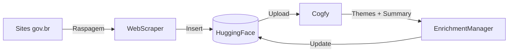
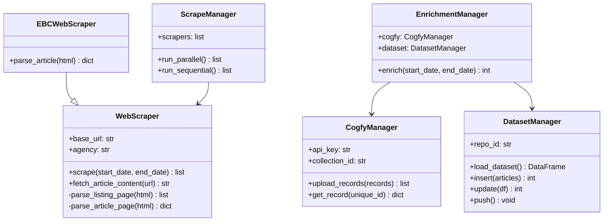

# Módulo: Scraper (govbrnews-scraper)

> Pipeline de coleta e enriquecimento de notícias governamentais.

**Repositório**: [github.com/destaquesgovbr/govbrnews-scraper](https://github.com/destaquesgovbr/govbrnews-scraper)

## Visão Geral

O scraper é responsável por:
1. **Raspar** notícias de ~160+ sites gov.br e EBC
2. **Armazenar** no dataset HuggingFace
3. **Enviar** para classificação no Cogfy
4. **Enriquecer** com temas e resumos gerados por LLM



---

## Stack Tecnológico

| Tecnologia | Versão | Uso |
|------------|--------|-----|
| Python | 3.12+ | Linguagem principal |
| Poetry | 1.7+ | Gerenciamento de dependências |
| BeautifulSoup4 | 4.x | Parsing HTML |
| datasets | HuggingFace | Gerenciamento de dados |
| requests | 2.x | Requisições HTTP |
| retry | - | Lógica de retry |

---

## Estrutura do Repositório

```
govbrnews-scraper/
├── src/
│   ├── main.py                      # CLI principal (Typer)
│   ├── dataset_manager.py           # Gerenciador HuggingFace
│   ├── cogfy_manager.py             # Cliente API Cogfy
│   ├── upload_to_cogfy_manager.py   # Upload para inferência
│   ├── enrichment_manager.py        # Busca e aplica enriquecimento
│   ├── enrichment/
│   │   ├── themes_tree.yaml         # Árvore temática (25 temas)
│   │   └── theme_mapper.py          # Mapeamento código → label
│   └── scraper/
│       ├── webscraper.py            # Scraper genérico gov.br
│       ├── ebc_webscraper.py        # Scraper especializado EBC
│       ├── scrape_manager.py        # Orquestração de scrapers
│       ├── agencies.yaml            # Mapeamento ID → Nome
│       └── site_urls.yaml           # URLs de raspagem (~160+)
├── tests/                           # Testes unitários
├── .github/workflows/
│   ├── main-workflow.yaml           # Pipeline diário (4AM UTC)
│   ├── scraper-dispatch.yaml        # Trigger manual
│   └── docker-build.yaml            # Build de imagem
├── pyproject.toml                   # Dependências Poetry
├── Dockerfile                       # Build Docker
└── README.md
```

---

## Componentes Principais

### 1. WebScraper (`webscraper.py`)

Scraper genérico para sites gov.br.

```python
class WebScraper:
    """Raspa notícias de sites gov.br padrão."""

    def __init__(self, base_url: str, agency: str):
        self.base_url = base_url
        self.agency = agency

    def scrape(self, start_date: date, end_date: date) -> list[dict]:
        """Raspa notícias no intervalo de datas."""
        ...

    def fetch_article_content(self, url: str) -> str:
        """Busca conteúdo completo e converte para Markdown."""
        ...
```

**Campos extraídos:**

| Campo | Descrição |
|-------|-----------|
| `title` | Título da notícia |
| `subtitle` | Subtítulo (quando disponível) |
| `editorial_lead` | Lead editorial / linha fina |
| `url` | URL original |
| `published_at` | Data/hora de publicação (ISO 8601, UTC) |
| `updated_datetime` | Data/hora de atualização |
| `image` | URL da imagem principal |
| `video_url` | URL de vídeo incorporado |
| `content` | Conteúdo em Markdown |
| `category` | Categoria original do site |
| `tags` | Tags/keywords |

**Retry Logic:**
```python
@retry(tries=5, delay=2, backoff=3, jitter=(1,3))
def fetch_page(url: str) -> Response:
    """Fetch com retry exponencial."""
    ...
```

### 2. EBCWebScraper (`ebc_webscraper.py`)

Scraper especializado para sites da EBC (Agência Brasil, etc).

```python
class EBCWebScraper(WebScraper):
    """Scraper para sites EBC com estrutura HTML diferente."""

    def parse_article(self, html: str) -> dict:
        """Parser específico para estrutura EBC."""
        ...
```

### 3. DatasetManager (`dataset_manager.py`)

Gerencia operações com o dataset HuggingFace.

```python
class DatasetManager:
    """Gerenciador de dataset HuggingFace."""

    def __init__(self, repo_id: str = "nitaibezerra/govbrnews"):
        self.repo_id = repo_id

    def load_dataset(self) -> pd.DataFrame:
        """Carrega dataset completo."""
        ...

    def insert(self, articles: list[dict]) -> int:
        """Insere novos artigos (deduplica por unique_id)."""
        ...

    def update(self, df: pd.DataFrame, key: str = "unique_id") -> int:
        """Atualiza registros existentes."""
        ...

    def push(self) -> None:
        """Faz push para HuggingFace."""
        ...
```

**Geração de unique_id:**
```python
def generate_unique_id(agency: str, published_at: int, title: str) -> str:
    """Gera ID único: MD5(agency + published_at + title)"""
    content = f"{agency}{published_at}{title}"
    return hashlib.md5(content.encode()).hexdigest()
```

### 4. CogfyManager (`cogfy_manager.py`)

Cliente para API do Cogfy.

```python
class CogfyManager:
    """Cliente da API Cogfy para classificação e sumarização."""

    def __init__(self, api_key: str, collection_id: str):
        self.api_key = api_key
        self.collection_id = collection_id

    def upload_records(self, records: list[dict]) -> list[str]:
        """Envia registros para inferência LLM."""
        ...

    def get_record(self, unique_id: str) -> dict:
        """Busca registro processado por unique_id."""
        ...
```

### 5. EnrichmentManager (`enrichment_manager.py`)

Busca resultados do Cogfy e atualiza dataset.

```python
class EnrichmentManager:
    """Gerencia enriquecimento de dados via Cogfy."""

    def enrich(self, start_date: date, end_date: date) -> int:
        """Enriquece artigos no intervalo de datas."""
        # 1. Busca artigos no HuggingFace
        # 2. Busca resultados no Cogfy
        # 3. Mapeia códigos para labels
        # 4. Calcula most_specific_theme
        # 5. Atualiza dataset
        ...
```

**Campos enriquecidos:**
- `theme_1_level_1_code/label` - Tema nível 1
- `theme_1_level_2_code/label` - Tema nível 2
- `theme_1_level_3_code/label` - Tema nível 3
- `most_specific_theme_code/label` - Tema mais específico disponível
- `summary` - Resumo gerado por LLM

---

## Diagrama de Classes



---

## CLI (main.py)

O scraper usa Typer para CLI:

```bash
# Ver ajuda
python src/main.py --help

# Comandos disponíveis
python src/main.py scrape          # Raspar sites gov.br
python src/main.py scrape-ebc      # Raspar sites EBC
python src/main.py upload-cogfy    # Upload para Cogfy
python src/main.py enrich          # Buscar enriquecimento
```

### Exemplos de uso

```bash
# Raspar últimos 7 dias
python src/main.py scrape \
  --start-date $(date -v-7d +%Y-%m-%d) \
  --end-date $(date +%Y-%m-%d)

# Raspar período específico
python src/main.py scrape \
  --start-date 2024-12-01 \
  --end-date 2024-12-03

# Raspar EBC com atualização de existentes
python src/main.py scrape-ebc \
  --start-date 2024-12-01 \
  --end-date 2024-12-03 \
  --allow-update

# Upload para Cogfy
python src/upload_to_cogfy_manager.py \
  --start-date 2024-12-01 \
  --end-date 2024-12-03

# Enriquecimento (após ~20 min do upload)
python src/enrichment_manager.py \
  --start-date 2024-12-01 \
  --end-date 2024-12-03
```

---

## Configuração

### Variáveis de Ambiente

```bash
# .env
HF_TOKEN=hf_xxxxxxxxxxxxxxxxxxxxx           # Token HuggingFace (escrita)
COGFY_API_KEY=sk-xxxxxxxxxxxxxxxxxxxxx      # API Key do Cogfy
COGFY_COLLECTION_ID=xxxxxxxx-xxxx-xxxx      # ID da collection Cogfy
```

### Arquivos de Configuração

#### `site_urls.yaml` - URLs de raspagem

```yaml
# Lista de URLs a raspar
urls:
  - url: https://www.gov.br/gestao/pt-br/assuntos/noticias
    agency: gestao
  - url: https://www.gov.br/fazenda/pt-br/assuntos/noticias
    agency: fazenda
  # ... ~160+ URLs
```

#### `agencies.yaml` - Mapeamento de órgãos

```yaml
# Mapeamento ID → Nome completo
agencies:
  gestao: Ministério da Gestão e da Inovação em Serviços Públicos
  fazenda: Ministério da Fazenda
  saude: Ministério da Saúde
  # ... 156 órgãos
```

#### `themes_tree.yaml` - Árvore temática

```yaml
# Taxonomia de 25 temas × 3 níveis
01 - Economia e Finanças:
  01.01 - Política Econômica:
    - 01.01.01 - Política Fiscal
    - 01.01.02 - Autonomia Econômica
  01.02 - Fiscalização e Tributação:
    - 01.02.01 - Fiscalização Econômica
# ...
```

---

## Como Adicionar Nova Fonte

### 1. Adicionar URL

Editar `src/scraper/site_urls.yaml`:

```yaml
urls:
  # Adicionar nova entrada
  - url: https://www.gov.br/novo-orgao/pt-br/assuntos/noticias
    agency: novo-orgao
```

### 2. Adicionar Mapeamento

Editar `src/scraper/agencies.yaml`:

```yaml
agencies:
  novo-orgao: Nome Completo do Novo Órgão
```

### 3. Testar Localmente

```bash
# Testar raspagem do novo órgão
python src/main.py scrape \
  --start-date $(date +%Y-%m-%d) \
  --end-date $(date +%Y-%m-%d)
```

### 4. Verificar Compatibilidade

Se o site tiver estrutura HTML diferente:
1. Analisar estrutura no navegador
2. Criar scraper especializado se necessário
3. Adicionar testes

---

## Testes

```bash
# Executar todos os testes
poetry run pytest

# Com coverage
poetry run pytest --cov=src

# Teste específico
poetry run pytest tests/test_webscraper.py -v

# Testes de integração (requer credenciais)
poetry run pytest tests/integration/ -v
```

---

## Docker

```bash
# Build
docker build -t govbrnews-scraper .

# Executar
docker run --env-file .env govbrnews-scraper \
  python src/main.py scrape --start-date 2024-12-01 --end-date 2024-12-01
```

---

## Links Relacionados

- [Fluxo de Dados](../arquitetura/fluxo-de-dados.md) - Pipeline completo
- [Componentes Estruturantes](../arquitetura/componentes-estruturantes.md) - Árvore temática e órgãos
- [Integração Cogfy](./cogfy-integracao.md) - Detalhes da classificação LLM
- [Pipeline Scraper](../workflows/scraper-pipeline.md) - GitHub Actions
